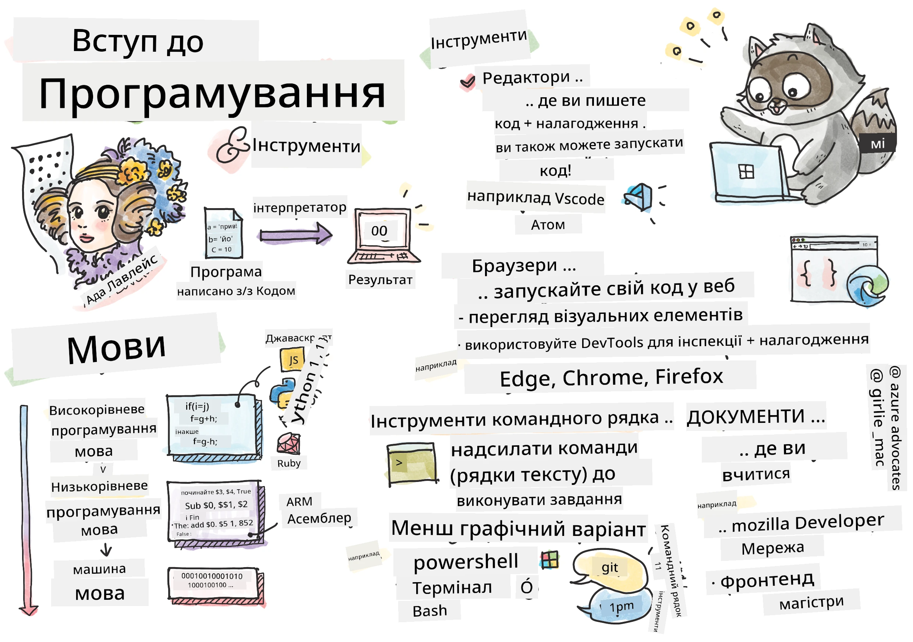
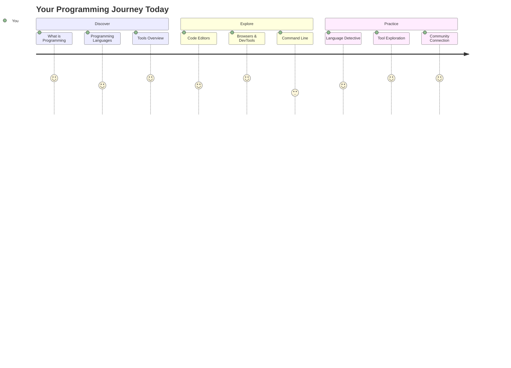
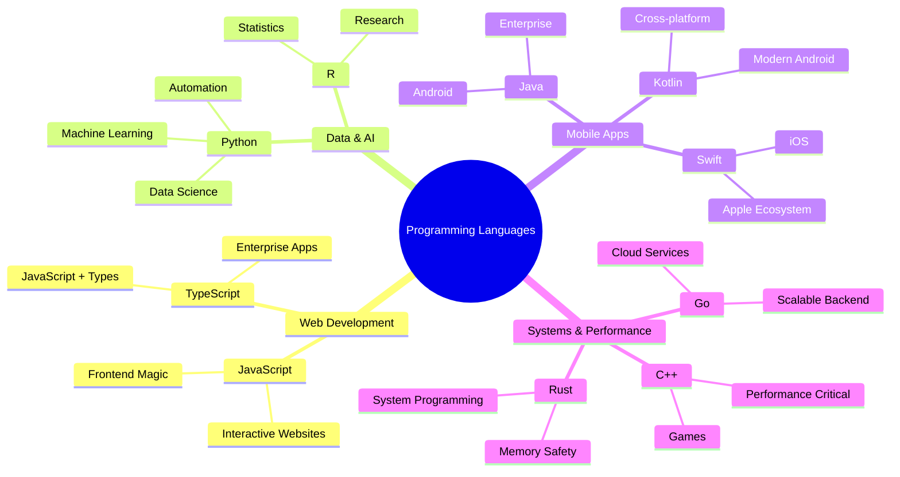
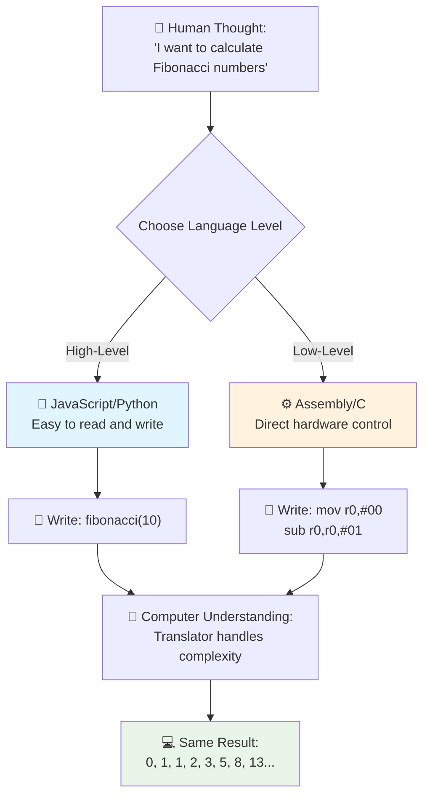
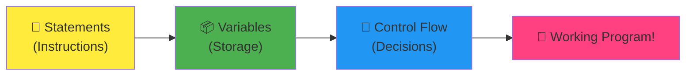
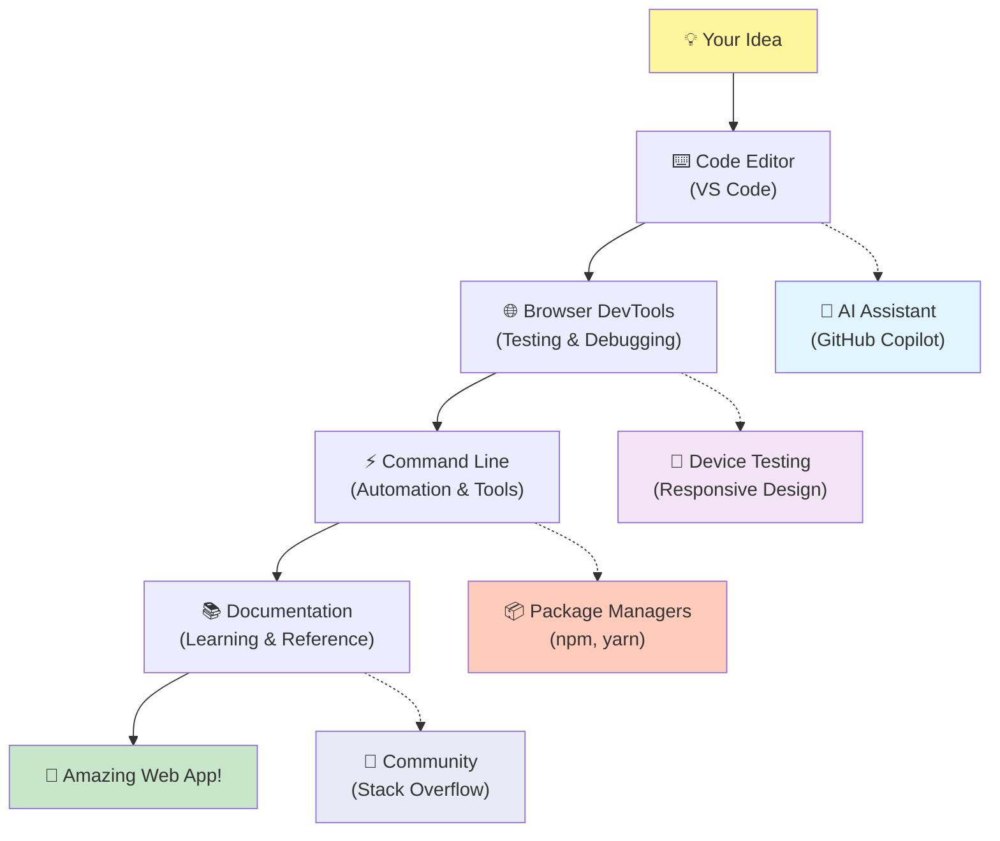
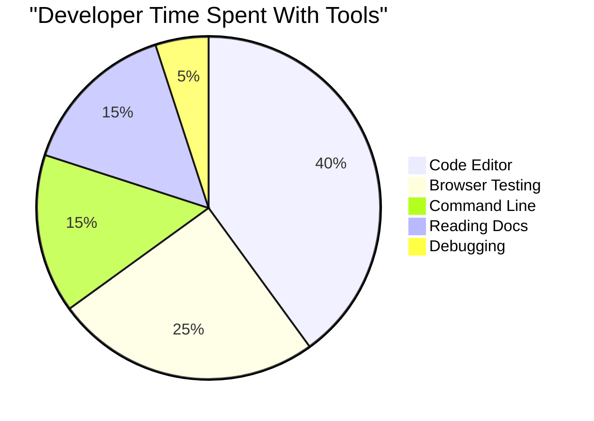
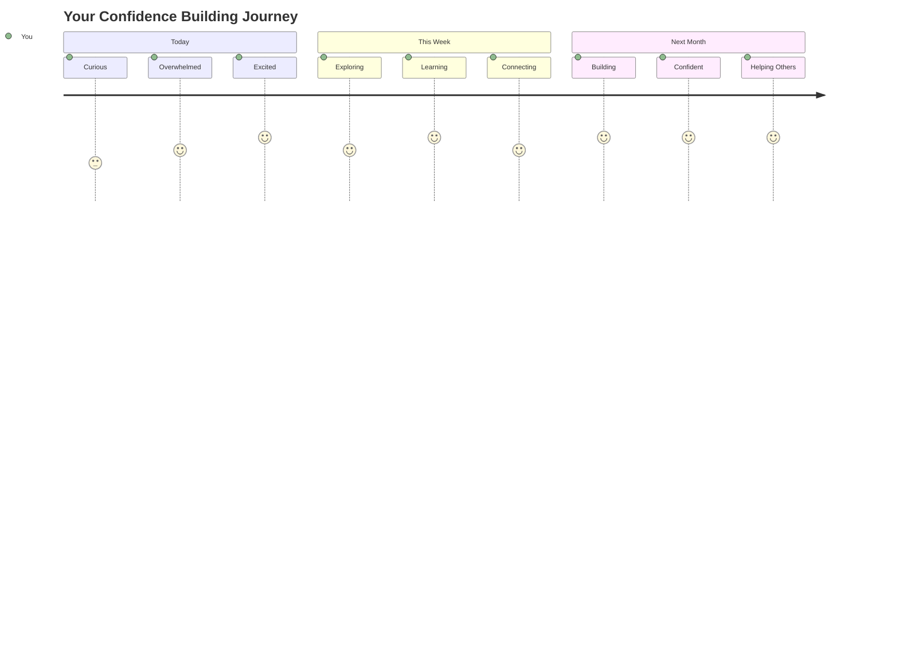

# Вступ до мов програмування та сучасних інструментів розробника

Привіт, майбутній розробнику! 👋 Можу розповісти тобі щось, що досі викликає у мене мурашки щодня? Ти збираєшся дізнатися, що програмування – це не просто про комп’ютери, це про справжні суперсили, які дозволяють втілювати найсміливіші ідеї в життя!

Знаєш той момент, коли ти користуєшся улюбленим додатком, і все працює ідеально? Коли натискаєш кнопку, і відбувається щось абсолютно магічне, що змушує тебе сказати: "Вау, як вони це ЗРОБИЛИ?" Ну, хтось, такий самий, як ти – ймовірно, сидячи у своєму улюбленому кафе о 2 годині ночі з третьою чашкою еспресо – написав код, який створив цю магію. І ось що тебе здивує: до кінця цього уроку ти не тільки зрозумієш, як вони це зробили, але й захочеш спробувати сам!

Слухай, я повністю розумію, якщо програмування здається тобі зараз страшним. Коли я тільки починав, я чесно думав, що потрібно бути якимось математичним генієм або програмувати з п’яти років. Але ось що повністю змінило моє уявлення: програмування – це точно як навчитися розмовляти новою мовою. Ти починаєш з "привіт" і "дякую", потім переходиш до замовлення кави, і перш ніж ти це усвідомиш, ти ведеш глибокі філософські дискусії! Тільки в цьому випадку ти розмовляєш з комп’ютерами, і чесно? Вони найтерплячіші співрозмовники, яких ти коли-небудь зустрічав – вони ніколи не судять твої помилки і завжди готові спробувати знову!

Сьогодні ми дослідимо неймовірні інструменти, які роблять сучасну веб-розробку не просто можливою, а дійсно захоплюючою. Я говорю про ті самі редактори, браузери та робочі процеси, які розробники Netflix, Spotify та твоєї улюбленої студії інді-додатків використовують щодня. І ось частина, яка змусить тебе танцювати від радості: більшість із цих професійних, стандартних для галузі інструментів абсолютно безкоштовні!


> Скетчнот від [Tomomi Imura](https://twitter.com/girlie_mac)



## Давайте перевіримо, що ви вже знаєте!

Перш ніж ми перейдемо до цікавого, мені цікаво – що ви вже знаєте про цей світ програмування? І слухайте, якщо ви дивитеся на ці питання і думаєте: "Я буквально нічого про це не знаю", це не просто нормально, це ідеально! Це означає, що ви саме там, де потрібно. Подумайте про цей тест як про розтяжку перед тренуванням – ми просто розігріваємо мозок!

[Пройдіть тест перед уроком](https://forms.office.com/r/dru4TE0U9n?origin=lprLink)

## Пригода, яку ми збираємося пережити разом

Добре, я щиро переповнений захопленням від того, що ми будемо досліджувати сьогодні! Серйозно, я хотів би побачити ваше обличчя, коли деякі з цих концепцій стануть зрозумілими. Ось неймовірна подорож, яку ми здійснимо разом:

- **Що таке програмування (і чому це найкрутіша річ у світі!)** – Ми дізнаємося, як код буквально є невидимою магією, яка живить усе навколо вас, від будильника, який якось знає, що зараз понеділок, до алгоритму, який ідеально підбирає рекомендації на Netflix.
- **Мови програмування та їх дивовижні особливості** – Уявіть, що ви заходите на вечірку, де кожен має абсолютно різні суперсили та способи вирішення проблем. Саме так виглядає світ мов програмування, і вам сподобається знайомитися з ними!
- **Основні будівельні блоки, які створюють цифрову магію** – Думайте про них як про найкращий набір творчих LEGO. Як тільки ви зрозумієте, як ці частини поєднуються, ви усвідомите, що можете буквально створити все, що тільки уявите.
- **Професійні інструменти, які змушують вас відчувати, ніби вам дали чарівну паличку** – Я не перебільшую – ці інструменти справді змушують вас відчувати, ніби у вас є суперсили, і найкраще? Це ті самі, які використовують професіонали!

> 💡 **Ось у чому справа**: навіть не думайте намагатися запам’ятати все сьогодні! Зараз я просто хочу, щоб ви відчули той спалах захоплення від того, що можливо. Деталі запам’ятаються природно, коли ми будемо практикуватися разом – саме так відбувається справжнє навчання!

> Ви можете пройти цей урок на [Microsoft Learn](https://docs.microsoft.com/learn/modules/web-development-101/introduction-programming/?WT.mc_id=academic-77807-sagibbon)!

## То що ж таке *програмування*?

Добре, давайте розберемося з питанням на мільйон доларів: що ж таке програмування насправді?

Я розповім вам історію, яка повністю змінила моє уявлення про це. Минулого тижня я намагався пояснити мамі, як користуватися новим пультом від нашого смарт-телевізора. Я зловив себе на тому, що кажу щось на кшталт: "Натисни червону кнопку, але не велику червону кнопку, маленьку червону кнопку зліва... ні, з іншого боку... добре, тепер тримай її дві секунди, не одну, не три..." Знайомо? 😅

Це і є програмування! Це мистецтво давати надзвичайно детальні, покрокові інструкції чомусь дуже потужному, але такому, що потребує всього поясненого ідеально. Тільки замість того, щоб пояснювати мамі (яка може запитати "яку червону кнопку?!"), ви пояснюєте комп’ютеру (який просто робить саме те, що ви сказали, навіть якщо те, що ви сказали, не зовсім те, що ви мали на увазі).

Ось що мене вразило, коли я вперше це зрозумів: комп’ютери насправді досить прості в основі. Вони буквально розуміють лише дві речі – 1 і 0, що, по суті, означає "так" і "ні" або "ввімкнено" і "вимкнено". І все! Але ось де це стає магічним – нам не потрібно говорити на мові 1 і 0, як у "Матриці". Тут на допомогу приходять **мови програмування**. Вони як найкращий перекладач у світі, який перетворює ваші абсолютно нормальні людські думки на мову комп’ютера.

І ось що досі викликає у мене мурашки щоранку, коли я прокидаюся: буквально *все* цифрове у вашому житті почалося з когось, такого ж, як ви, ймовірно, сидячи в піжамі з чашкою кави, набираючи код на своєму ноутбуці. Той фільтр Instagram, який робить вас бездоганним? Хтось закодував це. Рекомендація, яка привела вас до вашої нової улюбленої пісні? Розробник створив цей алгоритм. Додаток, який допомагає вам розділити рахунок за вечерю з друзями? Так, хтось подумав: "Це дратує, я думаю, я можу це виправити", а потім... вони це зробили!

Коли ви вчитеся програмувати, ви не просто освоюєте новий навик – ви стаєте частиною цієї неймовірної спільноти вирішувачів проблем, які проводять свої дні, думаючи: "А що, якщо я міг би створити щось, що зробить чийсь день трохи кращим?" Чесно, чи є щось крутіше за це?

✅ **Полювання на цікаві факти**: Ось щось дуже цікаве, що можна пошукати, коли у вас буде вільний момент – як ви думаєте, хто був першим програмістом у світі? Я дам вам підказку: це може бути не той, кого ви очікуєте! Історія цієї людини абсолютно захоплююча і показує, що програмування завжди було про творчий підхід до вирішення проблем і нестандартне мислення.

### 🧠 **Час перевірки: як ви себе почуваєте?**

**Зробіть паузу, щоб подумати:**
- Чи зрозуміла вам тепер ідея "давати інструкції комп’ютерам"?
- Чи можете ви придумати щоденне завдання, яке хотіли б автоматизувати за допомогою програмування?
- Які питання виникають у вас щодо цього всього програмування?

> **Пам’ятайте**: Це абсолютно нормально, якщо деякі концепції зараз здаються вам нечіткими. Вивчення програмування – це як вивчення нової мови – потрібно час, щоб мозок побудував ці нейронні зв’язки. Ви чудово справляєтеся!

## Мови програмування – це як різні смаки магії

Добре, це може звучати дивно, але залишайтеся зі мною – мови програмування дуже схожі на різні стилі музики. Подумайте: у вас є джаз, який плавний і імпровізаційний, рок, який потужний і прямолінійний, класика, яка елегантна і структурована, і хіп-хоп, який творчий і виразний. Кожен стиль має свою атмосферу, свою спільноту пристрасних шанувальників, і кожен ідеально підходить для різних настроїв і випадків.

Мови програмування працюють точно так само! Ви не будете використовувати ту саму мову для створення веселого мобільного додатку, яку використовуєте для обробки величезних обсягів кліматичних даних, так само як ви не будете грати дез-метал на занятті йогою (ну, на більшості занять йогою! 😄).

Але ось що мене абсолютно вражає кожного разу, коли я думаю про це: ці мови – це як мати найтерплячішого, найрозумнішого перекладача у світі, який сидить прямо поруч із вами. Ви можете висловлювати свої ідеї так, як це природно для вашого людського мозку, а вони беруть на себе всю неймовірно складну роботу з перекладу цього на мову 1 і 0, яку комп’ютери насправді розуміють. Це як мати друга, який ідеально володіє і "людською творчістю", і "комп’ютерною логікою" – і вони ніколи не втомлюються, ніколи не потребують перерв на каву і ніколи не судять вас за те, що ви задаєте одне й те ж питання двічі!

### Популярні мови програмування та їх використання



| Мова | Найкраще для | Чому популярна |
|------|--------------|----------------|
| **JavaScript** | Веб-розробка, користувацькі інтерфейси | Працює в браузерах і забезпечує інтерактивність веб-сайтів |
| **Python** | Наука про дані, автоматизація, AI | Легка для читання і навчання, потужні бібліотеки |
| **Java** | Корпоративні додатки, Android-додатки | Незалежна від платформи, надійна для великих систем |
| **C#** | Windows-додатки, розробка ігор | Сильна підтримка екосистеми Microsoft |
| **Go** | Хмарні сервіси, бекенд-системи | Швидка, проста, створена для сучасних обчислень |

### Високорівневі vs. низькорівневі мови

Добре, це була концепція, яка буквально "зламала" мій мозок, коли я тільки починав вчитися, тому я поділюся аналогією, яка нарешті допомогла мені зрозуміти це – і я дуже сподіваюся, що вона допоможе вам теж!

Уявіть, що ви відвідуєте країну, де не говорите мовою, і вам терміново потрібно знайти найближчий туалет (ми всі були в такій ситуації, правда? 😅):

- **Низькорівневе програмування** – це як вивчити місцевий діалект настільки добре, що ви можете спілкуватися з бабусею, яка продає фрукти на розі, використовуючи культурні посилання, місцевий сленг і внутрішні жарти, які зрозуміє тільки той, хто виріс там. Дуже вражаюче і неймовірно ефективно... якщо ви випадково володієте мовою! Але досить складно, коли ви просто намагаєтеся знайти туалет.

- **Високорівневе програмування** – це як мати того дивовижного місцевого друга, який просто вас розуміє. Ви можете сказати "Мені дуже потрібно знайти туалет" звичайною англійською, і вони беруть на себе весь культурний переклад і дають вам інструкції так, щоб це мало сенс для вашого не місцевого мозку.

У термінах програмування:
- **Низькорівневі мови** (як Assembly або C) дозволяють вам вести надзвичайно детальні розмови з фактичним обладнанням комп’ютера, але вам потрібно думати як машина, що... ну, скажімо так, це досить великий ментальний зсув!
- **Високорівневі мови** (як JavaScript, Python або C#) дозволяють вам думати як людина, поки вони беруть на себе всю машинну мову за лаштунками. Крім того, вони мають ці неймовірно гостинні спільноти, повні людей, які пам’ятають, як це бути новачком, і щиро хочуть допомогти!

Вгадайте, з яких я запропоную вам почати? 😉 Високорівневі мови – це як мати тренувальні колеса, які ви ніколи не захочете знімати, тому що вони роблять весь досвід набагато приємнішим!



### Дозвольте показати, чому високорівневі мови набагато дружелюбніші

Добре, я збираюся показати вам щось, що ідеально демонструє, чому я закохався у високорівневі мови, але спочатку – мені потрібно, щоб ви пообіцяли мені щось. Коли ви побачите цей перший приклад коду, не панікуйте! Він має виглядати страшно. Це саме той момент, який я хочу підкреслити!

Ми подивимося на одну й ту ж задачу, написану двома абсолютно різними стилями. Обидва створюють те, що називається послідовністю Фібоначчі – це красивий математичний шаблон, де кожне число є сумою двох попередніх: 0, 1, 1, 2, 3, 5, 8, 13... (Цікаво: ви знайдете цей шаблон буквально всюди в природі – спіралі насіння соняшника, візерунки шишок, навіть спосіб формування галактик!)

Готові побачити різницю? Поїхали!

**Високорівнева мова (JavaScript) – дружня для людини:**

```javascript
// Step 1: Basic Fibonacci setup
const fibonacciCount = 10;
let current = 0;
let next = 1;

console.log('Fibonacci sequence:');
```

**Ось що робить цей код:**
- **Оголошує** константу для визначення кількості чисел Фібоначчі, які ми хочемо створити
- **Ініціалізує** дві змінні для відстеження поточного та наступного чисел у послідовності
- **Встановлює** початкові значення (0 і 1), які визначають шаблон Фібонач
- **Коментарі**: Мови високого рівня заохочують пояснювальні коментарі, які роблять код самодокументованим  
- **Структура**: Логічний потік JavaScript відповідає тому, як люди думають про вирішення проблем крок за кроком  
- **Підтримка**: Оновлення версії JavaScript для різних вимог є простим і зрозумілим  

✅ **Про послідовність Фібоначчі**: Цей абсолютно чудовий числовий патерн (де кожне число дорівнює сумі двох попередніх: 0, 1, 1, 2, 3, 5, 8...) буквально *з'являється всюди* в природі! Ви знайдете його в спіралях соняшників, візерунках шишок, вигинах раковин наутилуса і навіть у тому, як ростуть гілки дерев. Це просто неймовірно, як математика і код можуть допомогти нам зрозуміти і відтворити патерни, які природа використовує для створення краси!

## Основи, які створюють магію

Добре, тепер, коли ви побачили, як виглядають мови програмування в дії, давайте розберемо фундаментальні частини, які складають буквально кожну програму, коли-небудь написану. Думайте про них як про основні інгредієнти вашого улюбленого рецепту – як тільки ви зрозумієте, що кожен з них робить, ви зможете читати і писати код практично будь-якою мовою!

Це трохи схоже на вивчення граматики програмування. Пам'ятаєте, як у школі ви вивчали іменники, дієслова і те, як складати речення? У програмуванні є своя версія граматики, і чесно кажучи, вона набагато логічніша і поблажливіша, ніж граматика англійської мови! 😄

### Інструкції: покрокові вказівки

Почнемо з **інструкцій** – це як окремі речення в розмові з вашим комп'ютером. Кожна інструкція говорить комп'ютеру зробити щось конкретне, як давати вказівки: "Поверни ліворуч тут", "Зупинись на червоному світлі", "Припаркуйся на тому місці".

Що мені подобається в інструкціях, так це те, наскільки вони зазвичай зрозумілі. Подивіться:

```javascript
// Basic statements that perform single actions
const userName = "Alex";                    
console.log("Hello, world!");              
const sum = 5 + 3;                         
```
  
**Ось що робить цей код:**  
- **Оголошує** константну змінну для збереження імені користувача  
- **Відображає** привітальне повідомлення в консоль  
- **Обчислює** і зберігає результат математичної операції  

```javascript
// Statements that interact with web pages
document.title = "My Awesome Website";      
document.body.style.backgroundColor = "lightblue";
```
  
**Крок за кроком, ось що відбувається:**  
- **Змінює** заголовок вебсторінки, який з'являється у вкладці браузера  
- **Змінює** колір фону всього тіла сторінки  

### Змінні: система пам'яті вашої програми

Добре, **змінні** – це, чесно кажучи, одна з моїх улюблених концепцій для викладання, тому що вони дуже схожі на те, що ви вже використовуєте щодня!

Подумайте про список контактів у вашому телефоні. Ви не запам'ятовуєте номери всіх – натомість ви зберігаєте "Мама", "Кращий друг" або "Піцерія, яка доставляє до 2 ночі" і дозволяєте телефону запам'ятовувати фактичні номери. Змінні працюють точно так само! Вони як мітки на контейнерах, де ваша програма може зберігати інформацію і отримувати її пізніше, використовуючи назву, яка дійсно має сенс.

Ось що дійсно круто: змінні можуть змінюватися під час виконання програми (звідси назва "змінна" – бачите, що вони зробили?). Так само, як ви можете оновити контакт піцерії, коли знайдете щось краще, змінні можуть оновлюватися, коли ваша програма отримує нову інформацію або змінюються обставини!

Дозвольте показати вам, наскільки це просто і красиво:

```javascript
// Step 1: Creating basic variables
const siteName = "Weather Dashboard";        
let currentWeather = "sunny";               
let temperature = 75;                       
let isRaining = false;                      
```
  
**Розуміння цих концепцій:**  
- **Зберігайте** незмінні значення у змінних `const` (наприклад, назва сайту)  
- **Використовуйте** `let` для значень, які можуть змінюватися протягом програми  
- **Призначайте** різні типи даних: рядки (текст), числа і булеві значення (true/false)  
- **Обирайте** описові назви, які пояснюють, що містить кожна змінна  

```javascript
// Step 2: Working with objects to group related data
const weatherData = {                       
  location: "San Francisco",
  humidity: 65,
  windSpeed: 12
};
```
  
**У наведеному прикладі ми:**  
- **Створили** об'єкт для групування пов'язаної інформації про погоду  
- **Організували** кілька частин даних під одним ім'ям змінної  
- **Використали** пари ключ-значення для чіткого позначення кожної частини інформації  

```javascript
// Step 3: Using and updating variables
console.log(`${siteName}: Today is ${currentWeather} and ${temperature}°F`);
console.log(`Wind speed: ${weatherData.windSpeed} mph`);

// Updating changeable variables
currentWeather = "cloudy";                  
temperature = 68;                          
```
  
**Давайте розберемо кожну частину:**  
- **Відображаємо** інформацію за допомогою шаблонних літералів із синтаксисом `${}`  
- **Доступ до** властивостей об'єкта за допомогою точкової нотації (`weatherData.windSpeed`)  
- **Оновлюємо** змінні, оголошені з `let`, щоб відобразити змінні умови  
- **Об'єднуємо** кілька змінних для створення змістовних повідомлень  

```javascript
// Step 4: Modern destructuring for cleaner code
const { location, humidity } = weatherData; 
console.log(`${location} humidity: ${humidity}%`);
```
  
**Що потрібно знати:**  
- **Витягуйте** конкретні властивості з об'єктів за допомогою деструктуризації  
- **Створюйте** нові змінні автоматично з тими ж назвами, що й ключі об'єкта  
- **Спрощуйте** код, уникаючи повторюваної точкової нотації  

### Потік управління: навчіть вашу програму думати

Добре, ось де програмування стає абсолютно захоплюючим! **Потік управління** – це, по суті, навчання вашої програми приймати розумні рішення, точно так, як ви робите це щодня, навіть не замислюючись.

Уявіть собі: сьогодні вранці ви, ймовірно, пройшли через щось на кшталт "Якщо йде дощ, я візьму парасольку. Якщо холодно, я одягну куртку. Якщо я запізнююся, я пропущу сніданок і візьму каву по дорозі." Ваш мозок природно слідує цій логіці "якщо-то" десятки разів щодня!

Це те, що робить програми розумними і живими, а не просто слідуванням якомусь нудному, передбачуваному сценарію. Вони можуть фактично оцінювати ситуацію, аналізувати, що відбувається, і відповідати відповідно. Це як дати вашій програмі мозок, який може адаптуватися і приймати рішення!

Хочете побачити, як це працює? Дозвольте показати вам:

```javascript
// Step 1: Basic conditional logic
const userAge = 17;

if (userAge >= 18) {
  console.log("You can vote!");
} else {
  const yearsToWait = 18 - userAge;
  console.log(`You'll be able to vote in ${yearsToWait} year(s).`);
}
```
  
**Ось що робить цей код:**  
- **Перевіряє**, чи відповідає вік користувача вимогам для голосування  
- **Виконує** різні блоки коду залежно від результату умови  
- **Обчислює** і відображає, скільки часу залишилося до права голосу, якщо менше 18 років  
- **Надає** конкретний, корисний зворотний зв'язок для кожного сценарію  

```javascript
// Step 2: Multiple conditions with logical operators
const userAge = 17;
const hasPermission = true;

if (userAge >= 18 && hasPermission) {
  console.log("Access granted: You can enter the venue.");
} else if (userAge >= 16) {
  console.log("You need parent permission to enter.");
} else {
  console.log("Sorry, you must be at least 16 years old.");
}
```
  
**Розбираємо, що тут відбувається:**  
- **Об'єднуємо** кілька умов за допомогою оператора `&&` (і)  
- **Створюємо** ієрархію умов за допомогою `else if` для кількох сценаріїв  
- **Обробляємо** всі можливі випадки за допомогою фінального `else`  
- **Надаємо** чіткий, дієвий зворотний зв'язок для кожної різної ситуації  

```javascript
// Step 3: Concise conditional with ternary operator
const votingStatus = userAge >= 18 ? "Can vote" : "Cannot vote yet";
console.log(`Status: ${votingStatus}`);
```
  
**Що потрібно пам'ятати:**  
- **Використовуйте** тернарний оператор (`? :`) для простих умов із двома варіантами  
- **Пишіть** умову спочатку, потім `?`, потім результат для true, потім `:`, потім результат для false  
- **Застосовуйте** цей шаблон, коли потрібно призначити значення на основі умов  

```javascript
// Step 4: Handling multiple specific cases
const dayOfWeek = "Tuesday";

switch (dayOfWeek) {
  case "Monday":
  case "Tuesday":
  case "Wednesday":
  case "Thursday":
  case "Friday":
    console.log("It's a weekday - time to work!");
    break;
  case "Saturday":
  case "Sunday":
    console.log("It's the weekend - time to relax!");
    break;
  default:
    console.log("Invalid day of the week");
}
```
  
**Цей код виконує наступне:**  
- **Порівнює** значення змінної з кількома конкретними випадками  
- **Групує** схожі випадки разом (робочі дні проти вихідних)  
- **Виконує** відповідний блок коду, коли знайдено збіг  
- **Включає** випадок `default` для обробки несподіваних значень  
- **Використовує** оператори `break`, щоб запобігти виконанню наступного випадку  

> 💡 **Аналогія з реальним світом**: Думайте про потік управління як про найтерплячіший GPS, який дає вам вказівки. Він може сказати: "Якщо на Main Street затори, їдьте по шосе. Якщо на шосе ремонт, спробуйте мальовничий маршрут." Програми використовують точно таку ж умовну логіку, щоб реагувати розумно на різні ситуації і завжди надавати користувачам найкращий можливий досвід.

### 🎯 **Перевірка концепції: освоєння основ**

**Давайте перевіримо, як ви справляєтеся з основами:**  
- Чи можете ви пояснити різницю між змінною і інструкцією своїми словами?  
- Подумайте про реальний сценарій, де ви б використали рішення "якщо-то" (як у нашому прикладі з голосуванням)  
- Що вас здивувало в логіці програмування?  

**Швидкий заряд впевненості:**  

  
✅ **Що буде далі**: Ми будемо отримувати величезне задоволення, заглиблюючись у ці концепції, продовжуючи цю неймовірну подорож разом! Зараз просто зосередьтеся на тому, щоб відчути захоплення від усіх дивовижних можливостей, які чекають попереду. Конкретні навички та техніки запам'ятаються природно, коли ми будемо практикуватися разом – обіцяю, це буде набагато веселіше, ніж ви могли очікувати!

## Інструменти для роботи

Добре, це чесно той момент, коли я настільки схвильований, що ледве можу стриматися! 🚀 Ми збираємося поговорити про неймовірні інструменти, які змусять вас відчути, що вам щойно дали ключі від цифрового космічного корабля.

Знаєте, як у шеф-кухаря є ті ідеально збалансовані ножі, які здаються продовженням його рук? Або як у музиканта є та одна гітара, яка ніби співає, щойно він торкається її? Ну, у розробників є своя версія цих магічних інструментів, і ось що вас абсолютно вразить – більшість із них абсолютно безкоштовні!

Я буквально підстрибую на стільці, думаючи про те, щоб поділитися ними з вами, тому що вони повністю революціонізували те, як ми створюємо програмне забезпечення. Ми говоримо про асистентів програмування на основі штучного інтелекту, які можуть допомогти написати ваш код (я не жартую!), хмарні середовища, де ви можете створювати цілі додатки буквально з будь-якого місця з Wi-Fi, і інструменти для налагодження, настільки складні, що вони схожі на рентгенівське бачення для ваших програм.

І ось частина, яка досі викликає у мене мурашки: це не "інструменти для початківців", які ви переростете. Це ті самі професійні інструменти, які розробники в Google, Netflix і тому інді-студії додатків, яку ви любите, використовують прямо зараз. Ви будете відчувати себе справжнім професіоналом, використовуючи їх!


  
### Редактори коду та IDE: ваші нові цифрові найкращі друзі

Давайте поговоримо про редактори коду – вони серйозно стануть вашими новими улюбленими місцями для проведення часу! Думайте про них як про ваш особистий кодовий притулок, де ви будете проводити більшу частину часу, створюючи і вдосконалюючи свої цифрові творіння.

Але ось що абсолютно магічне в сучасних редакторах: вони не просто модні текстові редактори. Вони як найгеніальніший, підтримуючий наставник програмування, який сидить поруч із вами 24/7. Вони ловлять ваші помилки, перш ніж ви навіть їх помітите, пропонують покращення, які змушують вас виглядати як геній, допомагають зрозуміти, що робить кожен шматок коду, і деякі з них навіть можуть передбачити, що ви збираєтеся написати, і запропонувати завершити ваші думки!

Я пам'ятаю, коли вперше відкрив автозаповнення – я буквально відчував, що живу в майбутньому. Ви починаєте щось писати, і ваш редактор каже: "Гей, ви думали про цю функцію, яка робить саме те, що вам потрібно?" Це як мати читача думок як кодового друга!

**Що робить ці редактори такими неймовірними?**

Сучасні редактори коду пропонують вражаючий набір функцій, розроблених для підвищення вашої продуктивності:

| Функція | Що вона робить | Чому це допомагає |
|---------|----------------|-------------------|
| **Підсвічування синтаксису** | Розфарбовує різні частини вашого коду | Робить код легшим для читання і пошуку помилок |
| **Автозаповнення** | Пропонує код під час введення | Прискорює написання коду і зменшує помилки |
| **Інструменти налагодження** | Допомагають знайти і виправити помилки | Економить години часу на пошук проблем |
| **Розширення** | Додають спеціалізовані функції | Налаштовують редактор для будь-якої технології |
| **AI Асистенти** | Пропонують код і пояснення | Прискорюють навчання і продуктивність |

> 🎥 **Відеоресурс**: Хочете побачити ці інструменти в дії? Перегляньте цей [відео про інструменти для роботи](https://youtube.com/watch?v=69WJeXGBdxg) для всебічного огляду.

#### Рекомендовані редактори для веброзробки

**[Visual Studio Code](https://code.visualstudio.com/?WT.mc_id=academic-77807-sagibbon)** (Безкоштовно)  
- Найпопулярніший серед веброзробників  
- Відмінна екосистема розширень  
- Вбудований термінал і інтеграція з Git  
- **Обов'язкові розширення**:  
  - [GitHub Copilot](https://marketplace.visualstudio.com/items?itemName=GitHub.copilot) - Пропозиції коду на основі AI  
  - [Live Share](https://marketplace.visualstudio.com/items?itemName=MS-vsliveshare.vsliveshare) - Спільна робота в реальному часі  
  - [Prettier](https://marketplace.visualstudio.com/items?itemName=esbenp.prettier-vscode) - Автоматичне форматування коду  
  - [Code Spell Checker](https://marketplace.visualstudio.com/items?itemName=streetsidesoftware.code-spell-checker) - Виявлення помилок у коді  

**[JetBrains WebStorm](https://www.jetbrains.com/webstorm/)** (Платно, безкоштовно для студентів)  
- Розширені інструменти
Коли мені вперше показали DevTools у браузері, я провела близько трьох годин, просто клацаючи все підряд і вигукуючи: "СТОП, ВОНО МОЖЕ РОБИТИ І ЦЕ?!" Ви буквально можете редагувати будь-який сайт у реальному часі, бачити, як швидко все завантажується, тестувати, як ваш сайт виглядає на різних пристроях, і навіть відлагоджувати JavaScript, як справжній профі. Це просто неймовірно!

**Ось чому браузери — ваш секретний інструмент:**

Коли ви створюєте вебсайт або вебдодаток, вам потрібно побачити, як він виглядає і працює в реальному світі. Браузери не лише показують вашу роботу, але й надають детальний зворотний зв'язок про продуктивність, доступність і потенційні проблеми.

#### Інструменти розробника в браузері (DevTools)

Сучасні браузери включають комплексні набори інструментів для розробки:

| Категорія інструментів | Що робить | Приклад використання |
|-------------------------|-----------|----------------------|
| **Інспектор елементів** | Перегляд і редагування HTML/CSS у реальному часі | Налаштування стилів для миттєвого результату |
| **Консоль** | Перегляд повідомлень про помилки та тестування JavaScript | Відлагодження проблем і експерименти з кодом |
| **Монітор мережі** | Відстеження завантаження ресурсів | Оптимізація продуктивності та часу завантаження |
| **Перевірка доступності** | Тестування інклюзивного дизайну | Переконання, що ваш сайт працює для всіх користувачів |
| **Симулятор пристроїв** | Перегляд на різних розмірах екранів | Тестування адаптивного дизайну без використання кількох пристроїв |

#### Рекомендовані браузери для розробки

- **[Chrome](https://developers.google.com/web/tools/chrome-devtools/)** - Стандарт DevTools з обширною документацією
- **[Firefox](https://developer.mozilla.org/docs/Tools)** - Відмінні інструменти для CSS Grid і доступності
- **[Edge](https://docs.microsoft.com/microsoft-edge/devtools-guide-chromium/?WT.mc_id=academic-77807-sagibbon)** - Побудований на Chromium з ресурсами для розробників від Microsoft

> ⚠️ **Важлива порада для тестування**: Завжди тестуйте ваші вебсайти в кількох браузерах! Те, що ідеально працює в Chrome, може виглядати інакше в Safari або Firefox. Професійні розробники тестують у всіх основних браузерах, щоб забезпечити однаковий досвід для користувачів.

### Інструменти командного рядка: ваш шлях до суперсил розробника

Добре, давайте будемо чесними щодо командного рядка, тому що я хочу, щоб ви почули це від когось, хто дійсно розуміє. Коли я вперше побачила його — цей страшний чорний екран із миготливим текстом — я буквально подумала: "Ні, точно ні! Це виглядає як щось із хакерського фільму 1980-х, і я точно недостатньо розумна для цього!" 😅

Але ось що я хотіла б, щоб мені тоді сказали, і що я кажу вам зараз: командний рядок не страшний — це насправді як прямий діалог із вашим комп'ютером. Уявіть це як різницю між замовленням їжі через модний додаток із картинками та меню (що зручно і просто) і заходом у ваш улюблений місцевий ресторан, де шеф-кухар знає, що вам подобається, і може приготувати щось ідеальне, просто почувши "здивуйте мене чимось неймовірним".

Командний рядок — це місце, де розробники відчувають себе справжніми чарівниками. Ви вводите кілька, здавалося б, магічних слів (добре, це просто команди, але вони здаються магічними!), натискаєте Enter, і БАЦ — ви створили структуру проекту, встановили потужні інструменти з усього світу або розгорнули ваш додаток в інтернеті для мільйонів людей. Як тільки ви відчуєте цю силу, це стає досить захоплюючим!

**Чому командний рядок стане вашим улюбленим інструментом:**

Хоча графічні інтерфейси чудово підходять для багатьох завдань, командний рядок перевершує їх у автоматизації, точності та швидкості. Багато інструментів для розробки працюють переважно через інтерфейси командного рядка, і навчання їх ефективному використанню може значно підвищити вашу продуктивність.

```bash
# Step 1: Create and navigate to project directory
mkdir my-awesome-website
cd my-awesome-website
```

**Що робить цей код:**
- **Створює** нову директорію під назвою "my-awesome-website" для вашого проекту
- **Переходить** у щойно створену директорію, щоб почати роботу

```bash
# Step 2: Initialize project with package.json
npm init -y

# Install modern development tools
npm install --save-dev vite prettier eslint
npm install --save-dev @eslint/js
```

**Крок за кроком, ось що відбувається:**
- **Ініціалізує** новий проект Node.js із налаштуваннями за замовчуванням за допомогою `npm init -y`
- **Встановлює** Vite як сучасний інструмент для швидкої розробки та створення продакшн-збірок
- **Додає** Prettier для автоматичного форматування коду та ESLint для перевірки якості коду
- **Використовує** прапорець `--save-dev`, щоб позначити ці залежності як призначені лише для розробки

```bash
# Step 3: Create project structure and files
mkdir src assets
echo '<!DOCTYPE html><html><head><title>My Site</title></head><body><h1>Hello World</h1></body></html>' > index.html

# Start development server
npx vite
```

**У наведеному вище ми:**
- **Організували** наш проект, створивши окремі папки для вихідного коду та ресурсів
- **Згенерували** базовий HTML-файл із правильною структурою документа
- **Запустили** сервер розробки Vite для автоматичного перезавантаження та гарячої заміни модулів

#### Основні інструменти командного рядка для веброзробки

| Інструмент | Призначення | Чому він вам потрібен |
|------------|-------------|-----------------------|
| **[Git](https://git-scm.com/)** | Контроль версій | Відстеження змін, співпраця з іншими, резервне копіювання роботи |
| **[Node.js & npm](https://nodejs.org/)** | JavaScript-оточення та управління пакетами | Запуск JavaScript поза браузерами, встановлення сучасних інструментів розробки |
| **[Vite](https://vitejs.dev/)** | Інструмент збірки та сервер розробки | Надшвидка розробка з гарячою заміною модулів |
| **[ESLint](https://eslint.org/)** | Якість коду | Автоматичне виявлення та виправлення проблем у вашому JavaScript |
| **[Prettier](https://prettier.io/)** | Форматування коду | Підтримка коду уніфікованим і читабельним |

#### Варіанти для різних платформ

**Windows:**
- **[Windows Terminal](https://docs.microsoft.com/windows/terminal/?WT.mc_id=academic-77807-sagibbon)** - Сучасний термінал із багатими функціями
- **[PowerShell](https://docs.microsoft.com/powershell/?WT.mc_id=academic-77807-sagibbon)** 💻 - Потужне середовище для скриптів
- **[Command Prompt](https://docs.microsoft.com/windows-server/administration/windows-commands/?WT.mc_id=academic-77807-sagibbon)** 💻 - Традиційний командний рядок Windows

**macOS:**
- **[Terminal](https://support.apple.com/guide/terminal/)** 💻 - Вбудований додаток терміналу
- **[iTerm2](https://iterm2.com/)** - Покращений термінал із розширеними функціями

**Linux:**
- **[Bash](https://www.gnu.org/software/bash/)** 💻 - Стандартна оболонка Linux
- **[KDE Konsole](https://docs.kde.org/trunk5/en/konsole/konsole/index.html)** - Розширений емулятор терміналу

> 💻 = Встановлено на операційній системі

> 🎯 **Шлях навчання**: Почніть із базових команд, таких як `cd` (зміна директорії), `ls` або `dir` (список файлів) і `mkdir` (створення папки). Практикуйтеся з командами сучасного робочого процесу, такими як `npm install`, `git status` і `code .` (відкриває поточну директорію у VS Code). З часом ви природно освоїте більш складні команди та техніки автоматизації.

### Документація: ваш завжди доступний наставник

Добре, дозвольте мені поділитися маленьким секретом, який змусить вас почуватися набагато краще як новачка: навіть найдосвідченіші розробники проводять величезну частину свого часу, читаючи документацію. І це не тому, що вони не знають, що роблять – це насправді ознака мудрості!

Уявіть документацію як доступ до найтерплячіших, найзнаючих вчителів у світі, які доступні 24/7. Застрягли на проблемі о 2 годині ночі? Документація тут із теплим віртуальним обіймом і саме тією відповіддю, яка вам потрібна. Хочете дізнатися про якусь круту нову функцію, про яку всі говорять? Документація вас підтримує зі зрозумілими прикладами. Прагнете зрозуміти, чому щось працює саме так? Ви здогадалися – документація готова пояснити це так, що нарешті все стане зрозуміло!

Ось що повністю змінило моє сприйняття: світ веброзробки рухається неймовірно швидко, і ніхто (я маю на увазі абсолютно ніхто!) не тримає все в пам'яті. Я бачила, як старші розробники з досвідом понад 15 років шукають базовий синтаксис, і знаєте що? Це не соромно – це розумно! Справа не в тому, щоб мати ідеальну пам'ять; справа в тому, щоб знати, де швидко знайти надійні відповіді і як їх застосувати.

**Ось де відбувається справжня магія:**

Професійні розробники витрачають значну частину свого часу на читання документації – не тому, що вони не знають, що роблять, а тому, що ландшафт веброзробки розвивається так швидко, що залишатися в курсі вимагає постійного навчання. Хороша документація допомагає зрозуміти не лише *як* щось використовувати, але й *чому* і *коли* це робити.

#### Основні ресурси документації

**[Mozilla Developer Network (MDN)](https://developer.mozilla.org/docs/Web)**
- Золотий стандарт документації з вебтехнологій
- Комплексні посібники з HTML, CSS і JavaScript
- Містить інформацію про сумісність із браузерами
- Містить практичні приклади та інтерактивні демо

**[Web.dev](https://web.dev)** (від Google)
- Найкращі практики сучасної веброзробки
- Посібники з оптимізації продуктивності
- Принципи доступності та інклюзивного дизайну
- Кейси з реальних проектів

**[Microsoft Developer Documentation](https://docs.microsoft.com/microsoft-edge/#microsoft-edge-for-developers)**
- Ресурси для розробки під браузер Edge
- Посібники з прогресивних вебдодатків
- Інсайти з кросплатформної розробки

**[Frontend Masters Learning Paths](https://frontendmasters.com/learn/)**
- Структуровані навчальні програми
- Відеокурси від експертів галузі
- Практичні вправи з програмування

> 📚 **Стратегія навчання**: Не намагайтеся запам'ятати документацію – натомість навчіться ефективно її використовувати. Зберігайте закладки часто використовуваних посилань і практикуйте пошук конкретної інформації.

### 🔧 **Перевірка майстерності інструментів: що вас зацікавило?**

**Зробіть паузу і подумайте:**
- Який інструмент вам найбільше хочеться спробувати? (Немає неправильних відповідей!)
- Чи командний рядок все ще здається страшним, чи вам цікаво його освоїти?
- Чи можете ви уявити використання DevTools у браузері, щоб зазирнути за куліси ваших улюблених сайтів?



> **Цікава думка**: Більшість розробників проводять близько 40% свого часу у редакторі коду, але зверніть увагу, скільки часу йде на тестування, навчання та вирішення проблем. Програмування — це не лише написання коду, а й створення досвіду!

✅ **Їжа для роздумів**: Ось щось цікаве для роздумів – як ви думаєте, інструменти для створення вебсайтів (розробка) можуть відрізнятися від інструментів для дизайну їхнього вигляду (дизайн)? Це як різниця між архітектором, який проектує красивий будинок, і будівельником, який його будує. Обидва важливі, але їм потрібні різні набори інструментів! Такий спосіб мислення дійсно допоможе вам побачити загальну картину того, як вебсайти оживають.

## Виклик GitHub Copilot Agent 🚀

Використовуйте режим Agent, щоб виконати наступний виклик:

**Опис:** Дослідіть функції сучасного редактора коду або IDE і продемонструйте, як він може покращити ваш робочий процес як веброзробника.

**Завдання:** Виберіть редактор коду або IDE (наприклад, Visual Studio Code, WebStorm або хмарний IDE). Перелічіть три функції або розширення, які допомагають писати, відлагоджувати або підтримувати код більш ефективно. Для кожного надайте коротке пояснення, як це покращує ваш робочий процес.

---

## 🚀 Виклик

**Ну що, детективе, готові до першої справи?**

Тепер, коли у вас є цей чудовий фундамент, я маю для вас пригоду, яка допоможе вам побачити, наскільки різноманітним і захоплюючим є світ програмування. І слухайте – це не про написання коду, тому ніякого тиску! Уявіть себе детективом мов програмування на вашій першій захоплюючій справі!

**Ваша місія, якщо ви вирішите її прийняти:**
1. **Станьте дослідником мов**: Виберіть три мови програмування з абсолютно різних сфер – можливо, одну для створення вебсайтів, одну для створення мобільних додатків і одну для аналізу даних для науковців. Знайдіть приклади виконання одного простого завдання на кожній мові. Обіцяю, ви будете абсолютно здивовані, наскільки вони можуть відрізнятися, виконуючи одне й те ж завдання!

2. **Розкрийте їхні історії походження**: Що робить кожну мову особливою? Ось цікавий факт – кожна мова програмування була створена тому, що хтось подумав: "Знаєте що? Має бути кращий спосіб вирішити цю конкретну проблему." Чи можете ви з'ясувати, які це були проблеми? Деякі з цих історій дійсно захоплюючі!

3. **Познайомтеся з їхніми спільнотами**: Дізнайтеся, наскільки привітними та захопленими є спільноти кожної мови. Деякі мають мільйони розробників, які діляться знаннями та допомагають один одному, інші – менші, але надзвичайно згуртовані та підтримуючі. Вам сподобається побачити різні "особистості" цих спільнот!

4. **Слухайте своє серце**: Яка мова здається вам найбільш доступною зараз? Не хвилюйтеся про "ідеальний" вибір –
## Огляд і самостійне навчання

**Не поспішайте, досліджуйте і отримуйте задоволення!**

Сьогодні ви охопили багато матеріалу, і це варто пишатися! Тепер настає найцікавіша частина – дослідження тем, які вас зацікавили. Пам'ятайте, це не домашнє завдання – це пригода!

**Зануртеся глибше в те, що вас захоплює:**

**Практикуйтеся з мовами програмування:**
- Відвідайте офіційні сайти 2-3 мов, які привернули вашу увагу. Кожна з них має свою унікальну особливість і історію!
- Спробуйте онлайн-платформи для програмування, такі як [CodePen](https://codepen.io/), [JSFiddle](https://jsfiddle.net/) або [Replit](https://replit.com/). Не бійтеся експериментувати – ви нічого не зламаєте!
- Почитайте про те, як виникла ваша улюблена мова програмування. Серйозно, деякі з цих історій дуже цікаві і допоможуть вам зрозуміти, чому мови працюють саме так.

**Освойте нові інструменти:**
- Завантажте Visual Studio Code, якщо ще цього не зробили – це безкоштовно, і вам точно сподобається!
- Проведіть кілька хвилин, переглядаючи ринок розширень. Це як магазин додатків для вашого редактора коду!
- Відкрийте інструменти розробника у вашому браузері і просто клацайте по всьому. Не хвилюйтеся, якщо щось незрозуміло – просто ознайомтеся з тим, що там є.

**Приєднуйтесь до спільноти:**
- Слідкуйте за спільнотами розробників на [Dev.to](https://dev.to/), [Stack Overflow](https://stackoverflow.com/) або [GitHub](https://github.com/). Спільнота програмістів дуже привітна до новачків!
- Дивіться відео для початківців про програмування на YouTube. Є багато чудових авторів, які пам'ятають, як це – починати з нуля.
- Розгляньте можливість приєднатися до місцевих зустрічей або онлайн-спільнот. Повірте, розробники люблять допомагати новачкам!

> 🎯 **Ось що я хочу, щоб ви запам'ятали**: Ніхто не очікує, що ви станете майстром програмування за одну ніч! Зараз ви просто знайомитеся з цим дивовижним новим світом, частиною якого ви скоро станете. Не поспішайте, насолоджуйтеся подорожжю і пам'ятайте – кожен розробник, яким ви захоплюєтеся, колись сидів точно там, де ви зараз, відчуваючи захоплення і, можливо, трохи розгубленість. Це абсолютно нормально, і це означає, що ви на правильному шляху!


## Завдання

[Читання документації](assignment.md)

> 💡 **Невеликий поштовх для вашого завдання**: Мені дуже хотілося б побачити, як ви досліджуєте інструменти, які ми ще не розглядали! Пропустіть редактори, браузери та інструменти командного рядка, про які ми вже говорили – існує цілий неймовірний всесвіт дивовижних інструментів для розробки, які тільки чекають, щоб їх відкрили. Шукайте ті, які активно підтримуються і мають живі, корисні спільноти (зазвичай вони мають найкращі навчальні матеріали і найбільш підтримуючих людей, коли ви неминуче застрягнете і потребуватимете дружньої допомоги).

---

## 🚀 Хронологія вашої подорожі у програмуванні

### ⚡ **Що можна зробити за наступні 5 хвилин**
- [ ] Додайте в закладки 2-3 сайти мов програмування, які вас зацікавили
- [ ] Завантажте Visual Studio Code, якщо ще цього не зробили
- [ ] Відкрийте інструменти розробника у вашому браузері (F12) і клацайте по будь-якому сайту
- [ ] Приєднайтеся до однієї спільноти програмістів (Dev.to, Reddit r/webdev або Stack Overflow)

### ⏰ **Що можна досягти за годину**
- [ ] Пройдіть тест після уроку і обміркуйте свої відповіді
- [ ] Налаштуйте VS Code з розширенням GitHub Copilot
- [ ] Спробуйте приклад "Hello World" у 2 різних мовах програмування онлайн
- [ ] Подивіться відео "День із життя розробника" на YouTube
- [ ] Почніть своє детективне дослідження мов програмування (з виклику)

### 📅 **Ваш тижневий виклик**
- [ ] Виконайте завдання і досліджуйте 3 нових інструменти для розробки
- [ ] Слідкуйте за 5 розробниками або акаунтами про програмування у соціальних мережах
- [ ] Спробуйте створити щось маленьке в CodePen або Replit (навіть просто "Привіт, [Ваше ім'я]!")
- [ ] Прочитайте один блог розробника про його шлях у програмуванні
- [ ] Приєднайтеся до віртуальної зустрічі або подивіться виступ про програмування
- [ ] Почніть вивчати обрану вами мову за допомогою онлайн-уроків

### 🗓️ **Ваш місячний трансформаційний план**
- [ ] Створіть свій перший невеликий проєкт (навіть простий вебсайт рахується!)
- [ ] Внесіть свій вклад у проєкт з відкритим кодом (почніть з виправлення документації)
- [ ] Станьте наставником для когось, хто тільки починає свій шлях у програмуванні
- [ ] Створіть свій вебсайт-портфоліо розробника
- [ ] Зв'яжіться з місцевими спільнотами розробників або навчальними групами
- [ ] Почніть планувати свою наступну навчальну мету

### 🎯 **Фінальна рефлексія**

**Перед тим, як рухатися далі, знайдіть момент, щоб відсвяткувати:**
- Що вас сьогодні найбільше захопило у програмуванні?
- Який інструмент або концепцію ви хочете дослідити першою?
- Як ви почуваєтеся, починаючи цей шлях у програмуванні?
- Яке одне питання ви хотіли б зараз задати розробнику?



> 🌟 **Пам'ятайте**: Кожен експерт колись був новачком. Кожен старший розробник колись відчував себе так само, як ви зараз – захопленим, можливо, трохи розгубленим, і точно цікавим до того, що можливо. Ви в чудовій компанії, і ця подорож буде неймовірною. Ласкаво просимо до дивовижного світу програмування! 🎉

---

**Відмова від відповідальності**:  
Цей документ був перекладений за допомогою сервісу автоматичного перекладу [Co-op Translator](https://github.com/Azure/co-op-translator). Хоча ми прагнемо до точності, будь ласка, майте на увазі, що автоматичні переклади можуть містити помилки або неточності. Оригінальний документ на його рідній мові слід вважати авторитетним джерелом. Для критичної інформації рекомендується професійний людський переклад. Ми не несемо відповідальності за будь-які непорозуміння або неправильні тлумачення, що виникають внаслідок використання цього перекладу.