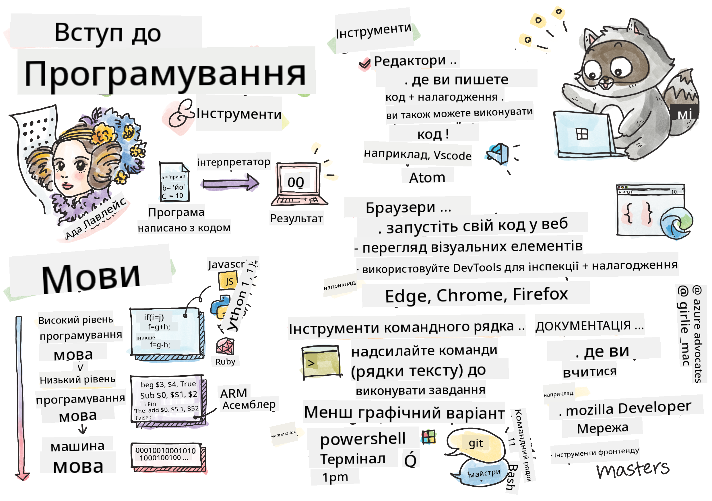

<!--
CO_OP_TRANSLATOR_METADATA:
{
  "original_hash": "3e0da5eb9b275fe3cb431033c1413ec2",
  "translation_date": "2025-10-24T15:28:10+00:00",
  "source_file": "1-getting-started-lessons/1-intro-to-programming-languages/README.md",
  "language_code": "uk"
}
-->
# Вступ до мов програмування та сучасних інструментів розробника

Привіт, майбутній розробнику! 👋 Можу я розповісти тобі щось, що досі викликає у мене мурашки? Ти збираєшся дізнатися, що програмування – це не просто про комп'ютери, це про справжні суперсили, які дозволяють втілювати найсміливіші ідеї в життя!

Ти знаєш той момент, коли користуєшся улюбленим додатком, і все працює ідеально? Коли натискаєш кнопку, і відбувається щось абсолютно магічне, що змушує тебе сказати: "Вау, як вони це зробили?" Ну, хтось, такий самий, як ти – ймовірно, сидячи у своєму улюбленому кафе о другій ночі з третьою чашкою еспресо – написав код, який створив цю магію. І ось що тебе вразить: до кінця цього уроку ти не тільки зрозумієш, як вони це зробили, але й захочеш спробувати сам!

Слухай, я цілком розумію, якщо програмування здається тобі зараз страшним. Коли я тільки починав, я чесно думав, що потрібно бути якимось математичним генієм або програмувати з п'яти років. Але ось що повністю змінило моє уявлення: програмування – це точно як навчитися розмовляти новою мовою. Ти починаєш з "привіт" і "дякую", потім переходиш до замовлення кави, і перш ніж ти це зрозумієш, ти ведеш глибокі філософські дискусії! Тільки в цьому випадку ти ведеш розмови з комп'ютерами, і чесно? Вони найтерплячіші співрозмовники, яких ти коли-небудь зустрічав – вони ніколи не судять твої помилки і завжди готові спробувати знову!

Сьогодні ми дослідимо неймовірні інструменти, які роблять сучасну веб-розробку не просто можливою, а дійсно захоплюючою. Я говорю про ті самі редактори, браузери та робочі процеси, які розробники Netflix, Spotify та твоєї улюбленої студії інді-додатків використовують щодня. І ось частина, яка змусить тебе танцювати від радості: більшість із цих професійних інструментів, які є стандартом у галузі, абсолютно безкоштовні!


> Скетчнот від [Tomomi Imura](https://twitter.com/girlie_mac)

## Давайте дізнаємося, що ви вже знаєте!

Перш ніж ми перейдемо до цікавого, мені цікаво – що ви вже знаєте про цей світ програмування? І слухайте, якщо ви дивитеся на ці питання і думаєте: "Я буквально нічого не знаю про це," – це не просто нормально, це ідеально! Це означає, що ви саме там, де потрібно. Подумайте про цей тест як про розтяжку перед тренуванням – ми просто розігріваємо мозок!

[Пройдіть тест перед уроком](https://forms.office.com/r/dru4TE0U9n?origin=lprLink)

## Пригода, яку ми збираємося пережити разом

Окей, я щиро переповнений захопленням від того, що ми будемо досліджувати сьогодні! Серйозно, я хотів би побачити ваше обличчя, коли деякі з цих концепцій стануть зрозумілими. Ось неймовірна подорож, яку ми здійснимо разом:

- **Що таке програмування (і чому це найкрутіша річ у світі!)** – Ми дізнаємося, як код буквально є невидимою магією, яка керує всім навколо вас, від будильника, який якось знає, що зараз понеділок, до алгоритму, який ідеально підбирає рекомендації на Netflix
- **Мови програмування та їх дивовижні особливості** – Уявіть, що ви заходите на вечірку, де кожна людина має абсолютно різні суперсили та способи вирішення проблем. Ось так виглядає світ мов програмування, і вам сподобається знайомитися з ними!
- **Основні будівельні блоки, які створюють цифрову магію** – Подумайте про них як про найкращий творчий набір LEGO. Як тільки ви зрозумієте, як ці частини взаємодіють, ви усвідомите, що можете створити буквально все, що тільки уявите
- **Професійні інструменти, які змушують вас відчувати себе чарівником** – Я не перебільшую – ці інструменти дійсно змушують вас відчувати себе супергероєм, і найкраще? Це ті самі інструменти, які використовують професіонали!

> 💡 **Ось що важливо**: Навіть не думайте намагатися запам'ятати все сьогодні! Зараз я просто хочу, щоб ви відчули той іскристий захват від того, що можливо. Деталі запам'ятаються природно, коли ми будемо практикуватися разом – саме так відбувається справжнє навчання!

> Ви можете пройти цей урок на [Microsoft Learn](https://docs.microsoft.com/learn/modules/web-development-101/introduction-programming/?WT.mc_id=academic-77807-sagibbon)!

## То що ж таке *програмування*?

Гаразд, давайте розберемося з питанням на мільйон доларів: що ж таке програмування насправді?

Я розповім вам історію, яка повністю змінила моє уявлення про це. Минулого тижня я намагався пояснити мамі, як користуватися новим пультом від нашого смарт-телевізора. Я зловив себе на тому, що кажу щось на кшталт: "Натисни червону кнопку, але не велику червону кнопку, а маленьку червону кнопку зліва... ні, з іншого боку... добре, тепер тримай її дві секунди, не одну, не три..." Звучить знайомо? 😅

Це і є програмування! Це мистецтво давати надзвичайно детальні, покрокові інструкції чомусь дуже потужному, але такому, що потребує абсолютно точних вказівок. Тільки замість пояснень мамі (яка може запитати "яку червону кнопку?!"), ви пояснюєте комп'ютеру (який просто робить те, що ви сказали, навіть якщо це не зовсім те, що ви мали на увазі).

Ось що мене вразило, коли я вперше це зрозумів: комп'ютери насправді досить прості в основі. Вони буквально розуміють лише дві речі – 1 і 0, що, по суті, означає "так" і "ні" або "ввімкнено" і "вимкнено". І ось де це стає магічним – нам не потрібно говорити мовою 1 і 0, як у "Матриці". Тут на допомогу приходять **мови програмування**. Вони як найкращий перекладач у світі, який перетворює ваші звичайні людські думки на мову комп'ютера.

І ось що досі викликає у мене мурашки щоранку, коли я прокидаюся: буквально *все* цифрове у вашому житті почалося з когось, такого ж, як ви, ймовірно, сидячи у піжамі з чашкою кави, набираючи код на своєму ноутбуці. Той фільтр Instagram, який робить вас бездоганним? Хтось закодував це. Рекомендація, яка привела вас до вашої нової улюбленої пісні? Розробник створив цей алгоритм. Додаток, який допомагає вам розділити рахунок за вечерю з друзями? Так, хтось подумав: "Це дратує, я впевнений, що можу це виправити," і потім... вони це зробили!

Коли ви вчитеся програмувати, ви не просто освоюєте новий навик – ви стаєте частиною цієї неймовірної спільноти вирішувачів проблем, які проводять свої дні, думаючи: "А що, якщо я міг би створити щось, що зробить чийсь день трохи кращим?" Чесно, чи є щось крутіше за це?

✅ **Полювання на цікавий факт**: Ось щось дуже круте, що можна пошукати, коли у вас буде вільна хвилина – як ви думаєте, хто був першим програмістом у світі? Я дам вам підказку: це може бути не той, кого ви очікуєте! Історія цієї людини абсолютно захоплююча і показує, що програмування завжди було про творче вирішення проблем і нестандартне мислення.

## Мови програмування – це як різні смаки магії

Окей, це може звучати дивно, але залишайтеся зі мною – мови програмування дуже схожі на різні стилі музики. Подумайте про це: у вас є джаз, який плавний і імпровізаційний, рок, який потужний і прямолінійний, класика, яка елегантна і структурована, і хіп-хоп, який творчий і виразний. Кожен стиль має свою атмосферу, свою спільноту пристрасних фанатів, і кожен ідеально підходить для різних настроїв і випадків.

Мови програмування працюють точно так само! Ви не будете використовувати ту саму мову для створення веселих мобільних ігор, яку використовуєте для обробки величезних обсягів кліматичних даних, так само як ви не будете грати дез-метал на заняттях йогою (ну, принаймні, на більшості занять йогою! 😄).

Але ось що мене абсолютно вражає кожного разу, коли я про це думаю: ці мови – це як мати найтерплячішого, найрозумнішого перекладача у світі, який сидить поруч із вами. Ви можете висловлювати свої ідеї так, як це природно для вашого людського мозку, а вони беруть на себе всю неймовірно складну роботу з перекладу цього на мову 1 і 0, яку комп'ютери дійсно розуміють. Це як мати друга, який ідеально володіє і "людською творчістю," і "комп'ютерною логікою" – і він ніколи не втомлюється, ніколи не потребує перерв на каву і ніколи не судить вас за те, що ви задаєте одне й те ж питання двічі!

### Популярні мови програмування та їх використання

| Мова | Найкраще для | Чому популярна |
|------|--------------|----------------|
| **JavaScript** | Веб-розробка, користувацькі інтерфейси | Працює в браузерах і забезпечує інтерактивність веб-сайтів |
| **Python** | Наука про дані, автоматизація, штучний інтелект | Легка для читання і навчання, потужні бібліотеки |
| **Java** | Корпоративні додатки, Android-додатки | Незалежна від платформи, надійна для великих систем |
| **C#** | Додатки для Windows, розробка ігор | Сильна підтримка екосистеми Microsoft |
| **Go** | Хмарні сервіси, бекенд-системи | Швидка, проста, створена для сучасних обчислень |

### Мови високого рівня проти низького рівня

Окей, це була концепція, яка буквально перевернула моє уявлення, коли я тільки починав вчитися, тому я поділюся аналогією, яка нарешті допомогла мені зрозуміти це – і я дуже сподіваюся, що вона допоможе вам теж!

Уявіть, що ви відвідуєте країну, де не говорите мовою, і вам терміново потрібно знайти найближчий туалет (ми всі були там, правда? 😅):

- **Програмування низького рівня** – це як вивчити місцевий діалект настільки добре, що ви можете спілкуватися з бабусею, яка продає фрукти на розі, використовуючи культурні посилання, місцевий сленг і внутрішні жарти, які розуміє тільки той, хто виріс там. Дуже вражаюче і неймовірно ефективно... якщо ви випадково володієте мовою! Але досить складно, коли ви просто намагаєтеся знайти туалет.

- **Програмування високого рівня** – це як мати того дивовижного місцевого друга, який просто розуміє вас. Ви можете сказати "Мені дуже потрібно знайти туалет" звичайною англійською, і вони беруть на себе весь культурний переклад і дають вам інструкції так, щоб це мало сенс для вашого немісцевого мозку.

У термінах програмування:
- **Мови низького рівня** (як Assembly або C) дозволяють вам вести надзвичайно детальні розмови з апаратним забезпеченням комп'ютера, але вам потрібно думати як машина, що... ну, скажімо так, це досить великий ментальний зсув!
- **Мови високого рівня** (як JavaScript, Python або C#) дозволяють вам думати як людина, поки вони беруть на себе всю машинну мову за лаштунками. Крім того, вони мають неймовірно привітні спільноти, повні людей, які пам'ятають, як це було бути новачком, і щиро хочуть допомогти!

Вгадайте, з яких я запропоную вам почати? 😉 Мови високого рівня – це як навчальні колеса, які ви ніколи не захочете знімати, тому що вони роблять весь досвід набагато приємнішим!

### Дозвольте показати, чому мови високого рівня набагато дружелюбніші

Гаразд, я збираюся показати вам щось, що ідеально демонструє, чому я закохався в мови високого рівня, але спочатку – мені потрібно, щоб ви пообіцяли мені щось. Коли ви побачите перший приклад коду, не панікуйте! Він має виглядати страшно. Це саме те, що я хочу показати!

Ми подивимося на одну й ту ж задачу, написану в двох абсолютно різних стилях. Обидва створюють те, що називається послідовністю Фібоначчі – це прекрасний математичний шаблон, де кожне число є сумою двох попередніх: 0, 1, 1, 2, 3, 5, 8, 13... (Цікавий факт: ви знайдете цей шаблон буквально всюди в природі – спіралі насіння соняшника, візерунки шишок, навіть спосіб формування галактик!)

Готові побачити різницю? Поїхали!

**Мова високого рівня (JavaScript) – дружня для людини:**

```javascript
// Step 1: Basic Fibonacci setup
const fibonacciCount = 10;
let current = 0;
let next = 1;

console.log('Fibonacci sequence:');
```

**Ось що робить цей код:**
- **Оголошуємо** константу для визначення кількості чисел Фібоначчі, які ми хочемо згенерувати
- **Ініціалізуємо** дві змінні для відстеження поточного і наступного числа в послідовності
- **Встановлюємо** початкові значення (0 і 1), які визначають шаблон Фібоначчі
- **Виводимо** заголовок для ідентифікації нашого результату

```javascript
// Step 2: Generate the sequence with a loop
for (let i = 0; i < fibonacciCount; i++) {
  console.log(`Position ${i + 1}: ${current}`);
  
  // Calculate next number in sequence
  const sum = current + next;
  current = next;
  next = sum;
}
```

**Розбираємо, що тут відбувається:**
- **Цикл** через кожну позицію в нашій послідовності за допомогою `for` циклу
- **Виводимо** кожне число з його позицією за допомогою форматування шаблонних літералів
- **Розраховуємо** наступне число Фібоначчі, додаючи поточне і наступне значення
- **Оновлюємо** наші змінні для переходу до наступної ітерації

```javascript
// Step 3: Modern functional approach
const generateFibonacci = (count) => {
  const sequence = [0, 1];
  
  for (let i = 2; i < count; i++) {
    sequence[i] = sequence[i - 1] + sequence[i - 2];
  }
  
  return sequence;
};

// Usage example
const fibSequence = generateFibonacci(10);
console.log(fibSequence);
```

**У наведеному вище ми:**
- **Створили** багаторазову функцію за допомогою сучасного синтаксису стрілкових функцій
- **Побудували** масив для збереження повної послідовності, а не вив
✅ **Про послідовність Фібоначчі**: Цей неймовірно красивий числовий ряд (де кожне число дорівнює сумі двох попередніх: 0, 1, 1, 2, 3, 5, 8...) буквально *з'являється всюди* в природі! Ви знайдете його в спіралях соняшників, візерунках шишок, вигинах раковин наутилуса і навіть у тому, як ростуть гілки дерев. Це просто вражає, як математика і код можуть допомогти нам зрозуміти і відтворити візерунки, які природа використовує для створення краси!


## Основи, які створюють магію

Добре, тепер, коли ви побачили, як виглядають мови програмування в дії, давайте розберемо фундаментальні частини, які складають буквально кожну програму, коли-небудь написану. Думайте про них як про основні інгредієнти вашого улюбленого рецепту – як тільки ви зрозумієте, що кожен з них робить, ви зможете читати і писати код практично будь-якою мовою!

Це трохи схоже на вивчення граматики програмування. Пам'ятаєте, як у школі ви вивчали іменники, дієслова і як складати речення? У програмуванні є своя версія граматики, і чесно кажучи, вона набагато логічніша і поблажливіша, ніж граматика англійської мови! 😄

### Інструкції: Покрокові вказівки

Почнемо з **інструкцій** – це як окремі речення в розмові з вашим комп'ютером. Кожна інструкція говорить комп'ютеру зробити щось конкретне, як давати вказівки: "Поверни ліворуч тут", "Зупинись на червоному світлі", "Припаркуйся на тому місці".

Що мені подобається в інструкціях, так це те, наскільки вони зазвичай зрозумілі. Ось приклад:

```javascript
// Basic statements that perform single actions
const userName = "Alex";                    
console.log("Hello, world!");              
const sum = 5 + 3;                         
```

**Ось що робить цей код:**
- **Оголошує** константну змінну для збереження імені користувача
- **Відображає** привітальне повідомлення в консольному виводі
- **Обчислює** і зберігає результат математичної операції

```javascript
// Statements that interact with web pages
document.title = "My Awesome Website";      
document.body.style.backgroundColor = "lightblue";
```

**Покроково, ось що відбувається:**
- **Змінює** заголовок вебсторінки, який з'являється на вкладці браузера
- **Змінює** колір фону всього тіла сторінки

### Змінні: Система пам'яті вашої програми

Добре, **змінні** – це, чесно кажучи, одна з моїх улюблених концепцій для викладання, тому що вони дуже схожі на те, що ви вже використовуєте щодня!

Подумайте про список контактів у вашому телефоні. Ви не запам'ятовуєте номери всіх – замість цього ви зберігаєте "Мама", "Кращий друг" або "Піцерія, яка доставляє до 2 ночі" і дозволяєте телефону запам'ятовувати фактичні номери. Змінні працюють точно так само! Вони як мітки на контейнерах, де ваша програма може зберігати інформацію і отримувати її пізніше, використовуючи назву, яка має сенс.

Ось що дійсно круто: змінні можуть змінюватися під час виконання програми (звідси назва "змінна" – бачите, що вони зробили?). Так само, як ви можете оновити контакт піцерії, коли знайдете ще кращу, змінні можуть оновлюватися, коли ваша програма отримує нову інформацію або змінюються обставини!

Дозвольте показати вам, наскільки це просто і красиво:

```javascript
// Step 1: Creating basic variables
const siteName = "Weather Dashboard";        
let currentWeather = "sunny";               
let temperature = 75;                       
let isRaining = false;                      
```

**Розуміння цих концепцій:**
- **Зберігайте** незмінні значення в змінних `const` (наприклад, назва сайту)
- **Використовуйте** `let` для значень, які можуть змінюватися протягом програми
- **Призначайте** різні типи даних: рядки (текст), числа і булеві значення (true/false)
- **Вибирайте** описові назви, які пояснюють, що містить кожна змінна

```javascript
// Step 2: Working with objects to group related data
const weatherData = {                       
  location: "San Francisco",
  humidity: 65,
  windSpeed: 12
};
```

**У наведеному вище прикладі ми:**
- **Створили** об'єкт для групування пов'язаної інформації про погоду
- **Організували** кілька частин даних під одним ім'ям змінної
- **Використали** пари ключ-значення для чіткого позначення кожного елемента інформації

```javascript
// Step 3: Using and updating variables
console.log(`${siteName}: Today is ${currentWeather} and ${temperature}°F`);
console.log(`Wind speed: ${weatherData.windSpeed} mph`);

// Updating changeable variables
currentWeather = "cloudy";                  
temperature = 68;                          
```

**Давайте розберемо кожну частину:**
- **Відображаємо** інформацію за допомогою шаблонних літералів із синтаксисом `${}`
- **Доступ до** властивостей об'єкта за допомогою точкової нотації (`weatherData.windSpeed`)
- **Оновлюємо** змінні, оголошені за допомогою `let`, щоб відобразити змінні умови
- **Комбінуємо** кілька змінних для створення змістовних повідомлень

```javascript
// Step 4: Modern destructuring for cleaner code
const { location, humidity } = weatherData; 
console.log(`${location} humidity: ${humidity}%`);
```

**Що потрібно знати:**
- **Витягуйте** конкретні властивості з об'єктів за допомогою деструктуризації
- **Створюйте** нові змінні автоматично з тими ж іменами, що й ключі об'єкта
- **Спрощуйте** код, уникаючи повторюваної точкової нотації

### Управління потоком: Навчіть вашу програму думати

Добре, тут програмування стає абсолютно вражаючим! **Управління потоком** – це, по суті, навчання вашої програми приймати розумні рішення, точно так само, як ви робите це щодня, навіть не замислюючись.

Уявіть собі: сьогодні вранці ви, ймовірно, пройшли через щось на кшталт "Якщо йде дощ, я візьму парасольку. Якщо холодно, я одягну куртку. Якщо я запізнююся, я пропущу сніданок і візьму каву по дорозі." Ваш мозок природно слідує цій логіці "якщо-то" десятки разів щодня!

Це те, що робить програми розумними і живими, а не просто слідують якомусь нудному, передбачуваному сценарію. Вони можуть фактично дивитися на ситуацію, оцінювати, що відбувається, і відповідати відповідно. Це як дати вашій програмі мозок, який може адаптуватися і приймати рішення!

Хочете побачити, як це працює? Дозвольте показати вам:

```javascript
// Step 1: Basic conditional logic
const userAge = 17;

if (userAge >= 18) {
  console.log("You can vote!");
} else {
  const yearsToWait = 18 - userAge;
  console.log(`You'll be able to vote in ${yearsToWait} year(s).`);
}
```

**Ось що робить цей код:**
- **Перевіряє**, чи відповідає вік користувача вимогам для голосування
- **Виконує** різні блоки коду залежно від результату умови
- **Обчислює** і відображає, скільки часу залишилося до права голосу, якщо менше 18 років
- **Надає** конкретний, корисний зворотний зв'язок для кожного сценарію

```javascript
// Step 2: Multiple conditions with logical operators
const userAge = 17;
const hasPermission = true;

if (userAge >= 18 && hasPermission) {
  console.log("Access granted: You can enter the venue.");
} else if (userAge >= 16) {
  console.log("You need parent permission to enter.");
} else {
  console.log("Sorry, you must be at least 16 years old.");
}
```

**Розбираємо, що тут відбувається:**
- **Комбінуємо** кілька умов за допомогою оператора `&&` (і)
- **Створюємо** ієрархію умов за допомогою `else if` для кількох сценаріїв
- **Обробляємо** всі можливі випадки за допомогою остаточного оператора `else`
- **Надаємо** чіткий, дієвий зворотний зв'язок для кожної різної ситуації

```javascript
// Step 3: Concise conditional with ternary operator
const votingStatus = userAge >= 18 ? "Can vote" : "Cannot vote yet";
console.log(`Status: ${votingStatus}`);
```

**Що потрібно пам'ятати:**
- **Використовуйте** тернарний оператор (`? :`) для простих умов із двома варіантами
- **Пишіть** умову спочатку, потім `?`, потім результат для true, потім `:`, потім результат для false
- **Застосовуйте** цей шаблон, коли потрібно призначити значення на основі умов

```javascript
// Step 4: Handling multiple specific cases
const dayOfWeek = "Tuesday";

switch (dayOfWeek) {
  case "Monday":
  case "Tuesday":
  case "Wednesday":
  case "Thursday":
  case "Friday":
    console.log("It's a weekday - time to work!");
    break;
  case "Saturday":
  case "Sunday":
    console.log("It's the weekend - time to relax!");
    break;
  default:
    console.log("Invalid day of the week");
}
```

**Цей код виконує наступне:**
- **Порівнює** значення змінної з кількома конкретними випадками
- **Групує** схожі випадки разом (робочі дні проти вихідних)
- **Виконує** відповідний блок коду, коли знайдено збіг
- **Включає** випадок `default` для обробки несподіваних значень
- **Використовує** оператори `break`, щоб запобігти виконанню наступного випадку

> 💡 **Аналогія з реальним світом**: Думайте про управління потоком як про GPS, який дає вам найтерплячіші вказівки. Він може сказати: "Якщо на Main Street затори, скористайтеся шосе. Якщо на шосе ремонт, спробуйте мальовничий маршрут." Програми використовують точно таку ж умовну логіку, щоб розумно реагувати на різні ситуації і завжди надавати користувачам найкращий можливий досвід.

✅ **Що буде далі**: Ми будемо мати абсолютний вибух, заглиблюючись у ці концепції, продовжуючи цю неймовірну подорож разом! Зараз просто зосередьтеся на тому, щоб відчути захоплення від усіх дивовижних можливостей, які чекають попереду. Конкретні навички та техніки запам'ятаються природно, коли ми будемо практикуватися разом – обіцяю, це буде набагато веселіше, ніж ви могли очікувати!


## Інструменти для роботи

Добре, це чесно те, що мене так захоплює, що я ледве можу стриматися! 🚀 Ми збираємося поговорити про неймовірні інструменти, які змусять вас відчути, що вам щойно дали ключі від цифрового космічного корабля.

Ви знаєте, як у шеф-кухаря є ті ідеально збалансовані ножі, які здаються продовженням його рук? Або як у музиканта є та одна гітара, яка ніби співає, щойно він торкається її? Ну, у розробників є своя версія цих магічних інструментів, і ось що вас абсолютно вразить – більшість із них абсолютно безкоштовні!

Я буквально підстрибую на своєму стільці, думаючи про те, щоб поділитися ними з вами, тому що вони повністю революціонізували те, як ми створюємо програмне забезпечення. Ми говоримо про асистентів програмування на основі штучного інтелекту, які можуть допомогти написати ваш код (я не жартую!), хмарні середовища, де ви можете створювати цілі додатки буквально з будь-якого місця з Wi-Fi, і інструменти для налагодження, настільки складні, що вони схожі на рентгенівське бачення для ваших програм.

І ось частина, яка досі викликає у мене мурашки: це не "інструменти для початківців", які ви переростете. Це ті самі професійні інструменти, які розробники в Google, Netflix і тому інді-студії додатків, яку ви любите, використовують прямо зараз. Ви будете відчувати себе справжнім професіоналом, використовуючи їх!


### Редактори коду та IDE: Ваші нові цифрові найкращі друзі

Давайте поговоримо про редактори коду – вони серйозно стануть вашими новими улюбленими місцями для проведення часу! Думайте про них як про ваш особистий кодовий притулок, де ви будете проводити більшу частину часу, створюючи і вдосконалюючи свої цифрові творіння.

Але ось що абсолютно магічне в сучасних редакторах: вони не просто модні текстові редактори. Вони як найгеніальніший, найпідтримуючий наставник програмування, який сидить поруч із вами 24/7. Вони ловлять ваші помилки, перш ніж ви навіть їх помітите, пропонують покращення, які змушують вас виглядати як геній, допомагають зрозуміти, що робить кожен шматок коду, і деякі з них навіть можуть передбачити, що ви збираєтеся написати, і запропонувати завершити ваші думки!

Я пам'ятаю, коли вперше відкрив автозаповнення – я буквально відчував, що живу в майбутньому. Ви починаєте щось писати, і ваш редактор каже: "Гей, ви думали про цю функцію, яка робить саме те, що вам потрібно?" Це як мати читача думок як кодового друга!

**Що робить ці редактори такими неймовірними?**

Сучасні редактори коду пропонують вражаючий набір функцій, призначених для підвищення вашої продуктивності:

| Функція | Що вона робить | Чому це допомагає |
|---------|----------------|-------------------|
| **Підсвічування синтаксису** | Розфарбовує різні частини вашого коду | Робить код легшим для читання і пошуку помилок |
| **Автозаповнення** | Пропонує код під час введення | Прискорює написання коду і зменшує помилки |
| **Інструменти налагодження** | Допомагають знайти і виправити помилки | Економлять години часу на пошук проблем |
| **Розширення** | Додають спеціалізовані функції | Налаштовують ваш редактор для будь-якої технології |
| **AI Асистенти** | Пропонують код і пояснення | Прискорюють навчання і продуктивність |

> 🎥 **Відеоресурс**: Хочете побачити ці інструменти в дії? Перегляньте [відео про інструменти для роботи](https://youtube.com/watch?v=69WJeXGBdxg) для всебічного огляду.

#### Рекомендовані редактори для веб-розробки

**[Visual Studio Code](https://code.visualstudio.com/?WT.mc_id=academic-77807-sagibbon)** (Безкоштовно)
- Найпопулярніший серед веб-розробників
- Відмінна екосистема розширень
- Вбудований термінал і інтеграція з Git
- **Обов'язкові розширення**:
  - [GitHub Copilot](https://marketplace.visualstudio.com/items?itemName=GitHub.copilot) - Пропозиції коду на основі AI
  - [Live Share](https://marketplace.visualstudio.com/items?itemName=MS-vsliveshare.vsliveshare) - Спільна робота в реальному часі
  - [Prettier](https://marketplace.visualstudio.com/items?itemName=esbenp.prettier-vscode) - Автоматичне форматування коду
  - [Code Spell Checker](https://marketplace.visualstudio.com/items?itemName=streetsidesoftware.code-spell-checker) - Виявлення помилок у коді

**[JetBrains WebStorm](https://www.jetbrains.com/webstorm/)** (Платно, безкоштовно для студентів)
- Розширені інструменти налагодження і тестування
- Інтелектуальне автозаповнення коду
- Вбудований контроль версій

**Хмарні IDE** (Різні ціни)
- [GitHub Codespaces](https://github.com/features/codespaces) - Повний VS Code у вашому браузері
- [Replit](https://replit.com/) - Чудово для навчання і обміну кодом
- [StackBlitz](https://stackblitz.com/) - Миттєва розробка веб-додатків повного стеку

> 💡 **Порада для початку**: Почніть із Visual Studio Code – він безкоштовний, широко використовується в індустрії і має величезну спільноту, яка створює корисні навчальні матеріали і розширення.


### Веб-браузери: Ваш секретний лабораторний інструмент для розробки

Добре, приготуйтеся до того, щоб ваш розум був повністю вражений! Ви знає
| **Консоль** | Перегляд повідомлень про помилки та тестування JavaScript | Виправлення проблем і експерименти з кодом |
| **Моніторинг мережі** | Відстеження завантаження ресурсів | Оптимізація продуктивності та часу завантаження |
| **Перевірка доступності** | Тестування інклюзивного дизайну | Переконайтеся, що ваш сайт працює для всіх користувачів |
| **Симулятор пристроїв** | Попередній перегляд на різних розмірах екранів | Тестування адаптивного дизайну без використання кількох пристроїв |

#### Рекомендовані браузери для розробки

- **[Chrome](https://developers.google.com/web/tools/chrome-devtools/)** - Індустріальний стандарт DevTools з детальною документацією
- **[Firefox](https://developer.mozilla.org/docs/Tools)** - Відмінні інструменти для CSS Grid та доступності
- **[Edge](https://docs.microsoft.com/microsoft-edge/devtools-guide-chromium/?WT.mc_id=academic-77807-sagibbon)** - Побудований на Chromium з ресурсами для розробників від Microsoft

> ⚠️ **Важлива порада для тестування**: Завжди тестуйте ваші вебсайти в різних браузерах! Те, що ідеально працює в Chrome, може виглядати інакше в Safari або Firefox. Професійні розробники тестують у всіх основних браузерах, щоб забезпечити стабільний досвід для користувачів.

### Інструменти командного рядка: ваш шлях до суперсил розробника

Добре, давайте будемо чесними щодо командного рядка, тому що я хочу, щоб ви почули це від когось, хто дійсно розуміє. Коли я вперше побачив його – просто цей страшний чорний екран з миготливим текстом – я буквально подумав: "Ні, абсолютно ні! Це виглядає як щось із хакерського фільму 1980-х, і я точно недостатньо розумний для цього!" 😅

Але ось що я хотів би, щоб хтось сказав мені тоді, і що я кажу вам зараз: командний рядок не страшний – це насправді як прямий діалог з вашим комп'ютером. Уявіть це як різницю між замовленням їжі через модний додаток із картинками та меню (що зручно і просто) і заходом у ваш улюблений місцевий ресторан, де шеф-кухар знає, що вам подобається, і може приготувати щось ідеальне, просто почувши "здивуйте мене чимось чудовим".

Командний рядок – це місце, де розробники відчувають себе справжніми чарівниками. Ви вводите кілька, здається, магічних слів (добре, це просто команди, але вони здаються магічними!), натискаєте Enter, і БАЦ – ви створили цілі структури проектів, встановили потужні інструменти з усього світу або розгорнули ваш додаток в інтернеті для мільйонів людей. Як тільки ви відчуєте цю силу, це стає досить захоплюючим!

**Чому командний рядок стане вашим улюбленим інструментом:**

Хоча графічні інтерфейси чудово підходять для багатьох завдань, командний рядок перевершує в автоматизації, точності та швидкості. Багато інструментів для розробки працюють переважно через інтерфейси командного рядка, і навчання їх ефективному використанню може значно підвищити вашу продуктивність.

```bash
# Step 1: Create and navigate to project directory
mkdir my-awesome-website
cd my-awesome-website
```

**Що робить цей код:**
- **Створює** нову директорію під назвою "my-awesome-website" для вашого проекту
- **Переходить** у новостворену директорію, щоб почати роботу

```bash
# Step 2: Initialize project with package.json
npm init -y

# Install modern development tools
npm install --save-dev vite prettier eslint
npm install --save-dev @eslint/js
```

**Крок за кроком, що відбувається:**
- **Ініціалізує** новий проект Node.js з налаштуваннями за замовчуванням за допомогою `npm init -y`
- **Встановлює** Vite як сучасний інструмент для швидкої розробки та збірки для продакшн
- **Додає** Prettier для автоматичного форматування коду та ESLint для перевірки якості коду
- **Використовує** прапорець `--save-dev`, щоб позначити ці залежності як тільки для розробки

```bash
# Step 3: Create project structure and files
mkdir src assets
echo '<!DOCTYPE html><html><head><title>My Site</title></head><body><h1>Hello World</h1></body></html>' > index.html

# Start development server
npx vite
```

**У наведеному вище ми:**
- **Організували** наш проект, створивши окремі папки для вихідного коду та ресурсів
- **Згенерували** базовий HTML-файл із правильною структурою документа
- **Запустили** сервер розробки Vite для автоматичного перезавантаження та гарячої заміни модулів

#### Основні інструменти командного рядка для веброзробки

| Інструмент | Призначення | Чому він вам потрібен |
|------------|-------------|-----------------------|
| **[Git](https://git-scm.com/)** | Контроль версій | Відстеження змін, співпраця з іншими, резервне копіювання роботи |
| **[Node.js & npm](https://nodejs.org/)** | JavaScript runtime та управління пакетами | Запуск JavaScript поза браузерами, встановлення сучасних інструментів розробки |
| **[Vite](https://vitejs.dev/)** | Інструмент збірки та сервер розробки | Надшвидка розробка з гарячою заміною модулів |
| **[ESLint](https://eslint.org/)** | Якість коду | Автоматичне виявлення та виправлення проблем у вашому JavaScript |
| **[Prettier](https://prettier.io/)** | Форматування коду | Підтримка коду уніфікованим і читабельним |

#### Варіанти для різних платформ

**Windows:**
- **[Windows Terminal](https://docs.microsoft.com/windows/terminal/?WT.mc_id=academic-77807-sagibbon)** - Сучасний, багатофункціональний термінал
- **[PowerShell](https://docs.microsoft.com/powershell/?WT.mc_id=academic-77807-sagibbon)** 💻 - Потужне середовище для скриптів
- **[Command Prompt](https://docs.microsoft.com/windows-server/administration/windows-commands/?WT.mc_id=academic-77807-sagibbon)** 💻 - Традиційний командний рядок Windows

**macOS:**
- **[Terminal](https://support.apple.com/guide/terminal/)** 💻 - Вбудований термінал
- **[iTerm2](https://iterm2.com/)** - Покращений термінал з розширеними функціями

**Linux:**
- **[Bash](https://www.gnu.org/software/bash/)** 💻 - Стандартна оболонка Linux
- **[KDE Konsole](https://docs.kde.org/trunk5/en/konsole/konsole/index.html)** - Розширений емулятор терміналу

> 💻 = Попередньо встановлено в операційній системі

> 🎯 **Шлях навчання**: Почніть з базових команд, таких як `cd` (зміна директорії), `ls` або `dir` (список файлів) і `mkdir` (створення папки). Практикуйте сучасні команди робочого процесу, такі як `npm install`, `git status` і `code .` (відкриває поточну директорію у VS Code). З часом ви природно освоїте більш складні команди та техніки автоматизації.

### Документація: ваш завжди доступний наставник

Добре, дозвольте мені поділитися маленьким секретом, який змусить вас почуватися набагато краще як новачка: навіть найдосвідченіші розробники витрачають величезну частину свого часу на читання документації. І це не тому, що вони не знають, що роблять – це насправді ознака мудрості!

Уявіть документацію як доступ до найтерплячіших, найзнаючих вчителів у світі, які доступні 24/7. Застрягли на проблемі о 2 годині ночі? Документація тут із теплим віртуальним обіймом і саме тією відповіддю, яка вам потрібна. Хочете дізнатися про якусь круту нову функцію, про яку всі говорять? Документація вас підтримує з покроковими прикладами. Прагнете зрозуміти, чому щось працює саме так? Ви здогадалися – документація готова пояснити це так, що нарешті стане зрозуміло!

Ось що повністю змінило мою перспективу: світ веброзробки рухається неймовірно швидко, і ніхто (я маю на увазі абсолютно ніхто!) не запам'ятовує все. Я бачив, як старші розробники з 15+ роками досвіду шукають базовий синтаксис, і знаєте що? Це не соромно – це розумно! Справа не в ідеальній пам'яті, а в тому, щоб знати, де швидко знайти надійні відповіді і як їх застосувати.

**Ось де відбувається справжня магія:**

Професійні розробники витрачають значну частину свого часу на читання документації – не тому, що вони не знають, що роблять, а тому, що ландшафт веброзробки розвивається так швидко, що залишатися актуальним вимагає постійного навчання. Хороша документація допомагає зрозуміти не лише *як* використовувати щось, але й *чому* та *коли* це використовувати.

#### Основні ресурси документації

**[Mozilla Developer Network (MDN)](https://developer.mozilla.org/docs/Web)**
- Золотий стандарт документації з вебтехнологій
- Комплексні посібники з HTML, CSS та JavaScript
- Містить інформацію про сумісність браузерів
- Пропонує практичні приклади та інтерактивні демо

**[Web.dev](https://web.dev)** (від Google)
- Найкращі практики сучасної веброзробки
- Посібники з оптимізації продуктивності
- Принципи доступності та інклюзивного дизайну
- Кейси з реальних проектів

**[Microsoft Developer Documentation](https://docs.microsoft.com/microsoft-edge/#microsoft-edge-for-developers)**
- Ресурси для розробки в браузері Edge
- Посібники з прогресивних вебдодатків
- Інсайти для кросплатформної розробки

**[Frontend Masters Learning Paths](https://frontendmasters.com/learn/)**
- Структуровані навчальні програми
- Відеокурси від експертів галузі
- Практичні вправи з програмування

> 📚 **Стратегія навчання**: Не намагайтеся запам'ятати документацію – натомість навчіться ефективно її використовувати. Додайте в закладки часто використовувані посилання та практикуйте пошук конкретної інформації.

✅ **Їжа для роздумів**: Ось щось цікаве для роздумів – як ви думаєте, чим інструменти для створення вебсайтів (розробка) можуть відрізнятися від інструментів для дизайну їхнього вигляду (дизайн)? Це як різниця між архітектором, який проектує красивий будинок, і підрядником, який його будує. Обидва важливі, але потребують різних наборів інструментів! Такий підхід допоможе вам побачити загальну картину того, як створюються вебсайти.

## Виклик агента GitHub Copilot 🚀

Використовуйте режим Agent, щоб виконати наступний виклик:

**Опис:** Дослідіть функції сучасного редактора коду або IDE та продемонструйте, як він може покращити ваш робочий процес як веброзробника.

**Завдання:** Виберіть редактор коду або IDE (наприклад, Visual Studio Code, WebStorm або хмарний IDE). Перелічіть три функції або розширення, які допомагають ефективніше писати, налагоджувати або підтримувати код. Для кожної функції надайте коротке пояснення, як вона покращує ваш робочий процес.

---

## 🚀 Виклик

**Ну що, детективе, готовий до першої справи?**

Тепер, коли у вас є цей чудовий фундамент, я маю для вас пригоду, яка допоможе вам побачити, наскільки різноманітним і захоплюючим є світ програмування. І слухайте – це не про написання коду зараз, тому ніякого тиску! Уявіть себе детективом мов програмування на своєму першому захоплюючому завданні!

**Ваша місія, якщо ви вирішите її прийняти:**
1. **Станьте дослідником мов**: Виберіть три мови програмування з абсолютно різних сфер – можливо, одну для створення вебсайтів, одну для мобільних додатків і одну для аналізу даних для науковців. Знайдіть приклади виконання одного простого завдання на кожній мові. Обіцяю, ви будете вражені, наскільки вони можуть відрізнятися, виконуючи одне й те ж завдання!

2. **Розкрийте їхні історії походження**: Що робить кожну мову особливою? Ось цікавий факт – кожна мова програмування була створена тому, що хтось подумав: "Знаєте що? Має бути кращий спосіб вирішити цю конкретну проблему." Чи можете ви з'ясувати, які це були проблеми? Деякі з цих історій дійсно захоплюючі!

3. **Познайомтеся з спільнотами**: Перевірте, наскільки привітною та пристрасною є спільнота кожної мови. Деякі мають мільйони розробників, які діляться знаннями та допомагають один одному, інші – менші, але надзвичайно згуртовані та підтримуючі. Вам сподобається бачити різні "особистості" цих спільнот!

4. **Слухайте свої відчуття**: Яка мова здається вам найбільш доступною зараз? Не хвилюйтеся про "ідеальний" вибір – просто слухайте свої інстинкти! Тут немає неправильних відповідей, і ви завжди можете досліджувати інші пізніше.

**Бонусне завдання детектива**: Дізнайтеся, які великі вебсайти або додатки створені на кожній мові. Гарантую, ви будете шоковані, дізнавшись, що живить Instagram, Netflix або ту мобільну гру, від якої ви не можете відірватися!

> 💡 **Пам'ятайте**: Ви не намагаєтесь стати експертом у будь-якій з цих мов сьогодні. Ви просто знайомитеся з "районом", перш ніж вирішити, де хочете оселитися. Не поспішайте, отримуйте задоволення від процесу, і нехай ваша цікавість веде вас!

## Давайте відсвяткуємо те, що ви відкрили!

Ого, ви засвоїли стільки неймовірної інформації сьогодні! Я щиро радий бачити, скільки з цього захоплюючого шляху залишилося з вами. І пам'ятайте – це не тест, де потрібно все зробити ідеально. Це більше як святкування всього класного, що ви дізналися про цей захоплюючий світ, у який ви збираєтеся зануритися!

[Пройдіть тест після уроку](https://ff-quizzes.netlify.app/web/)

## Огляд і самостійне навчання

**Не поспішайте досліджувати і отримуйте задоволення від процесу!**

Сьогодні ви охопили багато тем, і це те, чим можна пишатися! Тепер настає найцікавіша частина – дослідження тем, які викликали вашу цікавість. Пам'ятайте, це не домашнє завдання – це пригода!

**Зануртеся глибше в те, що вас захоплює:**

**Практикуйтеся з мовами програмування:**
- Відвідайте офіційні вебсайти 2-3 мов, які вас зацікавили. Кожна має свою особливу "особистість" і історію!
- Спробуйте онлайн-майданчики для кодування, такі як [CodePen](https://codepen.io/), [JSFiddle](https://jsfiddle.net/) або [Re
- Перегляньте відео про програмування для початківців на YouTube. Є багато чудових авторів, які пам'ятають, як це — починати з нуля.
- Розгляньте можливість приєднатися до місцевих зустрічей або онлайн-спільнот. Повірте, розробники люблять допомагати новачкам!

> 🎯 **Слухайте, ось що я хочу, щоб ви запам'ятали**: Від вас не очікують, що ви станете майстром програмування за одну ніч! Зараз ви просто знайомитеся з цим дивовижним новим світом, частиною якого ви скоро станете. Не поспішайте, насолоджуйтеся подорожжю і пам'ятайте – кожен розробник, яким ви захоплюєтеся, колись сидів точно там, де ви зараз, відчуваючи захоплення і, можливо, трохи розгубленості. Це абсолютно нормально, і це означає, що ви все робите правильно!


## Завдання

[Читання документації](assignment.md)

> 💡 **Невеликий поштовх для вашого завдання**: Мені дуже хотілося б побачити, як ви досліджуєте інструменти, які ми ще не розглядали! Пропустіть редактори, браузери та інструменти командного рядка, про які ми вже говорили – існує цілий неймовірний всесвіт дивовижних інструментів для розробки, які тільки чекають, щоб їх відкрили. Шукайте ті, які активно підтримуються і мають живі, корисні спільноти (зазвичай вони мають найкращі навчальні матеріали і найбільш підтримуючих людей, коли ви неминуче застрягнете і вам знадобиться дружня допомога).

---

**Відмова від відповідальності**:  
Цей документ був перекладений за допомогою сервісу автоматичного перекладу [Co-op Translator](https://github.com/Azure/co-op-translator). Хоча ми прагнемо до точності, будь ласка, майте на увазі, що автоматичні переклади можуть містити помилки або неточності. Оригінальний документ на його рідній мові слід вважати авторитетним джерелом. Для критичної інформації рекомендується професійний людський переклад. Ми не несемо відповідальності за будь-які непорозуміння або неправильні тлумачення, що виникають внаслідок використання цього перекладу.