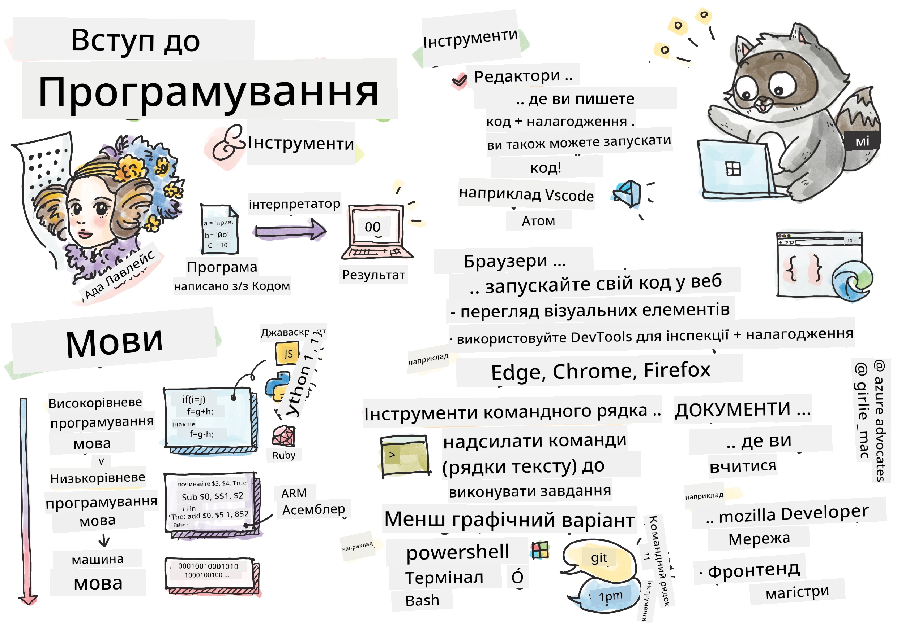
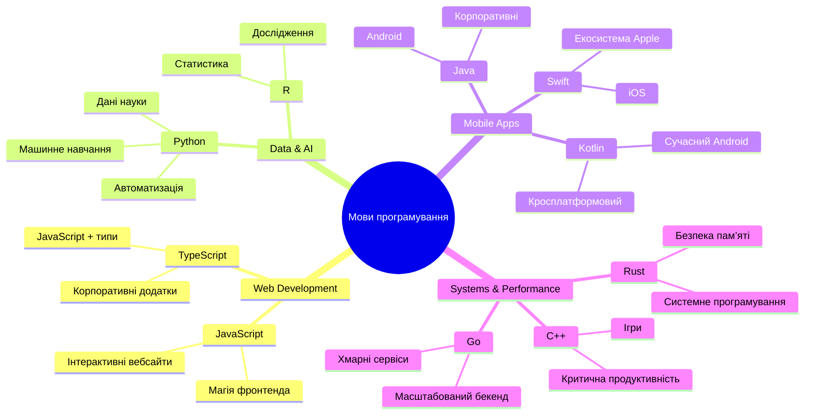
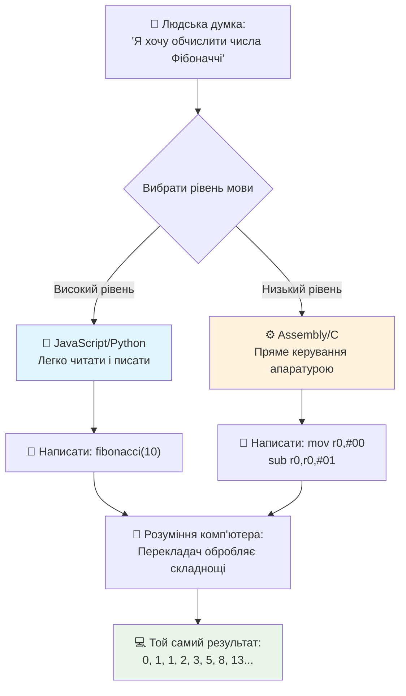
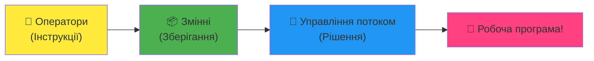
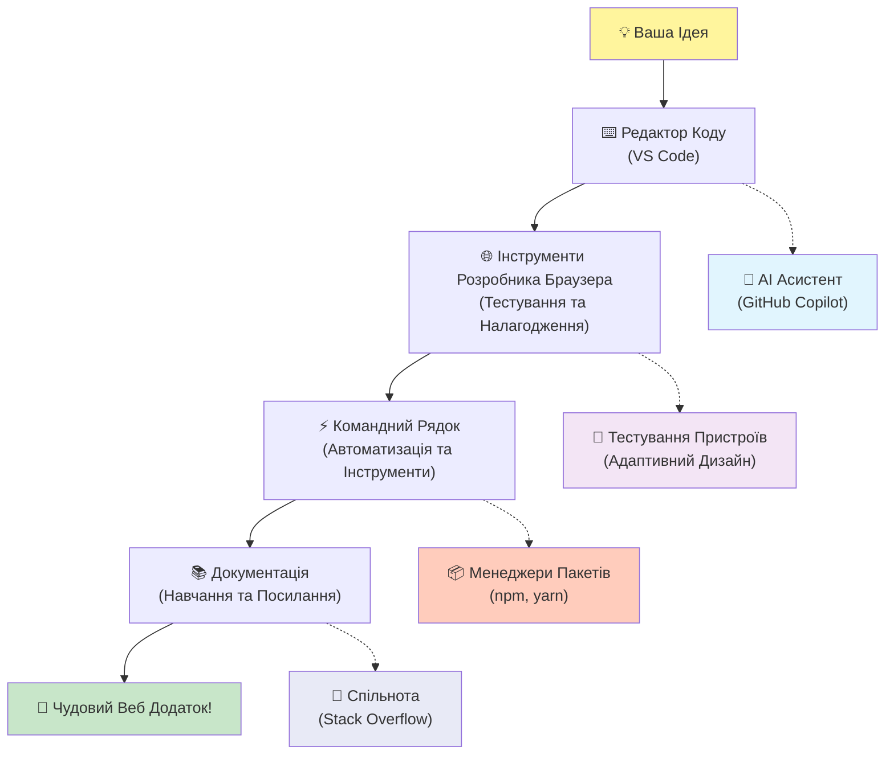
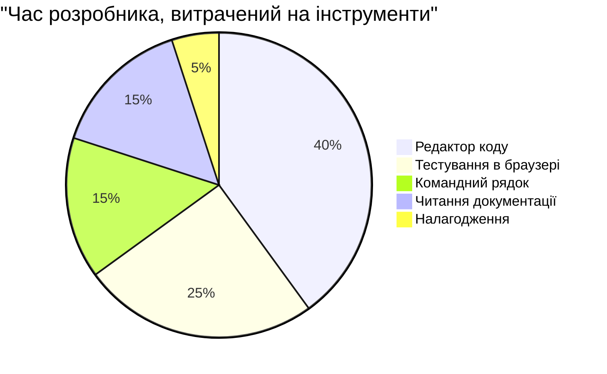
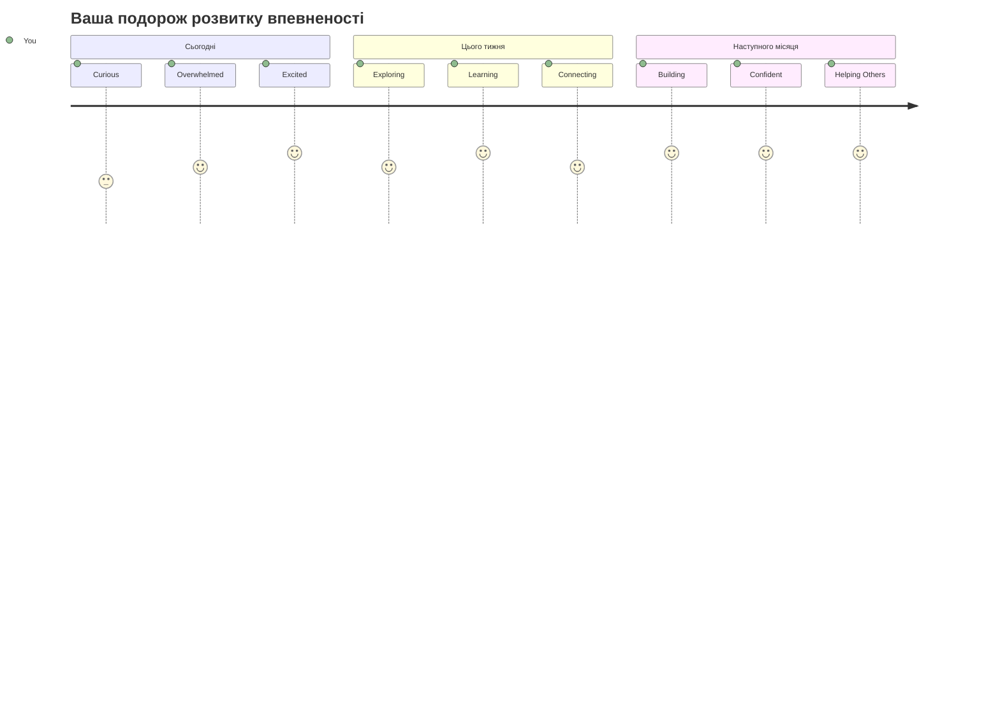

# Вступ до мов програмування та сучасних інструментів розробника
 
Привіт, майбутній розробнику! 👋 Чи можу я розповісти тобі дещо, що досі викликає у мене мурашки щодня? Ти ось-ось дізнаєшся, що програмування — це не просто про комп’ютери, а про справжні суперсили, які допомагають втілити найсміливіші твої ідеї у життя!

Знаєш той момент, коли ти користуєшся улюбленим додатком, і все просто працює ідеально? Коли ти натискаєш кнопку, і стається щось абсолютно чарівне, що змушує сказати: «Вау, як вони це ЗРОБИЛИ?» Ну, хтось саме такий, як ти — мабуть, сидить у власній улюбленій кав’ярні о 2-й ночі з третім еспресо — написав код, який створив цю магію. І ось що тебе здивує: наприкінці цього уроку ти не лише зрозумієш, як вони це зробили, а й сам захочеш спробувати!

Дивись, я цілком розумію, якщо програмування здається зараз страшним. Коли я починав, я чесно думав, що треба бути гением з математики або програмувати з п’яти років. Але ось що повністю змінило мій погляд: програмування — це саме як навчитися вести розмови новою мовою. Спочатку вивчаєш «привіт» і «дякую», потім замовляєш каву, а за мить ти вже ведеш глибокі філософські бесіди! Тільки у цьому випадку ти розмовляєш з комп’ютерами, і, чесно? Вони — найтерплячливіші співрозмовники: не засуджують помилки і завжди раді спробувати знову!

Сьогодні ми дослідимо неймовірні інструменти, що роблять сучасну веб-розробку не просто можливою, а справді захопливою. Я говорю про ті самі редактори, браузери та робочі процеси, що використовують розробники Netflix, Spotify і твоєї улюбленої інді-студії. І ось що змусить тебе танцювати від радості: більшість цих професійних, індустріальних інструментів — абсолютно безкоштовні!


> Sketchnote від [Tomomi Imura](https://twitter.com/girlie_mac)


```mermaid
journey
    title Ваша подорож програмуванням сьогодні
    section Discover
      Що таке програмування: 5: You
      Мови програмування: 4: You
      Огляд інструментів: 5: You
    section Explore
      Редактори коду: 4: You
      Браузери та інструменти розробника: 5: You
      Командний рядок: 3: You
    section Practice
      Детектив мови: 4: You
      Вивчення інструментів: 5: You
      Спілкування в спільноті: 5: You
```
## Перевіримо, що ти вже знаєш!

Перш ніж поринути у веселощі, мені цікаво – що ти вже знаєш про цей світ програмування? І слухай, якщо ти дивишся на ці питання і думаєш: «Я зовсім нічого не знаю про це,» — це не просто нормально, це ідеально! Це означає, що ти якраз у потрібному місці. Подумай про цю вікторину як про розім’янку перед тренуванням – ми просто розігріваємо мозок!

[Пройди вступний тест](https://ff-quizzes.netlify.app/web/)


## Подорож, в яку ми вирушаємо разом

Окей, я справді шалено радію тому, що ми сьогодні вивчатимемо! Серйозно, хотів би побачити твоє обличчя, коли деякі з цих концепцій дійдуть до тебе. Ось неймовірна подорож, яку ми проходимо разом:

- **Що таке програмування насправді (і чому це найкрутіша річ у світі!)** – Ми відкриємо, як код — це невидима магія, що живить все навколо: від сигналізації, яка якимось чином знає, що сьогодні понеділок, до алгоритму, що ідеально підбирає рекомендації Netflix
- **Мови програмування та їх дивовижні особистості** – Уяви, що ти потрапив на вечірку, де кожна людина має унікальні суперсили й способи розв’язувати проблеми. Саме так виглядає світ мов програмування, і тобі сподобається знайомство з ними!
- **Основні будівельні блоки, що творять цифрову магію** – Подумай про це як про найкращий творчий набір LEGO. Як тільки зрозумієш, як ці деталі поєднуються, ти усвідомиш, що можеш створити буквально все, що забажає твоя уява
- **Професійні інструменти, що дадуть тобі відчуття чарівної палички** – Я не перебільшую – ці інструменти справді змусить тебе відчути, що володієш суперсилами, а найкращє — це ті самі інструменти, що використовують професіонали!

> 💡 **Ось що потрібно знати**: Не намагайся запам’ятати все сьогодні! Просто відчуй іскру захоплення тим, що можливо. Деталі закріпляться природно, коли ми практикуватимемось разом – ось як відбувається справжнє навчання!

> Ти можеш пройти цей урок на [Microsoft Learn](https://learn.microsoft.com/en-us/learn/modules/web-development-101/introduction-programming/?WT.mc_id=academic-77807-sagibbon)!

## Отже, що таке програмування?

Добре, розглянемо головне питання: що ж насправді таке програмування?

Розкажу історію, яка повністю змінила моє уявлення про це. Минулого тижня я намагався пояснити мамі, як користуватися новим пультом від розумного ТВ. Я зловив себе на тому, що кажу: «Натисни червону кнопку, але не велику червону, а маленьку червону зліва… ні, твоя інша ліва… добре, тепер потримай дві секунди, не одну, не три…» Знайомо? 😅

Це програмування! Це мистецтво давати надзвичайно докладні, крок за кроком, інструкції чомусь дуже потужному, але що потребує пояснення до найменших деталей. Тільки замість пояснень мамі (яка може спитати «яку червону кнопку?») ти пояснюєш комп’ютеру, який просто виконує те, що ти сказав, навіть якщо ти переплутав.

Ось що мене вразило, коли я вперше це зрозумів: комп’ютери насправді дуже прості в основі. Вони розуміють буквально дві речі — 1 та 0, що по суті означає «так» і «ні» або «ввімкнено» і «вимкнено». Ось і все! Але тут починається магія — нам не потрібно говорити на 1 і 0, як у Матриці. Саме тут допомагають **мови програмування**. Вони — наче найкращий перекладач у світі, який бере твої нормальні людські думки і перетворює їх на мову комп’ютера.

І ось що досі викликає у мене мурашки щоранку: буквально *все* цифрове у твоєму житті почалося з когось такого, як ти, мабуть, у піжамі з горням кави, що друкує код на ноутбуці. Той фільтр в Instagram, що робить тебе бездоганним? Хтось його закодував. Рекомендація, що привела тебе до нової улюбленої пісні? Розробник створив цей алгоритм. Додаток, що допомагає розділити рахунок за вечерю з друзями? Так, хтось подумав «це дратує, я можу це полагодити» і зробив це!

Коли ти навчаєшся програмувати, ти не просто здобуваєш нову навичку — ти стаєш частиною неймовірної спільноти розв’язувачів проблем, які проводять дні, думаючи: «А що як я зроблю щось, що зробить чийсь день трошки кращим?» Чесно кажучи, чи є щось крутіше за це?

✅ **Цікавинка**: Ось що круто дослідити, якщо матимеш вільну хвилинку — хто, на твою думку, був першим комп’ютерним програмістом у світі? Підказка: це може бути не той, кого ти очікуєш! Історія цієї людини надзвичайно захоплива і показує, що програмування завжди було про креативне розв’язання проблем і нестандартне мислення.

### 🧠 **Час перевірити себе: Як ти почуваєшся?**

**Зроби паузу й подумай:**
- Чи стало зараз зрозуміло, що означає «давати інструкції комп’ютерам»?
- Чи можеш уявити якусь щоденну задачу, яку б хотів автоматизувати за допомогою програмування?
- Які питання виникають у тебе про весь цей світ програмування?

> **Пам’ятай**: це нормально, якщо деякі концепції здаються розмитими зараз. Вивчення програмування — як навчання новій мові, потрібно час, щоб мозок налагодив потрібні зв’язки. Ти чудово справляєшся!

## Мови програмування — це як різні смаки магії

Окей, зараз прозвучить дивно, але лишайся зі мною — мови програмування дуже схожі на різні музичні стилі. Подумай: є джаз, який плавний і імпровізаційний, рок — потужний і прямолінійний, класика — елегантна і структурована, а хіп-хоп — креативний і експресивний. У кожного стилю своя атмосфера, своє коло палких фанатів, і кожен ідеально підходить для різного настрою та випадків.

Мови програмування працюють так само! Ти ж не використовуватимеш одну і ту саму мову для створення веселої мобільної гри та для опрацювання величезних масивів кліматичних даних, як не будеш слухати дез-метал на занятті йогою (ну, більшість занять, принаймні! 😄).

А ось що мене вражає кожного разу, коли я про це думаю: ці мови — наче найтерплячіший та найрозумніший перекладач у світі, який сидить поруч з тобою. Ти виражаєш ідеї так, як комфортно твоєму людському мозку, а вони роблять усю складну роботу, перекладаючи це на 1 і 0, якими розмовляють комп’ютери. Це як мати друга, який ідеально володіє і «людською творчістю», і «комп’ютерною логікою» — і він ніколи не втомлюється, не потребує кави і не засуджує, якщо ти задаєш одне і те саме питання двічі!

### Популярні мови програмування та їх застосування


```mermaid
mindmap
  root((Мови програмування))
    Web Development
      JavaScript
        Магія фронтенда
        Інтерактивні вебсайти
      TypeScript
        JavaScript + типи
        Корпоративні додатки
    Data & AI
      Python
        Дані науки
        Машинне навчання
        Автоматизація
      R
        Статистика
        Дослідження
    Mobile Apps
      Java
        Android
        Корпоративні
      Swift
        iOS
        Екосистема Apple
      Kotlin
        Сучасний Android
        Кросплатформовий
    Systems & Performance
      C++
        Ігри
        Критична продуктивність
      Rust
        Безпека пам’яті
        Системне програмування
      Go
        Хмарні сервіси
        Масштабований бекенд
```
| Мова | Найкраще для | Чому популярна |
|----------|----------|------------------|
| **JavaScript** | Веб-розробка, інтерфейси користувача | Працює в браузерах і забезпечує інтерактивні сайти |
| **Python** | Наука про дані, автоматизація, ШІ | Легка для читання та вивчення, потужні бібліотеки |
| **Java** | Корпоративні додатки, Android-додатки | Незалежна від платформи, надійна для великих систем |
| **C#** | Додатки для Windows, розробка ігор | Сильна підтримка екосистеми Microsoft |
| **Go** | Хмарні сервіси, бекенд-системи | Швидка, проста, створена для сучасних обчислень |

### Мови високого рівня проти низького рівня

Окей, це була та концепція, яка зламала мій мозок, коли я починав вчитися, тому поділюся аналогією, яка нарешті допомогла мені це зрозуміти — і сподіваюся, вона допоможе й тобі!

Уяви, що ти приїхав у країну, де не знаєш мову, і терміново шукаєш найближчий туалет (ми всі через це проходили, правда? 😅):

- **Програмування низького рівня** — це як знати місцевий діалект настільки добре, що можеш поговорити з бабусею, яка продає фрукти на розі, використовуючи культурні посилання, місцевий сленг та жарти, які зрозуміє лише той, хто там виріс. Це дуже вражає й надзвичайно ефективно... якщо ти, звісно, вільно розмовляєш! Але доволі складно, коли тобі лише потрібно знайти туалет.

- **Програмування високого рівня** — це як мати того чудового місцевого друга, який тебе чудово розуміє. Ти можеш сказати просто «мені потрібно знайти туалет» англійською, а він зробить весь культурний переклад і дасть тобі напрямок у зрозумілій для тебе формі.

У термінах програмування:
- **Мови низького рівня** (як Assembly чи C) дозволяють вести надзвичайно докладні розмови безпосередньо з апаратним забезпеченням комп’ютера, але потрібно мислити як машина, що... скажімо, великий ментальний зсув!
- **Мови високого рівня** (як JavaScript, Python чи C#) дозволяють думати як людина, у той час як вони вирішують усі машинні питання за сценою. Також у них є неймовірно дружні спільноти з людьми, які пам’ятають, як це — бути новачком, і щиро хочуть допомогти!

Вгадай, з чого я запропоную почати? 😉 Мови високого рівня — це наче тренувальні колеса, які ти ніколи справді не захочеш знімати, бо вони роблять увесь досвід набагато приємнішим!


```mermaid
flowchart TB
    A["👤 Людська думка:<br/>'Я хочу обчислити числа Фібоначчі'"] --> B{Вибрати рівень мови}
    
    B -->|Високий рівень| C["🌟 JavaScript/Python<br/>Легко читати і писати"]
    B -->|Низький рівень| D["⚙️ Assembly/C<br/>Пряме керування апаратурою"]
    
    C --> E["📝 Написати: fibonacci(10)"]
    D --> F["📝 Написати: mov r0,#00<br/>sub r0,r0,#01"]
    
    E --> G["🤖 Розуміння комп'ютера:<br/>Перекладач обробляє складнощі"]
    F --> G
    
    G --> H["💻 Той самий результат:<br/>0, 1, 1, 2, 3, 5, 8, 13..."]
    
    style C fill:#e1f5fe
    style D fill:#fff3e0
    style H fill:#e8f5e8
```
### Дай покажу, чому мови високого рівня такі дружні

Добре, я збираюся показати тобі приклад, який ідеально пояснює, чому я закохався в мови високого рівня, але спочатку — пообіцяй мені одне. Коли побачиш перший приклад коду, не панікуй! Він має виглядати загрозливо. Це саме той пункт, який я хочу підкреслити!

Ми подивимось на одну і ту ж задачу, написану у двох абсолютно різних стилях. Обидва створюють так звану послідовність Фібоначчі — це гарний математичний патерн, де кожне число є сумою двох попередніх: 0, 1, 1, 2, 3, 5, 8, 13... (Цікавинка: цей патерн буквально всюди у природі — спіралі насіння соняшника, візерунки на шишках, навіть у формуванні галактик!)

Готовий побачити різницю? Поїхали!

**Мова високого рівня (JavaScript) – зрозуміло для людини:**

```javascript
// Крок 1: Основна настройка Фібоначчі
const fibonacciCount = 10;
let current = 0;
let next = 1;

console.log('Fibonacci sequence:');
```

**Що робить цей код:**
- **Оголошує** константу, що визначає, скільки чисел Фібоначчі ми хочемо згенерувати
- **Ініціалізує** дві змінні для відстеження поточного і наступного чисел у послідовності
- **Встановлює** початкові значення (0 і 1), що визначають патерн Фібоначчі
- **Виводить** заголовок для позначення нашого результату

```javascript
// Крок 2: Згенеруйте послідовність за допомогою циклу
for (let i = 0; i < fibonacciCount; i++) {
  console.log(`Position ${i + 1}: ${current}`);
  
  // Обчислити наступне число в послідовності
  const sum = current + next;
  current = next;
  next = sum;
}
```

**Роз’яснення того, що відбувається тут:**
- **Цикл** перебирає кожну позицію в нашій послідовності за допомогою `for`
- **Виводить** кожне число з позицією за допомогою шаблонного рядка
- **Обчислює** наступне число Фібоначчі, додаючи поточне і наступне значення
- **Оновлює** змінні для переходу до наступної ітерації

```javascript
// Крок 3: Сучасний функціональний підхід
const generateFibonacci = (count) => {
  const sequence = [0, 1];
  
  for (let i = 2; i < count; i++) {
    sequence[i] = sequence[i - 1] + sequence[i - 2];
  }
  
  return sequence;
};

// Приклад використання
const fibSequence = generateFibonacci(10);
console.log(fibSequence);
```

**У наведеному вище коді ми:**
- **Створили** повторно використовувану функцію за допомогою сучасного синтаксису стрілкових функцій
- **Побудували** масив для зберігання всієї послідовності, а не виводили по одному
- **Використали** індексацію масиву для обчислення кожного нового числа з попередніх
- **Повернули** повну послідовність для гнучкого використання в інших частинах програми

**Мова низького рівня (ARM Assembly) – зрозуміло для комп’ютера:**

```assembly
 area ascen,code,readonly
 entry
 code32
 adr r0,thumb+1
 bx r0
 code16
thumb
 mov r0,#00
 sub r0,r0,#01
 mov r1,#01
 mov r4,#10
 ldr r2,=0x40000000
back add r0,r1
 str r0,[r2]
 add r2,#04
 mov r3,r0
 mov r0,r1
 mov r1,r3
 sub r4,#01
 cmp r4,#00
 bne back
 end
```

Поміти, як версія JavaScript читається майже як інструкції англійською, а версія Assembly використовує закодовані команди, що безпосередньо керують процесором комп’ютера. Обидві виконують ту саму задачу, але мова високого рівня набагато легша для розуміння, написання і підтримки людьми.

**Основні відмінності, які ти зауважиш:**
- **Читаємість**: JavaScript використовує описові назви, як `fibonacciCount`, тоді як Assembly використовує зашифровані ярлики на кшталт `r0`, `r1`
- **Коментарі**: Мови високого рівня заохочують пояснювальні коментарі, які роблять код само-документованим
- **Структура**: Логічний потік JavaScript відповідає тому, як люди розглядають проблеми крок за кроком
- **Підтримка**: Оновлення версії JavaScript під різні вимоги є простим і зрозумілим

✅ **Про послідовність Фібоначчі**: Цей надзвичайно гарний числовий патерн (де кожне число дорівнює сумі двох попередніх: 0, 1, 1, 2, 3, 5, 8...) зустрічається буквально *усюди* в природі! Ви знайдете його у спіралях соняшника, у візерунках шишок, у тому, як вигинаються мушлі наутилуса, і навіть у тому, як ростуть гілки дерев. Це просто вражає, як математика і код допомагають нам зрозуміти і відтворити патерни, за допомогою яких природа створює красу!


## Будівельні блоки, що створюють магію

Добре, тепер, коли ви побачили, як виглядають мови програмування на практиці, давайте розберемося у фундаментальних складових, з яких складається буквально кожна написана програма. Уявіть їх як необхідні інгредієнти у вашому улюбленому рецепті — як тільки ви зрозумієте, що кожен з них робить, ви зможете читати і писати код майже на будь-якій мові!

Це дещо схоже на вивчення граматики програмування. Пам’ятаєте в школі, як ви вчили іменники, дієслова і як складати речення? У програмування є своя версія граматики, і чесно кажучи, вона значно логічніша і поблажливіша, ніж граматика англійської мови! 😄

### Оператори: покрокові інструкції

Почнемо з **операторів** – вони схожі на окремі речення у вашому діалозі з комп’ютером. Кожен оператор велить комп’ютеру зробити одну конкретну дію, ніби даючи вказівки: «Поверни ліворуч тут», «Зупинися на червоне світло», «Запаркуйся на тому місці».

Що мені подобається в операторах, так це те, наскільки вони зазвичай зручні для читання. Подивіться на це:

```javascript
// Базові оператори, які виконують окремі дії
const userName = "Alex";                    
console.log("Hello, world!");              
const sum = 5 + 3;                         
```

**Ось що робить цей код:**
- **Оголосити** константну змінну для збереження імені користувача
- **Відобразити** вітальне повідомлення у консолі
- **Обчислити** і зберегти результат математичної операції

```javascript
// Оператори, що взаємодіють з веб-сторінками
document.title = "My Awesome Website";      
document.body.style.backgroundColor = "lightblue";
```

**Крок за кроком, що відбувається:**
- **Змінити** заголовок вебсторінки, що відображається на вкладці браузера
- **Змінити** колір фону всього тіла сторінки

### Змінні: система пам’яті вашої програми

Добре, **змінні** — це чесно одна з моїх улюблених концепцій для навчання, бо вони дуже схожі на те, що ви вже використовуєте щодня!

Подумайте про список контактів у вашому телефоні. Ви не запам’ятовуєте всі номери телефонів – замість цього ви зберігаєте «Мама», «Кращий друг» або «Піца до 2 ранку», і телефон запам’ятовує номери за вас. Змінні працюють так само! Вони як підписані контейнери, у яких ваша програма може зберігати інформацію і витягувати її пізніше за назвою, що має сенс.

Ось що насправді круто: змінні можуть змінюватися під час роботи програми (звідси і назва «змінна» — помітили гру слів?). Як ви можете оновлювати контакт піцерії, коли знаходите кращу, так і змінні можуть оновлюватися, коли ваша програма дізнається щось нове або коли змінюються обставини!

Дозвольте показати, наскільки це просто і красиво:

```javascript
// Крок 1: Створення базових змінних
const siteName = "Weather Dashboard";        
let currentWeather = "sunny";               
let temperature = 75;                       
let isRaining = false;                      
```

**Розуміння цих концепцій:**
- **Зберігати** незмінні значення у змінних `const` (наприклад, назву сайту)
- **Використовувати** `let` для значень, які можуть змінюватися протягом програми
- **Присвоювати** різні типи даних: рядки (текст), числа, логічні значення (true/false)
- **Вибирати** описові назви, які пояснюють, що містить кожна змінна

```javascript
// Крок 2: Робота з об'єктами для групування пов’язаних даних
const weatherData = {                       
  location: "San Francisco",
  humidity: 65,
  windSpeed: 12
};
```

**У наведеному прикладі ми:**
- **Створили** об’єкт, щоб згрупувати пов’язані погодні дані
- **Організували** кілька даних під однією назвою змінної
- **Використали** пари ключ-значення, щоб чітко позначити кожен елемент інформації

```javascript
// Крок 3: Використання та оновлення змінних
console.log(`${siteName}: Today is ${currentWeather} and ${temperature}°F`);
console.log(`Wind speed: ${weatherData.windSpeed} mph`);

// Оновлення змінних, які можна змінювати
currentWeather = "cloudy";                  
temperature = 68;                          
```

**Розберемо кожну частину:**
- **Вивести** інформацію, використовуючи шаблонні літерали з `${}` синтаксисом
- **Отримати доступ** до властивостей об’єкта через крапкову нотацію (`weatherData.windSpeed`)
- **Оновлювати** змінні, оголошені через `let`, щоб відображати змінні умови
- **Комбінувати** кілька змінних для створення змістовних повідомлень

```javascript
// Крок 4: Сучасне деструктурування для чистішого коду
const { location, humidity } = weatherData; 
console.log(`${location} humidity: ${humidity}%`);
```

**Що потрібно знати:**
- **Витягувати** конкретні властивості з об’єктів за допомогою деструктуризації
- **Створювати** нові змінні автоматично з тими ж іменами, що й ключі об’єкта
- **Спрощувати** код, уникаючи повторюваної крапкової нотації

### Управління потоком: вчимо вашу програму думати

Добре, саме тут програмування стає справді вражаючим! **Управління потоком** – це фактично навчання вашої програми приймати розумні рішення, так само, як ви робите це щодня, навіть не задумуючись.

Уявіть собі: сьогодні вранці ви йшли через щось на кшталт «Якщо йде дощ, візьму парасольку. Якщо холодно — вдягну куртку. Якщо запізнююсь — пропущу сніданок і візьму каву по дорозі.» Ваш мозок природно слідує цій логіці if-then десятки разів щодня!

Саме це робить програми розумними і живими, а не просто слідкують за нудним, передбачуваним скриптом. Вони можуть оцінювати ситуацію, аналізувати, що відбувається, і відповідати відповідно. Це як дати вашій програмі мозок, який може адаптуватися і приймати рішення!

Хочете побачити, як це прекрасно працює? Ось:

```javascript
// Крок 1: Базова умовна логіка
const userAge = 17;

if (userAge >= 18) {
  console.log("You can vote!");
} else {
  const yearsToWait = 18 - userAge;
  console.log(`You'll be able to vote in ${yearsToWait} year(s).`);
}
```

**Що робить цей код:**
- **Перевіряє**, чи відповідає вік користувача вимогам для голосування
- **Виконує** різні блоки коду залежно від результату умови
- **Обчислює** та виводить, скільки залишилось до права голосу, якщо менше 18
- **Надає** конкретний, корисний зворотний зв’язок для кожного сценарію

```javascript
// Крок 2: Кілька умов з логічними операторами
const userAge = 17;
const hasPermission = true;

if (userAge >= 18 && hasPermission) {
  console.log("Access granted: You can enter the venue.");
} else if (userAge >= 16) {
  console.log("You need parent permission to enter.");
} else {
  console.log("Sorry, you must be at least 16 years old.");
}
```

**Розбір того, що тут відбувається:**
- **Об’єднує** кілька умов за допомогою оператора `&&` (і)
- **Створює** ієрархію умов за допомогою `else if` для кількох випадків
- **Опрацьовує** всі можливі варіанти за допомогою заключного `else`
- **Надає** чіткий і дієвий фідбек для кожної ситуації

```javascript
// Крок 3: Лаконічна умова з тернарним оператором
const votingStatus = userAge >= 18 ? "Can vote" : "Cannot vote yet";
console.log(`Status: ${votingStatus}`);
```

**Що потрібно пам’ятати:**
- **Використовувати** тернарний оператор (`? :`) для простих двовариантних умов
- **Писати** умову спочатку, потім `?`, після чого — результат для істинного випадку, потім `:`, і результат для хибного
- **Застосовувати** цей патерн, коли потрібно присвоювати значення за умовами

```javascript
// Крок 4: Обробка кількох конкретних випадків
const dayOfWeek = "Tuesday";

switch (dayOfWeek) {
  case "Monday":
  case "Tuesday":
  case "Wednesday":
  case "Thursday":
  case "Friday":
    console.log("It's a weekday - time to work!");
    break;
  case "Saturday":
  case "Sunday":
    console.log("It's the weekend - time to relax!");
    break;
  default:
    console.log("Invalid day of the week");
}
```

**Цей код виконує наступне:**
- **Порівнює** значення змінної з кількома конкретними випадками
- **Групує** схожі випадки разом (будні проти вихідних)
- **Виконує** відповідний блок коду при знаходженні збігу
- **Включає** `default` для обробки несподіваних значень
- **Використовує** `break` для запобігання продовженню виконання у наступному випадку

> 💡 **Приклад зі світу:** уявіть управління потоком як найтерплячішу навігаторську систему у світі, що дає вам вказівки. Вона скаже: «Якщо на Main Street затор, поїдь по автомагістралі. Якщо автомагістралю перекриває будівництво – вибери мальовничий маршрут.» Програми використовують точно таку ж умовну логіку, щоб розумно реагувати на різні ситуації і завжди надавати найкращий користувацький досвід.

### 🎯 **Перевірка розуміння: майстерність будівельних блоків**

**Давайте перевіримо, як у вас із фундаментальними поняттями:**
- Чи можете ви власними словами пояснити різницю між змінною і оператором?
- Згадайте реальний приклад, де ви використали б if-then рішення (як наш приклад із голосуванням)
- Що з логіки програмування вас найбільше здивувало?

**Швидкий бустер впевненості:**

```mermaid
flowchart LR
    A["📝 Оператори<br/>(Інструкції)"] --> B["📦 Змінні<br/>(Зберігання)"] --> C["🔀 Управління потоком<br/>(Рішення)"] --> D["🎉 Робоча програма!"]
    
    style A fill:#ffeb3b
    style B fill:#4caf50
    style C fill:#2196f3
    style D fill:#ff4081
```
✅ **Що буде далі**: Нас чекає неймовірно цікава подорож, де ми глибше зануримося у ці поняття! Зараз просто зосередьтеся на емоції захоплення від усіх неймовірних можливостей попереду. Конкретні навички й техніки прийдуть природно, коли ми будемо практикувати разом — обіцяю, це буде значно цікавіше, ніж ви очікуєте!

## Інструменти професіонала

Добре, цього моменту я майже не можу стримати захоплення! 🚀 Зараз ми поговоримо про неймовірні інструменти, які зроблять так, ніби вам щойно вручили ключі від цифрового космічного корабля.

Ви знаєте, як шеф-кухар має ідеально збалансовані ножі, які здаються продовженням його рук? А музикант має ту одну гітару, яка починає співати в той момент, коли він її торкається? Так ось, у розробників є власна версія таких магічних інструментів, і ось що з них вас точно здивує — більшість із них абсолютно безкоштовні!

Я буквально стрибаю на стільці від радості, що можу це вам показати, бо ці інструменти повністю революціонізували те, як ми створюємо програмне забезпечення. Це AI-асистенти кодування, які можуть допомагати писати ваш код (і я не жартую!), хмарні середовища, де ви можете будувати повноцінні додатки буквально з будь-якого місця з Wi-Fi, та надскладні інструменти для налагодження, які немов дали вашій програмі рентгенівський зір.

І ось те, що до сих пір дає мурашки: це не «інструменти для початківців», які ви швидко зростете. Це ті самі професійні інструменти, що їх використовують розробники Google, Netflix і ті інді-студії додатків, які ви любите, саме зараз. Ви відчуєте себе справжнім профі, використовуючи їх!


```mermaid
graph TD
    A["💡 Ваша Ідея"] --> B["⌨️ Редактор Коду<br/>(VS Code)"] 
    B --> C["🌐 Інструменти Розробника Браузера<br/>(Тестування та Налагодження)"]
    C --> D["⚡ Командний Рядок<br/>(Автоматизація та Інструменти)"]
    D --> E["📚 Документація<br/>(Навчання та Посилання)"]
    E --> F["🚀 Чудовий Веб Додаток!"]
    
    B -.-> G["🤖 AI Асистент<br/>(GitHub Copilot)"]
    C -.-> H["📱 Тестування Пристроїв<br/>(Адаптивний Дизайн)"]
    D -.-> I["📦 Менеджери Пакетів<br/>(npm, yarn)"]
    E -.-> J["👥 Спільнота<br/>(Stack Overflow)"]
    
    style A fill:#fff59d
    style F fill:#c8e6c9
    style G fill:#e1f5fe
    style H fill:#f3e5f5
    style I fill:#ffccbc
    style J fill:#e8eaf6
```
### Редактори коду та IDE: ваші нові цифрові найкращі друзі

Поговоримо про редактори коду – вони серйозно скоро стануть вашим улюбленим місцем для творчості! Уявіть їх як особисте святилище програмування, де ви проведете більшу частину часу, пишучи і вдосконалюючи свої цифрові твори.

А ось що справді магічно у сучасних редакторах: це не просто гарні текстові редактори. Це мовби найрозумніший, найпідтримуючий ментор з кодування, який сидить поруч з вами 24/7. Вони ловлять помилки ще до того, як ви їх помітите, пропонують покращення, що роблять вас генієм, допомагають зрозуміти, що робить кожен рядок коду, і деякі навіть передбачають, що ви збираєтесь написати, і пропонують закінчити вашу думку!

Я пригадую, як уперше відкрив автозаповнення – я буквально відчував, що живу в майбутньому. Ви починаєте вводити щось, і редактор каже: «Гей, чи ти думав про цю функцію, яка робить саме те, що тобі потрібно?» Це як мати в думках читача у якості напарника з кодування!

**Що робить ці редактори такими неймовірними?**

Сучасні редактори коду пропонують вражаючий набір функцій для підвищення вашої продуктивності:

| Функція | Що робить | Чому допомагає |
|---------|-----------|----------------|
| **Підсвічування синтаксису** | Кольорове виділення різних частин коду | Полегшує читання коду і пошук помилок |
| **Автозаповнення** | Пропонує код під час набору | Прискорює написання коду і знижує помилки |
| **Інструменти налагодження** | Допомагають знаходити і виправляти помилки | Заощаджує години на пошук багів |
| **Розширення** | Додають спеціалізовані функції | Налаштовують редактор під будь-які технології |
| **AI-асистенти** | Пропонують код та пояснення | Прискорюють навчання і продуктивність |

> 🎥 **Відеоресурс**: Хочете побачити ці інструменти в дії? Подивіться це [відео про інструменти професіонала](https://youtube.com/watch?v=69WJeXGBdxg) для повного огляду.

#### Рекомендовані редактори для веб-розробки

**[Visual Studio Code](https://code.visualstudio.com/?WT.mc_id=academic-77807-sagibbon)** (безкоштовно)
- Найпопулярніший серед веб-розробників
- Відмінна екосистема розширень
- Вбудований термінал і інтеграція Git
- **Обов’язкові розширення**:
  - [GitHub Copilot](https://marketplace.visualstudio.com/items?itemName=GitHub.copilot) – AI-пропозиції коду
  - [Live Share](https://marketplace.visualstudio.com/items?itemName=MS-vsliveshare.vsliveshare) – спільна робота в реальному часі
  - [Prettier](https://marketplace.visualstudio.com/items?itemName=esbenp.prettier-vscode) – автоматичне форматування коду
  - [Code Spell Checker](https://marketplace.visualstudio.com/items?itemName=streetsidesoftware.code-spell-checker) – ловить помилки при наборі тексту

**[JetBrains WebStorm](https://www.jetbrains.com/webstorm/)** (платно, безкоштовно для студентів)
- Просунуті інструменти налагодження і тестування
- Інтелектуальне автозаповнення коду
- Вбудований контрол версій

**IDE на базі хмари** (різні цінові плани)
- [GitHub Codespaces](https://github.com/features/codespaces) – повний VS Code у браузері
- [Replit](https://replit.com/) – чудово для навчання і спільного кодування
- [StackBlitz](https://stackblitz.com/) – миттєва повноцінна веб-розробка

> 💡 **Порада для початку**: Починайте з Visual Studio Code — він безкоштовний, широко використовується й має величезну спільноту з численними навчальними матеріалами та розширеннями.


### Веб-браузери: ваша секретна лабораторія розробника

Добре, готуйтеся бути враженими! Ви звикли використовувати браузери для перегляду соцмереж і відео? Так от, виявляється, вони весь цей час приховували неймовірну секретну лабораторію розробника, яка чекає, щоб ви її відкрили!

Кожен раз, коли ви клікаєте правою кнопкою миші на вебсторінці і обираєте «Перевірити елемент», ви відкриваєте прихований світ інструментів розробника, які насправді потужніші, ніж деяке дороге програмне забезпечення, за яке я колись платив сотні доларів. Це як виявити, що ваша звичайна кухня приховує за стіною лабораторію професійного кухаря!
Вперше, коли хтось показав мені DevTools браузера, я провів близько трьох годин, просто клікаючи навколо і кажучи "СТІЙ, ВОНА ТАКОЖ МОЖЕ ЦЕ?!" Ви буквально можете редагувати будь-який вебсайт у реальному часі, бачити точно, наскільки швидко все завантажується, перевіряти, як ваш сайт виглядає на різних пристроях, і навіть налагоджувати JavaScript, як повний профі. Це абсолютно вражає!

**Ось чому браузери — ваш секретний козир:**

Коли ви створюєте вебсайт або вебдодаток, вам потрібно бачити, як він виглядає і поводиться в реальному світі. Браузери не лише відображають вашу роботу, а й надають докладний зворотний зв’язок про продуктивність, доступність та потенційні проблеми.

#### Інструменти розробника браузера (DevTools)

Сучасні браузери містять комплексні набори інструментів для розробки:

| Категорія інструментів | Що він робить | Приклад використання |
|------------------------|---------------|---------------------|
| **Інспектор елементів** | Перегляд і редагування HTML/CSS у реальному часі | Налаштування стилів для миттєвого результату |
| **Консоль** | Перегляд помилок і тестування JavaScript | Налагодження проблем та експерименти з кодом |
| **Моніторинг мережі** | Відстеження завантаження ресурсів | Оптимізація продуктивності та часу завантаження |
| **Перевірка доступності** | Тестування на інклюзивний дизайн | Забезпечення роботи сайту для всіх користувачів |
| **Симулятор пристроїв** | Перегляд на різних розмірах екранів | Тестування адаптивного дизайну без кількох пристроїв |

#### Рекомендовані браузери для розробки

- **[Chrome](https://developers.google.com/web/tools/chrome-devtools/)** - Стандартні DevTools з великою кількістю документації  
- **[Firefox](https://developer.mozilla.org/docs/Tools)** - Чудові інструменти для CSS Grid та доступності  
- **[Edge](https://docs.microsoft.com/microsoft-edge/devtools-guide-chromium/?WT.mc_id=academic-77807-sagibbon)** - Побудований на Chromium із ресурсами від Microsoft

> ⚠️ **Важлива порада з тестування**: Завжди тестуйте свої сайти у кількох браузерах! Те, що ідеально працює у Chrome, може виглядати інакше в Safari чи Firefox. Професійні розробники тестують у всіх основних браузерах, щоб забезпечити послідовний користувацький досвід.


### Інструменти командного рядка: ваш шлях до суперсил розробника

Добре, давайте будемо чесними про командний рядок, бо я хочу, щоб ви почули це від когось, хто дійсно розуміє. Коли я вперше побачив його – цей страшний чорний екран із миготливим текстом – я буквально подумав: "Ні, ні в якому разі! Це виглядає, як щось із хакерського фільму 1980-х, і я точно не розумний для такого!" 😅

Але ось що я хотів, щоб мені тоді хтось сказав, і що я кажу вам зараз: командний рядок не страшний – це насправді як розмова безпосередньо з вашим комп’ютером. Уявіть це як різницю між замовленням їжі через крутий додаток із картинками та меню (що зручно і просто) і заходом у ваш улюблений локальний ресторан, де шеф знає точно, що вам подобається, і може приготувати щось ідеальне, просто почувши від вас "порадуй мене чимось неймовірним."

Командний рядок – це місце, куди приходять розробники, щоб відчути себе справжніми чарівниками. Ви вводите кілька ніби магічних слів (ну, це просто команди, але вони відчуваються магічними!), натискаєте enter, і БАЦ – ви створили цілі структури проекту, встановили потужні інструменти з усього світу або розгорнули свій додаток в інтернеті для мільйонів користувачів. Як тільки ви відчуєте цю силу, це реально затягує!

**Ось чому командний рядок стане вашим улюбленим інструментом:**

Хоча графічні інтерфейси класні для багатьох завдань, командний рядок блискуче справляється з автоматизацією, точністю і швидкістю. Багато інструментів розробки працюють через командний рядок, і вміння користуватися ним ефективно значно підвищить вашу продуктивність.

```bash
# Крок 1: Створіть та перейдіть у каталог проекту
mkdir my-awesome-website
cd my-awesome-website
```

**Ось що робить цей код:**
- **Створює** новий каталог "my-awesome-website" для вашого проєкту  
- **Переходить** у щойно створену директорію, щоб почати роботу

```bash
# Крок 2: Ініціалізуйте проект з package.json
npm init -y

# Встановіть сучасні інструменти розробки
npm install --save-dev vite prettier eslint
npm install --save-dev @eslint/js
```

**Крок за кроком, що відбувається:**
- **Ініціалізує** новий проєкт Node.js з налаштуваннями за замовчуванням за допомогою `npm init -y`  
- **Встановлює** Vite як сучасний інструмент збірки для швидкої розробки і продакшен-збірок  
- **Додає** Prettier для автоматичного форматування коду і ESLint для перевірки якості коду  
- **Використовує** прапорець `--save-dev`, щоб позначити ці залежності тільки для розробки

```bash
# Крок 3: Створення структури проекту і файлів
mkdir src assets
echo '<!DOCTYPE html><html><head><title>My Site</title></head><body><h1>Hello World</h1></body></html>' > index.html

# Запустити сервер розробки
npx vite
```

**У наведеному вище ми:**
- **Організували** проєкт, створивши окремі папки для вихідного коду і ресурсів  
- **Згенерували** базовий HTML-файл із правильною структурою документа  
- **Запустили** сервер розробки Vite для live-reload і гарячої заміни модулів

#### Основні інструменти командного рядка для веброзробки

| Інструмент | Призначення | Чому це вам потрібно |
|------------|-------------|----------------------|
| **[Git](https://git-scm.com/)** | Контроль версій | Відстежувати зміни, співпрацювати, робити резервні копії |
| **[Node.js & npm](https://nodejs.org/)** | Виконання JavaScript та менеджер пакетів | Запускати JS поза браузерами, встановлювати сучасні інструменти |
| **[Vite](https://vitejs.dev/)** | Інструмент збірки та dev сервер | Надзвичайно швидка розробка з гарячою заміною модулів |
| **[ESLint](https://eslint.org/)** | Якість коду | Автоматично знаходити і виправляти проблеми у JavaScript |
| **[Prettier](https://prettier.io/)** | Форматування коду | Підтримувати код у послідовно відформатованому і читабельному вигляді |

#### Опції для конкретних платформ

**Windows:**
- **[Windows Terminal](https://docs.microsoft.com/windows/terminal/?WT.mc_id=academic-77807-sagibbon)** - Сучасний, багатофункціональний термінал  
- **[PowerShell](https://docs.microsoft.com/powershell/?WT.mc_id=academic-77807-sagibbon)** 💻 - Потужне середовище скриптів  
- **[Command Prompt](https://docs.microsoft.com/windows-server/administration/windows-commands/?WT.mc_id=academic-77807-sagibbon)** 💻 - Традиційний командний рядок Windows

**macOS:**
- **[Terminal](https://support.apple.com/guide/terminal/)** 💻 - Вбудований термінал  
- **[iTerm2](https://iterm2.com/)** - Покращений термінал з розширеними можливостями

**Linux:**
- **[Bash](https://www.gnu.org/software/bash/)** 💻 - Стандартна оболонка Linux  
- **[KDE Konsole](https://docs.kde.org/trunk5/en/konsole/konsole/index.html)** - Просунутий емулятор термінала

> 💻 = Попередньо встановлено в ОС

> 🎯 **Навчальна стратегія**: Почніть з базових команд, як `cd` (зміна директорії), `ls` або `dir` (перелік файлів), і `mkdir` (створення папки). Тренуйтеся з командами сучасного workflow, як `npm install`, `git status` і `code .` (відкриває поточну директорію у VS Code). З часом ви природно опануєте більш складні команди та техніки автоматизації.


### Документація: ваш завжди доступний наставник у навчанні

Добре, поділюсь маленьким секретом, який допоможе вам почуватися набагато впевненіше на початку: навіть найдосвідченіші розробники витрачають багато часу, читаючи документацію. І це не тому, що вони не знають, що роблять – це насправді знак мудрості!

Уявіть документацію як найдоступніших, терплячих і знавців вчителів у світі, доступних 24/7. Застрягли у проблемі о 2 ночі? Документація тут, як теплий віртуальний обійм, з потрібною відповіддю. Хочете дізнатись про якусь класну нову функцію, про яку всі говорять? Документація підтримає вас покроковими прикладами. Прагнете зрозуміти, чому щось працює саме так? Вгадали – документація готова пояснити це так, щоб у вас нарешті все склалося!

Ось що повністю змінило мій погляд: світ веброзробки розвивається надзвичайно швидко, і ніхто (та й справді ніхто!) не тримає все в пам’яті. Я бачив досвідчених розробників із 15+ роками досвіду, які шукали базовий синтаксис, і знаєте що? Це не соромно – це розумно! Не справа в ідеальній пам’яті, а в тому, щоб знати, де швидко знайти надійні відповіді і як їх застосувати.

**Ось де відбувається справжня магія:**

Професійні розробники полюбляють багато часу читати документацію – не тому що не знають, що роблять, а тому що ландшафт веброзробки надто швидко змінюється, і триматися в курсі – це постійне навчання. Чудова документація допомагає вам зрозуміти не тільки *як* щось використовувати, а й *чому* і *коли*.

#### Важливі ресурси документації

**[Mozilla Developer Network (MDN)](https://developer.mozilla.org/docs/Web)**
- Золотий стандарт документації вебтехнологій  
- Всеосяжні посібники з HTML, CSS і JavaScript  
- Включає інформацію про сумісність із браузерами  
- Містить практичні приклади і інтерактивні демо

**[Web.dev](https://web.dev)** (від Google)
- Сучасні найкращі практики веброзробки  
- Посібники з оптимізації продуктивності  
- Принципи доступності та інклюзивного дизайну  
- Кейси з реальних проєктів

**[Microsoft Developer Documentation](https://docs.microsoft.com/microsoft-edge/#microsoft-edge-for-developers)**
- Ресурси для розробки під браузер Edge  
- Посібники з Progressive Web App  
- Інсайти кросплатформної розробки

**[Frontend Masters Learning Paths](https://frontendmasters.com/learn/)**
- Структуровані навчальні курси  
- Відео від експертів галузі  
- Практичні вправи з кодування

> 📚 **Стратегія навчання**: Не намагайтеся запам’ятати документацію – натомість навчіться ефективно нею користуватися. Закладки на часто потрібні довідники і вправи з пошуку точних відповідей значно допоможуть.

### 🔧 **Перевірка майстерності інструментів: що вам найбільше резонує?**

**Зробіть паузу й подумайте:**
- Який інструмент ви найбільше хочете спробувати першим? (Неправильних відповідей немає!)  
- Чи досі командний рядок здається лякаючим, чи ви зацікавлені в ньому?  
- Чи уявляєте, як використовувати DevTools браузера, щоб заглянути за куліси улюблених сайтів?


```mermaid
pie title "Час розробника, витрачений на інструменти"
    "Редактор коду" : 40
    "Тестування в браузері" : 25
    "Командний рядок" : 15
    "Читання документації" : 15
    "Налагодження" : 5
```
> **Цікава інсайт:** Більшість розробників проводить близько 40% часу в редакторі коду, але погляньте, скільки часу витрачається на тестування, навчання та вирішення проблем. Програмування – це не тільки про написання коду, а про створення досвіду!

✅ **Їжа для роздумів:** Ось що цікаво поміркувати – чим, на вашу думку, інструменти для створення сайтів (розробка) відрізняються від інструментів для проєктування їх вигляду (дизайн)? Це приблизно як різниця між архітектором, який проектує красивий будинок, і підрядником, який його фактично зводить. Обидва важливі, але їм потрібні різні набори інструментів! Такий підхід допоможе вам побачити ширшу картину, як живуть вебсайти.

## Випробування GitHub Copilot Agent 🚀

Використайте режим агента, щоб виконати наступне завдання:

**Опис:** Дослідіть можливості сучасного редактора коду або IDE і продемонструйте, як він може покращити ваш робочий процес як веброзробника.

**Підказка:** Оберіть редактор коду або IDE (наприклад Visual Studio Code, WebStorm або хмарне IDE). Наведіть три функції або розширення, що допомагають ефективніше писати, налагоджувати або підтримувати код. Для кожної дайте коротке пояснення, як це покращує ваш робочий процес.

---

## 🚀 Виклик

**Отже, детективе, готові до першої справи?**

Зараз, коли у вас є чудова база, у мене для вас пригода, яка допоможе побачити, наскільки надзвичайно різноманітний і захопливий світ програмування. І слухайте – це ще не про написання коду, тож не хвилюйтесь! Уявіть себе детективом мов програмування на вашій першій захоплюючій справі!

**Ваше завдання, якщо вирішите його прийняти:**
1. **Стати дослідником мов:** Виберіть три мови програмування із зовсім різних світів – можливо одна для вебсайтів, одна для мобільних додатків, і одна для обробки даних науковцями. Знайдіть приклади однієї простої задачі, написаної на кожній з них. Обіцяю, ви будете в захваті від того, як вони можуть виглядати зовсім інакше, виконуючи однакову роботу!

2. **Розкрийте їх історії створення:** Що робить кожну мову особливою? Ось цікавий факт – кожна мова програмування створена тому, що хтось подумав: «Знаєте, мусить бути кращий спосіб розв’язати цю конкретну проблему». Спробуйте з’ясувати, якими були ці проблеми. Деякі з цих історій справді захопливі!

3. **Познайомтесь з їх спільнотами:** Подивіться, наскільки дружні і пристрасні спільноти кожної мови. Деякі налічують мільйони розробників, які діляться знаннями і допомагають один одному, інші – менші, але напрочуд згуртовані і підтримують. Вам сподобається бачити різні характери цих спільнот!

4. **Довіртесь серцю:** Яка мова зараз здається вам найпростіше? Не турбуйтесь над «ідеальним» вибором – слухайте свої інстинкти! Справді, неправильної відповіді тут немає, і завжди можна дослідити інші пізніше.

**Бонусне детективне завдання:** Дізнайтеся, які великі сайти чи додатки побудовані на кожній з мов. Гарантую, ви здивуєтесь, дізнавшись, що стоїть за Instagram, Netflix чи тією мобільною грою, у яку ви не можете відірватися!

> 💡 **Пам’ятайте**: Мета не стати експертом у цих мовах зараз. Ви просто знайомитесь з «околицями», перш ніж вибрати, де хочете поселитися. Не поспішайте, отримуйте задоволення і дозвольте допитливості вести вас!

## Давайте відсвяткуємо ваші відкриття!

Ой лишенько, ви сьогодні засвоїли стільки неймовірної інформації! Я щиро тішуся, що щораз більше цього дивовижного шляху лишається з вами. І пам’ятайте – це не тест з ідеальними відповідями. Це, скоріше, святкування всього крутого, що ви дізналися про цей захопливий світ, у який ви ось-ось поринете!

[Пройдіть післяурочний тест](https://ff-quizzes.netlify.app/web/)

## Повторення і самостійне навчання

**Не поспішайте, досліджуйте і насолоджуйтесь!**
Ви сьогодні пройшли великий шлях, і це варто того, щоб пишатися! Тепер настає найцікавіше – досліджувати теми, які викликали вашу цікавість. Пам’ятайте, це не домашнє завдання – це пригода!

**Пірнайте глибше у те, що вас надихає:**

**Попрактикуйтеся з мовами програмування:**
- Відвідайте офіційні сайти 2-3 мов, які привернули вашу увагу. Кожна має свій характер і історію!
- Спробуйте онлайн-майданчики для кодування, як-от [CodePen](https://codepen.io/), [JSFiddle](https://jsfiddle.net/), або [Replit](https://replit.com/). Не бійтеся експериментувати – нічого не зламаєте!
- Прочитайте про те, як виникла ваша улюблена мова. Справді, деякі історії походження дуже цікаві і допоможуть вам краще зрозуміти, чому мови працюють так, як вони працюють.

**Привчіться до нових інструментів:**
- Завантажте Visual Studio Code, якщо ще не зробили цього – він безкоштовний, і він вам сподобається!
- Приділіть кілька хвилин огляду магазину розширень. Це як магазин додатків для вашого редактора коду!
- Відкрийте інструменти розробника у браузері та клацайте навколо. Не переймайтеся, якщо не все зрозуміло – просто ознайомтеся з тим, що там є.

**Приєднайтесь до спільноти:**
- Підписуйтеся на деякі спільноти розробників на [Dev.to](https://dev.to/), [Stack Overflow](https://stackoverflow.com/), або [GitHub](https://github.com/). Спільнота програмістів дуже дружня до новачків!
- Дивіться відео для початківців на YouTube. Є багато чудових авторів, які пам’ятають, що таке починати з нуля.
- Розгляньте можливість приєднатися до локальних мітапів або онлайн-спільнот. Повірте, розробники люблять допомагати новачкам!

> 🎯 **Послухайте, що я хочу, щоб ви пам’ятали**: від вас не чекають, що ви станете магом коду за одну ніч! Наразі ви просто знайомитеся з цим неймовірним новим світом, частиною якого станете. Не поспішайте, насолоджуйтеся подорожжю, і пам’ятайте – кожен розробник, ким ви захоплюєтеся, колись сидів саме там, де ви зараз, відчуваючи захоплення і, можливо, трохи розгубленості. Це абсолютно нормально і означає, що ви на правильному шляху!


## Завдання

[Reading the Docs](assignment.md)

> 💡 **Невеликий підштовх для вашого завдання**: Мені дуже хотілося б побачити, як ви вивчаєте інструменти, які ми ще не розглянули! Пропускайте редактори, браузери та командні інструменти, про які ми вже говорили – існує цілий неймовірний всесвіт чудових інструментів для розробки, що чекають на відкриття. Шукайте ті, що активно підтримуються і мають жваві, дружні спільноти (вони зазвичай мають найкращі підручники і найбільш підтримуючих людей, коли ви неминуче застрягнете і вам знадобиться допомога).

---

## 🚀 Ваш Таймлайн Програмістської Подорожі

### ⚡ **Що ви можете зробити за наступні 5 хвилин**
- [ ] Закладинки 2-3 вебсайти мов програмування, які привернули вашу увагу
- [ ] Завантажити Visual Studio Code, якщо ще не зробили цього
- [ ] Відкрити DevTools браузера (F12) і клікнути по будь-якому сайту
- [ ] Приєднатися до однієї спільноти програмістів (Dev.to, Reddit r/webdev або Stack Overflow)

### ⏰ **Що ви можете встигнути за цю годину**
- [ ] Завершити вікторину після уроку і проаналізувати свої відповіді
- [ ] Налаштувати VS Code з розширенням GitHub Copilot
- [ ] Спробувати приклад "Hello World" у 2 різних мовах програмування онлайн
- [ ] Подивитися відео "День із життя розробника" на YouTube
- [ ] Почати «детективне» вивчення вибраної мови програмування (з виклику)

### 📅 **Ваша тижнева пригода**
- [ ] Виконати завдання і дослідити 3 нових інструменти для розробки
- [ ] Підписатися на 5 розробників або облікових записів про програмування в соцмережах
- [ ] Спробувати створити щось маленьке в CodePen або Replit (навіть просто "Hello, [Ваше ім'я]!")
- [ ] Прочитати один блогпост розробника про чиюсь програмістську подорож
- [ ] Приєднатися до онлайн або віртуального мітапу чи переглянути програмістську доповідь
- [ ] Почати вивчати обрану мову за допомогою онлайн-уроків

### 🗓️ **Ваша місячна трансформація**
- [ ] Створити свій перший невеликий проект (навіть проста вебсторінка — це вже рахуються!)
- [ ] Внести внесок у проєкт з відкритим кодом (почати з виправлення документації)
- [ ] Станьте наставником для когось, хто щойно починає свій шлях програміста
- [ ] Створити власний вебсайт портфоліо розробника
- [ ] Зв’язатися з локальними спільнотами розробників або навчальними групами
- [ ] Почати планувати свій наступний етап навчання

### 🎯 **Фінальна рефлексія**

**Перш ніж рухатися далі, знайдіть час, щоб відсвяткувати:**
- Що сьогодні найбільше надихнуло вас у програмуванні?
- Який інструмент або концепцію ви хочете дослідити першою?
- Як ви почуваєтеся щодо початку цієї програмістської подорожі?
- Яке одне питання ви хотіли б зараз поставити розробнику?


```mermaid
journey
    title Ваша подорож розвитку впевненості
    section Сьогодні
      Curious: 3: You
      Overwhelmed: 4: You
      Excited: 5: You
    section Цього тижня
      Exploring: 4: You
      Learning: 5: You
      Connecting: 4: You
    section Наступного місяця
      Building: 5: You
      Confident: 5: You
      Helping Others: 5: You
```
> 🌟 **Пам’ятайте**: Кожен експерт колись був початківцем. Кожен старший розробник колись почувався так само, як ви зараз – захоплено, можливо трохи розгублено, і безперечно зацікавлено, що можливо. Ви у чудовій компанії, і ця подорож буде неймовірною. Ласкаво просимо у дивовижний світ програмування! 🎉

---

<!-- CO-OP TRANSLATOR DISCLAIMER START -->
**Застереження**:
Цей документ був перекладений за допомогою сервісу автоматичного перекладу [Co-op Translator](https://github.com/Azure/co-op-translator). Незважаючи на наші зусилля забезпечити точність, просимо враховувати, що машинні переклади можуть містити помилки або неточності. Оригінальний документ рідною мовою слід вважати авторитетним джерелом. Для критично важливої інформації рекомендується звертатись до професійного людського перекладу. Ми не несемо відповідальності за будь-які непорозуміння чи неправильні тлумачення, що можуть виникнути через використання цього перекладу.
<!-- CO-OP TRANSLATOR DISCLAIMER END -->