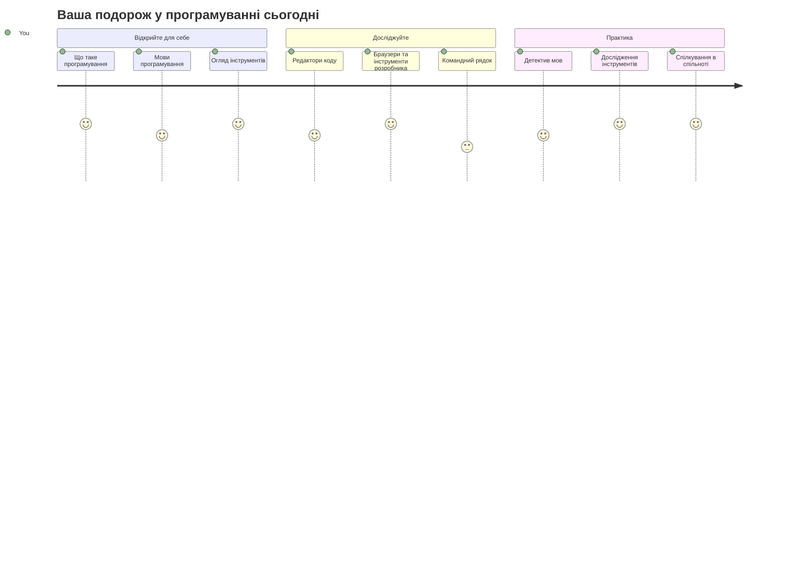
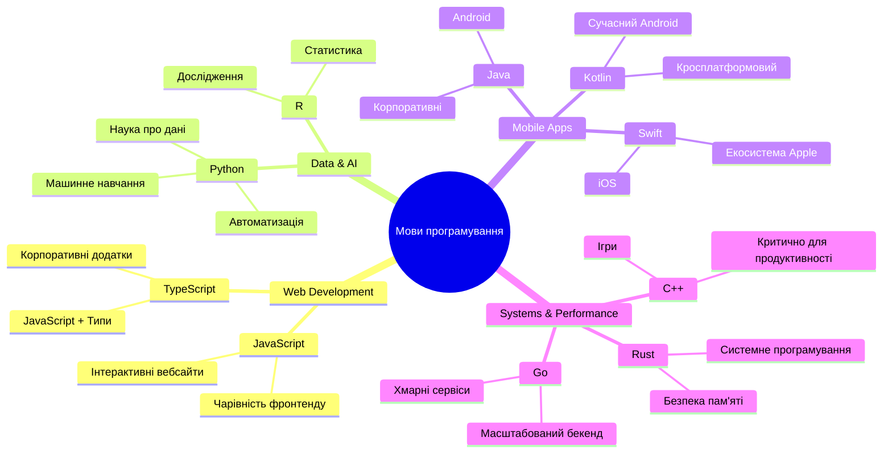
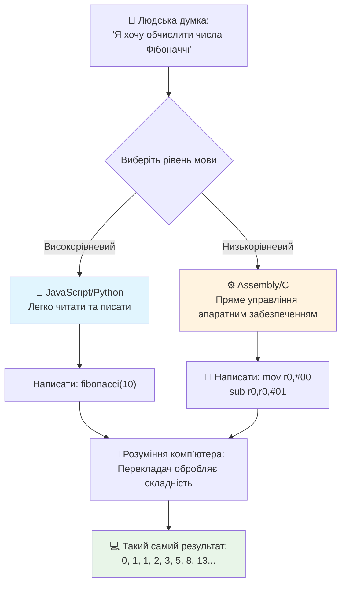
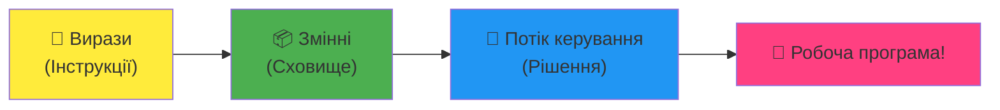
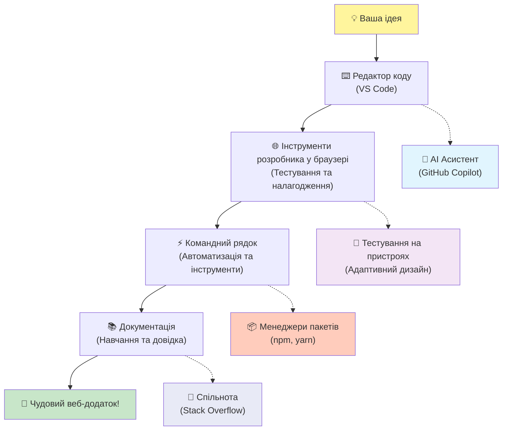
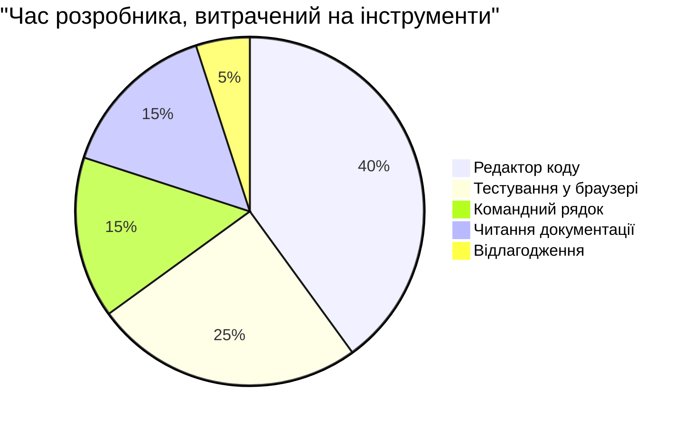
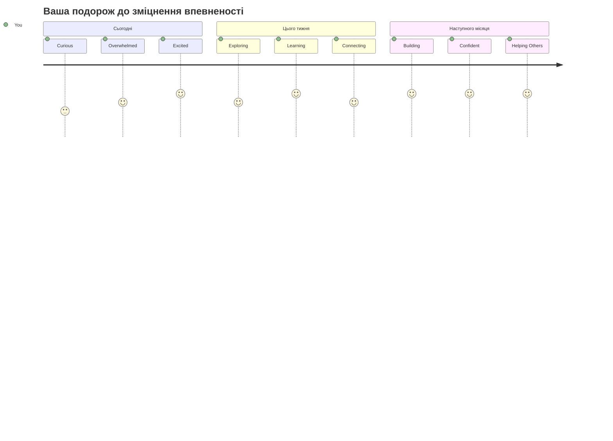

# Вступ до мов програмування та сучасних інструментів розробника
 
Привіт, майбутній розробнику! 👋 Можна розповісти тобі щось, що досі щодня викликає у мене мурашки по шкірі? Ти от-от відкриєш для себе, що програмування — це не просто про комп’ютери, а про справжні суперсили, які допомагають втілити в життя найсміливіші ідеї!

Ти знаєш той момент, коли користуєшся улюбленим додатком і все працює ідеально? Коли натискаєш кнопку і трапляється щось абсолютно чарівне, що змушує тебе сказати: «вау, як вони це ЗРОБИЛИ?» Ну от, хтось, як ти — мабуть, сидячи у своєму улюбленому кафе о 2-й ночі з третім еспресо — написав код, який створив цю магію. І ось що тебе точно вразить: наприкінці цього уроку ти не лише зрозумієш, як вони це зробили, а й сам будеш прагнути спробувати!

Дивись, я цілком розумію, якщо зараз програмування здається тобі страшним. Коли я починав, чесно думав, що треба бути якимось математичним генієм або кодувати з п'яти років. Але ось що остаточно змінило мій погляд: програмування — це точно як вивчення нової мови, щоб спілкуватися. Спершу ти вивчаєш "привіт" і "дякую", потім можеш замовити каву, а згодом ведеш глибокі філософські бесіди! Але в цьому випадку ти спілкуєшся з комп’ютерами, і, чесно? Вони — найбільш терплячі співрозмовники, які тільки можуть бути: ніколи не засуджують твої помилки і завжди раді спробувати знову!

Сьогодні ми дослідимо неймовірні інструменти, які роблять сучасну веб-розробку не просто можливою, а дійсно захопливою. Я говорю про ті самі редактори, браузери та робочі процеси, які щодня використовують розробники в Netflix, Spotify та твоїй улюбленій інді-студії додатків. І от що змусить тебе потанцювати від радості: більшість цих професійних, промислових інструментів абсолютно безкоштовні!


> Скетчнот від [Tomomi Imura](https://twitter.com/girlie_mac)


```mermaid
journey
    title Ваша подорож у програмуванні сьогодні
    section Відкрийте для себе
      Що таке програмування: 5: You
      Мови програмування: 4: You
      Огляд інструментів: 5: You
    section Досліджуйте
      Редактори коду: 4: You
      Браузери та інструменти розробника: 5: You
      Командний рядок: 3: You
    section Практика
      Детектив мов: 4: You
      Дослідження інструментів: 5: You
      Спілкування в спільноті: 5: You
```
## Давай подивимося, що ти вже знаєш!

Перед тим, як поринути у веселощі, мені цікаво — що ти вже знаєш про цей світ програмування? І слухай, якщо ти зараз дивишся на ці питання і думаєш: «Я взагалі не маю жодного уявлення про це», — це не просто нормально, це ідеально! Це означає, що ти саме там, де треба. Уяви цей тест як розминку перед тренуванням — ми просто готуємо м’язи мозку!

[Пройти попередній тест](https://ff-quizzes.netlify.app/web/)


## Пригода, яку ми збираємося пройти разом

Окей, я реально стрибатиму від захвату через те, що ми сьогодні дослідимо! Щиро хочу побачити твоє обличчя, коли деякі концепції нарешті стануть зрозумілими. Ось неймовірна подорож, на яку ми вирушаємо разом:

- **Що таке програмування насправді (і чому це найкрутіша річ у світі!)** – Ми відкриємо, як код — це буквально невидима магія, яка живить усе навколо, від будильника, що якимось чином знає, що зараз ранок понеділка, до алгоритму, що ідеально підбирає рекомендації на Netflix
- **Мови програмування та їх дивовижні особистості** – Уяви вечірку, де кожна людина має зовсім різні суперсили й способи розв’язання проблем. Оце світ мов програмування, і ти будеш у захваті їх знайомлячи!
- **Основні будівельні блоки, які створюють цифрову магію** – Уяви їх як найкращий конструктор LEGO. Щойно розберешся, як ці частини складаються разом, ти зрозумієш, що можеш будувати буквально все, що тільки уявить твоя фантазія
- **Професійні інструменти, які змушують тебе відчути, що у тебе в руках чарівна паличка** – Не перебільшую — ці інструменти справді подарують тобі відчуття суперсил, і найкраща частина — це саме ті, що використовують профі!

> 💡 **Пам’ятай:** навіть не думай сьогодні все запам’ятати! Зараз я хочу, щоб ти відчув іскру захоплення можливостями. Деталі запам’ятаються природно, коли ми практикуватимемось разом — ось як відбувається справжнє навчання!

> Ти можеш пройти цей урок на [Microsoft Learn](https://learn.microsoft.com/en-us/learn/modules/web-development-101/introduction-programming/?WT.mc_id=academic-77807-sagibbon)!

## То що ж таке *програмування*?

Добре, спробуємо розв’язати мільйонне питання: що насправді таке програмування?

Розповім історію, яка зовсім змінила моє сприйняття. Минулого тижня я пояснював мамі, як користуватися нашим новим пультом від смарт-телевізора. Я раптом усвідомив, що кажу щось на кшталт: «Натисни червону кнопку, але не велику червону, а маленьку зліва… ні, з іншого лівого боку… добре, тепер тримай дві секунди, не одну, не три…» Знайомо? 😅

Оце і є програмування! Це мистецтво давати надзвичайно детальні, покрокові інструкції чомусь неймовірно потужному, але що потребує чіткого викладу. Лише замість того, щоб пояснювати мамі (яка може запитати «яку саме червону кнопку?!»), ти пояснюєш комп’ютеру (який виконує саме те, що ти сказав, навіть якщо ти мав на увазі дещо інше).

Ось що мене шокувало, коли я це вперше дізнався: комп’ютери насправді дуже прості в основі. Вони буквально розуміють лише дві речі — 1 і 0, що по суті означає «так» і «ні» або «ввімкнено» і «вимкнено». Ось і все! Але ось де починається магія — нам не потрібно говорити на 1 і 0, ніби ми у фільмі «Матриця». Тут на допомогу приходять **мови програмування**. Вони — ніби найкращий у світі перекладач, який перетворює твої звичайні людські думки в мову комп’ютера.

І ось що й досі щодня мене вражає: буквально *усе* цифрове у твоєму житті почалося з когось, як ти, мабуть, у піжамі з чашкою кави, який друкує код на ноутбуці. Той інстаграм-фільтр, який робить тебе ідеальним? Хтось це закодив. Рекомендація, завдяки якій ти знайшов свою нову улюблену пісню? Розробник створив цей алгоритм. Додаток, що допомагає розділити рахунок за вечерю з друзями? Саме так, хтось подумав: «Це дратує, я, напевно, міг би це полагодити» — і зробив це!

Навчаючись програмувати, ти не просто опановуєш нову навичку — ти стаєш частиною неймовірної спільноти розв’язувачів проблем, які щодня думають: «А що якщо я збудую щось, що зробить комусь день трішки кращим?» Справді, чи може бути крутіше за це?

✅ **Весела фактологія**: Ось що дуже цікаво пошукати, коли матимеш вільну хвилинку — хто, на твою думку, був першим у світі програмістом? Дам тобі підказку: це, мабуть, не те, що ти очікуєш! Історія цієї людини абсолютно захоплива і показує, що програмування завжди було про творчий підхід і нестандартне мислення.

### 🧠 **Час перевірки: Як ти почуваєшся?**

**Виділи хвилинку, щоб подумати:**
- Тепер тобі зрозуміла ідея «давати інструкції комп’ютерам»?
- Чи можеш уявити якусь щоденну справу, яку хочеш автоматизувати за допомогою програмування?
- Які запитання у тебе виникають щодо всього цього програмування?

> **Пам’ятай:** абсолютно нормальна річ, якщо деякі поняття поки що трохи туманні. Вивчення програмування — це як вивчення нової мови, потрібно час, щоб мозок проклав ці нейронні шляхи. Ти робиш чудово!

## Мови програмування — це ніби різні смаки магії

Окей, це може прозвучати дивно, але лишайся зі мною — мови програмування дуже схожі на різні типи музики. Подумай: є джаз, який плавний і імпровізаційний, рок — потужний і прямолінійний, класична — витончена і структурована, і хіп-хоп — креативний і яскравий. Кожен стиль має свій настрій, власну аудиторію пристрасних фанів, і кожен ідеально підходить для різних моментів і подій.

Мови програмування працюють так само! Ти ж не використовував би ту ж мову, щоб створити веселу мобільну гру, що й для обробки величезної кількості кліматичних даних, так само як і не грав би дез-метал на заняттях йогою (ну, принаймні в більшості занять! 😄).

Але ось що мене кожного разу вражає: ці мови — ніби найбільш терплячий і розумний перекладач у світі, який сидить поруч з тобою. Ти можеш висловлювати свої ідеї так, як природно твому людиноподібному мозку, а вони беруть на себе всю складність перекладу в 1 і 0, якою справді розмовляють комп’ютери. Це як мати друга, який досконало володіє і «людською креативністю», і «комп’ютерною логікою» — і він ніколи не втомлюється, не бере перерву на каву і не засуджує, якщо ти повториш питання двічі!

### Популярні мови програмування та їхнє призначення


```mermaid
mindmap
  root((Мови програмування))
    Web Development
      JavaScript
        Чарівність фронтенду
        Інтерактивні вебсайти
      TypeScript
        JavaScript + Типи
        Корпоративні додатки
    Data & AI
      Python
        Наука про дані
        Машинне навчання
        Автоматизація
      R
        Статистика
        Дослідження
    Mobile Apps
      Java
        Android
        Корпоративні
      Swift
        iOS
        Екосистема Apple
      Kotlin
        Сучасний Android
        Кросплатформовий
    Systems & Performance
      C++
        Ігри
        Критично для продуктивності
      Rust
        Безпека пам'яті
        Системне програмування
      Go
        Хмарні сервіси
        Масштабований бекенд
```
| Мова | Найкраще для | Чому популярна |
|----------|----------|------------------|
| **JavaScript** | Веб-розробка, користувацькі інтерфейси | Працює у браузерах і керує інтерактивними вебсайтами |
| **Python** | Наука про дані, автоматизація, штучний інтелект | Легко читається і вивчається, потужні бібліотеки |
| **Java** | Корпоративні програми, Android-додатки | Незалежна від платформи, надійна для великих систем |
| **C#** | Додатки для Windows, розробка ігор | Потужна підтримка екосистеми Microsoft |
| **Go** | Хмарні сервіси, бекенд системи | Швидка, проста, створена для сучасних обчислень |

### Мови високого рівня проти мов низького рівня

Окей, це чесно був той концепт, який зламав мій мозок, коли я починав вчитися, тому я поділюся аналогією, яка допомогла мені зрозуміти — сподіваюся, вона допоможе й тобі!

Уяви, що ти приїхав до країни, де не розмовляєш мовою, і дуже потребуєш знайти найближчий туалет (ми всі через це проходили, правда? 😅):

- **Програмування низького рівня** — це як вивчити місцевий діалект настільки добре, що можеш розмовляти з бабусею, що продає фрукти на кутку, використовуючи культурні посилання, місцевий сленг і жартами, які зрозуміє тільки той, хто виріс там. Дуже вражає і неймовірно ефективно... якщо ти досконало володієш мовою! Але це досить складно, якщо просто потрібно знайти туалет.

- **Програмування високого рівня** — це ніби мати близького місцевого друга, який все розуміє. Ти можеш сказати "Мені дуже потрібно в туалет" просто англійською, а він перекладе культурно і дасть зрозумілі тобі вказівки.

Як це у програмуванні:
- **Мови низького рівня** (наприклад, Assembly або C) дозволяють деталізовано спілкуватися безпосередньо з апаратним забезпеченням комп’ютера, але доводиться думати як машина, що... скажемо так, великий ментальний перехід!
- **Мови високого рівня** (як JavaScript, Python або C#) дозволяють думати як людина, а всю машинну роботу виконують за лаштунками. До того ж у них дуже дружні спільноти, сповнені людей, які пам’ятають, як це — бути новачком, і дійсно хочуть допомогти!

Вгадай, які я пропоную починати? 😉 Мови високого рівня — це як навчальні коліщатка, які ти навряд чи захочеш знімати, бо вони роблять навчання значно приємнішим!


```mermaid
flowchart TB
    A["👤 Людська думка:<br/>'Я хочу обчислити числа Фібоначчі'"] --> B{Виберіть рівень мови}
    
    B -->|Високорівневий| C["🌟 JavaScript/Python<br/>Легко читати та писати"]
    B -->|Низькорівневий| D["⚙️ Assembly/C<br/>Пряме управління апаратним забезпеченням"]
    
    C --> E["📝 Написати: fibonacci(10)"]
    D --> F["📝 Написати: mov r0,#00<br/>sub r0,r0,#01"]
    
    E --> G["🤖 Розуміння комп’ютера:<br/>Перекладач обробляє складність"]
    F --> G
    
    G --> H["💻 Такий самий результат:<br/>0, 1, 1, 2, 3, 5, 8, 13..."]
    
    style C fill:#e1f5fe
    style D fill:#fff3e0
    style H fill:#e8f5e8
```
### Дозволь показати, чому мови високого рівня такі дружні

Добре, я збираюся показати тобі приклад, який ідеально ілюструє, чому я закохався у мови високого рівня, але спершу — обіцяй мені одне. Коли побачиш перший приклад коду, не панікуй! Він має виглядати трохи страшно — це моя основна ідея!

Ми поглянемо на одну й ту ж задачу, написану двома повністю різними стилями. Обидва створять послідовність Фібоначчі — це красива математична послідовність, у якій кожне число є сумою двох попередніх: 0, 1, 1, 2, 3, 5, 8, 13... (Цікавий факт: цей патерн зустрічається буквально всюди в природі — спіралі насіння соняшника, візерунки на шишках, навіть розташування галактик!)

Готовий бачити різницю? Поїхали!

**Мова високого рівня (JavaScript) — зручно для людей:**

```javascript
// Крок 1: Основна установка Фібоначчі
const fibonacciCount = 10;
let current = 0;
let next = 1;

console.log('Fibonacci sequence:');
```

**Ось що робить цей код:**
- **Оголошує** константу, яка вказує, скільки чисел Фібоначчі ми хочемо згенерувати
- **Ініціалізує** дві змінні для відстеження поточного та наступного числа у послідовності
- **Задає** початкові значення (0 та 1), що визначають патерн Фібоначчі
- **Відображає** заголовок, щоб ідентифікувати наш вивід

```javascript
// Крок 2: Згенерувати послідовність за допомогою циклу
for (let i = 0; i < fibonacciCount; i++) {
  console.log(`Position ${i + 1}: ${current}`);
  
  // Обчислити наступне число в послідовності
  const sum = current + next;
  current = next;
  next = sum;
}
```

**Розбір того, що тут відбувається:**
- **Пройдемося** по кожній позиції послідовності за допомогою циклу `for`
- **Відобразимо** кожне число з його позицією, використовуючи інтерполяцію рядків
- **Обчислимо** наступне число Фібоначчі, додавши поточне і наступне значення
- **Оновимо** змінні для переходу до наступної ітерації

```javascript
// Крок 3: Сучасний функціональний підхід
const generateFibonacci = (count) => {
  const sequence = [0, 1];
  
  for (let i = 2; i < count; i++) {
    sequence[i] = sequence[i - 1] + sequence[i - 2];
  }
  
  return sequence;
};

// Приклад використання
const fibSequence = generateFibonacci(10);
console.log(fibSequence);
```

**У цьому коді ми:**
- **Створили** багаторазову функцію, використовуючи сучасний синтаксис стрілкових функцій
- **Побудували** масив, щоб зберігати всю послідовність замість виводу по одному числу
- **Використали** індексацію масиву для розрахунку нового числа з попередніх
- **Повернули** повну послідовність для гнучкого використання в іншій частині програми

**Мова низького рівня (ARM Assembly) — комфортно для комп’ютера:**

```assembly
 area ascen,code,readonly
 entry
 code32
 adr r0,thumb+1
 bx r0
 code16
thumb
 mov r0,#00
 sub r0,r0,#01
 mov r1,#01
 mov r4,#10
 ldr r2,=0x40000000
back add r0,r1
 str r0,[r2]
 add r2,#04
 mov r3,r0
 mov r0,r1
 mov r1,r3
 sub r4,#01
 cmp r4,#00
 bne back
 end
```

Поміти, як версія на JavaScript читається майже як інструкції англійською, а Assembly використовує криптичні команди, що безпосередньо керують процесором комп’ютера. Обидва виконують ту ж саму задачу, але мова високого рівня набагато легша для розуміння, написання та підтримки людьми.

**Головні відмінності, які ти помітиш:**
- **Зчитуваність**: JavaScript використовує описові імена на кшталт `fibonacciCount`, тоді як Assembly застосовує криптичні позначки, такі як `r0`, `r1`
- **Коментарі**: Мови високого рівня заохочують пояснювальні коментарі, які роблять код самодокументованим
- **Структура**: Логічний потік JavaScript відповідає тому, як люди думають про проблеми крок за кроком
- **Підтримка**: Оновлення версії на JavaScript для різних вимог є простим і зрозумілим

✅ **Про послідовність Фібоначчі**: Цей абсолютно чудовий числовий патерн (де кожне число дорівнює сумі двох попередніх: 0, 1, 1, 2, 3, 5, 8...) буквально зустрічається *всюди* у природі! Ви знайдете його у спіралях соняшників, у візерунках шишок, у тому, як вигинаються мушлі наутилуса, а також у тому, як ростуть гілки дерев. Дійсно вражає, як математика та код можуть допомогти зрозуміти і відтворити патерни, які природа використовує для створення краси!


## Будівельні Блоки, Що Створюють Магію

Отже, тепер, коли ви побачили, як виглядають мови програмування на практиці, давайте розберемося з фундаментальними частинами, які складають буквально кожну програму, коли-небудь написану. Уявіть їх як основні інгредієнти у вашому улюбленому рецепті – як тільки ви зрозумієте, що робить кожен із них, ви зможете читати і писати код майже будь-якою мовою!

Це трохи схоже на вивчення граматики програмування. Пам’ятаєте, в школі, коли ви вчили про іменники, дієслова та як складати речення? Програмування має свою власну граматику, і чесно кажучи, вона набагато логічніша і поблажливіша, ніж англійська граматика! 😄

### Оператори: Покрокові Інструкції

Почнемо з **операторів** – це як окремі речення у розмові з вашим комп’ютером. Кожен оператор каже комп’ютеру зробити одну конкретну дію, подібно до вказівок: "Поверни ліворуч тут," "Зупинись на червоному світлі," "Паркуйся в тому місці."

Що мені подобається в операторах, так це їх зазвичай висока читабельність. Подивіться сюди:

```javascript
// Базові оператори, які виконують окремі дії
const userName = "Alex";                    
console.log("Hello, world!");              
const sum = 5 + 3;                         
```

**Ось що цей код робить:**
- **Оголошує** константну змінну для збереження імені користувача
- **Відображає** привітальне повідомлення на консолі
- **Обчислює** і зберігає результат математичної операції

```javascript
// Операції, що взаємодіють з веб-сторінками
document.title = "My Awesome Website";      
document.body.style.backgroundColor = "lightblue";
```

**Крок за кроком відбувається таке:**
- **Змінює** заголовок вебсторінки, що з’являється на вкладці браузера
- **Змінює** колір фону всього тіла сторінки

### Змінні: Система Пам’яті Вашої Програми

Добре, **змінні** чесно кажучи — це одна з моїх улюблених концепцій для навчання, бо вони дуже схожі на речі, які ви використовуєте щодня!

Уявіть список контактів у вашому телефоні. Ви не запам’ятовуєте телефони всіх – замість цього ви зберігаєте "Мама", "Кращий друг" або "Піцерія, що доставляє до 2-ї ночі" і даєте телефону запам’ятати справжні номери. Змінні працюють точно так само! Вони як підписані контейнери, у яких ваша програма може зберігати інформацію і звертатися до неї пізніше за іменем, що має сенс.

Ось що справді круто: змінні можуть змінюватися під час роботи програми (тому вони і називаються "змінними" – бачили, що вони зробили?). Як ви могли б оновити контакт піцерії, якщо знайшли краще місце, так і змінні можна оновлювати, коли програма отримує нову інформацію або у разі зміни обставин!

Дозвольте показати, як це красиво і просто:

```javascript
// Крок 1: Створення базових змінних
const siteName = "Weather Dashboard";        
let currentWeather = "sunny";               
let temperature = 75;                       
let isRaining = false;                      
```

**Для розуміння цих концепцій:**
- **Зберігайте** незмінні значення у `const` змінних (наприклад, назву сайту)
- **Використовуйте** `let` для значень, що можуть змінюватися під час роботи програми
- **Присвоюйте** різні типи даних: рядки (текст), числа і логічні значення (true/false)
- **Обирайте** описові імена, що пояснюють, що містить кожна змінна

```javascript
// Крок 2: Робота з об'єктами для групування пов’язаних даних
const weatherData = {                       
  location: "San Francisco",
  humidity: 65,
  windSpeed: 12
};
```

**У прикладі вище ми:**
- **Створили** об’єкт для групування пов’язаної інформації про погоду
- **Організували** кілька частин даних під одним ім’ям змінної
- **Використали** пари ключ-значення, щоб чітко позначити кожен фрагмент інформації

```javascript
// Крок 3: Використання та оновлення змінних
console.log(`${siteName}: Today is ${currentWeather} and ${temperature}°F`);
console.log(`Wind speed: ${weatherData.windSpeed} mph`);

// Оновлення змінних, які можуть змінюватись
currentWeather = "cloudy";                  
temperature = 68;                          
```

**Пояснення кожної частини:**
- **Відображення** інформації за допомогою шаблонних рядків із синтаксисом `${}`
- **Доступ** до властивостей об’єкта через точкову нотацію (`weatherData.windSpeed`)
- **Оновлення** змінних, оголошених за `let`, щоб відображати зміну умов
- **Комбінування** кількох змінних для створення змістовних повідомлень

```javascript
// Крок 4: Сучасне деструктурування для чистішого коду
const { location, humidity } = weatherData; 
console.log(`${location} humidity: ${humidity}%`);
```

**Що потрібно знати:**
- **Витягування** конкретних властивостей з об’єктів за допомогою деструктуризації
- **Автоматичне створення** нових змінних із тими ж іменами, що й ключі об’єкта
- **Спрощення** коду, уникаючи повторного використання точкової нотації

### Керування Потоком: Навчаємо Програму Думати

Добре, тут програмування стає зовсім вражаючим! **Керування потоком** — це, фактично, навчання вашої програми приймати розумні рішення, так само як ви робите щодня навіть не задумуючись.

Уявіть собі: сьогодні вранці ви, мабуть, робили щось на кшталт "Якщо йде дощ, візьму парасольку. Якщо холодно — одягну куртку. Якщо запізнююсь — пропущу сніданок і візьму каву по дорозі." Ваш мозок природно виконує цю логіку if-then десятки разів щодня!

Саме це робить програми розумними і живими, а не просто безглуздим сценарієм. Вони можуть оцінити ситуацію, проаналізувати, що відбувається, і відповідно реагувати. Це як дати вашій програмі мозок, який може адаптуватися та приймати рішення!

Хочете побачити, як це чудово працює? Дозвольте показати:

```javascript
// Крок 1: Основна умовна логіка
const userAge = 17;

if (userAge >= 18) {
  console.log("You can vote!");
} else {
  const yearsToWait = 18 - userAge;
  console.log(`You'll be able to vote in ${yearsToWait} year(s).`);
}
```

**Ось що робить цей код:**
- **Перевіряє**, чи користувач досяг віку для голосування
- **Виконує** різні блоки коду в залежності від результату умови
- **Обчислює** та відображає, скільки часу залишилось до можливості голосувати, якщо користувачу менше 18 років
- **Надає** конкретний та корисний зворотній зв’язок для кожного випадку

```javascript
// Крок 2: Кілька умов з логічними операторами
const userAge = 17;
const hasPermission = true;

if (userAge >= 18 && hasPermission) {
  console.log("Access granted: You can enter the venue.");
} else if (userAge >= 16) {
  console.log("You need parent permission to enter.");
} else {
  console.log("Sorry, you must be at least 16 years old.");
}
```

**Розбір того, що відбувається тут:**
- **Поєднує** кілька умов за допомогою оператора `&&` (логічне "і")
- **Створює** ієрархію умов із `else if` для кількох сценаріїв
- **Обробляє** всі можливі випадки за допомогою фінального оператора `else`
- **Надає** чіткий і доречний зворотній зв’язок для кожної ситуації

```javascript
// Крок 3: Стисле умовне вираження з тернарним оператором
const votingStatus = userAge >= 18 ? "Can vote" : "Cannot vote yet";
console.log(`Status: ${votingStatus}`);
```

**Запам’ятайте:**
- **Використовуйте** тернарний оператор (`? :`) для простих умов із двома варіантами
- **Пишіть** умову спочатку, за нею `?`, потім результат для true, далі `:`, потім результат для false
- **Застосовуйте** цей патерн, коли потрібно присвоїти значення залежно від умови

```javascript
// Крок 4: Обробка кількох конкретних випадків
const dayOfWeek = "Tuesday";

switch (dayOfWeek) {
  case "Monday":
  case "Tuesday":
  case "Wednesday":
  case "Thursday":
  case "Friday":
    console.log("It's a weekday - time to work!");
    break;
  case "Saturday":
  case "Sunday":
    console.log("It's the weekend - time to relax!");
    break;
  default:
    console.log("Invalid day of the week");
}
```

**Цей код виконує таке:**
- **Зіставляє** значення змінної з кількома конкретними випадками
- **Групує** схожі випадки разом (робочі дні проти вихідних)
- **Виконує** відповідний блок коду, коли знайдено співпадіння
- **Включає** випадок `default` для обробки несподіваних значень
- **Використовує** оператори `break`, щоб запобігти переходу до наступного випадку

> 💡 **Аналогія з реального життя**: уявіть собі керування потоком як найтерплячішу GPS-навігацію у світі, що дає вам вказівки. Вона скаже: "Якщо на Мейн-стріт трафік, візьми хайвей. Якщо хайвей заблокований ремонтом — обирай мальовничий маршрут." Програми використовують той самий тип умовної логіки, щоб розумно реагувати на різні ситуації і завжди забезпечувати користувачам найкращий досвід.

### 🎯 **Перевірка Концепції: Майстерність Будівельних Блоків**

**Перевірмо, як у вас з основами:**
- Чи можете ви власними словами пояснити різницю між змінною та оператором?
- Уявіть реальний приклад, де ви б використали if-then рішення (як у прикладі з голосуванням)
- Що в логіці програмування вас найбільше здивувало?

**Швидкий підйом впевненості:**

```mermaid
flowchart LR
    A["📝 Вирази<br/>(Інструкції)"] --> B["📦 Змінні<br/>(Сховище)"] --> C["🔀 Потік керування<br/>(Рішення)"] --> D["🎉 Робоча програма!"]
    
    style A fill:#ffeb3b
    style B fill:#4caf50
    style C fill:#2196f3
    style D fill:#ff4081
```
✅ **Що буде далі**: Нам належить неймовірно цікава подорож глибше вивчати ці концепції! Зараз просто сосредоточтесь на тому, щоб відчути захват від усіх дивовижних можливостей попереду. Конкретні навички і техніки прийдуть природньо, коли ми разом практикуватимемося – обіцяю, це буде цікавіше, ніж ви очікуєте!

## Інструменти Торгівлі

Чесно кажучи, це місце, де я так збуджуюсь, що ледь стримуюсь! 🚀 Зараз поговоримо про неймовірні інструменти, які змусить вас відчути, що вам щойно передали ключі від цифрового космічного корабля.

Знаєте, як у шеф-кухаря є ідеально збалансовані ножі, які відчуваються як продовження рук? А у музиканта є гітара, яка наче співає, щойно він до неї торкається? Так ось, у розробників є свої магічні інструменти, і ось що вас цілком здивує – більшість із них абсолютно безкоштовні!

Я практично стрибаю в кріслі, думаючи про те, щоб поділитися ними з вами, бо вони абсолютно революціонізували наш спосіб створення програмного забезпечення. Ми говоримо про помічників кодування з підтримкою ШІ, які можуть допомагати писати ваш код (і це не жарт!), хмарні середовища, де ви можете будувати цілі додатки буквально звідусіль, де є Wi-Fi, і інструменти налагодження, настільки досконалі, що це наче рентген для ваших програм.

І ось що досі викликає у мене мурашки: ці інструменти не "для початківців", які ви з часом переростете. Це точно ті ж професійні інструменти, які в цей самий момент використовують розробники в Google, Netflix і тій інді-студії, що вам подобається. Ви будете відчувати себе справжнім профі, працюючи з ними!


```mermaid
graph TD
    A["💡 Ваша ідея"] --> B["⌨️ Редактор коду<br/>(VS Code)"] 
    B --> C["🌐 Інструменти розробника у браузері<br/>(Тестування та налагодження)"]
    C --> D["⚡ Командний рядок<br/>(Автоматизація та інструменти)"]
    D --> E["📚 Документація<br/>(Навчання та довідка)"]
    E --> F["🚀 Чудовий веб-додаток!"]
    
    B -.-> G["🤖 AI Асистент<br/>(GitHub Copilot)"]
    C -.-> H["📱 Тестування на пристроях<br/>(Адаптивний дизайн)"]
    D -.-> I["📦 Менеджери пакетів<br/>(npm, yarn)"]
    E -.-> J["👥 Спільнота<br/>(Stack Overflow)"]
    
    style A fill:#fff59d
    style F fill:#c8e6c9
    style G fill:#e1f5fe
    style H fill:#f3e5f5
    style I fill:#ffccbc
    style J fill:#e8eaf6
```
### Редактори Коду та IDE: Ваші Нові Цифрові Кращі Друзі

Поговоримо про редактори коду — вони скоро стануть вашими улюбленими робочими місцями! Уявіть їх як особисте кодинг-святилище, де ви проведете більшість часу, створюючи і відшліфовуючи свої цифрові твори.

Але ось що справді чарівне у сучасних редакторах: це не просто розкішні текстові редактори. Це немов найрозумніший і найпідтримуючий наставник з кодування, який сидить біля вас 24/7. Вони ловлять ваші помилки до того, як ви їх помітите, пропонують покращення, що роблять вас генієм, допомагають зрозуміти, що робить кожен шматок коду, а деякі навіть можуть передбачати, що ви збираєтеся набрати, і пропонують закінчити ваші думки!

Я пам’ятаю, коли вперше відкрив авто-заповнення — відчував, що живу у майбутньому. Починаєте набирати щось, і редактор каже: «Гей, ти думав про цю функцію, що робить саме те, що тобі потрібно?» Це як мати телепата у ролі колеги!

**Що робить ці редактори неймовірними?**

Сучасні редактори коду пропонують вражаючий набір функцій, що підвищують вашу продуктивність:

| Функція | Що робить | Чому допомагає |
|---------|-----------|----------------|
| **Виділення Синтаксису** | Розфарбовує різні частини коду | Робить код легшим для читання і виявлення помилок |
| **Автозаповнення** | Пропонує код під час введення | Прискорює написання коду і знижує кількість помилок |
| **Інструменти налагодження** | Допомагають знаходити і виправляти помилки | Економлять години виправлення помилок |
| **Розширення** | Додають спеціалізовані функції | Налаштовують редактор під будь-яку технологію |
| **Помічники на основі ШІ** | Пропонують код та пояснення | Прискорюють навчання і продуктивність |

> 🎥 **Відеоресурс**: Хочете побачити ці інструменти в дії? Подивіться це [відео про Інструменти Торгівлі](https://youtube.com/watch?v=69WJeXGBdxg) для повного огляду.

#### Рекомендовані редактори для веб-розробки

**[Visual Studio Code](https://code.visualstudio.com/?WT.mc_id=academic-77807-sagibbon)** (Безкоштовно)
- Найпопулярніший серед веб-розробників
- Відмінна екосистема розширень
- Вбудований термінал і інтеграція з Git
- **Обов’язкові розширення**:
  - [GitHub Copilot](https://marketplace.visualstudio.com/items?itemName=GitHub.copilot) - пропозиції коду на базі ШІ
  - [Live Share](https://marketplace.visualstudio.com/items?itemName=MS-vsliveshare.vsliveshare) - спільна робота в реальному часі
  - [Prettier](https://marketplace.visualstudio.com/items?itemName=esbenp.prettier-vscode) - автоматичне форматування коду
  - [Code Spell Checker](https://marketplace.visualstudio.com/items?itemName=streetsidesoftware.code-spell-checker) - пошук помилок у коді

**[JetBrains WebStorm](https://www.jetbrains.com/webstorm/)** (Платно, безкоштовно для студентів)
- Розвинені інструменти налагодження і тестування
- Інтелектуальне автозаповнення коду
- Вбудоване керування версіями

**Хмарні IDE** (Різні ціни)
- [GitHub Codespaces](https://github.com/features/codespaces) - повний VS Code у браузері
- [Replit](https://replit.com/) - чудово для навчання та обміну кодом
- [StackBlitz](https://stackblitz.com/) - миттєва повноцінна веб-розробка

> 💡 **Порада для початку**: Починайте з Visual Studio Code — це безкоштовно, широко використовується у галузі і має величезну спільноту, що створює корисні навчальні матеріали та розширення.


### Веб-браузери: Ваша Таємна Лабораторія Розробника

Добре, готуйтеся, це вас реально вразить! Ви ж використовуєте браузери, щоб гортати соцмережі і дивитися відео, правда? Виявляється, вони весь цей час ховали неймовірну секретну лабораторію розробника, чекаючи, поки ви її відкриєте!

Щоразу, коли ви клікаєте правою кнопкою на вебсторінці і обираєте "Перевірити елемент", ви відкриваєте прихований світ інструментів розробника, які чесно кажучи, потужніші за багато дорогого софту, за який я колись платив сотні доларів. Це ніби виявити, що у вашій звичайній кухні прихована лабораторія професійного шеф-кухаря за секретною панеллю!
Вперше, коли мені показали браузерні DevTools, я провів близько трьох годин, просто клікаючи навколо і кажучи: "ЧЕКАЙ, ВОНИ ЦЕ ТАКОЖ ВМІЮТЬ?!" Ви буквально можете редагувати будь-який веб-сайт у реальному часі, бачити, наскільки швидко все завантажується, тестувати, як ваш сайт виглядає на різних пристроях, а також відлагоджувати JavaScript як справжній професіонал. Це абсолютно вражає!

**Ось чому браузери — ваш секретний козир:**

Коли ви створюєте веб-сайт або веб-додаток, вам потрібно бачити, як він виглядає і поводиться у реальному світі. Браузери не тільки відображають вашу роботу, але й надають детальний зворотній зв’язок про продуктивність, доступність та потенційні проблеми.

#### Інструменти розробника браузера (DevTools)

Сучасні браузери включають всебічні комплекти інструментів для розробки:

| Категорія інструментів | Що робить | Приклад використання |
|------------------------|-----------|---------------------|
| **Інспектор елементів** | Перегляд і редагування HTML/CSS у режимі реального часу | Налаштування стилів з миттєвим результатом |
| **Консоль** | Перегляд повідомлень про помилки та тестування JavaScript | Відлагодження проблем і експерименти з кодом |
| **Мережевий монітор** | Відстеження завантаження ресурсів | Оптимізація продуктивності та часу завантаження |
| **Перевірка доступності** | Тестування інклюзивного дизайну | Забезпечення роботи сайту для всіх користувачів |
| **Симулятор пристроїв** | Попередній перегляд на різних розмірах екранів | Тестування адаптивного дизайну без різних пристроїв |

#### Рекомендовані браузери для розробки

- **[Chrome](https://developers.google.com/web/tools/chrome-devtools/)** — галузевий стандарт DevTools з широкою документацією
- **[Firefox](https://developer.mozilla.org/docs/Tools)** — чудові інструменти для CSS Grid і доступності
- **[Edge](https://docs.microsoft.com/microsoft-edge/devtools-guide-chromium/?WT.mc_id=academic-77807-sagibbon)** — на базі Chromium з ресурсами розробника Microsoft

> ⚠️ **Важлива порада щодо тестування**: Завжди тестуйте свої сайти у кількох браузерах! Те, що ідеально працює в Chrome, може виглядати інакше в Safari або Firefox. Професійні розробники тестують у всіх основних браузерах, щоб забезпечити послідовний користувацький досвід.

### Інструменти командного рядка: ваш вхід у суперсили розробника

Гаразд, давайте будемо цілком чесними про командний рядок, бо я хочу, щоб ви почули це від когось, хто справді розуміє. Коли я його вперше побачив – просто цей страшний чорний екран з миготливим текстом – я буквально подумав: «Ні, ні в жодному разі! Це виглядає як щось із хакерського фільму 80-х, і я точно недостатньо розумний для цього!» 😅

Але ось що я хотів би, щоб мені тоді сказали, і що я кажу вам зараз: командний рядок не страшний – це насправді як прямий діалог з вашим комп’ютером. Уявіть це як різницю між замовленням їжі через гарний додаток із фото й меню (що гарно і просто) і входом у ваш улюблений місцевий ресторан, де кухар точно знає, що вам подобається, і може приготувати щось ідеальне просто за вашою фразою: «здивуй мене чимось неймовірним».

Командний рядок — це те місце, куди йдуть розробники, щоб почуватися справжніми чаклунами. Ви вводите кілька ніби магічних слів (гаразд, це просто команди, але вони відчуваються магічними!), натискаєте Enter, і БАЦ — створюєте цілі структури проєктів, встановлюєте потужні інструменти зі всього світу або розгортаєте свій додаток в інтернеті, щоб мільйони людей його побачили. Як тільки ви спробуєте цю силу, це дійсно затягує!

**Чому командний рядок стане вашим улюбленим інструментом:**

Хоча графічні інтерфейси чудові для багатьох завдань, командний рядок виділяється в автоматизації, точності та швидкості. Багато інструментів розробки працюють головно через командний рядок, і вміння використовувати їх ефективно суттєво підвищує вашу продуктивність.

```bash
# Крок 1: Створіть каталог проекту та перейдіть до нього
mkdir my-awesome-website
cd my-awesome-website
```

**Ось що робить цей код:**
- **Створює** нову папку "my-awesome-website" для вашого проєкту
- **Переходить** у щойно створену папку, щоб почати роботу

```bash
# Крок 2: Ініціалізація проекту з package.json
npm init -y

# Встановіть сучасні інструменти розробки
npm install --save-dev vite prettier eslint
npm install --save-dev @eslint/js
```

**Крок за кроком, що відбувається:**
- **Ініціалізує** новий проєкт Node.js з типовими налаштуваннями за допомогою `npm init -y`
- **Встановлює** Vite як сучасний інструмент збірки для швидкої розробки і продакшн-збірки
- **Додає** Prettier для автоматичного форматування коду та ESLint для перевірки якості коду
- **Використовує** прапорець `--save-dev`, щоб відмітити залежності як лише для розробки

```bash
# Крок 3: Створіть структуру проекту та файли
mkdir src assets
echo '<!DOCTYPE html><html><head><title>My Site</title></head><body><h1>Hello World</h1></body></html>' > index.html

# Запустіть сервер розробки
npx vite
```

**У наведеному вище ми:**
- **Організували** проєкт, створивши окремі папки для вихідного коду та ресурсів
- **Згенерували** базовий HTML-файл з правильною структурою документа
- **Запустили** сервер розробки Vite для живого оновлення та гарячої заміни модулів

#### Необхідні інструменти командного рядка для веб-розробки

| Інструмент | Призначення | Чому потрібен |
|------------|-------------|---------------|
| **[Git](https://git-scm.com/)** | Контроль версій | Відслідковування змін, співпраця з іншими, резервне копіювання роботи |
| **[Node.js & npm](https://nodejs.org/)** | Виконання JavaScript і керування пакетами | Запуск JavaScript поза браузерами, встановлення сучасних інструментів розробки |
| **[Vite](https://vitejs.dev/)** | Інструмент збірки і сервер розробки | Надшвидка розробка з гарячою заміною модулів |
| **[ESLint](https://eslint.org/)** | Якість коду | Автоматичне виявлення та виправлення проблем у JavaScript |
| **[Prettier](https://prettier.io/)** | Форматування коду | Підтримка коду чистим та послідовно відформатованим |

#### Варіанти для конкретних платформ

**Windows:**
- **[Windows Terminal](https://docs.microsoft.com/windows/terminal/?WT.mc_id=academic-77807-sagibbon)** — сучасний, багатофункціональний термінал
- **[PowerShell](https://docs.microsoft.com/powershell/?WT.mc_id=academic-77807-sagibbon)** 💻 — потужне скриптове середовище
- **[Command Prompt](https://learn.microsoft.com/windows-server/administration/windows-commands/windows-commands)** 💻 — традиційний командний рядок Windows

**macOS:**
- **[Terminal](https://support.apple.com/guide/terminal/)** 💻 — вбудований термінал
- **[iTerm2](https://iterm2.com/)** — розширений термінал з додатковими функціями

**Linux:**
- **[Bash](https://www.gnu.org/software/bash/)** 💻 — стандартна оболонка Linux
- **[KDE Konsole](https://docs.kde.org/trunk5/en/konsole/konsole/index.html)** — розширений емулятор терміналу

> 💻 = Попередньо встановлено в операційній системі

> 🎯 **Шлях навчання**: Почніть з базових команд, як-от `cd` (зміна каталогів), `ls` або `dir` (перелік файлів) і `mkdir` (створення папки). Практикуйтеся з сучасними командами робочого процесу, наприклад, `npm install`, `git status` та `code .` (відкриває поточну теку у VS Code). Згодом ви природньо опануєте більш складні команди й техніки автоматизації.

### Документація: ваш завжди доступний вчитель

Добре, поділюся маленьким секретом, який допоможе вам почуватись набагато впевненіше у статусі початківця: навіть найдосвідченіші розробники витрачають величезну частину свого часу на читання документації. І це не тому, що вони не знають, що роблять – це насправді ознака мудрості!

Уявіть документацію як доступ до найтерплячіших і найобізнаніших вчителів у світі, які доступні 24/7. Застрягли з проблемою о 2-й ночі? Документація тут із теплим віртуальним обіймом і саме тією відповіддю, яка вам потрібна. Хочете дізнатися про якусь класну нову функцію, про яку всі говорять? Документація підтримає вас покроковими прикладами. Прагнете зрозуміти, чому щось працює саме так? Вгадайте що — документація готова пояснити це так, що нарешті все стане на свої місця!

Ось що повністю змінило мою точку зору: світ веб-розробки рухається неймовірно швидко, і ніхто (я маю на увазі абсолютно ніхто!) не тримає все в пам’яті. Я бачив старших розробників із понад 15 роками досвіду, які шукали базовий синтаксис, і знаєте що? Це не соромно — це розумно! Справа не в ідеальній пам’яті, а в тому, щоб знати, де швидко знайти надійні відповіді і як їх застосувати.

**Ось де відбувається справжня магія:**

Професійні розробники значну частину часу витрачають на читання документації – не тому, що вони не знають, що роблять, а тому, що світ веб-розробки настільки динамічний, що триматися в курсі означає постійно вчитися. Чудова документація допомагає зрозуміти не лише *як* щось використовувати, а й *чому* і *коли* це робити.

#### Важливі ресурси документації

**[Mozilla Developer Network (MDN)](https://developer.mozilla.org/docs/Web)**
- Золотий стандарт документації для веб-технологій
- Повні посібники для HTML, CSS та JavaScript
- Містить інформацію про сумісність із браузерами
- Ілюстровані практичні приклади та інтерактивні демо

**[Web.dev](https://web.dev)** (від Google)
- Сучасні кращі практики веб-розробки
- Посібники з оптимізації продуктивності
- Принципи доступності та інклюзивного дизайну
- Кейси з реальних проєктів

**[Документація Microsoft Developer](https://docs.microsoft.com/microsoft-edge/#microsoft-edge-for-developers)**
- Ресурси для розробки браузера Edge
- Посібники з Progressive Web App
- Інформація про кросплатформну розробку

**[Frontend Masters Learning Paths](https://frontendmasters.com/learn/)**
- Структуровані навчальні курси
- Відеоуроки від експертів галузі
- Практичні вправи з кодування

> 📚 **Стратегія навчання**: Не намагайтеся запам’ятати документацію – натомість навчіться ефективно нею користуватися. Зробіть закладки на часто потрібні посилання та практикуйтеся швидко шукати конкретну інформацію.

### 🔧 **Перевірка навичок інструментів: що вам до вподоби?**

**Почекайте хвилинку і подумайте:**
- Який інструмент вам найцікавіше спробувати першим? (Правильної чи неправильної відповіді немає!)
- Командний рядок досі лякає, чи ви вже зацікавлені дослідити його?
- Чи можете уявити, як будете користуватися DevTools в браузері, щоб заглянути за лаштунки улюблених сайтів?


```mermaid
pie title "Час розробника, витрачений на інструменти"
    "Редактор коду" : 40
    "Тестування у браузері" : 25
    "Командний рядок" : 15
    "Читання документації" : 15
    "Відлагодження" : 5
```
> **Цікавий факт**: Більшість розробників проводить близько 40% часу у своєму редакторі коду, але зверніть увагу, скільки часу йде на тестування, навчання та розв’язання проблем. Програмування – це не тільки написання коду, а створення досвіду!

✅ **Для роздумів**: Ось цікаве питання для вас — як ви думаєте, чим можуть відрізнятися інструменти для створення веб-сайтів (розробка) від інструментів для проектування їхнього вигляду (дизайн)? Це як різниця між архітектором, який проектує красивий будинок, і підрядником, який його реально будує. Обидва важливі, але їм потрібні різні набори інструментів! Такий підхід допоможе вам краще зрозуміти загальну картину створення сайтів.

## Випробування агента GitHub Copilot 🚀

Використайте режим агента, щоб виконати наступне завдання:

**Опис:** Вивчіть функції сучасного редактора коду або IDE і покажіть, як він може покращити ваш робочий процес як веб-розробника.

**Завдання:** Оберіть редактор коду або IDE (наприклад Visual Studio Code, WebStorm або хмарний IDE). Назвіть три функції або розширення, які допомагають вам ефективніше писати, відлагоджувати чи підтримувати код. Для кожного коротко поясніть, як це покращує вашу роботу.

---

## 🚀 Виклик

**Добре, детективе, готові до першої справи?**

Тепер, коли у вас є ця чудова база, у мене для вас пригода, яка допоможе побачити, наскільки неймовірно різноманітний і захопливий світ програмування. І слухайте – це поки не про написання коду, тож не хвилюйтеся! Уявіть себе детективом мов програмування на вашій першій захопливій справі!

**Ваше завдання, якщо ви на нього погодитесь:**
1. **Стати дослідником мов:** Виберіть три мови програмування з абсолютно різних всесвітів — можливо, одну для створення сайтів, одну для мобільних додатків і одну для обробки даних для науковців. Знайдіть приклади виконання однієї простої задачі на кожній мові. Обіцяю, ви будете вражені, наскільки вони можуть виглядати по-різному, виконуючи ту саму справу!

2. **Відкрийте їхні історії виникнення:** Що робить кожну мову унікальною? Ось цікавий факт — кожна мова програмування була створена, бо хтось подумав: «Знаєш, має бути кращий спосіб розв’язати цю конкретну проблему.» Чи зможете ви зрозуміти, які проблеми це були? Деякі з цих історій справді захопливі!

3. **Познайомтеся з спільнотами:** Подивіться, наскільки гостинна і захоплена кожна спільнота мови. Деякі налічують мільйони розробників, які діляться знаннями та допомагають одне одному, інші менші, але дуже згуртовані та підтримують. Вам сподобається побачити, які різні характери мають ці спільноти!

4. **Слухайте свою інтуїцію:** Яка мова зараз здається вам найбільш доступною? Не хвилюйтеся про «ідеальний» вибір — просто довіряйте своїм відчуттям! Тут немає неправильних відповідей, і пізніше ви завжди зможете дослідити інші.

**Бонус для детектива:** Спробуйте дізнатися, які великі сайти чи додатки побудовані на кожній з мов. Гарантую, ви будете шоковані, дізнавшись, що живить Instagram, Netflix або ту мобільну гру, в яку не можете відірватися!

> 💡 **Пам’ятайте:** Сьогодні ви не намагаєтесь стати експертом у жодній з цих мов. Ви просто знайомитеся з навколишнім світом, перш ніж вирішити, де хочете оселитися. Не поспішайте, отримуйте задоволення і нехай ваша цікавість веде вас!

## Святкуємо ваші відкриття!

Вау, ви засвоїли стільки неймовірної інформації сьогодні! Я щиро радий бачити, як багато з цього дивовижного шляху ви запам’ятали. І пам’ятайте — це не тест, де потрібно все зробити ідеально. Це радше святкування всього крутого, чого ви дізналися про цей захопливий світ, у який ви тільки-но занурюєтесь!

[Пройдіть опитування після уроку](https://ff-quizzes.netlify.app/web/)

## Огляд та самостійне вивчення

**Не поспішайте, досліджуйте і насолоджуйтеся!**
Ви сьогодні охопили багато тем, і це справжній привід для гордості! Тепер настає найцікавіша частина – вивчення тем, які розпалили вашу цікавість. Пам’ятайте, це не домашнє завдання – це пригода!

**Занурюйтеся глибше в те, що вас захоплює:**

**Практикуйтеся з мовами програмування:**
- Відвідайте офіційні сайти 2-3 мов, які привернули вашу увагу. Кожна має свій характер і історію!
- Спробуйте онлайн-платформи для кодування, такі як [CodePen](https://codepen.io/), [JSFiddle](https://jsfiddle.net/), або [Replit](https://replit.com/). Не бійтеся експериментувати – нічого зламати не можна!
- Прочитайте про те, як з’явилася ваша улюблена мова. Серйозно, деякі історії виникнення дуже захопливі й допоможуть зрозуміти, чому мови працюють так, як вони працюють.

**Привчайтеся до нових інструментів:**
- Завантажте Visual Studio Code, якщо ще не зробили цього – це безкоштовно, і вам сподобається!
- Проведіть кілька хвилин, переглядаючи магазин розширень. Це як магазин додатків для вашого редактора коду!
- Відкрийте інструменти розробника у вашому браузері і просто клікайте навколо. Не переймайтеся, якщо не все зрозуміло – просто ознайомтеся з тим, що там є.

**Приєднуйтеся до спільноти:**
- Підписуйтеся на деякі спільноти розробників на [Dev.to](https://dev.to/), [Stack Overflow](https://stackoverflow.com/) або [GitHub](https://github.com/). Спільноти програмістів надзвичайно гостинні до новачків!
- Переглядайте відео для початківців на YouTube. Там багато чудових авторів, які пам’ятають, як це – тільки починати.
- Розгляньте можливість приєднатися до локальних зустрічей або онлайн-спільнот. Повірте, розробники люблять допомагати новачкам!

> 🎯 **Слухайте, що я хочу, щоб ви запам’ятали**: Не очікується, що ви станете майстром кодування за одну ніч! Наразі ви лише знайомитеся з цим дивовижним новим світом, у якому вам належить опинитися. Не поспішайте, насолоджуйтеся подорожжю і пам’ятайте – кожен розробник, якого ви поважаєте, колись сидів саме там, де сидите ви зараз, відчуваючи захоплення і, можливо, трохи розгубленості. Це цілком нормально і означає, що ви все робите правильно!


## Завдання

[Reading the Docs](assignment.md)

> 💡 **Невеликий поштовх до вашого завдання**: Мені дуже хотілося б побачити, як ви досліджуєте інструменти, про які ми ще не говорили! Обминіть редактори, браузери та командні рядки, про які ми вже згадували – існує цілий неймовірний всесвіт дивовижних інструментів розробника, що чекають на відкриття. Обирайте ті, які активно підтримуються і мають живі, корисні спільноти (саме такі зазвичай пропонують найкращі навчальні матеріали і найбільше підтримки, коли ви, неминуче, застрягнете і потребуватимете дружньої допомоги).

---

## 🚀 Ваш графік вивчення програмування

### ⚡ **Що ви можете зробити за наступні 5 хвилин**
- [ ] Додати в закладки сайти 2-3 мов програмування, які вас зацікавили
- [ ] Завантажити Visual Studio Code, якщо ще не зробили цього
- [ ] Відкрити DevTools у браузері (F12) і клацати на будь-якому сайті
- [ ] Приєднатися до однієї спільноти програмістів (Dev.to, Reddit r/webdev або Stack Overflow)

### ⏰ **Що ви можете зробити за цю годину**
- [ ] Пройти тест після уроку і подумати над своїми відповідями
- [ ] Встановити у VS Code розширення GitHub Copilot
- [ ] Спробувати приклад "Hello World" у двох різних мовах програмування онлайн
- [ ] Подивитися відео "День із життя розробника" на YouTube
- [ ] Розпочати дослідницьку роботу з обраними мовами програмування (за викликом)

### 📅 **Ваш тижневий план пригод**
- [ ] Виконати завдання і дослідити 3 нові інструменти розробника
- [ ] Підписатися на 5 розробників або профілів про програмування у соцмережах
- [ ] Спробувати створити щось маленьке в CodePen або Replit (навіть просто "Hello, [Ваше ім’я]!")
- [ ] Прочитати блог пост розробника про його шлях програміста
- [ ] Приєднатися до віртуальної зустрічі або подивитися доповідь про програмування
- [ ] Почати вивчення обраної мови за онлайн-уроками

### 🗓️ **Ваш місячний план трансформації**
- [ ] Збудувати свій перший невеликий проєкт (навіть проста вебсторінка згодиться!)
- [ ] Внести вклад у проєкт з відкритим кодом (почати з виправлень документації)
- [ ] Наставляти когось, хто тільки починає свій шлях програміста
- [ ] Створити свій портфоліо розробника
- [ ] Налагодити зв’язки з місцевими спільнотами розробників або навчальними групами
- [ ] Почати планувати наступний етап свого навчання

### 🎯 **Підсумкова рефлексія**

**Перед тим, як рухатися далі, знайдіть момент, щоб відсвяткувати:**
- Що сьогодні у програмуванні вас найбільше захопило?
- Який інструмент чи концепцію ви хочете дослідити першою?
- Які у вас враження від початку цієї подорожі програмування?
- Яке питання ви зараз хотіли б задати розробнику?


```mermaid
journey
    title Ваша подорож до зміцнення впевненості
    section Сьогодні
      Curious: 3: You
      Overwhelmed: 4: You
      Excited: 5: You
    section Цього тижня
      Exploring: 4: You
      Learning: 5: You
      Connecting: 4: You
    section Наступного місяця
      Building: 5: You
      Confident: 5: You
      Helping Others: 5: You
```
> 🌟 **Пам’ятайте**: Кожен експерт колись був новачком. Кожен досвідчений розробник колись відчував саме те, що відчуваєте ви – захоплення, може трохи плутанину, і безсумнівну цікавість до того, що можливо. Ви в чудовій компанії, і ця подорож обіцяє бути неймовірною. Ласкаво просимо у дивовижний світ програмування! 🎉

---

<!-- CO-OP TRANSLATOR DISCLAIMER START -->
**Відмова від відповідальності**:  
Цей документ був перекладений за допомогою сервісу автоматичного перекладу [Co-op Translator](https://github.com/Azure/co-op-translator). Хоча ми прагнемо до точності, будь ласка, майте на увазі, що автоматичні переклади можуть містити помилки або неточності. Оригінальний документ рідною мовою слід вважати авторитетним джерелом. Для важливої інформації рекомендується звертатися до професійного людського перекладу. Ми не несемо відповідальності за будь-які непорозуміння або неправильні тлумачення, що виникли внаслідок використання цього перекладу.
<!-- CO-OP TRANSLATOR DISCLAIMER END -->