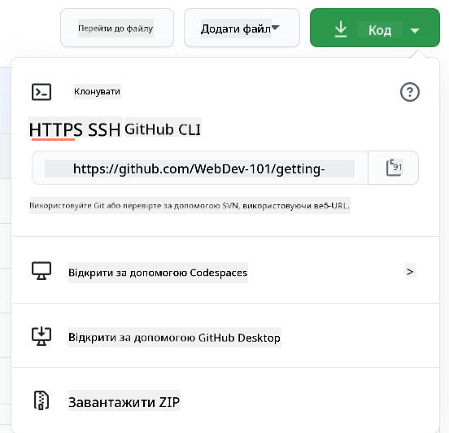

<!--
CO_OP_TRANSLATOR_METADATA:
{
  "original_hash": "ea65b75e488aa33a3cc5cb1c6c3f047a",
  "translation_date": "2025-10-03T14:20:40+00:00",
  "source_file": "1-getting-started-lessons/2-github-basics/README.md",
  "language_code": "uk"
}
-->
# Вступ до GitHub

Цей урок охоплює основи GitHub — платформи для хостингу та управління змінами у вашому коді.


> Скетчнот від [Tomomi Imura](https://twitter.com/girlie_mac)

## Тест перед лекцією
[Тест перед лекцією](https://ff-quizzes.netlify.app)

## Вступ

У цьому уроці ми розглянемо:

- відстеження роботи на вашому комп'ютері
- роботу над проектами з іншими
- як зробити внесок у програмне забезпечення з відкритим кодом

### Попередні вимоги

Перед початком перевірте, чи встановлений Git. У терміналі введіть: 
`git --version`

Якщо Git не встановлений, [завантажте Git](https://git-scm.com/downloads). Потім налаштуйте локальний профіль Git у терміналі:
* `git config --global user.name "your-name"`
* `git config --global user.email "your-email"`

Щоб перевірити, чи Git вже налаштований, введіть:
`git config --list`

Вам також знадобиться обліковий запис GitHub, редактор коду (наприклад, Visual Studio Code), і потрібно буде відкрити термінал (або командний рядок).

Перейдіть на [github.com](https://github.com/) і створіть обліковий запис, якщо у вас його ще немає, або увійдіть і заповніть свій профіль.

✅ GitHub — не єдиний репозиторій коду у світі; є й інші, але GitHub — найвідоміший.

### Підготовка

Вам знадобиться папка з проектом коду на вашому локальному комп'ютері (ноутбуці або ПК) і публічний репозиторій на GitHub, який буде слугувати прикладом того, як робити внесок у проекти інших.

---

## Управління кодом

Припустимо, у вас є локальна папка з проектом коду, і ви хочете почати відстежувати свій прогрес за допомогою git — системи контролю версій. Дехто порівнює використання git із написанням любовного листа до себе в майбутньому. Читаючи ваші повідомлення про коміти через дні, тижні чи місяці, ви зможете згадати, чому прийняли те чи інше рішення, або "відкотити" зміни — за умови, що ви пишете хороші "повідомлення про коміти".

### Завдання: Створіть репозиторій і закомітьте код  

> Перегляньте відео
> 
> [](https://www.youtube.com/watch?v=9R31OUPpxU4)

1. **Створіть репозиторій на GitHub**. На GitHub.com, у вкладці репозиторіїв або у верхньому правому куті навігаційної панелі, знайдіть кнопку **new repo**.

   1. Дайте вашому репозиторію (папці) назву.
   1. Виберіть **create repository**.

1. **Перейдіть до вашої робочої папки**. У терміналі перейдіть до папки (також відомої як каталог), яку ви хочете почати відстежувати. Введіть:

   ```bash
   cd [name of your folder]
   ```

1. **Ініціалізуйте git-репозиторій**. У вашому проекті введіть:

   ```bash
   git init
   ```

1. **Перевірте статус**. Щоб перевірити статус вашого репозиторію, введіть:

   ```bash
   git status
   ```

   Вивід може виглядати приблизно так:

   ```output
   Changes not staged for commit:
   (use "git add <file>..." to update what will be committed)
   (use "git checkout -- <file>..." to discard changes in working directory)

        modified:   file.txt
        modified:   file2.txt
   ```

   Зазвичай команда `git status` повідомляє вам, які файли готові до _збереження_ у репозиторії або мають зміни, які ви, можливо, захочете зберегти.

1. **Додайте всі файли для відстеження**
   Це також називається підготовкою файлів/додаванням файлів до області підготовки.

   ```bash
   git add .
   ```

   Аргумент `git add` плюс `.` означає, що всі ваші файли та зміни будуть відстежуватися.

1. **Додайте вибрані файли для відстеження**

   ```bash
   git add [file or folder name]
   ```

   Це дозволяє додати лише вибрані файли до області підготовки, якщо ви не хочете закомітити всі файли одразу.

1. **Відмінити підготовку всіх файлів**

   ```bash
   git reset
   ```

   Ця команда дозволяє відмінити підготовку всіх файлів одразу.

1. **Відмінити підготовку конкретного файлу**

   ```bash
   git reset [file or folder name]
   ```

   Ця команда дозволяє відмінити підготовку лише конкретного файлу, який ви не хочете включати до наступного коміту.

1. **Збереження вашої роботи**. На цьому етапі ви додали файли до так званої _області підготовки_. Це місце, де Git відстежує ваші файли. Щоб зробити зміни постійними, вам потрібно _закомітити_ файли. Для цього створіть _коміт_ за допомогою команди `git commit`. _Коміт_ представляє точку збереження в історії вашого репозиторію. Введіть наступне, щоб створити _коміт_:

   ```bash
   git commit -m "first commit"
   ```

   Це закомітить всі ваші файли, додавши повідомлення "first commit". У майбутніх повідомленнях про коміти вам слід бути більш описовими, щоб передати, який тип змін ви зробили.

1. **Підключіть ваш локальний Git-репозиторій до GitHub**. Git-репозиторій добре працює на вашому комп'ютері, але в якийсь момент ви захочете створити резервну копію ваших файлів десь і запросити інших людей працювати з вами над вашим репозиторієм. Одне з чудових місць для цього — GitHub. Пам'ятайте, що ми вже створили репозиторій на GitHub, тому єдине, що нам потрібно зробити, це підключити наш локальний Git-репозиторій до GitHub. Команда `git remote add` зробить саме це. Введіть наступну команду:

   > Зверніть увагу, перед введенням команди перейдіть на сторінку вашого репозиторію на GitHub, щоб знайти URL репозиторію. Ви використаєте його в команді нижче. Замініть ```https://github.com/username/repository_name.git``` на ваш URL GitHub.

   ```bash
   git remote add origin https://github.com/username/repository_name.git
   ```

   Це створює _віддалене підключення_, назване "origin", яке вказує на репозиторій GitHub, створений раніше.

1. **Відправте локальні файли на GitHub**. До цього моменту ви створили _підключення_ між локальним репозиторієм і репозиторієм GitHub. Відправте ці файли на GitHub за допомогою наступної команди `git push`, як показано нижче:

   > Зверніть увагу, ваша назва гілки може відрізнятися за замовчуванням від ```main```.

   ```bash
   git push -u origin main
   ```

   Це відправляє ваші коміти у вашу гілку "main" на GitHub. Встановлення гілки `upstream`, включаючи `-u` у команді, створює зв'язок між вашою локальною гілкою та віддаленою гілкою, тому ви можете просто використовувати git push або git pull без вказівки назви гілки в майбутньому. Git автоматично використовуватиме гілку upstream, і вам не потрібно буде явно вказувати назву гілки в майбутніх командах.

2. **Додайте більше змін**. Якщо ви хочете продовжити вносити зміни та відправляти їх на GitHub, вам потрібно буде використовувати наступні три команди:

   ```bash
   git add .
   git commit -m "type your commit message here"
   git push
   ```

   > Порада: Можливо, вам також захочеться використовувати файл `.gitignore`, щоб запобігти появі файлів, які ви не хочете відстежувати, на GitHub — наприклад, файл нотаток, який ви зберігаєте в тій самій папці, але який не має місця в публічному репозиторії. Ви можете знайти шаблони для файлів `.gitignore` на [.gitignore templates](https://github.com/github/gitignore).

#### Повідомлення про коміти

Чудовий заголовок повідомлення про коміт завершує наступне речення:
Якщо застосувати, цей коміт <ваш заголовок тут>

Для заголовка використовуйте наказовий теперішній час: "змінити", а не "змінив" чи "зміни". 
Як і в заголовку, у тілі (необов'язковому) також використовуйте наказовий теперішній час. Тіло має включати мотивацію для зміни та порівняти це з попередньою поведінкою. Ви пояснюєте `чому`, а не `як`.

✅ Приділіть кілька хвилин, щоб переглянути GitHub. Чи можете ви знайти дійсно чудове повідомлення про коміт? Чи можете знайти дуже мінімальне? Яка інформація, на вашу думку, є найважливішою та корисною для передачі у повідомленні про коміт?

### Завдання: Співпрацюйте

Основна причина розміщення речей на GitHub — це зробити можливим співпрацю з іншими розробниками.

## Робота над проектами з іншими

> Перегляньте відео
>
> [](https://www.youtube.com/watch?v=bFCM-PC3cu8)

У вашому репозиторії перейдіть до `Insights > Community`, щоб побачити, як ваш проект порівнюється з рекомендованими стандартами спільноти.

   Ось деякі речі, які можуть покращити ваш репозиторій на GitHub:
   - **Опис**. Чи додали ви опис вашого проекту?
   - **README**. Чи додали ви README? GitHub надає рекомендації щодо написання [README](https://docs.github.com/articles/about-readmes/?WT.mc_id=academic-77807-sagibbon).
   - **Керівництво для внесків**. Чи має ваш проект [керівництво для внесків](https://docs.github.com/articles/setting-guidelines-for-repository-contributors/?WT.mc_id=academic-77807-sagibbon)?
   - **Кодекс поведінки**. Чи додали ви [кодекс поведінки](https://docs.github.com/articles/adding-a-code-of-conduct-to-your-project/)?
   - **Ліцензія**. Можливо, найважливіше — [ліцензія](https://docs.github.com/articles/adding-a-license-to-a-repository/)?

Усі ці ресурси будуть корисними для залучення нових членів команди. І саме ці речі зазвичай нові учасники переглядають перед тим, як дивитися ваш код, щоб зрозуміти, чи є ваш проект правильним місцем для їхнього часу.

✅ Файли README, хоча їх підготовка займає час, часто ігноруються зайнятими підтримувачами. Чи можете ви знайти приклад особливо описового README? Примітка: існують [інструменти для створення хороших README](https://www.makeareadme.com/), які вам можуть сподобатися.

### Завдання: Об'єднайте код

Документація для внесків допомагає людям робити внески у проект. Вона пояснює, які типи внесків ви шукаєте і як працює процес. Учасники повинні пройти серію кроків, щоб мати змогу зробити внесок у ваш репозиторій на GitHub:

1. **Форк вашого репозиторію**. Ви, ймовірно, захочете, щоб люди _форкнули_ ваш проект. Форк означає створення копії вашого репозиторію у їхньому профілі GitHub.
1. **Клонування**. Звідти вони клонують проект на свій локальний комп'ютер.
1. **Створення гілки**. Ви захочете попросити їх створити _гілку_ для своєї роботи.
1. **Зосередження змін на одній області**. Попросіть учасників зосередити свої внески на одній речі за раз — таким чином шанси, що ви зможете _об'єднати_ їхню роботу, будуть вищими. Уявіть, що вони виправляють баг, додають нову функцію і оновлюють кілька тестів — що, якщо ви хочете або можете реалізувати лише 2 з 3, або 1 з 3 змін?

✅ Уявіть ситуацію, коли гілки є особливо важливими для написання та доставки хорошого коду. Які випадки використання ви можете придумати?

> Примітка: будьте зміною, яку хочете бачити у світі, і створюйте гілки для своєї власної роботи також. Усі коміти, які ви робите, будуть зроблені у гілці, до якої ви зараз "перейшли". Використовуйте `git status`, щоб побачити, у якій гілці ви перебуваєте.

Давайте пройдемо робочий процес учасника. Припустимо, учасник вже _форкнув_ і _клонував_ репозиторій, тому у нього є готовий Git-репозиторій на локальному комп'ютері:

1. **Створіть гілку**. Використовуйте команду `git branch`, щоб створити гілку, яка міститиме зміни, які вони мають намір внести:

   ```bash
   git branch [branch-name]
   ```

1. **Перейдіть до робочої гілки**. Перейдіть до зазначеної гілки та оновіть робочий каталог за допомогою `git switch`:

   ```bash
   git switch [branch-name]
   ```

1. **Виконайте роботу**. На цьому етапі ви хочете додати свої зміни. Не забудьте повідомити про це Git за допомогою наступних команд:

   ```bash
   git add .
   git commit -m "my changes"
   ```

   Переконайтеся, що ви дали своєму коміту хорошу назву, для вашого блага, а також для підтримувача репозиторію, якому ви допомагаєте.

1. **Об'єднайте вашу роботу з гілкою `main`**. У якийсь момент ви закінчите роботу і захочете об'єднати її з гілкою `main`. Гілка `main` могла змінитися за цей час, тому переконайтеся, що спочатку оновили її до останньої версії за допомогою наступних команд:

   ```bash
   git switch main
   git pull
   ```

   На цьому етапі ви хочете переконатися, що будь-які _конфлікти_, ситуації, коли Git не може легко _об'єднати_ зміни, виникають у вашій робочій гілці. Тому виконайте наступні команди:

   ```bash
   git switch [branch_name]
   git merge main
   ```

   Команда `git merge main` принесе всі зміни з `main` у вашу гілку. Сподіваємося, ви зможете просто продовжити. Якщо ні, VS Code покаже вам, де Git _заплутався_, і ви просто зміните відповідні файли, щоб вказати, який контент є найбільш точним.

   Щоб перейти до іншої гілки, використовуйте сучасну команду `git switch`:
   ```bash
   git switch [branch_name]


1. **Відправте вашу роботу на GitHub**. Відправка вашої роботи на GitHub означає дві речі: відправка вашої гілки у ваш репозиторій і відкриття PR (Pull Request).

   ```bash
   git push --set-upstream origin [branch-name]
   ```

   Наведена вище команда створює гілку у вашому форкнутому репозиторії.
1. **Відкрити PR**. Далі вам потрібно відкрити PR. Для цього перейдіть до форкнутого репозиторію на GitHub. Ви побачите на GitHub запит, чи хочете створити новий PR. Натисніть на нього, і вас перенаправлять на інтерфейс, де можна змінити заголовок повідомлення коміту, додати більш відповідний опис. Тепер власник репозиторію, який ви форкнули, побачить цей PR і, _сподіваємося_, оцінить його та _зміржить_. Вітаємо, тепер ви — контриб'ютор, ура! :)

1. **Прибирання**. Вважається гарною практикою _прибирати_ після успішного злиття PR. Вам потрібно очистити як локальну гілку, так і гілку, яку ви запушили на GitHub. Спочатку видаліть її локально за допомогою наступної команди:

   ```bash
   git branch -d [branch-name]
   ```

   Переконайтеся, що ви перейшли на сторінку GitHub форкнутого репозиторію і видалили віддалену гілку, яку щойно запушили.

`Pull request` може здатися дивним терміном, адже насправді ви хочете запушити свої зміни до проєкту. Але власник проєкту або основна команда повинні розглянути ваші зміни перед тим, як злиття їх із "головною" гілкою проєкту, тому ви фактично запитуєте рішення про зміну у власника.

Pull request — це місце для порівняння та обговорення змін, внесених у гілку, з рецензіями, коментарями, інтегрованими тестами тощо. Хороший pull request дотримується приблизно тих самих правил, що й повідомлення коміту. Ви можете додати посилання на проблему в трекері проблем, якщо ваша робота, наприклад, вирішує проблему. Це робиться за допомогою `#`, після якого йде номер вашої проблеми. Наприклад, `#97`.

🤞Сподіваємося, що всі перевірки пройдуть успішно, і власник(и) проєкту зіллють ваші зміни в проєкт🤞

Оновіть вашу поточну локальну робочу гілку всіма новими комітами з відповідної віддаленої гілки на GitHub:

`git pull`

## Як зробити внесок у відкритий код

Спочатку знайдіть репозиторій (або **repo**) на GitHub, який вас цікавить і до якого ви хотіли б внести зміни. Вам потрібно скопіювати його вміст на свій комп'ютер.

✅ Хороший спосіб знайти репозиторії, дружні до новачків, — це [шукати за тегом 'good-first-issue'](https://github.blog/2020-01-22-browse-good-first-issues-to-start-contributing-to-open-source/).



Існує кілька способів копіювання коду. Один із них — "клонувати" вміст репозиторію, використовуючи HTTPS, SSH або GitHub CLI (інтерфейс командного рядка).

Відкрийте термінал і клонуйте репозиторій таким чином:
`git clone https://github.com/ProjectURL`

Щоб працювати над проєктом, перейдіть до потрібної папки:
`cd ProjectURL`

Ви також можете відкрити весь проєкт за допомогою [Codespaces](https://github.com/features/codespaces), вбудованого редактора коду / хмарного середовища розробки GitHub, або [GitHub Desktop](https://desktop.github.com/).

Нарешті, ви можете завантажити код у вигляді архівованої папки.

### Кілька цікавих фактів про GitHub

Ви можете поставити зірочку, стежити або "форкнути" будь-який публічний репозиторій на GitHub. Ви знайдете свої репозиторії зі зірочками у випадаючому меню у верхньому правому куті. Це як закладки, але для коду.

У проєктах є трекер проблем, здебільшого на GitHub у вкладці "Issues", якщо не зазначено інше, де люди обговорюють проблеми, пов’язані з проєктом. А вкладка Pull Requests — це місце, де люди обговорюють і переглядають зміни, які перебувають у процесі.

У проєктах також можуть бути обговорення на форумах, у списках розсилки або чат-каналах, таких як Slack, Discord або IRC.

✅ Ознайомтеся з вашим новим репозиторієм на GitHub і спробуйте кілька речей, наприклад, змінити налаштування, додати інформацію до репозиторію та створити проєкт (наприклад, дошку Kanban). Можливостей багато!

---

## 🚀 Виклик

Попрацюйте разом із другом над кодом один одного. Створіть проєкт спільно, форкніть код, створіть гілки та злийте зміни.

## Тест після лекції
[Тест після лекції](https://ff-quizzes.netlify.app/web/en/)

## Огляд і самостійне навчання

Дізнайтеся більше про [внесок у відкритий код](https://opensource.guide/how-to-contribute/#how-to-submit-a-contribution).

[Шпаргалка Git](https://training.github.com/downloads/github-git-cheat-sheet/).

Практикуйтеся, практикуйтеся, практикуйтеся. GitHub пропонує чудові навчальні шляхи через [skills.github.com](https://skills.github.com):

- [Перший тиждень на GitHub](https://skills.github.com/#first-week-on-github)

Там також є більш просунуті курси.

## Завдання

Пройдіть курс [Перший тиждень на GitHub](https://skills.github.com/#first-week-on-github)

---

**Відмова від відповідальності**:  
Цей документ був перекладений за допомогою сервісу автоматичного перекладу [Co-op Translator](https://github.com/Azure/co-op-translator). Хоча ми прагнемо до точності, будь ласка, майте на увазі, що автоматичні переклади можуть містити помилки або неточності. Оригінальний документ на його рідній мові слід вважати авторитетним джерелом. Для критичної інформації рекомендується професійний людський переклад. Ми не несемо відповідальності за будь-які непорозуміння або неправильні тлумачення, що виникають внаслідок використання цього перекладу.