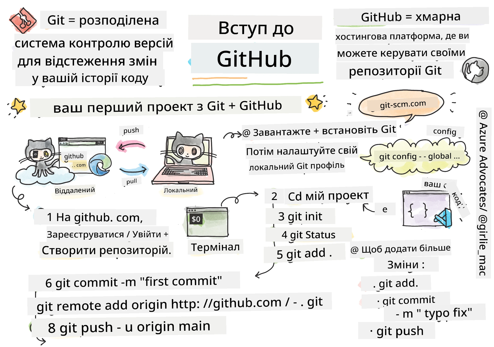
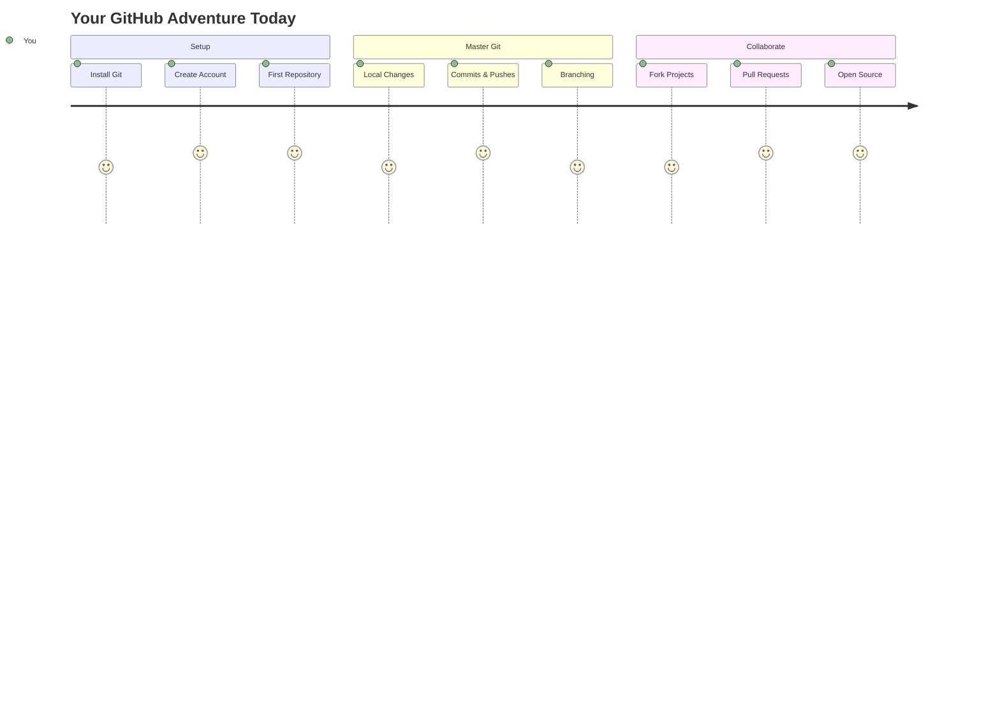
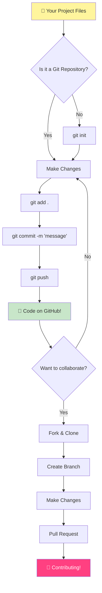
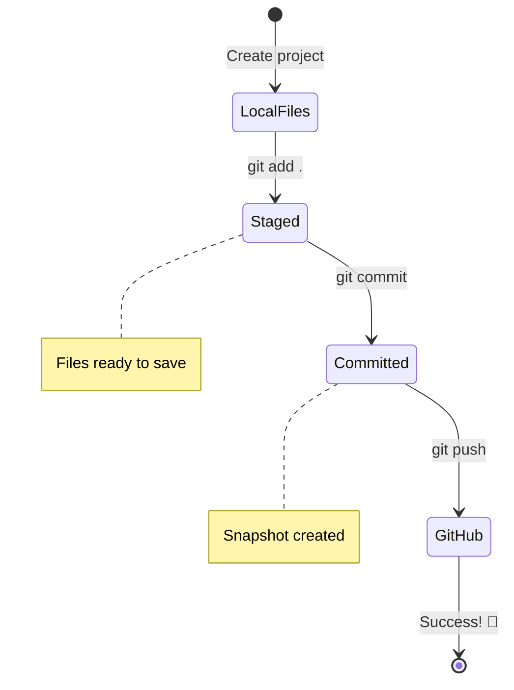
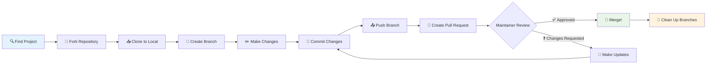
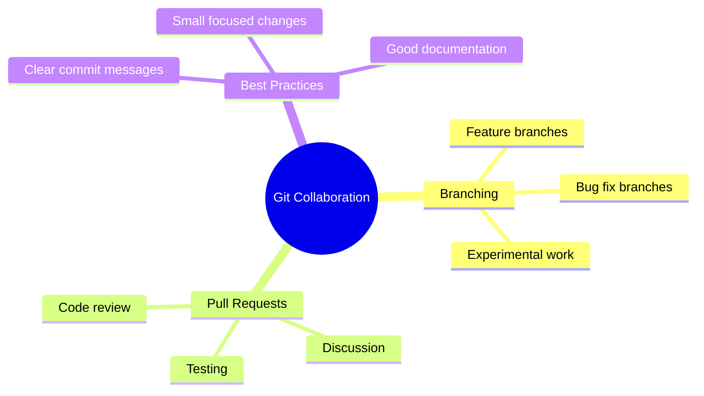
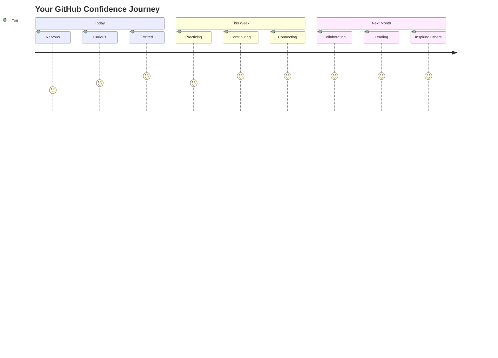

<!--
CO_OP_TRANSLATOR_METADATA:
{
  "original_hash": "5c383cc2cc23bb164b06417d1c107a44",
  "translation_date": "2025-11-18T18:52:37+00:00",
  "source_file": "1-getting-started-lessons/2-github-basics/README.md",
  "language_code": "uk"
}
-->
# Вступ до GitHub

Привіт, майбутній розробнику! 👋 Готовий приєднатися до мільйонів кодерів по всьому світу? Я щиро радий познайомити тебе з GitHub – уяви це як соціальну мережу для програмістів, але замість фото обідів ми ділимося кодом і створюємо неймовірні речі разом!

Ось що мене вражає: кожен додаток на твоєму телефоні, кожен вебсайт, який ти відвідуєш, і більшість інструментів, які ти навчишся використовувати, були створені командами розробників, які співпрацювали на платформах, подібних до GitHub. Той музичний додаток, який ти любиш? Хтось, як ти, зробив свій внесок у його створення. Та гра, від якої ти не можеш відірватися? Так, ймовірно, створена за допомогою співпраці на GitHub. А тепер ТИ навчишся бути частиною цієї дивовижної спільноти!

Я знаю, це може здатися складним на початку – чесно, я пам’ятаю, як дивився на свою першу сторінку GitHub і думав: "Що це все означає?" Але ось у чому справа: кожен розробник починав саме там, де ти зараз. До кінця цього уроку ти матимеш свій власний репозиторій на GitHub (уяви це як свою персональну вітрину проєктів у хмарі), і ти знатимеш, як зберігати свою роботу, ділитися нею з іншими і навіть робити внесок у проєкти, якими користуються мільйони людей.

Ми пройдемо цей шлях разом, крок за кроком. Без поспіху, без тиску – лише ти, я і кілька дійсно крутих інструментів, які стануть твоїми новими найкращими друзями!


> Скетчноут від [Tomomi Imura](https://twitter.com/girlie_mac)



## Передлекційна вікторина
[Передлекційна вікторина](https://ff-quizzes.netlify.app)

## Вступ

Перш ніж ми перейдемо до дійсно захоплюючих речей, давай підготуємо твій комп’ютер до магії GitHub! Уяви це як організацію своїх художніх матеріалів перед створенням шедевра – наявність правильних інструментів робить усе набагато простішим і значно приємнішим.

Я особисто проведу тебе через кожен крок налаштування, і обіцяю, це не так страшно, як може здатися на перший погляд. Якщо щось одразу не зрозуміло – це абсолютно нормально! Я пам’ятаю, як налаштовував своє перше середовище розробки і почувався так, ніби намагаюся читати стародавні ієрогліфи. Кожен розробник був саме там, де ти зараз, і думав, чи все він робить правильно. Спойлер: якщо ти тут і вчишся, ти вже робиш усе правильно! 🌟

У цьому уроці ми розглянемо:

- як відстежувати свою роботу на комп’ютері
- як працювати над проєктами разом з іншими
- як робити внесок у програмне забезпечення з відкритим кодом

### Передумови

Давай підготуємо твій комп’ютер до магії GitHub! Не хвилюйся – це налаштування потрібно зробити лише один раз, і ти будеш готовий до всієї своєї подорожі у світі кодування.

Отже, почнемо з основ! Спочатку нам потрібно перевірити, чи вже встановлений Git на твоєму комп’ютері. Git – це як суперрозумний помічник, який запам’ятовує кожну зміну, яку ти робиш у своєму коді – набагато краще, ніж постійно натискати Ctrl+S кожні дві секунди (ми всі там були!).

Давай перевіримо, чи встановлений Git, ввівши цю магічну команду в терміналі:
`git --version`

Якщо Git ще не встановлений, не хвилюйся! Просто зайди на [завантаження Git](https://git-scm.com/downloads) і завантаж його. Після встановлення нам потрібно правильно представити Git:

> 💡 **Перше налаштування**: Ці команди повідомляють Git, хто ти. Ця інформація буде прикріплена до кожного коміту, який ти робиш, тому вибери ім’я та електронну пошту, які тобі комфортно публічно ділитися.

```bash
git config --global user.name "your-name"
git config --global user.email "your-email"
```

Щоб перевірити, чи вже налаштований Git, ти можеш ввести:
```bash
git config --list
```

Тобі також знадобиться обліковий запис GitHub, редактор коду (наприклад, Visual Studio Code), і потрібно буде відкрити термінал (або командний рядок).

Перейди на [github.com](https://github.com/) і створи обліковий запис, якщо ще не маєш, або увійди і заповни свій профіль.

💡 **Сучасна порада**: Розглянь можливість налаштування [SSH-ключів](https://docs.github.com/en/authentication/connecting-to-github-with-ssh) або використання [GitHub CLI](https://cli.github.com/) для зручнішої автентифікації без паролів.

✅ GitHub – не єдиний репозиторій коду у світі; є й інші, але GitHub – найвідоміший.

### Підготовка

Тобі знадобиться папка з кодовим проєктом на твоєму локальному комп’ютері (ноутбуці чи ПК) і публічний репозиторій на GitHub, який слугуватиме прикладом того, як робити внесок у проєкти інших.

### Захист свого коду

Давай поговоримо про безпеку – але не хвилюйся, ми не будемо перевантажувати тебе страшними речами! Уяви ці практики безпеки як замикання машини чи будинку. Це прості звички, які стають другою натурою і захищають твою важку працю.

Ми покажемо тобі сучасні, безпечні способи роботи з GitHub з самого початку. Таким чином, ти розвинеш хороші звички, які будуть корисними протягом усієї твоєї кар’єри програміста.

Коли працюєш з GitHub, важливо дотримуватися найкращих практик безпеки:

| Область безпеки | Найкраща практика | Чому це важливо |
|------------------|-------------------|-----------------|
| **Аутентифікація** | Використовуй SSH-ключі або персональні токени доступу | Паролі менш безпечні і поступово відходять у минуле |
| **Двофакторна аутентифікація** | Увімкни 2FA у своєму обліковому записі GitHub | Додає додатковий рівень захисту |
| **Безпека репозиторію** | Ніколи не коміть конфіденційну інформацію | API-ключі та паролі не повинні бути у публічних репозиторіях |
| **Управління залежностями** | Увімкни Dependabot для оновлень | Підтримує твої залежності безпечними та актуальними |

> ⚠️ **Критичне нагадування про безпеку**: Ніколи не коміть API-ключі, паролі чи іншу конфіденційну інформацію в будь-який репозиторій. Використовуй змінні середовища та файли `.gitignore`, щоб захистити чутливі дані.

**Сучасне налаштування аутентифікації:**

```bash
# Generate SSH key (modern ed25519 algorithm)
ssh-keygen -t ed25519 -C "your_email@example.com"

# Set up Git to use SSH
git remote set-url origin git@github.com:username/repository.git
```

> 💡 **Порада професіонала**: SSH-ключі усувають необхідність постійно вводити паролі і є більш безпечними, ніж традиційні методи аутентифікації.

---

## Управління кодом як професіонал

Окей, ось тут починається справжній екшн! 🎉 Ми зараз навчимося відстежувати і керувати твоїм кодом, як це роблять професіонали, і чесно кажучи, це одна з моїх улюблених тем для навчання, тому що це справжній переворот у грі.

Уяви: ти пишеш дивовижну історію і хочеш зберігати кожен чернетковий варіант, кожне блискуче редагування і кожен момент "оце так геніально!". Саме це Git робить для твого коду! Це як мати найкращий у світі блокнот, що подорожує в часі і запам’ятовує ВСЕ – кожен натиск клавіші, кожну зміну, кожен момент "ой, це все зламало", який ти можеш миттєво скасувати.

Зізнаюся – спочатку це може здатися складним. Коли я починав, я думав: "Чому я не можу просто зберігати файли, як зазвичай?" Але повір мені: як тільки Git стане зрозумілим (а це станеться!), ти матимеш той момент осяяння, коли подумаєш: "Як я взагалі міг кодувати без цього?" Це як відкрити, що ти можеш літати, коли все життя ходив пішки!

Припустимо, у тебе є папка з кодовим проєктом, і ти хочеш почати відстежувати свій прогрес за допомогою git – системи контролю версій. Дехто порівнює використання git із написанням любовного листа до свого майбутнього "я". Читаючи свої повідомлення про коміти через дні, тижні чи місяці, ти зможеш згадати, чому прийняв те чи інше рішення, або "відкотити" зміни – звісно, якщо ти пишеш хороші повідомлення про коміти.



### Завдання: Створи свій перший репозиторій!

> 🎯 **Твоя місія (і я дуже радий за тебе!)**: Ми разом створимо твій перший репозиторій на GitHub! До кінця цього завдання у тебе буде свій власний куточок в інтернеті, де житиме твій код, і ти зробиш свій перший "коміт" (це розробницький термін для розумного збереження твоєї роботи).
>
> Це справді особливий момент – ти офіційно приєднуєшся до глобальної спільноти розробників! Я досі пам’ятаю хвилювання від створення свого першого репозиторію і думки: "Вау, я справді це роблю!"

Давай пройдемо цей шлях разом, крок за кроком. Не поспішай – тут немає нагороди за швидкість, і я обіцяю, що кожен крок матиме сенс. Пам’ятай, кожна зірка кодування, якою ти захоплюєшся, колись сиділа саме там, де ти зараз, і створювала свій перший репозиторій. Як це круто?

> Подивись відео
> 
> [](https://www.youtube.com/watch?v=9R31OUPpxU4)

**Давай зробимо це разом:**

1. **Створи свій репозиторій на GitHub**. Перейди на GitHub.com і знайди яскраву зелену кнопку **New** (або знак **+** у верхньому правому куті). Натисни її і вибери **New repository**.

   Ось що потрібно зробити:
   1. Дай своєму репозиторію назву – зроби її значущою для себе!
   1. Додай опис, якщо хочеш (це допоможе іншим зрозуміти, про що твій проєкт)
   1. Виріши, чи хочеш зробити його публічним (усі можуть бачити) чи приватним (лише для тебе)
   1. Рекомендую поставити галочку, щоб додати файл README – це як титульна сторінка твого проєкту
   1. Натисни **Create repository** і святкуй – ти щойно створив свій перший репозиторій! 🎉

2. **Перейди до своєї папки з проєктом**. Тепер відкрий свій термінал (не хвилюйся, це не так страшно, як виглядає!). Нам потрібно сказати комп’ютеру, де знаходяться твої файли проєкту. Введи цю команду:

   ```bash
   cd [name of your folder]
   ```

   **Що ми тут робимо:**
   - Ми, по суті, кажемо комп’ютеру: "Гей, відведи мене до моєї папки з проєктом"
   - Це як відкрити конкретну папку на робочому столі, але ми робимо це за допомогою текстових команд
   - Замінюй `[name of your folder]` на фактичну назву твоєї папки з проєктом

3. **Перетвори свою папку на Git-репозиторій**. Ось де починається магія! Введи:

   ```bash
   git init
   ```

   **Ось що щойно сталося (доволі круто!):**
   - Git створив приховану папку `.git` у твоєму проєкті – ти її не побачиш, але вона там!
   - Твоя звичайна папка тепер стала "репозиторієм", який може відстежувати кожну зміну, яку ти робиш
   - Уяви це як надання твоїй папці суперздібностей запам’ятовувати все

4. **Перевір, що відбувається**. Давай подивимося, що Git думає про твій проєкт зараз:

   ```bash
   git status
   ```

   **Розуміння того, що каже Git:**
   
   Ти можеш побачити щось на кшталт цього:

   ```output
   Changes not staged for commit:
   (use "git add <file>..." to update what will be committed)
   (use "git restore <file>..." to discard changes in working directory)

        modified:   file.txt
        modified:   file2.txt
   ```

   **Не панікуй! Ось що це означає:**
   - Файли в **червоному** – це файли, які мають зміни, але ще не готові до збереження
   - Файли в **зеленому** (коли ти їх побачиш) – готові до збереження
   - Git допомагає, повідомляючи тобі, що можна зробити далі

   > 💡 **Порада професіонала**: Команда `git status` – твій найкращий друг! Використовуй її щоразу, коли не впевнений, що відбувається. Це як запитати у Git: "Гей, яка зараз ситуація?"

5. **Підготуй свої файли до збереження** (це називається "стейджинг"):

   ```bash
   git add .
   ```

   **Що ми щойно зробили:**
   - Ми сказали Git: "Гей, я хочу включити ВСІ мої файли в наступне збереження"
   - `.` означає "все в цій папці"
   - Тепер твої файли "стейджовані" і готові до наступного кроку

   **Хочеш бути вибірковішим?** Ти можеш додати лише конкретні файли:

   ```bash
   git add [file or folder name]
   ```

   **Чому ти можеш захотіти це зробити?**
   - Іноді ти хочеш зберегти пов’язані зміни разом
   - Це допомагає організувати твою роботу в логічні частини
   - Полегшує розуміння того, що змінилося і коли

   **Передумав?** Не хвилюйся! Ти можеш зняти файли зі стейджингу ось так:

   ```bash
   # Unstage everything
   git reset
   
   # Unstage just one file
   git reset [file name]
   ```

   Не хвилюйся – це не видаляє твою роботу, це просто прибирає файли з "готових до збереження".

6. **Збережи свою роботу назавжди** (зроби свій перший коміт!):

   ```bash
   git commit -m "first commit"
   ```

   **🎉 Вітаю! Ти щойно зробив свій перший коміт!**
   
   **Ось що щойно сталося:**
   - Git зробив "знімок" усіх твоїх стейджованих файлів у цей момент
   - Твоє повідомлення про коміт "first commit" пояснює, що це за точка збереження
   - Git надав цьому знімку унікальний ID, щоб ти завжди мі
   - Ми створили зв'язок між вашим локальним проєктом і вашим репозиторієм на GitHub.
   - "Origin" – це просто псевдонім для вашого репозиторію на GitHub – як додати контакт у телефон.
   - Тепер ваш локальний Git знає, куди надсилати ваш код, коли ви будете готові поділитися ним.

   💡 **Простіший спосіб**: Якщо у вас встановлений GitHub CLI, ви можете зробити це однією командою:
   ```bash
   gh repo create my-repo --public --push --source=.
   ```

8. **Надішліть ваш код на GitHub** (великий момент!):

   ```bash
   git push -u origin main
   ```

   **🚀 Це воно! Ви завантажуєте свій код на GitHub!**
   
   **Що відбувається:**
   - Ваші коміти подорожують з вашого комп'ютера на GitHub.
   - Прапорець `-u` встановлює постійний зв'язок, щоб майбутні пуші були простішими.
   - "main" – це назва вашої основної гілки (як головна папка).
   - Після цього ви можете просто вводити `git push` для майбутніх завантажень!

   💡 **Швидка примітка**: Якщо ваша гілка називається інакше (наприклад, "master"), використовуйте цю назву. Ви можете перевірити це за допомогою `git branch --show-current`.

9. **Ваш новий щоденний ритм кодування** (ось де це стає захоплюючим!):

   Відтепер, коли ви вносите зміни у свій проєкт, у вас є цей простий трьохетапний танець:

   ```bash
   git add .
   git commit -m "describe what you changed"
   git push
   ```

   **Це стає вашим серцем кодування:**
   - Внесіть чудові зміни у свій код ✨
   - Додайте їх за допомогою `git add` ("Гей, Git, зверни увагу на ці зміни!")
   - Збережіть їх за допомогою `git commit` і описового повідомлення (майбутній ви вам подякує!)
   - Поділіться ними зі світом за допомогою `git push` 🚀
   - Повторюйте – серйозно, це стає таким же природним, як дихання!

   Я люблю цей робочий процес, тому що це як мати кілька точок збереження у відеогрі. Зробили зміну, яка вам подобається? Зробіть коміт! Хочете спробувати щось ризиковане? Без проблем – ви завжди можете повернутися до останнього коміту, якщо щось піде не так!

   > 💡 **Порада**: Можливо, ви також захочете використовувати файл `.gitignore`, щоб запобігти відстеженню файлів, які ви не хочете бачити на GitHub – наприклад, файл із нотатками, який ви зберігаєте в тій самій папці, але який не має місця в публічному репозиторії. Ви можете знайти шаблони для файлів `.gitignore` на [.gitignore templates](https://github.com/github/gitignore) або створити один за допомогою [gitignore.io](https://www.toptal.com/developers/gitignore).

### 🧠 **Перша перевірка репозиторію: Як це відчувалося?**

**Зробіть паузу, щоб відсвяткувати і подумати:**
- Як це було – побачити свій код на GitHub вперше?
- Який крок був найбільш заплутаним, а який виявився несподівано простим?
- Чи можете ви пояснити різницю між `git add`, `git commit` і `git push` своїми словами?



> **Пам'ятайте**: Навіть досвідчені розробники іноді забувають точні команди. Щоб цей робочий процес став автоматичним, потрібна практика – ви чудово справляєтеся!

#### Сучасні робочі процеси Git

Розгляньте можливість впровадження цих сучасних практик:

- **Conventional Commits**: Використовуйте стандартизований формат повідомлень комітів, як-от `feat:`, `fix:`, `docs:` тощо. Дізнайтеся більше на [conventionalcommits.org](https://www.conventionalcommits.org/)
- **Атомарні коміти**: Нехай кожен коміт представляє одну логічну зміну.
- **Часті коміти**: Робіть коміти часто з описовими повідомленнями, а не рідкісні й великі.

#### Повідомлення комітів

Чудовий заголовок повідомлення коміту завершує наступне речення:
Якщо застосувати, цей коміт <ваш заголовок тут>

Для заголовка використовуйте наказовий, теперішній час: "змінити", а не "змінив" чи "зміни". 
Як і в заголовку, у тілі (за бажанням) також використовуйте наказовий, теперішній час. Тіло має включати мотивацію для зміни та порівняння з попередньою поведінкою. Ви пояснюєте `чому`, а не `як`.

✅ Приділіть кілька хвилин, щоб переглянути GitHub. Чи можете ви знайти дійсно чудове повідомлення коміту? Чи можете знайти дуже мінімальне? Яка інформація, на вашу думку, є найважливішою та корисною для передачі в повідомленні коміту?

## Робота з іншими (найцікавіша частина!)

Приготуйтеся, тому що ОСЬ ДЕ GitHub стає абсолютно магічним! 🪄 Ви освоїли управління власним кодом, але тепер ми занурюємося в мою улюблену частину – співпрацю з дивовижними людьми з усього світу.

Уявіть це: ви прокидаєтеся завтра і бачите, що хтось у Токіо покращив ваш код, поки ви спали. Потім хтось у Берліні виправляє баг, над яким ви застрягли. До обіду розробник у Сан-Паулу додає функцію, про яку ви навіть не думали. Це не наукова фантастика – це просто вівторок у всесвіті GitHub!

Що мене дійсно захоплює, так це те, що навички співпраці, які ви зараз вивчаєте? Це ТОЧНО ті самі робочі процеси, які щодня використовують команди в Google, Microsoft і ваших улюблених стартапах. Ви не просто вивчаєте крутий інструмент – ви вивчаєте секретну мову, яка дозволяє всьому світу програмного забезпечення працювати разом.

Серйозно, як тільки ви відчуєте азарт від того, що хтось об'єднав ваш перший pull request, ви зрозумієте, чому розробники так захоплюються open source. Це як бути частиною найбільшого, найкреативнішого командного проєкту у світі!

> Подивіться відео
>
> [](https://www.youtube.com/watch?v=bFCM-PC3cu8)

Головна причина розміщення речей на GitHub – це можливість співпрацювати з іншими розробниками.



У вашому репозиторії перейдіть до `Insights > Community`, щоб побачити, як ваш проєкт порівнюється з рекомендованими стандартами спільноти.

Хочете, щоб ваш репозиторій виглядав професійно та привітно? Перейдіть до вашого репозиторію та натисніть `Insights > Community`. Ця крута функція показує, як ваш проєкт порівнюється з тим, що спільнота GitHub вважає "хорошими практиками репозиторію".

> 🎯 **Зробіть ваш проєкт блискучим**: Добре організований репозиторій із гарною документацією – це як чистий, привітний магазин. Це показує людям, що вам не байдуже до вашої роботи, і змушує інших хотіти долучитися!

**Ось що робить репозиторій чудовим:**

| Що додати | Чому це важливо | Що це робить для вас |
|-------------|-------------------|---------------------|
| **Опис** | Перше враження має значення! | Люди одразу знають, що робить ваш проєкт |
| **README** | Головна сторінка вашого проєкту | Як дружній гід для нових відвідувачів |
| **Інструкції для внеску** | Показує, що ви вітаєте допомогу | Люди знають, як саме вони можуть допомогти вам |
| **Кодекс поведінки** | Створює дружню атмосферу | Усі почуваються бажаними для участі |
| **Ліцензія** | Юридична ясність | Інші знають, як вони можуть використовувати ваш код |
| **Політика безпеки** | Показує вашу відповідальність | Демонструє професійні практики |

> 💡 **Професійна порада**: GitHub надає шаблони для всіх цих файлів. Під час створення нового репозиторію відмітьте відповідні поля, щоб автоматично згенерувати ці файли.

**Сучасні функції GitHub для дослідження:**

🤖 **Автоматизація та CI/CD:**
- **GitHub Actions** для автоматичного тестування та розгортання
- **Dependabot** для автоматичного оновлення залежностей

💬 **Спільнота та управління проєктами:**
- **GitHub Discussions** для обговорень спільноти поза межами задач
- **GitHub Projects** для управління проєктами у стилі канбан
- **Правила захисту гілок** для забезпечення стандартів якості коду

Усі ці ресурси допоможуть новим членам команди швидше адаптуватися. І саме на такі речі нові учасники звертають увагу перед тим, як навіть подивитися на ваш код, щоб зрозуміти, чи є ваш проєкт правильним місцем для їхнього часу.

✅ README-файли, хоча їх підготовка займає час, часто ігноруються зайнятими підтримувачами. Чи можете ви знайти приклад особливо описового README? Примітка: існують деякі [інструменти для створення гарних README](https://www.makeareadme.com/), які вам можуть сподобатися.

### Завдання: Об'єднайте трохи коду

Документація для внесків допомагає людям долучатися до проєкту. Вона пояснює, які типи внесків ви шукаєте і як працює процес. Учасники повинні пройти серію кроків, щоб мати змогу внести свій внесок у ваш репозиторій на GitHub:

1. **Форк вашого репозиторію**. Ви, ймовірно, захочете, щоб люди _форкали_ ваш проєкт. Форкінг означає створення копії вашого репозиторію у їхньому профілі на GitHub.
1. **Клонування**. Після цього вони клонують проєкт на свій локальний комп'ютер.
1. **Створення гілки**. Ви захочете попросити їх створити _гілку_ для своєї роботи.
1. **Зосередження змін на одній області**. Попросіть учасників зосередити свої внески на одній речі за раз – таким чином шанси, що ви зможете _об'єднати_ їхню роботу, будуть вищими. Уявіть, що вони виправляють баг, додають нову функцію та оновлюють кілька тестів – що, якщо ви хочете або можете реалізувати лише 2 з 3, або 1 з 3 змін?

✅ Уявіть ситуацію, коли гілки є особливо важливими для написання та доставки якісного коду. Які випадки використання ви можете придумати?

> Примітка: будьте зміною, яку хочете бачити у світі, і створюйте гілки для своєї роботи також. Усі коміти, які ви робите, будуть зроблені у гілці, до якої ви зараз "перемкнуті". Використовуйте `git status`, щоб побачити, у якій гілці ви перебуваєте.

Давайте пройдемося по робочому процесу учасника. Припустимо, учасник вже _форкнув_ і _клонував_ репозиторій, тому у нього є готовий Git-репозиторій на локальному комп'ютері:

1. **Створіть гілку**. Використовуйте команду `git branch`, щоб створити гілку, яка міститиме зміни, які вони мають намір внести:

   ```bash
   git branch [branch-name]
   ```

   > 💡 **Сучасний підхід**: Ви також можете створити і перемкнутися на нову гілку однією командою:
   ```bash
   git switch -c [branch-name]
   ```

1. **Перемкніться на робочу гілку**. Перемкніться на вказану гілку та оновіть робочу директорію за допомогою `git switch`:

   ```bash
   git switch [branch-name]
   ```

   > 💡 **Сучасна примітка**: `git switch` – це сучасна заміна `git checkout` для зміни гілок. Це зрозуміліше і безпечніше для початківців.

1. **Виконайте роботу**. На цьому етапі ви хочете додати свої зміни. Не забудьте повідомити про це Git за допомогою наступних команд:

   ```bash
   git add .
   git commit -m "my changes"
   ```

   > ⚠️ **Якість повідомлення коміту**: Переконайтеся, що ви дали своєму коміту гарну назву, як для себе, так і для підтримувача репозиторію, якому ви допомагаєте. Будьте конкретними щодо того, що ви змінили!

1. **Об'єднайте свою роботу з гілкою `main`**. У якийсь момент ви закінчите роботу і захочете об'єднати її з гілкою `main`. Гілка `main` могла змінитися за цей час, тому переконайтеся, що ви спочатку оновили її до останньої версії за допомогою наступних команд:

   ```bash
   git switch main
   git pull
   ```

   На цьому етапі ви хочете переконатися, що будь-які _конфлікти_, ситуації, коли Git не може легко _об'єднати_ зміни, виникають у вашій робочій гілці. Тому виконайте наступні команди:

   ```bash
   git switch [branch_name]
   git merge main
   ```

   Команда `git merge main` принесе всі зміни з `main` у вашу гілку. Сподіваємося, ви зможете просто продовжити. Якщо ні, VS Code покаже вам, де Git _заплутався_, і ви просто зміните відповідні файли, щоб вказати, який вміст є найбільш точним.

   💡 **Сучасна альтернатива**: Розгляньте використання `git rebase` для чистішої історії:
   ```bash
   git rebase main
   ```
   Це відтворює ваші коміти поверх останньої гілки main, створюючи лінійну історію.

1. **Надішліть свою роботу на GitHub**. Надсилання вашої роботи на GitHub означає дві речі: пуш вашої гілки у ваш репозиторій і відкриття PR (Pull Request).

   ```bash
   git push --set-upstream origin [branch-name]
   ```

   Наведена вище команда створює гілку у вашому форкнутому репозиторії.

### 🤝 **Перевірка навичок співпраці: Готові працювати з іншими?**

**Давайте подивимося, як ви почуваєтеся щодо співпраці:**
- Чи зрозуміла вам ідея форкінгу та pull request?
- Що саме у роботі з гілками ви хочете більше практикувати?
- Наскільки комфортно ви почуваєтеся, вносячи свій внесок у чужий проєкт?



> **Підтримка впевненості**: Кожен розробник, яким ви захоплюєтеся, колись нервував через свій перший pull request. Спільнота GitHub надзвичайно привітна до новачків!

1. **Відкрийте PR**. Далі ви хочете відкрити PR. Ви робите це, перейшовши до форкнутого репозиторію на GitHub. Ви побачите індикатор на GitHub, де вас запитають, чи хочете ви створити новий PR, натискаєте на це, і вас перенаправляють до інтерф
1. **Прибирання**. Вважається гарною практикою _прибирати_ після успішного об'єднання PR. Ви хочете очистити як вашу локальну гілку, так і гілку, яку ви завантажили на GitHub. Спочатку видаліть її локально за допомогою наступної команди:

   ```bash
   git branch -d [branch-name]
   ```

   Переконайтеся, що ви перейшли на сторінку GitHub для форкованого репозиторію і видалили віддалену гілку, яку ви щойно завантажили.

`Pull request` здається дивним терміном, адже насправді ви хочете "запушити" свої зміни в проект. Але власник проекту або основна команда повинні розглянути ваші зміни перед тим, як об'єднати їх з "основною" гілкою проекту, тому ви фактично запитуєте рішення про зміну у власника.

Pull request — це місце для порівняння та обговорення змін, внесених у гілку, з рецензіями, коментарями, інтегрованими тестами тощо. Хороший pull request дотримується приблизно тих самих правил, що й повідомлення про коміт. Ви можете додати посилання на проблему в трекері проблем, якщо ваша робота, наприклад, вирішує проблему. Це робиться за допомогою `#`, після якого йде номер вашої проблеми. Наприклад, `#97`.

🤞Тримаємо кулаки, щоб усі перевірки пройшли успішно і власник(и) проекту об'єднали ваші зміни в проект🤞

Оновіть вашу поточну локальну робочу гілку всіма новими комітами з відповідної віддаленої гілки на GitHub:

`git pull`

## Внесок в Open Source (Ваш шанс зробити вплив!)

Готові до чогось, що абсолютно переверне ваш світ? 🤯 Давайте поговоримо про внесок у проекти з відкритим кодом – і я вже відчуваю мурашки, думаючи про те, щоб поділитися цим з вами!

Це ваш шанс стати частиною чогось справді надзвичайного. Уявіть, що ви покращуєте інструменти, якими щодня користуються мільйони розробників, або виправляєте помилку в додатку, який люблять ваші друзі. Це не просто мрія – це те, чим є внесок у відкритий код!

Ось що викликає у мене захоплення кожного разу, коли я думаю про це: кожен інструмент, з яким ви навчалися – ваш редактор коду, фреймворки, які ми досліджуємо, навіть браузер, у якому ви це читаєте – почався з когось, точно такого ж, як ви, хто зробив свій перший внесок. Той блискучий розробник, який створив ваш улюблений розширення для VS Code? Колись він був новачком, який натискав "створити pull request" з тремтячими руками, так само, як ви зараз.

І ось найкрасивіша частина: спільнота відкритого коду – це як найбільше групове обіймання в інтернеті. Більшість проектів активно шукають новачків і мають проблеми з тегом "good first issue", спеціально для таких, як ви! Власники проектів щиро радіють, коли бачать нових учасників, тому що вони пам'ятають свої перші кроки.

```mermaid
flowchart TD
    A[🔍 Explore GitHub] --> B[🏷️ Find "good first issue"]
    B --> C[📖 Read Contributing Guidelines]
    C --> D[🍴 Fork Repository]
    D --> E[💻 Set Up Local Environment]
    E --> F[🌿 Create Feature Branch]
    F --> G[✨ Make Your Contribution]
    G --> H[🧪 Test Your Changes]
    H --> I[📝 Write Clear Commit]
    I --> J[📤 Push & Create PR]
    J --> K[💬 Engage with Feedback]
    K --> L[🎉 Merged! You're a Contributor!]
    L --> M[🌟 Find Next Issue]
    
    style A fill:#e1f5fe
    style L fill:#c8e6c9
    style M fill:#fff59d
```

Ви не просто вчитеся програмувати тут – ви готуєтеся приєднатися до глобальної сім'ї творців, які щодня прокидаються з думкою "Як ми можемо зробити цифровий світ трохи кращим?" Ласкаво просимо до клубу! 🌟

Спочатку знайдіть репозиторій (або **repo**) на GitHub, який вас цікавить і до якого ви хотіли б внести зміни. Вам потрібно буде скопіювати його вміст на ваш комп'ютер.

✅ Хороший спосіб знайти репозиторії, дружні до новачків, – це [шукати за тегом 'good-first-issue'](https://github.blog/2020-01-22-browse-good-first-issues-to-start-contributing-to-open-source/).


Існує кілька способів копіювання коду. Один із них – "клонувати" вміст репозиторію, використовуючи HTTPS, SSH або GitHub CLI (Command Line Interface).

Відкрийте ваш термінал і клонуйте репозиторій таким чином:
```bash
# Using HTTPS
git clone https://github.com/ProjectURL

# Using SSH (requires SSH key setup)
git clone git@github.com:username/repository.git

# Using GitHub CLI
gh repo clone username/repository
```

Щоб працювати над проектом, перейдіть до потрібної папки:
`cd ProjectURL`

Ви також можете відкрити весь проект, використовуючи:
- **[GitHub Codespaces](https://github.com/features/codespaces)** - Хмарне середовище розробки GitHub з VS Code у браузері
- **[GitHub Desktop](https://desktop.github.com/)** - Графічний додаток для операцій з Git  
- **[GitHub.dev](https://github.dev)** - Натисніть клавішу `.` на будь-якому репозиторії GitHub, щоб відкрити VS Code у браузері
- **VS Code** з розширенням GitHub Pull Requests

Нарешті, ви можете завантажити код у вигляді архівованої папки.

### Кілька цікавих речей про GitHub

Ви можете додати зірку, спостерігати або "форкнути" будь-який публічний репозиторій на GitHub. Ви можете знайти ваші репозиторії зі зірками у випадаючому меню у верхньому правому куті. Це як закладки, але для коду.

Проекти мають трекер проблем, здебільшого на GitHub у вкладці "Issues", якщо не зазначено інше, де люди обговорюють проблеми, пов'язані з проектом. А вкладка Pull Requests – це місце, де люди обговорюють і переглядають зміни, які перебувають у процесі.

Проекти також можуть мати обговорення у форумах, списках розсилки або чат-каналах, таких як Slack, Discord або IRC.

🔧 **Сучасні функції GitHub**:
- **GitHub Discussions** - Вбудований форум для спільнотних розмов
- **GitHub Sponsors** - Фінансова підтримка власників проектів  
- **Security tab** - Звіти про вразливості та рекомендації з безпеки
- **Actions tab** - Автоматизовані робочі процеси та CI/CD конвеєри
- **Insights tab** - Аналітика про учасників, коміти та стан проекту
- **Projects tab** - Вбудовані інструменти управління проектами GitHub

✅ Ознайомтеся з вашим новим репозиторієм на GitHub і спробуйте кілька речей, таких як редагування налаштувань, додавання інформації до вашого репозиторію, створення проекту (наприклад, дошки Kanban) і налаштування GitHub Actions для автоматизації. Тут є багато чого зробити!

---

## 🚀 Виклик 

Гаразд, час випробувати ваші нові суперсили GitHub! 🚀 Ось виклик, який допоможе вам зрозуміти все найкращим чином:

Запросіть друга (або члена сім'ї, який завжди питає, чим ви займаєтеся з усім цим "комп'ютерним матеріалом") і вирушайте разом у спільну пригоду з програмуванням! Тут відбувається справжня магія – створіть проект, дозвольте їм форкнути його, створіть кілька гілок і об'єднайте зміни, як професіонали, якими ви стаєте.

Я не буду приховувати – ви, ймовірно, будете сміятися в якийсь момент (особливо коли ви обидва спробуєте змінити один і той самий рядок), можливо, будете чухати голову від здивування, але ви точно матимете ті дивовижні моменти "ага!", які роблять все навчання вартим. Крім того, є щось особливе в тому, щоб поділитися першим успішним об'єднанням з кимось іншим – це як маленьке святкування того, як далеко ви зайшли!

Ще немає друга для програмування? Не хвилюйтеся! Спільнота GitHub наповнена неймовірно привітними людьми, які пам'ятають, як це було бути новачком. Шукайте репозиторії з мітками "good first issue" – вони фактично кажуть "Гей, новачки, приходьте вчитися з нами!" Як це круто?

## Післялекційний тест
[Післялекційний тест](https://ff-quizzes.netlify.app/web/en/)

## Огляд і продовження навчання

Ух! 🎉 Подивіться на вас – ви щойно освоїли основи GitHub як абсолютний чемпіон! Якщо ваш мозок зараз трохи перевантажений, це абсолютно нормально і, чесно кажучи, хороший знак. Ви щойно освоїли інструменти, які зайняли у мене тижні, щоб відчути себе комфортно.

Git і GitHub неймовірно потужні (серйозно потужні), і кожен розробник, якого я знаю – включаючи тих, хто зараз здається чарівником – повинен був практикуватися і трохи спотикатися, перш ніж все стало зрозумілим. Те, що ви пройшли цей урок, означає, що ви вже на шляху до освоєння одних із найважливіших інструментів у наборі розробника.

Ось кілька абсолютно фантастичних ресурсів, які допоможуть вам практикуватися і стати ще крутішим:

- [Посібник з внеску в програмне забезпечення з відкритим кодом](https://opensource.guide/how-to-contribute/#how-to-submit-a-contribution) – Ваш дорожній план до внесення змін
- [Шпаргалка Git](https://training.github.com/downloads/github-git-cheat-sheet/) – Тримайте її під рукою для швидкого доступу!

І пам'ятайте: практика робить прогрес, а не досконалість! Чим більше ви використовуєте Git і GitHub, тим природніше це стає. GitHub створив кілька дивовижних інтерактивних курсів, які дозволяють вам практикуватися в безпечному середовищі:

- [Вступ до GitHub](https://github.com/skills/introduction-to-github)
- [Спілкування за допомогою Markdown](https://github.com/skills/communicate-using-markdown)  
- [GitHub Pages](https://github.com/skills/github-pages)
- [Управління конфліктами об'єднання](https://github.com/skills/resolve-merge-conflicts)

**Відчуваєте себе авантюрно? Ознайомтеся з цими сучасними інструментами:**
- [Документація GitHub CLI](https://cli.github.com/manual/) – Для тих, хто хоче відчути себе чарівником командного рядка
- [Документація GitHub Codespaces](https://docs.github.com/en/codespaces) – Програмуйте в хмарі!
- [Документація GitHub Actions](https://docs.github.com/en/actions) – Автоматизуйте все
- [Найкращі практики Git](https://www.atlassian.com/git/tutorials/comparing-workflows) – Покращуйте ваш робочий процес 

## Виклик GitHub Copilot Agent 🚀

Використовуйте режим Agent, щоб виконати наступний виклик:

**Опис:** Створіть спільний проект веб-розробки, який демонструє повний робочий процес GitHub, який ви вивчили в цьому уроці. Цей виклик допоможе вам практикувати створення репозиторію, функції співпраці та сучасні робочі процеси Git у реальному сценарії.

**Завдання:** Створіть новий публічний репозиторій GitHub для простого проекту "Ресурси веб-розробки". Репозиторій повинен включати добре структурований файл README.md, який містить корисні інструменти та ресурси для веб-розробки, організовані за категоріями (HTML, CSS, JavaScript тощо). Налаштуйте репозиторій з відповідними стандартами спільноти, включаючи ліцензію, рекомендації щодо внеску та кодекс поведінки. Створіть щонайменше дві гілки функцій: одну для додавання ресурсів CSS і іншу для ресурсів JavaScript. Зробіть коміти до кожної гілки з описовими повідомленнями про коміт, а потім створіть pull requests для об'єднання змін назад у main. Увімкніть функції GitHub, такі як Issues, Discussions, і налаштуйте базовий робочий процес GitHub Actions для автоматизованих перевірок.

## Завдання 

Ваша місія, якщо ви вирішите її прийняти: Завершіть курс [Вступ до GitHub](https://github.com/skills/introduction-to-github) на GitHub Skills. Цей інтерактивний курс дозволить вам практикувати все, що ви вивчили, у безпечному, керованому середовищі. Крім того, ви отримаєте крутий значок, коли закінчите! 🏅

**Відчуваєте готовність до більш складних завдань?**
- Налаштуйте аутентифікацію SSH для вашого облікового запису GitHub (більше ніяких паролів!)
- Спробуйте використовувати GitHub CLI для ваших щоденних операцій з Git
- Створіть репозиторій з робочим процесом GitHub Actions
- Досліджуйте GitHub Codespaces, відкривши цей самий репозиторій у хмарному редакторі

---

## 🚀 Ваш графік освоєння GitHub

### ⚡ **Що ви можете зробити за наступні 5 хвилин**
- [ ] Додайте зірку цьому репозиторію та ще 3 проектам, які вас цікавлять
- [ ] Налаштуйте двофакторну аутентифікацію для вашого облікового запису GitHub
- [ ] Створіть простий README для вашого першого репозиторію
- [ ] Підпишіться на 5 розробників, чия робота вас надихає

### 🎯 **Що ви можете досягти за годину**
- [ ] Завершіть післялекційний тест і подумайте про ваш шлях у GitHub
- [ ] Налаштуйте SSH-ключі для аутентифікації GitHub без паролів
- [ ] Зробіть ваш перший значущий коміт з чудовим повідомленням про коміт
- [ ] Досліджуйте вкладку "Explore" на GitHub, щоб знайти популярні проекти
- [ ] Практикуйте форк репозиторію та внесення невеликої зміни

### 📅 **Ваш тижневий GitHub-пригода**
- [ ] Завершіть курси GitHub Skills (Вступ до GitHub, Markdown)
- [ ] Зробіть ваш перший pull request до проекту з відкритим кодом
- [ ] Налаштуйте сайт GitHub Pages, щоб продемонструвати вашу роботу
- [ ] Приєднайтеся до обговорень GitHub у проектах, які вас цікавлять
- [ ] Створіть репозиторій з відповідними стандартами спільноти (README, Ліцензія тощо)
- [ ] Спробуйте GitHub Codespaces для розробки в хмарі

### 🌟 **Ваш місячний трансформаційний шлях**
- [ ] Внесіть зміни до 3 різних проектів з відкритим кодом
- [ ] Наставляйте когось нового в GitHub (передайте знання!)
- [ ] Налаштуйте автоматизовані робочі процеси з GitHub Actions
- [ ] Створіть портфоліо, яке демонструє ваші внески в GitHub
- [ ] Візьміть участь у Hacktoberfest або подібних спільнотних заходах
- [ ] Станьте власником вашого власного проекту, до якого інші будуть вносити зміни

### 🎓 **Фінальна перевірка освоєння GitHub**

**Відсвяткуйте, як далеко ви зайшли:**
- Що вам найбільше подобається у використанні GitHub?
- Яка функція співпраці вас найбільше захоплює?
- Наскільки впевнено ви почуваєтеся щодо внеску в відкритий код зараз?
- Який перший проект, до якого ви хочете внести зміни?



> 🌍 **Ласкаво просимо до глобальної спільноти розробників!** Тепер у вас є інструменти для

---

<!-- CO-OP TRANSLATOR DISCLAIMER START -->
**Відмова від відповідальності**:  
Цей документ було перекладено за допомогою сервісу автоматичного перекладу [Co-op Translator](https://github.com/Azure/co-op-translator). Хоча ми прагнемо до точності, звертаємо вашу увагу, що автоматичні переклади можуть містити помилки або неточності. Оригінальний документ на його рідній мові слід вважати авторитетним джерелом. Для критично важливої інформації рекомендується професійний людський переклад. Ми не несемо відповідальності за будь-які непорозуміння або неправильні тлумачення, що виникли внаслідок використання цього перекладу.
<!-- CO-OP TRANSLATOR DISCLAIMER END -->