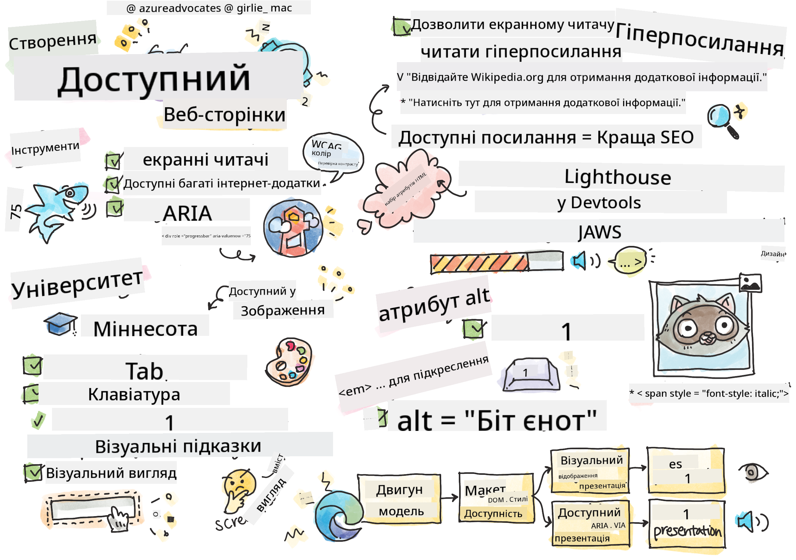

<!--
CO_OP_TRANSLATOR_METADATA:
{
  "original_hash": "e4cd5b1faed4adab5acf720f82798003",
  "translation_date": "2025-08-27T22:48:55+00:00",
  "source_file": "1-getting-started-lessons/3-accessibility/README.md",
  "language_code": "uk"
}
-->
# Створення доступних веб-сторінок


> Скетчнот від [Tomomi Imura](https://twitter.com/girlie_mac)

## Тест перед лекцією
[Тест перед лекцією](https://ff-quizzes.netlify.app/web/quiz/5)

> Сила вебу полягає в його універсальності. Доступ для всіх, незалежно від обмежень, є важливим аспектом.
>
> \- Сер Тімоті Бернерс-Лі, директор W3C та винахідник Всесвітньої павутини

Ця цитата ідеально підкреслює важливість створення доступних веб-сайтів. Додаток, який не може бути доступним для всіх, за визначенням є виключаючим. Як веб-розробники, ми завжди повинні пам’ятати про доступність. Якщо зосередитися на цьому з самого початку, ви будете на правильному шляху, щоб забезпечити доступність сторінок, які ви створюєте. У цьому уроці ви дізнаєтеся про інструменти, які допоможуть вам забезпечити доступність ваших веб-ресурсів, і як створювати з урахуванням доступності.

> Ви можете пройти цей урок на [Microsoft Learn](https://docs.microsoft.com/learn/modules/web-development-101/accessibility/?WT.mc_id=academic-77807-sagibbon)!

## Інструменти для використання

### Екранні читачі

Одним із найвідоміших інструментів доступності є екранні читачі.

[Екранні читачі](https://en.wikipedia.org/wiki/Screen_reader) зазвичай використовуються людьми з порушеннями зору. Як ми витрачаємо час на те, щоб браузер правильно передавав інформацію, яку ми хочемо поділитися, ми також повинні переконатися, що екранний читач робить те саме.

У найпростішому вигляді екранний читач буде читати сторінку зверху вниз вголос. Якщо ваша сторінка складається лише з тексту, читач передасть інформацію аналогічно браузеру. Звісно, веб-сторінки рідко бувають лише текстовими; вони містять посилання, графіку, кольори та інші візуальні компоненти. Потрібно подбати про те, щоб ця інформація була правильно прочитана екранним читачем.

Кожен веб-розробник повинен ознайомитися з екранним читачем. Як зазначено вище, це клієнт, яким користуватимуться ваші користувачі. Так само, як ви знайомі з тим, як працює браузер, ви повинні дізнатися, як працює екранний читач. На щастя, екранні читачі вбудовані в більшість операційних систем.

Деякі браузери також мають вбудовані інструменти та розширення, які можуть читати текст вголос або навіть надавати деякі базові функції навігації, наприклад, [ці інструменти доступності для браузера Edge](https://support.microsoft.com/help/4000734/microsoft-edge-accessibility-features). Вони також є важливими інструментами доступності, але працюють зовсім інакше, ніж екранні читачі, і їх не слід плутати з інструментами тестування екранних читачів.

✅ Спробуйте екранний читач і текстовий читач браузера. У Windows за замовчуванням включено [Narrator](https://support.microsoft.com/windows/complete-guide-to-narrator-e4397a0d-ef4f-b386-d8ae-c172f109bdb1/?WT.mc_id=academic-77807-sagibbon), а також можна встановити [JAWS](https://webaim.org/articles/jaws/) і [NVDA](https://www.nvaccess.org/about-nvda/). У macOS та iOS за замовчуванням встановлено [VoiceOver](https://support.apple.com/guide/voiceover/welcome/10).

### Збільшення

Ще одним інструментом, який часто використовують люди з порушеннями зору, є функція збільшення. Найбільш базовий тип збільшення — це статичне збільшення, яке контролюється через `Control + плюс (+)` або шляхом зменшення роздільної здатності екрана. Цей тип збільшення змушує всю сторінку змінювати розмір, тому використання [адаптивного дизайну](https://developer.mozilla.org/docs/Learn/CSS/CSS_layout/Responsive_Design) важливе для забезпечення гарного користувацького досвіду на збільшених рівнях.

Інший тип збільшення використовує спеціалізоване програмне забезпечення для збільшення однієї області екрана та панорамування, як при використанні реальної лупи. У Windows вбудовано [Magnifier](https://support.microsoft.com/windows/use-magnifier-to-make-things-on-the-screen-easier-to-see-414948ba-8b1c-d3bd-8615-0e5e32204198), а [ZoomText](https://www.freedomscientific.com/training/zoomtext/getting-started/) є стороннім програмним забезпеченням для збільшення з більшою кількістю функцій і ширшою базою користувачів. У macOS та iOS є вбудоване програмне забезпечення для збільшення під назвою [Zoom](https://www.apple.com/accessibility/mac/vision/).

### Перевірка контрасту

Кольори на веб-сайтах потрібно ретельно вибирати, щоб відповідати потребам користувачів із кольоровою сліпотою або людей, які мають труднощі з розпізнаванням кольорів із низьким контрастом.

✅ Перевірте веб-сайт, який вам подобається, на використання кольорів за допомогою розширення браузера, наприклад, [перевірки контрасту кольорів WCAG](https://microsoftedge.microsoft.com/addons/detail/wcag-color-contrast-check/idahaggnlnekelhgplklhfpchbfdmkjp?hl=en-US&WT.mc_id=academic-77807-sagibbon). Що ви дізналися?

### Lighthouse

У розділі інструментів розробника вашого браузера ви знайдете інструмент Lighthouse. Цей інструмент важливий для отримання першого погляду на доступність (а також інші аналізи) веб-сайту. Хоча важливо не покладатися виключно на Lighthouse, оцінка 100% є дуже корисною як базовий показник.

✅ Знайдіть Lighthouse у панелі інструментів розробника вашого браузера та проведіть аналіз будь-якого сайту. Що ви виявили?

## Проектування з урахуванням доступності

Доступність — це досить велика тема. Щоб допомогти вам, доступно багато ресурсів.

- [Accessible U - Університет Міннесоти](https://accessibility.umn.edu/your-role/web-developers)

Хоча ми не зможемо охопити всі аспекти створення доступних сайтів, нижче наведено деякі основні принципи, які ви захочете впровадити. Проектування доступної сторінки з самого початку **завжди** легше, ніж повернення до існуючої сторінки для її адаптації.

## Хороші принципи відображення

### Безпечні палітри кольорів

Люди бачать світ по-різному, і це включає кольори. Вибираючи кольорову схему для вашого сайту, ви повинні переконатися, що вона доступна для всіх. Один чудовий [інструмент для створення палітр кольорів — Color Safe](http://colorsafe.co/).

✅ Визначте веб-сайт, який має серйозні проблеми у використанні кольорів. Чому?

### Використовуйте правильний HTML

За допомогою CSS і JavaScript можна зробити будь-який елемент схожим на будь-який тип елемента управління. `<span>` може бути використаний для створення `<button>`, а `<b>` може стати гіперпосиланням. Хоча це може здатися легшим для стилізації, це нічого не передає екранному читачу. Використовуйте відповідний HTML при створенні елементів управління на сторінці. Якщо вам потрібне гіперпосилання, використовуйте `<a>`. Використання правильного HTML для правильного елемента управління називається використанням семантичного HTML.

✅ Перейдіть на будь-який веб-сайт і перевірте, чи дизайнери та розробники правильно використовують HTML. Чи можете ви знайти кнопку, яка повинна бути посиланням? Підказка: клацніть правою кнопкою миші та виберіть "Переглянути джерело сторінки" у вашому браузері, щоб переглянути основний код.

### Створіть описову ієрархію заголовків

Користувачі екранних читачів [дуже сильно покладаються на заголовки](https://webaim.org/projects/screenreadersurvey8/#finding), щоб знаходити інформацію та навігацію по сторінці. Написання описового змісту заголовків і використання семантичних тегів заголовків важливі для створення легкої навігації для користувачів екранних читачів.

### Використовуйте хороші візуальні підказки

CSS пропонує повний контроль над виглядом будь-якого елемента на сторінці. Ви можете створити текстові поля без контуру або гіперпосилання без підкреслення. На жаль, видалення цих підказок може ускладнити розпізнавання типу елемента для тих, хто залежить від них.

## Важливість тексту посилань

Гіперпосилання є основою навігації в Інтернеті. Тому забезпечення того, щоб екранний читач міг правильно читати посилання, дозволяє всім користувачам навігацію вашим сайтом.

### Екранні читачі та посилання

Як і очікувалося, екранні читачі читають текст посилань так само, як і будь-який інший текст на сторінці. З огляду на це, текст, наведений нижче, може здатися цілком прийнятним.

> Маленький пінгвін, іноді відомий як казковий пінгвін, є найменшим пінгвіном у світі. [Натисніть тут](https://en.wikipedia.org/wiki/Little_penguin) для отримання додаткової інформації.

> Маленький пінгвін, іноді відомий як казковий пінгвін, є найменшим пінгвіном у світі. Відвідайте https://en.wikipedia.org/wiki/Little_penguin для отримання додаткової інформації.

> **NOTE** Як ви зараз прочитаєте, ви **ніколи** не повинні створювати посилання, які виглядають як наведені вище.

Пам’ятайте, екранні читачі — це інший інтерфейс, ніж браузери, з іншим набором функцій.

### Проблема використання URL

Екранні читачі читають текст. Якщо URL з’являється в тексті, екранний читач прочитає URL. Загалом, URL не передає значущої інформації та може звучати дратівливо. Ви могли відчути це, якщо ваш телефон коли-небудь вголос читав текстове повідомлення з URL.

### Проблема "натисніть тут"

Екранні читачі також мають можливість читати лише гіперпосилання на сторінці, так само, як людина з нормальним зором сканує сторінку на предмет посилань. Якщо текст посилання завжди "натисніть тут", користувач почує лише "натисніть тут, натисніть тут, натисніть тут, натисніть тут, натисніть тут, ..." Усі посилання тепер не відрізняються одне від одного.

### Хороший текст посилання

Хороший текст посилання коротко описує, що знаходиться на іншій стороні посилання. У наведеному вище прикладі про маленьких пінгвінів посилання веде на сторінку Вікіпедії про цей вид. Фраза *маленькі пінгвіни* була б ідеальним текстом посилання, оскільки вона чітко пояснює, що хтось дізнається, якщо натисне на посилання - маленькі пінгвіни.

> [Маленький пінгвін](https://en.wikipedia.org/wiki/Little_penguin), іноді відомий як казковий пінгвін, є найменшим пінгвіном у світі.

✅ Перегляньте Інтернет кілька хвилин, щоб знайти сторінки, які використовують незрозумілі стратегії посилань. Порівняйте їх із іншими, краще пов’язаними сайтами. Що ви дізналися?

#### Примітки для пошукових систем

Як додатковий бонус для забезпечення доступності вашого сайту для всіх, ви допоможете пошуковим системам навігацію вашим сайтом. Пошукові системи використовують текст посилань, щоб дізнатися теми сторінок. Тому використання хорошого тексту посилань допомагає всім!

### ARIA

Уявіть наступну сторінку:

| Продукт      | Опис              | Замовлення   |
| ------------ | ----------------- | ------------ |
| Віджет       | [Опис](../../../../1-getting-started-lessons/3-accessibility/')       | [Замовлення](../../../../1-getting-started-lessons/3-accessibility/') |
| Супервіджет  | [Опис](../../../../1-getting-started-lessons/3-accessibility/')       | [Замовлення](../../../../1-getting-started-lessons/3-accessibility/') |

У цьому прикладі дублювання тексту опису та замовлення має сенс для тих, хто використовує браузер. Однак той, хто використовує екранний читач, почує лише слова *опис* і *замовлення*, повторені без контексту.

Щоб підтримати такі сценарії, HTML підтримує набір атрибутів, відомих як [Доступні багаті інтернет-додатки (ARIA)](https://developer.mozilla.org/docs/Web/Accessibility/ARIA). Ці атрибути дозволяють надавати додаткову інформацію екранним читачам.

> **NOTE**: Як і багато аспектів HTML, підтримка браузерів і екранних читачів може відрізнятися. Однак більшість основних клієнтів підтримують атрибути ARIA.

Ви можете використовувати `aria-label`, щоб описати посилання, коли формат сторінки не дозволяє це зробити. Опис для віджета можна встановити як

``` html
<a href="#" aria-label="Widget description">description</a>
```

✅ Загалом, використання семантичної розмітки, як описано вище, перевершує використання ARIA, але іноді немає семантичного еквівалента для різних HTML-елементів. Хорошим прикладом є дерево. Немає HTML-еквівалента для дерева, тому ви ідентифікуєте загальний `<div>` для цього елемента з відповідною роллю та значеннями ARIA. [Документація MDN про ARIA](https://developer.mozilla.org/docs/Web/Accessibility/ARIA) містить більше корисної інформації.

```html
<h2 id="tree-label">File Viewer</h2>
<div role="tree" aria-labelledby="tree-label">
  <div role="treeitem" aria-expanded="false" tabindex="0">Uploads</div>
</div>
```

## Зображення

Само собою зрозуміло, що екранні читачі не можуть автоматично читати, що знаходиться на зображенні. Забезпечення доступності зображень не потребує багато роботи - саме для цього існує атрибут `alt`. Усі значущі зображення повинні мати `alt`, щоб описати, що вони представляють.
Зображення, які є суто декоративними, повинні мати атрибут `alt`, встановлений як порожній рядок: `alt=""`. Це запобігає непотрібному оголошенню декоративного зображення екранними читачами.

✅ Як ви могли очікувати, пошукові системи також не можуть зрозуміти, що знаходиться на зображенні. Вони також використовують текст alt. Тому, як завжди, забезпечення доступності вашої сторінки приносить додаткові бонуси!

## Клавіатура

Деякі користувачі не можуть використовувати мишу або трекпад, натомість покладаються на взаємодію з клавіатурою, щоб переходити від одного елемента до іншого. Важливо, щоб ваш веб-сайт представляв ваш контент у логічному порядку, щоб користувач клавіатури міг отримати доступ до кожного інтерактивного елемента, рухаючись вниз по документу. Якщо ви створюєте свої веб-сторінки за допомогою семантичної розмітки та використовуєте CSS для стилізації їхнього візуального макета, ваш сайт повинен бути доступним для навігації за допомогою клавіатури, але
Багато урядів мають закони щодо вимог доступності. Ознайомтеся із законами про доступність у вашій країні. Що охоплюється, а що ні? Наприклад, [цей урядовий вебсайт](https://accessibility.blog.gov.uk/).

## Завдання

[Проаналізуйте недоступний вебсайт](assignment.md)

Джерело: [Turtle Ipsum](https://github.com/Instrument/semantic-html-sample) від Instrument

---

**Відмова від відповідальності**:  
Цей документ був перекладений за допомогою сервісу автоматичного перекладу [Co-op Translator](https://github.com/Azure/co-op-translator). Хоча ми прагнемо до точності, будь ласка, майте на увазі, що автоматичні переклади можуть містити помилки або неточності. Оригінальний документ на його рідній мові слід вважати авторитетним джерелом. Для критичної інформації рекомендується професійний людський переклад. Ми не несемо відповідальності за будь-які непорозуміння або неправильні тлумачення, що виникають внаслідок використання цього перекладу.