# Створення доступних веб-сторінок

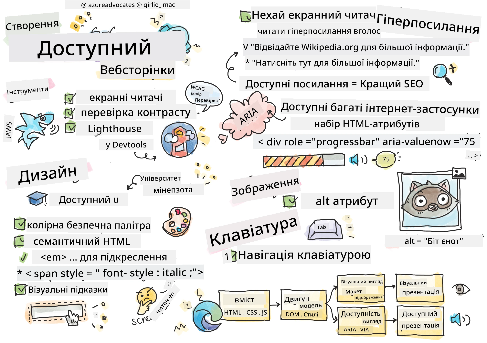
> Скетчнот від [Tomomi Imura](https://twitter.com/girlie_mac)

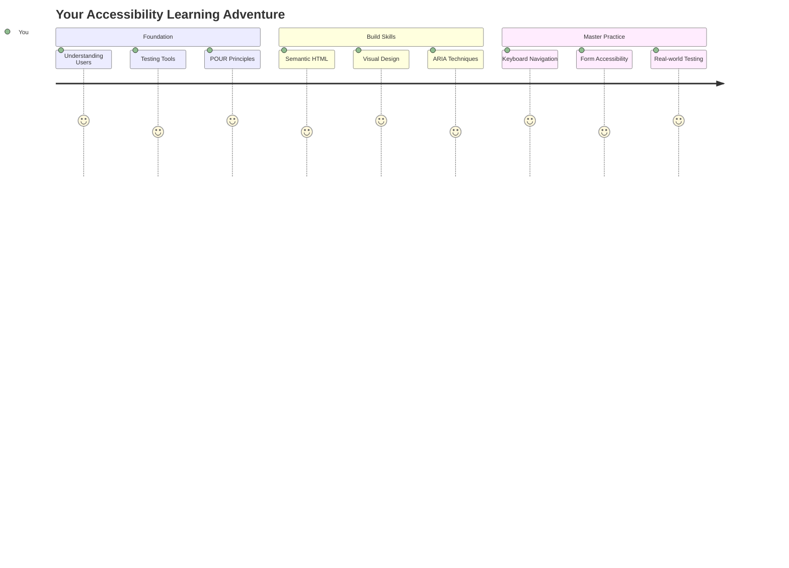

## Тест перед лекцією
[Тест перед лекцією](https://ff-quizzes.netlify.app/web/)

> Сила вебу полягає в його універсальності. Доступ для всіх, незалежно від обмежень, є важливим аспектом.
>
> \- Сер Тімоті Бернерс-Лі, директор W3C та винахідник Всесвітньої павутини

Ось що може вас здивувати: коли ви створюєте доступні веб-сайти, ви допомагаєте не лише людям з інвалідністю — ви фактично робите веб кращим для всіх!

Помічали ті з'їзди на тротуарах на перехрестях? Вони спочатку були створені для інвалідних візків, але тепер вони допомагають людям з дитячими колясками, працівникам доставки з візками, мандрівникам із валізами на колесах і навіть велосипедистам. Саме так працює доступний веб-дизайн — рішення, які допомагають одній групі, часто приносять користь усім. Круто, правда?

У цьому уроці ми дослідимо, як створювати веб-сайти, які дійсно працюють для всіх, незалежно від того, як вони переглядають веб. Ви дізнаєтеся про практичні техніки, які вже вбудовані у веб-стандарти, спробуєте інструменти тестування та побачите, як доступність робить ваші сайти більш зручними для всіх користувачів.

До кінця цього уроку ви будете впевнені у тому, щоб зробити доступність природною частиною вашого робочого процесу розробки. Готові дослідити, як продумані дизайнерські рішення можуть відкрити веб для мільярдів користувачів? Почнемо!

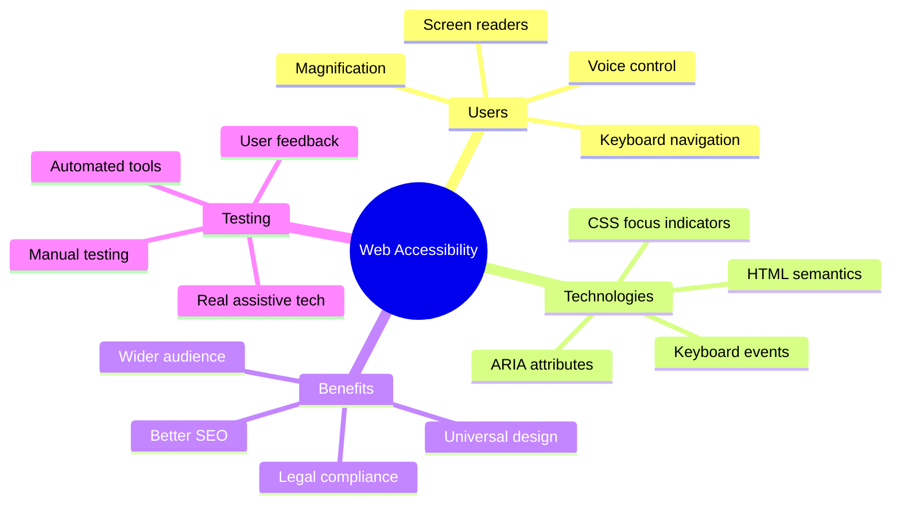

> Ви можете пройти цей урок на [Microsoft Learn](https://docs.microsoft.com/learn/modules/web-development-101/accessibility/?WT.mc_id=academic-77807-sagibbon)!

## Розуміння допоміжних технологій

Перш ніж перейти до кодування, давайте на хвилинку зрозуміємо, як люди з різними можливостями фактично взаємодіють із вебом. Це не просто теорія — розуміння цих реальних моделей навігації зробить вас набагато кращим розробником!

Допоміжні технології — це дивовижні інструменти, які допомагають людям з інвалідністю взаємодіяти з веб-сайтами у способах, які можуть вас здивувати. Як тільки ви зрозумієте, як ці технології працюють, створення доступних веб-досвідів стане набагато інтуїтивнішим. Це як навчитися бачити ваш код очима іншої людини.

### Екранні читачі

[Екранні читачі](https://en.wikipedia.org/wiki/Screen_reader) — це досить складні технології, які перетворюють цифровий текст у голосовий або брайлевий вихід. Хоча вони в основному використовуються людьми з порушеннями зору, вони також дуже корисні для користувачів з такими порушеннями навчання, як дислексія.

Я люблю думати про екранний читач як про дуже розумного оповідача, який читає вам книгу. Він читає контент вголос у логічному порядку, оголошує інтерактивні елементи, такі як "кнопка" або "посилання", і надає клавіатурні скорочення для переміщення сторінкою. Але ось у чому справа — екранні читачі можуть працювати лише тоді, коли ми створюємо веб-сайти з правильною структурою та змістовним контентом. І тут ви, як розробник, вступаєте в гру!

**Популярні екранні читачі на різних платформах:**
- **Windows**: [NVDA](https://www.nvaccess.org/about-nvda/) (безкоштовний і найпопулярніший), [JAWS](https://webaim.org/articles/jaws/), [Narrator](https://support.microsoft.com/windows/complete-guide-to-narrator-e4397a0d-ef4f-b386-d8ae-c172f109bdb1/?WT.mc_id=academic-77807-sagibbon) (вбудований)
- **macOS/iOS**: [VoiceOver](https://support.apple.com/guide/voiceover/welcome/10) (вбудований і дуже потужний)
- **Android**: [TalkBack](https://support.google.com/accessibility/android/answer/6283677) (вбудований)
- **Linux**: [Orca](https://wiki.gnome.org/Projects/Orca) (безкоштовний і з відкритим кодом)

**Як екранні читачі навігають веб-контент:**

Екранні читачі надають кілька методів навігації, які роблять перегляд ефективним для досвідчених користувачів:
- **Послідовне читання**: Читає контент зверху вниз, як слідування книзі
- **Навігація за орієнтирами**: Переміщення між секціями сторінки (заголовок, навігація, основний контент, футер)
- **Навігація за заголовками**: Переміщення між заголовками для розуміння структури сторінки
- **Списки посилань**: Генерація списку всіх посилань для швидкого доступу
- **Елементи форм**: Переміщення безпосередньо між полями вводу та кнопками

> 💡 **Ось що мене вразило**: 68% користувачів екранних читачів навігають в основному за заголовками ([WebAIM Survey](https://webaim.org/projects/screenreadersurvey9/#finding)). Це означає, що ваша структура заголовків — це як дорожня карта для користувачів. Коли ви робите її правильно, ви буквально допомагаєте людям швидше знаходити шлях до вашого контенту!

### Побудова вашого робочого процесу тестування

Ось гарна новина — ефективне тестування доступності не повинно бути надмірно складним! Ви захочете комбінувати автоматизовані інструменти (вони чудово виявляють очевидні проблеми) з деяким ручним тестуванням. Ось систематичний підхід, який, на мою думку, виявляє найбільше проблем без зайвих витрат часу:

**Основний робочий процес ручного тестування:**

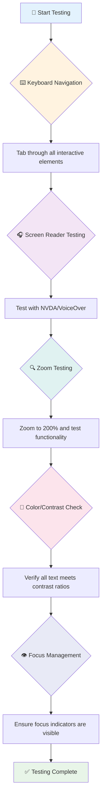

**Покроковий контрольний список тестування:**
1. **Навігація за допомогою клавіатури**: Використовуйте лише Tab, Shift+Tab, Enter, Space та клавіші зі стрілками
2. **Тестування екранного читача**: Увімкніть NVDA, VoiceOver або Narrator і навігуйте із закритими очима
3. **Тестування масштабування**: Перевірте на рівнях масштабування 200% і 400%
4. **Перевірка контрасту кольорів**: Перевірте весь текст і компоненти інтерфейсу
5. **Тестування індикаторів фокусу**: Переконайтеся, що всі інтерактивні елементи мають видимі стани фокусу

✅ **Почніть з Lighthouse**: Відкрийте DevTools вашого браузера, запустіть аудит доступності Lighthouse, а потім використовуйте результати для визначення пріоритетів ручного тестування.

### Інструменти масштабування та збільшення

Ви знаєте, як іноді збільшуєте текст на телефоні, коли він занадто малий, або мружитеся на екрані ноутбука при яскравому сонячному світлі? Багато користувачів щодня покладаються на інструменти збільшення, щоб зробити контент читабельним. Це включає людей з порушеннями зору, літніх людей і будь-кого, хто коли-небудь намагався читати веб-сайт на вулиці.

Сучасні технології масштабування еволюціонували далеко за межі простого збільшення. Розуміння того, як ці інструменти працюють, допоможе вам створювати адаптивні дизайни, які залишаються функціональними та привабливими на будь-якому рівні масштабування.

**Сучасні можливості масштабування браузера:**
- **Масштабування сторінки**: Пропорційно збільшує весь контент (текст, зображення, макет) — це рекомендований метод
- **Масштабування лише тексту**: Збільшує розмір шрифту, зберігаючи оригінальний макет
- **Збільшення за допомогою жестів**: Мобільна підтримка для тимчасового збільшення
- **Підтримка браузерів**: Усі сучасні браузери підтримують масштабування до 500% без порушення функціональності

**Спеціалізоване програмне забезпечення для збільшення:**
- **Windows**: [Magnifier](https://support.microsoft.com/windows/use-magnifier-to-make-things-on-the-screen-easier-to-see-414948ba-8b1c-d3bd-8615-0e5e32204198) (вбудований), [ZoomText](https://www.freedomscientific.com/training/zoomtext/getting-started/)
- **macOS/iOS**: [Zoom](https://www.apple.com/accessibility/mac/vision/) (вбудований з розширеними функціями)

> ⚠️ **Дизайнерське зауваження**: WCAG вимагає, щоб контент залишався функціональним при масштабуванні до 200%. На цьому рівні горизонтальне прокручування має бути мінімальним, а всі інтерактивні елементи повинні залишатися доступними.

✅ **Перевірте ваш адаптивний дизайн**: Збільшіть браузер до 200% і 400%. Чи адаптується ваш макет гармонійно? Чи можете ви все ще отримати доступ до всіх функцій без надмірного прокручування?

## Сучасні інструменти тестування доступності

Тепер, коли ви розумієте, як люди навігають веб за допомогою допоміжних технологій, давайте дослідимо інструменти, які допомагають вам створювати та тестувати доступні веб-сайти.

Думайте про це так: автоматизовані інструменти чудово виявляють очевидні проблеми (наприклад, відсутність alt-тексту), тоді як ручне тестування допомагає вам переконатися, що ваш сайт зручний у реальному використанні. Разом вони дають вам впевненість, що ваші сайти працюють для всіх.

### Тестування контрасту кольорів

Ось гарна новина: контраст кольорів — одна з найпоширеніших проблем доступності, але вона також одна з найпростіших для виправлення. Хороший контраст приносить користь усім — від користувачів з порушеннями зору до людей, які намагаються читати свої телефони на пляжі.

**Вимоги WCAG до контрасту:**

| Тип тексту | WCAG AA (Мінімум) | WCAG AAA (Покращений) |
|-----------|-------------------|---------------------|
| **Звичайний текст** (менше 18pt) | Співвідношення контрасту 4.5:1 | Співвідношення контрасту 7:1 |
| **Великий текст** (18pt+ або 14pt+ жирний) | Співвідношення контрасту 3:1 | Співвідношення контрасту 4.5:1 |
| **Компоненти інтерфейсу** (кнопки, межі форм) | Співвідношення контрасту 3:1 | Співвідношення контрасту 3:1 |

**Основні інструменти тестування:**
- [Colour Contrast Analyser](https://www.tpgi.com/color-contrast-checker/) - Десктопний додаток з вибором кольору
- [WebAIM Contrast Checker](https://webaim.org/resources/contrastchecker/) - Веб-інструмент з миттєвим зворотним зв'язком
- [Stark](https://www.getstark.co/) - Плагін для дизайнерських інструментів Figma, Sketch, Adobe XD
- [Accessible Colors](https://accessible-colors.com/) - Знаходьте доступні палітри кольорів

✅ **Створюйте кращі палітри кольорів**: Почніть з кольорів вашого бренду та використовуйте перевірки контрасту для створення доступних варіацій. Документуйте їх як доступні кольорові токени вашої дизайн-системи.

### Комплексний аудит доступності

Найефективніше тестування доступності комбінує кілька підходів. Жоден інструмент не виявляє все, тому створення рутини тестування з різними методами забезпечує повне охоплення.

**Тестування в браузері (вбудоване в DevTools):**
- **Chrome/Edge**: Аудит доступності Lighthouse + панель доступності
- **Firefox**: Інспектор доступності з детальним деревом
- **Safari**: Вкладка аудиту в Web Inspector з симуляцією VoiceOver

**Професійні розширення для тестування:**
- [axe DevTools](https://www.deque.com/axe/devtools/) - Галузевий стандарт автоматизованого тестування
- [WAVE](https://wave.webaim.org/extension/) - Візуальний зворотний зв'язок з виділенням помилок
- [Accessibility Insights](https://accessibilityinsights.io/) - Комплексний набір тестування від Microsoft

**Інтеграція командного рядка та CI/CD:**
- [axe-core](https://github.com/dequelabs/axe-core) - Бібліотека JavaScript для автоматизованого тестування
- [Pa11y](https://pa11y.org/) - Інструмент тестування доступності командного рядка
- [Lighthouse CI](https://github.com/GoogleChrome/lighthouse-ci) - Автоматизоване оцінювання доступності

> 🎯 **Ціль тестування**: Прагніть до оцінки доступності Lighthouse 95+ як базового рівня. Пам'ятайте, автоматизовані інструменти виявляють лише близько 30-40% проблем доступності — ручне тестування все ще необхідне!

### 🧠 **Перевірка навичок тестування: Готові знайти проблеми?**

**Давайте перевіримо, як ви почуваєтеся щодо тестування доступності:**
- Який метод тестування здається вам найбільш доступним зараз?
- Чи можете ви уявити використання лише клавіатурної навігації протягом цілого дня?
- Яку проблему доступності ви особисто відчували онлайн?

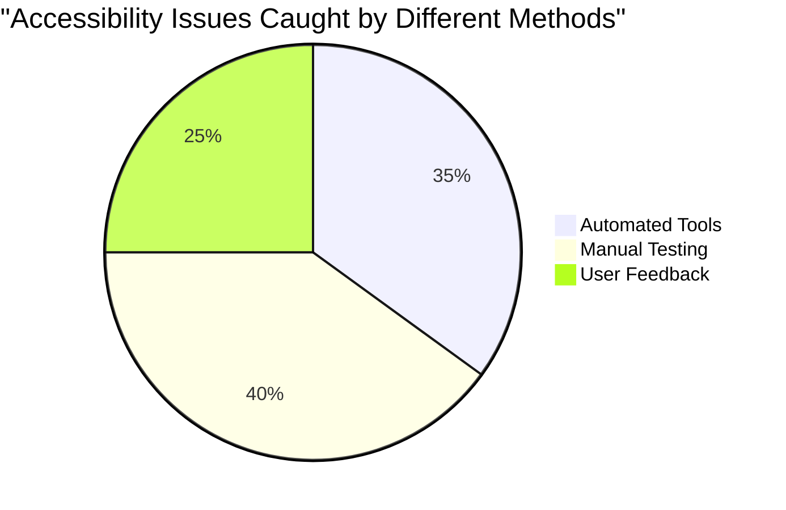

> **Підтримка впевненості**: Професійні тестувальники доступності використовують саме цю комбінацію методів. Ви вивчаєте галузеві стандарти!

## Побудова доступності з самого початку

Ключ до успіху доступності — це включення її у вашу основу з першого дня. Я знаю, що спокуса думати "я додам доступність пізніше" велика, але це як намагатися додати пандус до будинку після його побудови. Можливо? Так. Легко? Не дуже.

Думайте про доступність як про планування будинку — набагато легше включити доступність для інвалідних візків у ваші початкові архітектурні плани, ніж переробляти все пізніше.

### Принципи POUR: Ваша основа доступності

Рекомендації щодо доступності веб-контенту (WCAG) побудовані навколо чотирьох основних принципів, які утворюють POUR. Не хвилюйтеся — це не сухі академічні концепції! Це практичні рекомендації для створення контенту, який працює для всіх.

Як тільки ви освоїте POUR, прийняття рішень щодо доступності стане набагато інтуїтивнішим. Це як мати ментальний контрольний список, який направляє ваші дизайнерські вибори. Давайте розберемо це:

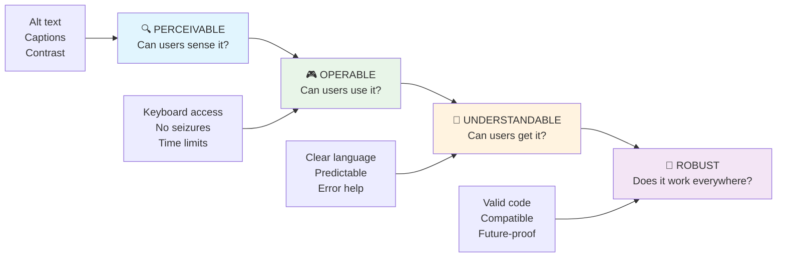

**🔍 Відчутний**: Інформація повинна бути представлена у спосіб, який користувачі можуть сприймати через доступні їм органи чуття

- Надавайте текстові альтернативи для нетекстового контенту (зображення, відео
- **Тестуйте на різних браузерах, пристроях і допоміжних інструментах**
- **Структуруйте контент так, щоб він залишався функціональним навіть без підтримки розширених функцій**

### 🎯 **Перевірка принципів POUR: закріплюємо основи**

**Швидкий роздум про основи:**
- Чи можете ви згадати функцію вебсайту, яка порушує кожен принцип POUR?
- Який принцип здається вам найбільш природним як розробнику?
- Як ці принципи можуть покращити дизайн для всіх, а не лише для користувачів з інвалідністю?

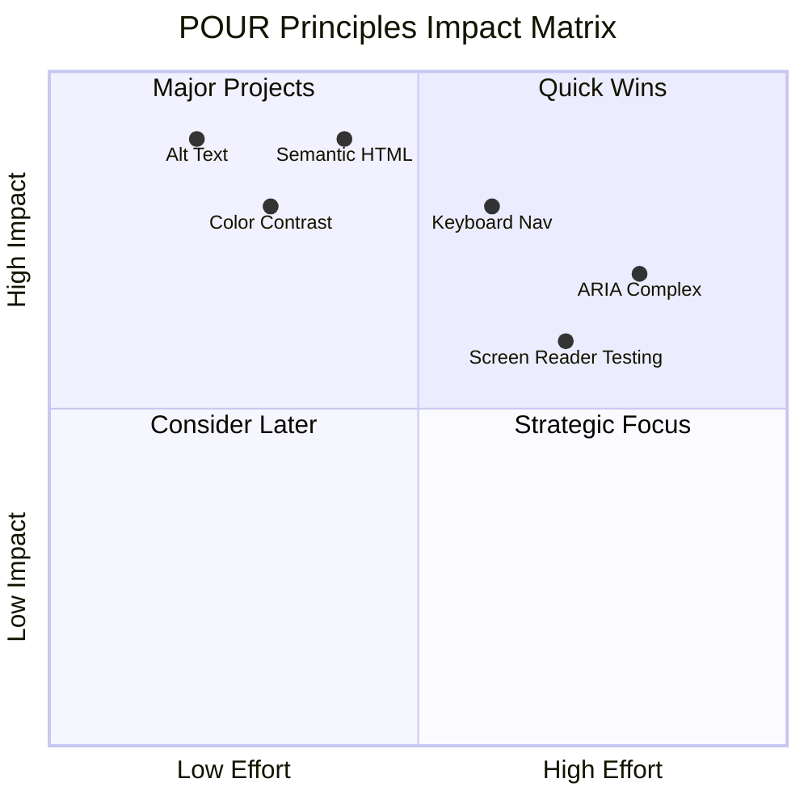

> **Пам’ятайте**: Починайте з покращень, які мають великий вплив і потребують мінімальних зусиль. Семантичний HTML і текст для атрибуту alt дають найбільший приріст доступності за найменших витрат!

## Створення доступного візуального дизайну

Хороший візуальний дизайн і доступність йдуть рука об руку. Дизайн з урахуванням доступності часто відкриває шлях до чистих, елегантних рішень, які приносять користь усім користувачам.

Давайте розглянемо, як створювати привабливі дизайни, які працюють для всіх, незалежно від їхніх зорових можливостей або умов перегляду контенту.

### Стратегії кольору та візуальної доступності

Колір має потужну комунікаційну силу, але він ніколи не повинен бути єдиним способом передачі важливої інформації. Дизайн, який виходить за межі кольору, створює більш надійний і інклюзивний досвід, який працює в різних ситуаціях.

**Дизайн для різних типів кольорового зору:**

Приблизно 8% чоловіків і 0,5% жінок мають певну форму порушення кольорового зору (часто називається "кольорова сліпота"). Найпоширеніші типи:
- **Дейтеранопія**: Складнощі з розрізненням червоного і зеленого
- **Протанопія**: Червоний здається більш тьмяним
- **Тританопія**: Складнощі з синім і жовтим (рідкісний випадок)

**Інклюзивні стратегії кольору:**

```css
/* ❌ Bad: Using only color to indicate status */
.error { color: red; }
.success { color: green; }

/* ✅ Good: Color plus icons and context */
.error {
  color: #d32f2f;
  border-left: 4px solid #d32f2f;
}
.error::before {
  content: "⚠️";
  margin-right: 8px;
}

.success {
  color: #2e7d32;
  border-left: 4px solid #2e7d32;
}
.success::before {
  content: "✅";
  margin-right: 8px;
}
```

**Поза базовими вимогами до контрасту:**
- Тестуйте свої кольорові рішення за допомогою симуляторів кольорової сліпоти
- Використовуйте візерунки, текстури або форми разом із кольоровим кодуванням
- Переконайтеся, що інтерактивні стани залишаються розрізнюваними без кольору
- Розгляньте, як ваш дизайн виглядає в режимі високого контрасту

✅ **Перевірте доступність кольору**: Використовуйте інструменти, такі як [Coblis](https://www.color-blindness.com/coblis-color-blindness-simulator/), щоб побачити, як ваш сайт виглядає для користувачів з різними типами кольорового зору.

### Індикатори фокусу та дизайн взаємодії

Індикатори фокусу — це цифровий еквівалент курсора, який показує користувачам клавіатури, де вони знаходяться на сторінці. Добре спроектовані індикатори фокусу покращують досвід для всіх, роблячи взаємодії зрозумілими та передбачуваними.

**Сучасні найкращі практики для індикаторів фокусу:**

```css
/* Enhanced focus styles that work across browsers */
button:focus-visible {
  outline: 2px solid #0066cc;
  outline-offset: 2px;
  box-shadow: 0 0 0 4px rgba(0, 102, 204, 0.25);
}

/* Remove focus outline for mouse users, preserve for keyboard users */
button:focus:not(:focus-visible) {
  outline: none;
}

/* Focus-within for complex components */
.card:focus-within {
  box-shadow: 0 0 0 3px rgba(74, 144, 164, 0.5);
  border-color: #4A90A4;
}

/* Ensure focus indicators meet contrast requirements */
.custom-focus:focus-visible {
  outline: 3px solid #ffffff;
  outline-offset: 2px;
  box-shadow: 0 0 0 6px #000000;
}
```

**Вимоги до індикаторів фокусу:**
- **Видимість**: Повинні мати контрастність щонайменше 3:1 із навколишніми елементами
- **Ширина**: Мінімум 2px товщини навколо всього елемента
- **Стійкість**: Повинні залишатися видимими, поки фокус не переміститься
- **Розрізнення**: Повинні візуально відрізнятися від інших станів UI

> 💡 **Порада з дизайну**: Чудові індикатори фокусу часто використовують комбінацію обведення, тіні та змін кольору для забезпечення видимості на різних фонах і в різних контекстах.

✅ **Перевірте індикатори фокусу**: Переміщуйтеся по вашому сайту за допомогою клавіші Tab і зверніть увагу, які елементи мають чіткі індикатори фокусу. Чи є якісь важко помітні або зовсім відсутні?

### Семантичний HTML: основа доступності

Семантичний HTML — це як GPS для допоміжних технологій на вашому сайті. Використовуючи правильні HTML-елементи за їхнім призначенням, ви фактично надаєте екранним читачам, клавіатурам та іншим інструментам детальну карту для ефективної навігації.

Ось аналогія, яка мені дуже сподобалася: семантичний HTML — це різниця між добре організованою бібліотекою з чіткими категоріями та корисними знаками і складом, де книги розкидані хаотично. В обох місцях є ті самі книги, але де вам буде зручніше щось знайти? Саме так!

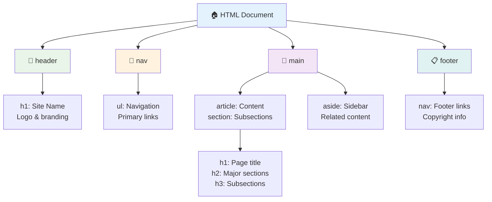

**Основи структури доступної сторінки:**

```html
<!-- Landmark elements provide page navigation structure -->
<header>
  <h1>Your Site Name</h1>
  <nav aria-label="Main navigation">
    <ul>
      <li><a href="/home">Home</a></li>
      <li><a href="/about">About</a></li>
      <li><a href="/services">Services</a></li>
    </ul>
  </nav>
</header>

<main>
  <article>
    <header>
      <h1>Article Title</h1>
      <p>Published on <time datetime="2024-10-14">October 14, 2024</time></p>
    </header>
    
    <section>
      <h2>First Section</h2>
      <p>Content that relates to this section...</p>
    </section>
    
    <section>
      <h2>Second Section</h2>
      <p>More related content...</p>
    </section>
  </article>
  
  <aside>
    <h2>Related Links</h2>
    <nav aria-label="Related articles">
      <ul>
        <li><a href="/related-1">First related article</a></li>
        <li><a href="/related-2">Second related article</a></li>
      </ul>
    </nav>
  </aside>
</main>

<footer>
  <p>&copy; 2024 Your Site Name. All rights reserved.</p>
  <nav aria-label="Footer links">
    <ul>
      <li><a href="/privacy">Privacy Policy</a></li>
      <li><a href="/contact">Contact Us</a></li>
    </ul>
  </nav>
</footer>
```

**Чому семантичний HTML змінює доступність:**

| Семантичний елемент | Призначення | Перевага для екранного читача |
|---------------------|-------------|------------------------------|
| `<header>` | Заголовок сторінки або секції | "Орієнтир банера" - швидка навігація до верху |
| `<nav>` | Навігаційні посилання | "Орієнтир навігації" - список навігаційних секцій |
| `<main>` | Основний контент сторінки | "Орієнтир основного контенту" - перехід прямо до контенту |
| `<article>` | Самостійний контент | Оголошує межі статті |
| `<section>` | Групи тематичного контенту | Забезпечує структуру контенту |
| `<aside>` | Супутній контент на бічній панелі | "Орієнтир додаткового контенту" |
| `<footer>` | Нижній колонтитул сторінки або секції | "Орієнтир інформації про контент" |

**Суперсили екранного читача з семантичним HTML:**
- **Навігація по орієнтирах**: Миттєвий перехід між основними секціями сторінки
- **Обриси заголовків**: Генерація змісту з вашої структури заголовків
- **Списки елементів**: Створення списків усіх посилань, кнопок або елементів форми
- **Контекстуальна обізнаність**: Розуміння взаємозв’язків між секціями контенту

> 🎯 **Швидкий тест**: Спробуйте навігацію по вашому сайту за допомогою екранного читача, використовуючи скорочення для орієнтирів (D для орієнтира, H для заголовка, K для посилання в NVDA/JAWS). Чи має навігація сенс?

### 🏗️ **Перевірка майстерності семантичного HTML: створення міцних основ**

**Оцініть своє розуміння семантики:**
- Чи можете ви визначити орієнтири на вебсторінці, просто дивлячись на HTML?
- Як би ви пояснили різницю між `<section>` і `<div>` другу?
- Що ви перевірите в першу чергу, якщо користувач екранного читача повідомить про проблеми з навігацією?

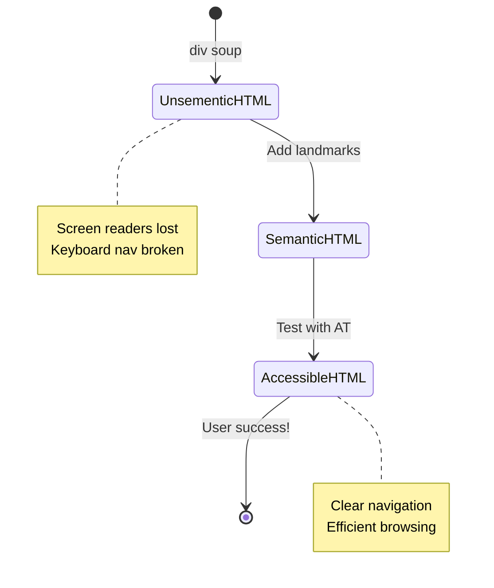

> **Професійна порада**: Хороший семантичний HTML автоматично вирішує близько 70% проблем доступності. Освоїте цю основу — і ви на правильному шляху!

✅ **Перевірте свою семантичну структуру**: Використовуйте панель доступності в DevTools вашого браузера, щоб переглянути дерево доступності та переконатися, що ваша розмітка створює логічну структуру.

### Ієрархія заголовків: створення логічного контуру контенту

Заголовки надзвичайно важливі для доступного контенту — вони як хребет, що тримає все разом. Користувачі екранних читачів сильно покладаються на заголовки, щоб зрозуміти і навігувати ваш контент. Це як створення змісту для вашої сторінки.

**Золоте правило для заголовків:**
Ніколи не пропускайте рівні. Завжди прогресуйте логічно від `<h1>` до `<h2>` до `<h3>` і так далі. Пам’ятаєте, як у школі робили плани? Це той самий принцип — ви б не перескочили з "I. Основна точка" прямо до "C. Підпункт", не маючи "A. Підточки" між ними, правда?

**Приклад ідеальної структури заголовків:**

```html
<!-- ✅ Excellent: Logical, hierarchical progression -->
<main>
  <h1>Complete Guide to Web Accessibility</h1>
  
  <section>
    <h2>Understanding Screen Readers</h2>
    <p>Introduction to screen reader technology...</p>
    
    <h3>Popular Screen Reader Software</h3>
    <p>NVDA, JAWS, and VoiceOver comparison...</p>
    
    <h3>Testing with Screen Readers</h3>
    <p>Step-by-step testing instructions...</p>
  </section>
  
  <section>
    <h2>Color and Contrast Guidelines</h2>
    <p>Designing with sufficient contrast...</p>
    
    <h3>WCAG Contrast Requirements</h3>
    <p>Understanding the different contrast levels...</p>
    
    <h3>Testing Tools and Techniques</h3>
    <p>Tools for verifying contrast ratios...</p>
  </section>
</main>
```

```html
<!-- ❌ Problematic: Skipping levels, inconsistent structure -->
<h1>Page Title</h1>
<h3>Subsection</h3> <!-- Skipped h2 -->
<h2>This should come before h3</h2>
<h1>Another main heading?</h1> <!-- Multiple h1s -->
```

**Найкращі практики для заголовків:**
- **Один `<h1>` на сторінку**: Зазвичай це ваш основний заголовок сторінки або основного контенту
- **Логічна прогресія**: Ніколи не пропускайте рівні (h1 → h2 → h3, а не h1 → h3)
- **Описовий контент**: Робіть заголовки змістовними, навіть якщо їх читати поза контекстом
- **Візуальне стилювання за допомогою CSS**: Використовуйте CSS для вигляду, HTML-рівні для структури

**Статистика навігації екранних читачів:**
- 68% користувачів екранних читачів навігують за заголовками ([WebAIM Survey](https://webaim.org/projects/screenreadersurvey9/#finding))
- Користувачі очікують знайти логічний контур заголовків
- Заголовки забезпечують найшвидший спосіб зрозуміти структуру сторінки

> 💡 **Професійна порада**: Використовуйте розширення браузера, такі як "HeadingsMap", щоб візуалізувати структуру заголовків. Вона повинна читатися як добре організований зміст.

✅ **Перевірте структуру заголовків**: Використовуйте навігацію за заголовками екранного читача (клавіша H у NVDA), щоб переходити між заголовками. Чи розповідає прогресія логічну історію вашого контенту?

### Розширені техніки візуальної доступності

Поза основами контрасту і кольору існують складніші методи, які допомагають створити справді інклюзивний візуальний досвід. Ці методи забезпечують роботу вашого контенту в різних умовах перегляду і з допоміжними технологіями.

**Основні стратегії візуальної комунікації:**

- **Мультимодальний зворотний зв’язок**: Поєднуйте візуальні, текстові, а іноді й аудіо підказки
- **Прогресивне розкриття**: Представляйте інформацію у зручних для сприйняття частинах
- **Послідовні шаблони взаємодії**: Використовуйте знайомі UI-конвенції
- **Респонсивна типографіка**: Масштабуйте текст відповідно до пристроїв
- **Стан завантаження і помилок**: Забезпечуйте чіткий зворотний зв’язок для всіх дій користувача

**CSS-утиліти для покращення доступності:**

```css
/* Screen reader only text - visually hidden but accessible */
.sr-only {
  position: absolute;
  width: 1px;
  height: 1px;
  padding: 0;
  margin: -1px;
  overflow: hidden;
  clip: rect(0, 0, 0, 0);
  white-space: nowrap;
  border: 0;
}

/* Skip link for keyboard navigation */
.skip-link {
  position: absolute;
  top: -40px;
  left: 6px;
  background: #000000;
  color: #ffffff;
  padding: 8px 16px;
  text-decoration: none;
  border-radius: 4px;
  font-weight: bold;
  transition: top 0.3s ease;
  z-index: 1000;
}

.skip-link:focus {
  top: 6px;
}

/* Reduced motion respect */
@media (prefers-reduced-motion: reduce) {
  .skip-link {
    transition: none;
  }
  
  * {
    animation-duration: 0.01ms !important;
    animation-iteration-count: 1 !important;
    transition-duration: 0.01ms !important;
  }
}

/* High contrast mode support */
@media (prefers-contrast: high) {
  .button {
    border: 2px solid;
  }
}
```

> 🎯 **Шаблон доступності**: "Посилання для пропуску" є важливим для користувачів клавіатури. Воно повинно бути першим фокусованим елементом на вашій сторінці і переходити прямо до основного контенту.

✅ **Реалізуйте навігацію для пропуску**: Додайте посилання для пропуску на ваші сторінки і протестуйте їх, натиснувши Tab, як тільки сторінка завантажиться. Вони повинні з’явитися і дозволити перейти до основного контенту.

## Створення змістовного тексту посилань

Посилання — це, по суті, магістралі вебу, але погано написаний текст посилань — це як дорожні знаки, які просто кажуть "Місце" замість "Центр Чикаго". Не дуже корисно, правда?

Ось що мене вразило, коли я вперше дізнався про це: екранні читачі можуть витягнути всі посилання зі сторінки і показати їх як один великий список. Уявіть, що хтось передав вам каталог усіх посилань на вашій сторінці. Чи кожне з них має сенс саме по собі? Це тест, який ваш текст посилань повинен пройти!

### Розуміння шаблонів навігації за посиланнями

Екранні читачі пропонують потужні функції навігації за посиланнями, які залежать від добре написаного тексту посилань:

**Методи навігації за посиланнями:**
- **Послідовне читання**: Посилання читаються в контексті як частина потоку контенту
- **Генерація списку посилань**: Усі посилання сторінки зібрані в пошуковий каталог
- **Швидка навігація**: Перехід між посиланнями за допомогою клавіатурних скорочень (K у NVDA)
- **Функція пошуку**: Знаходження конкретних посилань шляхом введення часткового тексту

**Чому контекст має значення:**
Коли користувачі екранного читача генерують список посилань, вони бачать щось на кшталт цього:
- "Завантажити звіт"
- "Дізнатися більше"
- "Натисніть тут"
- "Політика конфіденційності"
- "Натисніть тут"

Лише два з цих посилань надають корисну інформацію, якщо їх читати поза контекстом!

> 📊 **Вплив на користувача**: Користувачі екранних читачів сканують списки посилань, щоб швидко зрозуміти контент сторінки. Загальний текст посилань змушує їх повертатися до контексту кожного посилання, значно уповільнюючи їхній досвід перегляду.

### Поширені помилки тексту посилань, яких слід уникати

Розуміння того, що не працює, допомагає розпізнати і виправити проблеми доступності в існуючому контенті.

**❌ Загальний текст посилань, який не надає контексту:**

```html
<!-- Meaningless when read from a link list -->
<p>Our sustainability efforts are detailed in our recent report. 
   <a href="/sustainability-2024.pdf">Click here</a> to view it.</p>

<!-- Repeated generic text throughout the page -->
<div class="article-card">
  <h3>Web Accessibility Guide</h3>
  <p>Learn the fundamentals...</p>
  <a href="/accessibility-guide">Read more</a>
</div>
<div class="article-card">
  <h3>Color Contrast Tips</h3>
  <p>Improve your design...</p>
  <a href="/color-contrast">Read more</a>
</div>

<!-- URLs as link text (difficult for screen readers to announce) -->
<p>Visit https://www.w3.org/WAI/WCAG21/quickref/ for WCAG guidelines.</p>

<!-- Vague action words -->
<a href="/contact">Go</a> | <a href="/about">See</a> | <a href="/help">View</a>
```

**Чому ці шаблони не працюють:**
- **"Натисніть тут"** нічого не говорить про призначення
- **"Дізнатися більше"** повторюється кілька разів, створюючи плутанину
- **Сирі URL-адреси** важко чітко вимовити екранним читачам
- **Одинарні слова**, такі як "Перейти" або "Дивитися", не мають описового контексту

### Написання чудового тексту посилань

Описовий текст посилань приносить користь усім — користувачі з нормальним зором можуть швидко сканувати посилання, а користувачі екранних читачів одразу розуміють призначення.

**✅ Приклади чіткого, описового тексту посилань:**

```html
<!-- Descriptive text that explains the destination -->
<p>Our comprehensive <a href="/sustainability-2024.pdf">2024 sustainability report (PDF, 2.1MB)</a> details our environmental initiatives.</p>

<!-- Specific, unique link text for each card -->
<div class="article-card">
  <h3>Web Accessibility Guide</h3>
  <p>Learn the fundamentals of inclusive design...</p>
  <a href="/accessibility-guide">Read our complete web accessibility guide</a>
</div>
<div class="article-card">
  <h3>Color Contrast Tips</h3>
  <p>Improve your design with better color choices...</p>
  <a href="/color-contrast">Explore color contrast best practices</a>
</div>

<!-- Meaningful text instead of raw URLs -->
<p>The <a href="https://www.w3.org/WAI/WCAG21/quickref/">WCAG 2.1 Quick Reference guide</a> provides comprehensive accessibility guidelines.</p>

<!-- Descriptive action links -->
<a href="/contact">Contact our support team</a> | 
<a href="/about">About our company</a> | 
<a href="/help">Get help with your account</a>
```

**Найкращі практики тексту посилань:**
- **Будьте конкретними**: "Завантажити квартальний фінансовий звіт" замість "Завантажити"
- **Включайте тип файлу і розмір**: "(PDF, 1.2MB)" для файлів, які можна завантажити
- **Зазначайте, якщо посилання відкриваються зовні**: "(
**П'ять категорій ARIA:**

1. **Ролі**: Що це за елемент? (`button`, `tab`, `dialog`)
2. **Властивості**: Які його характеристики? (`aria-required`, `aria-haspopup`)
3. **Стан**: Який його поточний стан? (`aria-expanded`, `aria-checked`)
4. **Орієнтири**: Де він знаходиться в структурі сторінки? (`banner`, `navigation`, `main`)
5. **Живі області**: Як слід оголошувати зміни? (`aria-live`, `aria-atomic`)

### Основні шаблони ARIA для сучасних веб-додатків

Ці шаблони вирішують найпоширеніші проблеми доступності в інтерактивних веб-додатках:

**Називання та опис елементів:**

```html
<!-- aria-label: Provides accessible name when visible text isn't sufficient -->
<button aria-label="Close newsletter subscription dialog">×</button>

<!-- aria-labelledby: References existing text as the accessible name -->
<section aria-labelledby="news-heading">
  <h2 id="news-heading">Latest News</h2>
  <!-- news content -->
</section>

<!-- aria-describedby: Links to additional descriptive text -->
<input type="password" 
       aria-describedby="pwd-requirements pwd-strength"
       required>
<div id="pwd-requirements">
  Password must contain at least 8 characters, including uppercase, lowercase, and numbers.
</div>
<div id="pwd-strength" aria-live="polite">
  <!-- Dynamic password strength indicator -->
</div>
```

**Живі області для динамічного контенту:**

```html
<!-- Polite announcements (don't interrupt current speech) -->
<div aria-live="polite" id="status-updates">
  <!-- Status messages appear here -->
</div>

<!-- Assertive announcements (interrupt and announce immediately) -->
<div aria-live="assertive" id="urgent-alerts">
  <!-- Error messages and critical alerts -->
</div>

<!-- Loading states with live regions -->
<button id="submit-btn" aria-describedby="loading-status">
  Submit Application
</button>
<div id="loading-status" aria-live="polite" aria-atomic="true">
  <!-- "Processing your application..." appears here -->
</div>
```

**Приклад інтерактивного віджета (акордеон):**

```html
<div class="accordion">
  <h3>
    <button aria-expanded="false" 
            aria-controls="panel-1" 
            id="accordion-trigger-1"
            class="accordion-trigger">
      Accessibility Guidelines
    </button>
  </h3>
  <div id="panel-1" 
       role="region"
       aria-labelledby="accordion-trigger-1" 
       hidden>
    <p>WCAG 2.1 provides comprehensive guidelines...</p>
  </div>
</div>
```

```javascript
// JavaScript to manage accordion state
function toggleAccordion(trigger) {
  const panel = document.getElementById(trigger.getAttribute('aria-controls'));
  const isExpanded = trigger.getAttribute('aria-expanded') === 'true';
  
  // Toggle states
  trigger.setAttribute('aria-expanded', !isExpanded);
  panel.hidden = isExpanded;
  
  // Announce change to screen readers
  const status = document.getElementById('status-updates');
  status.textContent = isExpanded ? 'Section collapsed' : 'Section expanded';
}
```

### Найкращі практики впровадження ARIA

ARIA є потужним інструментом, але потребує ретельного впровадження. Дотримання цих рекомендацій допоможе забезпечити, що ARIA покращує, а не погіршує доступність:

**🛡️ Основні принципи:**

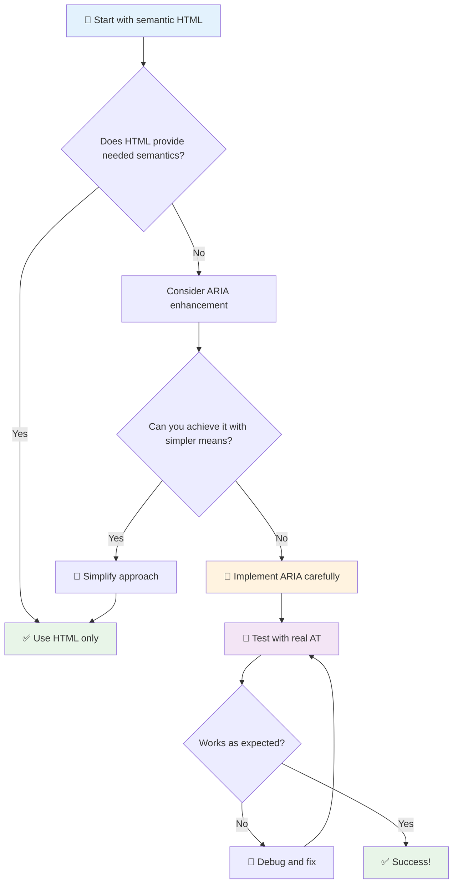

1. **Спочатку семантичний HTML**: Завжди надавайте перевагу `<button>` над `<div role="button">`
2. **Не порушуйте семантику**: Ніколи не змінюйте існуюче значення HTML (уникайте `<h1 role="button">`)
3. **Забезпечте доступність клавіатури**: Усі інтерактивні елементи ARIA повинні бути повністю доступними для клавіатури
4. **Тестуйте з реальними користувачами**: Підтримка ARIA значно варіюється між допоміжними технологіями
5. **Починайте з простого**: Складні впровадження ARIA частіше містять помилки

**🔍 Робочий процес тестування:**

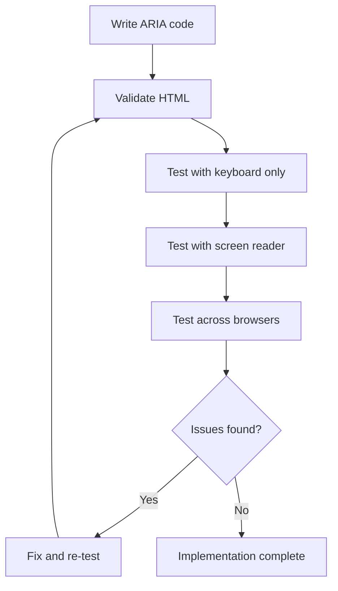

**🚫 Поширені помилки ARIA, яких слід уникати:**

- **Конфліктуюча інформація**: Не суперечте семантиці HTML
- **Надмірне маркування**: Занадто багато інформації ARIA перевантажує користувачів
- **Статична ARIA**: Забування оновлювати стани ARIA при зміні контенту
- **Неперевірені впровадження**: ARIA, яка працює теоретично, але не працює на практиці
- **Відсутність підтримки клавіатури**: Ролі ARIA без відповідних взаємодій клавіатури

> 💡 **Ресурси для тестування**: Використовуйте інструменти, такі як [accessibility-checker](https://www.npmjs.com/package/accessibility-checker) для автоматичної перевірки ARIA, але завжди тестуйте з реальними екранними читачами для повного досвіду.

### 🎭 **Перевірка навичок ARIA: Готові до складних взаємодій?**

**Оцініть свою впевненість у ARIA:**
- Коли ви оберете ARIA замість семантичного HTML? (Підказка: майже ніколи!)
- Чи можете ви пояснити, чому `<div role="button">` зазвичай гірше, ніж `<button>`?
- Що найважливіше пам'ятати про тестування ARIA?

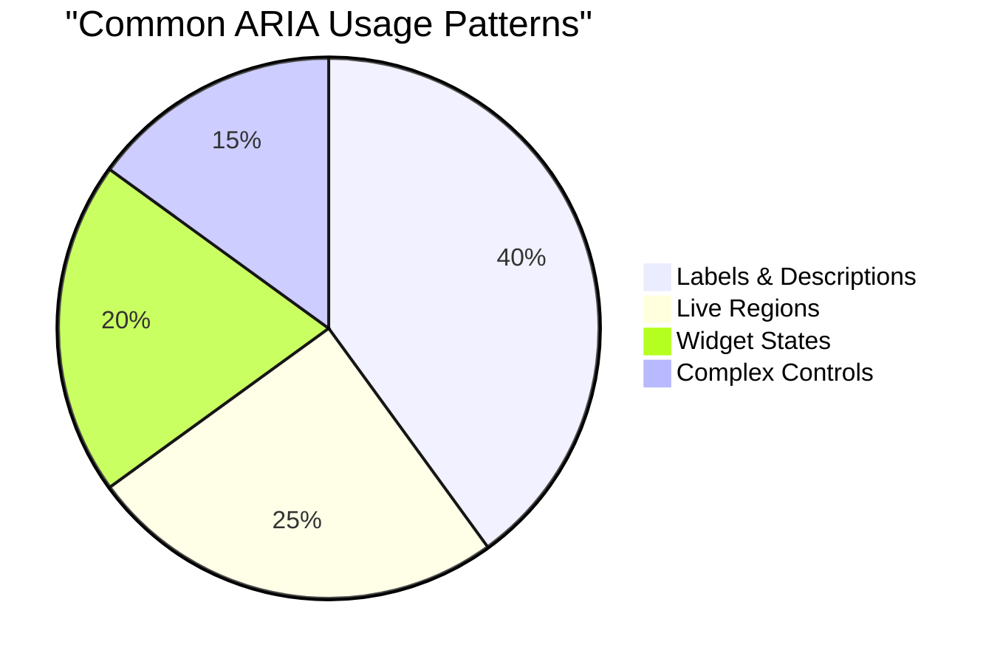

> **Ключове розуміння**: Більшість використання ARIA стосується маркування та опису елементів. Складні шаблони віджетів набагато менш поширені, ніж можна подумати!

✅ **Вчіться у експертів**: Вивчайте [ARIA Authoring Practices Guide](https://w3c.github.io/aria-practices/) для перевірених шаблонів та впроваджень складних інтерактивних віджетів.

## Доступність зображень та медіа

Візуальний та аудіоконтент є важливими частинами сучасного веб-досвіду, але вони можуть створювати бар'єри, якщо їх не впроваджувати обдумано. Мета полягає в тому, щоб інформація та емоційний вплив вашого медіа досягали кожного користувача. Як тільки ви освоїте це, все стане природним.

Різні типи медіа потребують різних підходів до доступності. Це як кулінарія — ви не будете готувати ніжну рибу так само, як ситний стейк. Розуміння цих відмінностей допомагає вибрати правильне рішення для кожної ситуації.

### Стратегічна доступність зображень

Кожне зображення на вашому веб-сайті має свою мету. Розуміння цієї мети допомагає писати кращий альтернативний текст і створювати більш інклюзивний досвід.

**Чотири типи зображень та їх стратегії alt-тексту:**

**Інформативні зображення** - передають важливу інформацію:
```html

```

**Декоративні зображення** - суто візуальні, без інформаційної цінності:
```html

```

**Функціональні зображення** - слугують кнопками або елементами управління:
```html
<button>
  
</button>
```

**Складні зображення** - графіки, діаграми, інфографіка:
```html

<div id="chart-description">
  <p>Detailed description: Sales data shows a steady increase across all quarters...</p>
</div>
```

### Доступність відео та аудіо

**Вимоги до відео:**
- **Субтитри**: Текстова версія мовленого контенту та звукових ефектів
- **Аудіоописи**: Опис візуальних елементів для незрячих користувачів
- **Транскрипти**: Повна текстова версія всього аудіо- та візуального контенту

```html
<video controls>
  <source src="video.mp4" type="video/mp4">
  <track kind="captions" src="captions.vtt" srclang="en" label="English">
  <track kind="descriptions" src="descriptions.vtt" srclang="en" label="Audio descriptions">
</video>
```

**Вимоги до аудіо:**
- **Транскрипти**: Текстова версія всього мовленого контенту
- **Візуальні індикатори**: Для аудіо-контенту без відео надайте візуальні підказки

### Сучасні техніки роботи із зображеннями

**Використання CSS для декоративних зображень:**
```css
.hero-section {
  background-image: url('decorative-hero.jpg');
  /* Decorative images in CSS don't need alt text */
}
```

**Респонсивні зображення з доступністю:**
```html
<picture>
  <source media="(min-width: 800px)" srcset="large-chart.png">
  <source media="(min-width: 400px)" srcset="medium-chart.png">
  
</picture>
```

✅ **Перевірте доступність зображень**: Використовуйте екранний читач для навігації сторінкою із зображеннями. Чи отримуєте ви достатньо інформації, щоб зрозуміти контент?

## Навігація клавіатурою та управління фокусом

Багато користувачів навігують веб-сайтом виключно за допомогою клавіатури. Це включає людей із моторними обмеженнями, досвідчених користувачів, які вважають клавіатуру швидшою за мишу, і тих, у кого миша перестала працювати. Забезпечення роботи вашого сайту з клавіатурним введенням є важливим і часто робить ваш сайт більш ефективним для всіх.

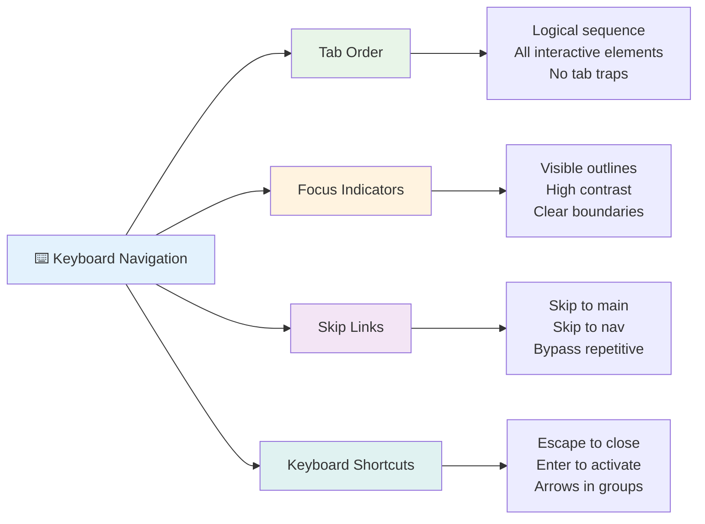

### Основні шаблони навігації клавіатурою

**Стандартні взаємодії клавіатури:**
- **Tab**: Переміщення фокусу вперед через інтерактивні елементи
- **Shift + Tab**: Переміщення фокусу назад
- **Enter**: Активація кнопок і посилань
- **Space**: Активація кнопок, перевірка чекбоксів
- **Стрілки**: Навігація в групах компонентів (радіокнопки, меню)
- **Escape**: Закриття модальних вікон, випадаючих списків або скасування операцій

### Найкращі практики управління фокусом

**Видимі індикатори фокусу:**
```css
/* Ensure focus is always visible */
button:focus-visible {
  outline: 2px solid #4A90A4;
  outline-offset: 2px;
}

/* Custom focus styles for different components */
.card:focus-within {
  box-shadow: 0 0 0 3px rgba(74, 144, 164, 0.5);
}
```

**Пропуск посилань для ефективної навігації:**
```html
<a href="#main-content" class="skip-link">Skip to main content</a>
<a href="#navigation" class="skip-link">Skip to navigation</a>

<nav id="navigation">
  <!-- navigation content -->
</nav>
<main id="main-content">
  <!-- main content -->
</main>
```

**Правильний порядок вкладок:**
```html
<!-- Use semantic HTML for natural tab order -->
<form>
  <label for="name">Name:</label>
  <input type="text" id="name" tabindex="0">
  
  <label for="email">Email:</label>
  <input type="email" id="email" tabindex="0">
  
  <button type="submit" tabindex="0">Submit</button>
</form>
```

### Захоплення фокусу в модальних вікнах

При відкритті модальних діалогів фокус має бути захоплений у межах модального вікна:

```javascript
// Modern focus trap implementation
function trapFocus(element) {
  const focusableElements = element.querySelectorAll(
    'button, [href], input, select, textarea, [tabindex]:not([tabindex="-1"])'
  );
  
  const firstElement = focusableElements[0];
  const lastElement = focusableElements[focusableElements.length - 1];

  element.addEventListener('keydown', (e) => {
    if (e.key === 'Tab') {
      if (e.shiftKey && document.activeElement === firstElement) {
        e.preventDefault();
        lastElement.focus();
      } else if (!e.shiftKey && document.activeElement === lastElement) {
        e.preventDefault();
        firstElement.focus();
      }
    }
    
    if (e.key === 'Escape') {
      closeModal();
    }
  });
  
  // Focus first element when modal opens
  firstElement.focus();
}
```

✅ **Перевірте навігацію клавіатурою**: Спробуйте навігацію вашим веб-сайтом, використовуючи лише клавішу Tab. Чи можете ви досягти всіх інтерактивних елементів? Чи логічний порядок фокусу? Чи чітко видно індикатори фокусу?

## Доступність форм

Форми є критичними для взаємодії користувачів і потребують особливої уваги до доступності.

### Асоціація міток і елементів управління формою

**Кожен елемент управління формою потребує мітки:**
```html
<!-- Explicit labeling (preferred) -->
<label for="username">Username:</label>
<input type="text" id="username" name="username" required>

<!-- Implicit labeling -->
<label>
  Password:
  <input type="password" name="password" required>
</label>

<!-- Using aria-label when visual label isn't desired -->
<input type="search" aria-label="Search products" placeholder="Search...">
```

### Обробка помилок і валідація

**Доступні повідомлення про помилки:**
```html
<label for="email">Email Address:</label>
<input type="email" id="email" name="email" 
       aria-describedby="email-error" 
       aria-invalid="true" required>
<div id="email-error" role="alert">
  Please enter a valid email address
</div>
```

**Найкращі практики валідації форм:**
- Використовуйте `aria-invalid` для позначення недійсних полів
- Надавайте чіткі, конкретні повідомлення про помилки
- Використовуйте `role="alert"` для важливих оголошень про помилки
- Показуйте помилки як негайно, так і при поданні форми

### Поля групування та групування

**Групуйте пов'язані елементи управління формою:**
```html
<fieldset>
  <legend>Shipping Address</legend>
  <label for="street">Street Address:</label>
  <input type="text" id="street" name="street">
  
  <label for="city">City:</label>
  <input type="text" id="city" name="city">
</fieldset>

<fieldset>
  <legend>Preferred Contact Method</legend>
  <input type="radio" id="contact-email" name="contact" value="email">
  <label for="contact-email">Email</label>
  
  <input type="radio" id="contact-phone" name="contact" value="phone">
  <label for="contact-phone">Phone</label>
</fieldset>
```

## Ваш шлях до доступності: ключові висновки

Вітаємо! Ви щойно отримали базові знання для створення справді інклюзивного веб-досвіду. Це досить захоплююче! Доступність вебу — це не просто перевірка відповідності стандартам, це визнання різноманітних способів взаємодії людей із цифровим контентом і проектування для цієї дивовижної складності.

Ви тепер частина зростаючої спільноти розробників, які розуміють, що чудовий дизайн працює для всіх. Ласкаво просимо до клубу!

**🎯 Ваш набір інструментів для доступності тепер включає:**

| Основний принцип | Впровадження | Вплив |
|------------------|--------------|-------|
| **Семантична основа HTML** | Використовуйте правильні HTML-елементи для їх призначення | Екранні читачі можуть ефективно навігувати, клавіатури працюють автоматично |
| **Інклюзивний візуальний дизайн** | Достатній контраст, осмислене використання кольорів, видимі індикатори фокусу | Зрозуміло для всіх за будь-яких умов освітлення |
| **Описовий контент** | Осмислений текст посилань, alt-текст, заголовки | Користувачі розуміють контент без візуального контексту |
| **Доступність клавіатури** | Порядок вкладок, клавіатурні скорочення, управління фокусом | Моторна доступність та ефективність для досвідчених користувачів |
| **Покращення ARIA** | Стратегічне використання для заповнення семантичних прогалин | Складні додатки працюють із допоміжними технологіями |
| **Комплексне тестування** | Автоматизовані інструменти + ручна перевірка + тестування з реальними користувачами | Виявлення проблем до їх впливу на користувачів |

**🚀 Ваші наступні кроки:**

1. **Вбудуйте доступність у свій робочий процес**: Зробіть тестування природною частиною процесу розробки
2. **Вчіться у реальних користувачів**: Шукайте відгуки від людей, які використовують допоміжні технології
3. **Будьте в курсі**: Техніки доступності розвиваються разом із новими технологіями та стандартами
4. **Пропагуйте інклюзивність**: Діліться своїми знаннями та робіть доступність пріоритетом команди

> 💡 **Пам'ятайте**: Обмеження доступності часто призводять до інноваційних, елегантних рішень, які приносять користь усім. Пандуси, субтитри та голосове управління починалися як функції доступності, а стали загальноприйнятими покращеннями.

**Бізнес-аргумент очевидний**: Доступні веб-сайти охоплюють більше користувачів, краще ранжуються в пошукових системах, мають нижчі витрати на обслуговування та уникають юридичних ризиків. Але чесно? Справжня причина піклуватися про доступність набагато глибша. Доступні веб-сайти втілюють найкращі цінності вебу — відкритість, інклюзивність і ідею, що кожен заслуговує на рівний доступ до інформації.

Тепер ви готові створювати інклюзивний веб майбутнього. Кожен доступний сайт, який ви створюєте, робить інтернет більш гостинним місцем для всіх. Це досить дивовижно, якщо подумати!

## Додаткові ресурси

Продовжуйте своє навчання доступності з цими важливими ресурсами:

**📚 Офіційні стандарти та рекомендації:**
- [WCAG 2.1 Guidelines](https://www.w3.org/WAI/WCAG21/quickref/) - Офіційний стандарт доступності з швидким посиланням
- [ARIA Authoring Practices Guide](https://w3c.github.io/aria-practices/) - Комплексні шаблони для інтерактивних віджетів
- [WebAIM Guidelines](https://webaim.org/) - Практичні, дружні для початківців рекомендації щодо доступності

**🛠️ Інструменти та ресурси для тестування:**
- [axe DevTools](https://www.deque.com/axe/devtools/) - Галузевий стандарт тестування доступності
- [A11y Project Checklist](https://www.a11yproject.com/checklist/) - Покрокова перевірка доступності
- [Accessibility Insights](https://accessibilityinsights.io/) - Комплексний набір тестування від Microsoft
- [Color Oracle](https://colororacle.org/) - Симулятор дальтонізму для тестування дизайну

**🎓 Навчання та спільнота:**
- [WebAIM Screen Reader Survey](https://webaim.org/projects/screenreadersurvey9/) - Реальні уподобання та поведінка користувачів
- [Inclusive Components](https://inclusive-components.design/) - Сучасні шаблони доступних компонентів
- [A11y Coffee](https://a11y.coffee/) - Швидкі поради та інсайти щодо доступності
- [Web Accessibility Initiative (WAI)](https://www.w3.org/WAI/) - Комплексні ресурси доступності від W3C

**🎥 Практичне навчання:**
- [Accessibility Developer Guide](https://www.accessibility-developer-guide.com/) - Практичні рекомендації щодо впровадження
- [Deque University](https://dequeuniversity.com/) - Професійні курси з доступності

## Виклик GitHub Copilot Agent 🚀

Використовуйте режим Agent для виконання наступного завдання:

**Опис:** Створіть доступний компонент модального діалогу, який демонструє правильне управління фокусом, атрибути ARIA та шаблони навігації клавіатурою.

**Підказка:** Створіть повний компонент модального діалогу з HTML, CSS та JavaScript, який включає: правильне захоплення фокусу, клавішу ESC для закриття, клік поза межами для закриття, атрибути ARIA для екранних читачів та видимі індикатори фокусу. Модальне вікно має містити форму з правильними мітками та обробкою помилок. Переконайтеся, що компонент відповідає стандартам WCAG 2.1 AA.


## 🚀 Завдання

Візьміть цей HTML і перепишіть його, щоб він був максимально доступним, враховуючи стратегії, які ви вивчили.

```html
<!DOCTYPE html>
<html lang="en">
  <head>
    <meta charset="UTF-8">
    <meta name="viewport" content="width=device-width, initial-scale=1.0">
    <title>Turtle Ipsum - The World's Premier Turtle Fan Club</title>
    <link href='../assets/style.css' rel='stylesheet' type='text/css'>
  </head>
  <body>
    <header class="site-header">
      <h1 class="site-title">Turtle Ipsum</h1>
      <p class="site-subtitle">The World's Premier Turtle Fan Club</p>
    </header>
    
    <nav class="main-nav" aria-label="Main navigation">
      <h2 class="nav-header">Resources</h2>
      <ul class="nav-list">
        <li><a href="https://www.youtube.com/watch?v=CMNry4PE93Y">"I like turtles" video</a></li>
        <li><a href="https://en.wikipedia.org/wiki/Turtle">Basic turtle information</a></li>
        <li><a href="https://en.wikipedia.org/wiki/Turtles_(chocolate)">Chocolate turtles candy</a></li>
      </ul>
    </nav>
    
    <main class="main-content">
      <article>
        <h1>Welcome to Turtle Ipsum</h1>
        <p class="intro">
          <a href="/about">Learn more about our turtle community</a> and discover fascinating facts about these amazing creatures.
        </p>
        <p class="article-text">
          Turtle ipsum dolor sit amet, consectetur adipiscing elit, sed do eiusmod tempor incididunt ut labore et dolore magna aliqua. Ut enim ad minim veniam, quis nostrud exercitation ullamco laboris nisi ut aliquip ex ea commodo consequat. Duis aute irure dolor in reprehenderit in voluptate velit esse cillum dolore eu fugiat nulla pariatur. Excepteur sint occaecat cupidatat non proident, sunt in culpa qui officia deserunt mollit anim id est laborum.
        </p>
      </article>
    </main>
    
    <footer class="footer">
      <section class="newsletter-signup">
        <h2>Stay Updated</h2>
        <button type="button" onclick="showNewsletterForm()">Sign up for turtle news</button>
      </section>
      
      <nav class="footer-nav" aria-label="Footer navigation">
        <h2>Site Pages</h2>
        <ul>
          <li><a href="../">Home</a></li>
          <li><a href="../semantic">Semantic HTML example</a></li>
        </ul>
      </nav>
      
      <p class="footer-copyright">&copy; 2024 Instrument. All rights reserved.</p>
    </footer>
  </body>
</html>
```

**Ключові покращення:**
- Додано правильну семантичну структуру HTML
- Виправлено ієрархію заголовків (один h1, логічна прог
- [ ] Практикуйте навігацію клавіатурою на 5 різних складних вебсайтах  
- [ ] Створіть просту форму з правильними мітками, обробкою помилок та ARIA  
- [ ] Приєднайтеся до спільноти з питань доступності (A11y Slack, форум WebAIM)  
- [ ] Перегляньте, як реальні користувачі з інвалідністю працюють з вебсайтами (на YouTube є чудові приклади)  

### 🌟 **Ваш місячний шлях трансформації**  
- [ ] Інтегруйте тестування доступності у свій робочий процес розробки  
- [ ] Внесіть свій вклад у проєкт з відкритим кодом, виправивши проблеми доступності  
- [ ] Проведіть тестування зручності використання з людиною, яка користується допоміжними технологіями  
- [ ] Створіть бібліотеку доступних компонентів для своєї команди  
- [ ] Пропагуйте доступність у своєму робочому середовищі або спільноті  
- [ ] Станьте наставником для когось, хто тільки починає знайомитися з концепціями доступності  

### 🏆 **Фінальна перевірка чемпіона доступності**  

**Відзначте свій шлях до доступності:**  
- Що вас найбільше здивувало у тому, як люди користуються вебом?  
- Який принцип доступності найбільше відповідає вашому стилю розробки?  
- Як навчання про доступність змінило ваш погляд на дизайн?  
- Яке перше покращення доступності ви хочете реалізувати у реальному проєкті?  

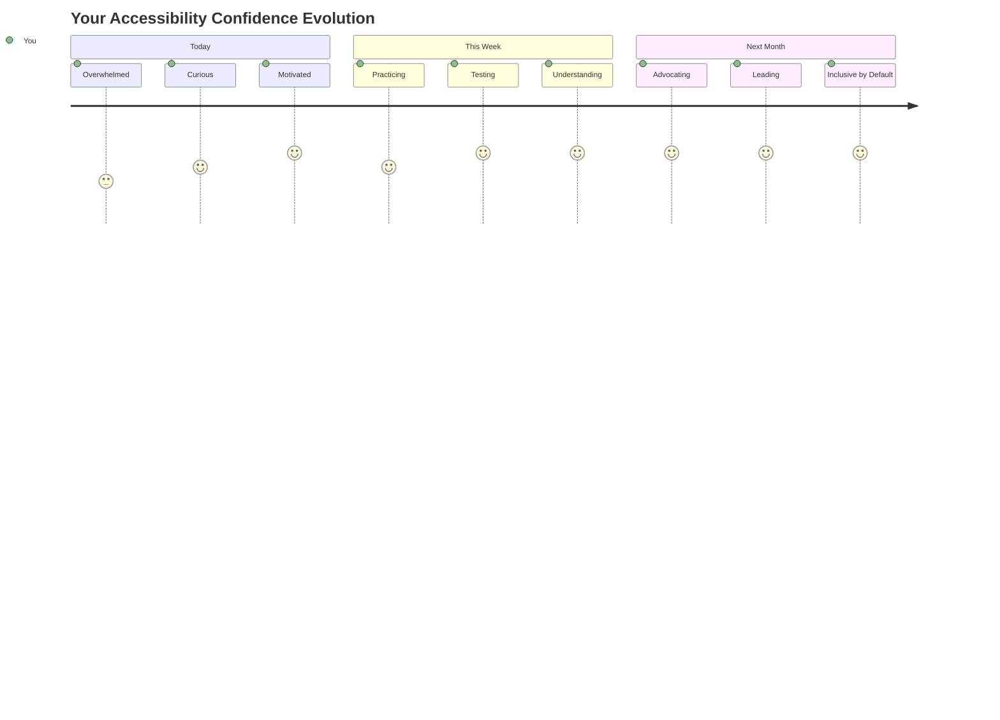
  
> 🌍 **Ви тепер чемпіон доступності!** Ви розумієте, що чудовий вебдосвід має бути доступним для всіх, незалежно від способу доступу до вебу. Кожна функція доступності, яку ви створюєте, робить інтернет більш інклюзивним. Веб потребує розробників, які бачать доступність не як обмеження, а як можливість створювати кращий досвід для всіх користувачів. Ласкаво просимо до руху! 🎉  

---

**Відмова від відповідальності**:  
Цей документ був перекладений за допомогою сервісу автоматичного перекладу [Co-op Translator](https://github.com/Azure/co-op-translator). Хоча ми прагнемо до точності, будь ласка, майте на увазі, що автоматичні переклади можуть містити помилки або неточності. Оригінальний документ на його рідній мові слід вважати авторитетним джерелом. Для критичної інформації рекомендується професійний людський переклад. Ми не несемо відповідальності за будь-які непорозуміння або неправильні тлумачення, що виникають внаслідок використання цього перекладу.