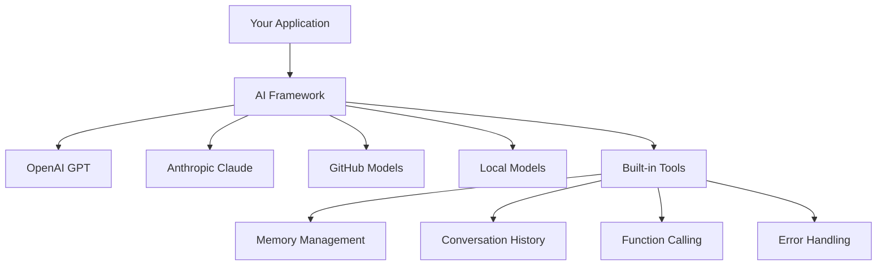
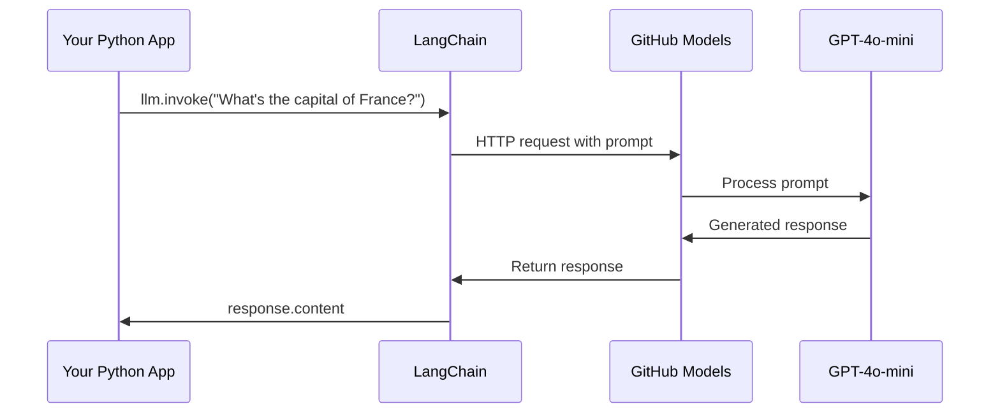
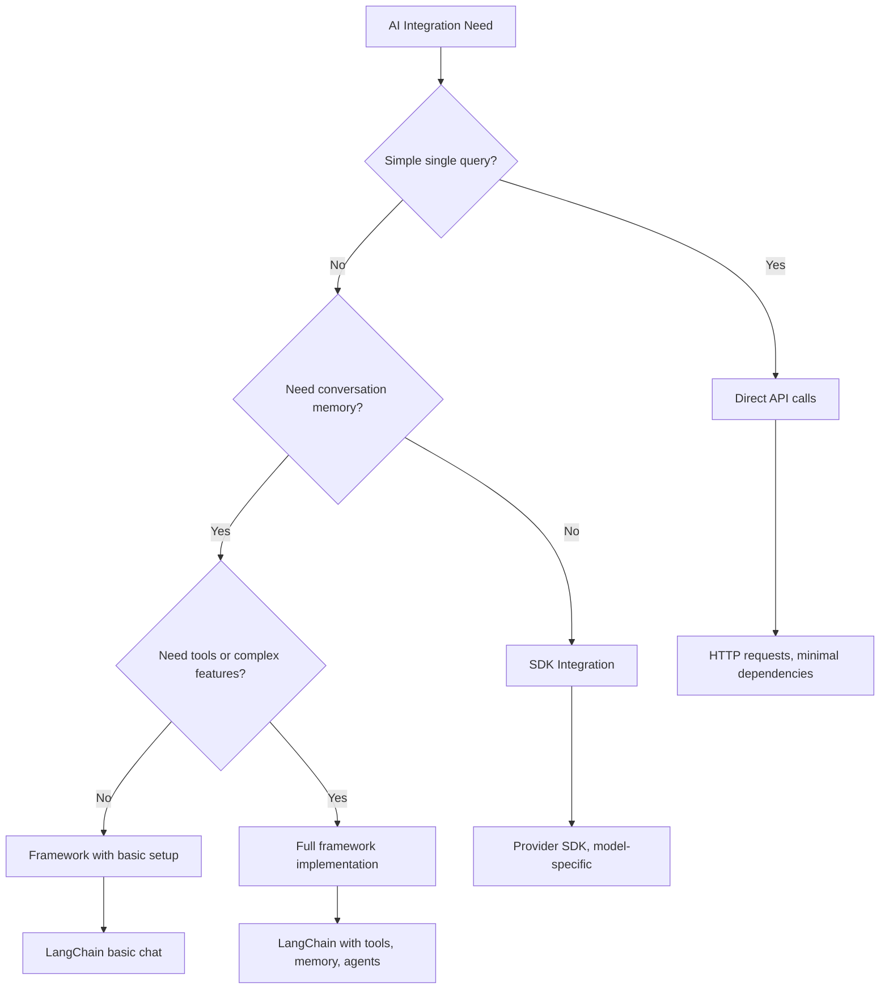

<!--
CO_OP_TRANSLATOR_METADATA:
{
  "original_hash": "e2c4ae5688e34b4b8b09d52aec56c79e",
  "translation_date": "2025-10-24T15:35:11+00:00",
  "source_file": "10-ai-framework-project/README.md",
  "language_code": "uk"
}
-->
# AI Framework

Відчували себе перевантаженими, намагаючись створити AI-додатки з нуля? Ви не самотні! AI-фреймворки — це як швейцарський ніж для розробки штучного інтелекту — потужні інструменти, які можуть заощадити ваш час і позбавити вас головного болю при створенні інтелектуальних додатків. Уявіть AI-фреймворк як добре організовану бібліотеку: він надає готові компоненти, стандартизовані API та розумні абстракції, щоб ви могли зосередитися на вирішенні проблем, а не на деталях реалізації.

У цьому уроці ми розглянемо, як фреймворки, такі як LangChain, можуть перетворити складні завдання інтеграції AI у чистий, зрозумілий код. Ви дізнаєтеся, як вирішувати реальні завдання, такі як відстеження розмов, реалізація виклику інструментів і управління різними AI-моделями через єдиний інтерфейс.

До кінця уроку ви будете знати, коли варто використовувати фреймворки замість сирих API-викликів, як ефективно використовувати їх абстракції та як створювати AI-додатки, готові до використання в реальному світі. Давайте дослідимо, що AI-фреймворки можуть зробити для ваших проєктів.

## Чому обрати фреймворк?

Отже, ви готові створити AI-додаток — чудово! Але ось у чому справа: у вас є кілька різних шляхів, якими ви можете піти, і кожен з них має свої плюси і мінуси. Це схоже на вибір між ходьбою, їздою на велосипеді чи автомобілі, щоб дістатися до місця призначення — всі вони приведуть вас туди, але досвід (і зусилля) будуть зовсім різними.

Давайте розглянемо три основні способи інтеграції AI у ваші проєкти:

| Підхід | Переваги | Найкраще для | Міркування |
|--------|----------|--------------|------------|
| **Прямі HTTP-запити** | Повний контроль, без залежностей | Прості запити, вивчення основ | Більш багатослівний код, ручне оброблення помилок |
| **Інтеграція SDK** | Менше шаблонного коду, оптимізація під конкретну модель | Додатки з однією моделлю | Обмежено конкретними провайдерами |
| **AI-фреймворки** | Уніфікований API, вбудовані абстракції | Додатки з кількома моделями, складні робочі процеси | Крива навчання, потенційна надмірна абстракція |

### Переваги фреймворків на практиці



**Чому фреймворки важливі:**
- **Об'єднують** кілька AI-провайдерів через один інтерфейс
- **Автоматично обробляють** пам'ять розмов
- **Надають** готові інструменти для поширених завдань, таких як embeddings і виклик функцій
- **Керують** обробкою помилок і логікою повторних спроб
- **Перетворюють** складні робочі процеси у зрозумілі виклики методів

> 💡 **Порада професіонала**: Використовуйте фреймворки, коли потрібно перемикатися між різними AI-моделями або створювати складні функції, такі як агенти, пам'ять чи виклик інструментів. Залишайтеся з прямими API, коли вивчаєте основи або створюєте прості, сфокусовані додатки.

**Висновок**: Як вибір між спеціалізованими інструментами майстра і повною майстернею, це питання відповідності інструменту завданню. Фреймворки відмінно підходять для складних, багатофункціональних додатків, тоді як прямі API добре працюють для простих випадків використання.

## Вступ

У цьому уроці ми навчимося:

- Використовувати загальний AI-фреймворк.
- Вирішувати поширені проблеми, такі як розмови в чаті, використання інструментів, пам'ять і контекст.
- Використовувати це для створення AI-додатків.

## Ваш перший AI-запит

Давайте почнемо з основ, створивши ваш перший AI-додаток, який надсилає запитання і отримує відповідь. Як Архімед, який відкрив принцип витіснення у своїй ванні, іноді найпростіші спостереження ведуть до найпотужніших інсайтів — і фреймворки роблять ці інсайти доступними.

### Налаштування LangChain з моделями GitHub

Ми будемо використовувати LangChain для підключення до моделей GitHub, що досить круто, оскільки це дає вам безкоштовний доступ до різних AI-моделей. Найкраща частина? Вам потрібно лише кілька простих параметрів конфігурації, щоб почати:

```python
from langchain_openai import ChatOpenAI
import os

llm = ChatOpenAI(
    api_key=os.environ["GITHUB_TOKEN"],
    base_url="https://models.github.ai/inference",
    model="openai/gpt-4o-mini",
)

# Send a simple prompt
response = llm.invoke("What's the capital of France?")
print(response.content)
```

**Давайте розберемо, що тут відбувається:**
- **Створює** клієнт LangChain за допомогою класу `ChatOpenAI` — це ваш шлюз до AI!
- **Налаштовує** підключення до моделей GitHub за допомогою вашого токена автентифікації
- **Вказує**, яку AI-модель використовувати (`gpt-4o-mini`) — уявіть це як вибір вашого AI-помічника
- **Надсилає** ваше запитання за допомогою методу `invoke()` — тут відбувається магія
- **Витягує** і відображає відповідь — і voilà, ви спілкуєтеся з AI!

> 🔧 **Примітка щодо налаштування**: Якщо ви використовуєте GitHub Codespaces, вам пощастило — `GITHUB_TOKEN` вже налаштований для вас! Працюєте локально? Не хвилюйтеся, вам просто потрібно створити персональний токен доступу з правильними дозволами.

**Очікуваний результат:**
```text
The capital of France is Paris.
```



## Створення розмовного AI

Цей перший приклад демонструє основи, але це лише один обмін — ви задаєте запитання, отримуєте відповідь, і на цьому все. У реальних додатках ви хочете, щоб ваш AI запам'ятовував, про що ви говорили, як Ватсон і Холмс будували свої слідчі розмови з часом.

Ось тут LangChain стає особливо корисним. Він надає різні типи повідомлень, які допомагають структурувати розмови і дозволяють надати вашому AI особистість. Ви будете створювати чат-досвід, який зберігає контекст і характер.

### Розуміння типів повідомлень

Уявіть ці типи повідомлень як різні "ролі", які учасники виконують у розмові. LangChain використовує різні класи повідомлень, щоб відстежувати, хто що говорить:

| Тип повідомлення | Призначення | Приклад використання |
|------------------|------------|----------------------|
| `SystemMessage` | Визначає особистість і поведінку AI | "Ви корисний помічник з програмування" |
| `HumanMessage` | Представляє введення користувача | "Поясніть, як працюють функції" |
| `AIMessage` | Зберігає відповіді AI | Попередні відповіді AI у розмові |

### Створення вашої першої розмови

Давайте створимо розмову, де наш AI приймає конкретну роль. Ми зробимо його втіленням капітана Пікара — персонажа, відомого своєю дипломатичною мудрістю і лідерством:

```python
messages = [
    SystemMessage(content="You are Captain Picard of the Starship Enterprise"),
    HumanMessage(content="Tell me about you"),
]
```

**Розбір налаштування цієї розмови:**
- **Встановлює** роль і особистість AI через `SystemMessage`
- **Надає** початковий запит користувача через `HumanMessage`
- **Створює** основу для багатокрокової розмови

Повний код для цього прикладу виглядає так:

```python
from langchain_core.messages import HumanMessage, SystemMessage
from langchain_openai import ChatOpenAI
import os

llm = ChatOpenAI(
    api_key=os.environ["GITHUB_TOKEN"],
    base_url="https://models.github.ai/inference",
    model="openai/gpt-4o-mini",
)

messages = [
    SystemMessage(content="You are Captain Picard of the Starship Enterprise"),
    HumanMessage(content="Tell me about you"),
]


# works
response  = llm.invoke(messages)
print(response.content)
```

Ви повинні побачити результат, схожий на:

```text
I am Captain Jean-Luc Picard, the commanding officer of the USS Enterprise (NCC-1701-D), a starship in the United Federation of Planets. My primary mission is to explore new worlds, seek out new life and new civilizations, and boldly go where no one has gone before. 

I believe in the importance of diplomacy, reason, and the pursuit of knowledge. My crew is diverse and skilled, and we often face challenges that test our resolve, ethics, and ingenuity. Throughout my career, I have encountered numerous species, grappled with complex moral dilemmas, and have consistently sought peaceful solutions to conflicts.

I hold the ideals of the Federation close to my heart, believing in the importance of cooperation, understanding, and respect for all sentient beings. My experiences have shaped my leadership style, and I strive to be a thoughtful and just captain. How may I assist you further?
```

Щоб зберегти безперервність розмови (замість скидання контексту кожного разу), вам потрібно продовжувати додавати відповіді до вашого списку повідомлень. Як усні традиції, які зберігали історії через покоління, цей підхід створює тривалу пам'ять:

```python
from langchain_core.messages import HumanMessage, SystemMessage
from langchain_openai import ChatOpenAI
import os

llm = ChatOpenAI(
    api_key=os.environ["GITHUB_TOKEN"],
    base_url="https://models.github.ai/inference",
    model="openai/gpt-4o-mini",
)

messages = [
    SystemMessage(content="You are Captain Picard of the Starship Enterprise"),
    HumanMessage(content="Tell me about you"),
]


# works
response  = llm.invoke(messages)

print(response.content)

print("---- Next ----")

messages.append(response)
messages.append(HumanMessage(content="Now that I know about you, I'm Chris, can I be in your crew?"))

response  = llm.invoke(messages)

print(response.content)

```

Досить круто, правда? Що тут відбувається, так це те, що ми викликаємо LLM двічі — спочатку лише з нашими початковими двома повідомленнями, а потім з повною історією розмови. Це як якщо б AI дійсно слідкував за нашим чатом!

Коли ви запустите цей код, ви отримаєте другу відповідь, яка звучить приблизно так:

```text
Welcome aboard, Chris! It's always a pleasure to meet those who share a passion for exploration and discovery. While I cannot formally offer you a position on the Enterprise right now, I encourage you to pursue your aspirations. We are always in need of talented individuals with diverse skills and backgrounds. 

If you are interested in space exploration, consider education and training in the sciences, engineering, or diplomacy. The values of curiosity, resilience, and teamwork are crucial in Starfleet. Should you ever find yourself on a starship, remember to uphold the principles of the Federation: peace, understanding, and respect for all beings. Your journey can lead you to remarkable adventures, whether in the stars or on the ground. Engage!
```

Я прийму це як "можливо" ;)

## Стримінг відповідей

Чи помічали ви, як ChatGPT "друкує" свої відповіді в реальному часі? Це стримінг у дії. Як спостерігати за майстерним каліграфом, який працює — бачити, як символи з'являються штрих за штрихом, а не матеріалізуються миттєво — стримінг робить взаємодію більш природною і забезпечує миттєвий зворотний зв'язок.

### Реалізація стримінгу з LangChain

```python
from langchain_openai import ChatOpenAI
import os

llm = ChatOpenAI(
    api_key=os.environ["GITHUB_TOKEN"],
    base_url="https://models.github.ai/inference",
    model="openai/gpt-4o-mini",
    streaming=True
)

# Stream the response
for chunk in llm.stream("Write a short story about a robot learning to code"):
    print(chunk.content, end="", flush=True)
```

**Чому стримінг чудовий:**
- **Показує** контент у процесі створення — більше ніякого незручного очікування!
- **Змушує** користувачів відчувати, що щось дійсно відбувається
- **Відчувається** швидше, навіть якщо технічно це не так
- **Дозволяє** користувачам почати читати, поки AI ще "думає"

> 💡 **Порада щодо користувацького досвіду**: Стримінг особливо добре працює, коли ви маєте справу з довгими відповідями, такими як пояснення коду, творчі тексти або детальні підручники. Ваші користувачі будуть у захваті від того, що бачать прогрес, а не дивляться на порожній екран!

## Шаблони запитів

Шаблони запитів працюють як риторичні структури, які використовувалися в класичній ораторії — подумайте, як Цицерон адаптував свої мовні моделі для різних аудиторій, зберігаючи ту ж переконливу основу. Вони дозволяють створювати багаторазові запити, де ви можете замінювати різні частини інформації, не переписуючи все з нуля. Як тільки ви налаштуєте шаблон, вам просто потрібно заповнити змінні потрібними значеннями.

### Створення багаторазових запитів

```python
from langchain_core.prompts import ChatPromptTemplate

# Define a template for code explanations
template = ChatPromptTemplate.from_messages([
    ("system", "You are an expert programming instructor. Explain concepts clearly with examples."),
    ("human", "Explain {concept} in {language} with a practical example for {skill_level} developers")
])

# Use the template with different values
questions = [
    {"concept": "functions", "language": "JavaScript", "skill_level": "beginner"},
    {"concept": "classes", "language": "Python", "skill_level": "intermediate"},
    {"concept": "async/await", "language": "JavaScript", "skill_level": "advanced"}
]

for question in questions:
    prompt = template.format_messages(**question)
    response = llm.invoke(prompt)
    print(f"Topic: {question['concept']}\n{response.content}\n---\n")
```

**Чому вам сподобається використовувати шаблони:**
- **Зберігає** ваші запити послідовними у всьому додатку
- **Більше ніякого** безладного об'єднання рядків — лише чисті, прості змінні
- **Ваш AI** поводиться передбачувано, тому що структура залишається незмінною
- **Оновлення** стають легкими — змініть шаблон один раз, і він виправлений всюди

## Структурований вихід

Чи відчували ви розчарування, намагаючись розібрати відповіді AI, які повертаються як неструктурований текст? Структурований вихід — це як навчити ваш AI дотримуватися систематичного підходу, який Лінней використовував для біологічної класифікації — організований, передбачуваний і зручний у роботі. Ви можете запитувати JSON, конкретні структури даних або будь-який потрібний формат.

### Визначення схем виходу

```python
from langchain_core.prompts import ChatPromptTemplate
from langchain_core.output_parsers import JsonOutputParser
from pydantic import BaseModel, Field

class CodeReview(BaseModel):
    score: int = Field(description="Code quality score from 1-10")
    strengths: list[str] = Field(description="List of code strengths")
    improvements: list[str] = Field(description="List of suggested improvements")
    overall_feedback: str = Field(description="Summary feedback")

# Set up the parser
parser = JsonOutputParser(pydantic_object=CodeReview)

# Create prompt with format instructions
prompt = ChatPromptTemplate.from_messages([
    ("system", "You are a code reviewer. {format_instructions}"),
    ("human", "Review this code: {code}")
])

# Format the prompt with instructions
chain = prompt | llm | parser

# Get structured response
code_sample = """
def calculate_average(numbers):
    return sum(numbers) / len(numbers)
"""

result = chain.invoke({
    "code": code_sample,
    "format_instructions": parser.get_format_instructions()
})

print(f"Score: {result['score']}")
print(f"Strengths: {', '.join(result['strengths'])}")
```

**Чому структурований вихід змінює правила гри:**
- **Більше ніякого** здогадування, який формат ви отримаєте — він завжди однаковий
- **Легко інтегрується** у ваші бази даних і API без додаткової роботи
- **Виявляє** дивні відповіді AI до того, як вони зламають ваш додаток
- **Робить** ваш код чистішим, тому що ви точно знаєте, з чим працюєте

## Виклик інструментів

Тепер ми досягаємо однієї з найпотужніших функцій: інструменти. Це те, як ви надаєте вашому AI практичні можливості, що виходять за межі розмови. Як середньовічні гільдії розробляли спеціалізовані інструменти для конкретних ремесел, ви можете оснастити ваш AI сфокусованими інструментами. Ви описуєте, які інструменти доступні, і коли хтось запитує щось відповідне, ваш AI може діяти.

### Використання Python

Давайте додамо кілька інструментів таким чином:

```python
from typing_extensions import Annotated, TypedDict

class add(TypedDict):
    """Add two integers."""

    # Annotations must have the type and can optionally include a default value and description (in that order).
    a: Annotated[int, ..., "First integer"]
    b: Annotated[int, ..., "Second integer"]

tools = [add]

functions = {
    "add": lambda a, b: a + b
}
```

Що тут відбувається? Ми створюємо план для інструменту під назвою `add`. Наслідуючи `TypedDict` і використовуючи ці витончені типи `Annotated` для `a` і `b`, ми даємо LLM чітке уявлення про те, що робить цей інструмент і що йому потрібно. Словник `functions` — це як наша скринька інструментів — він говорить нашому коду, що саме робити, коли AI вирішує використовувати конкретний інструмент.

Давайте подивимося, як ми викликаємо LLM з цим інструментом далі:

```python
llm = ChatOpenAI(
    api_key=os.environ["GITHUB_TOKEN"],
    base_url="https://models.github.ai/inference",
    model="openai/gpt-4o-mini",
)

llm_with_tools = llm.bind_tools(tools)
```

Тут ми викликаємо `bind_tools` з нашим масивом `tools`, і таким чином LLM `llm_with_tools` тепер має знання про цей інструмент.

Щоб використовувати цей новий LLM, ми можемо написати наступний код:

```python
query = "What is 3 + 12?"

res = llm_with_tools.invoke(query)
if(res.tool_calls):
    for tool in res.tool_calls:
        print("TOOL CALL: ", functions[tool["name"]](../../../10-ai-framework-project/**tool["args"]))
print("CONTENT: ",res.content)
```

Тепер, коли ми викликаємо `invoke` на цьому новому LLM, який має інструменти, можливо, властивість `tool_calls` буде заповнена. Якщо так, будь-який визначений інструмент має властивості `name` і `args`, які визначають, який інструмент слід викликати і з якими аргументами. Повний код виглядає так:

```python
from langchain_core.messages import HumanMessage, SystemMessage
from langchain_openai import ChatOpenAI
import os
from typing_extensions import Annotated, TypedDict

class add(TypedDict):
    """Add two integers."""

    # Annotations must have the type and can optionally include a default value and description (in that order).
    a: Annotated[int, ..., "First integer"]
    b: Annotated[int, ..., "Second integer"]

tools = [add]

functions = {
    "add": lambda a, b: a + b
}

llm = ChatOpenAI(
    api_key=os.environ["GITHUB_TOKEN"],
    base_url="https://models.github.ai/inference",
    model="openai/gpt-4o-mini",
)

llm_with_tools = llm.bind_tools(tools)

query = "What is 3 + 12?"

res = llm_with_tools.invoke(query)
if(res.tool_calls):
    for tool in res.tool_calls:
        print("TOOL CALL: ", functions[tool["name"]](../../../10-ai-framework-project/**tool["args"]))
print("CONTENT: ",res.content)
```

Запустивши цей код, ви повинні побачити результат, схожий на:

```text
TOOL CALL:  15
CONTENT: 
```

AI проаналізував "Що таке 3 + 12" і розпізнав це як завдання для інструменту `add`. Як досвідчений бібліотекар знає, до якого довідника звернутися залежно від типу запитання, він зробив це визначення на основі назви інструменту, опису і специфікацій полів. Результат 15 походить від виконання інструменту через наш словник `functions`:

```python
print("TOOL CALL: ", functions[tool["name"]](../../../10-ai-framework-project/**tool["args"]))
```

### Більш цікавий інструмент, який викликає веб-API

Додавання чисел демонструє концепцію, але реальні інструменти зазвичай виконують більш складні операції, такі як виклик веб-API. Давайте розширимо наш приклад, щоб AI міг отримувати контент з інтернету — схоже на те, як телеграфні оператори колись з'єднували віддалені місця:

```python
class joke(TypedDict):
    """Tell a joke."""

    # Annotations must have the type and can optionally include a default value and description (in that order).
    category: Annotated[str, ..., "The joke category"]

def get_joke(category: str) -> str:
    response = requests.get(f"https://api.chucknorris.io/jokes/random?category={category}", headers={"Accept": "application/json"})
    if response.status_code == 200:
        return response.json().get("value", f"Here's a {category} joke!")
    return f"Here's a {category} joke!"

functions = {
    "add": lambda a, b: a + b,
    "joke": lambda category: get_joke(category)
}

query = "Tell me a joke about animals"

# the rest of the code is the same
```

Тепер, якщо ви запустите цей код, ви отримаєте відповідь, яка звучить приблизно так:

```text
TOOL CALL:  Chuck Norris once rode a nine foot grizzly bear through an automatic car wash, instead of taking a shower.
CONTENT:  
```

Ось код у повному обсязі:

```python
from langchain_openai import ChatOpenAI
import requests
import os
from typing_extensions import Annotated, TypedDict

class add(TypedDict):
    """Add two integers."""

    # Annotations must have the type and can optionally include a default value and description (in that order).
    a: Annotated[int, ..., "First integer"]
    b: Annotated[int, ..., "Second integer"]

class joke(TypedDict):
    """Tell a joke."""

    # Annotations must have the type and can optionally include a default value and description (in that order).
    category: Annotated[str, ..., "The joke category"]

tools = [add, joke]

def get_joke(category: str) -> str:
    response = requests.get(f"https://api.chucknorris.io/jokes/random?category={category}", headers={"Accept": "application/json"})
    if response.status_code == 200:
        return response.json().get("value", f"Here's a {category} joke!")
    return f"Here's a {category} joke!"

functions = {
    "add": lambda a, b: a + b,
    "joke": lambda category: get_joke(category)
}

llm = ChatOpenAI(
    api_key=os.environ["GITHUB_TOKEN"],
    base_url="https://models.github.ai/inference",
    model="openai/gpt-4o-mini",
)

llm_with_tools = llm.bind_tools(tools)

query = "Tell me a joke about animals"

res = llm_with_tools.invoke(query)
if(res.tool_calls):
    for tool in res.tool_calls:
        # print("TOOL CALL: ", tool)
        print("TOOL CALL: ", functions[tool["name"]](../../../10-ai-framework-project/**tool["args"]))
print("CONTENT: ",res.content)
```

## Embeddings і обробка документів

Embeddings представляють одне з найелегантніших рішень у сучасному AI. Уявіть, що ви можете взяти будь-який текст і перетворити його в числові координати, які відображають його значення. Саме це роблять embeddings — вони перетворюють текст у точки в багатовимірному просторі, де схожі концепції групуються разом. Це як мати систему координат для ідей, нагадуючи, як Менделєєв організував періодичну таблицю за атомними властивостями.

### Створення і використ
3. **Персоналізоване навчання**: Використовуйте системні повідомлення для адаптації відповідей до різних рівнів навичок  
4. **Форматування відповідей**: Реалізуйте структурований вихід для питань вікторини  

### Кроки реалізації  

**Крок 1: Налаштуйте середовище**  
```bash
pip install langchain langchain-openai
```
  
**Крок 2: Базова функціональність чату**  
- Створіть клас `StudyAssistant`  
- Реалізуйте пам'ять розмов  
- Додайте конфігурацію особистості для освітньої підтримки  

**Крок 3: Додайте освітні інструменти**  
- **Пояснювач коду**: Розбиває код на зрозумілі частини  
- **Генератор вікторин**: Створює питання про концепції програмування  
- **Трекер прогресу**: Відстежує охоплені теми  

**Крок 4: Розширені функції (опціонально)**  
- Реалізуйте потокові відповіді для покращення користувацького досвіду  
- Додайте завантаження документів для включення навчальних матеріалів  
- Створіть ембеддинги для пошуку контенту на основі схожості  

### Критерії оцінювання  

| Функція | Відмінно (4) | Добре (3) | Задовільно (2) | Потребує роботи (1) |  
|---------|---------------|----------|------------------|----------------|  
| **Потік розмови** | Природні, контекстно-обізнані відповіді | Добре утримання контексту | Базова розмова | Відсутність пам'яті між обмінами |  
| **Інтеграція інструментів** | Багато корисних інструментів працюють бездоганно | 2+ інструменти реалізовані правильно | 1-2 базові інструменти | Інструменти не функціонують |  
| **Якість коду** | Чистий, добре документований, обробка помилок | Хороша структура, деяка документація | Базова функціональність працює | Погана структура, відсутність обробки помилок |  
| **Освітня цінність** | Дійсно корисний для навчання, адаптивний | Хороша підтримка навчання | Базові пояснення | Обмежена освітня користь |  

### Зразок структури коду  

```python
class StudyAssistant:
    def __init__(self, skill_level="beginner"):
        # Initialize LLM, tools, and conversation memory
        pass
    
    def explain_code(self, code, language):
        # Tool: Explain how code works
        pass
    
    def generate_quiz(self, topic, difficulty):
        # Tool: Create practice questions
        pass
    
    def chat(self, user_input):
        # Main conversation interface
        pass

# Example usage
assistant = StudyAssistant(skill_level="intermediate")
response = assistant.chat("Explain how Python functions work")
```
  
**Додаткові виклики:**  
- Додайте можливості голосового вводу/виводу  
- Реалізуйте веб-інтерфейс за допомогою Streamlit або Flask  
- Створіть базу знань з навчальних матеріалів за допомогою ембеддингів  
- Додайте відстеження прогресу та персоналізовані навчальні шляхи  

## Підсумок  

🎉 Ви освоїли основи розробки AI-фреймворків і навчилися створювати складні AI-додатки за допомогою LangChain. Як завершення всебічного навчання, ви отримали значний набір навичок. Давайте переглянемо, що ви досягли.  

### Що ви вивчили  

**Основні концепції фреймворку:**  
- **Переваги фреймворків**: Розуміння, коли обирати фреймворки замість прямого виклику API  
- **Основи LangChain**: Налаштування та конфігурація підключень AI-моделей  
- **Типи повідомлень**: Використання `SystemMessage`, `HumanMessage` та `AIMessage` для структурованих розмов  

**Розширені функції:**  
- **Виклик інструментів**: Створення та інтеграція власних інструментів для розширених можливостей AI  
- **Пам'ять розмови**: Утримання контексту протягом кількох обмінів  
- **Потокові відповіді**: Реалізація доставки відповідей у реальному часі  
- **Шаблони підказок**: Створення багаторазових, динамічних підказок  
- **Структурований вихід**: Забезпечення послідовних, парсованих відповідей AI  
- **Ембеддинги**: Створення семантичного пошуку та обробки документів  

**Практичні застосування:**  
- **Створення повних додатків**: Комбінування кількох функцій у готові до використання додатки  
- **Обробка помилок**: Реалізація надійного управління помилками та перевірки  
- **Інтеграція інструментів**: Створення власних інструментів, які розширюють можливості AI  

### Основні висновки  

> 🎯 **Запам'ятайте**: AI-фреймворки, такі як LangChain, — це ваші найкращі друзі, які приховують складність і пропонують багатофункціональні можливості. Вони ідеальні, коли вам потрібна пам'ять розмови, виклик інструментів або робота з кількома AI-моделями без зайвого клопоту.  

**Рамка прийняття рішень для інтеграції AI:**  


  
### Що робити далі?  

**Почніть створювати прямо зараз:**  
- Використовуйте ці концепції для створення чогось, що вас захоплює!  
- Експериментуйте з різними AI-моделями через LangChain — це як ігровий майданчик для AI-моделей  
- Створюйте інструменти, які вирішують реальні проблеми у вашій роботі чи проектах  

**Готові до наступного рівня?**  
- **AI-агенти**: Створюйте AI-системи, які можуть планувати та виконувати складні завдання самостійно  
- **RAG (Retrieval-Augmented Generation)**: Поєднуйте AI з власними базами знань для суперпотужних додатків  
- **Мультимодальний AI**: Працюйте з текстом, зображеннями та аудіо одночасно — можливості безмежні!  
- **Розгортання у виробництві**: Дізнайтеся, як масштабувати ваші AI-додатки та моніторити їх у реальному світі  

**Приєднуйтесь до спільноти:**  
- Спільнота LangChain чудова для того, щоб залишатися в курсі та вивчати найкращі практики  
- GitHub Models надає доступ до передових можливостей AI — ідеально для експериментів  
- Продовжуйте практикуватися з різними сценаріями використання — кожен проект навчить вас чомусь новому  

Тепер у вас є знання для створення інтелектуальних, розмовних додатків, які можуть допомогти людям вирішувати реальні проблеми. Як ремісники епохи Відродження, які поєднували художнє бачення з технічними навичками, ви тепер можете об'єднати можливості AI з практичним застосуванням. Питання лише в тому: що ви створите? 🚀  

## Виклик GitHub Copilot Agent 🚀  

Використовуйте режим Agent для виконання наступного завдання:  

**Опис:** Створіть вдосконаленого AI-асистента для рецензування коду, який об'єднує кілька функцій LangChain, включаючи виклик інструментів, структурований вихід і пам'ять розмови, щоб надавати всебічний зворотний зв'язок щодо поданого коду.  

**Підказка:** Створіть клас CodeReviewAssistant, який реалізує:  
1. Інструмент для аналізу складності коду та пропозицій щодо покращення  
2. Інструмент для перевірки коду на відповідність найкращим практикам  
3. Структурований вихід за допомогою моделей Pydantic для послідовного формату рецензії  
4. Пам'ять розмови для відстеження сеансів рецензування  
5. Основний інтерфейс чату, який може обробляти подання коду та надавати детальний, практичний зворотний зв'язок  

Асистент повинен вміти рецензувати код на кількох мовах програмування, зберігати контекст протягом кількох подань коду в одному сеансі та надавати як підсумкові оцінки, так і детальні пропозиції щодо покращення.  

Дізнайтеся більше про [режим агентів](https://code.visualstudio.com/blogs/2025/02/24/introducing-copilot-agent-mode) тут.  

---

**Відмова від відповідальності**:  
Цей документ був перекладений за допомогою сервісу автоматичного перекладу [Co-op Translator](https://github.com/Azure/co-op-translator). Хоча ми прагнемо до точності, будь ласка, майте на увазі, що автоматичні переклади можуть містити помилки або неточності. Оригінальний документ на його рідній мові слід вважати авторитетним джерелом. Для критичної інформації рекомендується професійний людський переклад. Ми не несемо відповідальності за будь-які непорозуміння або неправильні тлумачення, що виникають внаслідок використання цього перекладу.