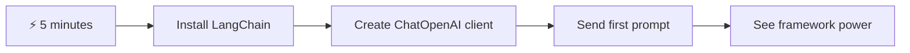
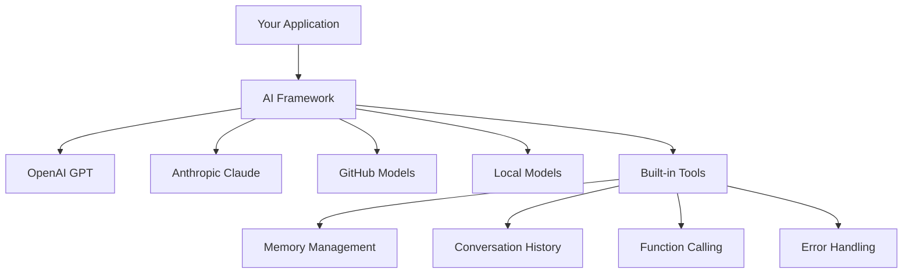
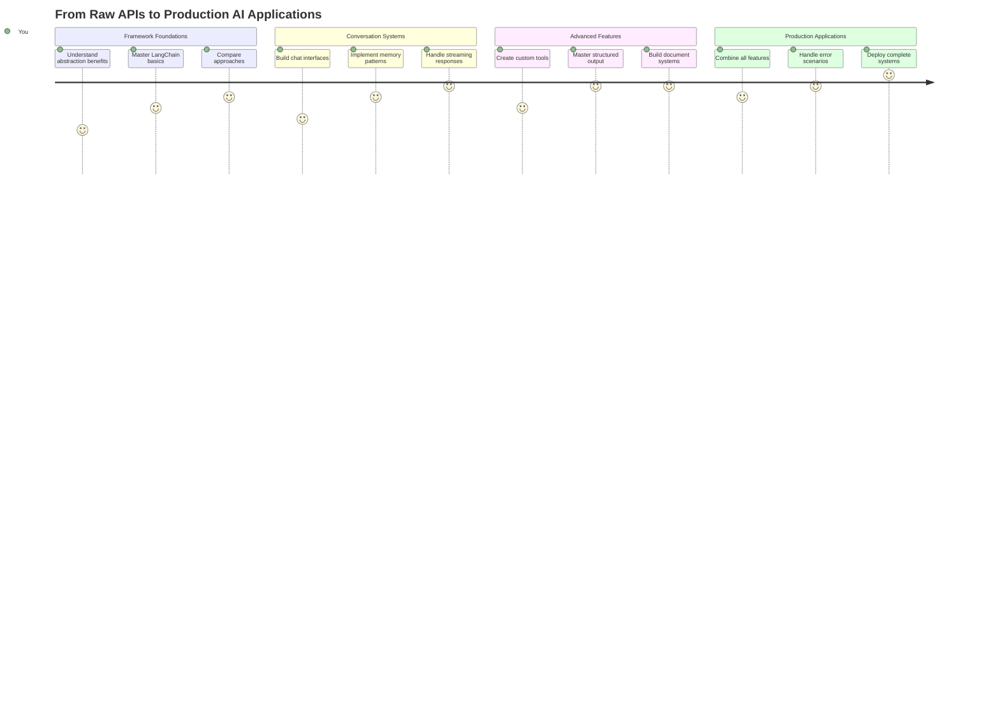
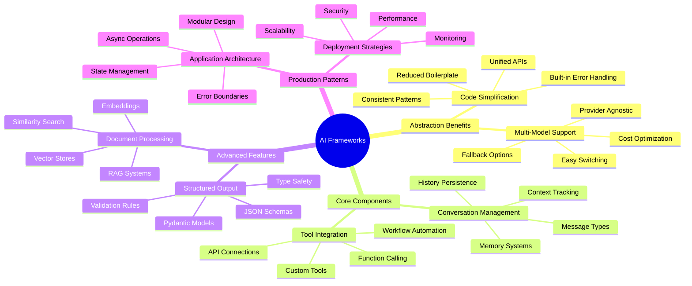
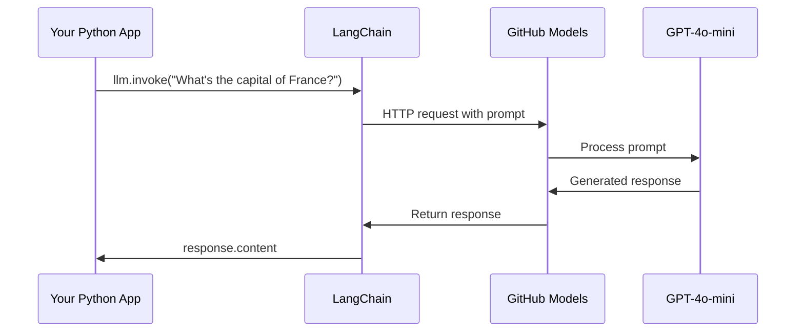
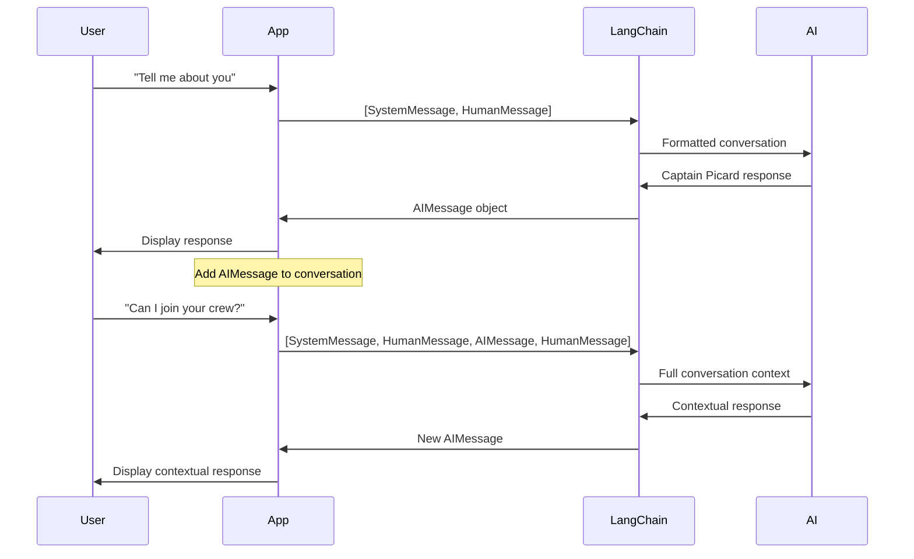
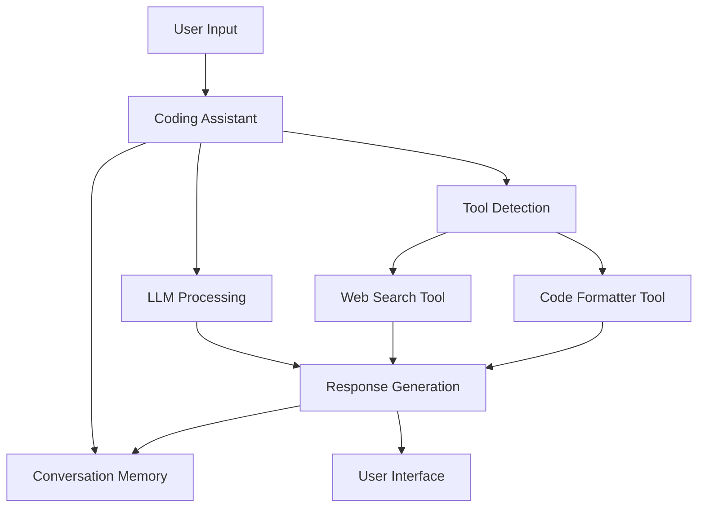
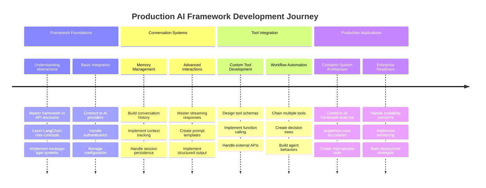
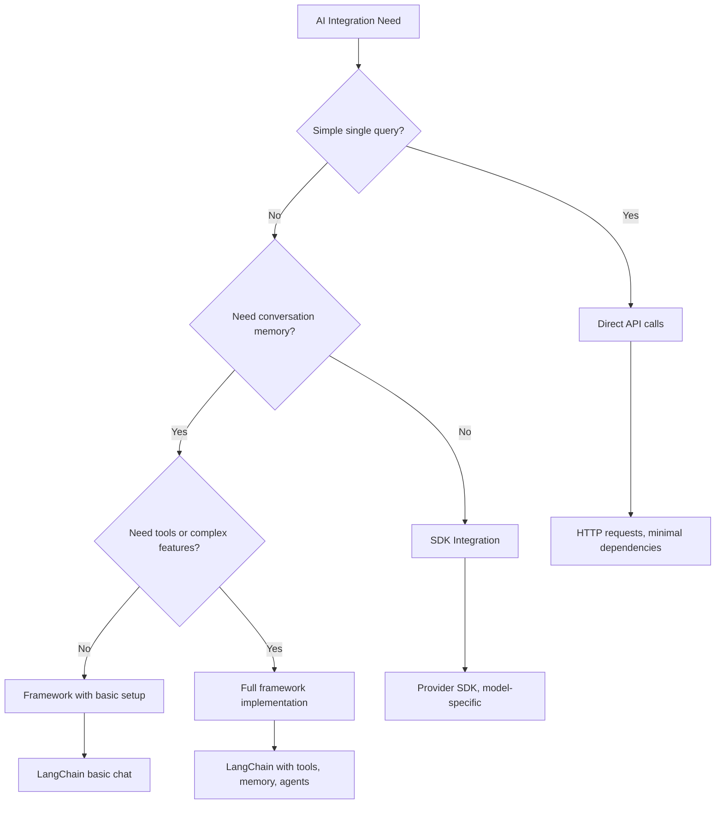

<!--
CO_OP_TRANSLATOR_METADATA:
{
  "original_hash": "3925b6a1c31c60755eaae4d578232c25",
  "translation_date": "2025-11-06T13:28:32+00:00",
  "source_file": "10-ai-framework-project/README.md",
  "language_code": "uk"
}
-->
# AI Framework

Відчували себе перевантаженими, намагаючись створити AI-додатки з нуля? Ви не самотні! AI-фреймворки — це як швейцарський ніж для розробки штучного інтелекту — потужні інструменти, які можуть заощадити ваш час і позбавити вас головного болю при створенні інтелектуальних додатків. Уявіть AI-фреймворк як добре організовану бібліотеку: він надає готові компоненти, стандартизовані API та розумні абстракції, щоб ви могли зосередитися на вирішенні проблем, а не на деталях реалізації.

У цьому уроці ми розглянемо, як фреймворки, такі як LangChain, можуть перетворити складні завдання інтеграції AI у чистий, зрозумілий код. Ви дізнаєтеся, як вирішувати реальні завдання, такі як відстеження розмов, реалізація виклику інструментів і управління різними AI-моделями через єдиний інтерфейс.

До кінця уроку ви будете знати, коли використовувати фреймворки замість сирих API-викликів, як ефективно використовувати їх абстракції та як створювати AI-додатки, готові до використання в реальному світі. Давайте дослідимо, що AI-фреймворки можуть зробити для ваших проєктів.

## ⚡ Що можна зробити за наступні 5 хвилин

**Швидкий старт для зайнятих розробників**



- **1 хвилина**: Встановіть LangChain: `pip install langchain langchain-openai`
- **2 хвилина**: Налаштуйте ваш GitHub токен і імпортуйте клієнт ChatOpenAI
- **3 хвилина**: Створіть просту розмову з системними та людськими повідомленнями
- **4 хвилина**: Додайте базовий інструмент (наприклад, функцію додавання) і побачте виклик AI-інструменту
- **5 хвилина**: Відчуйте різницю між сирими API-викликами та абстракцією фреймворку

**Швидкий тестовий код**:
```python
from langchain_openai import ChatOpenAI
from langchain_core.messages import SystemMessage, HumanMessage

llm = ChatOpenAI(
    api_key=os.environ["GITHUB_TOKEN"],
    base_url="https://models.github.ai/inference",
    model="openai/gpt-4o-mini"
)

response = llm.invoke([
    SystemMessage(content="You are a helpful coding assistant"),
    HumanMessage(content="Explain Python functions briefly")
])
print(response.content)
```

**Чому це важливо**: За 5 хвилин ви відчуєте, як AI-фреймворки перетворюють складну інтеграцію AI у прості виклики методів. Це основа, яка живить AI-додатки для виробництва.

## Чому обирати фреймворк?

Отже, ви готові створити AI-додаток — чудово! Але ось у чому справа: у вас є кілька різних шляхів, якими ви можете піти, і кожен з них має свої плюси та мінуси. Це як вибір між ходьбою, їздою на велосипеді чи автомобілем, щоб дістатися кудись — всі вони приведуть вас до мети, але досвід (і зусилля) будуть зовсім різними.

Давайте розглянемо три основні способи інтеграції AI у ваші проєкти:

| Підхід | Переваги | Найкраще для | Міркування |
|--------|----------|--------------|------------|
| **Прямі HTTP-запити** | Повний контроль, без залежностей | Прості запити, вивчення основ | Більш багатослівний код, ручна обробка помилок |
| **Інтеграція SDK** | Менше шаблонного коду, оптимізація для конкретної моделі | Додатки з однією моделлю | Обмежено конкретними провайдерами |
| **AI-фреймворки** | Уніфікований API, вбудовані абстракції | Додатки з кількома моделями, складні робочі процеси | Крива навчання, потенційна надмірна абстракція |

### Переваги фреймворків на практиці



**Чому фреймворки важливі:**
- **Уніфікують** кілька AI-провайдерів через один інтерфейс
- **Автоматично обробляють** пам'ять розмов
- **Надають** готові інструменти для поширених завдань, таких як вбудовування та виклик функцій
- **Керують** обробкою помилок і логікою повторних спроб
- **Перетворюють** складні робочі процеси у зрозумілі виклики методів

> 💡 **Порада професіонала**: Використовуйте фреймворки, коли потрібно переключатися між різними AI-моделями або створювати складні функції, такі як агенти, пам'ять чи виклик інструментів. Залишайтеся з прямими API, коли вивчаєте основи або створюєте прості, сфокусовані додатки.

**Висновок**: Як вибір між спеціалізованими інструментами майстра і повною майстернею, це питання відповідності інструменту завданню. Фреймворки відмінно підходять для складних, багатофункціональних додатків, тоді як прямі API добре працюють для простих випадків використання.

## 🗺️ Ваш навчальний шлях до майстерності AI-фреймворків



**Мета вашого навчання**: До кінця цього уроку ви опануєте розробку AI-фреймворків і зможете створювати складні, готові до виробництва AI-додатки, які не поступаються комерційним AI-асистентам.

## Вступ

У цьому уроці ми навчимося:

- Використовувати поширений AI-фреймворк.
- Вирішувати поширені проблеми, такі як розмови в чаті, використання інструментів, пам'ять і контекст.
- Використовувати це для створення AI-додатків.

## 🧠 Екосистема розробки AI-фреймворків



**Основний принцип**: AI-фреймворки абстрагують складність, надаючи потужні абстракції для управління розмовами, інтеграції інструментів і обробки документів, дозволяючи розробникам створювати складні AI-додатки з чистим, підтримуваним кодом.

## Ваш перший AI-запит

Давайте почнемо з основ, створивши ваш перший AI-додаток, який надсилає запитання і отримує відповідь. Як Архімед, який відкрив принцип витіснення у своїй ванні, іноді найпростіші спостереження ведуть до найпотужніших відкриттів — і фреймворки роблять ці відкриття доступними.

### Налаштування LangChain з моделями GitHub

Ми будемо використовувати LangChain для підключення до моделей GitHub, що досить круто, оскільки це дає вам безкоштовний доступ до різних AI-моделей. Найкраща частина? Вам потрібно лише кілька простих параметрів конфігурації, щоб почати:

```python
from langchain_openai import ChatOpenAI
import os

llm = ChatOpenAI(
    api_key=os.environ["GITHUB_TOKEN"],
    base_url="https://models.github.ai/inference",
    model="openai/gpt-4o-mini",
)

# Send a simple prompt
response = llm.invoke("What's the capital of France?")
print(response.content)
```

**Давайте розберемо, що тут відбувається:**
- **Створює** клієнт LangChain за допомогою класу `ChatOpenAI` — це ваш шлюз до AI!
- **Налаштовує** з'єднання з моделями GitHub за допомогою вашого токена автентифікації
- **Визначає**, яку AI-модель використовувати (`gpt-4o-mini`) — уявіть це як вибір вашого AI-асистента
- **Надсилає** ваше запитання за допомогою методу `invoke()` — тут відбувається магія
- **Витягує** і відображає відповідь — і voilà, ви спілкуєтеся з AI!

> 🔧 **Примітка щодо налаштування**: Якщо ви використовуєте GitHub Codespaces, вам пощастило — `GITHUB_TOKEN` вже налаштований для вас! Працюєте локально? Не хвилюйтеся, вам просто потрібно створити персональний токен доступу з правильними дозволами.

**Очікуваний результат:**
```text
The capital of France is Paris.
```



## Створення розмовного AI

Цей перший приклад демонструє основи, але це лише один обмін — ви задаєте запитання, отримуєте відповідь, і на цьому все. У реальних додатках ви хочете, щоб ваш AI запам'ятовував, про що ви говорили, як Ватсон і Холмс будували свої слідчі розмови з часом.

Ось де LangChain стає особливо корисним. Він надає різні типи повідомлень, які допомагають структурувати розмови і дозволяють надати вашому AI особистість. Ви будете створювати чат-досвід, який зберігає контекст і характер.

### Розуміння типів повідомлень

Уявіть ці типи повідомлень як різні "ролі", які учасники виконують у розмові. LangChain використовує різні класи повідомлень, щоб відстежувати, хто що говорить:

| Тип повідомлення | Призначення | Приклад використання |
|------------------|-------------|----------------------|
| `SystemMessage` | Визначає особистість і поведінку AI | "Ви корисний асистент з програмування" |
| `HumanMessage` | Представляє введення користувача | "Поясніть, як працюють функції" |
| `AIMessage` | Зберігає відповіді AI | Попередні відповіді AI у розмові |

### Створення вашої першої розмови

Давайте створимо розмову, де наш AI приймає певну роль. Ми зробимо його втіленням капітана Пікара — персонажа, відомого своєю дипломатичною мудрістю та лідерством:

```python
messages = [
    SystemMessage(content="You are Captain Picard of the Starship Enterprise"),
    HumanMessage(content="Tell me about you"),
]
```

**Розбір налаштування цієї розмови:**
- **Встановлює** роль і особистість AI через `SystemMessage`
- **Надає** початковий запит користувача через `HumanMessage`
- **Створює** основу для багатокрокової розмови

Повний код для цього прикладу виглядає так:

```python
from langchain_core.messages import HumanMessage, SystemMessage
from langchain_openai import ChatOpenAI
import os

llm = ChatOpenAI(
    api_key=os.environ["GITHUB_TOKEN"],
    base_url="https://models.github.ai/inference",
    model="openai/gpt-4o-mini",
)

messages = [
    SystemMessage(content="You are Captain Picard of the Starship Enterprise"),
    HumanMessage(content="Tell me about you"),
]


# works
response  = llm.invoke(messages)
print(response.content)
```

Ви повинні побачити результат, схожий на:

```text
I am Captain Jean-Luc Picard, the commanding officer of the USS Enterprise (NCC-1701-D), a starship in the United Federation of Planets. My primary mission is to explore new worlds, seek out new life and new civilizations, and boldly go where no one has gone before. 

I believe in the importance of diplomacy, reason, and the pursuit of knowledge. My crew is diverse and skilled, and we often face challenges that test our resolve, ethics, and ingenuity. Throughout my career, I have encountered numerous species, grappled with complex moral dilemmas, and have consistently sought peaceful solutions to conflicts.

I hold the ideals of the Federation close to my heart, believing in the importance of cooperation, understanding, and respect for all sentient beings. My experiences have shaped my leadership style, and I strive to be a thoughtful and just captain. How may I assist you further?
```

Щоб зберегти безперервність розмови (замість скидання контексту кожного разу), вам потрібно продовжувати додавати відповіді до вашого списку повідомлень. Як усні традиції, які зберігали історії через покоління, цей підхід створює тривалу пам'ять:

```python
from langchain_core.messages import HumanMessage, SystemMessage
from langchain_openai import ChatOpenAI
import os

llm = ChatOpenAI(
    api_key=os.environ["GITHUB_TOKEN"],
    base_url="https://models.github.ai/inference",
    model="openai/gpt-4o-mini",
)

messages = [
    SystemMessage(content="You are Captain Picard of the Starship Enterprise"),
    HumanMessage(content="Tell me about you"),
]


# works
response  = llm.invoke(messages)

print(response.content)

print("---- Next ----")

messages.append(response)
messages.append(HumanMessage(content="Now that I know about you, I'm Chris, can I be in your crew?"))

response  = llm.invoke(messages)

print(response.content)

```

Досить круто, правда? Що тут відбувається, так це те, що ми викликаємо LLM двічі — спочатку лише з нашими початковими двома повідомленнями, а потім з повною історією розмови. Це як якщо б AI дійсно слідкував за нашим чатом!

Коли ви запустите цей код, ви отримаєте другу відповідь, яка звучить приблизно так:

```text
Welcome aboard, Chris! It's always a pleasure to meet those who share a passion for exploration and discovery. While I cannot formally offer you a position on the Enterprise right now, I encourage you to pursue your aspirations. We are always in need of talented individuals with diverse skills and backgrounds. 

If you are interested in space exploration, consider education and training in the sciences, engineering, or diplomacy. The values of curiosity, resilience, and teamwork are crucial in Starfleet. Should you ever find yourself on a starship, remember to uphold the principles of the Federation: peace, understanding, and respect for all beings. Your journey can lead you to remarkable adventures, whether in the stars or on the ground. Engage!
```



Я прийму це як "можливо" ;)

## Потокові відповіді

Помічали, як ChatGPT "друкує" свої відповіді в реальному часі? Це потокова передача в дії. Як спостерігати за майстерним каліграфом, який працює — бачити, як символи з'являються штрих за штрихом, а не матеріалізуються миттєво — потокова передача робить взаємодію більш природною і забезпечує миттєвий зворотний зв'язок.

### Реалізація потокової передачі з LangChain

```python
from langchain_openai import ChatOpenAI
import os

llm = ChatOpenAI(
    api_key=os.environ["GITHUB_TOKEN"],
    base_url="https://models.github.ai/inference",
    model="openai/gpt-4o-mini",
    streaming=True
)

# Stream the response
for chunk in llm.stream("Write a short story about a robot learning to code"):
    print(chunk.content, end="", flush=True)
```

**Чому потокова передача чудова:**
- **Показує** контент у процесі створення — більше ніякого незручного очікування!
- **Створює** відчуття, що щось дійсно відбувається
- **Відчувається** швидше, навіть якщо технічно це не так
- **Дозволяє** користувачам почати читати, поки AI ще "думає"

> 💡 **Порада щодо користувацького досвіду**: Потокова передача особливо корисна, коли ви маєте справу з довгими відповідями, такими як пояснення коду, творчі тексти або детальні підручники. Ваші користувачі будуть у захваті від того, що бачать прогрес, а не дивляться на порожній екран!

### 🎯 Педагогічна перевірка: Переваги абстракції фреймворків

**Зупиніться і подумайте**: Ви щойно відчули силу абстракцій AI-фреймворків. Порівняйте те, що ви дізналися, з сирими API-викликами з попередніх уроків.

**Швидка самооцінка**:
- Чи можете ви пояснити, як LangChain спрощує управління розмовами порівняно з ручним відстеженням повідомлень?
- У чому різниця між методами `invoke()` і `stream()`, і коли ви б використовували кожен з них?
- Як система типів повідомлень фреймворку покращує організацію коду?

**Зв'язок з реальним світом**: Абстракційні шаблони, які ви вивчили (типи повідомлень, потокові інтерфейси, пам'ять розмов), використовуються в кожному великому AI-додатку — від інтерфейсу ChatGPT до допомоги з кодом GitHub Copilot. Ви опановуєте ті самі архітектурні шаблони, які використовують професійні команди розробників AI.

**Питання для виклику**: Як би ви спроєктували абстракцію фреймворку для управління різними провайдерами AI-моделей (OpenAI, Anthropic, Google) через єдиний інтерфейс? Розгляньте переваги та компроміси.

## Шаблони запитів

Шаблони запитів працюють як риторичні структури, які використовувалися в класичній ораторії — подумайте, як Цицерон адаптував свої мовні шаблони для різних аудиторій, зберігаючи ту саму переконливу основу. Вони дозволяють створювати багаторазові запити, де ви можете замінювати різні частини інформації, не переписуючи все з нуля. Як тільки ви налаштуєте шаблон, вам просто потрібно заповнити змінні потрібними значеннями.

### Створення багаторазових запитів

```python
from langchain_core.prompts import ChatPromptTemplate

# Define a template for code explanations
template = ChatPromptTemplate.from_messages([
    ("system", "You are an expert programming instructor. Explain concepts clearly with examples."),
    ("human", "Explain {concept} in {language} with a practical example for {skill_level} developers")
])

# Use the template with different values
questions = [
    {"concept": "functions", "language": "JavaScript", "skill_level": "beginner"},
    {"concept": "classes", "language": "Python", "skill_level": "intermediate"},
    {"concept": "async/await", "language": "JavaScript", "skill_level": "advanced"}
]

for question in questions:
    prompt = template.format_messages(**question)
    response = llm.invoke(prompt)
    print(f"Topic: {question['concept']}\n{response.content}\n---\n")
```

**Чому вам сподобається використовувати шаблони:**
- **Зберігає** ваші запити послідовними у всьому додатку
- **Більше ніякого** безладного об'єднання рядків — лише чисті, прості змінні
- **Ваш AI** поводиться передбачувано, оскільки структура залишається незмінною
- **Оновлення** стають легкими — змініть шаблон один раз, і він виправлений всюди

## Структурований вихід

Чи коли-небудь вас дратувало, що AI-відповіді повертаються як неструктурований текст? Структурований вихід — це як навчити ваш AI дотримуватися систематичного підходу, який Лінней використовував для класифікації біологічних видів — організований, передбачуваний і зручний у роботі. Ви можете запитувати JSON, конкретні структури даних або будь-який потрібний формат.

### Визначення схем виходу

```python
from langchain_core.prompts import ChatPromptTemplate
from langchain_core.output_parsers import JsonOutputParser
from pydantic import BaseModel, Field

class CodeReview(BaseModel):
    score: int = Field(description="Code quality score from 1-10")
    strengths: list[str] = Field(description="List of code strengths")
    improvements: list[str] = Field(description="List of suggested improvements")
    overall_feedback: str = Field(description="Summary feedback")

# Set up the parser
parser = JsonOutputParser(pydantic_object=CodeReview)

# Create prompt with format instructions
prompt = ChatPromptTemplate.from_messages([
    ("system", "You are a code reviewer. {format_instructions}"),
    ("human", "Review this code: {code}")
])

# Format the prompt with instructions
chain = prompt | llm | parser

# Get structured response
code_sample = """
def calculate_average(numbers):
    return sum(numbers) / len(numbers)
"""

result = chain.invoke({
    "code": code_sample,
    "format_instructions": parser.get_format_instructions()
})

print(f"Score: {result['score']}")
print(f"Strengths: {', '.join(result['strengths'])}")
```

**Чому структурований вихід змінює правила гри:**
- **Більше ніякого** здогадування, який формат ви отримаєте — він завжди послідовний
- **Легко інтегрується** у ваші бази даних і API без додаткової роботи
- **Виявляє** дивні AI-відповіді до того, як вони зламають ваш додаток
- **Робить** ваш код чистішим, оскільки ви точно знаєте, з чим працюєте

## Виклик інструментів

Тепер ми досягли однієї з найпотужніших функцій: інструменти. Це те, як ви надаєте вашому AI практичні можливості, що виходять за межі розмови. Як середньовічні гільдії розробляли спеціалізовані інструменти для конкретних ремесел, ви можете оснастити ваш AI сфокусованими інструмент
Додавання чисел демонструє концепцію, але реальні інструменти зазвичай виконують більш складні операції, наприклад, виклики веб-API. Давайте розширимо наш приклад, щоб AI отримував контент з інтернету - схоже на те, як телеграфісти колись з'єднували віддалені місця:

```python
class joke(TypedDict):
    """Tell a joke."""

    # Annotations must have the type and can optionally include a default value and description (in that order).
    category: Annotated[str, ..., "The joke category"]

def get_joke(category: str) -> str:
    response = requests.get(f"https://api.chucknorris.io/jokes/random?category={category}", headers={"Accept": "application/json"})
    if response.status_code == 200:
        return response.json().get("value", f"Here's a {category} joke!")
    return f"Here's a {category} joke!"

functions = {
    "add": lambda a, b: a + b,
    "joke": lambda category: get_joke(category)
}

query = "Tell me a joke about animals"

# the rest of the code is the same
```

Тепер, якщо ви запустите цей код, ви отримаєте відповідь, схожу на:

```text
TOOL CALL:  Chuck Norris once rode a nine foot grizzly bear through an automatic car wash, instead of taking a shower.
CONTENT:  
```

```mermaid
flowchart TD
    A[User Query: "Tell me a joke about animals"] --> B[LangChain Analysis]
    B --> C{Tool Available?}
    C -->|Yes| D[Select joke tool]
    C -->|No| E[Generate direct response]
    
    D --> F[Extract Parameters]
    F --> G[Call joke(category="animals")]
    G --> H[API Request to chucknorris.io]
    H --> I[Return joke content]
    I --> J[Display to user]
    
    E --> K[AI-generated response]
    K --> J
    
    subgraph "Tool Definition Layer"
        L[TypedDict Schema]
        M[Function Implementation]
        N[Parameter Validation]
    end
    
    D --> L
    F --> N
    G --> M
```

Ось код у повному обсязі:

```python
from langchain_openai import ChatOpenAI
import requests
import os
from typing_extensions import Annotated, TypedDict

class add(TypedDict):
    """Add two integers."""

    # Annotations must have the type and can optionally include a default value and description (in that order).
    a: Annotated[int, ..., "First integer"]
    b: Annotated[int, ..., "Second integer"]

class joke(TypedDict):
    """Tell a joke."""

    # Annotations must have the type and can optionally include a default value and description (in that order).
    category: Annotated[str, ..., "The joke category"]

tools = [add, joke]

def get_joke(category: str) -> str:
    response = requests.get(f"https://api.chucknorris.io/jokes/random?category={category}", headers={"Accept": "application/json"})
    if response.status_code == 200:
        return response.json().get("value", f"Here's a {category} joke!")
    return f"Here's a {category} joke!"

functions = {
    "add": lambda a, b: a + b,
    "joke": lambda category: get_joke(category)
}

llm = ChatOpenAI(
    api_key=os.environ["GITHUB_TOKEN"],
    base_url="https://models.github.ai/inference",
    model="openai/gpt-4o-mini",
)

llm_with_tools = llm.bind_tools(tools)

query = "Tell me a joke about animals"

res = llm_with_tools.invoke(query)
if(res.tool_calls):
    for tool in res.tool_calls:
        # print("TOOL CALL: ", tool)
        print("TOOL CALL: ", functions[tool["name"]](../../../10-ai-framework-project/**tool["args"]))
print("CONTENT: ",res.content)
```

## Вбудовування та обробка документів

Вбудовування представляють одне з найелегантніших рішень у сучасному AI. Уявіть, що ви можете взяти будь-який текст і перетворити його в числові координати, які передають його зміст. Саме це роблять вбудовування - вони перетворюють текст у точки в багатовимірному просторі, де схожі концепції групуються разом. Це як система координат для ідей, нагадуючи, як Менделєєв організував періодичну таблицю за атомними властивостями.

### Створення та використання вбудовувань

```python
from langchain_openai import OpenAIEmbeddings
from langchain_community.vectorstores import FAISS
from langchain_community.document_loaders import TextLoader
from langchain.text_splitter import CharacterTextSplitter

# Initialize embeddings
embeddings = OpenAIEmbeddings(
    api_key=os.environ["GITHUB_TOKEN"],
    base_url="https://models.github.ai/inference",
    model="text-embedding-3-small"
)

# Load and split documents
loader = TextLoader("documentation.txt")
documents = loader.load()

text_splitter = CharacterTextSplitter(chunk_size=1000, chunk_overlap=0)
texts = text_splitter.split_documents(documents)

# Create vector store
vectorstore = FAISS.from_documents(texts, embeddings)

# Perform similarity search
query = "How do I handle user authentication?"
similar_docs = vectorstore.similarity_search(query, k=3)

for doc in similar_docs:
    print(f"Relevant content: {doc.page_content[:200]}...")
```

### Завантажувачі документів для різних форматів

```python
from langchain_community.document_loaders import (
    PyPDFLoader,
    CSVLoader,
    JSONLoader,
    WebBaseLoader
)

# Load different document types
pdf_loader = PyPDFLoader("manual.pdf")
csv_loader = CSVLoader("data.csv")
json_loader = JSONLoader("config.json")
web_loader = WebBaseLoader("https://example.com/docs")

# Process all documents
all_documents = []
for loader in [pdf_loader, csv_loader, json_loader, web_loader]:
    docs = loader.load()
    all_documents.extend(docs)
```

**Що можна зробити з вбудовуваннями:**
- **Створити** пошук, який дійсно розуміє, що ви маєте на увазі, а не просто збігає ключові слова
- **Розробити** AI, який може відповідати на запитання про ваші документи
- **Зробити** рекомендаційні системи, які пропонують дійсно релевантний контент
- **Автоматично** організовувати та категоризувати ваш контент

```mermaid
flowchart LR
    A[Documents] --> B[Text Splitter]
    B --> C[Create Embeddings]
    C --> D[Vector Store]
    
    E[User Query] --> F[Query Embedding]
    F --> G[Similarity Search]
    G --> D
    D --> H[Relevant Documents]
    H --> I[AI Response]
    
    subgraph "Vector Space"
        J[Document A: [0.1, 0.8, 0.3...]]
        K[Document B: [0.2, 0.7, 0.4...]]
        L[Query: [0.15, 0.75, 0.35...]]
    end
    
    C --> J
    C --> K
    F --> L
    G --> J
    G --> K
```

## Створення повного AI-додатку

Тепер ми інтегруємо все, що ви дізналися, у комплексний додаток - помічник для програмування, який може відповідати на запитання, використовувати інструменти та зберігати пам'ять розмови. Як друкарський верстат, що об'єднав існуючі технології (рухомий шрифт, чорнило, папір і тиск) у щось трансформативне, ми об'єднаємо наші AI-компоненти у щось практичне та корисне.

### Приклад повного додатку

```python
from langchain_openai import ChatOpenAI, OpenAIEmbeddings
from langchain_core.prompts import ChatPromptTemplate
from langchain_core.messages import HumanMessage, SystemMessage, AIMessage
from langchain_community.vectorstores import FAISS
from typing_extensions import Annotated, TypedDict
import os
import requests

class CodingAssistant:
    def __init__(self):
        self.llm = ChatOpenAI(
            api_key=os.environ["GITHUB_TOKEN"],
            base_url="https://models.github.ai/inference",
            model="openai/gpt-4o-mini"
        )
        
        self.conversation_history = [
            SystemMessage(content="""You are an expert coding assistant. 
            Help users learn programming concepts, debug code, and write better software.
            Use tools when needed and maintain a helpful, encouraging tone.""")
        ]
        
        # Define tools
        self.setup_tools()
    
    def setup_tools(self):
        class web_search(TypedDict):
            """Search for programming documentation or examples."""
            query: Annotated[str, "Search query for programming help"]
        
        class code_formatter(TypedDict):
            """Format and validate code snippets."""
            code: Annotated[str, "Code to format"]
            language: Annotated[str, "Programming language"]
        
        self.tools = [web_search, code_formatter]
        self.llm_with_tools = self.llm.bind_tools(self.tools)
    
    def chat(self, user_input: str):
        # Add user message to conversation
        self.conversation_history.append(HumanMessage(content=user_input))
        
        # Get AI response
        response = self.llm_with_tools.invoke(self.conversation_history)
        
        # Handle tool calls if any
        if response.tool_calls:
            for tool_call in response.tool_calls:
                tool_result = self.execute_tool(tool_call)
                print(f"🔧 Tool used: {tool_call['name']}")
                print(f"📊 Result: {tool_result}")
        
        # Add AI response to conversation
        self.conversation_history.append(response)
        
        return response.content
    
    def execute_tool(self, tool_call):
        tool_name = tool_call['name']
        args = tool_call['args']
        
        if tool_name == 'web_search':
            return f"Found documentation for: {args['query']}"
        elif tool_name == 'code_formatter':
            return f"Formatted {args['language']} code: {args['code'][:50]}..."
        
        return "Tool execution completed"

# Usage example
assistant = CodingAssistant()

print("🤖 Coding Assistant Ready! Type 'quit' to exit.\n")

while True:
    user_input = input("You: ")
    if user_input.lower() == 'quit':
        break
    
    response = assistant.chat(user_input)
    print(f"🤖 Assistant: {response}\n")
```

**Архітектура додатку:**



**Ключові функції, які ми реалізували:**
- **Запам'ятовує** всю вашу розмову для збереження контексту
- **Виконує дії** через виклик інструментів, а не просто розмову
- **Дотримується** передбачуваних шаблонів взаємодії
- **Керує** обробкою помилок і складними робочими процесами автоматично

### 🎯 Педагогічна перевірка: Архітектура AI для виробництва

**Розуміння архітектури**: Ви створили повний AI-додаток, який об'єднує управління розмовами, виклик інструментів і структуровані робочі процеси. Це представляє розробку AI-додатків на рівні виробництва.

**Ключові концепції, які ви освоїли**:
- **Архітектура на основі класів**: Організована, підтримувана структура AI-додатку
- **Інтеграція інструментів**: Кастомізована функціональність, що виходить за межі розмови
- **Управління пам'яттю**: Постійний контекст розмови
- **Обробка помилок**: Надійна поведінка додатку

**Зв'язок з індустрією**: Шаблони архітектури, які ви реалізували (класи розмов, системи інструментів, управління пам'яттю), є тими ж шаблонами, які використовуються в корпоративних AI-додатках, таких як AI-помічник Slack, GitHub Copilot і Microsoft Copilot. Ви створюєте з професійним рівнем архітектурного мислення.

**Питання для роздумів**: Як би ви розширили цей додаток для роботи з кількома користувачами, постійного зберігання або інтеграції з зовнішніми базами даних? Розгляньте виклики масштабованості та управління станом.

## Завдання: Створіть власного AI-помічника для навчання

**Мета**: Створити AI-додаток, який допомагає студентам вивчати концепції програмування, надаючи пояснення, приклади коду та інтерактивні вікторини.

### Вимоги

**Основні функції (обов'язкові):**
1. **Інтерфейс для розмов**: Реалізуйте чат-систему, яка зберігає контекст між кількома запитаннями
2. **Освітні інструменти**: Створіть щонайменше два інструменти для навчання:
   - Інструмент пояснення коду
   - Генератор вікторин з концепцій
3. **Персоналізоване навчання**: Використовуйте системні повідомлення для адаптації відповідей до різних рівнів навичок
4. **Форматування відповідей**: Реалізуйте структурований вихід для запитань вікторини

### Кроки реалізації

**Крок 1: Налаштуйте середовище**
```bash
pip install langchain langchain-openai
```

**Крок 2: Базова функціональність чату**
- Створіть клас `StudyAssistant`
- Реалізуйте пам'ять розмови
- Додайте конфігурацію особистості для освітньої підтримки

**Крок 3: Додайте освітні інструменти**
- **Пояснювач коду**: Розбиває код на зрозумілі частини
- **Генератор вікторин**: Створює запитання про концепції програмування
- **Трекер прогресу**: Відстежує охоплені теми

**Крок 4: Розширені функції (опціонально)**
- Реалізуйте потокові відповіді для кращого користувацького досвіду
- Додайте завантаження документів для включення навчальних матеріалів
- Створіть вбудовування для пошуку контенту на основі схожості

### Критерії оцінювання

| Функція | Відмінно (4) | Добре (3) | Задовільно (2) | Потребує роботи (1) |
|---------|---------------|----------|------------------|----------------|
| **Потік розмови** | Природні, контекстно-усвідомлені відповіді | Хороше збереження контексту | Базова розмова | Немає пам'яті між обмінами |
| **Інтеграція інструментів** | Кілька корисних інструментів працюють бездоганно | 2+ інструменти реалізовані правильно | 1-2 базові інструменти | Інструменти не функціонують |
| **Якість коду** | Чистий, добре документований, обробка помилок | Хороша структура, деяка документація | Базова функціональність працює | Погана структура, відсутність обробки помилок |
| **Освітня цінність** | Дійсно корисний для навчання, адаптивний | Хороша підтримка навчання | Базові пояснення | Обмежена освітня користь |

### Зразок структури коду

```python
class StudyAssistant:
    def __init__(self, skill_level="beginner"):
        # Initialize LLM, tools, and conversation memory
        pass
    
    def explain_code(self, code, language):
        # Tool: Explain how code works
        pass
    
    def generate_quiz(self, topic, difficulty):
        # Tool: Create practice questions
        pass
    
    def chat(self, user_input):
        # Main conversation interface
        pass

# Example usage
assistant = StudyAssistant(skill_level="intermediate")
response = assistant.chat("Explain how Python functions work")
```

**Додаткові виклики:**
- Додайте можливості голосового вводу/виводу
- Реалізуйте веб-інтерфейс за допомогою Streamlit або Flask
- Створіть базу знань з навчальних матеріалів за допомогою вбудовувань
- Додайте відстеження прогресу та персоналізовані навчальні шляхи

## 📈 Ваш таймлайн освоєння розробки AI-фреймворків



**🎓 Етап випуску**: Ви успішно освоїли розробку AI-фреймворків, використовуючи ті ж інструменти та шаблони, які живлять сучасні AI-додатки. Ці навички представляють передовий рівень розробки AI-додатків і готують вас до створення корпоративних інтелектуальних систем.

**🔄 Наступний рівень можливостей**:
- Готовність до вивчення передових архітектур AI (агенти, мультиагентні системи)
- Підготовка до створення систем RAG з векторними базами даних
- Оснащеність для створення мультимодальних AI-додатків
- Закладена основа для масштабування та оптимізації AI-додатків

## Підсумок

🎉 Ви тепер освоїли основи розробки AI-фреймворків і навчилися створювати складні AI-додатки за допомогою LangChain. Як завершення комплексного навчання, ви отримали значний набір навичок. Давайте переглянемо, що ви досягли.

### Що ви вивчили

**Основні концепції фреймворку:**
- **Переваги фреймворків**: Розуміння, коли вибирати фреймворки замість прямого виклику API
- **Основи LangChain**: Налаштування та конфігурація підключень AI-моделей
- **Типи повідомлень**: Використання `SystemMessage`, `HumanMessage` і `AIMessage` для структурованих розмов

**Розширені функції:**
- **Виклик інструментів**: Створення та інтеграція кастомних інструментів для розширених можливостей AI
- **Пам'ять розмови**: Збереження контексту між кількома обмінами
- **Потокові відповіді**: Реалізація доставки відповідей у реальному часі
- **Шаблони підказок**: Створення багаторазових, динамічних підказок
- **Структурований вихід**: Забезпечення послідовних, парсованих відповідей AI
- **Вбудовування**: Створення семантичного пошуку та можливостей обробки документів

**Практичні застосування:**
- **Створення повних додатків**: Об'єднання кількох функцій у готові до виробництва додатки
- **Обробка помилок**: Реалізація надійного управління помилками та валідації
- **Інтеграція інструментів**: Створення кастомних інструментів, які розширюють можливості AI

### Основні висновки

> 🎯 **Запам'ятайте**: AI-фреймворки, такі як LangChain, фактично є вашими найкращими друзями, які приховують складність і пропонують багатофункціональність. Вони ідеальні, коли вам потрібна пам'ять розмов, виклик інструментів або робота з кількома AI-моделями без втрати здорового глузду.

**Рамка прийняття рішень для інтеграції AI:**



### Куди йти далі?

**Почніть створювати прямо зараз:**
- Візьміть ці концепції та створіть щось, що вас захоплює!
- Експериментуйте з різними AI-моделями через LangChain - це як ігровий майданчик AI-моделей
- Створюйте інструменти, які вирішують реальні проблеми, з якими ви стикаєтеся у своїй роботі чи проектах

**Готові до наступного рівня?**
- **AI-агенти**: Створюйте AI-системи, які можуть планувати та виконувати складні завдання самостійно
- **RAG (Генерація з доповненням пошуку)**: Поєднуйте AI з власними базами знань для суперпотужних додатків
- **Мультимодальний AI**: Працюйте з текстом, зображеннями та аудіо разом - можливості безмежні!
- **Розгортання у виробництві**: Дізнайтеся, як масштабувати ваші AI-додатки та моніторити їх у реальному світі

**Приєднуйтесь до спільноти:**
- Спільнота LangChain чудова для того, щоб залишатися в курсі та вивчати найкращі практики
- GitHub Models дає вам доступ до передових можливостей AI - ідеально для експериментів
- Продовжуйте практикуватися з різними варіантами використання - кожен проект навчить вас чомусь новому

Тепер у вас є знання для створення інтелектуальних, розмовних додатків, які можуть допомогти людям вирішувати реальні проблеми. Як ремісники епохи Відродження, які поєднували художнє бачення з технічними навичками, ви тепер можете об'єднати можливості AI з практичним застосуванням. Питання в тому: що ви створите? 🚀

## Виклик GitHub Copilot Agent 🚀

Використовуйте режим Agent, щоб виконати наступний виклик:

**Опис:** Створіть розширеного AI-помічника для рецензування коду, який об'єднує кілька функцій LangChain, включаючи виклик інструментів, структурований вихід і пам'ять розмови, щоб надати комплексний зворотний зв'язок щодо поданого коду.

**Підказка:** Створіть клас CodeReviewAssistant, який реалізує:
1. Інструмент для аналізу складності коду та пропозицій щодо покращення
2. Інструмент для перевірки коду на відповідність найкращим практикам
3. Структурований вихід за допомогою моделей Pydantic для послідовного формату рецензії
4. Пам'ять розмови для відстеження сесій рецензування
5. Основний інтерфейс чату, який може обробляти подання коду та надавати детальний, практичний зворотний зв'язок

Помічник повинен мати можливість рецензувати код на кількох мовах програмування, зберігати контекст між кількома поданнями коду в сесії та надавати як підсумкові оцінки, так і детальні пропозиції щодо покращення.

Дізнайтеся більше про [режим Agent](https://code.visualstudio.com/blogs/2025/02/24/introducing-copilot-agent-mode) тут.

---

**Відмова від відповідальності**:  
Цей документ був перекладений за допомогою сервісу автоматичного перекладу [Co-op Translator](https://github.com/Azure/co-op-translator). Хоча ми прагнемо до точності, будь ласка, майте на увазі, що автоматичні переклади можуть містити помилки або неточності. Оригінальний документ на його рідній мові слід вважати авторитетним джерелом. Для критичної інформації рекомендується професійний людський переклад. Ми не несемо відповідальності за будь-які непорозуміння або неправильні тлумачення, що виникають внаслідок використання цього перекладу.