# Основи JavaScript: Типи даних

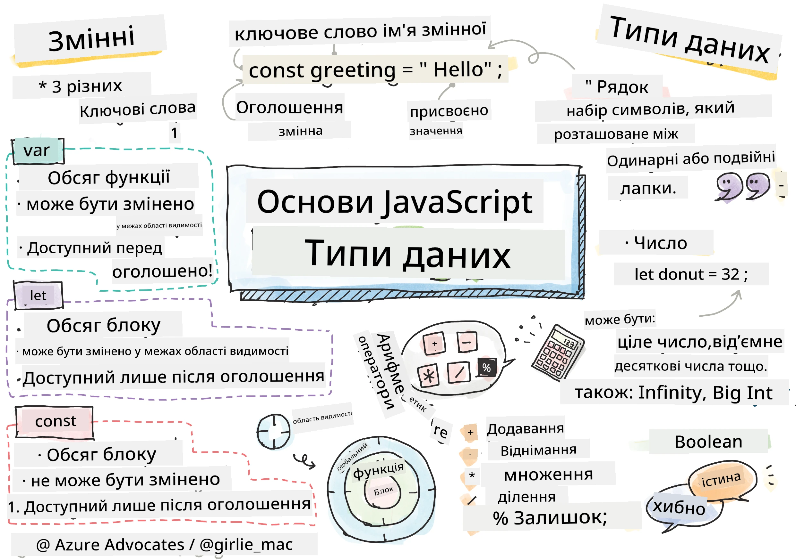
> Скетчноут від [Tomomi Imura](https://twitter.com/girlie_mac)

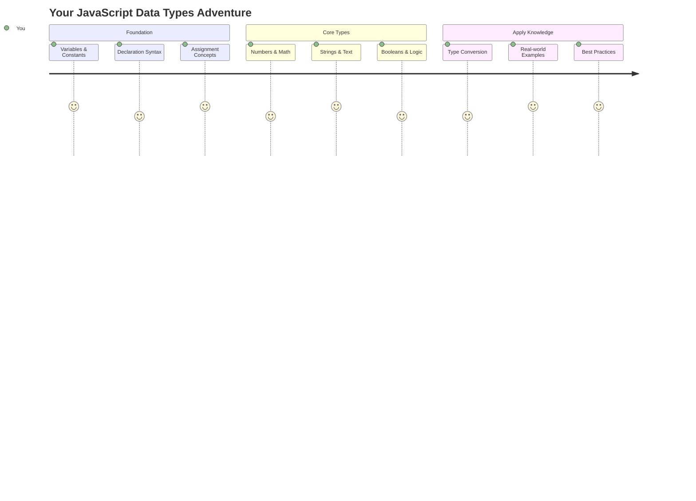

Типи даних — це одна з основних концепцій у JavaScript, з якою ви зіткнетеся в кожній програмі, яку пишете. Уявіть типи даних як систему каталогізації, яку використовували стародавні бібліотекарі в Александрії – вони мали окремі місця для сувоїв з поезією, математикою та історичними записами. JavaScript організовує інформацію схожим чином, розділяючи її на різні категорії для різних типів даних.

У цьому уроці ми розглянемо основні типи даних, які роблять JavaScript таким потужним. Ви навчитеся працювати з числами, текстом, значеннями true/false і зрозумієте, чому вибір правильного типу даних є важливим для ваших програм. Ці концепції можуть здатися абстрактними на початку, але з практикою вони стануть для вас природними.

Розуміння типів даних зробить все інше в JavaScript набагато зрозумілішим. Як архітектори повинні розуміти різні будівельні матеріали перед тим, як будувати собор, ці основи підтримуватимуть усе, що ви створюватимете в майбутньому.

## Тест перед лекцією
[Тест перед лекцією](https://ff-quizzes.netlify.app/web/)

Цей урок охоплює основи JavaScript, мови, яка забезпечує інтерактивність у вебі.

> Ви можете пройти цей урок на [Microsoft Learn](https://docs.microsoft.com/learn/modules/web-development-101-variables/?WT.mc_id=academic-77807-sagibbon)!

[](https://youtube.com/watch?v=JNIXfGiDWM8 "Змінні в JavaScript")

[](https://youtube.com/watch?v=AWfA95eLdq8 "Типи даних у JavaScript")

> 🎥 Натисніть на зображення вище, щоб переглянути відео про змінні та типи даних

Почнемо зі змінних і типів даних, які їх наповнюють!

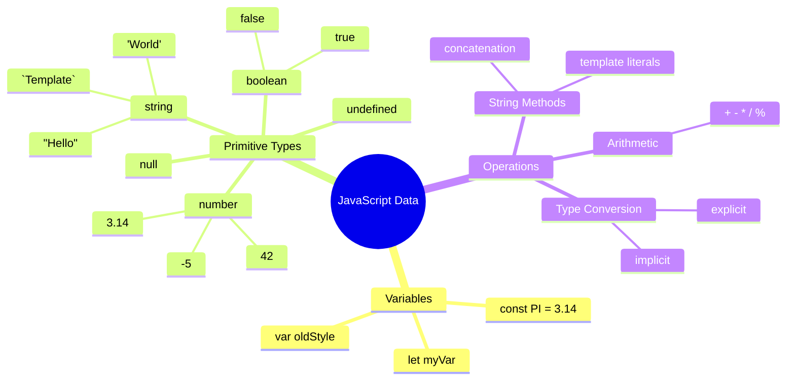

## Змінні

Змінні — це фундаментальні будівельні блоки в програмуванні. Як і підписані банки, які середньовічні алхіміки використовували для зберігання різних речовин, змінні дозволяють зберігати інформацію та давати їй описову назву, щоб ви могли звертатися до неї пізніше. Потрібно запам'ятати чийсь вік? Збережіть його в змінній `age`. Хочете відстежувати ім'я користувача? Збережіть його в змінній `userName`.

Ми зосередимося на сучасному підході до створення змінних у JavaScript. Техніки, які ви тут вивчите, представляють роки еволюції мови та найкращі практики, розроблені програмістами.

Створення та **оголошення** змінної має наступний синтаксис **[ключове слово] [назва]**. Це складається з двох частин:

- **Ключове слово**. Використовуйте `let` для змінних, які можуть змінюватися, або `const` для значень, які залишаються незмінними.
- **Назва змінної**, це описова назва, яку ви вибираєте самі.

✅ Ключове слово `let` було введено в ES6 і надає вашій змінній так звану _блокову область видимості_. Рекомендується використовувати `let` або `const` замість старішого ключового слова `var`. Ми детальніше розглянемо блокові області видимості в наступних частинах.

### Завдання - робота зі змінними

1. **Оголосіть змінну**. Почнемо з створення нашої першої змінної:

    ```javascript
    let myVariable;
    ```

   **Що це робить:**
   - Це говорить JavaScript створити місце для зберігання під назвою `myVariable`
   - JavaScript виділяє місце в пам'яті для цієї змінної
   - Змінна наразі не має значення (undefined)

2. **Присвойте значення**. Тепер давайте помістимо щось у нашу змінну:

    ```javascript
    myVariable = 123;
    ```

   **Як працює присвоєння:**
   - Оператор `=` присвоює значення 123 нашій змінній
   - Змінна тепер містить це значення замість того, щоб бути undefined
   - Ви можете звертатися до цього значення у вашому коді, використовуючи `myVariable`

   > Примітка: використання `=` у цьому уроці означає, що ми використовуємо "оператор присвоєння", який використовується для встановлення значення змінної. Це не позначає рівність.

3. **Зробіть це розумно**. Насправді, давайте об'єднаємо ці два кроки:

    ```javascript
    let myVariable = 123;
    ```

    **Цей підхід більш ефективний:**
    - Ви оголошуєте змінну та присвоюєте значення в одному операторі
    - Це стандартна практика серед розробників
    - Це скорочує довжину коду, зберігаючи його зрозумілість

4. **Змініть свою думку**. Що, якщо ми хочемо зберегти інше число?

   ```javascript
   myVariable = 321;
   ```

   **Розуміння повторного присвоєння:**
   - Змінна тепер містить 321 замість 123
   - Попереднє значення замінено – змінні зберігають лише одне значення за раз
   - Ця змінність є ключовою характеристикою змінних, оголошених за допомогою `let`

   ✅ Спробуйте! Ви можете писати JavaScript прямо у вашому браузері. Відкрийте вікно браузера та перейдіть до Інструментів розробника. У консолі ви знайдете запит; введіть `let myVariable = 123`, натисніть Enter, а потім введіть `myVariable`. Що відбувається? Зверніть увагу, ви дізнаєтеся більше про ці концепції в наступних уроках.

### 🧠 **Перевірка майстерності змінних: освоєння**

**Давайте перевіримо, як ви почуваєтеся щодо змінних:**
- Чи можете ви пояснити різницю між оголошенням і присвоєнням змінної?
- Що станеться, якщо ви спробуєте використати змінну до її оголошення?
- Коли ви оберете `let` замість `const` для змінної?

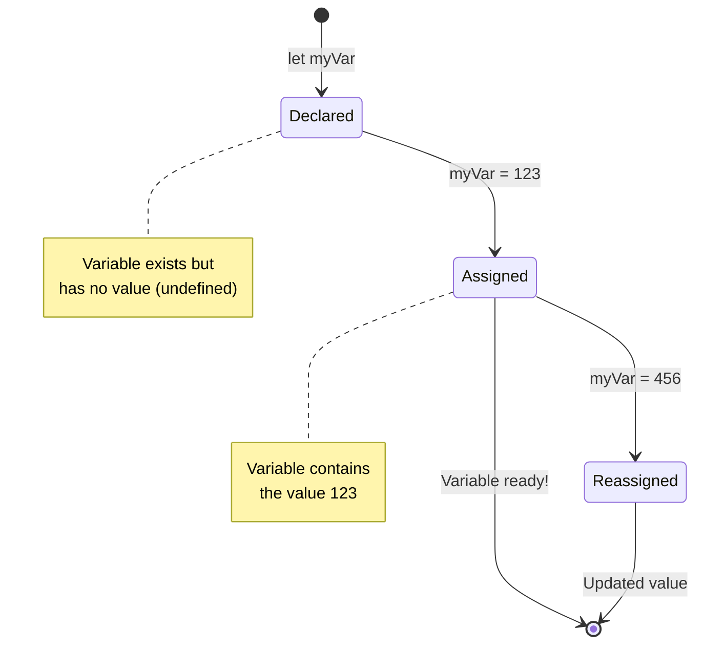

> **Швидка підказка**: Уявіть змінні як підписані коробки для зберігання. Ви створюєте коробку (`let`), кладете щось у неї (`=`), і можете пізніше замінити вміст, якщо потрібно!

## Константи

Іноді вам потрібно зберігати інформацію, яка не повинна змінюватися під час виконання програми. Уявіть константи як математичні принципи, які встановив Евклід у стародавній Греції – після доведення та документування вони залишалися незмінними для всіх майбутніх поколінь.

Константи працюють схожим чином до змінних, але з важливим обмеженням: після присвоєння значення його не можна змінити. Ця незмінність допомагає запобігти випадковим змінам критичних значень у вашій програмі.

Оголошення та ініціалізація константи слідує тим же концепціям, що і змінна, за винятком ключового слова `const`. Константи зазвичай оголошуються великими літерами.

```javascript
const MY_VARIABLE = 123;
```

**Що робить цей код:**
- **Створює** константу під назвою `MY_VARIABLE` зі значенням 123
- **Використовує** конвенцію написання великими літерами для констант
- **Запобігає** будь-яким майбутнім змінам цього значення

Константи мають два основних правила:

- **Ви повинні надати їм значення одразу** – порожні константи не дозволені!
- **Ви ніколи не можете змінити це значення** – JavaScript видасть помилку, якщо ви спробуєте. Давайте подивимося, що я маю на увазі:

   **Просте значення** - Наступне НЕ дозволено:
   
      ```javascript
      const PI = 3;
      PI = 4; // не дозволено
      ```

   **Що потрібно пам'ятати:**
   - **Спроби** повторного присвоєння константи викличуть помилку
   - **Захищає** важливі значення від випадкових змін
   - **Гарантує**, що значення залишатиметься постійним протягом всієї програми
 
   **Посилання на об'єкт захищене** - Наступне НЕ дозволено:
   
      ```javascript
      const obj = { a: 3 };
      obj = { b: 5 } // не дозволено
      ```

   **Розуміння цих концепцій:**
   - **Запобігає** заміні всього об'єкта на новий
   - **Захищає** посилання на оригінальний об'єкт
   - **Зберігає** ідентичність об'єкта в пам'яті

    **Значення об'єкта не захищене** - Наступне дозволено:
    
      ```javascript
      const obj = { a: 3 };
      obj.a = 5;  // дозволено
      ```

      **Розбір того, що тут відбувається:**
      - **Змінює** значення властивості всередині об'єкта
      - **Зберігає** те саме посилання на об'єкт
      - **Демонструє**, що вміст об'єкта може змінюватися, поки посилання залишається постійним

   > Примітка, `const` означає, що посилання захищене від повторного присвоєння. Однак значення не є _незмінним_ і може змінюватися, особливо якщо це складна структура, як-от об'єкт.

## Типи даних

JavaScript організовує інформацію в різні категорії, які називаються типами даних. Ця концепція нагадує, як стародавні вчені класифікували знання – Арістотель розрізняв різні типи мислення, знаючи, що логічні принципи не можна однаково застосовувати до поезії, математики та природної філософії.

Типи даних важливі, тому що різні операції працюють з різними видами інформації. Як ви не можете виконати арифметичні дії над ім'ям людини або алфавітно впорядкувати математичне рівняння, JavaScript вимагає відповідного типу даних для кожної операції. Розуміння цього запобігає помилкам і робить ваш код більш надійним.

Змінні можуть зберігати багато різних типів значень, таких як числа та текст. Ці різні типи значень відомі як **типи даних**. Типи даних є важливою частиною розробки програмного забезпечення, оскільки вони допомагають розробникам приймати рішення про те, як має бути написаний код і як має працювати програмне забезпечення. Крім того, деякі типи даних мають унікальні особливості, які допомагають трансформувати або витягувати додаткову інформацію зі значення.

✅ Типи даних також називаються примітивами даних JavaScript, оскільки вони є найнижчим рівнем типів даних, які надає мова. Існує 7 примітивних типів даних: string, number, bigint, boolean, undefined, null і symbol. Зробіть паузу, щоб уявити, що кожен із цих примітивів може представляти. Що таке `zebra`? А як щодо `0`? `true`?

### Числа

Числа — це найпростіший тип даних у JavaScript. Незалежно від того, працюєте ви з цілими числами, такими як 42, десятковими дробами, такими як 3.14, або від'ємними числами, такими як -5, JavaScript обробляє їх однаково.

Пам'ятаєте нашу змінну з попереднього прикладу? Той 123, який ми зберегли, насправді був числовим типом даних:

```javascript
let myVariable = 123;
```

**Основні характеристики:**
- JavaScript автоматично розпізнає числові значення
- Ви можете виконувати математичні операції з цими змінними
- Не потрібна явна декларація типу

Змінні можуть зберігати всі типи чисел, включаючи десяткові дроби або від'ємні числа. Числа також можуть використовуватися з арифметичними операторами, які розглядаються в [наступному розділі](../../../../2-js-basics/1-data-types).

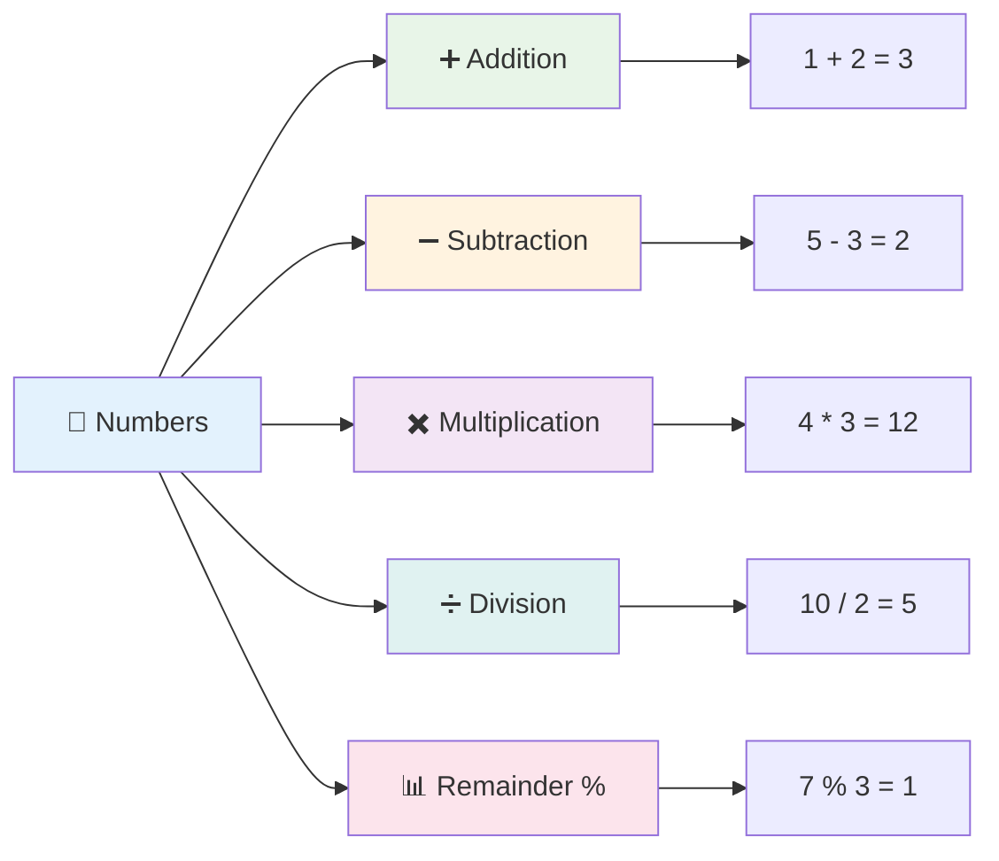

### Арифметичні оператори

Арифметичні оператори дозволяють виконувати математичні обчислення в JavaScript. Ці оператори слідують тим же принципам, які математики використовували століттями – ті ж символи, які з'являлися в роботах таких учених, як Аль-Хорезмі, який розробив алгебраїчну нотацію.

Оператори працюють так, як ви очікуєте від традиційної математики: плюс для додавання, мінус для віднімання тощо.

Існує кілька типів операторів для виконання арифметичних функцій, і деякі з них наведені тут:

| Символ | Опис                                                                   | Приклад                          |
| ------ | ---------------------------------------------------------------------- | -------------------------------- |
| `+`    | **Додавання**: Обчислює суму двох чисел                                | `1 + 2 //очікувана відповідь 3`   |
| `-`    | **Віднімання**: Обчислює різницю двох чисел                            | `1 - 2 //очікувана відповідь -1`  |
| `*`    | **Множення**: Обчислює добуток двох чисел                              | `1 * 2 //очікувана відповідь 2`   |
| `/`    | **Ділення**: Обчислює частку двох чисел                                | `1 / 2 //очікувана відповідь 0.5` |
| `%`    | **Залишок**: Обчислює залишок від ділення двох чисел                   | `1 % 2 //очікувана відповідь 1`   |

✅ Спробуйте! Спробуйте арифметичну операцію в консолі вашого браузера. Чи здивували вас результати?

### 🧮 **Перевірка математичних навичок: впевнені обчислення**

**Перевірте своє розуміння арифметики:**
- У чому різниця між `/` (ділення) і `%` (залишок)?
- Чи можете ви передбачити, чому дорівнює `10 % 3`? (Підказка: це не 3.33...)
- Чому оператор залишку може бути корисним у програмуванні?

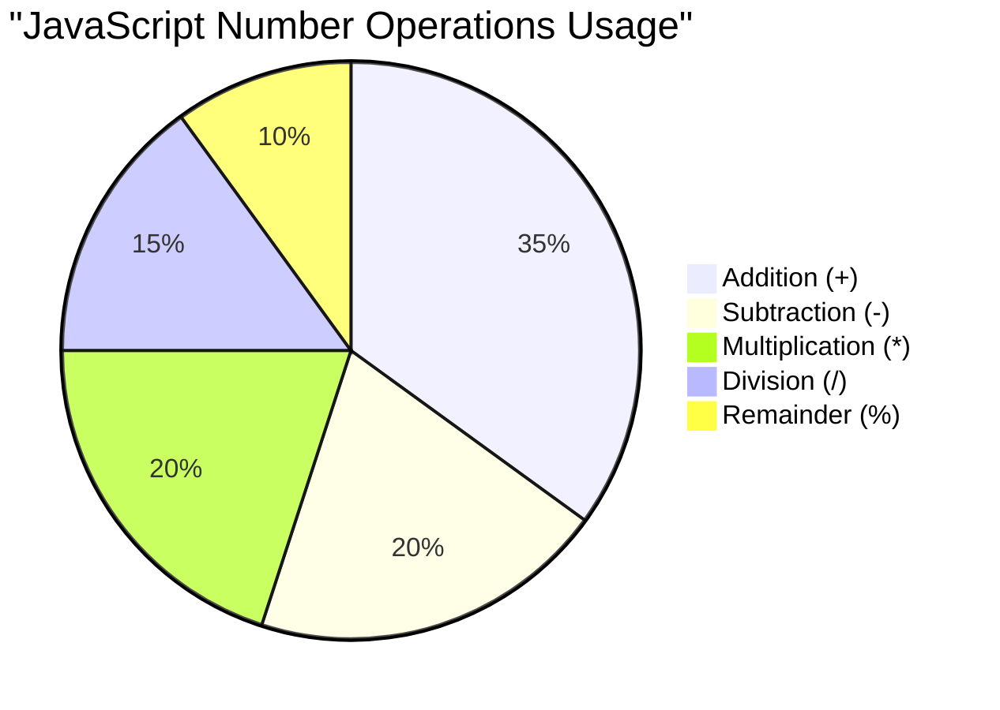

> **Практичне застосування**: Оператор залишку (%) дуже корисний для перевірки, чи числа парні/непарні, створення шаблонів або циклічного проходження масивів!

### Рядки

У JavaScript текстові дані представлені як рядки. Термін "рядок" походить від концепції символів, з'єднаних у послідовність, як літери, які середньовічні писарі з'єднували для створення слів і речень у своїх рукописах.

Рядки є основою веб-розробки. Кожен шматок тексту, який відображається на веб-сайті – імена користувачів, підписи кнопок, повідомлення про помилки, контент – обробляється як дані рядка. Розуміння рядків є важливим для створення функціональних інтерфейсів користувача.

Рядки — це набори символів, які знаходяться між одинарними або подв
Щоб **об'єднати** два або більше рядків, або з'єднати їх разом, використовуйте оператор `+`.

```javascript
let myString1 = "Hello";
let myString2 = "World";

myString1 + myString2 + "!"; //HelloWorld!
myString1 + " " + myString2 + "!"; //Hello World!
myString1 + ", " + myString2 + "!"; //Hello, World!
```

**Крок за кроком, ось що відбувається:**
- **Об'єднує** кілька рядків за допомогою оператора `+`
- **З'єднує** рядки безпосередньо без пробілів у першому прикладі
- **Додає** пробіли `" "` між рядками для зручності читання
- **Вставляє** пунктуацію, наприклад, коми, для правильного форматування

✅ Чому `1 + 1 = 2` у JavaScript, але `'1' + '1' = 11`? Подумайте над цим. А як щодо `'1' + 1`?

**Шаблонні літерали** – це ще один спосіб форматування рядків, але замість лапок використовується зворотний апостроф. Все, що не є простим текстом, має бути поміщене в заповнювачі `${ }`. Це включає будь-які змінні, які можуть бути рядками.

```javascript
let myString1 = "Hello";
let myString2 = "World";

`${myString1} ${myString2}!` //Hello World!
`${myString1}, ${myString2}!` //Hello, World!
```

**Розберемо кожну частину:**
- **Використовує** зворотні апострофи `` ` `` замість звичайних лапок для створення шаблонних літералів
- **Вбудовує** змінні безпосередньо за допомогою синтаксису заповнювача `${}`
- **Зберігає** пробіли та форматування точно так, як написано
- **Забезпечує** зручніший спосіб створення складних рядків зі змінними

Ви можете досягти своїх цілей форматування будь-яким методом, але шаблонні літерали зберігають пробіли та розриви рядків.

✅ Коли ви б використали шаблонний літерал замість звичайного рядка?

### 🔤 **Перевірка майстерності роботи з рядками: впевненість у маніпуляції текстом**

**Оцініть свої навички роботи з рядками:**
- Чи можете ви пояснити, чому `'1' + '1'` дорівнює `'11'`, а не `2`?
- Який метод роботи з рядками ви вважаєте більш зручним: конкатенацію чи шаблонні літерали?
- Що станеться, якщо ви забудете лапки навколо рядка?

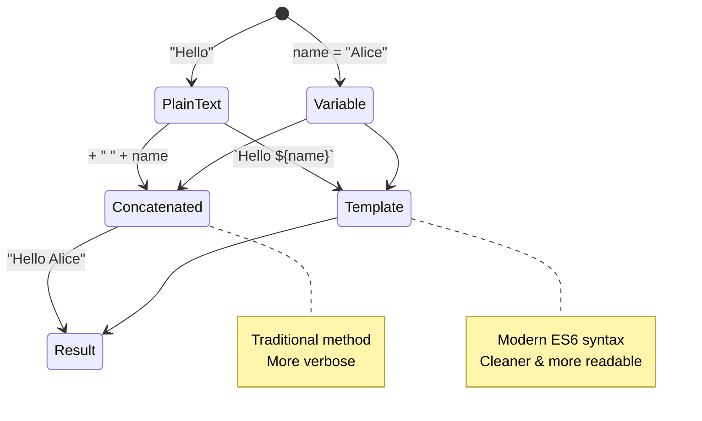

> **Порада**: Шаблонні літерали зазвичай краще підходять для створення складних рядків, оскільки вони більш читабельні та чудово працюють з багаторядковими текстами!

### Булеві значення

Булеві значення представляють найпростіший тип даних: вони можуть мати лише одне з двох значень – `true` або `false`. Ця система двійкової логіки бере свій початок з роботи Джорджа Була, математика XIX століття, який розробив булеву алгебру.

Незважаючи на свою простоту, булеві значення є важливими для логіки програм. Вони дозволяють вашому коду приймати рішення на основі умов – чи користувач увійшов у систему, чи була натиснута кнопка, чи виконані певні критерії.

Булеві значення можуть бути лише двох значень: `true` або `false`. Вони допомагають приймати рішення, які рядки коду повинні виконуватися за певних умов. У багатьох випадках [оператори](../../../../2-js-basics/1-data-types) допомагають встановлювати значення булевих змінних, і ви часто помітите та будете писати змінні, які ініціалізуються або їх значення оновлюється за допомогою оператора.

```javascript
let myTrueBool = true;
let myFalseBool = false;
```

**У наведеному прикладі ми:**
- **Створили** змінну, яка зберігає булеве значення `true`
- **Продемонстрували**, як зберігати булеве значення `false`
- **Використали** точні ключові слова `true` і `false` (без лапок)
- **Підготували** ці змінні для використання в умовних операторах

✅ Змінна може вважатися "істинною", якщо вона оцінюється як булеве значення `true`. Цікаво, що в JavaScript [усі значення є істинними, якщо вони не визначені як хибні](https://developer.mozilla.org/docs/Glossary/Truthy).

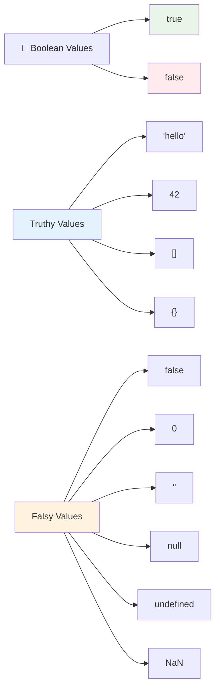

### 🎯 **Перевірка логіки булевих значень: навички прийняття рішень**

**Перевірте своє розуміння булевих значень:**
- Чому, на вашу думку, JavaScript має "істинні" та "хибні" значення, окрім просто `true` і `false`?
- Чи можете ви передбачити, яке з цих значень є хибним: `0`, `"0"`, `[]`, `"false"`?
- Як булеві значення можуть бути корисними для контролю потоку програми?

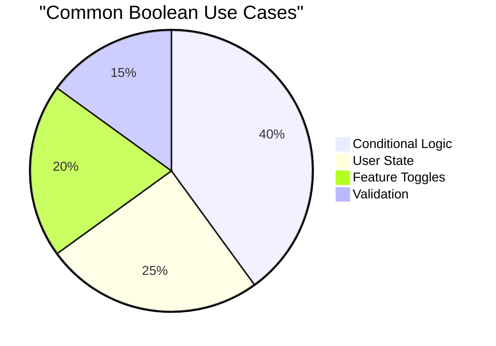

> **Запам'ятайте**: У JavaScript лише 6 значень є хибними: `false`, `0`, `""`, `null`, `undefined` і `NaN`. Усе інше є істинним!

---

## 📊 **Резюме вашого інструментарію типів даних**

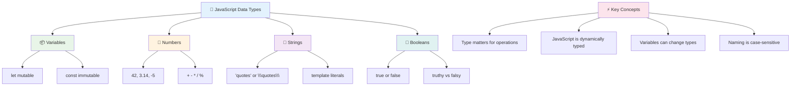

## Виклик GitHub Copilot Agent 🚀

Використовуйте режим Agent, щоб виконати наступний виклик:

**Опис:** Створіть менеджер особистої інформації, який демонструє всі типи даних JavaScript, які ви вивчили на цьому уроці, працюючи з реальними сценаріями даних.

**Завдання:** Напишіть програму на JavaScript, яка створює об'єкт профілю користувача, що містить: ім'я особи (рядок), вік (число), статус студента (булеве значення), улюблені кольори як масив і об'єкт адреси з властивостями вулиці, міста та поштового індексу. Додайте функції для відображення інформації профілю та оновлення окремих полів. Обов'язково продемонструйте конкатенацію рядків, шаблонні літерали, арифметичні операції з віком і булеву логіку для статусу студента.

Дізнайтеся більше про [режим Agent](https://code.visualstudio.com/blogs/2025/02/24/introducing-copilot-agent-mode) тут.

## 🚀 Виклик

JavaScript має деякі поведінкові особливості, які можуть здивувати розробників. Ось класичний приклад для дослідження: спробуйте ввести це в консоль вашого браузера: `let age = 1; let Age = 2; age == Age` і спостерігайте за результатом. Він повертає `false` – чи можете ви визначити, чому?

Це один із багатьох аспектів поведінки JavaScript, які варто зрозуміти. Знання цих особливостей допоможе вам писати більш надійний код і ефективно виправляти помилки.

## Післялекційний тест
[Післялекційний тест](https://ff-quizzes.netlify.app)

## Огляд і самостійне навчання

Перегляньте [цей список вправ з JavaScript](https://css-tricks.com/snippets/javascript/) і спробуйте одну. Що ви дізналися?

## Завдання

[Практика типів даних](assignment.md)

## 🚀 Ваш графік освоєння типів даних JavaScript

### ⚡ **Що ви можете зробити за наступні 5 хвилин**
- [ ] Відкрийте консоль браузера і створіть 3 змінні з різними типами даних
- [ ] Спробуйте виклик: `let age = 1; let Age = 2; age == Age` і зрозумійте, чому це false
- [ ] Попрактикуйте конкатенацію рядків зі своїм ім'ям і улюбленим числом
- [ ] Перевірте, що станеться, якщо додати число до рядка

### 🎯 **Що ви можете досягти за годину**
- [ ] Завершіть тест після уроку та перегляньте будь-які незрозумілі концепції
- [ ] Створіть міні-калькулятор, який додає, віднімає, множить і ділить два числа
- [ ] Побудуйте простий форматувач імен за допомогою шаблонних літералів
- [ ] Досліджуйте різницю між операторами порівняння `==` і `===`
- [ ] Попрактикуйте перетворення між різними типами даних

### 📅 **Ваш тижневий фундамент JavaScript**
- [ ] Завершіть завдання з упевненістю та творчістю
- [ ] Створіть об'єкт особистого профілю, використовуючи всі типи даних, які ви вивчили
- [ ] Практикуйтеся з [вправами JavaScript від CSS-Tricks](https://css-tricks.com/snippets/javascript/)
- [ ] Побудуйте простий валідатор форм, використовуючи булеву логіку
- [ ] Експериментуйте з масивами та об'єктами (попередній перегляд наступних уроків)
- [ ] Приєднайтеся до спільноти JavaScript і задавайте питання про типи даних

### 🌟 **Ваш місячний трансформаційний шлях**
- [ ] Інтегруйте знання про типи даних у більші програмні проекти
- [ ] Зрозумійте, коли і чому використовувати кожен тип даних у реальних додатках
- [ ] Допомагайте іншим новачкам зрозуміти основи JavaScript
- [ ] Створіть невеликий додаток, який управляє різними типами даних користувача
- [ ] Досліджуйте складні концепції типів даних, такі як примусове приведення типів і сувора рівність
- [ ] Внесіть свій вклад у проекти з відкритим кодом JavaScript, покращуючи документацію

### 🧠 **Фінальна перевірка майстерності типів даних**

**Відзначте свої досягнення у JavaScript:**
- Який тип даних здивував вас найбільше своєю поведінкою?
- Наскільки комфортно ви почуваєтеся, пояснюючи змінні та константи другу?
- Що найцікавіше ви дізналися про систему типів JavaScript?
- Який реальний додаток ви можете уявити, використовуючи ці основи?

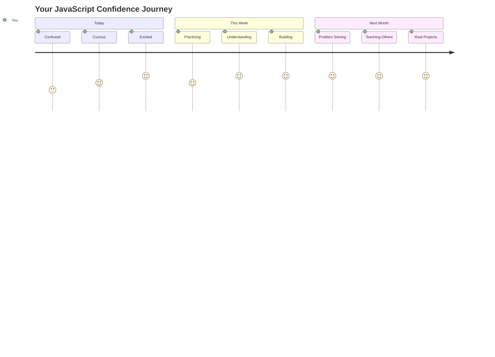

> 💡 **Ви заклали фундамент!** Розуміння типів даних – це як вивчення алфавіту перед написанням історій. Кожна програма на JavaScript, яку ви коли-небудь напишете, буде використовувати ці основні концепції. Тепер у вас є будівельні блоки для створення інтерактивних вебсайтів, динамічних додатків і вирішення реальних проблем за допомогою коду. Ласкаво просимо до чудового світу JavaScript! 🎉

---

**Відмова від відповідальності**:  
Цей документ був перекладений за допомогою сервісу автоматичного перекладу [Co-op Translator](https://github.com/Azure/co-op-translator). Хоча ми прагнемо до точності, будь ласка, майте на увазі, що автоматичні переклади можуть містити помилки або неточності. Оригінальний документ на його рідній мові слід вважати авторитетним джерелом. Для критичної інформації рекомендується професійний людський переклад. Ми не несемо відповідальності за будь-які непорозуміння або неправильні тлумачення, що виникають внаслідок використання цього перекладу.