# Основи JavaScript: Методи та функції

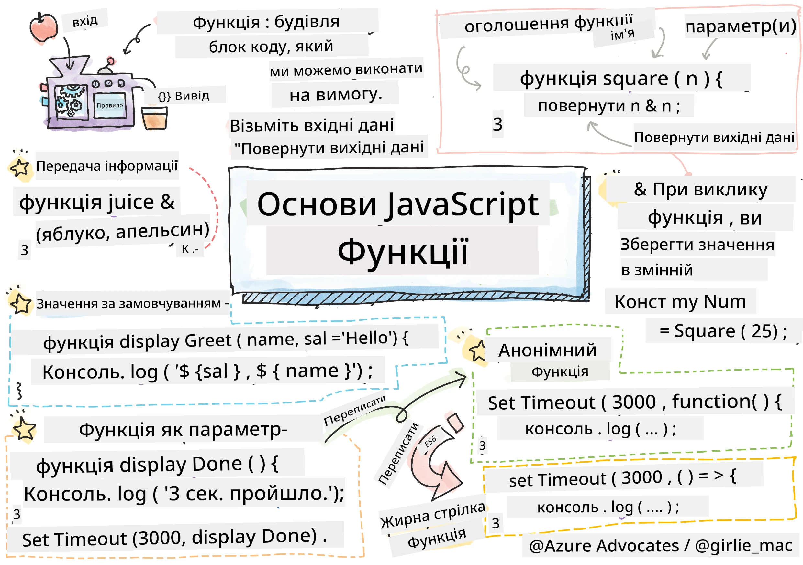
> Скетчноут від [Tomomi Imura](https://twitter.com/girlie_mac)

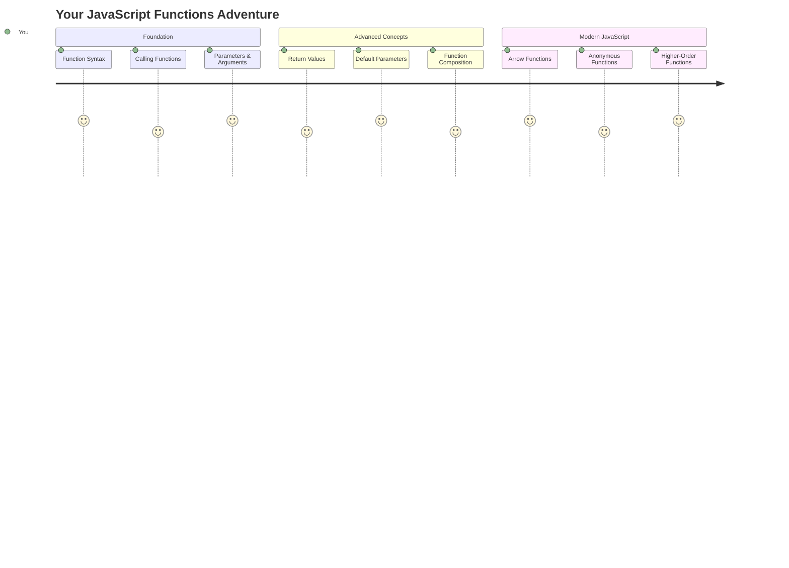

## Тест перед лекцією
[Тест перед лекцією](https://ff-quizzes.netlify.app)

Постійне написання одного й того ж коду є однією з найпоширеніших проблем у програмуванні. Функції вирішують цю проблему, дозволяючи упаковувати код у блоки, які можна використовувати повторно. Уявіть функції як стандартизовані деталі, які зробили революцію на конвеєрі Генрі Форда – створивши надійний компонент, ви можете використовувати його де завгодно, не створюючи заново.

Функції дозволяють об'єднувати частини коду, щоб використовувати їх у різних місцях програми. Замість копіювання та вставки однієї й тієї ж логіки всюди, ви можете створити функцію один раз і викликати її, коли це потрібно. Такий підхід допомагає організувати код і значно спрощує оновлення.

У цьому уроці ви навчитеся створювати власні функції, передавати їм інформацію та отримувати корисні результати. Ви дізнаєтеся різницю між функціями та методами, освоїте сучасні синтаксичні підходи та побачите, як функції можуть взаємодіяти одна з одною. Ми будемо розбирати ці концепції крок за кроком.

[](https://youtube.com/watch?v=XgKsD6Zwvlc "Методи та функції")

> 🎥 Натисніть на зображення вище, щоб переглянути відео про методи та функції.

> Ви можете пройти цей урок на [Microsoft Learn](https://docs.microsoft.com/learn/modules/web-development-101-functions/?WT.mc_id=academic-77807-sagibbon)!

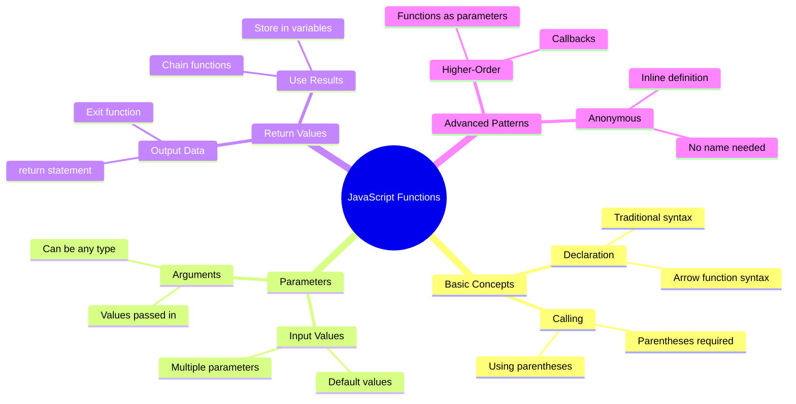

## Функції

Функція – це автономний блок коду, який виконує певне завдання. Вона інкапсулює логіку, яку можна виконати за потреби.

Замість написання одного й того ж коду кілька разів у програмі, ви можете упакувати його у функцію і викликати її, коли це потрібно. Такий підхід допомагає зберігати код чистим і значно спрощує оновлення. Уявіть, як складно було б змінити логіку, розкидану по 20 різних місцях у вашій кодовій базі.

Дуже важливо давати функціям описові назви. Добре названі функції чітко передають своє призначення – коли ви бачите `cancelTimer()`, ви одразу розумієте, що вона робить, так само як чітко позначена кнопка повідомляє, що станеться при її натисканні.

## Створення та виклик функції

Давайте розглянемо, як створити функцію. Синтаксис дотримується послідовного шаблону:

```javascript
function nameOfFunction() { // function definition
 // function definition/body
}
```

Розберемо це:
- Ключове слово `function` повідомляє JavaScript: "Гей, я створюю функцію!"
- `nameOfFunction` – це місце, де ви даєте функції описову назву
- Круглі дужки `()` – це місце, де можна додати параметри (ми скоро до цього дійдемо)
- Фігурні дужки `{}` містять фактичний код, який виконується при виклику функції

Давайте створимо просту функцію привітання, щоб побачити це в дії:

```javascript
function displayGreeting() {
  console.log('Hello, world!');
}
```

Ця функція виводить "Hello, world!" у консоль. Після того, як ви її визначили, ви можете використовувати її стільки разів, скільки потрібно.

Щоб виконати (або "викликати") вашу функцію, напишіть її назву, а потім круглі дужки. JavaScript дозволяє визначати функцію до або після її виклику – двигун JavaScript обробить порядок виконання.

```javascript
// calling our function
displayGreeting();
```

Коли ви запускаєте цей рядок, він виконує весь код всередині вашої функції `displayGreeting`, відображаючи "Hello, world!" у консолі вашого браузера. Ви можете викликати цю функцію повторно.

### 🧠 **Перевірка основ функцій: Створення ваших перших функцій**

**Давайте перевіримо, як ви розумієте основи функцій:**
- Чому ми використовуємо фігурні дужки `{}` у визначеннях функцій?
- Що станеться, якщо написати `displayGreeting` без круглих дужок?
- Чому може знадобитися викликати одну й ту ж функцію кілька разів?

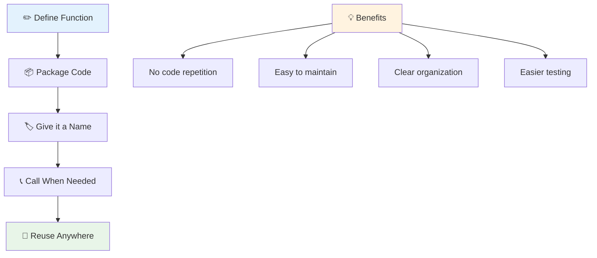

> **Примітка:** Ви використовували **методи** протягом цих уроків. `console.log()` – це метод, тобто функція, яка належить об'єкту `console`. Основна різниця полягає в тому, що методи прив'язані до об'єктів, тоді як функції існують незалежно. Багато розробників використовують ці терміни взаємозамінно в неформальному спілкуванні.

### Найкращі практики для функцій

Ось кілька порад, які допоможуть вам писати якісні функції:

- Давайте функціям чіткі, описові назви – ваш майбутній "я" буде вам вдячний!
- Використовуйте **camelCasing** для назв із кількох слів (наприклад, `calculateTotal` замість `calculate_total`)
- Зосередьте кожну функцію на виконанні одного завдання добре

## Передача інформації у функцію

Наша функція `displayGreeting` обмежена – вона може показувати "Hello, world!" для всіх. Параметри дозволяють зробити функції більш гнучкими та корисними.

**Параметри** діють як заповнювачі, куди можна вставляти різні значення кожного разу, коли ви використовуєте функцію. Таким чином, одна й та ж функція може працювати з різною інформацією при кожному виклику.

Ви перераховуєте параметри всередині круглих дужок при визначенні функції, розділяючи кілька параметрів комами:

```javascript
function name(param, param2, param3) {

}
```

Кожен параметр діє як заповнювач – коли хтось викликає вашу функцію, він надає фактичні значення, які вставляються в ці місця.

Давайте оновимо нашу функцію привітання, щоб вона приймала ім'я людини:

```javascript
function displayGreeting(name) {
  const message = `Hello, ${name}!`;
  console.log(message);
}
```

Зверніть увагу, як ми використовуємо зворотні лапки (`` ` ``) і `${}` для вставки імені безпосередньо в наше повідомлення – це називається шаблонним літералом, і це дуже зручний спосіб створення рядків із змінними.

Тепер, коли ми викликаємо нашу функцію, ми можемо передати будь-яке ім'я:

```javascript
displayGreeting('Christopher');
// displays "Hello, Christopher!" when run
```

JavaScript бере рядок `'Christopher'`, присвоює його параметру `name` і створює персоналізоване повідомлення "Hello, Christopher!"

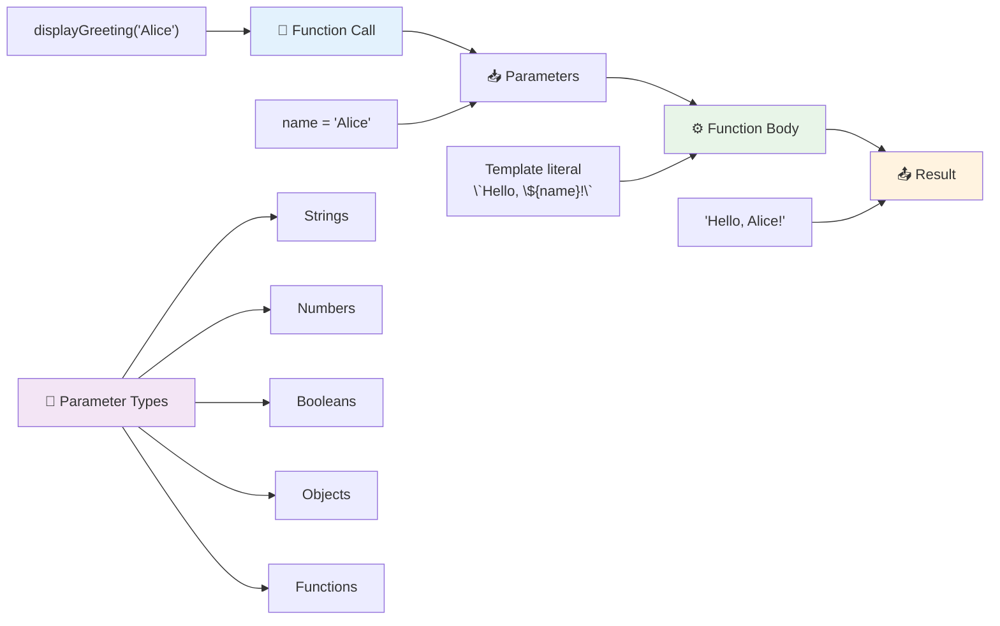

## Значення за замовчуванням

Що, якщо ми хочемо зробити деякі параметри необов'язковими? Тут стають у нагоді значення за замовчуванням!

Наприклад, ми хочемо, щоб люди могли налаштувати слово привітання, але якщо вони не вкажуть його, ми просто використаємо "Hello" як резервне. Ви можете встановити значення за замовчуванням, використовуючи знак рівності, так само як при встановленні змінної:

```javascript
function displayGreeting(name, salutation='Hello') {
  console.log(`${salutation}, ${name}`);
}
```

Тут `name` все ще обов'язковий, але `salutation` має резервне значення `'Hello'`, якщо ніхто не надасть іншого привітання.

Тепер ми можемо викликати цю функцію двома різними способами:

```javascript
displayGreeting('Christopher');
// displays "Hello, Christopher"

displayGreeting('Christopher', 'Hi');
// displays "Hi, Christopher"
```

У першому виклику JavaScript використовує значення за замовчуванням "Hello", оскільки ми не вказали привітання. У другому виклику він використовує наше власне "Hi". Така гнучкість робить функції адаптивними до різних сценаріїв.

### 🎛️ **Перевірка параметрів: Робимо функції гнучкими**

**Перевірте своє розуміння параметрів:**
- У чому різниця між параметром і аргументом?
- Чому значення за замовчуванням корисні в реальному програмуванні?
- Чи можете ви передбачити, що станеться, якщо передати більше аргументів, ніж параметрів?

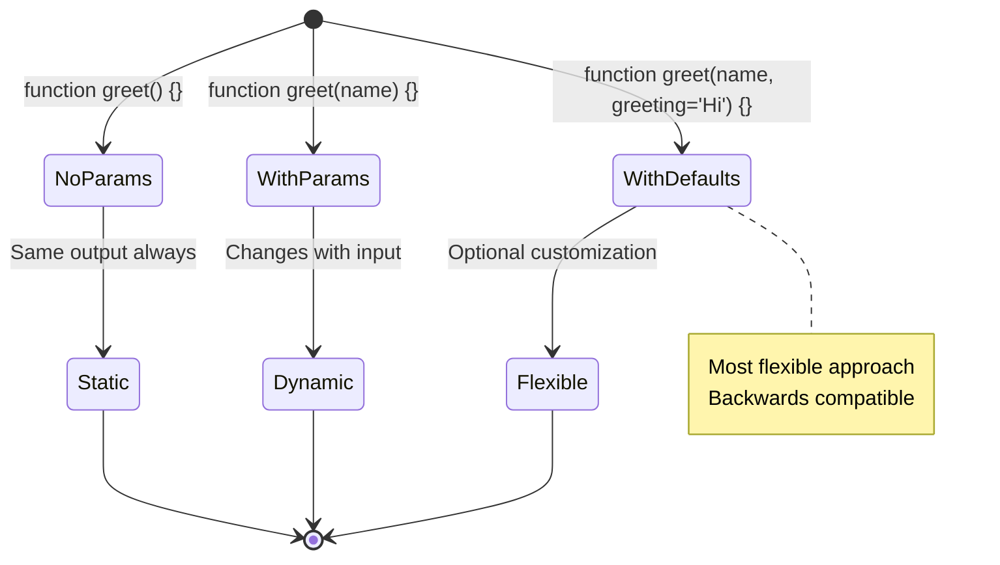

> **Порада:** Значення за замовчуванням роблять ваші функції більш зручними для користувачів. Користувачі можуть швидко почати роботу з розумними значеннями за замовчуванням, але все ще мають можливість налаштування!

## Повернення значень

Наші функції до цього моменту просто виводили повідомлення в консоль, але що, якщо ви хочете, щоб функція щось обчислювала і повертала результат?

Тут у гру вступають **значення, що повертаються**. Замість того, щоб просто щось відображати, функція може повернути значення, яке ви можете зберегти у змінній або використовувати в інших частинах вашого коду.

Щоб повернути значення, використовуйте ключове слово `return`, за яким слідує те, що ви хочете повернути:

```javascript
return myVariable;
```

Ось важливий момент: коли функція досягає оператора `return`, вона негайно припиняє виконання і повертає це значення тому, хто її викликав.

Давайте змінимо нашу функцію привітання, щоб вона повертала повідомлення замість того, щоб виводити його:

```javascript
function createGreetingMessage(name) {
  const message = `Hello, ${name}`;
  return message;
}
```

Тепер замість того, щоб виводити привітання, ця функція створює повідомлення і передає його нам.

Щоб використовувати повернене значення, ми можемо зберегти його у змінній, як будь-яке інше значення:

```javascript
const greetingMessage = createGreetingMessage('Christopher');
```

Тепер `greetingMessage` містить "Hello, Christopher", і ми можемо використовувати його будь-де в нашому коді – для відображення на веб-сторінці, включення в електронний лист або передачі іншій функції.

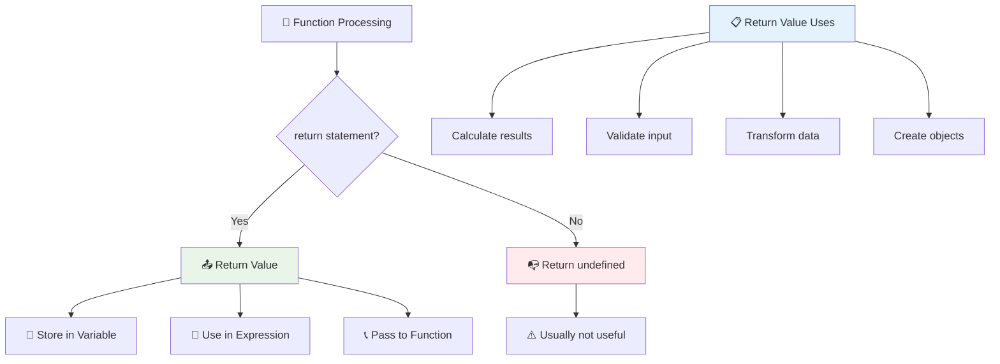

### 🔄 **Перевірка значень, що повертаються: Отримання результатів**

**Оцініть своє розуміння значень, що повертаються:**
- Що відбувається з кодом після оператора `return` у функції?
- Чому повернення значень часто краще, ніж просто виведення в консоль?
- Чи може функція повертати різні типи значень (рядок, число, булеве значення)?

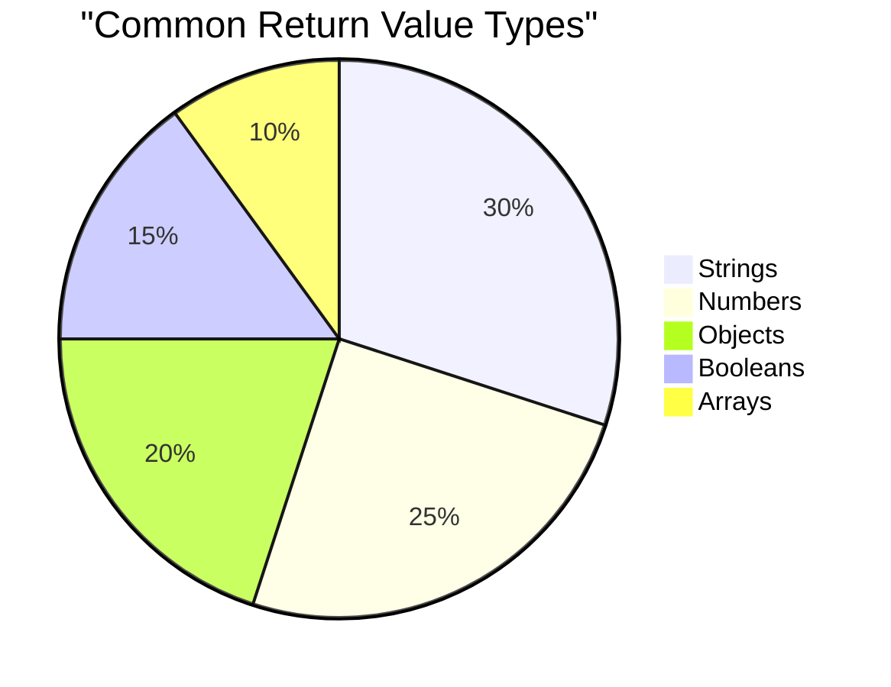

> **Ключове розуміння:** Функції, що повертають значення, більш універсальні, оскільки той, хто викликає функцію, вирішує, що робити з результатом. Це робить ваш код більш модульним і багаторазовим!

## Функції як параметри для функцій

Функції можуть передаватися як параметри іншим функціям. Хоча ця концепція може здатися складною спочатку, це потужна функція, яка дозволяє створювати гнучкі шаблони програмування.

Цей шаблон дуже поширений, коли ви хочете сказати "коли щось станеться, зробіть це інше". Наприклад, "коли таймер закінчиться, виконайте цей код" або "коли користувач натисне кнопку, викличте цю функцію".

Давайте розглянемо `setTimeout`, яка є вбудованою функцією, що чекає певний час, а потім виконує код. Нам потрібно сказати їй, який код виконати – ідеальний випадок для передачі функції!

Спробуйте цей код – через 3 секунди ви побачите повідомлення:

```javascript
function displayDone() {
  console.log('3 seconds has elapsed');
}
// timer value is in milliseconds
setTimeout(displayDone, 3000);
```

Зверніть увагу, як ми передаємо `displayDone` (без круглих дужок) у `setTimeout`. Ми не викликаємо функцію самі – ми передаємо її `setTimeout` і кажемо "викличте це через 3 секунди".

### Анонімні функції

Іноді вам потрібна функція лише для однієї задачі, і ви не хочете давати їй ім'я. Подумайте про це – якщо ви використовуєте функцію лише один раз, навіщо захаращувати код зайвим ім'ям?

JavaScript дозволяє створювати **анонімні функції** – функції без імен, які можна визначити там, де вони потрібні.

Ось як ми можемо переписати наш приклад таймера, використовуючи анонімну функцію:

```javascript
setTimeout(function() {
  console.log('3 seconds has elapsed');
}, 3000);
```

Це досягає того ж результату, але функція визначається безпосередньо в виклику `setTimeout`, усуваючи потребу в окремому визначенні функції.

### Стрілкові функції

Сучасний JavaScript має ще коротший спосіб написання функцій, який називається **стрілковими функціями**. Вони використовують `=>` (що виглядає як стрілка – зрозуміло?) і дуже популярні серед розробників.

Стрілкові функції дозволяють пропустити ключове слово `function` і писати більш лаконічний код.

Ось наш приклад таймера, використовуючи стрілкову функцію:

```javascript
setTimeout(() => {
  console.log('3 seconds has elapsed');
}, 3000);
```

`()` – це місце, де будуть параметри (порожнє в цьому випадку), потім йде стрілка `=>`, і нарешті тіло функції у фігурних дужках. Це забезпечує ту ж функціональність із більш лаконічним синтаксисом.

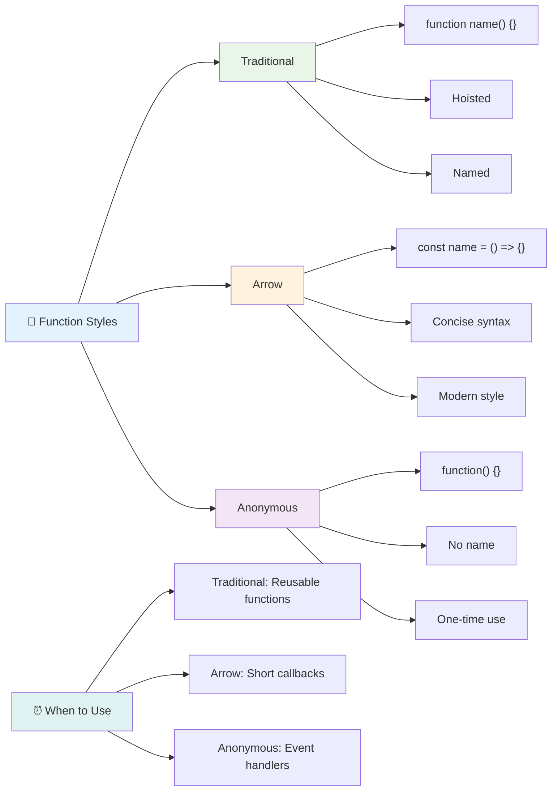

### Коли використовувати кожну стратегію

Коли слід використовувати кожен підхід? Практичне правило: якщо ви будете використовувати функцію кілька разів, дайте їй ім'я і визначте її окремо. Якщо вона потрібна для одного конкретного використання, розгляньте анонімну функцію. І стрілкові функції, і традиційний синтаксис є допустимими варіантами, хоча стрілкові функції поширені в сучасних кодових базах JavaScript.

### 🎨 **Перевірка стилів функцій: Вибір правильного синтаксису**

**Перевірте своє розуміння синтаксису:**
- Коли ви можете віддати перевагу стрілковим функціям над традиційним синтаксисом функцій?
- У чому основна перевага анонімних функцій?
- Чи можете ви придумати ситуацію, коли іменована функція краще за анонімну?

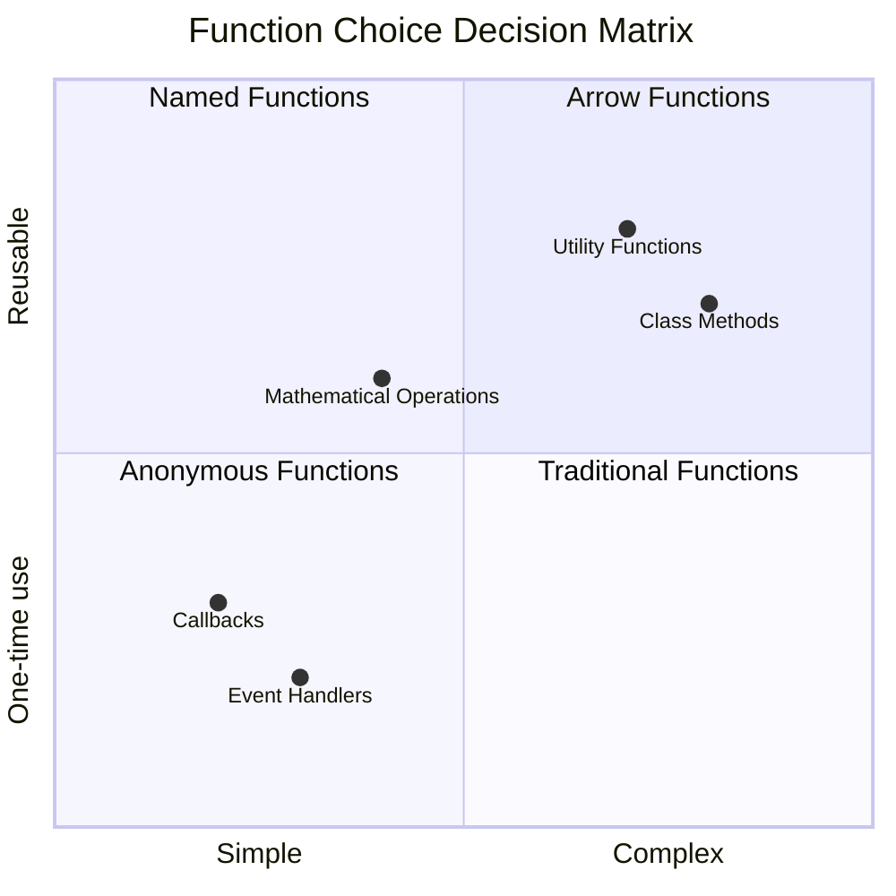

> **Сучасна тенденція:** Стрілкові функції стають стандартним вибором для багатьох розробників через їх лаконічний синтаксис, але традиційні функції все ще мають своє місце!

---

## 🚀 Виклик

Чи можете ви сформулювати в одному реченні різницю між функціями та методами? Спробуйте!

## Виклик GitHub Copilot Agent 🚀

Використовуйте режим Agent, щоб виконати наступний виклик:

**Опис:** Створіть бібліотеку утиліт математичних функцій, яка демонструє різні концепції функцій, розглянуті в цьому уроці, включаючи параметри, значення за замовчуванням, значення, що повертаються, і стрілкові функції.

**Запит:** Створіть файл JavaScript під назвою `mathUtils.js`, який містить наступні функції:
1. Функція `add`, яка приймає два параметри і повертає їх суму
2. Функція `multiply` із значеннями параметрів за замовчуванням (другий параметр за замовчуванням дорівнює 1)
3. Стрілкова функція `square`, яка приймає число і повертає його квадрат
4. Функція `calculate`, яка приймає іншу функцію як параметр і два числа, а потім застосовує функцію до цих чисел
5. Продемонструйте виклик кожної функції з відповідними тестовими випадками

Дізнайтеся більше про [режим Agent](https://code.visualstudio.com/blogs/2025/02/24/introducing-copilot-agent-mode) тут.

## Тест після лекції
[Тест після лекції](https://ff-quizzes.netlify.app)

## Огляд і самост
- [ ] Спробуйте перетворити традиційну функцію на синтаксис стрілкової функції  
- [ ] Практикуйте завдання: поясніть різницю між функціями та методами  

### 🎯 **Що Ви Можете Зробити За Цю Годину**  
- [ ] Завершіть тест після уроку та перегляньте будь-які незрозумілі концепції  
- [ ] Створіть бібліотеку математичних утиліт із виклику GitHub Copilot  
- [ ] Напишіть функцію, яка використовує іншу функцію як параметр  
- [ ] Практикуйте написання функцій із параметрами за замовчуванням  
- [ ] Експериментуйте з шаблонними літералами у значеннях, які повертають функції  

### 📅 **Ваш Тижневий Майстер-Клас Функцій**  
- [ ] Завершіть завдання "Розваги з функціями" творчо  
- [ ] Переробіть повторюваний код, який ви написали, у багаторазові функції  
- [ ] Створіть невеликий калькулятор, використовуючи лише функції (без глобальних змінних)  
- [ ] Практикуйте стрілкові функції з методами масивів, такими як `map()` і `filter()`  
- [ ] Створіть колекцію утиліт-функцій для поширених завдань  
- [ ] Вивчайте функції вищого порядку та концепції функціонального програмування  

### 🌟 **Ваш Місячний Ривок**  
- [ ] Опануйте складні концепції функцій, такі як замикання та область видимості  
- [ ] Створіть проєкт, який активно використовує композицію функцій  
- [ ] Внесіть вклад у відкритий код, покращуючи документацію функцій  
- [ ] Навчіть когось іншого функціям та різним стилям синтаксису  
- [ ] Досліджуйте парадигми функціонального програмування в JavaScript  
- [ ] Створіть особисту бібліотеку багаторазових функцій для майбутніх проєктів  

### 🏆 **Фінальна Перевірка Чемпіона Функцій**  

**Відсвяткуйте своє опанування функцій:**  
- Яка найкорисніша функція, яку ви створили до цього часу?  
- Як вивчення функцій змінило ваш підхід до організації коду?  
- Який синтаксис функцій ви віддаєте перевагу і чому?  
- Яку реальну проблему ви б вирішили, написавши функцію?  

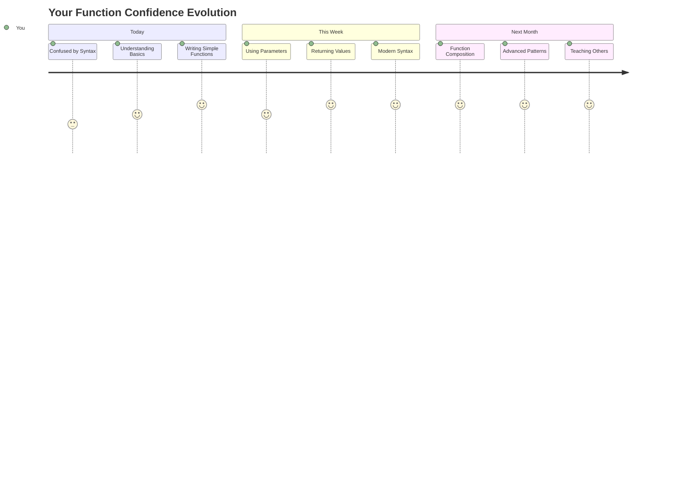
  
> 🎉 **Ви опанували одну з найпотужніших концепцій програмування!** Функції є основою для створення великих програм. Кожен застосунок, який ви коли-небудь створите, буде використовувати функції для організації, повторного використання та структурування коду. Тепер ви розумієте, як упакувати логіку в багаторазові компоненти, що робить вас більш ефективним і продуктивним програмістом. Ласкаво просимо у світ модульного програмування! 🚀  

---

**Відмова від відповідальності**:  
Цей документ був перекладений за допомогою сервісу автоматичного перекладу [Co-op Translator](https://github.com/Azure/co-op-translator). Хоча ми прагнемо до точності, будь ласка, майте на увазі, що автоматичні переклади можуть містити помилки або неточності. Оригінальний документ на його рідній мові слід вважати авторитетним джерелом. Для критичної інформації рекомендується професійний людський переклад. Ми не несемо відповідальності за будь-які непорозуміння або неправильні тлумачення, що виникають внаслідок використання цього перекладу.