# Основи JavaScript: Прийняття рішень

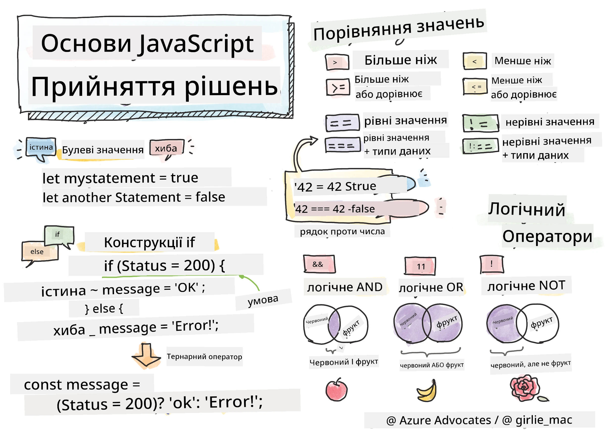

> Скетчноут від [Tomomi Imura](https://twitter.com/girlie_mac)

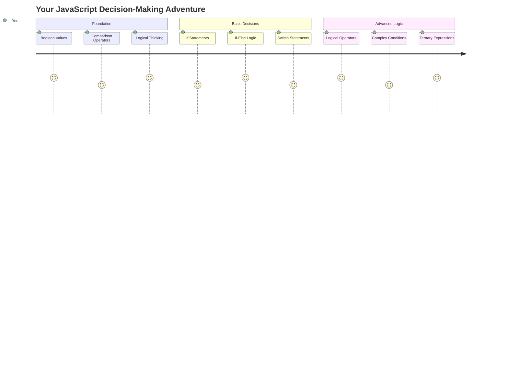

Чи замислювалися ви, як програми приймають розумні рішення? Наприклад, як навігаційна система вибирає найшвидший маршрут або як термостат вирішує, коли увімкнути обігрів? Це основна концепція прийняття рішень у програмуванні.

Як і Аналітична машина Чарльза Беббіджа, яка була створена для виконання різних послідовностей операцій залежно від умов, сучасні програми на JavaScript повинні приймати рішення, враховуючи різні обставини. Ця здатність розгалужуватися і приймати рішення перетворює статичний код на чутливі, інтелектуальні програми.

У цьому уроці ви навчитеся реалізовувати умовну логіку у своїх програмах. Ми розглянемо умовні оператори, оператори порівняння та логічні вирази, які дозволяють вашому коду оцінювати ситуації та відповідно реагувати.

## Тест перед лекцією

[Тест перед лекцією](https://ff-quizzes.netlify.app/web/quiz/11)

Здатність приймати рішення та контролювати потік програми є фундаментальним аспектом програмування. У цьому розділі ми розглянемо, як контролювати шлях виконання ваших програм на JavaScript за допомогою булевих значень та умовної логіки.

[](https://youtube.com/watch?v=SxTp8j-fMMY "Прийняття рішень")

> 🎥 Натисніть на зображення вище, щоб переглянути відео про прийняття рішень.

> Ви можете пройти цей урок на [Microsoft Learn](https://docs.microsoft.com/learn/modules/web-development-101-if-else/?WT.mc_id=academic-77807-sagibbon)!

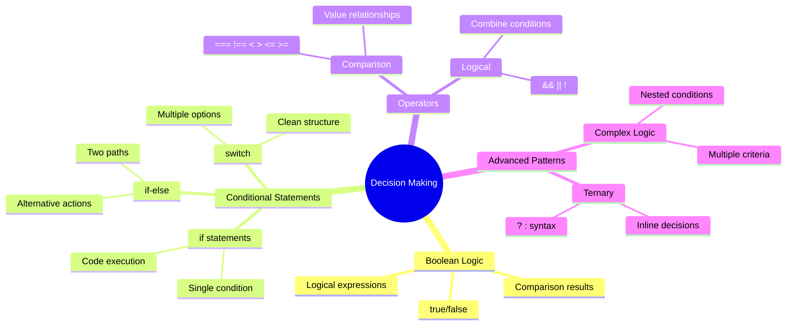

## Короткий огляд булевих значень

Перед тим як перейти до прийняття рішень, давайте згадаємо булеві значення з нашого попереднього уроку. Названі на честь математика Джорджа Буля, ці значення представляють двійкові стани – або `true`, або `false`. Тут немає неоднозначності, немає середнього значення.

Ці двійкові значення є основою всієї обчислювальної логіки. Кожне рішення, яке приймає ваша програма, зрештою зводиться до булевої оцінки.

Створення булевих змінних є простим:

```javascript
let myTrueBool = true;
let myFalseBool = false;
```

Це створює дві змінні з явними булевими значеннями.

✅ Булеві значення названі на честь англійського математика, філософа та логіка Джорджа Буля (1815–1864).

## Оператори порівняння та булеві значення

На практиці ви рідко будете вручну встановлювати булеві значення. Замість цього ви будете генерувати їх, оцінюючи умови: "Чи це число більше за те?" або "Чи ці значення рівні?"

Оператори порівняння дозволяють виконувати ці оцінки. Вони порівнюють значення і повертають булеві результати на основі відношення між операндами.

| Символ | Опис                                                                                                                                                   | Приклад            |
| ------ | ------------------------------------------------------------------------------------------------------------------------------------------------------ | ------------------ |
| `<`    | **Менше ніж**: Порівнює два значення і повертає булеве значення `true`, якщо значення зліва менше за значення справа                                   | `5 < 6 // true`    |
| `<=`   | **Менше або дорівнює**: Порівнює два значення і повертає булеве значення `true`, якщо значення зліва менше або дорівнює значенню справа                | `5 <= 6 // true`   |
| `>`    | **Більше ніж**: Порівнює два значення і повертає булеве значення `true`, якщо значення зліва більше за значення справа                                 | `5 > 6 // false`   |
| `>=`   | **Більше або дорівнює**: Порівнює два значення і повертає булеве значення `true`, якщо значення зліва більше або дорівнює значенню справа              | `5 >= 6 // false`  |
| `===`  | **Строга рівність**: Порівнює два значення і повертає булеве значення `true`, якщо значення справа і зліва рівні І мають однаковий тип даних           | `5 === 6 // false` |
| `!==`  | **Нерівність**: Порівнює два значення і повертає протилежне булеве значення тому, що повернув би оператор строгої рівності                            | `5 !== 6 // true`  |

✅ Перевірте свої знання, написавши кілька порівнянь у консолі вашого браузера. Чи здивували вас якісь отримані дані?

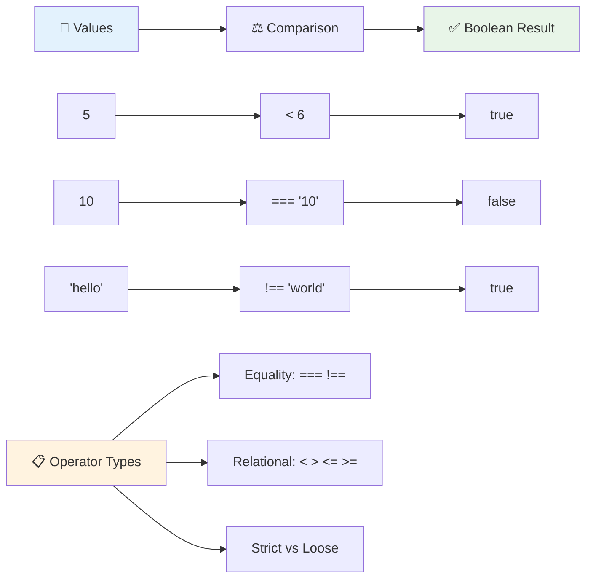

### 🧠 **Перевірка майстерності порівнянь: Розуміння булевої логіки**

**Перевірте своє розуміння порівнянь:**
- Чому, на вашу думку, `===` (строга рівність) зазвичай віддається перевага над `==` (нестрога рівність)?
- Чи можете ви передбачити, що поверне `5 === '5'`? А як щодо `5 == '5'`?
- У чому різниця між `!==` та `!=`?

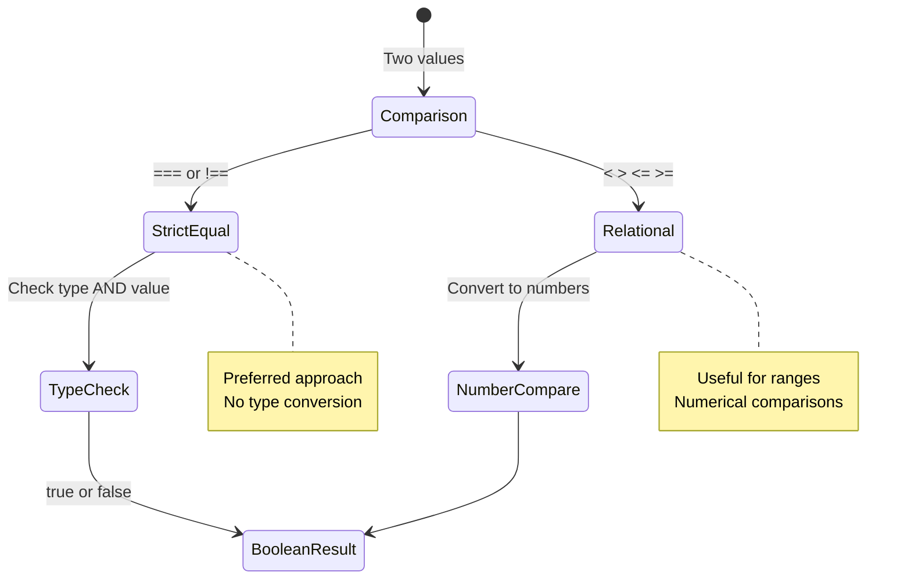

> **Порада**: Завжди використовуйте `===` та `!==` для перевірки рівності, якщо вам не потрібне спеціальне перетворення типів. Це запобігає несподіваній поведінці!

## Оператор if

Оператор `if` схожий на запитання у вашому коді. "Якщо ця умова істинна, тоді зроби це." Це, мабуть, найважливіший інструмент, який ви будете використовувати для прийняття рішень у JavaScript.

Ось як це працює:

```javascript
if (condition) {
  // Condition is true. Code in this block will run.
}
```

Умова розміщується всередині круглих дужок, і якщо вона `true`, JavaScript виконує код всередині фігурних дужок. Якщо вона `false`, JavaScript просто пропускає цей блок.

Ви часто будете використовувати оператори порівняння для створення цих умов. Давайте розглянемо практичний приклад:

```javascript
let currentMoney = 1000;
let laptopPrice = 800;

if (currentMoney >= laptopPrice) {
  // Condition is true. Code in this block will run.
  console.log("Getting a new laptop!");
}
```

Оскільки `1000 >= 800` оцінюється як `true`, код всередині блоку виконується, відображаючи "Купую новий ноутбук!" у консолі.

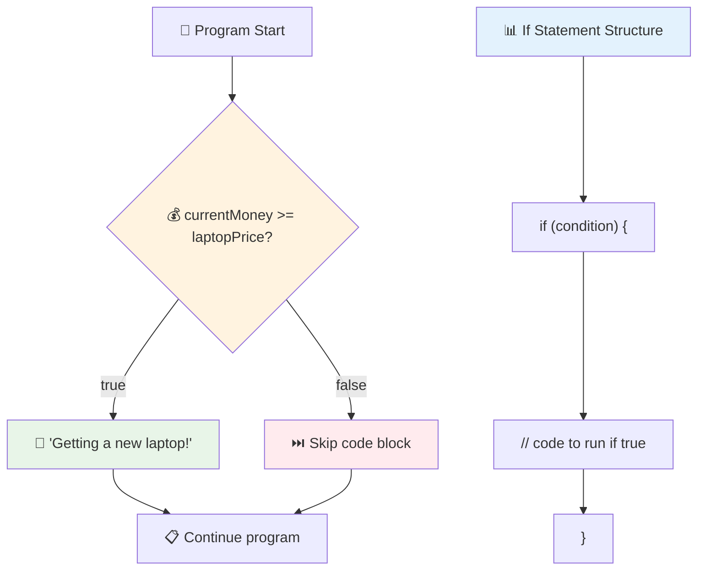

## Оператор if..else

Але що, якщо ви хочете, щоб ваша програма робила щось інше, коли умова хибна? Тут на допомогу приходить `else` – це як запасний план.

Оператор `else` дає вам можливість сказати "якщо ця умова не істинна, зроби щось інше."

```javascript
let currentMoney = 500;
let laptopPrice = 800;

if (currentMoney >= laptopPrice) {
  // Condition is true. Code in this block will run.
  console.log("Getting a new laptop!");
} else {
  // Condition is false. Code in this block will run.
  console.log("Can't afford a new laptop, yet!");
}
```

Тепер, оскільки `500 >= 800` є `false`, JavaScript пропускає перший блок і виконує блок `else`. Ви побачите "Поки не можу дозволити собі новий ноутбук!" у консолі.

✅ Перевірте своє розуміння цього коду та наступного коду, запустивши його в консолі браузера. Змініть значення змінних currentMoney та laptopPrice, щоб змінити результат `console.log()`.

### 🎯 **Перевірка логіки if-else: Розгалуження шляхів**

**Оцініть своє розуміння умовної логіки:**
- Що станеться, якщо `currentMoney` точно дорівнює `laptopPrice`?
- Чи можете ви придумати реальний сценарій, де логіка if-else була б корисною?
- Як ви могли б розширити це для обробки кількох діапазонів цін?

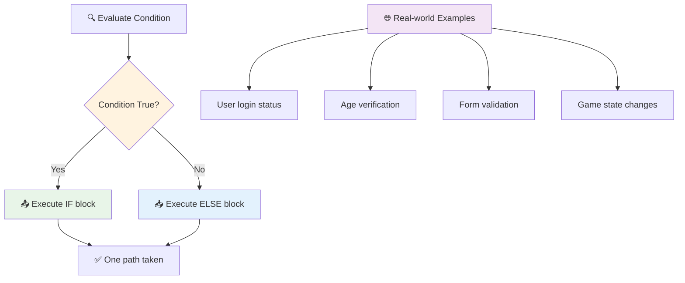

> **Ключове розуміння**: If-else гарантує, що буде обраний лише один шлях. Це забезпечує, що ваша програма завжди має відповідь на будь-яку умову!

## Оператор switch

Іноді вам потрібно порівняти одне значення з кількома варіантами. Хоча ви могли б зв'язати кілька операторів `if..else`, цей підхід стає громіздким. Оператор `switch` забезпечує більш чисту структуру для обробки кількох дискретних значень.

Концепція нагадує механічні системи перемикання, які використовувалися в ранніх телефонних станціях – одне вхідне значення визначає, який конкретний шлях виконання буде обраний.

```javascript
switch (expression) {
  case x:
    // code block
    break;
  case y:
    // code block
    break;
  default:
    // code block
}
```

Ось як це структуровано:
- JavaScript оцінює вираз один раз
- Переглядає кожен `case`, щоб знайти збіг
- Коли знаходить збіг, виконує цей блок коду
- `break` каже JavaScript зупинитися і вийти з switch
- Якщо жоден case не збігається, виконується блок `default` (якщо він є)

```javascript
// Program using switch statement for day of week
let dayNumber = 2;
let dayName;

switch (dayNumber) {
  case 1:
    dayName = "Monday";
    break;
  case 2:
    dayName = "Tuesday";
    break;
  case 3:
    dayName = "Wednesday";
    break;
  default:
    dayName = "Unknown day";
    break;
}
console.log(`Today is ${dayName}`);
```

У цьому прикладі JavaScript бачить, що `dayNumber` дорівнює `2`, знаходить відповідний `case 2`, встановлює `dayName` як "Вівторок", а потім виходить із switch. Результат? "Сьогодні вівторок" виводиться в консоль.

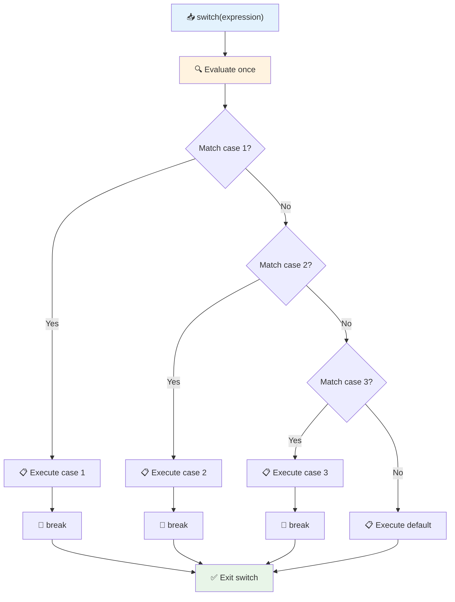

✅ Перевірте своє розуміння цього коду та наступного коду, запустивши його в консолі браузера. Змініть значення змінної a, щоб змінити результат `console.log()`.

### 🔄 **Перевірка майстерності switch: Багато варіантів**

**Перевірте своє розуміння switch:**
- Що станеться, якщо ви забудете оператор `break`?
- Коли ви б використали `switch` замість кількох операторів if-else?
- Чому блок `default` корисний, навіть якщо ви думаєте, що охопили всі можливості?

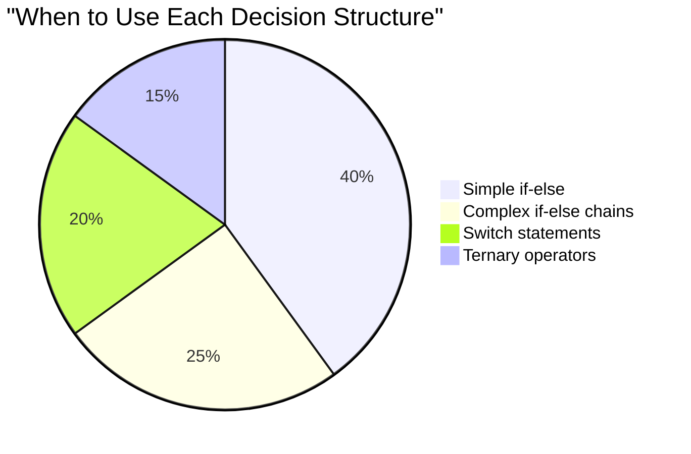

> **Найкраща практика**: Використовуйте `switch`, коли порівнюєте одну змінну з кількома конкретними значеннями. Використовуйте `if-else` для перевірки діапазонів або складних умов!

## Логічні оператори та булеві значення

Складні рішення часто вимагають оцінки кількох умов одночасно. Як і булева алгебра дозволяє математикам комбінувати логічні вирази, програмування надає логічні оператори для з'єднання кількох булевих умов.

Ці оператори дозволяють створювати складну умовну логіку, комбінуючи прості оцінки true/false.

| Символ | Опис                                                                                     | Приклад                                                                 |
| ------ | ---------------------------------------------------------------------------------------- | ----------------------------------------------------------------------- |
| `&&`   | **Логічне І**: Порівнює два булеві вирази. Повертає true **лише**, якщо обидві сторони істинні | `(5 > 3) && (5 < 10) // Обидві сторони істинні. Повертає true` |
| `\|\|` | **Логічне АБО**: Порівнює два булеві вирази. Повертає true, якщо хоча б одна сторона істинна | `(5 > 10) \|\| (5 < 10) // Одна сторона хибна, інша істинна. Повертає true` |
| `!`    | **Логічне НЕ**: Повертає протилежне значення булевого виразу                             | `!(5 > 10) // 5 не більше 10, тому "!" робить це true`         |

Ці оператори дозволяють комбінувати умови корисними способами:
- І (`&&`) означає, що обидві умови повинні бути істинними
- АБО (`||`) означає, що хоча б одна умова повинна бути істинною  
- НЕ (`!`) перевертає true на false (і навпаки)

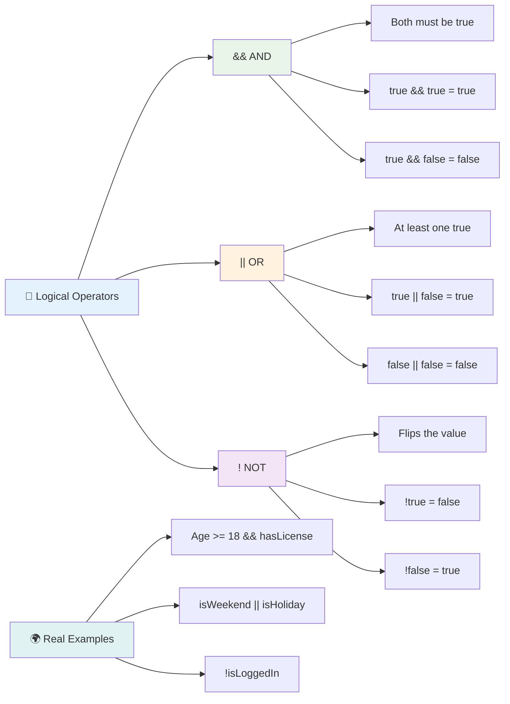

## Умови та рішення з логічними операторами

Давайте подивимося, як ці логічні оператори працюють на практиці з більш реалістичним прикладом:

```javascript
let currentMoney = 600;
let laptopPrice = 800;
let laptopDiscountPrice = laptopPrice - (laptopPrice * 0.2); // Laptop price at 20 percent off

if (currentMoney >= laptopPrice || currentMoney >= laptopDiscountPrice) {
  // Condition is true. Code in this block will run.
  console.log("Getting a new laptop!");
} else {
  // Condition is false. Code in this block will run.
  console.log("Can't afford a new laptop, yet!");
}
```

У цьому прикладі: ми розраховуємо ціну зі знижкою 20% (640), а потім оцінюємо, чи наші доступні кошти покривають повну ціну АБО ціну зі знижкою. Оскільки 600 відповідає порогу ціни зі знижкою 640, умова оцінюється як true.

### 🧮 **Перевірка логічних операторів: Комбінування умов**

**Перевірте своє розуміння логічних операторів:**
- У виразі `A && B`, що станеться, якщо A хибне? Чи буде B взагалі оцінюватися?
- Чи можете ви придумати ситуацію, де вам знадобляться всі три оператори (&&, ||, !)?
- У чому різниця між `!user.isActive` та `user.isActive !== true`?

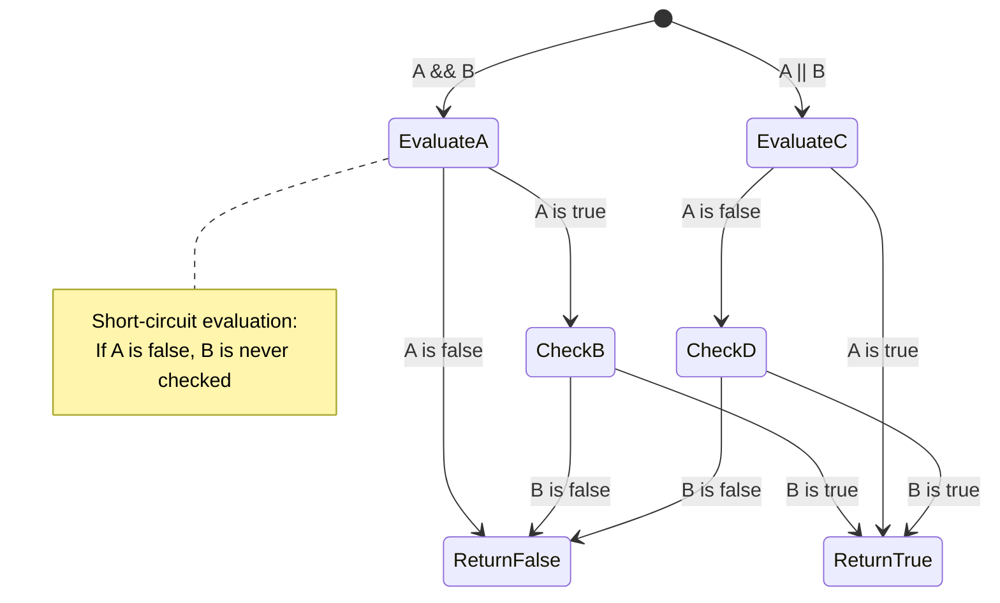

> **Порада щодо продуктивності**: JavaScript використовує "коротке оцінювання" - у `A && B`, якщо A хибне, B навіть не оцінюється. Використовуйте це на свою користь!

### Оператор заперечення

Іноді легше думати про те, коли щось НЕ істинне. Наприклад, замість того, щоб запитувати "Чи користувач увійшов у систему?", ви можете запитати "Чи користувач НЕ увійшов у систему?" Оператор оклику (`!`) перевертає логіку для вас.

```javascript
if (!condition) {
  // runs if condition is false
} else {
  // runs if condition is true
}
```

Оператор `!` схожий на "протилежне до..." – якщо щось є `true`, `!` робить це `false`, і навпаки.

### Тернарні вирази

Для простих умовних присвоєнь JavaScript надає **тернарний оператор**. Цей лаконічний синтаксис дозволяє написати умовний вираз в одному рядку, що корисно, коли вам потрібно призначити одне з двох значень на основі умови.

```javascript
let variable = condition ? returnThisIfTrue : returnThisIfFalse;
```

Це читається як запитання: "Чи ця умова істинна? Якщо так, використовуйте це значення. Якщо ні, використовуйте те значення."

Нижче наведено більш зрозумілий приклад:

```javascript
let firstNumber = 20;
let secondNumber = 10;
let biggestNumber = firstNumber > secondNumber ? firstNumber : secondNumber;
```

✅ Приділіть хвилину, щоб кілька разів прочитати цей код. Чи розумієте ви, як працюють ці оператори?

Ось що говорить цей рядок: "Чи `firstNumber` більше за `secondNumber`? Якщо так, помістіть `firstNumber` у `biggestNumber`. Якщо ні, помістіть `secondNumber` у `biggestNumber`."

Тернарний оператор – це просто коротший спосіб написати традиційний оператор `if..else`:

```javascript
let biggestNumber;
if (firstNumber > secondNumber) {
  biggestNumber = firstNumber;
} else {
  biggestNumber = secondNumber;
}
```

Обидва підходи дають однакові результати. Тернарний оператор пропонує лаконічність, тоді як традиційна структура if-else може бути більш читабельною для складних умов.

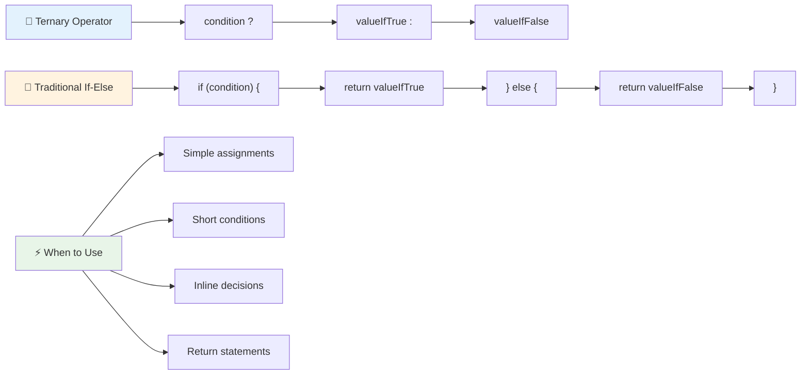

---


## 🚀 Виклик

Створіть програму, яка спочатку написана з використанням логічних операторів, а потім перепишіть її, використовуючи тернарний вираз. Який синтаксис вам більше подобається?

---

## Виклик GitHub Copilot Agent 🚀

Використовуйте режим Agent, щоб виконати наступний виклик:

**Опис:** Створіть комплексний калькулятор оцінок, який демонструє кілька концепцій прийняття рішень з цього уроку, включаючи оператори if-else, switch, логічні оператори та тернарні вирази.

**Завдання:** Напишіть програму на JavaScript, яка приймає числовий бал студента (0-100) і визначає його літерну оцінку за такими критеріями:
- A: 90-100
- B: 80-89  
- C: 70-79
- D: 60-69
- F: Менше 60

Вимоги:
1. Використовуйте оператор if-else для визначення літерної оцінки
2. Використовуйте логічні оператори, щоб перевірити, чи студент склав іспит (оцінка >= 60) І має відзнаку (оцінка >= 90).
3. Використовуйте оператор switch, щоб надати конкретний відгук для кожної літерної оцінки.
4. Використовуйте тернарний оператор, щоб визначити, чи студент має право на наступний курс (оцінка >= 70).
5. Включіть перевірку введення, щоб переконатися, що оцінка знаходиться в межах від 0 до 100.

Протестуйте вашу програму з різними оцінками, включаючи крайні випадки, такі як 59, 60, 89, 90, та недійсні введення.

Дізнайтеся більше про [режим агента](https://code.visualstudio.com/blogs/2025/02/24/introducing-copilot-agent-mode) тут.

## Тест після лекції

[Тест після лекції](https://ff-quizzes.netlify.app/web/quiz/12)

## Огляд і самостійне навчання

Дізнайтеся більше про різноманітні оператори, доступні користувачеві, [на MDN](https://developer.mozilla.org/docs/Web/JavaScript/Reference/Operators).

Перегляньте чудовий [довідник операторів](https://joshwcomeau.com/operator-lookup/) від Джоша Комо!

## Завдання

[Оператори](assignment.md)

---

## 🧠 **Резюме вашого інструментарію для прийняття рішень**

```mermaid
graph TD
    A["🎯 JavaScript Decisions"] --> B["🔍 Boolean Logic"]
    A --> C["📊 Conditional Statements"]
    A --> D["🔗 Logical Operators"]
    A --> E["⚡ Advanced Patterns"]
    
    B --> B1["true/false values"]
    B --> B2["Comparison operators"]
    B --> B3["Truthiness concepts"]
    
    C --> C1["if statements"]
    C --> C2["if-else chains"]
    C --> C3["switch statements"]
    
    D --> D1["&& (AND)"]
    D --> D2["|| (OR)"]
    D --> D3["! (NOT)"]
    
    E --> E1["Ternary operator"]
    E --> E2["Short-circuit evaluation"]
    E --> E3["Complex conditions"]
    
    F["💡 Key Principles"] --> F1["Clear readable conditions"]
    F --> F2["Consistent comparison style"]
    F --> F3["Proper operator precedence"]
    F --> F4["Efficient evaluation order"]
    
    style A fill:#e3f2fd
    style B fill:#e8f5e8
    style C fill:#fff3e0
    style D fill:#f3e5f5
    style E fill:#e0f2f1
    style F fill:#fce4ec
```

---

## 🚀 Хронологія вашого освоєння прийняття рішень у JavaScript

### ⚡ **Що ви можете зробити за наступні 5 хвилин**
- [ ] Попрактикуйте оператори порівняння в консолі вашого браузера
- [ ] Напишіть простий оператор if-else, який перевіряє ваш вік
- [ ] Спробуйте виклик: перепишіть if-else, використовуючи тернарний оператор
- [ ] Перевірте, що відбувається з різними "truthy" і "falsy" значеннями

### 🎯 **Що ви можете досягти за цю годину**
- [ ] Завершіть тест після уроку та перегляньте будь-які незрозумілі концепції
- [ ] Побудуйте комплексний калькулятор оцінок із виклику GitHub Copilot
- [ ] Створіть просте дерево рішень для реальної ситуації (наприклад, вибір одягу)
- [ ] Попрактикуйте комбінування кількох умов за допомогою логічних операторів
- [ ] Експериментуйте з операторами switch для різних випадків використання

### 📅 **Ваш тижневий шлях до освоєння логіки**
- [ ] Завершіть завдання з операторами, використовуючи творчі приклади
- [ ] Створіть міні-додаток для тестів, використовуючи різні умовні структури
- [ ] Створіть валідатор форми, який перевіряє кілька умов введення
- [ ] Попрактикуйте вправи з [довідника операторів](https://joshwcomeau.com/operator-lookup/) Джоша Комо
- [ ] Оптимізуйте існуючий код, використовуючи більш відповідні умовні структури
- [ ] Вивчіть коротке замикання та його вплив на продуктивність

### 🌟 **Ваш місячний шлях до трансформації**
- [ ] Освойте складні вкладені умови та підтримуйте читабельність коду
- [ ] Створіть додаток із складною логікою прийняття рішень
- [ ] Внесіть вклад у відкритий код, покращуючи умовну логіку в існуючих проєктах
- [ ] Навчіть когось іншого різним умовним структурам і коли їх використовувати
- [ ] Досліджуйте функціональні підходи до умовної логіки
- [ ] Створіть особистий довідник найкращих практик умовної логіки

### 🏆 **Фінальна перевірка вашого чемпіонства у прийнятті рішень**

**Відсвяткуйте ваше освоєння логічного мислення:**
- Яка найскладніша логіка прийняття рішень, яку ви успішно реалізували?
- Яка умовна структура здається вам найбільш природною і чому?
- Як навчання логічним операторам змінило ваш підхід до вирішення проблем?
- Яке реальне застосування виграє від складної логіки прийняття рішень?

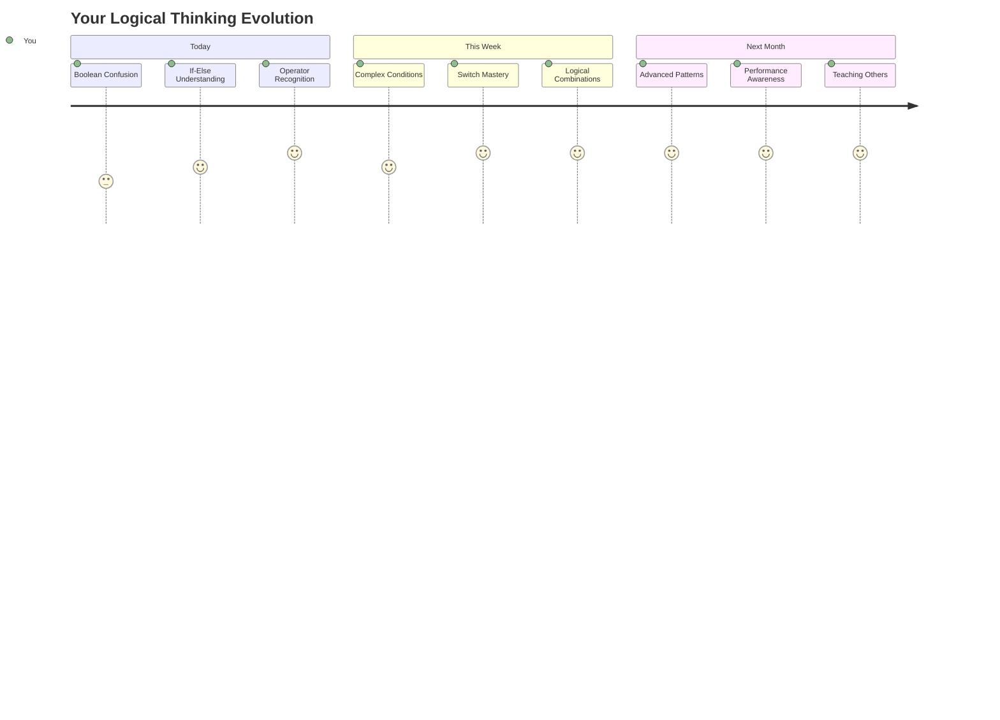

> 🧠 **Ви освоїли мистецтво цифрового прийняття рішень!** Кожен інтерактивний додаток покладається на умовну логіку, щоб розумно реагувати на дії користувача та змінні умови. Тепер ви розумієте, як змусити ваші програми думати, оцінювати та вибирати відповідні відповіді. Цей логічний фундамент стане основою для кожного динамічного додатка, який ви створите! 🎉

---

**Відмова від відповідальності**:  
Цей документ був перекладений за допомогою сервісу автоматичного перекладу [Co-op Translator](https://github.com/Azure/co-op-translator). Хоча ми прагнемо до точності, будь ласка, майте на увазі, що автоматичні переклади можуть містити помилки або неточності. Оригінальний документ на його рідній мові слід вважати авторитетним джерелом. Для критичної інформації рекомендується професійний людський переклад. Ми не несемо відповідальності за будь-які непорозуміння або неправильні тлумачення, що виникають внаслідок використання цього перекладу.