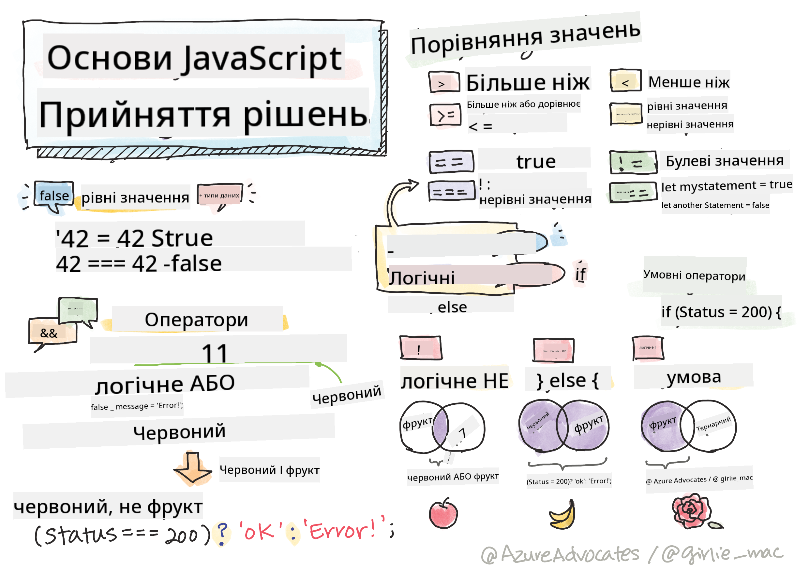

<!--
CO_OP_TRANSLATOR_METADATA:
{
  "original_hash": "90a3c32c3377f83ab750c2447c77ab98",
  "translation_date": "2025-10-24T15:23:26+00:00",
  "source_file": "2-js-basics/3-making-decisions/README.md",
  "language_code": "uk"
}
-->
# Основи JavaScript: Прийняття рішень



> Скетчнот від [Tomomi Imura](https://twitter.com/girlie_mac)

Чи замислювалися ви коли-небудь, як програми приймають розумні рішення? Наприклад, як навігаційна система обирає найшвидший маршрут або як термостат вирішує, коли увімкнути обігрів? Це основна концепція прийняття рішень у програмуванні.

Як і Аналітична машина Чарльза Беббіджа, яка була створена для виконання різних послідовностей операцій залежно від умов, сучасні програми на JavaScript повинні приймати рішення, враховуючи різні обставини. Ця здатність розгалужуватися і приймати рішення перетворює статичний код на чутливі, інтелектуальні програми.

У цьому уроці ви навчитеся реалізовувати умовну логіку у своїх програмах. Ми розглянемо умовні оператори, оператори порівняння та логічні вирази, які дозволяють вашому коду оцінювати ситуації та відповідно реагувати.

## Тест перед лекцією

[Тест перед лекцією](https://ff-quizzes.netlify.app/web/quiz/11)

Здатність приймати рішення та контролювати потік програми є фундаментальним аспектом програмування. У цьому розділі ми розглянемо, як контролювати шлях виконання ваших програм на JavaScript за допомогою булевих значень та умовної логіки.

[](https://youtube.com/watch?v=SxTp8j-fMMY "Прийняття рішень")

> 🎥 Натисніть на зображення вище, щоб переглянути відео про прийняття рішень.

> Ви можете пройти цей урок на [Microsoft Learn](https://docs.microsoft.com/learn/modules/web-development-101-if-else/?WT.mc_id=academic-77807-sagibbon)!

## Короткий огляд булевих значень

Перед тим як перейти до прийняття рішень, давайте згадаємо булеві значення з нашого попереднього уроку. Названі на честь математика Джорджа Буля, ці значення представляють двійкові стани – або `true`, або `false`. Тут немає неоднозначності, немає середнього значення.

Ці двійкові значення є основою всієї обчислювальної логіки. Кожне рішення, яке приймає ваша програма, в кінцевому підсумку зводиться до булевої оцінки.

Створення булевих змінних є простим:

```javascript
let myTrueBool = true;
let myFalseBool = false;
```

Це створює дві змінні з явними булевими значеннями.

✅ Булеві значення названі на честь англійського математика, філософа та логіка Джорджа Буля (1815–1864).

## Оператори порівняння та булеві значення

На практиці ви рідко будете вручну встановлювати булеві значення. Замість цього ви будете генерувати їх, оцінюючи умови: "Чи це число більше за те?" або "Чи ці значення рівні?"

Оператори порівняння дозволяють виконувати ці оцінки. Вони порівнюють значення і повертають булеві результати на основі відношення між операндами.

| Символ | Опис                                                                                                                                                   | Приклад            |
| ------ | ------------------------------------------------------------------------------------------------------------------------------------------------------- | ------------------ |
| `<`    | **Менше ніж**: Порівнює два значення і повертає булеве значення `true`, якщо значення зліва менше за значення справа                                    | `5 < 6 // true`    |
| `<=`   | **Менше або дорівнює**: Порівнює два значення і повертає булеве значення `true`, якщо значення зліва менше або дорівнює значенню справа                 | `5 <= 6 // true`   |
| `>`    | **Більше ніж**: Порівнює два значення і повертає булеве значення `true`, якщо значення зліва більше за значення справа                                  | `5 > 6 // false`   |
| `>=`   | **Більше або дорівнює**: Порівнює два значення і повертає булеве значення `true`, якщо значення зліва більше або дорівнює значенню справа               | `5 >= 6 // false`  |
| `===`  | **Строга рівність**: Порівнює два значення і повертає булеве значення `true`, якщо значення справа і зліва рівні І мають однаковий тип даних            | `5 === 6 // false` |
| `!==`  | **Нерівність**: Порівнює два значення і повертає протилежне булеве значення тому, яке повернув би оператор строгої рівності                            | `5 !== 6 // true`  |

✅ Перевірте свої знання, написавши кілька порівнянь у консолі вашого браузера. Чи здивували вас якісь отримані дані?

## Оператор if

Оператор `if` схожий на запитання у вашому коді. "Якщо ця умова істинна, тоді виконай це." Це, мабуть, найважливіший інструмент, який ви будете використовувати для прийняття рішень у JavaScript.

Ось як це працює:

```javascript
if (condition) {
  // Condition is true. Code in this block will run.
}
```

Умова розміщується всередині круглих дужок, і якщо вона є `true`, JavaScript виконує код всередині фігурних дужок. Якщо вона є `false`, JavaScript просто пропускає цей блок.

Ви часто будете використовувати оператори порівняння для створення цих умов. Давайте розглянемо практичний приклад:

```javascript
let currentMoney = 1000;
let laptopPrice = 800;

if (currentMoney >= laptopPrice) {
  // Condition is true. Code in this block will run.
  console.log("Getting a new laptop!");
}
```

Оскільки `1000 >= 800` оцінюється як `true`, код всередині блоку виконується, відображаючи "Купую новий ноутбук!" у консолі.

## Оператор if..else

А що, якщо ви хочете, щоб ваша програма виконувала щось інше, коли умова є хибною? Тут на допомогу приходить `else` – це як запасний план.

Оператор `else` дає вам можливість сказати "якщо ця умова не є істинною, виконай щось інше."

```javascript
let currentMoney = 500;
let laptopPrice = 800;

if (currentMoney >= laptopPrice) {
  // Condition is true. Code in this block will run.
  console.log("Getting a new laptop!");
} else {
  // Condition is false. Code in this block will run.
  console.log("Can't afford a new laptop, yet!");
}
```

Тепер, оскільки `500 >= 800` є `false`, JavaScript пропускає перший блок і виконує блок `else`. Ви побачите "Поки що не можу дозволити собі новий ноутбук!" у консолі.

✅ Перевірте своє розуміння цього коду та наступного, запустивши його в консолі браузера. Змініть значення змінних currentMoney і laptopPrice, щоб змінити результат `console.log()`.

## Оператор switch

Іноді вам потрібно порівняти одне значення з кількома варіантами. Хоча ви могли б використовувати кілька операторів `if..else`, цей підхід стає громіздким. Оператор `switch` забезпечує більш чисту структуру для обробки кількох окремих значень.

Концепція нагадує механічні комутаційні системи, які використовувалися в ранніх телефонних станціях – одне вхідне значення визначає, який конкретний шлях виконання буде обрано.

```javascript
switch (expression) {
  case x:
    // code block
    break;
  case y:
    // code block
    break;
  default:
    // code block
}
```

Ось як це структуровано:
- JavaScript оцінює вираз один раз
- Переглядає кожен `case`, щоб знайти відповідність
- Коли знаходить відповідність, виконує цей блок коду
- `break` повідомляє JavaScript, що потрібно зупинитися і вийти з switch
- Якщо жоден case не відповідає, виконується блок `default` (якщо він є)

```javascript
// Program using switch statement for day of week
let dayNumber = 2;
let dayName;

switch (dayNumber) {
  case 1:
    dayName = "Monday";
    break;
  case 2:
    dayName = "Tuesday";
    break;
  case 3:
    dayName = "Wednesday";
    break;
  default:
    dayName = "Unknown day";
    break;
}
console.log(`Today is ${dayName}`);
```

У цьому прикладі JavaScript бачить, що `dayNumber` дорівнює `2`, знаходить відповідний `case 2`, встановлює `dayName` як "Вівторок" і виходить з switch. Результат? "Сьогодні вівторок" відображається у консолі.

✅ Перевірте своє розуміння цього коду та наступного, запустивши його в консолі браузера. Змініть значення змінної a, щоб змінити результат `console.log()`.

## Логічні оператори та булеві значення

Складні рішення часто вимагають оцінки кількох умов одночасно. Як і булева алгебра дозволяє математикам комбінувати логічні вирази, програмування надає логічні оператори для з'єднання кількох булевих умов.

Ці оператори дозволяють створювати складну умовну логіку, комбінуючи прості оцінки true/false.

| Символ | Опис                                                                                     | Приклад                                                                 |
| ------ | ----------------------------------------------------------------------------------------- | ----------------------------------------------------------------------- |
| `&&`   | **Логічне І**: Порівнює два булеві вирази. Повертає true **лише**, якщо обидві сторони є true | `(5 > 3) && (5 < 10) // Обидві сторони істинні. Повертає true` |
| `\|\|` | **Логічне АБО**: Порівнює два булеві вирази. Повертає true, якщо хоча б одна сторона є true | `(5 > 10) \|\| (5 < 10) // Одна сторона хибна, інша істинна. Повертає true` |
| `!`    | **Логічне НЕ**: Повертає протилежне значення булевого виразу                             | `!(5 > 10) // 5 не більше ніж 10, тому "!" робить це true`         |

Ці оператори дозволяють комбінувати умови корисними способами:
- І (`&&`) означає, що обидві умови повинні бути істинними
- АБО (`||`) означає, що хоча б одна умова повинна бути істинною  
- НЕ (`!`) змінює true на false (і навпаки)

## Умови та рішення з логічними операторами

Давайте подивимося, як ці логічні оператори працюють на практичному прикладі:

```javascript
let currentMoney = 600;
let laptopPrice = 800;
let laptopDiscountPrice = laptopPrice - (laptopPrice * 0.2); // Laptop price at 20 percent off

if (currentMoney >= laptopPrice || currentMoney >= laptopDiscountPrice) {
  // Condition is true. Code in this block will run.
  console.log("Getting a new laptop!");
} else {
  // Condition is false. Code in this block will run.
  console.log("Can't afford a new laptop, yet!");
}
```

У цьому прикладі: ми розраховуємо ціну зі знижкою 20% (640), а потім оцінюємо, чи наші доступні кошти покривають або повну ціну, або ціну зі знижкою. Оскільки 600 відповідає порогу ціни зі знижкою 640, умова оцінюється як true.

### Оператор заперечення

Іноді легше думати про те, коли щось НЕ є істинним. Наприклад, замість запитання "Чи користувач увійшов у систему?", ви можете запитати "Чи користувач НЕ увійшов у систему?" Оператор оклику (`!`) змінює логіку для вас.

```javascript
if (!condition) {
  // runs if condition is false
} else {
  // runs if condition is true
}
```

Оператор `!` схожий на вислів "протилежне до..." – якщо щось є `true`, `!` робить це `false`, і навпаки.

### Тернарні вирази

Для простих умовних присвоєнь JavaScript надає **тернарний оператор**. Цей лаконічний синтаксис дозволяє записати умовний вираз в одному рядку, що корисно, коли потрібно призначити одне з двох значень на основі умови.

```javascript
let variable = condition ? returnThisIfTrue : returnThisIfFalse;
```

Це читається як запитання: "Чи ця умова істинна? Якщо так, використай це значення. Якщо ні, використай те значення."

Нижче наведено більш практичний приклад:

```javascript
let firstNumber = 20;
let secondNumber = 10;
let biggestNumber = firstNumber > secondNumber ? firstNumber : secondNumber;
```

✅ Приділіть хвилину, щоб кілька разів прочитати цей код. Чи розумієте ви, як працюють ці оператори?

Ось що говорить цей рядок: "Чи `firstNumber` більше за `secondNumber`? Якщо так, помістіть `firstNumber` у `biggestNumber`. Якщо ні, помістіть `secondNumber` у `biggestNumber`."

Тернарний оператор – це просто коротший спосіб записати традиційний оператор `if..else`:

```javascript
let biggestNumber;
if (firstNumber > secondNumber) {
  biggestNumber = firstNumber;
} else {
  biggestNumber = secondNumber;
}
```

Обидва підходи дають однакові результати. Тернарний оператор пропонує лаконічність, тоді як традиційна структура if-else може бути більш читабельною для складних умов.

---

## 🚀 Виклик

Створіть програму, яка спочатку написана з використанням логічних операторів, а потім перепишіть її, використовуючи тернарний вираз. Який синтаксис вам більше подобається?

---

## Виклик GitHub Copilot Agent 🚀

Використовуйте режим Agent, щоб виконати наступний виклик:

**Опис:** Створіть комплексний калькулятор оцінок, який демонструє кілька концепцій прийняття рішень з цього уроку, включаючи оператори if-else, switch, логічні оператори та тернарні вирази.

**Завдання:** Напишіть програму на JavaScript, яка приймає числову оцінку студента (0-100) і визначає його літерну оцінку за такими критеріями:
- A: 90-100
- B: 80-89  
- C: 70-79
- D: 60-69
- F: Менше 60

Вимоги:
1. Використовуйте оператор if-else для визначення літерної оцінки
2. Використовуйте логічні оператори, щоб перевірити, чи студент склав (оцінка >= 60) І має відзнаку (оцінка >= 90)
3. Використовуйте оператор switch для надання конкретного зворотного зв'язку для кожної літерної оцінки
4. Використовуйте тернарний оператор, щоб визначити, чи студент може перейти до наступного курсу (оцінка >= 70)
5. Додайте перевірку введення, щоб переконатися, що оцінка знаходиться в межах від 0 до 100

Перевірте свою програму на різних оцінках, включаючи крайні випадки, такі як 59, 60, 89, 90, і недійсні введення.

Дізнайтеся більше про [режим Agent](https://code.visualstudio.com/blogs/2025/02/24/introducing-copilot-agent-mode) тут.

## Тест після лекції

[Тест після лекції](https://ff-quizzes.netlify.app/web/quiz/12)

## Огляд та самостійне навчання

Дізнайтеся більше про численні оператори, доступні користувачеві, [на MDN](https://developer.mozilla.org/docs/Web/JavaScript/Reference/Operators).

Перегляньте чудовий [довідник операторів](https://joshwcomeau.com/operator-lookup/) від Джоша Комо!

## Завдання

[Оператори](assignment.md)

---

**Відмова від відповідальності**:  
Цей документ був перекладений за допомогою сервісу автоматичного перекладу [Co-op Translator](https://github.com/Azure/co-op-translator). Хоча ми прагнемо до точності, будь ласка, майте на увазі, що автоматичні переклади можуть містити помилки або неточності. Оригінальний документ на його рідній мові слід вважати авторитетним джерелом. Для критичної інформації рекомендується професійний людський переклад. Ми не несемо відповідальності за будь-які непорозуміння або неправильні тлумачення, що виникають внаслідок використання цього перекладу.