<!--
CO_OP_TRANSLATOR_METADATA:
{
  "original_hash": "1710a50a519a6e4a1b40a5638783018d",
  "translation_date": "2025-11-06T13:14:35+00:00",
  "source_file": "2-js-basics/4-arrays-loops/README.md",
  "language_code": "uk"
}
-->
# Основи JavaScript: Масиви та Цикли

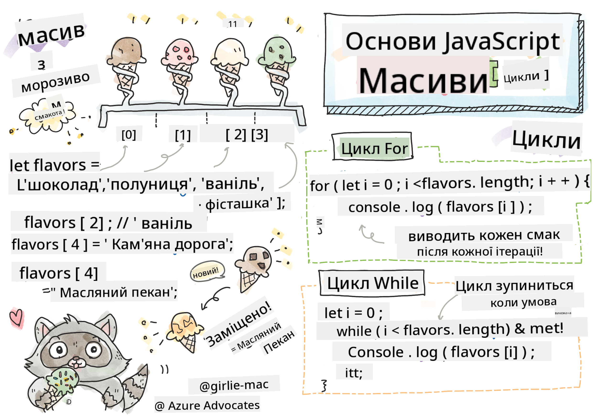
> Скетчнот від [Tomomi Imura](https://twitter.com/girlie_mac)

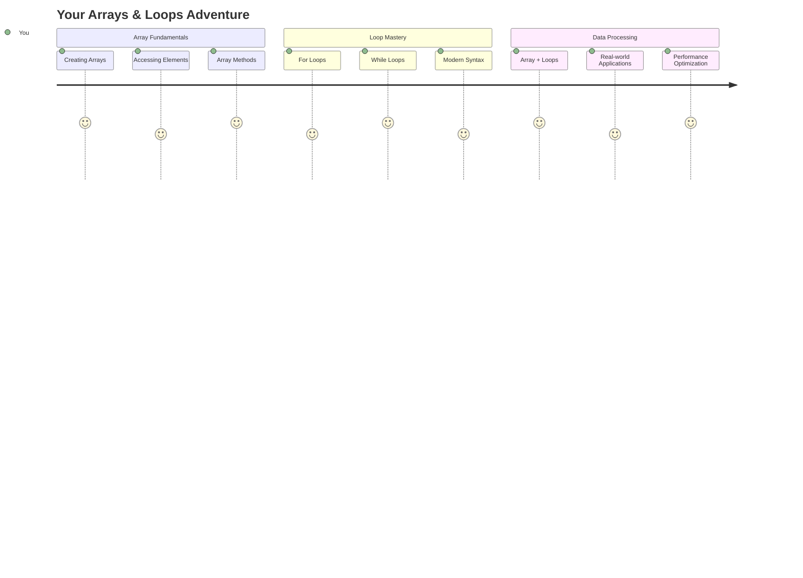

## Тест перед лекцією
[Тест перед лекцією](https://ff-quizzes.netlify.app/web/quiz/13)

Задумувалися, як вебсайти відстежують товари у кошику або показують список ваших друзів? Тут на допомогу приходять масиви та цикли. Масиви — це як цифрові контейнери, які зберігають кілька елементів інформації, а цикли дозволяють працювати з усіма цими даними ефективно, без повторення коду.

Разом ці дві концепції формують основу для обробки інформації у ваших програмах. Ви навчитеся переходити від ручного написання кожного кроку до створення розумного, ефективного коду, який може обробляти сотні або навіть тисячі елементів швидко.

До кінця цього уроку ви зрозумієте, як виконувати складні завдання з даними лише кількома рядками коду. Давайте дослідимо ці важливі концепції програмування.

[](https://youtube.com/watch?v=1U4qTyq02Xw "Масиви")

[](https://www.youtube.com/watch?v=Eeh7pxtTZ3k "Цикли")

> 🎥 Натисніть на зображення вище, щоб переглянути відео про масиви та цикли.

> Ви можете пройти цей урок на [Microsoft Learn](https://docs.microsoft.com/learn/modules/web-development-101-arrays/?WT.mc_id=academic-77807-sagibbon)!

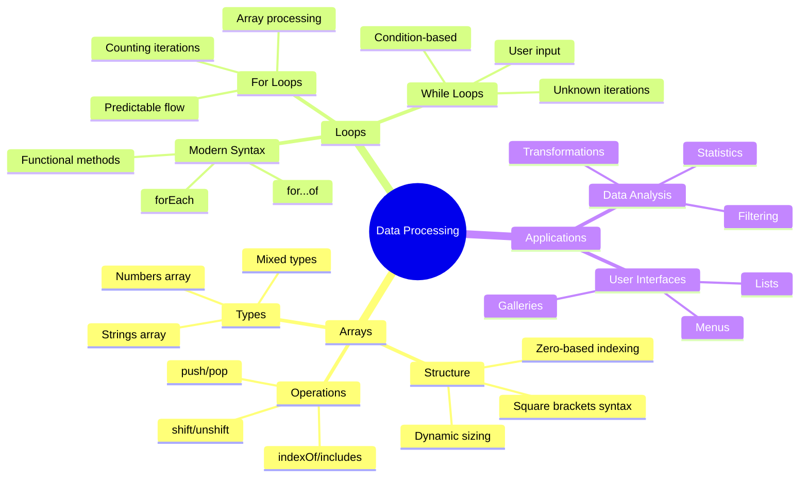

## Масиви

Уявіть масиви як цифрову картотеку - замість того, щоб зберігати один документ у кожній шухляді, ви можете організувати кілька пов'язаних елементів в одному структурованому контейнері. У термінах програмування масиви дозволяють зберігати кілька елементів інформації в одному організованому пакеті.

Чи то створення фотогалереї, управління списком справ або відстеження високих балів у грі, масиви забезпечують основу для організації даних. Давайте подивимося, як вони працюють.

✅ Масиви всюди навколо нас! Чи можете ви придумати реальний приклад масиву, наприклад, масив сонячних панелей?

### Створення масивів

Створити масив дуже просто - просто використовуйте квадратні дужки!

```javascript
// Empty array - like an empty shopping cart waiting for items
const myArray = [];
```

**Що тут відбувається?**
Ви щойно створили порожній контейнер за допомогою квадратних дужок `[]`. Уявіть це як порожню полицю в бібліотеці - вона готова до зберігання будь-яких книг, які ви хочете там організувати.

Ви також можете заповнити свій масив початковими значеннями прямо з самого початку:

```javascript
// Your ice cream shop's flavor menu
const iceCreamFlavors = ["Chocolate", "Strawberry", "Vanilla", "Pistachio", "Rocky Road"];

// A user's profile info (mixing different types of data)
const userData = ["John", 25, true, "developer"];

// Test scores for your favorite class
const scores = [95, 87, 92, 78, 85];
```

**Цікаві моменти:**
- Ви можете зберігати текст, числа або навіть значення true/false в одному масиві
- Просто розділіть кожен елемент комою - легко!
- Масиви ідеально підходять для зберігання пов'язаної інформації разом

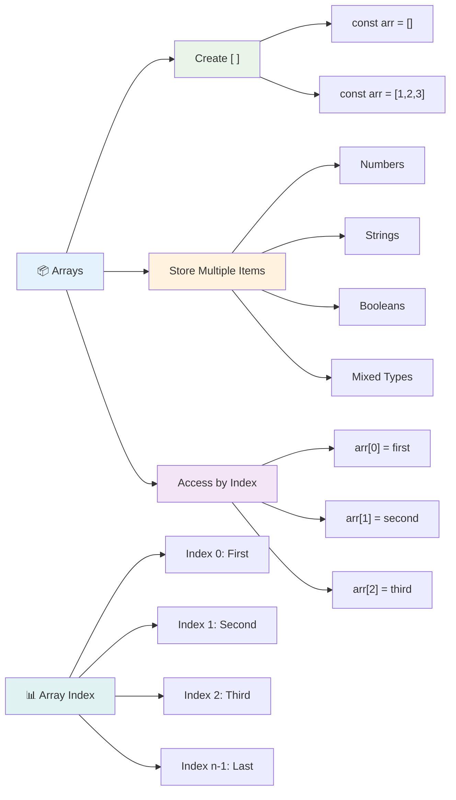

### Індексація масивів

Ось що може здатися незвичним спочатку: масиви нумерують свої елементи, починаючи з 0, а не з 1. Ця індексація з нуля має коріння в тому, як працює пам'ять комп'ютера - це програмна конвенція, яка існує з ранніх днів мов програмування, таких як C. Кожне місце в масиві отримує свій власний номер адреси, який називається **індексом**.

| Індекс | Значення | Опис |
|-------|----------|------|
| 0 | "Шоколад" | Перший елемент |
| 1 | "Полуниця" | Другий елемент |
| 2 | "Ваніль" | Третій елемент |
| 3 | "Фісташка" | Четвертий елемент |
| 4 | "Рокі Роуд" | П'ятий елемент |

✅ Чи здивувало вас, що масиви починаються з індексу нуль? У деяких мовах програмування індекси починаються з 1. Це цікава історія, яку ви можете [прочитати на Вікіпедії](https://en.wikipedia.org/wiki/Zero-based_numbering).

**Доступ до елементів масиву:**

```javascript
const iceCreamFlavors = ["Chocolate", "Strawberry", "Vanilla", "Pistachio", "Rocky Road"];

// Access individual elements using bracket notation
console.log(iceCreamFlavors[0]); // "Chocolate" - first element
console.log(iceCreamFlavors[2]); // "Vanilla" - third element
console.log(iceCreamFlavors[4]); // "Rocky Road" - last element
```

**Розбираємо, що тут відбувається:**
- **Використовує** квадратні дужки з номером індексу для доступу до елементів
- **Повертає** значення, збережене на конкретній позиції в масиві
- **Починає** рахунок з 0, роблячи перший елемент індексом 0

**Зміна елементів масиву:**

```javascript
// Change an existing value
iceCreamFlavors[4] = "Butter Pecan";
console.log(iceCreamFlavors[4]); // "Butter Pecan"

// Add a new element at the end
iceCreamFlavors[5] = "Cookie Dough";
console.log(iceCreamFlavors[5]); // "Cookie Dough"
```

**У наведеному вище прикладі ми:**
- **Змінили** елемент на індексі 4 з "Рокі Роуд" на "Масляний Пекан"
- **Додали** новий елемент "Тісто для печива" на індексі 5
- **Автоматично розширили** довжину масиву при додаванні за межі поточного обсягу

### Довжина масиву та основні методи

Масиви мають вбудовані властивості та методи, які значно спрощують роботу з даними.

**Визначення довжини масиву:**

```javascript
const iceCreamFlavors = ["Chocolate", "Strawberry", "Vanilla", "Pistachio", "Rocky Road"];
console.log(iceCreamFlavors.length); // 5

// Length updates automatically as array changes
iceCreamFlavors.push("Mint Chip");
console.log(iceCreamFlavors.length); // 6
```

**Основні моменти:**
- **Повертає** загальну кількість елементів у масиві
- **Оновлюється** автоматично при додаванні або видаленні елементів
- **Надає** динамічний підрахунок, корисний для циклів і перевірки

**Основні методи масивів:**

```javascript
const fruits = ["apple", "banana", "orange"];

// Add elements
fruits.push("grape");           // Adds to end: ["apple", "banana", "orange", "grape"]
fruits.unshift("strawberry");   // Adds to beginning: ["strawberry", "apple", "banana", "orange", "grape"]

// Remove elements
const lastFruit = fruits.pop();        // Removes and returns "grape"
const firstFruit = fruits.shift();     // Removes and returns "strawberry"

// Find elements
const index = fruits.indexOf("banana"); // Returns 1 (position of "banana")
const hasApple = fruits.includes("apple"); // Returns true
```

**Розуміння цих методів:**
- **Додає** елементи за допомогою `push()` (в кінці) і `unshift()` (на початку)
- **Видаляє** елементи за допомогою `pop()` (з кінця) і `shift()` (з початку)
- **Знаходить** елементи за допомогою `indexOf()` і перевіряє наявність за допомогою `includes()`
- **Повертає** корисні значення, такі як видалені елементи або індекси позицій

✅ Спробуйте самі! Використовуйте консоль вашого браузера, щоб створити і змінити масив власного створення.

### 🧠 **Перевірка основ масивів: Організація ваших даних**

**Перевірте своє розуміння масивів:**
- Чому, на вашу думку, масиви починають рахунок з 0, а не з 1?
- Що станеться, якщо ви спробуєте отримати доступ до індексу, який не існує (наприклад, `arr[100]` у масиві з 5 елементами)?
- Чи можете ви придумати три реальні сценарії, де масиви були б корисними?

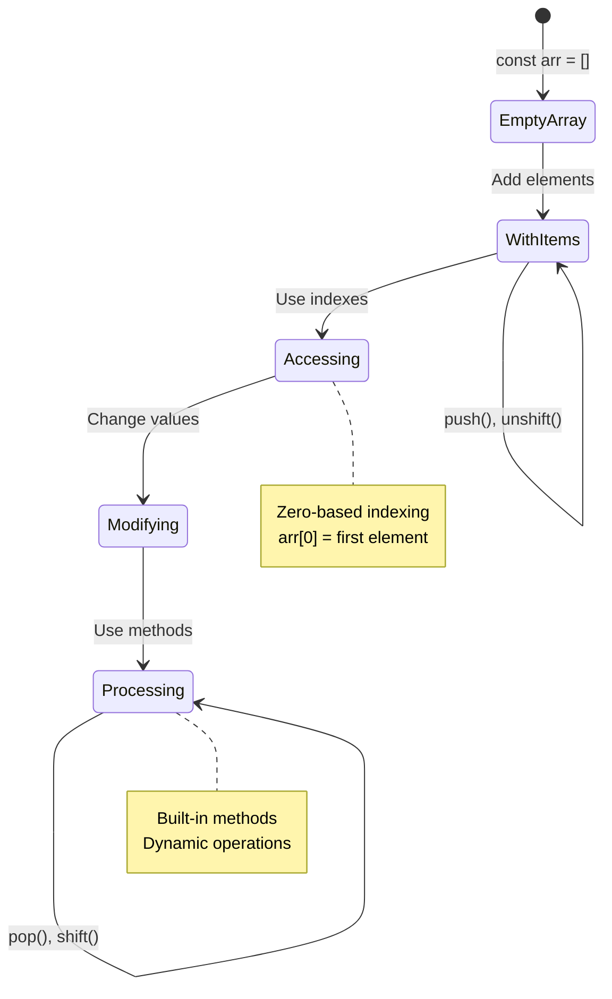

> **Інсайт з реального життя**: Масиви всюди в програмуванні! Стрічки соціальних мереж, кошики для покупок, фотогалереї, пісні в плейлисті - все це масиви за лаштунками!

## Цикли

Уявіть знамените покарання з романів Чарльза Діккенса, де учні повинні були багато разів писати одну й ту ж фразу на дошці. Уявіть, що ви могли б просто сказати комусь "напиши це речення 100 разів", і це було б зроблено автоматично. Саме це роблять цикли для вашого коду.

Цикли — це як мати невтомного помічника, який може повторювати завдання без помилок. Чи потрібно вам перевірити кожен елемент у кошику для покупок, чи показати всі фотографії в альбомі, цикли ефективно справляються з повторенням.

JavaScript пропонує кілька типів циклів на вибір. Давайте розглянемо кожен з них і зрозуміємо, коли їх використовувати.

```mermaid
flowchart TD
    A["🔄 Loop Types"] --> B["For Loop"]
    A --> C["While Loop"]
    A --> D["For...of Loop"]
    A --> E["forEach Method"]
    
    B --> B1["Known iterations"]
    B --> B2["Counter-based"]
    B --> B3["for(init; condition; increment)"]
    
    C --> C1["Unknown iterations"]
    C --> C2["Condition-based"]
    C --> C3["while(condition)"]
    
    D --> D1["Modern ES6+"]
    D --> D2["Array iteration"]
    D --> D3["for(item of array)"]
    
    E --> E1["Functional style"]
    E --> E2["Array method"]
    E --> E3["array.forEach(callback)"]
    
    F["⏰ When to Use"] --> F1["For: Counting, indexes"]
    F --> F2["While: User input, searching"]
    F --> F3["For...of: Simple iteration"]
    F --> F4["forEach: Functional programming"]
    
    style A fill:#e3f2fd
    style B fill:#e8f5e8
    style C fill:#fff3e0
    style D fill:#f3e5f5
    style E fill:#e0f2f1
    style F fill:#fce4ec
```

### Цикл For

Цикл `for` схожий на таймер - ви точно знаєте, скільки разів хочете виконати щось. Він дуже організований і передбачуваний, що робить його ідеальним для роботи з масивами або підрахунку чогось.

**Структура циклу For:**

| Компонент | Призначення | Приклад |
|-----------|-------------|---------|
| **Ініціалізація** | Встановлює початкову точку | `let i = 0` |
| **Умова** | Коли продовжувати | `i < 10` |
| **Інкремент** | Як оновлювати | `i++` |

```javascript
// Counting from 0 to 9
for (let i = 0; i < 10; i++) {
  console.log(`Count: ${i}`);
}

// More practical example: processing scores
const testScores = [85, 92, 78, 96, 88];
for (let i = 0; i < testScores.length; i++) {
  console.log(`Student ${i + 1}: ${testScores[i]}%`);
}
```

**Крок за кроком, ось що відбувається:**
- **Ініціалізує** змінну лічильника `i` на 0 на початку
- **Перевіряє** умову `i < 10` перед кожною ітерацією
- **Виконує** блок коду, якщо умова істинна
- **Збільшує** `i` на 1 після кожної ітерації за допомогою `i++`
- **Зупиняється**, коли умова стає хибною (коли `i` досягає 10)

✅ Запустіть цей код у консолі браузера. Що станеться, якщо ви внесете невеликі зміни до лічильника, умови або виразу ітерації? Чи можете ви змусити його працювати у зворотному напрямку, створюючи зворотний відлік?

### 🗓️ **Перевірка майстерності циклу For: Контрольоване повторення**

**Оцініть своє розуміння циклу for:**
- Які три частини циклу for і що кожна з них робить?
- Як би ви пройшли через масив у зворотному порядку?
- Що станеться, якщо ви забудете частину інкремента (`i++`)?

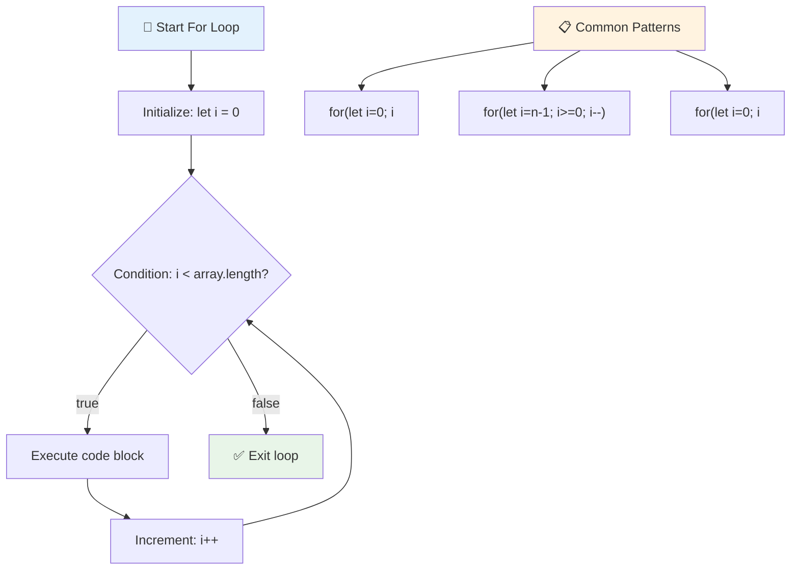

> **Мудрість циклів**: Цикли for ідеальні, коли ви точно знаєте, скільки разів потрібно щось повторити. Вони найчастіше використовуються для обробки масивів!

### Цикл While

Цикл `while` схожий на фразу "продовжуй робити це, поки..." - ви можете не знати точно, скільки разів він буде виконуватися, але знаєте, коли зупинитися. Він ідеально підходить для таких речей, як запитування користувача, поки він не надасть потрібну вам інформацію, або пошук даних, поки ви не знайдете те, що шукаєте.

**Характеристики циклу While:**
- **Продовжує** виконання, поки умова істинна
- **Вимагає** ручного управління будь-якими змінними лічильника
- **Перевіряє** умову перед кожною ітерацією
- **Ризикує** нескінченними циклами, якщо умова ніколи не стане хибною

```javascript
// Basic counting example
let i = 0;
while (i < 10) {
  console.log(`While count: ${i}`);
  i++; // Don't forget to increment!
}

// More practical example: processing user input
let userInput = "";
let attempts = 0;
const maxAttempts = 3;

while (userInput !== "quit" && attempts < maxAttempts) {
  userInput = prompt(`Enter 'quit' to exit (attempt ${attempts + 1}):`);
  attempts++;
}

if (attempts >= maxAttempts) {
  console.log("Maximum attempts reached!");
}
```

**Розуміння цих прикладів:**
- **Керує** змінною лічильника `i` вручну всередині тіла циклу
- **Збільшує** лічильник, щоб уникнути нескінченних циклів
- **Демонструє** практичний випадок використання з введенням користувача та обмеженням спроб
- **Включає** механізми безпеки для запобігання нескінченному виконанню

### ♾️ **Перевірка мудрості циклу While: Повторення на основі умови**

**Перевірте своє розуміння циклу while:**
- Яка основна небезпека при використанні циклів while?
- Коли ви б вибрали цикл while замість циклу for?
- Як можна запобігти нескінченним циклам?

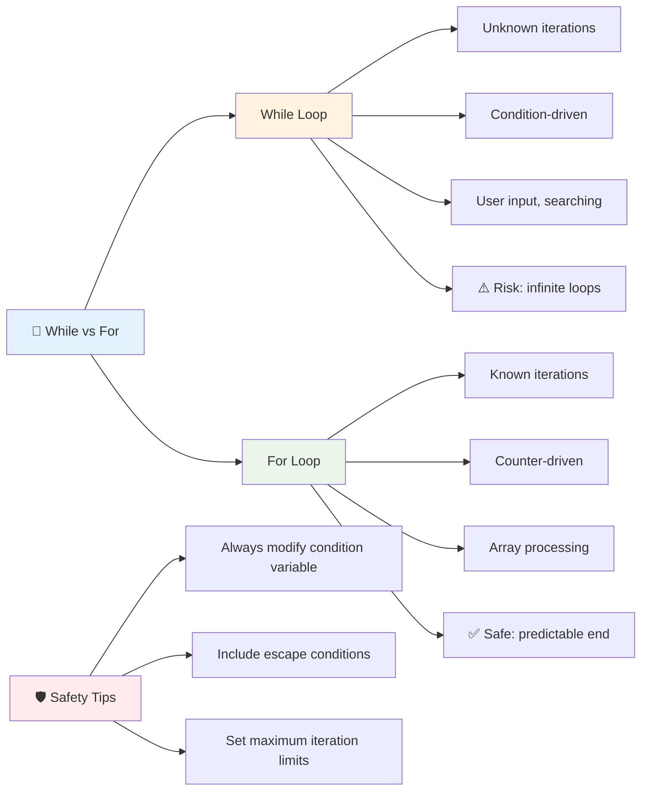

> **Безпека перш за все**: Цикли while потужні, але вимагають ретельного управління умовами. Завжди переконайтеся, що ваша умова циклу зрештою стане хибною!

### Сучасні альтернативи циклам

JavaScript пропонує сучасний синтаксис циклів, який може зробити ваш код більш читабельним і менш схильним до помилок.

**Цикл For...of (ES6+):**

```javascript
const colors = ["red", "green", "blue", "yellow"];

// Modern approach - cleaner and safer
for (const color of colors) {
  console.log(`Color: ${color}`);
}

// Compare with traditional for loop
for (let i = 0; i < colors.length; i++) {
  console.log(`Color: ${colors[i]}`);
}
```

**Основні переваги for...of:**
- **Усуває** управління індексами та потенційні помилки на одиницю
- **Надає** прямий доступ до елементів масиву
- **Покращує** читабельність коду та зменшує складність синтаксису

**Метод forEach:**

```javascript
const prices = [9.99, 15.50, 22.75, 8.25];

// Using forEach for functional programming style
prices.forEach((price, index) => {
  console.log(`Item ${index + 1}: $${price.toFixed(2)}`);
});

// forEach with arrow functions for simple operations
prices.forEach(price => console.log(`Price: $${price}`));
```

**Що потрібно знати про forEach:**
- **Виконує** функцію для кожного елемента масиву
- **Надає** як значення елемента, так і індекс як параметри
- **Не може** бути зупинений раніше (на відміну від традиційних циклів)
- **Повертає** undefined (не створює новий масив)

✅ Чому ви б вибрали цикл for замість циклу while? 17 тисяч користувачів мали те ж питання на StackOverflow, і деякі думки [можуть бути цікавими для вас](https://stackoverflow.com/questions/39969145/while-loops-vs-for-loops-in-javascript).

### 🎨 **Перевірка синтаксису сучасних циклів: Освоєння ES6+**

**Оцініть своє розуміння сучасного JavaScript:**
- Які переваги `for...of` над традиційними циклами for?
- Коли ви все ще можете віддати перевагу традиційним циклам for?
- У чому різниця між `forEach` і `map`?

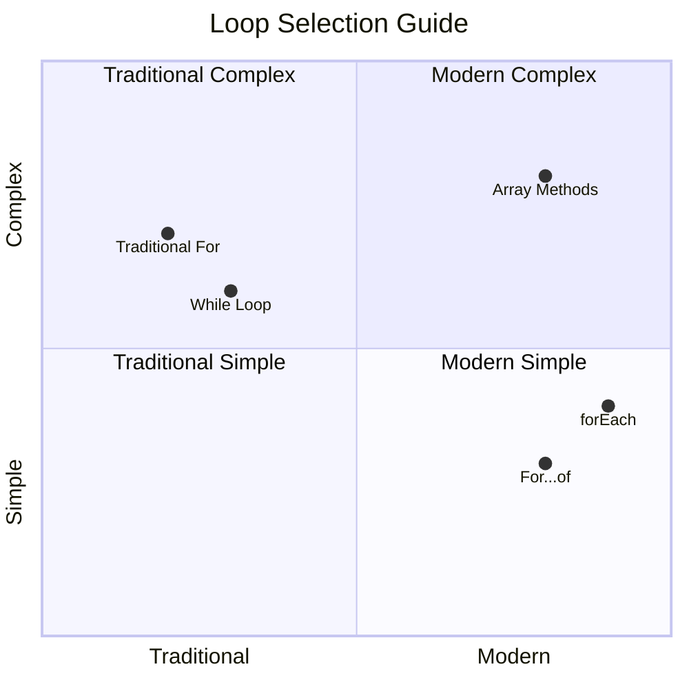

> **Сучасна тенденція**: Синтаксис ES6+, такий як `for...of` і `forEach`, стає переважним підходом для ітерації масивів, оскільки він чистіший і менш схильний до помилок!

## Цикли та Масиви

Поєднання масивів із циклами створює потужні можливості обробки даних. Це поєднання є основою багатьох програмних завдань, від відображення списків до обчислення статистики.

**Традиційна обробка масивів:**

```javascript
const iceCreamFlavors = ["Chocolate", "Strawberry", "Vanilla", "Pistachio", "Rocky Road"];

// Classic for loop approach
for (let i = 0; i < iceCreamFlavors.length; i++) {
  console.log(`Flavor ${i + 1}: ${iceCreamFlavors[i]}`);
}

// Modern for...of approach
for (const flavor of iceCreamFlavors) {
  console.log(`Available flavor: ${flavor}`);
}
```

**Давайте зрозуміємо кожен підхід:**
- **Використовує** властивість довжини масиву для визначення меж циклу
- **Отримує** доступ до елементів за індексом у традиційних циклах for
- **Надає** прямий доступ до елементів у циклах for...of
- **Обробляє** кожен елемент масиву рівно один раз

**Практичний приклад обробки даних:**

```javascript
const studentGrades = [85, 92, 78, 96, 88, 73, 89];
let total = 0;
let highestGrade = studentGrades[0];
let lowestGrade = studentGrades[0];

// Process all grades with a single loop
for (let i = 0; i < studentGrades.length; i++) {
  const grade = studentGrades[i];
  total += grade;
  
  if (grade > highestGrade) {
    highestGrade = grade;
  }
  
  if (grade < lowestGrade) {
    lowestGrade = grade;
  }
}

const average = total / studentGrades.length;
console.log(`Average: ${average.toFixed(1)}`);
console.log(`Highest: ${highestGrade}`);
console.log(`Lowest: ${lowestGrade}`);
```

**Ось як працює цей код:**
- **Ініціалізує** змінні для відстеження суми та екстремальних значень
- **Обробляє** кожну оцінку за допомогою одного ефективного циклу
- **Накопичує** загальну суму для обчислення середнього значення
- **Відстежує** найвищі та найнижчі значення під час ітерації
- **Обчислює** фінальну статистику після завершення циклу

✅ Експериментуйте з ітерацією масиву власного створення у консолі вашого браузера.

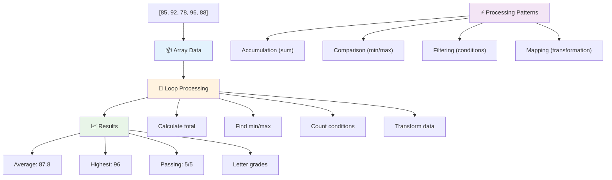

---

## Виклик GitHub Copilot Agent 🚀

Використовуйте режим Agent, щоб виконати наступний виклик:

**Опис:** Створіть комплексну функцію обробки даних, яка поєднує масиви та цикли для аналізу набору даних і створення значущих висновків.

**Запит:** Створіть функцію під назвою `an
JavaScript пропонує кілька сучасних методів роботи з масивами, які можуть замінити традиційні цикли для виконання конкретних завдань. Ознайомтеся з [forEach](https://developer.mozilla.org/docs/Web/JavaScript/Reference/Global_Objects/Array/forEach), [for-of](https://developer.mozilla.org/docs/Web/JavaScript/Reference/Statements/for...of), [map](https://developer.mozilla.org/docs/Web/JavaScript/Reference/Global_Objects/Array/map), [filter](https://developer.mozilla.org/docs/Web/JavaScript/Reference/Global_Objects/Array/filter) і [reduce](https://developer.mozilla.org/docs/Web/JavaScript/Reference/Global_Objects/Array/reduce).

**Ваше завдання:** Перепишіть приклад оцінок студентів, використовуючи щонайменше три різні методи роботи з масивами. Зверніть увагу, наскільки чистішим і зрозумілішим стає код із сучасним синтаксисом JavaScript.

## Тест після лекції
[Тест після лекції](https://ff-quizzes.netlify.app/web/quiz/14)

## Огляд і самостійне навчання

Масиви в JavaScript мають багато методів, які надзвичайно корисні для обробки даних. [Дізнайтеся більше про ці методи](https://developer.mozilla.org/docs/Web/JavaScript/Reference/Global_Objects/Array) і спробуйте деякі з них (наприклад, push, pop, slice і splice) на масиві, який ви створите.

## Завдання

[Цикл масиву](assignment.md)

---

## 📊 **Ваш підсумок інструментів для масивів і циклів**

```mermaid
graph TD
    A["🎯 Arrays & Loops Mastery"] --> B["📦 Array Fundamentals"]
    A --> C["🔄 Loop Types"]
    A --> D["🔗 Data Processing"]
    A --> E["🎨 Modern Techniques"]
    
    B --> B1["Creation: [ ]"]
    B --> B2["Indexing: arr[0]"]
    B --> B3["Methods: push, pop"]
    B --> B4["Properties: length"]
    
    C --> C1["For: Known iterations"]
    C --> C2["While: Condition-based"]
    C --> C3["For...of: Direct access"]
    C --> C4["forEach: Functional"]
    
    D --> D1["Statistics calculation"]
    D --> D2["Data transformation"]
    D --> D3["Filtering & searching"]
    D --> D4["Real-time processing"]
    
    E --> E1["Arrow functions"]
    E --> E2["Method chaining"]
    E --> E3["Destructuring"]
    E --> E4["Template literals"]
    
    F["💡 Key Benefits"] --> F1["Efficient data handling"]
    F --> F2["Reduced code repetition"]
    F --> F3["Scalable solutions"]
    F --> F4["Cleaner syntax"]
    
    style A fill:#e3f2fd
    style B fill:#e8f5e8
    style C fill:#fff3e0
    style D fill:#f3e5f5
    style E fill:#e0f2f1
    style F fill:#fce4ec
```

---

## 🚀 Ваш графік освоєння масивів і циклів

### ⚡ **Що можна зробити за наступні 5 хвилин**
- [ ] Створіть масив ваших улюблених фільмів і отримайте доступ до конкретних елементів
- [ ] Напишіть цикл for, який рахує від 1 до 10
- [ ] Виконайте завдання з сучасними методами масивів із уроку
- [ ] Попрактикуйте індексацію масивів у консолі вашого браузера

### 🎯 **Що можна досягти за годину**
- [ ] Завершіть тест після уроку і перегляньте складні концепції
- [ ] Побудуйте комплексний аналізатор оцінок із виклику GitHub Copilot
- [ ] Створіть простий кошик для покупок, який додає і видаляє товари
- [ ] Попрактикуйте конвертацію між різними типами циклів
- [ ] Експериментуйте з методами масивів, такими як `push`, `pop`, `slice` і `splice`

### 📅 **Ваш тижневий шлях обробки даних**
- [ ] Завершіть завдання "Цикл масиву" з творчими доповненнями
- [ ] Створіть додаток списку справ, використовуючи масиви і цикли
- [ ] Створіть простий калькулятор статистики для числових даних
- [ ] Попрактикуйтеся з [методами масивів MDN](https://developer.mozilla.org/docs/Web/JavaScript/Reference/Global_Objects/Array)
- [ ] Побудуйте інтерфейс фотогалереї або музичного плейлиста
- [ ] Досліджуйте функціональне програмування з `map`, `filter` і `reduce`

### 🌟 **Ваш місячний шлях трансформації**
- [ ] Освойте складні операції з масивами і оптимізацію продуктивності
- [ ] Створіть повний інформаційний дашборд для візуалізації даних
- [ ] Внесіть вклад у проєкти з відкритим кодом, пов'язані з обробкою даних
- [ ] Навчіть когось іншого масивів і циклів із практичними прикладами
- [ ] Створіть особисту бібліотеку функцій для обробки даних
- [ ] Досліджуйте алгоритми і структури даних, побудовані на масивах

### 🏆 **Фінальна перевірка чемпіона обробки даних**

**Відсвяткуйте своє освоєння масивів і циклів:**
- Яка операція з масивами була для вас найкориснішою для реальних застосувань?
- Який тип циклу здається вам найбільш природним і чому?
- Як розуміння масивів і циклів змінило ваш підхід до організації даних?
- Яке складне завдання з обробки даних ви хотіли б вирішити наступним?

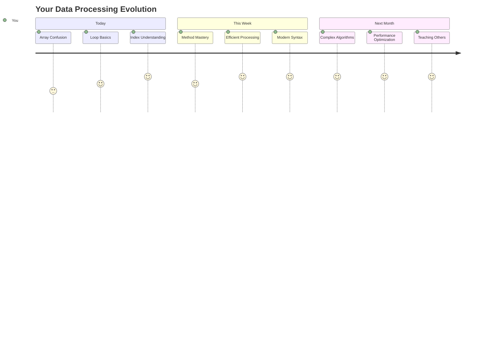

> 📦 **Ви розблокували силу організації і обробки даних!** Масиви і цикли є основою майже кожного додатка, який ви коли-небудь створите. Від простих списків до складного аналізу даних, тепер у вас є інструменти для ефективної і елегантної роботи з інформацією. Кожен динамічний вебсайт, мобільний додаток і додаток, заснований на даних, спирається на ці фундаментальні концепції. Ласкаво просимо у світ масштабованої обробки даних! 🎉

---

**Відмова від відповідальності**:  
Цей документ був перекладений за допомогою сервісу автоматичного перекладу [Co-op Translator](https://github.com/Azure/co-op-translator). Хоча ми прагнемо до точності, будь ласка, майте на увазі, що автоматичні переклади можуть містити помилки або неточності. Оригінальний документ на його рідній мові слід вважати авторитетним джерелом. Для критичної інформації рекомендується професійний людський переклад. Ми не несемо відповідальності за будь-які непорозуміння або неправильні тлумачення, що виникають внаслідок використання цього перекладу.