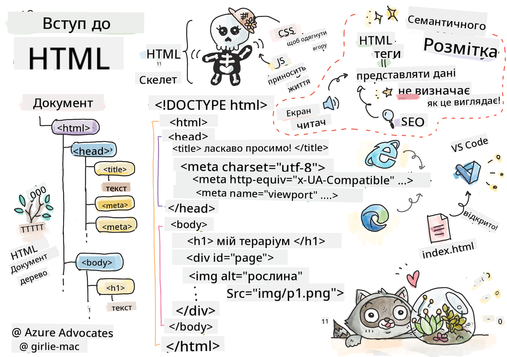
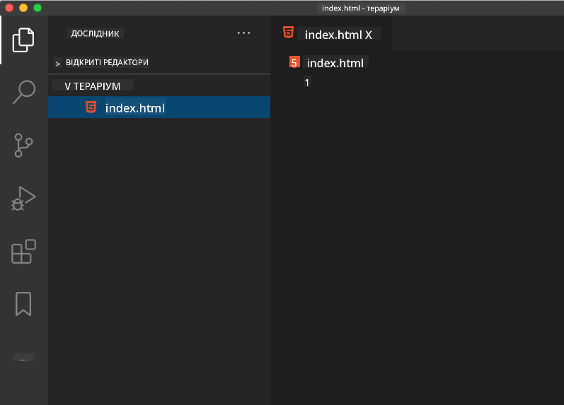

<!--
CO_OP_TRANSLATOR_METADATA:
{
  "original_hash": "46a0639e719b9cf1dfd062aa24cad639",
  "translation_date": "2025-08-27T22:34:53+00:00",
  "source_file": "3-terrarium/1-intro-to-html/README.md",
  "language_code": "uk"
}
-->
# Проєкт "Тераріум" Частина 1: Вступ до HTML


> Скетчноут від [Tomomi Imura](https://twitter.com/girlie_mac)

## Тест перед лекцією

[Тест перед лекцією](https://ff-quizzes.netlify.app/web/quiz/15)

> Перегляньте відео

> 
> [](https://www.youtube.com/watch?v=1TvxJKBzhyQ)

### Вступ

HTML, або HyperText Markup Language, — це "скелет" вебу. Якщо CSS "одягає" ваш HTML, а JavaScript оживляє його, то HTML — це тіло вашого веб-додатку. Синтаксис HTML навіть відображає цю ідею, оскільки включає теги "head", "body" і "footer".

У цьому уроці ми використаємо HTML для створення "скелету" інтерфейсу нашого віртуального тераріуму. Він матиме заголовок і три колонки: праву та ліву, де будуть розташовані перетягувані рослини, і центральну область, яка буде виглядати як скляний тераріум. До кінця цього уроку ви зможете побачити рослини в колонках, але інтерфейс виглядатиме трохи дивно; не хвилюйтеся, у наступному розділі ви додасте стилі CSS, щоб зробити інтерфейс більш привабливим.

### Завдання

На вашому комп'ютері створіть папку під назвою 'terrarium', а всередині неї файл 'index.html'. Ви можете зробити це у Visual Studio Code після створення папки terrarium, відкривши нове вікно VS Code, натиснувши 'open folder' і перейшовши до вашої нової папки. Натисніть маленьку кнопку 'file' у панелі Explorer і створіть новий файл:



Або

Використайте ці команди у вашому git bash:
* `mkdir terrarium`
* `cd terrarium`
* `touch index.html`
* `code index.html` або `nano index.html`

> Файли index.html вказують браузеру, що це файл за замовчуванням у папці; URL-адреси, такі як `https://anysite.com/test`, можуть бути побудовані за допомогою структури папок, включаючи папку під назвою `test` з файлом `index.html` всередині; `index.html` не обов'язково має відображатися в URL.

---

## DocType і теги html

Перший рядок HTML-файлу — це його doctype. Це трохи дивно, що цей рядок має бути на самому верху файлу, але він повідомляє старим браузерам, що сторінка повинна відображатися у стандартному режимі, відповідно до поточної специфікації HTML.

> Порада: у VS Code ви можете навести курсор на тег і отримати інформацію про його використання з довідників MDN.

Другий рядок має бути відкриваючим тегом `<html>`, а заразом і закриваючим тегом `</html>`. Ці теги є кореневими елементами вашого інтерфейсу.

### Завдання

Додайте ці рядки на початку вашого файлу `index.html`:

```HTML
<!DOCTYPE html>
<html></html>
```

✅ Існує кілька різних режимів, які можна визначити, встановивши DocType за допомогою рядка запиту: [Quirks Mode і Standards Mode](https://developer.mozilla.org/docs/Web/HTML/Quirks_Mode_and_Standards_Mode). Ці режими використовувалися для підтримки дуже старих браузерів, які зараз майже не використовуються (Netscape Navigator 4 і Internet Explorer 5). Ви можете дотримуватися стандартного оголошення doctype.

---

## 'head' документа

Область 'head' HTML-документа включає важливу інформацію про вашу веб-сторінку, також відому як [метадані](https://developer.mozilla.org/docs/Web/HTML/Element/meta). У нашому випадку ми повідомляємо веб-серверу, на який буде надіслана ця сторінка для відображення, про такі чотири речі:

-   заголовок сторінки
-   метадані сторінки, включаючи:
    -   'character set', який повідомляє про те, яке кодування символів використовується на сторінці
    -   інформацію про браузер, включаючи `x-ua-compatible`, що вказує на підтримку браузера IE=edge
    -   інформацію про те, як має поводитися viewport при завантаженні. Встановлення початкового масштабу viewport на 1 контролює рівень масштабування при першому завантаженні сторінки.

### Завдання

Додайте блок 'head' до вашого документа між відкриваючим і закриваючим тегами `<html>`.

```html
<head>
	<title>Welcome to my Virtual Terrarium</title>
	<meta charset="utf-8" />
	<meta http-equiv="X-UA-Compatible" content="IE=edge" />
	<meta name="viewport" content="width=device-width, initial-scale=1" />
</head>
```

✅ Що станеться, якщо ви встановите мета-тег viewport таким чином: `<meta name="viewport" content="width=600">`? Дізнайтеся більше про [viewport](https://developer.mozilla.org/docs/Web/HTML/Viewport_meta_tag).

---

## 'body' документа

### HTML-теги

У HTML ви додаєте теги до вашого .html файлу, щоб створити елементи веб-сторінки. Кожен тег зазвичай має відкриваючий і закриваючий тег, наприклад: `<p>hello</p>` для позначення абзацу. Створіть тіло вашого інтерфейсу, додавши пару тегів `<body>` всередині пари тегів `<html>`; ваш код тепер виглядає так:

### Завдання

```html
<!DOCTYPE html>
<html>
	<head>
		<title>Welcome to my Virtual Terrarium</title>
		<meta charset="utf-8" />
		<meta http-equiv="X-UA-Compatible" content="IE=edge" />
		<meta name="viewport" content="width=device-width, initial-scale=1" />
	</head>
	<body></body>
</html>
```

Тепер ви можете почати створювати вашу сторінку. Зазвичай ви використовуєте теги `<div>` для створення окремих елементів на сторінці. Ми створимо серію елементів `<div>`, які міститимуть зображення.

### Зображення

Один HTML-тег, який не потребує закриваючого тега, — це ``, оскільки він має елемент `src`, який містить всю інформацію, необхідну сторінці для відображення елемента.

Створіть папку у вашому додатку під назвою `images` і додайте до неї всі зображення з [папки вихідного коду](../../../../3-terrarium/solution/images); (там є 14 зображень рослин).

### Завдання

Додайте ці зображення рослин у дві колонки між тегами `<body></body>`:

```html
<div id="page">
	<div id="left-container" class="container">
		<div class="plant-holder">
			
		</div>
		<div class="plant-holder">
			
		</div>
		<div class="plant-holder">
			
		</div>
		<div class="plant-holder">
			
		</div>
		<div class="plant-holder">
			
		</div>
		<div class="plant-holder">
			
		</div>
		<div class="plant-holder">
			
		</div>
	</div>
	<div id="right-container" class="container">
		<div class="plant-holder">
			
		</div>
		<div class="plant-holder">
			
		</div>
		<div class="plant-holder">
			
		</div>
		<div class="plant-holder">
			
		</div>
		<div class="plant-holder">
			
		</div>
		<div class="plant-holder">
			
		</div>
		<div class="plant-holder">
			
		</div>
	</div>
</div>
```

> Примітка: Спани проти Дівів. Діви вважаються елементами 'block', а спани — 'inline'. Що станеться, якщо ви перетворите ці діви на спани?

З цим кодом рослини тепер з'являються на екрані. Виглядає це досить погано, оскільки вони ще не стилізовані за допомогою CSS, і ми зробимо це у наступному уроці.

Кожне зображення має альтернативний текст, який з'являється навіть якщо ви не можете побачити або відобразити зображення. Це важливий атрибут для забезпечення доступності. Дізнайтеся більше про доступність у майбутніх уроках; наразі пам'ятайте, що атрибут alt надає альтернативну інформацію для зображення, якщо користувач з якоїсь причини не може його переглянути (через повільне з'єднання, помилку в атрибуті src або якщо користувач використовує екранний зчитувач).

✅ Ви помітили, що кожне зображення має однаковий alt-тег? Чи це хороша практика? Чому або чому ні? Чи можете ви покращити цей код?

---

## Семантична розмітка

Загалом, краще використовувати осмислену 'семантику' при написанні HTML. Що це означає? Це означає, що ви використовуєте HTML-теги для представлення типу даних або взаємодії, для яких вони були створені. Наприклад, основний заголовок тексту на сторінці має використовувати тег `<h1>`.

Додайте наступний рядок прямо під вашим відкриваючим тегом `<body>`:

```html
<h1>My Terrarium</h1>
```

Використання семантичної розмітки, такої як заголовки `<h1>` і ненумеровані списки `<ul>`, допомагає екранним зчитувачам орієнтуватися на сторінці. Загалом, кнопки слід писати як `<button>`, а списки — як `<li>`. Хоча _можливо_ використовувати спеціально стилізовані елементи `<span>` з обробниками кліків для імітації кнопок, краще для користувачів з обмеженими можливостями використовувати технології для визначення місця розташування кнопки на сторінці та взаємодії з нею, якщо елемент виглядає як кнопка. З цієї причини намагайтеся використовувати семантичну розмітку якомога більше.

✅ Ознайомтеся з екранним зчитувачем і [як він взаємодіє з веб-сторінкою](https://www.youtube.com/watch?v=OUDV1gqs9GA). Чи можете ви зрозуміти, чому використання несемантичної розмітки може засмутити користувача?

## Тераріум

Остання частина цього інтерфейсу передбачає створення розмітки, яка буде стилізована для створення тераріуму.

### Завдання:

Додайте цю розмітку над останнім тегом `</div>`:

```html
<div id="terrarium">
	<div class="jar-top"></div>
	<div class="jar-walls">
		<div class="jar-glossy-long"></div>
		<div class="jar-glossy-short"></div>
	</div>
	<div class="dirt"></div>
	<div class="jar-bottom"></div>
</div>
```

✅ Незважаючи на те, що ви додали цю розмітку на екран, ви абсолютно нічого не бачите. Чому?

---

## 🚀Виклик

Існують деякі цікаві "старі" теги в HTML, які все ще весело використовувати, хоча вам не слід використовувати застарілі теги, такі як [ці теги](https://developer.mozilla.org/docs/Web/HTML/Element#Obsolete_and_deprecated_elements) у вашій розмітці. Все ж, чи можете ви використати старий тег `<marquee>`, щоб зробити заголовок h1 прокручуваним горизонтально? (якщо ви це зробите, не забудьте видалити його потім)

## Тест після лекції

[Тест після лекції](https://ff-quizzes.netlify.app/web/quiz/16)

## Огляд і самостійне навчання

HTML — це "перевірена часом" система будівельних блоків, яка допомогла створити веб таким, яким він є сьогодні. Дізнайтеся трохи про його історію, вивчаючи старі та нові теги. Чи можете ви зрозуміти, чому деякі теги були застарілими, а деякі додані? Які теги можуть бути введені в майбутньому?

Дізнайтеся більше про створення сайтів для вебу та мобільних пристроїв на [Microsoft Learn](https://docs.microsoft.com/learn/modules/build-simple-website/?WT.mc_id=academic-77807-sagibbon).

## Завдання

[Практикуйте HTML: створіть макет блогу](assignment.md)

---

**Відмова від відповідальності**:  
Цей документ був перекладений за допомогою сервісу автоматичного перекладу [Co-op Translator](https://github.com/Azure/co-op-translator). Хоча ми прагнемо до точності, будь ласка, майте на увазі, що автоматичні переклади можуть містити помилки або неточності. Оригінальний документ на його рідній мові слід вважати авторитетним джерелом. Для критичної інформації рекомендується професійний людський переклад. Ми не несемо відповідальності за будь-які непорозуміння або неправильні тлумачення, що виникають внаслідок використання цього перекладу.