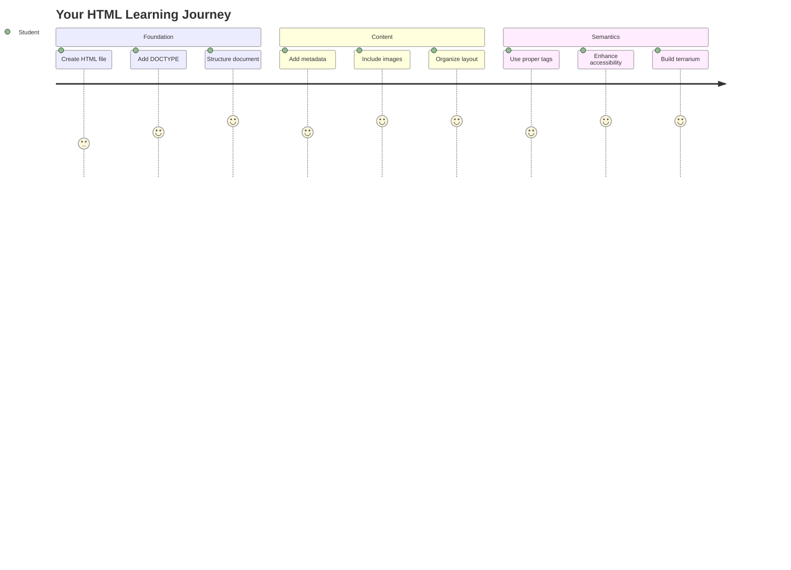
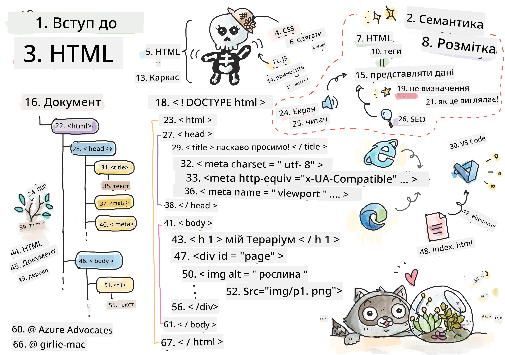
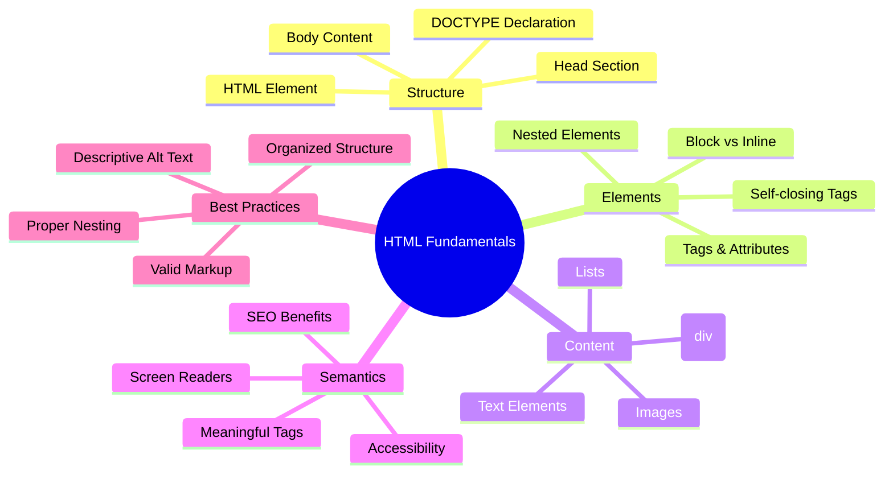
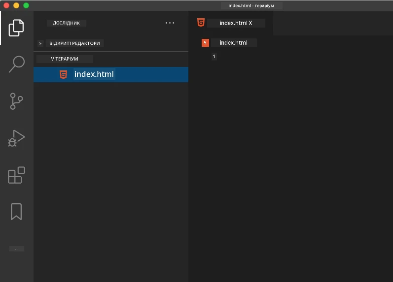
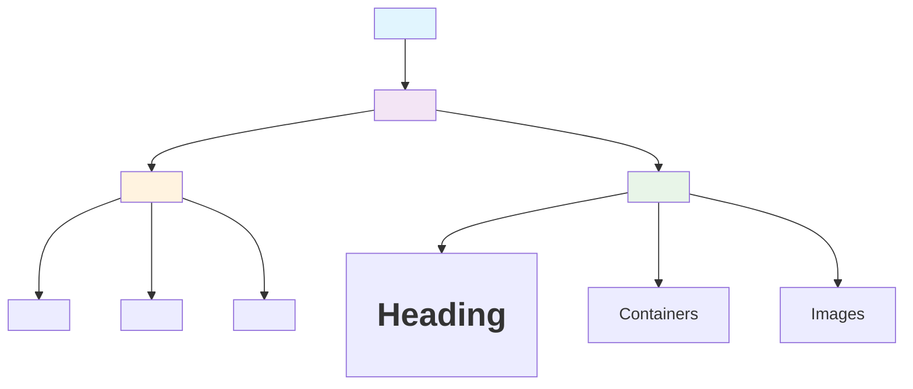
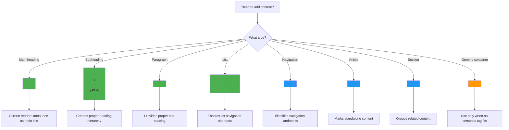
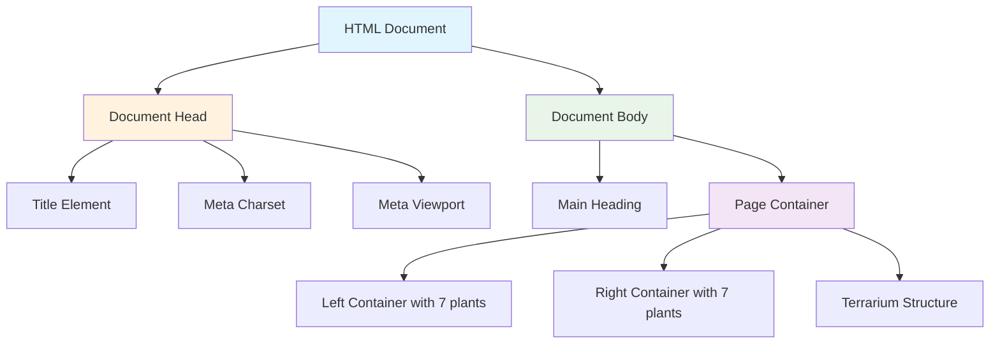
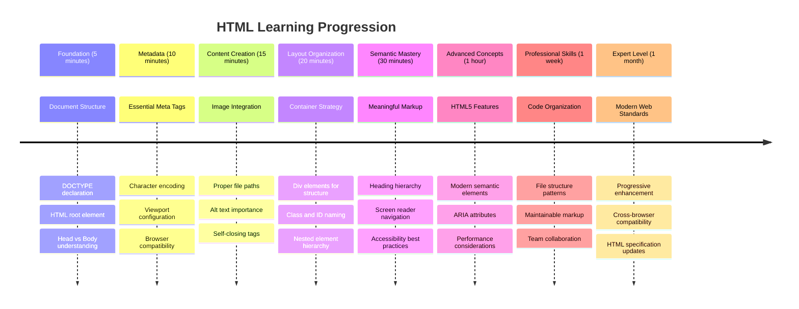

<!--
CO_OP_TRANSLATOR_METADATA:
{
  "original_hash": "3fcfa99c4897e051b558b5eaf1e8cc74",
  "translation_date": "2025-11-06T13:37:57+00:00",
  "source_file": "3-terrarium/1-intro-to-html/README.md",
  "language_code": "uk"
}
-->
# Проєкт "Тераріум" Частина 1: Вступ до HTML




> Скетчноут від [Tomomi Imura](https://twitter.com/girlie_mac)

HTML, або HyperText Markup Language, є основою кожного вебсайту, який ви коли-небудь відвідували. Уявіть HTML як скелет, який надає структуру вебсторінкам – він визначає, де розміщується контент, як він організований і що кожен елемент представляє. Хоча CSS пізніше "одягне" ваш HTML кольорами та макетами, а JavaScript оживить його інтерактивністю, HTML забезпечує основну структуру, яка робить усе інше можливим.

У цьому уроці ви створите HTML-структуру для інтерфейсу віртуального тераріуму. Цей практичний проєкт навчить вас основам HTML, одночасно створюючи щось візуально привабливе. Ви дізнаєтеся, як організовувати контент за допомогою семантичних елементів, працювати з зображеннями та створювати основу для інтерактивного вебдодатку.

До кінця цього уроку у вас буде готова HTML-сторінка, яка відображає зображення рослин в організованих колонках, готова до стилізації в наступному уроці. Не хвилюйтеся, якщо спочатку це виглядає просто – саме так має виглядати HTML перед тим, як CSS додасть візуальний блиск.



## Тест перед лекцією

[Тест перед лекцією](https://ff-quizzes.netlify.app/web/quiz/15)

> 📺 **Дивіться та навчайтеся**: Перегляньте це корисне відео-огляд
> 
> [](https://www.youtube.com/watch?v=1TvxJKBzhyQ)

## Налаштування вашого проєкту

Перед тим як зануритися в HTML-код, давайте налаштуємо правильне робоче середовище для вашого проєкту тераріуму. Створення організованої файлової структури з самого початку – це важлива звичка, яка буде корисною протягом вашого шляху веброзробки.

### Завдання: Створіть структуру проєкту

Ви створите спеціальну папку для вашого проєкту тераріуму та додасте ваш перший HTML-файл. Ось два підходи, які ви можете використовувати:

**Варіант 1: Використання Visual Studio Code**
1. Відкрийте Visual Studio Code
2. Натисніть "File" → "Open Folder" або використовуйте `Ctrl+K, Ctrl+O` (Windows/Linux) або `Cmd+K, Cmd+O` (Mac)
3. Створіть нову папку під назвою `terrarium` і виберіть її
4. У панелі Explorer натисніть на іконку "New File"
5. Назвіть ваш файл `index.html`



**Варіант 2: Використання команд терміналу**
```bash
mkdir terrarium
cd terrarium
touch index.html
code index.html
```

**Ось що роблять ці команди:**
- **Створюють** нову директорію під назвою `terrarium` для вашого проєкту
- **Переходять** у директорію `terrarium`
- **Створюють** порожній файл `index.html`
- **Відкривають** файл у Visual Studio Code для редагування

> 💡 **Порада**: Ім'я файлу `index.html` є особливим у веброзробці. Коли хтось відвідує вебсайт, браузери автоматично шукають `index.html` як сторінку за замовчуванням для відображення. Це означає, що URL, наприклад, `https://mysite.com/projects/`, автоматично відобразить файл `index.html` з папки `projects`, без необхідності вказувати ім'я файлу в URL.

## Розуміння структури HTML-документа

Кожен HTML-документ слідує певній структурі, яку браузери повинні розуміти та правильно відображати. Уявіть цю структуру як формальний лист – він має обов'язкові елементи в певному порядку, які допомагають отримувачу (у цьому випадку браузеру) правильно обробляти контент.



Давайте почнемо з додавання основи, яка потрібна кожному HTML-документу.

### Декларація DOCTYPE та кореневий елемент

Перші два рядки будь-якого HTML-файлу служать "вступом" документа для браузера:

```html
<!DOCTYPE html>
<html></html>
```

**Розуміння того, що робить цей код:**
- **Оголошує** тип документа як HTML5 за допомогою `<!DOCTYPE html>`
- **Створює** кореневий елемент `<html>`, який міститиме весь контент сторінки
- **Встановлює** сучасні вебстандарти для правильного відображення браузером
- **Забезпечує** узгоджене відображення на різних браузерах і пристроях

> 💡 **Порада VS Code**: Наведіть курсор на будь-який HTML-тег у VS Code, щоб побачити корисну інформацію з MDN Web Docs, включаючи приклади використання та деталі сумісності браузерів.

> 📚 **Дізнайтеся більше**: Декларація DOCTYPE запобігає переходу браузерів у "режим помилок", який використовувався для підтримки дуже старих вебсайтів. Сучасна веброзробка використовує просту декларацію `<!DOCTYPE html>` для забезпечення [відображення відповідно до стандартів](https://developer.mozilla.org/docs/Web/HTML/Quirks_Mode_and_Standards_Mode).

### 🔄 **Педагогічна перевірка**
**Зупиніться та подумайте**: Перед тим як продовжити, переконайтеся, що ви розумієте:
- ✅ Чому кожен HTML-документ потребує декларації DOCTYPE
- ✅ Що містить кореневий елемент `<html>`
- ✅ Як ця структура допомагає браузерам правильно відображати сторінки

**Швидкий самотест**: Чи можете ви пояснити своїми словами, що означає "відображення відповідно до стандартів"?

## Додавання основних метаданих документа

Секція `<head>` HTML-документа містить важливу інформацію, яку потребують браузери та пошукові системи, але яку відвідувачі не бачать безпосередньо на сторінці. Уявіть це як "закулісну" інформацію, яка допомагає вашій вебсторінці працювати правильно та виглядати коректно на різних пристроях і платформах.

Ці метадані повідомляють браузерам, як відображати вашу сторінку, яке кодування символів використовувати і як обробляти різні розміри екранів – усе це необхідно для створення професійних, доступних вебсторінок.

### Завдання: Додайте секцію документа Head

Вставте цю секцію `<head>` між вашими відкриваючим і закриваючим тегами `<html>`:

```html
<head>
	<title>Welcome to my Virtual Terrarium</title>
	<meta charset="utf-8" />
	<meta http-equiv="X-UA-Compatible" content="IE=edge" />
	<meta name="viewport" content="width=device-width, initial-scale=1" />
</head>
```

**Розбір того, що робить кожен елемент:**
- **Встановлює** заголовок сторінки, який з'являється на вкладках браузера та в результатах пошуку
- **Вказує** кодування символів UTF-8 для правильного відображення тексту у всьому світі
- **Забезпечує** сумісність із сучасними версіями Internet Explorer
- **Налаштовує** адаптивний дизайн, встановлюючи viewport відповідно до ширини пристрою
- **Контролює** початковий рівень масштабування для відображення контенту в природному розмірі

> 🤔 **Подумайте про це**: Що станеться, якщо ви встановите мета-тег viewport, наприклад, так: `<meta name="viewport" content="width=600">`? Це змусить сторінку завжди бути шириною 600 пікселів, порушуючи адаптивний дизайн! Дізнайтеся більше про [правильну конфігурацію viewport](https://developer.mozilla.org/docs/Web/HTML/Viewport_meta_tag).

## Створення тіла документа

Елемент `<body>` містить увесь видимий контент вашої вебсторінки – усе, що користувачі побачать і з чим взаємодіятимуть. Хоча секція `<head>` надавала інструкції браузеру, секція `<body>` містить фактичний контент: текст, зображення, кнопки та інші елементи, які створюють ваш інтерфейс користувача.

Давайте додамо структуру тіла та зрозуміємо, як HTML-теги працюють разом для створення змістовного контенту.

### Розуміння структури HTML-тегів

HTML використовує парні теги для визначення елементів. Більшість тегів мають відкриваючий тег, наприклад `<p>`, і закриваючий тег, наприклад `</p>`, з контентом між ними: `<p>Привіт, світ!</p>`. Це створює елемент абзацу, що містить текст "Привіт, світ!".

### Завдання: Додайте елемент Body

Оновіть ваш HTML-файл, щоб включити елемент `<body>`:

```html
<!DOCTYPE html>
<html>
	<head>
		<title>Welcome to my Virtual Terrarium</title>
		<meta charset="utf-8" />
		<meta http-equiv="X-UA-Compatible" content="IE=edge" />
		<meta name="viewport" content="width=device-width, initial-scale=1" />
	</head>
	<body></body>
</html>
```

**Ось що забезпечує ця повна структура:**
- **Встановлює** базову структуру HTML5-документа
- **Включає** основні метадані для правильного відображення браузером
- **Створює** порожнє тіло, готове для вашого видимого контенту
- **Слідує** сучасним найкращим практикам веброзробки

Тепер ви готові додати видимі елементи вашого тераріуму. Ми використаємо елементи `<div>` як контейнери для організації різних секцій контенту, а елементи `` для відображення зображень рослин.

### Робота із зображеннями та контейнерами макета

Зображення є особливими в HTML, оскільки вони використовують "самозакриваючі" теги. На відміну від елементів, таких як `<p></p>`, які обгортають контент, тег `` містить усю необхідну інформацію всередині самого тега за допомогою атрибутів, таких як `src` для шляху до файлу зображення та `alt` для доступності.

Перед додаванням зображень до вашого HTML вам потрібно правильно організувати файли вашого проєкту, створивши папку images і додавши графіку рослин.

**Спочатку налаштуйте ваші зображення:**
1. Створіть папку під назвою `images` всередині вашої папки проєкту тераріуму
2. Завантажте зображення рослин із [папки рішення](../../../../3-terrarium/solution/images) (всього 14 зображень рослин)
3. Скопіюйте всі зображення рослин у вашу нову папку `images`

### Завдання: Створіть макет відображення рослин

Тепер додайте зображення рослин, організовані в дві колонки, між вашими тегами `<body></body>`:

```html
<div id="page">
	<div id="left-container" class="container">
		<div class="plant-holder">
			
		</div>
		<div class="plant-holder">
			
		</div>
		<div class="plant-holder">
			
		</div>
		<div class="plant-holder">
			
		</div>
		<div class="plant-holder">
			
		</div>
		<div class="plant-holder">
			
		</div>
		<div class="plant-holder">
			
		</div>
	</div>
	<div id="right-container" class="container">
		<div class="plant-holder">
			
		</div>
		<div class="plant-holder">
			
		</div>
		<div class="plant-holder">
			
		</div>
		<div class="plant-holder">
			
		</div>
		<div class="plant-holder">
			
		</div>
		<div class="plant-holder">
			
		</div>
		<div class="plant-holder">
			
		</div>
	</div>
</div>
```

**Крок за кроком, ось що відбувається в цьому коді:**
- **Створює** головний контейнер сторінки з `id="page"` для утримання всього контенту
- **Встановлює** два контейнера колонок: `left-container` і `right-container`
- **Організовує** 7 рослин у лівій колонці та 7 рослин у правій колонці
- **Обгортає** кожне зображення рослини в div `plant-holder` для індивідуального позиціонування
- **Застосовує** узгоджені назви класів для стилізації CSS у наступному уроці
- **Призначає** унікальні ID кожному зображенню рослини для взаємодії з JavaScript пізніше
- **Включає** правильні шляхи до файлів, що вказують на папку images

> 🤔 **Подумайте про це**: Зверніть увагу, що всі зображення наразі мають однаковий текст alt "plant". Це не ідеально для доступності. Користувачі екранних читачів чули б "plant" 14 разів, не знаючи, яку конкретну рослину показує кожне зображення. Чи можете ви придумати кращий, більш описовий текст alt для кожного зображення?

> 📝 **Типи HTML-елементів**: Елементи `<div>` є "блоковими" і займають всю ширину, тоді як елементи `<span>` є "вбудованими" і займають лише необхідну ширину. Як ви думаєте, що станеться, якщо ви зміните всі ці теги `<div>` на теги `<span>`?

### 🔄 **Педагогічна перевірка**
**Розуміння структури**: Зробіть паузу, щоб переглянути вашу HTML-структуру:
- ✅ Чи можете ви визначити головні контейнери у вашому макеті?
- ✅ Чи розумієте ви, чому кожне зображення має унікальний ID?
- ✅ Як би ви описали призначення div `plant-holder`?

**Візуальна перевірка**: Відкрийте ваш HTML-файл у браузері. Ви повинні побачити:
- Базовий список зображень рослин
- Зображення, організовані в дві колонки
- Простий, нестилізований макет

**Запам'ятайте**: Цей простий вигляд – саме те, як HTML має виглядати перед стилізацією CSS!

З доданою розміткою рослини з'являться на екрані, хоча вони ще не виглядають довершено – для цього потрібен CSS у наступному уроці! На даний момент у вас є міцна HTML-основа, яка правильно організовує ваш контент і слідує найкращим практикам доступності.

## Використання семантичного HTML для доступності

Семантичний HTML означає вибір HTML-елементів на основі їх значення та призначення, а не лише їх зовнішнього вигляду. Коли ви використовуєте семантичну розмітку, ви передаєте структуру та значення вашого контенту браузерам, пошуковим системам і допоміжним технологіям, таким як екранні читачі.



Цей підхід робить ваші вебсайти більш доступними для користувачів з обмеженими можливостями та допомагає пошуковим системам краще розуміти ваш контент. Це фундаментальний принцип сучасної веброзробки, який створює кращий досвід для всіх.

### Додавання семантичного заголовка сторінки

Давайте додамо правильний заголовок до вашої сторінки тераріуму. Вставте цей рядок одразу після вашого відкриваючого тега `<body>`:

```html
<h1>My Terrarium</h1>
```

**Чому важлива семантична розмітка:**
- **Допомагає** екранним читачам орієнтуватися та розуміти структуру сторінки
- **Покращує** оптимізацію для пошукових систем (SEO), уточнюючи ієрархію контенту
- **Підвищує** доступність для користувачів із порушеннями зору або когнітивними особливостями
- **Створює** кращий користувацький досвід на всіх пристроях і платформах
- **Слідує** вебстандартам і найкращим практикам професійної розробки

**Приклади семантичного та несемантичного вибору:**

| Призначення | ✅ Семантичний вибір | ❌ Несемантичний вибір |
|-------------|---------------------|-----------------------|
| Основний заголовок | `<h1>Заголовок</h1>` | `<div class="big-text">Заголовок</div>` |
| Навігація | `<nav><ul><li></li></ul></nav>` | `<div class="menu"><div></div></div>` |
| Кнопка | `<button>Натисніть мене</button>` | `<span onclick="...">Натисніть мене</span>` |
| Контент статті | `<article><p></p></article>` | `<div class="content"><div></div></div>` |

>
- **Визначає** окремі елементи для кожного візуального компонента (верх, стіни, ґрунт, низ)
- **Включає** вкладені елементи для ефектів відбиття скла (глянцеві елементи)
- **Використовує** описові назви класів, які чітко вказують на призначення кожного елемента
- **Готує** структуру для CSS-стилізації, яка створить вигляд скляного тераріуму

> 🤔 **Зверніть увагу**: Хоча ви додали цю розмітку, на сторінці нічого нового не з'явилося! Це чудово ілюструє, як HTML забезпечує структуру, а CSS – зовнішній вигляд. Ці елементи `<div>` існують, але поки не мають візуального стилю – це буде в наступному уроці!



### 🔄 **Педагогічна перевірка**
**Опанування структури HTML**: Перед тим як рухатися далі, переконайтеся, що ви можете:
- ✅ Пояснити різницю між структурою HTML і візуальним виглядом
- ✅ Визначити семантичні та несемантичні елементи HTML
- ✅ Описати, як правильна розмітка покращує доступність
- ✅ Розпізнати повну структуру дерева документа

**Перевірка розуміння**: Спробуйте відкрити ваш HTML-файл у браузері з вимкненим JavaScript і CSS. Це покаже вам чисту семантичну структуру, яку ви створили!

---

## Виклик агента GitHub Copilot

Використовуйте режим Agent, щоб виконати наступний виклик:

**Опис:** Створіть семантичну HTML-структуру для розділу з рекомендаціями по догляду за рослинами, який можна додати до проекту тераріуму.

**Запит:** Створіть семантичний HTML-розділ, який включає головний заголовок "Рекомендації по догляду за рослинами", три підрозділи з заголовками "Полив", "Вимоги до освітлення" і "Догляд за ґрунтом", кожен з яких містить абзац інформації про догляд за рослинами. Використовуйте правильні семантичні HTML-теги, такі як `<section>`, `<h2>`, `<h3>` і `<p>`, щоб належним чином структурувати контент.

Дізнайтеся більше про [режим агента](https://code.visualstudio.com/blogs/2025/02/24/introducing-copilot-agent-mode) тут.

## Виклик "Історія HTML"

**Вивчення еволюції вебу**

HTML значно еволюціонував з моменту створення першого веб-браузера Тімом Бернерс-Лі в CERN у 1990 році. Деякі старі теги, такі як `<marquee>`, зараз застарілі, оскільки вони не відповідають сучасним стандартам доступності та принципам адаптивного дизайну.

**Спробуйте цей експеримент:**
1. Тимчасово обгорніть ваш заголовок `<h1>` у тег `<marquee>`: `<marquee><h1>Мій тераріум</h1></marquee>`
2. Відкрийте вашу сторінку в браузері та спостерігайте ефект прокрутки
3. Подумайте, чому цей тег був застарілий (підказка: подумайте про досвід користувача та доступність)
4. Видаліть тег `<marquee>` і поверніться до семантичної розмітки

**Питання для роздумів:**
- Як прокручуваний заголовок може вплинути на користувачів із порушеннями зору або чутливістю до руху?
- Які сучасні CSS-техніки можуть досягти схожих візуальних ефектів більш доступно?
- Чому важливо використовувати сучасні веб-стандарти замість застарілих елементів?

Дізнайтеся більше про [застарілі та заборонені HTML-елементи](https://developer.mozilla.org/docs/Web/HTML/Element#Obsolete_and_deprecated_elements), щоб зрозуміти, як веб-стандарти еволюціонують для покращення досвіду користувачів.

## Післялекційний тест

[Післялекційний тест](https://ff-quizzes.netlify.app/web/quiz/16)

## Огляд і самостійне навчання

**Поглибте свої знання HTML**

HTML є основою вебу вже понад 30 років, еволюціонуючи від простої мови розмітки документів до складної платформи для створення інтерактивних додатків. Розуміння цієї еволюції допомагає оцінити сучасні веб-стандарти та приймати кращі рішення для розробки.

**Рекомендовані шляхи навчання:**

1. **Історія та еволюція HTML**
   - Досліджуйте хронологію від HTML 1.0 до HTML5
   - Вивчайте, чому певні теги були застарілі (доступність, зручність для мобільних пристроїв, підтримка)
   - Досліджуйте нові функції HTML і пропозиції

2. **Глибоке занурення в семантичний HTML**
   - Вивчайте повний список [семантичних елементів HTML5](https://developer.mozilla.org/docs/Web/HTML/Element)
   - Практикуйте визначення, коли використовувати `<article>`, `<section>`, `<aside>` і `<main>`
   - Дізнайтеся про атрибути ARIA для покращеної доступності

3. **Сучасна веб-розробка**
   - Досліджуйте [створення адаптивних веб-сайтів](https://docs.microsoft.com/learn/modules/build-simple-website/?WT.mc_id=academic-77807-sagibbon) на Microsoft Learn
   - Зрозумійте, як HTML інтегрується з CSS і JavaScript
   - Вивчайте найкращі практики веб-продуктивності та SEO

**Питання для роздумів:**
- Які застарілі HTML-теги ви виявили, і чому вони були видалені?
- Які нові функції HTML пропонуються для майбутніх версій?
- Як семантичний HTML сприяє доступності вебу та SEO?

### ⚡ **Що ви можете зробити за наступні 5 хвилин**
- [ ] Відкрийте DevTools (F12) і перевірте HTML-структуру вашого улюбленого веб-сайту
- [ ] Створіть простий HTML-файл з базовими тегами: `<h1>`, `<p>` і ``
- [ ] Перевірте ваш HTML за допомогою онлайн-валідатора W3C HTML
- [ ] Спробуйте додати коментар до вашого HTML за допомогою `<!-- коментар -->`

### 🎯 **Що ви можете досягти за годину**
- [ ] Завершіть післялекційний тест і перегляньте концепції семантичного HTML
- [ ] Створіть просту веб-сторінку про себе, використовуючи правильну структуру HTML
- [ ] Експериментуйте з різними рівнями заголовків і тегами форматування тексту
- [ ] Додайте зображення та посилання, щоб попрактикувати інтеграцію мультимедіа
- [ ] Досліджуйте функції HTML5, які ви ще не пробували

### 📅 **Ваш тижневий шлях до HTML**
- [ ] Завершіть завдання проекту тераріуму з семантичною розміткою
- [ ] Створіть доступну веб-сторінку, використовуючи ARIA-мітки та ролі
- [ ] Практикуйте створення форм з різними типами введення
- [ ] Досліджуйте API HTML5, такі як localStorage або геолокація
- [ ] Вивчайте адаптивні HTML-шаблони та дизайн, орієнтований на мобільні пристрої
- [ ] Переглядайте HTML-код інших розробників для найкращих практик

### 🌟 **Ваш місячний шлях до основ вебу**
- [ ] Створіть портфоліо веб-сайт, який демонструє ваше володіння HTML
- [ ] Вивчайте шаблони HTML за допомогою фреймворків, таких як Handlebars
- [ ] Внесіть вклад у проекти з відкритим кодом, покращуючи документацію HTML
- [ ] Опануйте розширені концепції HTML, такі як користувацькі елементи
- [ ] Інтегруйте HTML з CSS-фреймворками та бібліотеками JavaScript
- [ ] Наставляйте інших, хто вивчає основи HTML

## 🎯 Ваш графік опанування HTML



### 🛠️ Підсумок вашого HTML-інструментарію

Після завершення цього уроку ви маєте:
- **Структура документа**: Повна основа HTML5 з правильним DOCTYPE
- **Семантична розмітка**: Значущі теги, які покращують доступність і SEO
- **Інтеграція зображень**: Правильна організація файлів і практики alt-тексту
- **Контейнери макета**: Стратегічне використання div з описовими назвами класів
- **Усвідомлення доступності**: Розуміння навігації екранних читачів
- **Сучасні стандарти**: Актуальні практики HTML5 і знання застарілих тегів
- **Основа проекту**: Міцна база для CSS-стилізації та інтерактивності JavaScript

**Наступні кроки**: Ваша структура HTML готова для CSS-стилізації! Семантична основа, яку ви створили, зробить наступний урок набагато легшим для розуміння.

## Завдання

[Практикуйте ваш HTML: Створіть макет блогу](assignment.md)

---

**Відмова від відповідальності**:  
Цей документ був перекладений за допомогою сервісу автоматичного перекладу [Co-op Translator](https://github.com/Azure/co-op-translator). Хоча ми прагнемо до точності, будь ласка, майте на увазі, що автоматичні переклади можуть містити помилки або неточності. Оригінальний документ на його рідній мові слід вважати авторитетним джерелом. Для критичної інформації рекомендується професійний людський переклад. Ми не несемо відповідальності за будь-які непорозуміння або неправильні тлумачення, що виникають внаслідок використання цього перекладу.