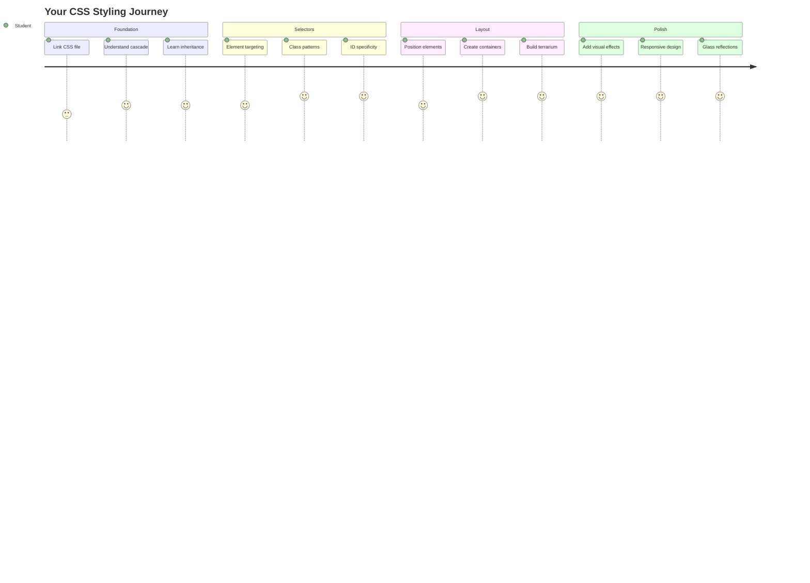
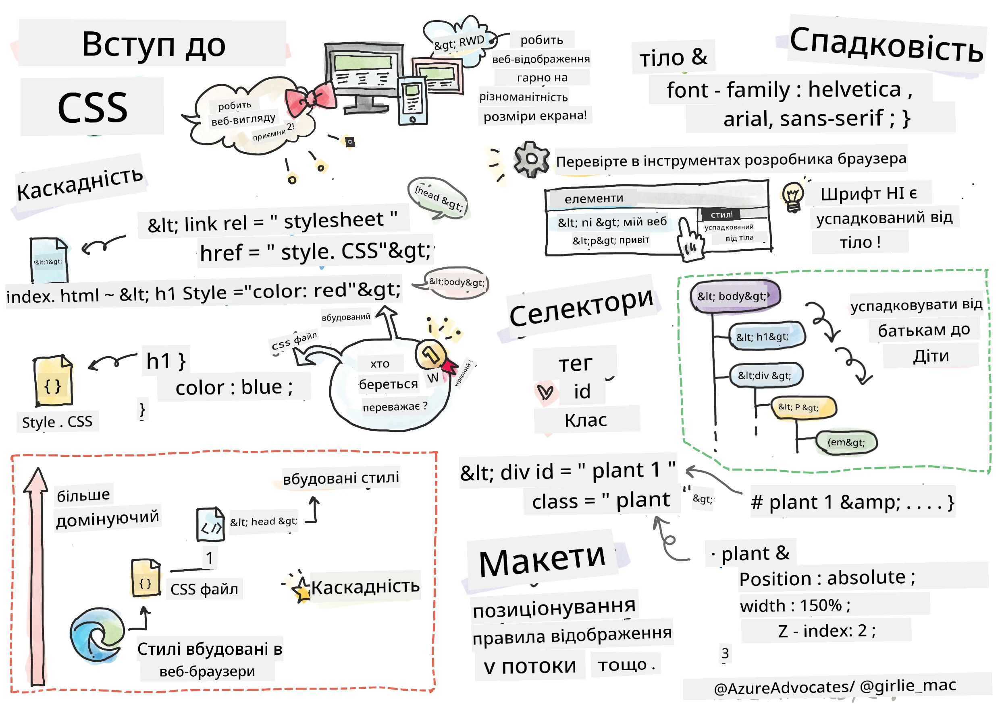
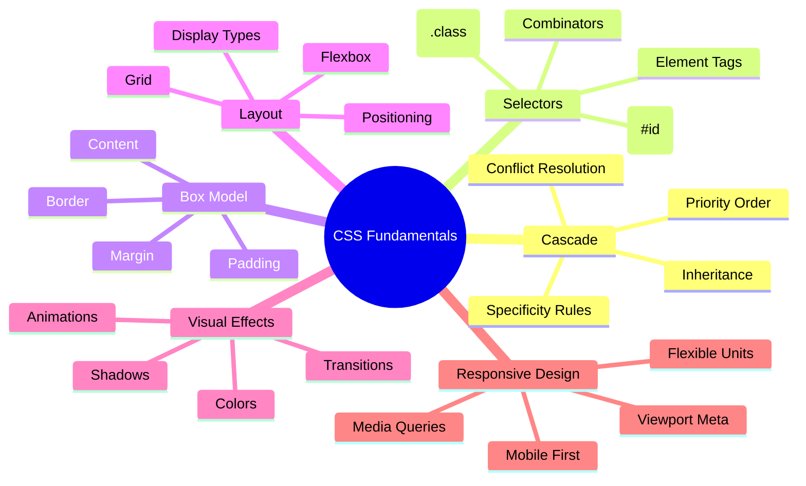
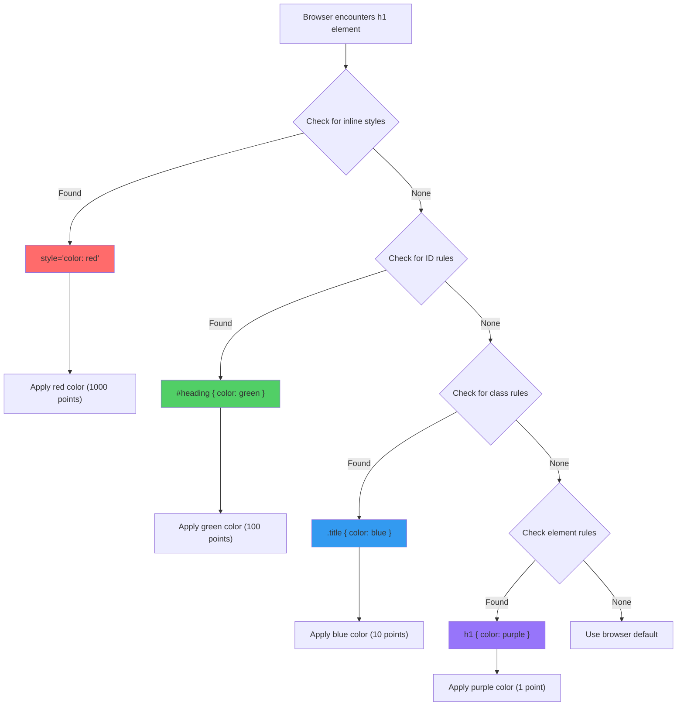
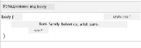
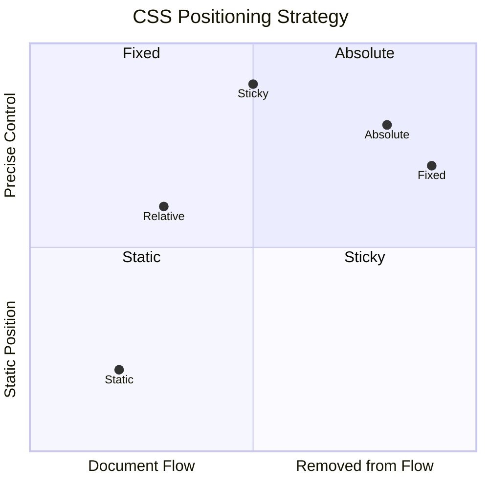
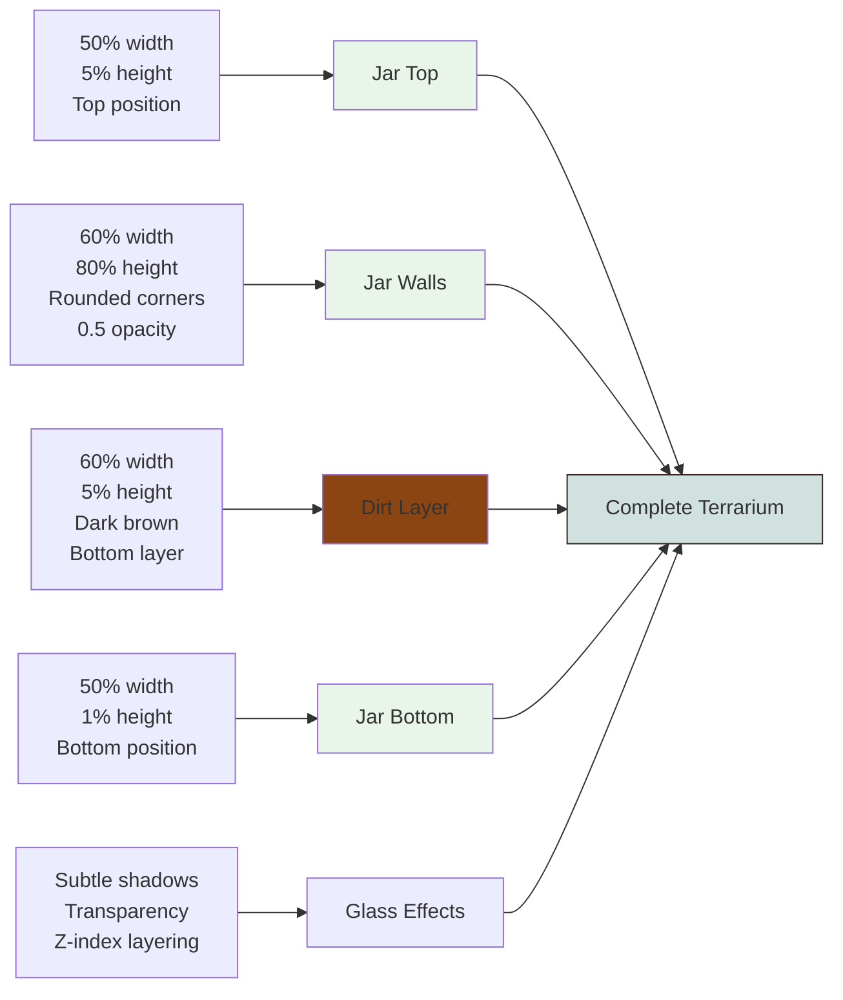
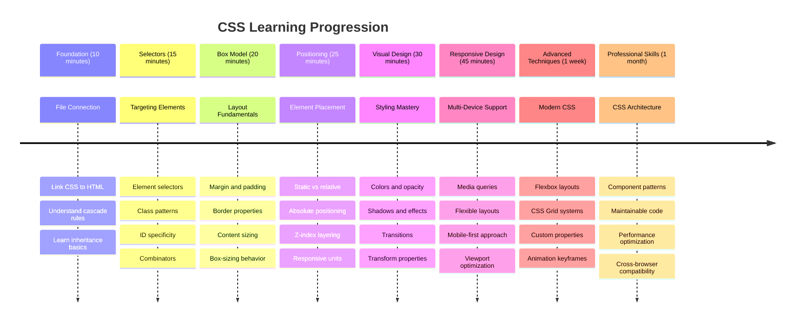

<!--
CO_OP_TRANSLATOR_METADATA:
{
  "original_hash": "e39f3a4e3bcccf94639e3af1248f8a4d",
  "translation_date": "2025-11-06T13:37:04+00:00",
  "source_file": "3-terrarium/2-intro-to-css/README.md",
  "language_code": "uk"
}
-->
# Проєкт "Тераріум", частина 2: Вступ до CSS




> Скетчноут від [Tomomi Imura](https://twitter.com/girlie_mac)

Пам'ятаєте, як ваш HTML-тераріум виглядав досить просто? Завдяки CSS ми перетворимо цю просту структуру на щось візуально привабливе.

Якщо HTML — це як будівництво каркасу будинку, то CSS — це все, що робить його затишним: кольори фарби, розташування меблів, освітлення та те, як кімнати гармонійно поєднуються. Подумайте, як палац Версаль починався як простий мисливський будиночок, але завдяки ретельній увазі до декору та планування перетворився на одну з найвеличніших будівель світу.

Сьогодні ми перетворимо ваш тераріум з функціонального на витончений. Ви навчитеся точно позиціонувати елементи, створювати макети, які адаптуються до різних розмірів екранів, і створювати візуальну привабливість, яка робить вебсайти захоплюючими.

До кінця цього уроку ви побачите, як стратегічне стилювання за допомогою CSS може значно покращити ваш проєкт. Додаймо стилю вашому тераріуму.



## Тест перед лекцією

[Тест перед лекцією](https://ff-quizzes.netlify.app/web/quiz/17)

## Початок роботи з CSS

CSS часто сприймається лише як спосіб "зробити речі красивими", але його призначення набагато ширше. CSS — це як режисер фільму: ви контролюєте не тільки те, як все виглядає, але й як рухається, реагує на взаємодію та адаптується до різних ситуацій.

Сучасний CSS має вражаючі можливості. Ви можете писати код, який автоматично налаштовує макети для телефонів, планшетів і настільних комп'ютерів. Ви можете створювати плавні анімації, які спрямовують увагу користувачів туди, де це потрібно. Результати можуть бути досить вражаючими, коли все працює разом.

> 💡 **Корисна порада**: CSS постійно розвивається з новими функціями та можливостями. Завжди перевіряйте [CanIUse.com](https://caniuse.com), щоб переконатися, що браузери підтримують нові функції CSS перед їх використанням у проєктах.

**Ось що ми досягнемо на цьому уроці:**
- **Створимо** повний візуальний дизайн для вашого тераріуму, використовуючи сучасні техніки CSS
- **Дослідимо** основні концепції, такі як каскад, спадковість і селектори CSS
- **Реалізуємо** стратегії адаптивного позиціонування та макетування
- **Побудуємо** контейнер для тераріуму, використовуючи форми та стилі CSS

### Передумови

Ви повинні завершити HTML-структуру для вашого тераріуму з попереднього уроку та підготувати її до стилювання.

> 📺 **Відеоресурс**: Перегляньте це корисне відео
>
> [](https://www.youtube.com/watch?v=6yIdOIV9p1I)

### Налаштування вашого CSS-файлу

Перед тим як почати стилювання, нам потрібно підключити CSS до нашого HTML. Це з'єднання повідомляє браузеру, де знайти інструкції зі стилювання для нашого тераріуму.

У папці вашого тераріуму створіть новий файл під назвою `style.css`, а потім зв'яжіть його у секції `<head>` вашого HTML-документа:

```html
<link rel="stylesheet" href="./style.css" />
```

**Ось що робить цей код:**
- **Створює** з'єднання між вашими HTML- та CSS-файлами
- **Повідомляє** браузеру завантажити та застосувати стилі з `style.css`
- **Використовує** атрибут `rel="stylesheet"`, щоб вказати, що це CSS-файл
- **Посилається** на шлях до файлу через `href="./style.css"`

## Розуміння каскаду CSS

Чому CSS називається "каскадними" таблицями стилів? Стилі спускаються вниз, як водоспад, і іноді конфліктують один з одним.

Уявіть, як працює військова командна структура: загальний наказ може сказати "всі солдати носять зелене", але конкретний наказ для вашого підрозділу може сказати "носіть синю форму для церемонії". Більш конкретна інструкція має пріоритет. CSS дотримується схожої логіки, і розуміння цієї ієрархії значно полегшує налагодження.

### Експеримент з пріоритетом каскаду

Давайте побачимо каскад у дії, створивши конфлікт стилів. Спочатку додайте стиль до вашого тегу `<h1>`:

```html
<h1 style="color: red">My Terrarium</h1>
```

**Що робить цей код:**
- **Застосовує** червоний колір безпосередньо до елемента `<h1>` за допомогою вбудованого стилю
- **Використовує** атрибут `style`, щоб вбудувати CSS безпосередньо в HTML
- **Створює** стиль з найвищим пріоритетом для цього конкретного елемента

Далі додайте це правило до вашого файлу `style.css`:

```css
h1 {
  color: blue;
}
```

**У наведеному вище коді ми:**
- **Визначили** правило CSS, яке націлене на всі елементи `<h1>`
- **Встановили** текстовий колір синім за допомогою зовнішнього стилю
- **Створили** правило з нижчим пріоритетом порівняно з вбудованими стилями

✅ **Перевірка знань**: Який колір відображається у вашому веб-додатку? Чому саме цей колір "перемагає"? Чи можете ви придумати сценарії, де вам може знадобитися перевизначити стилі?



> 💡 **Порядок пріоритету CSS (від найвищого до найнижчого):**
> 1. **Вбудовані стилі** (атрибут style)
> 2. **ID** (#myId)
> 3. **Класи** (.myClass) та атрибути
> 4. **Селектори елементів** (h1, div, p)
> 5. **Стандартні налаштування браузера**

## Спадковість CSS у дії

Спадковість CSS працює як генетика — елементи успадковують певні властивості від своїх батьківських елементів. Якщо ви встановите шрифт для елемента body, весь текст всередині автоматично використовуватиме той самий шрифт. Це схоже на те, як характерна щелепа родини Габсбургів з'являлася у поколіннях без необхідності вказувати її для кожного індивідуума.

Однак не все успадковується. Стилі тексту, такі як шрифти та кольори, успадковуються, але властивості макета, такі як відступи та рамки, — ні. Так само, як діти можуть успадковувати фізичні риси, але не модні уподобання своїх батьків.

### Спостереження за спадковістю шрифтів

Давайте побачимо спадковість у дії, встановивши шрифт для елемента `<body>`:

```css
body {
  font-family: 'Segoe UI', Tahoma, Geneva, Verdana, sans-serif;
}
```

**Розбираємо, що тут відбувається:**
- **Встановлює** шрифт для всієї сторінки, націлюючись на елемент `<body>`
- **Використовує** стек шрифтів з резервними варіантами для кращої сумісності з браузерами
- **Застосовує** сучасні системні шрифти, які виглядають чудово на різних операційних системах
- **Гарантує**, що всі дочірні елементи успадковують цей шрифт, якщо він не перевизначений

Відкрийте інструменти розробника вашого браузера (F12), перейдіть на вкладку Elements і перевірте ваш елемент `<h1>`. Ви побачите, що він успадковує шрифт від body:



✅ **Час експерименту**: Спробуйте встановити інші властивості, які можна успадкувати, для `<body>`, такі як `color`, `line-height` або `text-align`. Що відбувається з вашим заголовком та іншими елементами?

> 📝 **Властивості, які можна успадкувати**: `color`, `font-family`, `font-size`, `line-height`, `text-align`, `visibility`
>
> **Властивості, які не успадковуються**: `margin`, `padding`, `border`, `width`, `height`, `position`

### 🔄 **Педагогічна перевірка**
**Розуміння основ CSS**: Перед переходом до селекторів переконайтеся, що ви можете:
- ✅ Пояснити різницю між каскадом і спадковістю
- ✅ Передбачити, який стиль переможе у конфлікті специфічності
- ✅ Визначити, які властивості успадковуються від батьківських елементів
- ✅ Правильно підключити CSS-файли до HTML

**Швидкий тест**: Якщо у вас є ці стилі, якого кольору буде `<h1>` всередині `<div class="special">`?
```css
div { color: blue; }
.special { color: green; }
h1 { color: red; }
```
*Відповідь: Червоний (селектор елемента безпосередньо націлюється на h1)*

## Опанування селекторів CSS

Селектори CSS — це ваш спосіб націлюватися на конкретні елементи для стилювання. Вони працюють як точні вказівки — замість того, щоб сказати "будинок", ви можете сказати "синій будинок з червоними дверима на вулиці Maple".

CSS пропонує різні способи бути точним, і вибір правильного селектора — це як вибір відповідного інструмента для завдання. Іноді вам потрібно стилювати всі двері в районі, а іноді лише одну конкретну двері.

### Селектори елементів (теги)

Селектори елементів націлюються на HTML-елементи за їхнім тегом. Вони ідеально підходять для встановлення базових стилів, які застосовуються широко по всій сторінці:

```css
body {
  font-family: 'Segoe UI', Tahoma, Geneva, Verdana, sans-serif;
  margin: 0;
  padding: 0;
}

h1 {
  color: #3a241d;
  text-align: center;
  font-size: 2.5rem;
  margin-bottom: 1rem;
}
```

**Розуміння цих стилів:**
- **Встановлює** послідовну типографіку по всій сторінці за допомогою селектора `body`
- **Видаляє** стандартні відступи та поля браузера для кращого контролю
- **Стилює** всі заголовки кольором, вирівнюванням і відступами
- **Використовує** одиниці `rem` для масштабованого, доступного розміру шрифтів

Хоча селектори елементів добре працюють для загального стилювання, вам знадобляться більш специфічні селектори для стилювання окремих компонентів, таких як рослини у вашому тераріумі.

### Селектори ID для унікальних елементів

Селектори ID використовують символ `#` і націлюються на елементи з конкретними атрибутами `id`. Оскільки ID повинні бути унікальними на сторінці, вони ідеально підходять для стилювання окремих, особливих елементів, таких як наші контейнери для рослин зліва та справа.

Давайте створимо стилювання для бокових контейнерів нашого тераріуму, де будуть розташовані рослини:

```css
#left-container {
  background-color: #f5f5f5;
  width: 15%;
  left: 0;
  top: 0;
  position: absolute;
  height: 100vh;
  padding: 1rem;
  box-sizing: border-box;
}

#right-container {
  background-color: #f5f5f5;
  width: 15%;
  right: 0;
  top: 0;
  position: absolute;
  height: 100vh;
  padding: 1rem;
  box-sizing: border-box;
}
```

**Ось що робить цей код:**
- **Розташовує** контейнери на крайніх лівому та правому краях за допомогою абсолютного позиціонування
- **Використовує** одиниці `vh` (висота вікна перегляду) для адаптивної висоти, яка змінюється залежно від розміру екрана
- **Застосовує** `box-sizing: border-box`, щоб відступи включалися в загальну ширину
- **Видаляє** зайві одиниці `px` з нульових значень для чистішого коду
- **Встановлює** легкий фон, який виглядає приємніше для очей, ніж яскраво-сірий

✅ **Виклик якості коду**: Зверніть увагу, як цей CSS порушує принцип DRY (Don't Repeat Yourself). Чи можете ви рефакторувати його, використовуючи як ID, так і клас?

**Покращений підхід:**
```html
<div id="left-container" class="container"></div>
<div id="right-container" class="container"></div>
```

```css
.container {
  background-color: #f5f5f5;
  width: 15%;
  top: 0;
  position: absolute;
  height: 100vh;
  padding: 1rem;
  box-sizing: border-box;
}

#left-container {
  left: 0;
}

#right-container {
  right: 0;
}
```

### Селектори класів для повторюваних стилів

Селектори класів використовують символ `.` і ідеально підходять, коли ви хочете застосувати однакові стилі до кількох елементів. На відміну від ID, класи можна використовувати повторно в HTML, що робить їх ідеальними для послідовних стилів.

У нашому тераріумі кожна рослина потребує схожого стилювання, але також потребує індивідуального позиціонування. Ми використаємо комбінацію класів для спільних стилів і ID для унікального позиціонування.

**Ось структура HTML для кожної рослини:**
```html
<div class="plant-holder">
  
</div>
```

**Ключові елементи пояснені:**
- **Використовує** `class="plant-holder"` для послідовного стилювання контейнерів для всіх рослин
- **Застосовує** `class="plant"` для спільного стилювання зображень і поведінки
- **Включає** унікальний `id="plant1"` для індивідуального позиціонування та взаємодії з JavaScript
- **Надає** описовий текст alt для доступності екранних читачів

Тепер додайте ці стилі до вашого файлу `style.css`:

```css
.plant-holder {
  position: relative;
  height: 13%;
  left: -0.6rem;
}

.plant {
  position: absolute;
  max-width: 150%;
  max-height: 150%;
  z-index: 2;
  transition: transform 0.3s ease;
}

.plant:hover {
  transform: scale(1.05);
}
```

**Розбираємо ці стилі:**
- **Створює** відносне позиціонування для контейнера рослин, щоб встановити контекст позиціонування
- **Встановлює** кожен контейнер рослин на 13% висоти, забезпечуючи, що всі рослини поміщаються вертикально без прокрутки
- **Зміщує** контейнери трохи вліво для кращого центрування рослин у їхніх контейнерах
- **Дозволяє** рослинам масштабуватися адаптивно за допомогою властивостей `max-width` і `max-height`
- **Використовує** `z-index`, щоб розташувати рослини над іншими елементами в тераріумі
- **Додає** легкий ефект наведення за допомогою CSS-переходів для кращої взаємодії з користувачем

✅ **Критичне мислення**: Чому нам потрібні як `.plant-holder`, так і `.plant` селектори? Що станеться, якщо ми спробуємо використовувати лише один?

> 💡 **Шаблон дизайну**: Контейнер (`.plant-holder`) контролює макет і позиціонування, а вміст (`.plant`) контролює зовнішній вигляд і масштабування. Це розділення робить код більш підтримуваним і гнучким.

## Розуміння позиціонування CSS

Позиціонування CSS — це як бути режисером на сцені — ви керуєте тим, де стоять актори і як вони рухаються по сцені. Деякі актори дотримуються стандартного розташування, а інші потребують специфічного позиціонування для драматичного ефекту.

Коли ви зрозумієте позиціонування, багато проблем з макетом стануть керованими. Потрібна панель навігації, яка залишається вгорі, поки користувачі прокручують сторінку? Позиціонування вирішує це. Хочете, щоб підказка з'являлася в певному місці? Це теж позиціонування.

### П'ять значень позиціонування



| Значення позиціонування | Поведінка | Використання |
|--------------------------|-----------|--------------|
|
- Як зміниться макет, якщо `.plant-holder` використовуватиме `absolute` замість `relative`?
- Що відбувається, коли ви змінюєте позиціонування `.plant` на `relative`?

### 🔄 **Педагогічна перевірка**
**Опанування позиціонування в CSS**: Зупиніться, щоб перевірити своє розуміння:
- ✅ Чи можете ви пояснити, чому рослини потребують абсолютного позиціонування для функції перетягування?
- ✅ Чи розумієте, як контейнери з відносним позиціонуванням створюють контекст для позиціонування?
- ✅ Чому бічні контейнери використовують абсолютне позиціонування?
- ✅ Що станеться, якщо повністю прибрати декларації позиціонування?

**Зв'язок із реальним світом**: Подумайте, як позиціонування в CSS відображає реальні макети:
- **Static**: Книги на полиці (природний порядок)
- **Relative**: Злегка перемістити книгу, залишаючи її на місці
- **Absolute**: Покласти закладку на конкретну сторінку
- **Fixed**: Липка нотатка, яка залишається видимою при перегортанні сторінок

## Створення тераріуму за допомогою CSS

Тепер ми створимо скляну банку, використовуючи лише CSS — без зображень чи графічного програмного забезпечення.

Створення реалістичного скла, тіней і ефектів глибини за допомогою позиціонування та прозорості демонструє візуальні можливості CSS. Ця техніка нагадує, як архітектори руху Баухаус використовували прості геометричні форми для створення складних, красивих структур. Як тільки ви зрозумієте ці принципи, ви зможете розпізнати CSS-техніки, які стоять за багатьма веб-дизайнами.



### Створення компонентів скляної банки

Давайте створимо тераріумну банку по частинах. Кожна частина використовує абсолютне позиціонування та розміри на основі відсотків для адаптивного дизайну:

```css
.jar-walls {
  height: 80%;
  width: 60%;
  background: #d1e1df;
  border-radius: 1rem;
  position: absolute;
  bottom: 0.5%;
  left: 20%;
  opacity: 0.5;
  z-index: 1;
  box-shadow: inset 0 0 2rem rgba(0, 0, 0, 0.1);
}

.jar-top {
  width: 50%;
  height: 5%;
  background: #d1e1df;
  position: absolute;
  bottom: 80.5%;
  left: 25%;
  opacity: 0.7;
  z-index: 1;
  border-radius: 0.5rem 0.5rem 0 0;
}

.jar-bottom {
  width: 50%;
  height: 1%;
  background: #d1e1df;
  position: absolute;
  bottom: 0;
  left: 25%;
  opacity: 0.7;
  border-radius: 0 0 0.5rem 0.5rem;
}

.dirt {
  width: 60%;
  height: 5%;
  background: #3a241d;
  position: absolute;
  border-radius: 0 0 1rem 1rem;
  bottom: 1%;
  left: 20%;
  opacity: 0.7;
  z-index: -1;
}
```

**Розуміння конструкції тераріуму:**
- **Використовує** розміри на основі відсотків для адаптивного масштабування на всіх розмірах екрана
- **Позиціонує** елементи абсолютно для точного складання та вирівнювання
- **Застосовує** різні значення прозорості для створення ефекту прозорості скла
- **Реалізує** шарування за допомогою `z-index`, щоб рослини виглядали всередині банки
- **Додає** тонкі тіні та вдосконалений `border-radius` для більш реалістичного вигляду

### Адаптивний дизайн за допомогою відсотків

Зверніть увагу, як усі розміри використовують відсотки, а не фіксовані значення в пікселях:

**Чому це важливо:**
- **Забезпечує**, що тераріум пропорційно масштабується на будь-якому розмірі екрана
- **Підтримує** візуальні зв’язки між компонентами банки
- **Забезпечує** послідовний досвід від мобільних телефонів до великих моніторів
- **Дозволяє** дизайну адаптуватися без порушення візуального макета

### Одиниці CSS у дії

Ми використовуємо одиниці `rem` для `border-radius`, які масштабуються відносно розміру шрифту кореня. Це створює більш доступні дизайни, які враховують уподобання користувача щодо шрифтів. Дізнайтеся більше про [відносні одиниці CSS](https://www.w3.org/TR/css-values-3/#font-relative-lengths) в офіційній специфікації.

✅ **Візуальний експеримент**: Спробуйте змінити ці значення та спостерігайте за ефектами:
- Змініть прозорість банки з 0.5 на 0.8 – як це впливає на вигляд скла?
- Змініть колір ґрунту з `#3a241d` на `#8B4513` – який візуальний вплив це має?
- Змініть `z-index` ґрунту на 2 – що відбувається з шаруванням?

### 🔄 **Педагогічна перевірка**
**Розуміння візуального дизайну CSS**: Переконайтеся, що ви зрозуміли візуальний CSS:
- ✅ Як розміри на основі відсотків створюють адаптивний дизайн?
- ✅ Чому прозорість створює ефект прозорості скла?
- ✅ Яку роль відіграє `z-index` у шаруванні елементів?
- ✅ Як значення `border-radius` створюють форму банки?

**Принцип дизайну**: Зверніть увагу, як ми створюємо складні візуальні ефекти з простих форм:
1. **Прямокутники** → **Закруглені прямокутники** → **Компоненти банки**
2. **Плоскі кольори** → **Прозорість** → **Ефект скла**
3. **Окремі елементи** → **Шаруватий склад** → **3D вигляд**

---

## Виклик GitHub Copilot Agent 🚀

Використовуйте режим Agent, щоб виконати наступний виклик:

**Опис:** Створіть CSS-анімацію, яка змушує рослини в тераріумі ніжно хитатися, імітуючи природний ефект вітру. Це допоможе вам попрактикуватися в CSS-анімаціях, трансформаціях і ключових кадрах, а також покращить візуальну привабливість вашого тераріуму.

**Підказка:** Додайте анімації ключових кадрів CSS, щоб рослини в тераріумі ніжно хиталися з боку в бік. Створіть анімацію хитання, яка трохи обертає кожну рослину (на 2-3 градуси) вліво і вправо з тривалістю 3-4 секунди, і застосуйте її до класу `.plant`. Переконайтеся, що анімація повторюється нескінченно і має функцію easing для природного руху.

Дізнайтеся більше про [режим Agent](https://code.visualstudio.com/blogs/2025/02/24/introducing-copilot-agent-mode) тут.

## 🚀 Виклик: Додавання відображень скла

Готові покращити ваш тераріум реалістичними відображеннями скла? Ця техніка додасть глибини та реалістичності дизайну.

Ви створите тонкі відблиски, які імітують, як світло відбивається від скляних поверхонь. Цей підхід схожий на те, як художники епохи Відродження, такі як Ян ван Ейк, використовували світло і відображення, щоб зробити намальоване скло тривимірним. Ось до чого ви прагнете:


**Ваш виклик:**
- **Створіть** тонкі овальні форми білого або світлого кольору для відображень скла
- **Розмістіть** їх стратегічно на лівій стороні банки
- **Застосуйте** відповідну прозорість і ефекти розмиття для реалістичного відображення світла
- **Використовуйте** `border-radius`, щоб створити органічні, схожі на бульбашки форми
- **Експериментуйте** з градієнтами або тінями для покращення реалістичності

## Післялекційний тест

[Післялекційний тест](https://ff-quizzes.netlify.app/web/quiz/18)

## Розширте свої знання CSS

CSS може здаватися складним на початку, але розуміння цих основних концепцій забезпечує міцну основу для більш складних технік.

**Ваші наступні області навчання CSS:**
- **Flexbox** - спрощує вирівнювання та розподіл елементів
- **CSS Grid** - надає потужні інструменти для створення складних макетів
- **CSS Variables** - зменшує повторення та покращує підтримку
- **Адаптивний дизайн** - забезпечує гарну роботу сайтів на різних розмірах екрана

### Інтерактивні навчальні ресурси

Практикуйте ці концепції за допомогою цих захоплюючих інтерактивних ігор:
- 🐸 [Flexbox Froggy](https://flexboxfroggy.com/) - Опануйте Flexbox через веселі завдання
- 🌱 [Grid Garden](https://codepip.com/games/grid-garden/) - Вивчайте CSS Grid, вирощуючи віртуальну моркву
- 🎯 [CSS Battle](https://cssbattle.dev/) - Перевірте свої навички CSS за допомогою кодових викликів

### Додаткове навчання

Для всебічного вивчення основ CSS пройдіть цей модуль Microsoft Learn: [Style your HTML app with CSS](https://docs.microsoft.com/learn/modules/build-simple-website/4-css-basics/?WT.mc_id=academic-77807-sagibbon)

### ⚡ **Що ви можете зробити за наступні 5 хвилин**
- [ ] Відкрийте DevTools і перевірте стилі CSS на будь-якому веб-сайті за допомогою панелі Elements
- [ ] Створіть простий CSS-файл і зв’яжіть його з HTML-сторінкою
- [ ] Спробуйте змінити кольори різними методами: hex, RGB і названі кольори
- [ ] Практикуйте модель коробки, додаючи відступи та поля до div

### 🎯 **Що ви можете досягти за цю годину**
- [ ] Завершіть післялекційний тест і перегляньте основи CSS
- [ ] Стилізуйте свою HTML-сторінку за допомогою шрифтів, кольорів і відступів
- [ ] Створіть простий макет за допомогою flexbox або grid
- [ ] Експериментуйте з переходами CSS для плавних ефектів
- [ ] Практикуйте адаптивний дизайн за допомогою медіа-запитів

### 📅 **Ваш тижневий CSS-пригодницький план**
- [ ] Завершіть завдання зі стилізації тераріуму з творчим підходом
- [ ] Опануйте CSS Grid, створивши макет фотогалереї
- [ ] Вивчіть CSS-анімації, щоб оживити ваші дизайни
- [ ] Досліджуйте CSS-препроцесори, такі як Sass або Less
- [ ] Вивчайте принципи дизайну та застосовуйте їх до вашого CSS
- [ ] Аналізуйте та відтворюйте цікаві дизайни, які ви знайдете в Інтернеті

### 🌟 **Ваш місячний план опанування дизайну**
- [ ] Створіть повну систему дизайну адаптивного веб-сайту
- [ ] Вивчіть CSS-in-JS або фреймворки з утилітарним підходом, такі як Tailwind
- [ ] Внесіть вклад у проекти з відкритим кодом, покращуючи CSS
- [ ] Опануйте складні концепції CSS, такі як користувацькі властивості CSS і containment
- [ ] Створіть бібліотеки компонентів із модульним CSS
- [ ] Наставляйте інших, хто вивчає CSS, і діліться знаннями про дизайн

## 🎯 Ваш графік опанування CSS



### 🛠️ Підсумок вашого CSS-інструментарію

Після завершення цього уроку ви тепер маєте:
- **Розуміння каскаду**: Як стилі успадковуються та перекривають один одного
- **Опанування селекторів**: Точне націлювання на елементи, класи та ID
- **Навички позиціонування**: Стратегічне розміщення та шарування елементів
- **Візуальний дизайн**: Створення ефектів скла, тіней і прозорості
- **Адаптивні техніки**: Макети на основі відсотків, які адаптуються до будь-якого екрана
- **Організація коду**: Чиста, підтримувана структура CSS
- **Сучасні практики**: Використання відносних одиниць і доступних шаблонів дизайну

**Наступні кроки**: Ваш тераріум тепер має як структуру (HTML), так і стиль (CSS). Останній урок додасть інтерактивність за допомогою JavaScript!

## Завдання

[Рефакторинг CSS](assignment.md)

---

**Відмова від відповідальності**:  
Цей документ був перекладений за допомогою сервісу автоматичного перекладу [Co-op Translator](https://github.com/Azure/co-op-translator). Хоча ми прагнемо до точності, будь ласка, майте на увазі, що автоматичні переклади можуть містити помилки або неточності. Оригінальний документ на його рідній мові слід вважати авторитетним джерелом. Для критичної інформації рекомендується професійний людський переклад. Ми не несемо відповідальності за будь-які непорозуміння або неправильні тлумачення, що виникають внаслідок використання цього перекладу.