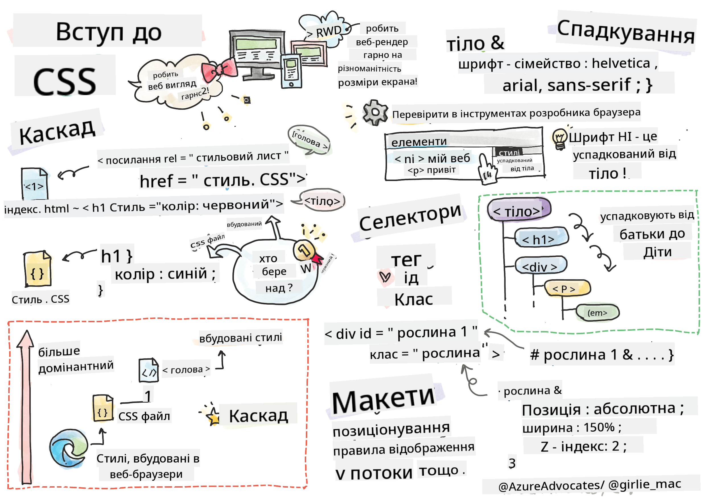
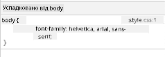
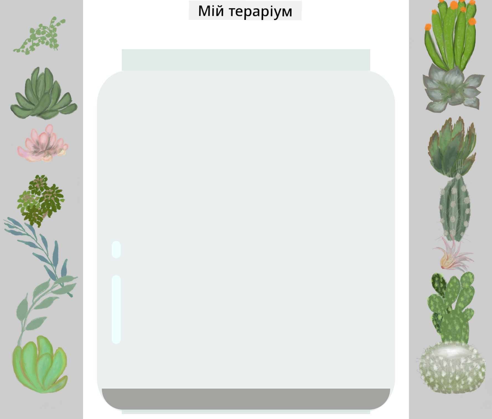

<!--
CO_OP_TRANSLATOR_METADATA:
{
  "original_hash": "e375c2aeb94e2407f2667633d39580bd",
  "translation_date": "2025-08-27T22:36:40+00:00",
  "source_file": "3-terrarium/2-intro-to-css/README.md",
  "language_code": "uk"
}
-->
# Проєкт "Тераріум", Частина 2: Вступ до CSS

  
> Скетчноут від [Tomomi Imura](https://twitter.com/girlie_mac)

## Передлекційна вікторина

[Передлекційна вікторина](https://ashy-river-0debb7803.1.azurestaticapps.net/quiz/17)

### Вступ

CSS, або каскадні таблиці стилів, вирішують важливу проблему веброзробки: як зробити ваш вебсайт привабливим. Стилізація ваших додатків робить їх більш зручними та естетичними; також за допомогою CSS можна створювати адаптивний вебдизайн (Responsive Web Design, RWD), що дозволяє вашим додаткам виглядати добре незалежно від розміру екрана. CSS — це не лише про зовнішній вигляд; його специфікація включає анімації та трансформації, які дозволяють створювати складні взаємодії у ваших додатках. Робоча група CSS допомагає підтримувати актуальність специфікацій CSS; ви можете стежити за їхньою роботою на [сайті World Wide Web Consortium](https://www.w3.org/Style/CSS/members).

> Зверніть увагу, CSS — це мова, яка постійно розвивається, як і все у вебі, і не всі браузери підтримують нові частини специфікації. Завжди перевіряйте свої реалізації, звертаючись до [CanIUse.com](https://caniuse.com).

У цьому уроці ми додамо стилі до нашого онлайн-тераріуму та дізнаємося більше про кілька концепцій CSS: каскадність, наслідування, використання селекторів, позиціонування та створення макетів за допомогою CSS. У процесі ми створимо макет тераріуму та сам тераріум.

### Передумови

Ви повинні мати HTML для вашого тераріуму, готовий до стилізації.

> Перегляньте відео

> 
> [](https://www.youtube.com/watch?v=6yIdOIV9p1I)

### Завдання

У папці вашого тераріуму створіть новий файл під назвою `style.css`. Підключіть цей файл у секції `<head>`:

```html
<link rel="stylesheet" href="./style.css" />
```

---

## Каскадність

Каскадні таблиці стилів включають ідею, що стилі "каскадують", тобто застосування стилю визначається його пріоритетом. Стилі, задані автором вебсайту, мають пріоритет над стилями, заданими браузером. Стилі, задані "вбудовано" (inline), мають пріоритет над стилями у зовнішньому файлі стилів.

### Завдання

Додайте вбудований стиль "color: red" до вашого тегу `<h1>`:

```HTML
<h1 style="color: red">My Terrarium</h1>
```

Потім додайте наступний код до вашого файлу `style.css`:

```CSS
h1 {
 color: blue;
}
```

✅ Який колір відображається у вашому вебдодатку? Чому? Чи можете ви знайти спосіб перевизначити стилі? Коли ви б хотіли це зробити, а коли ні?

---

## Наслідування

Стилі наслідуються від предка до нащадка, тобто вкладені елементи наслідують стилі своїх батьків.

### Завдання

Задайте шрифт для тіла (`body`) і перевірте, чи наслідує вкладений елемент цей шрифт:

```CSS
body {
	font-family: helvetica, arial, sans-serif;
}
```

Відкрийте консоль вашого браузера на вкладці 'Elements' і спостерігайте за шрифтом H1. Він наслідує свій шрифт від тіла, як зазначено у браузері:



✅ Чи можете ви зробити так, щоб вкладений стиль наслідував іншу властивість?

---

## Селектори CSS

### Теги

На даний момент ваш файл `style.css` має лише кілька стилізованих тегів, і додаток виглядає досить дивно:

```CSS
body {
	font-family: helvetica, arial, sans-serif;
}

h1 {
	color: #3a241d;
	text-align: center;
}
```

Такий спосіб стилізації тегу дає вам контроль над унікальними елементами, але вам потрібно контролювати стилі багатьох рослин у вашому тераріумі. Для цього вам потрібно використовувати селектори CSS.

### Ідентифікатори (Ids)

Додайте трохи стилів для розташування лівого та правого контейнерів. Оскільки є лише один лівий контейнер і один правий контейнер, їм у розмітці присвоєно ідентифікатори. Щоб стилізувати їх, використовуйте `#`:

```CSS
#left-container {
	background-color: #eee;
	width: 15%;
	left: 0px;
	top: 0px;
	position: absolute;
	height: 100%;
	padding: 10px;
}

#right-container {
	background-color: #eee;
	width: 15%;
	right: 0px;
	top: 0px;
	position: absolute;
	height: 100%;
	padding: 10px;
}
```

Тут ви розмістили ці контейнери з абсолютним позиціонуванням зліва та справа від екрана, а також використали відсотки для їхньої ширини, щоб вони могли масштабуватися для невеликих мобільних екранів.

✅ Цей код досить повторюваний, тобто не відповідає принципу "DRY" (Don't Repeat Yourself). Чи можете ви знайти кращий спосіб стилізувати ці ідентифікатори, можливо, використовуючи ідентифікатор та клас? Вам потрібно буде змінити розмітку та рефакторити CSS:

```html
<div id="left-container" class="container"></div>
```

### Класи

У наведеному вище прикладі ви стилізували два унікальні елементи на екрані. Якщо ви хочете, щоб стилі застосовувалися до багатьох елементів на екрані, ви можете використовувати класи CSS. Зробіть це для розташування рослин у лівому та правому контейнерах.

Зверніть увагу, що кожна рослина в HTML-розмітці має комбінацію ідентифікаторів та класів. Ідентифікатори тут використовуються JavaScript, який ви додасте пізніше, для маніпуляції розташуванням рослин у тераріумі. Класи ж надають усім рослинам певний стиль.

```html
<div class="plant-holder">
	
</div>
```

Додайте наступне до вашого файлу `style.css`:

```CSS
.plant-holder {
	position: relative;
	height: 13%;
	left: -10px;
}

.plant {
	position: absolute;
	max-width: 150%;
	max-height: 150%;
	z-index: 2;
}
```

Примітно в цьому фрагменті змішування відносного та абсолютного позиціонування, яке ми розглянемо в наступному розділі. Зверніть увагу на те, як висоти обробляються у відсотках:

Ви встановили висоту тримача рослин на 13%, що є хорошим значенням, щоб усі рослини відображалися у кожному вертикальному контейнері без необхідності прокручування.

Ви змістили тримач рослин вліво, щоб рослини були більш центровані в межах їхнього контейнера. Зображення мають великий обсяг прозорого фону, щоб зробити їх більш зручними для перетягування, тому їх потрібно змістити вліво, щоб краще вписатися на екрані.

Потім самій рослині надано максимальну ширину 150%. Це дозволяє їй масштабуватися вниз разом із масштабуванням браузера. Спробуйте змінити розмір вашого браузера; рослини залишаються у своїх контейнерах, але масштабуються вниз, щоб вписатися.

Також примітно використання z-index, який контролює відносну висоту елемента (щоб рослини розташовувалися поверх контейнера і виглядали так, ніби вони знаходяться всередині тераріуму).

✅ Чому вам потрібні як тримач рослин, так і селектор рослин у CSS?

## Позиціонування в CSS

Змішування властивостей позиціонування (існують статичне, відносне, фіксоване, абсолютне та липке позиціонування) може бути трохи складним, але якщо зроблено правильно, це дає вам хороший контроль над елементами на ваших сторінках.

Абсолютно позиціоновані елементи розташовуються відносно найближчих позиціонованих предків, а якщо таких немає, то відносно тіла документа.

Відносно позиціоновані елементи розташовуються на основі вказівок CSS щодо їхнього зміщення від початкової позиції.

У нашому прикладі `plant-holder` є елементом із відносним позиціонуванням, який розташовується всередині контейнера з абсолютним позиціонуванням. Результат полягає в тому, що бічні контейнери закріплені зліва та справа, а `plant-holder` вкладений, регулюючи себе всередині бічних контейнерів, залишаючи місце для розташування рослин у вертикальному ряду.

> Сам `plant` також має абсолютне позиціонування, необхідне для того, щоб зробити його перетягуваним, як ви дізнаєтеся в наступному уроці.

✅ Експериментуйте зі зміною типів позиціонування бічних контейнерів і `plant-holder`. Що відбувається?

## Макети в CSS

Тепер ви використаєте те, що дізналися, щоб створити сам тераріум, використовуючи лише CSS!

Спочатку стилізуйте дочірні елементи `.terrarium` як заокруглений прямокутник за допомогою CSS:

```CSS
.jar-walls {
	height: 80%;
	width: 60%;
	background: #d1e1df;
	border-radius: 1rem;
	position: absolute;
	bottom: 0.5%;
	left: 20%;
	opacity: 0.5;
	z-index: 1;
}

.jar-top {
	width: 50%;
	height: 5%;
	background: #d1e1df;
	position: absolute;
	bottom: 80.5%;
	left: 25%;
	opacity: 0.7;
	z-index: 1;
}

.jar-bottom {
	width: 50%;
	height: 1%;
	background: #d1e1df;
	position: absolute;
	bottom: 0%;
	left: 25%;
	opacity: 0.7;
}

.dirt {
	width: 60%;
	height: 5%;
	background: #3a241d;
	position: absolute;
	border-radius: 0 0 1rem 1rem;
	bottom: 1%;
	left: 20%;
	opacity: 0.7;
	z-index: -1;
}
```

Зверніть увагу на використання відсотків тут. Якщо ви зменшите масштаб вашого браузера, ви побачите, як банка також масштабується. Також зверніть увагу на відсотки ширини та висоти для елементів банки і на те, як кожен елемент абсолютно позиціонується в центрі, закріплений у нижній частині вікна перегляду.

Ми також використовуємо `rem` для border-radius, що є відносною до шрифту одиницею виміру. Дізнайтеся більше про цей тип відносного вимірювання у [специфікації CSS](https://www.w3.org/TR/css-values-3/#font-relative-lengths).

✅ Спробуйте змінити кольори банки та прозорість у порівнянні з кольорами ґрунту. Що відбувається? Чому?

---

## 🚀 Виклик

Додайте "блискучу" відблиск у нижній лівій частині банки, щоб вона виглядала більш схожою на скло. Ви будете стилізувати `.jar-glossy-long` і `.jar-glossy-short`, щоб вони виглядали як відблиск. Ось як це виглядатиме:



Щоб завершити післялекційну вікторину, пройдіть цей модуль Learn: [Стилізуйте ваш HTML-додаток за допомогою CSS](https://docs.microsoft.com/learn/modules/build-simple-website/4-css-basics/?WT.mc_id=academic-77807-sagibbon)

## Післялекційна вікторина

[Післялекційна вікторина](https://ashy-river-0debb7803.1.azurestaticapps.net/quiz/18)

## Огляд і самостійне навчання

CSS здається оманливо простим, але є багато викликів при спробі ідеально стилізувати додаток для всіх браузерів і всіх розмірів екранів. CSS-Grid і Flexbox — це інструменти, розроблені для того, щоб зробити роботу трохи більш структурованою та надійною. Дізнайтеся про ці інструменти, граючи в [Flexbox Froggy](https://flexboxfroggy.com/) і [Grid Garden](https://codepip.com/games/grid-garden/).

## Завдання

[Рефакторинг CSS](assignment.md)

---

**Відмова від відповідальності**:  
Цей документ був перекладений за допомогою сервісу автоматичного перекладу [Co-op Translator](https://github.com/Azure/co-op-translator). Хоча ми прагнемо до точності, будь ласка, майте на увазі, що автоматичні переклади можуть містити помилки або неточності. Оригінальний документ на його рідній мові слід вважати авторитетним джерелом. Для критичної інформації рекомендується професійний людський переклад. Ми не несемо відповідальності за будь-які непорозуміння або неправильні тлумачення, що виникають внаслідок використання цього перекладу.