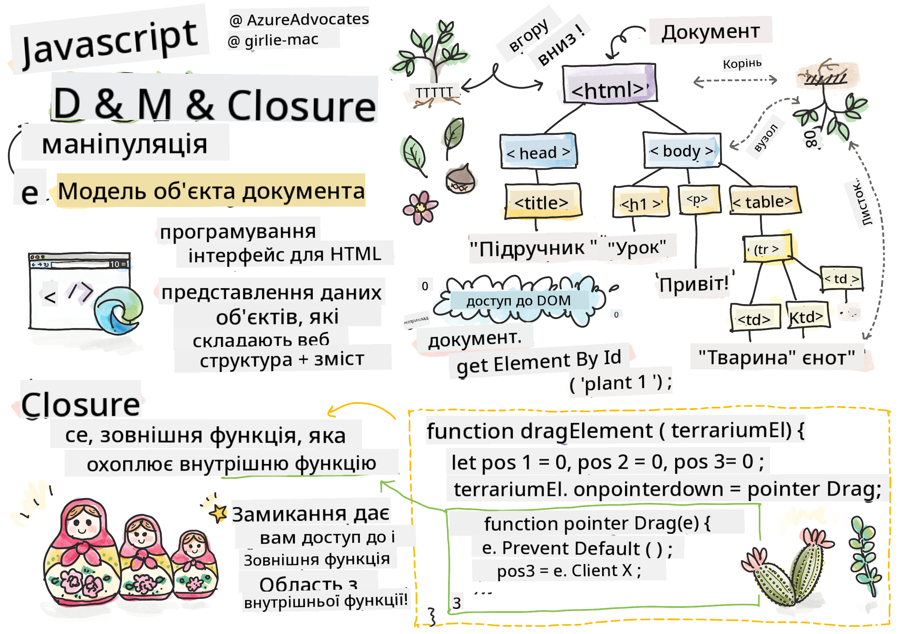
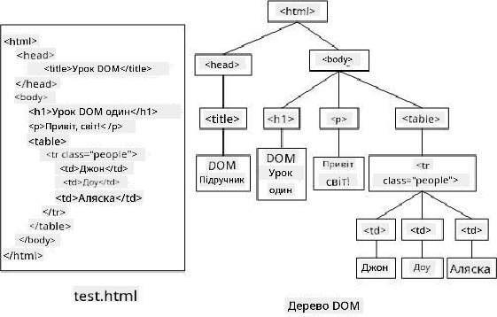
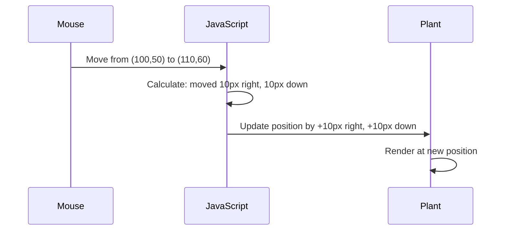
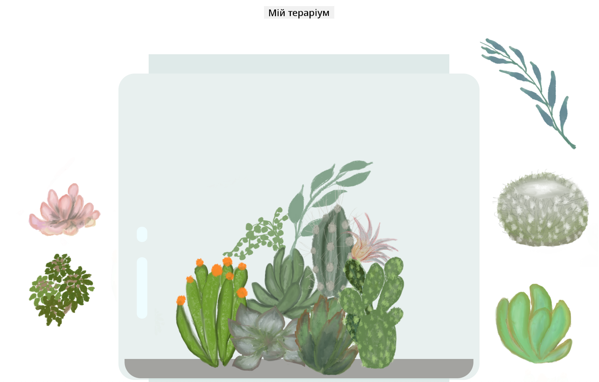

<!--
CO_OP_TRANSLATOR_METADATA:
{
  "original_hash": "bc93f6285423033ebf5b8abeb5282888",
  "translation_date": "2025-10-24T15:40:36+00:00",
  "source_file": "3-terrarium/3-intro-to-DOM-and-closures/README.md",
  "language_code": "uk"
}
-->
# Проєкт "Тераріум", частина 3: Маніпуляція DOM і замикання в JavaScript


> Скетчнот від [Tomomi Imura](https://twitter.com/girlie_mac)

Ласкаво просимо до одного з найцікавіших аспектів веб-розробки — створення інтерактивності! Document Object Model (DOM) — це як міст між вашим HTML і JavaScript, і сьогодні ми використаємо його, щоб оживити ваш тераріум. Коли Тім Бернерс-Лі створив перший веб-браузер, він уявляв веб як динамічний і інтерактивний простір — DOM робить це бачення реальністю.

Ми також дослідимо замикання в JavaScript, які спочатку можуть здатися складними. Уявіть замикання як створення "кишень пам'яті", де ваші функції можуть зберігати важливу інформацію. Це як кожна рослина в вашому тераріумі має власний запис даних для відстеження свого положення. До кінця цього уроку ви зрозумієте, наскільки природними і корисними вони є.

Ось що ми створюємо: тераріум, де користувачі можуть перетягувати рослини куди завгодно. Ви навчитеся технікам маніпуляції DOM, які забезпечують все — від перетягування файлів до інтерактивних ігор. Давайте оживимо ваш тераріум.

## Тест перед лекцією

[Тест перед лекцією](https://ff-quizzes.netlify.app/web/quiz/19)

## Розуміння DOM: ваш шлях до інтерактивних веб-сторінок

Document Object Model (DOM) — це спосіб, яким JavaScript взаємодіє з вашими елементами HTML. Коли ваш браузер завантажує HTML-сторінку, він створює структуроване представлення цієї сторінки в пам'яті — це і є DOM. Уявіть це як сімейне дерево, де кожен HTML-елемент — це член сім'ї, до якого JavaScript може отримати доступ, змінити або переставити.

Маніпуляція DOM перетворює статичні сторінки на інтерактивні веб-сайти. Кожного разу, коли ви бачите, як кнопка змінює колір при наведенні, контент оновлюється без перезавантаження сторінки або елементи можна перетягувати — це робота DOM.



> Представлення DOM і HTML-розмітки, яка його посилається. Від [Olfa Nasraoui](https://www.researchgate.net/publication/221417012_Profile-Based_Focused_Crawler_for_Social_Media-Sharing_Websites)

**Ось що робить DOM потужним:**
- **Надає** структурований спосіб доступу до будь-якого елемента на вашій сторінці
- **Дозволяє** динамічно оновлювати контент без перезавантаження сторінки
- **Забезпечує** миттєву реакцію на взаємодії користувача, такі як кліки та перетягування
- **Створює** основу для сучасних інтерактивних веб-додатків

## Замикання в JavaScript: створення організованого, потужного коду

[Замикання в JavaScript](https://developer.mozilla.org/docs/Web/JavaScript/Closures) — це як надання функції її власного приватного робочого простору з постійною пам'яттю. Уявіть, як у в'юрків Дарвіна на Галапагоських островах кожен розвинув спеціалізований дзьоб залежно від свого середовища — замикання працюють аналогічно, створюючи спеціалізовані функції, які "запам'ятовують" свій специфічний контекст навіть після завершення роботи батьківської функції.

У нашому тераріумі замикання допомагають кожній рослині незалежно запам'ятовувати своє положення. Цей шаблон часто використовується в професійній розробці JavaScript, тому це важливе поняття для розуміння.

> 💡 **Розуміння замикань**: Замикання — це значуща тема в JavaScript, і багато розробників використовують їх роками, перш ніж повністю зрозуміти всі теоретичні аспекти. Сьогодні ми зосередимося на практичному застосуванні — ви побачите, як замикання природно виникають під час створення наших інтерактивних функцій. Розуміння розвиватиметься, коли ви побачите, як вони вирішують реальні проблеми.


> Представлення DOM і HTML-розмітки, яка його посилається. Від [Olfa Nasraoui](https://www.researchgate.net/publication/221417012_Profile-Based_Focused_Crawler_for_Social_Media-Sharing_Websites)

У цьому уроці ми завершимо наш інтерактивний проєкт тераріуму, створивши JavaScript, який дозволить користувачеві маніпулювати рослинами на сторінці.

## Перед початком: підготовка до успіху

Вам знадобляться ваші HTML і CSS файли з попередніх уроків про тераріум — ми збираємося зробити цей статичний дизайн інтерактивним. Якщо ви приєднуєтеся вперше, завершення тих уроків спочатку забезпечить важливий контекст.

Ось що ми створимо:
- **Плавне перетягування** для всіх рослин у тераріумі
- **Відстеження координат**, щоб рослини запам'ятовували свої позиції
- **Повний інтерактивний інтерфейс** за допомогою чистого JavaScript
- **Чистий, організований код** із використанням шаблонів замикань

## Налаштування вашого JavaScript-файлу

Давайте створимо JavaScript-файл, який зробить ваш тераріум інтерактивним.

**Крок 1: Створіть ваш файл скрипта**

У вашій папці тераріуму створіть новий файл під назвою `script.js`.

**Крок 2: Зв'яжіть JavaScript із вашим HTML**

Додайте цей тег скрипта до секції `<head>` вашого файлу `index.html`:

```html
<script src="./script.js" defer></script>
```

**Чому атрибут `defer` важливий:**
- **Гарантує**, що ваш JavaScript чекає, поки весь HTML буде завантажений
- **Запобігає** помилкам, коли JavaScript шукає елементи, які ще не готові
- **Гарантує**, що всі ваші елементи рослин доступні для взаємодії
- **Забезпечує** кращу продуктивність, ніж розміщення скриптів внизу сторінки

> ⚠️ **Важлива примітка**: Атрибут `defer` запобігає поширеним проблемам із часом виконання. Без нього JavaScript може спробувати отримати доступ до HTML-елементів до їх завантаження, що спричиняє помилки.

---

## Зв'язок JavaScript із вашими HTML-елементами

Перш ніж ми зможемо зробити елементи перетягуваними, JavaScript повинен знайти їх у DOM. Уявіть це як систему каталогізації бібліотеки — як тільки у вас є номер каталогу, ви можете знайти саме ту книгу, яка вам потрібна, і отримати доступ до всього її вмісту.

Ми використаємо метод `document.getElementById()`, щоб встановити ці зв'язки. Це як мати точну систему файлів — ви надаєте ID, і він знаходить саме той елемент, який вам потрібен у вашому HTML.

### Увімкнення функціональності перетягування для всіх рослин

Додайте цей код до вашого файлу `script.js`:

```javascript
// Enable drag functionality for all 14 plants
dragElement(document.getElementById('plant1'));
dragElement(document.getElementById('plant2'));
dragElement(document.getElementById('plant3'));
dragElement(document.getElementById('plant4'));
dragElement(document.getElementById('plant5'));
dragElement(document.getElementById('plant6'));
dragElement(document.getElementById('plant7'));
dragElement(document.getElementById('plant8'));
dragElement(document.getElementById('plant9'));
dragElement(document.getElementById('plant10'));
dragElement(document.getElementById('plant11'));
dragElement(document.getElementById('plant12'));
dragElement(document.getElementById('plant13'));
dragElement(document.getElementById('plant14'));
```

**Ось що робить цей код:**
- **Знаходить** кожен елемент рослини в DOM за його унікальним ID
- **Отримує** JavaScript-посилання на кожен HTML-елемент
- **Передає** кожен елемент до функції `dragElement` (яку ми створимо далі)
- **Готує** кожну рослину до взаємодії перетягування
- **З'єднує** вашу HTML-структуру з функціональністю JavaScript

> 🎯 **Чому використовувати ID замість класів?** ID забезпечують унікальні ідентифікатори для конкретних елементів, тоді як CSS-класи призначені для стилізації груп елементів. Коли JavaScript потрібно маніпулювати окремими елементами, ID пропонують точність і продуктивність, які нам потрібні.

> 💡 **Порада**: Зверніть увагу, як ми викликаємо `dragElement()` для кожної рослини окремо. Такий підхід гарантує, що кожна рослина отримує свою незалежну поведінку перетягування, що є важливим для плавної взаємодії користувача.

---

## Створення замикання для функції dragElement

Тепер ми створимо серце нашої функціональності перетягування: замикання, яке керує поведінкою перетягування для кожної рослини. Це замикання міститиме кілька внутрішніх функцій, які працюють разом, щоб відстежувати рухи миші та оновлювати позиції елементів.

Замикання ідеально підходять для цього завдання, оскільки дозволяють створювати "приватні" змінні, які зберігаються між викликами функцій, забезпечуючи кожній рослині її власну незалежну систему відстеження координат.

### Розуміння замикань на простому прикладі

Дозвольте мені продемонструвати замикання на простому прикладі, який ілюструє концепцію:

```javascript
function createCounter() {
    let count = 0; // This is like a private variable
    
    function increment() {
        count++; // The inner function remembers the outer variable
        return count;
    }
    
    return increment; // We're giving back the inner function
}

const myCounter = createCounter();
console.log(myCounter()); // 1
console.log(myCounter()); // 2
```

**Ось що відбувається в цьому шаблоні замикання:**
- **Створює** приватну змінну `count`, яка існує лише в цьому замиканні
- **Внутрішня функція** може отримати доступ і змінити цю зовнішню змінну (механізм замикання)
- **Коли ми повертаємо** внутрішню функцію, вона зберігає зв'язок із цими приватними даними
- **Навіть після** завершення виконання `createCounter()`, `count` зберігається і пам'ятає своє значення

### Чому замикання ідеально підходять для функціональності перетягування

Для нашого тераріуму кожна рослина повинна запам'ятовувати свої поточні координати. Замикання забезпечують ідеальне рішення:

**Основні переваги для нашого проєкту:**
- **Зберігає** приватні змінні позиції для кожної рослини незалежно
- **Забезпечує** збереження даних координат між подіями перетягування
- **Запобігає** конфліктам змінних між різними перетягуваними елементами
- **Створює** чисту, організовану структуру коду

> 🎯 **Ціль навчання**: Вам не потрібно зараз повністю освоювати всі аспекти замикань. Зосередьтеся на тому, як вони допомагають нам організувати код і зберігати стан для нашої функціональності перетягування.

### Створення функції dragElement

Тепер давайте створимо основну функцію, яка буде обробляти всю логіку перетягування. Додайте цю функцію нижче ваших декларацій елементів рослин:

```javascript
function dragElement(terrariumElement) {
    // Initialize position tracking variables
    let pos1 = 0,  // Previous mouse X position
        pos2 = 0,  // Previous mouse Y position  
        pos3 = 0,  // Current mouse X position
        pos4 = 0;  // Current mouse Y position
    
    // Set up the initial drag event listener
    terrariumElement.onpointerdown = pointerDrag;
}
```

**Розуміння системи відстеження позиції:**
- **`pos1` і `pos2`**: Зберігають різницю між старими і новими позиціями миші
- **`pos3` і `pos4`**: Відстежують поточні координати миші
- **`terrariumElement`**: Конкретний елемент рослини, який ми робимо перетягуваним
- **`onpointerdown`**: Подія, яка активується, коли користувач починає перетягування

**Ось як працює шаблон замикання:**
- **Створює** приватні змінні позиції для кожного елемента рослини
- **Зберігає** ці змінні протягом усього циклу перетягування
- **Гарантує**, що кожна рослина відстежує свої координати незалежно
- **Забезпечує** чистий інтерфейс через функцію `dragElement`

### Чому використовувати Pointer Events?

Ви можете запитати, чому ми використовуємо `onpointerdown` замість більш знайомого `onclick`. Ось пояснення:

| Тип події | Найкраще для | Недолік |
|-----------|--------------|---------|
| `onclick` | Просте натискання кнопки | Не може обробляти перетягування (лише натискання і відпускання) |
| `onpointerdown` | Миша і сенсорний екран | Новіший, але добре підтримується |
| `onmousedown` | Тільки миша на ПК | Не працює для мобільних користувачів |

**Чому pointer events ідеально підходять для того, що ми створюємо:**
- **Чудово працюють**, незалежно від того, чи використовує хтось мишу, палець або навіть стилус
- **Однаково зручно** на ноутбуці, планшеті або телефоні
- **Обробляють** фактичний рух перетягування (а не просто натискання і відпускання)
- **Забезпечують** плавний досвід, який очікують користувачі сучасних веб-додатків

> 💡 **Майбутнє використання**: Pointer events — це сучасний спосіб обробки взаємодії користувачів. Замість написання окремого коду для миші і сенсорного екрану, ви отримуєте обидва варіанти без додаткових зусиль. Досить зручно, чи не так?

---

## Функція pointerDrag: захоплення початку перетягування

Коли користувач натискає на рослину (за допомогою кліку миші або торкання пальцем), функція `pointerDrag` починає діяти. Ця функція захоплює початкові координати і налаштовує систему перетягування.

Додайте цю функцію всередині вашого замикання `dragElement`, одразу після рядка `terrariumElement.onpointerdown = pointerDrag;`:

```javascript
function pointerDrag(e) {
    // Prevent default browser behavior (like text selection)
    e.preventDefault();
    
    // Capture the initial mouse/touch position
    pos3 = e.clientX;  // X coordinate where drag started
    pos4 = e.clientY;  // Y coordinate where drag started
    
    // Set up event listeners for the dragging process
    document.onpointermove = elementDrag;
    document.onpointerup = stopElementDrag;
}
```

**Крок за кроком, ось що відбувається:**
- **Запобігає** стандартним поведінкам браузера, які можуть заважати перетягуванню
- **Записує** точні координати, де користувач почав жест перетягування
- **Встановлює** слухачі подій для поточного руху перетягування
- **Готує** систему до відстеження руху миші/пальця по всьому документу

### Розуміння запобігання подій

Рядок `e.preventDefault()` є ключовим для плавного перетягування:

**Без запобігання браузери можуть:**
- **Виділяти** текст під час перетягування по сторінці
- **Викликати** контекстні меню при перетягуванні правою кнопкою миші
- **Заважати** нашій кастомній поведінці перетягування
- **Створювати** візуальні артефакти під час операції перетягування

> 🔍 **Експеримент**: Після завершення цього уроку спробуйте видалити `e.preventDefault()` і подивіться, як це вплине на досвід перетягування. Ви швидко зрозумієте, чому цей рядок є необхідним!

### Система відстеження координат

Властивості `e.clientX` і `e.clientY` надають нам точні координати миші/дотику:

| Властивість | Що вимірює | Використання |
|-------------|------------|--------------|
| `clientX` | Горизонтальне положення відносно області перегляду | Відстеження руху вліво-вправо |
| `clientY` | Вертикальне положення відносно області перегляду | Відстеження руху вгору-вниз |

**Розуміння цих координат:**
- **Надає** точну інформацію про позицію в пікселях
- **Оновлюється** в реальному час
- **`pos3` і `pos4`**: Зберігають поточну позицію миші для наступного розрахунку
- **`offsetTop` і `offsetLeft`**: Отримують поточну позицію елемента на сторінці
- **Логіка віднімання**: Переміщує елемент на ту ж відстань, на яку перемістилася миша

**Ось розбір розрахунку руху:**
1. **Вимірює** різницю між старою і новою позицією миші
2. **Розраховує**, наскільки потрібно перемістити елемент, виходячи з руху миші
3. **Оновлює** властивості позиції CSS елемента в реальному часі
4. **Зберігає** нову позицію як базову для наступного розрахунку руху

### Візуальне представлення математики



### Функція stopElementDrag: очищення

Додайте функцію очищення після закриваючої фігурної дужки `elementDrag`:

```javascript
function stopElementDrag() {
    // Remove the document-level event listeners
    document.onpointerup = null;
    document.onpointermove = null;
}
```

**Чому очищення важливе:**
- **Запобігає** витоку пам'яті через залишкові слухачі подій
- **Зупиняє** поведінку перетягування, коли користувач відпускає рослину
- **Дозволяє** іншим елементам перетягуватися незалежно
- **Скидає** систему для наступної операції перетягування

**Що відбувається без очищення:**
- Слухачі подій продовжують працювати навіть після завершення перетягування
- Продуктивність знижується через накопичення невикористаних слухачів
- Несподівана поведінка при взаємодії з іншими елементами
- Ресурси браузера витрачаються на непотрібну обробку подій

### Розуміння властивостей позиції CSS

Наша система перетягування маніпулює двома ключовими властивостями CSS:

| Властивість | Що контролює | Як ми її використовуємо |
|-------------|--------------|-------------------------|
| `top` | Відстань від верхнього краю | Вертикальне позиціонування під час перетягування |
| `left` | Відстань від лівого краю | Горизонтальне позиціонування під час перетягування |

**Ключові моменти про властивості offset:**
- **`offsetTop`**: Поточна відстань від верхнього краю позиціонованого батьківського елемента
- **`offsetLeft`**: Поточна відстань від лівого краю позиціонованого батьківського елемента
- **Контекст позиціонування**: Ці значення відносні до найближчого позиціонованого предка
- **Оновлення в реальному часі**: Зміни відбуваються негайно, коли ми змінюємо властивості CSS

> 🎯 **Філософія дизайну**: Ця система перетягування навмисно гнучка – немає "зон скидання" чи обмежень. Користувачі можуть розміщувати рослини де завгодно, отримуючи повний творчий контроль над дизайном свого тераріуму.

## Об'єднання всього: ваша повна система перетягування

Вітаємо! Ви щойно створили складну систему перетягування за допомогою чистого JavaScript. Ваша повна функція `dragElement` тепер містить потужну замкнутість, яка управляє:

**Що досягає ваша замкнутість:**
- **Зберігає** приватні змінні позиції для кожної рослини незалежно
- **Обробляє** повний життєвий цикл перетягування від початку до кінця
- **Забезпечує** плавний, чутливий рух по всьому екрану
- **Очищає** ресурси належним чином, щоб запобігти витоку пам'яті
- **Створює** інтуїтивний, творчий інтерфейс для дизайну тераріуму

### Тестування вашого інтерактивного тераріуму

Тепер протестуйте ваш інтерактивний тераріум! Відкрийте ваш файл `index.html` у веб-браузері і спробуйте функціонал:

1. **Клацніть і утримуйте** будь-яку рослину, щоб почати перетягування
2. **Переміщуйте мишу або палець** і спостерігайте, як рослина плавно слідує
3. **Відпустіть**, щоб залишити рослину в новій позиції
4. **Експериментуйте** з різними розташуваннями, щоб дослідити інтерфейс

🥇 **Досягнення**: Ви створили повністю інтерактивний веб-додаток, використовуючи основні концепції, які щодня використовують професійні розробники. Ця функціональність перетягування використовує ті ж принципи, що й завантаження файлів, канбан-дошки та багато інших інтерактивних інтерфейсів.



---

## Виклик GitHub Copilot Agent 🚀

Використовуйте режим Agent, щоб виконати наступний виклик:

**Опис:** Покращіть проект тераріуму, додавши функціонал скидання, який повертає всі рослини до їхніх початкових позицій з плавними анімаціями.

**Підказка:** Створіть кнопку скидання, яка при натисканні анімує всі рослини назад до їхніх початкових позицій на бічній панелі, використовуючи CSS-переходи. Функція повинна зберігати початкові позиції при завантаженні сторінки і плавно переміщувати рослини назад до цих позицій протягом 1 секунди при натисканні кнопки скидання.

Дізнайтеся більше про [режим Agent](https://code.visualstudio.com/blogs/2025/02/24/introducing-copilot-agent-mode) тут.

## 🚀 Додатковий виклик: розширте свої навички

Готові вивести ваш тераріум на новий рівень? Спробуйте реалізувати ці покращення:

**Творчі розширення:**
- **Подвійний клік** на рослину, щоб перемістити її на передній план (маніпуляція z-index)
- **Додайте візуальний зворотний зв'язок**, наприклад, легке сяйво при наведенні на рослини
- **Реалізуйте межі**, щоб запобігти перетягуванню рослин за межі тераріуму
- **Створіть функцію збереження**, яка запам'ятовує позиції рослин за допомогою localStorage
- **Додайте звукові ефекти** для підняття і розміщення рослин

> 💡 **Можливість навчання**: Кожен із цих викликів навчить вас новим аспектам маніпуляції DOM, обробки подій і дизайну користувацького досвіду.

## Післялекційний тест

[Післялекційний тест](https://ff-quizzes.netlify.app/web/quiz/20)

## Огляд і самостійне навчання: поглиблення розуміння

Ви освоїли основи маніпуляції DOM і замкнутості, але завжди є що досліджувати! Ось кілька шляхів для розширення ваших знань і навичок.

### Альтернативні підходи до перетягування

Ми використовували події вказівника для максимальної гнучкості, але веб-розробка пропонує кілька підходів:

| Підхід | Найкраще для | Цінність навчання |
|--------|--------------|-------------------|
| [HTML Drag and Drop API](https://developer.mozilla.org/docs/Web/API/HTML_Drag_and_Drop_API) | Завантаження файлів, формальні зони перетягування | Розуміння вбудованих можливостей браузера |
| [Touch Events](https://developer.mozilla.org/docs/Web/API/Touch_events) | Мобільні взаємодії | Шаблони розробки з орієнтацією на мобільні пристрої |
| Властивості CSS `transform` | Плавні анімації | Техніки оптимізації продуктивності |

### Розширені теми маніпуляції DOM

**Наступні кроки у вашій навчальній подорожі:**
- **Делегування подій**: Ефективна обробка подій для кількох елементів
- **Intersection Observer**: Виявлення, коли елементи входять/виходять з області перегляду
- **Mutation Observer**: Спостереження за змінами в структурі DOM
- **Веб-компоненти**: Створення багаторазових, інкапсульованих елементів інтерфейсу
- **Концепції віртуального DOM**: Розуміння того, як фреймворки оптимізують оновлення DOM

### Основні ресурси для продовження навчання

**Технічна документація:**
- [MDN Pointer Events Guide](https://developer.mozilla.org/docs/Web/API/Pointer_events) - Комплексний довідник по подіях вказівника
- [W3C Pointer Events Specification](https://www.w3.org/TR/pointerevents1/) - Офіційна документація стандартів
- [JavaScript Closures Deep Dive](https://developer.mozilla.org/docs/Web/JavaScript/Closures) - Розширені шаблони замкнутості

**Сумісність браузерів:**
- [CanIUse.com](https://caniuse.com/) - Перевірка підтримки функцій у різних браузерах
- [MDN Browser Compatibility Data](https://github.com/mdn/browser-compat-data) - Детальна інформація про сумісність

**Можливості для практики:**
- **Створіть** гру-головоломку, використовуючи схожі механіки перетягування
- **Розробіть** канбан-дошку з управлінням завданнями через перетягування
- **Спроєктуйте** галерею зображень із можливістю перетягування фотографій
- **Експериментуйте** з жестами дотику для мобільних інтерфейсів

> 🎯 **Стратегія навчання**: Найкращий спосіб закріпити ці концепції – через практику. Спробуйте створити варіації інтерфейсів із перетягуванням – кожен проект навчить вас чогось нового про взаємодію з користувачем і маніпуляцію DOM.

## Завдання

[Попрацюйте трохи більше з DOM](assignment.md)

---

**Відмова від відповідальності**:  
Цей документ був перекладений за допомогою сервісу автоматичного перекладу [Co-op Translator](https://github.com/Azure/co-op-translator). Хоча ми прагнемо до точності, будь ласка, майте на увазі, що автоматичні переклади можуть містити помилки або неточності. Оригінальний документ на його рідній мові слід вважати авторитетним джерелом. Для критичної інформації рекомендується професійний людський переклад. Ми не несемо відповідальності за будь-які непорозуміння або неправильні тлумачення, що виникають внаслідок використання цього перекладу.