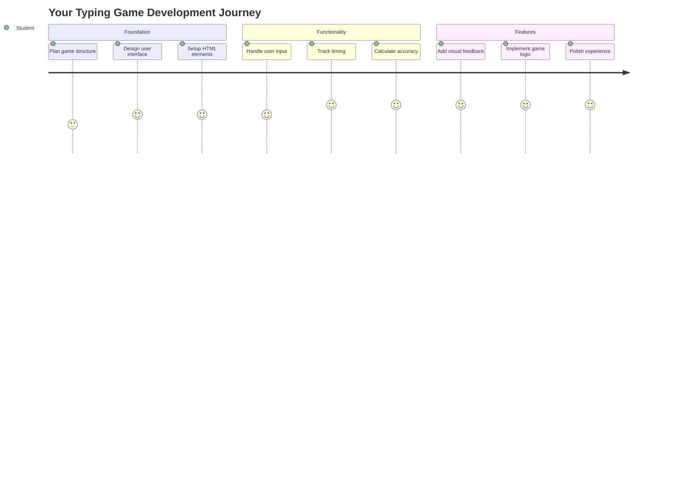
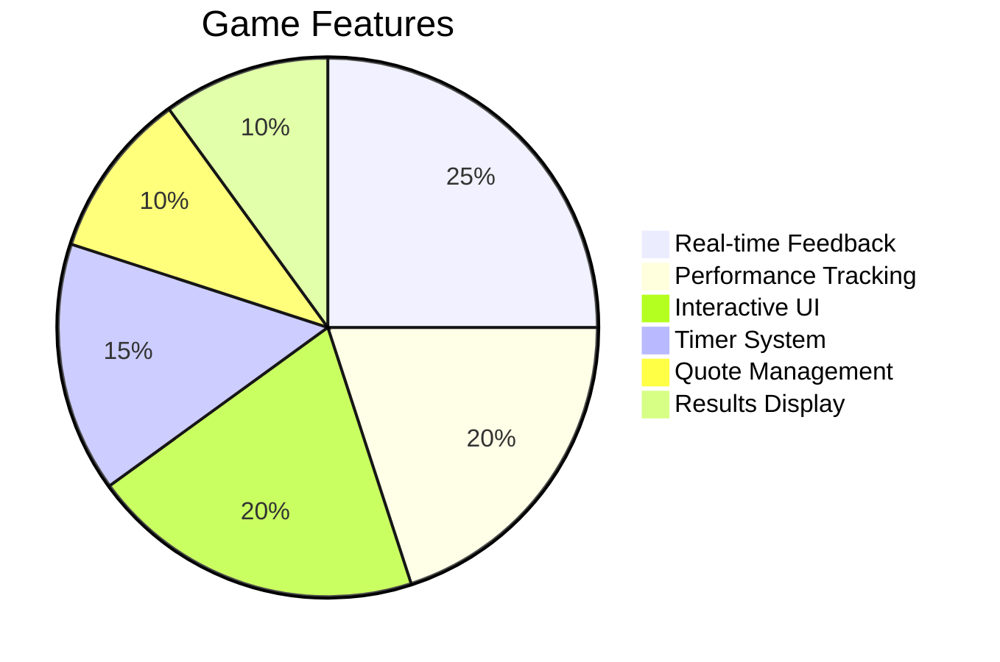
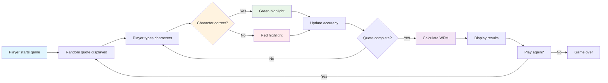
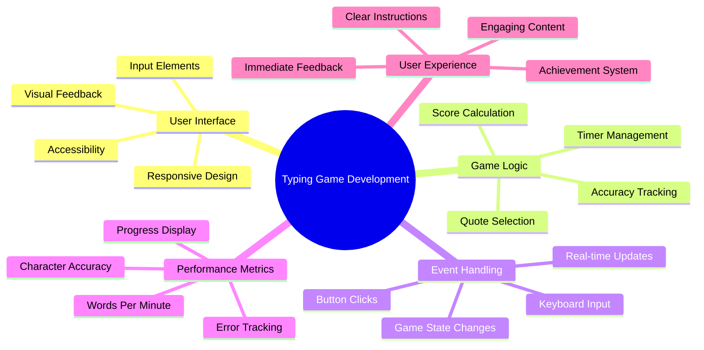
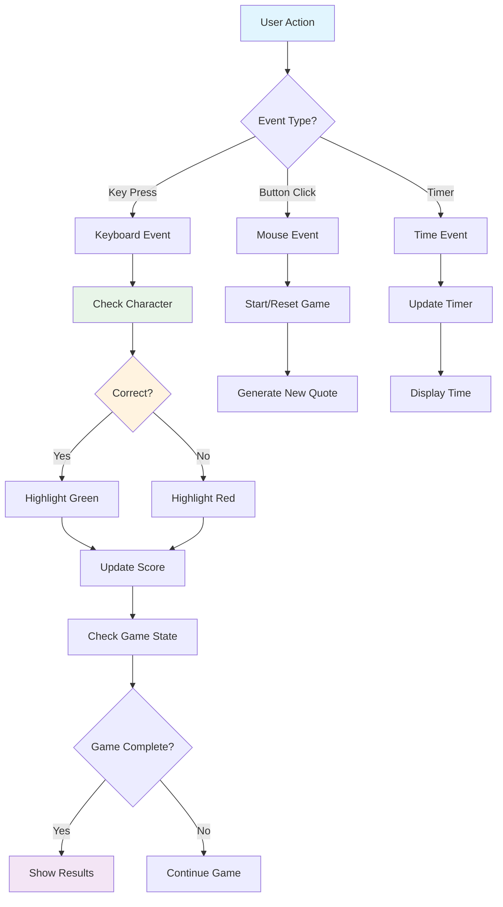
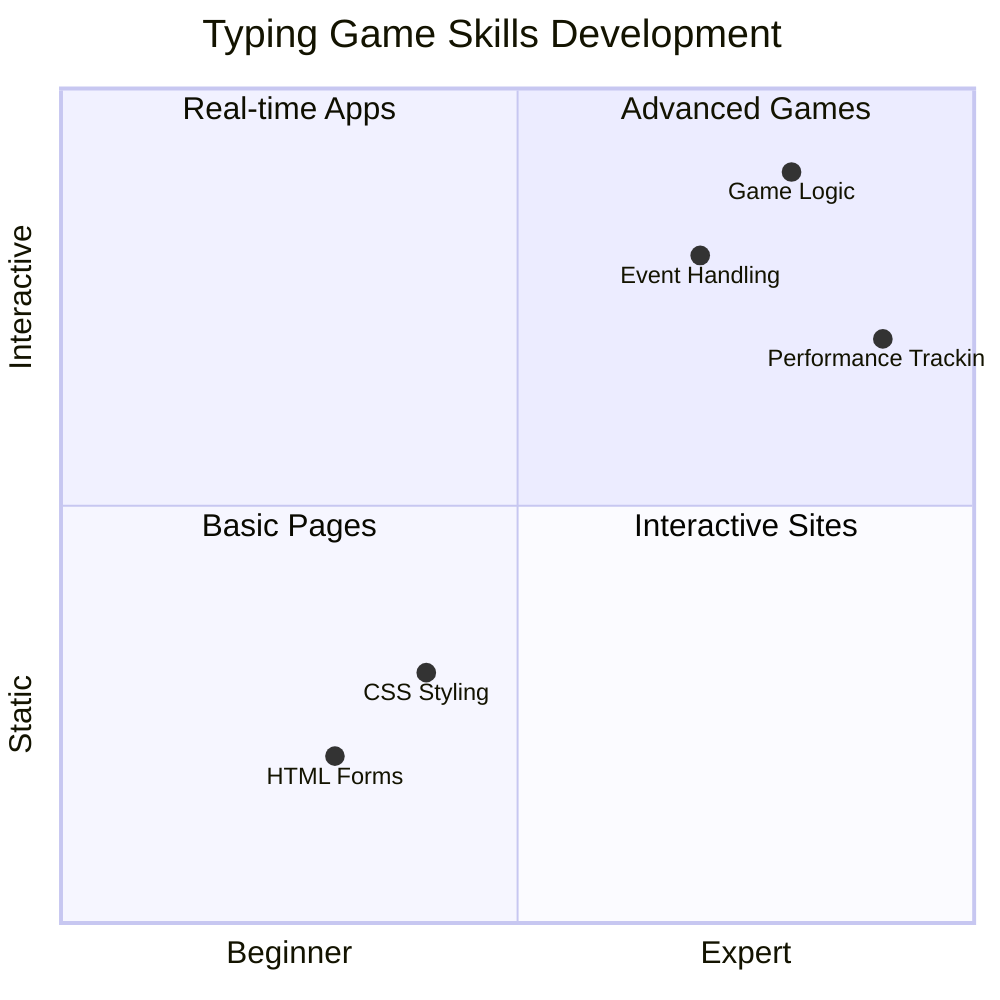
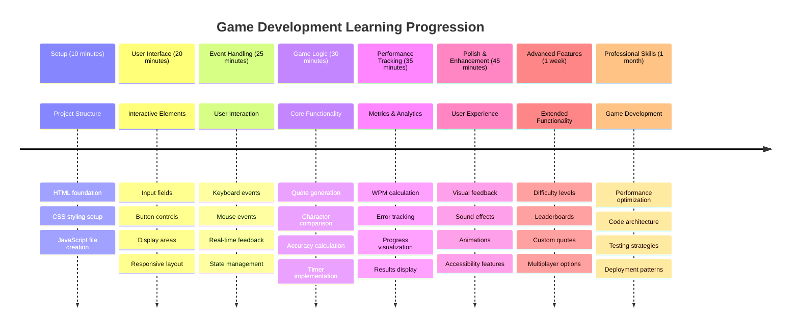

<!--
CO_OP_TRANSLATOR_METADATA:
{
  "original_hash": "efa2ab875b8bb5a7883816506da6b6d2",
  "translation_date": "2025-11-06T13:47:44+00:00",
  "source_file": "4-typing-game/README.md",
  "language_code": "uk"
}
-->
# Програмування на основі подій - Створення гри для набору тексту

## Вступ

Ось те, що кожен розробник знає, але рідко говорить про це: швидкий набір тексту — це суперсила! 🚀 Подумайте про це — чим швидше ви можете перенести свої ідеї з мозку до редактора коду, тим більше ваша творчість може розквітати. Це як мати прямий канал між вашими думками та екраном.

Хочете дізнатися один із найкращих способів покращити цю навичку? Ви вгадали — ми будемо створювати гру!

> Давайте разом створимо круту гру для набору тексту!

Готові застосувати всі ті навички JavaScript, HTML і CSS, які ви вивчали? Ми створимо гру для набору тексту, яка буде кидати вам виклик випадковими цитатами від легендарного детектива [Шерлока Холмса](https://en.wikipedia.org/wiki/Sherlock_Holmes). Гра буде відстежувати, як швидко та точно ви можете набирати текст — і повірте, це більш захоплююче, ніж здається!

## Що потрібно знати

Перед тим як почати, переконайтеся, що ви комфортно почуваєтеся з цими концепціями (не хвилюйтеся, якщо вам потрібне швидке повторення — з кожним таке буває!):

- Створення текстових полів вводу та кнопок
- CSS і налаштування стилів за допомогою класів  
- Основи JavaScript
  - Створення масиву
  - Генерація випадкового числа
  - Отримання поточного часу

Якщо щось із цього здається трохи забутим, це абсолютно нормально! Іноді найкращий спосіб закріпити знання — це зануритися в проєкт і розібратися в процесі.

### 🔄 **Педагогічна перевірка**
**Оцінка основи**: Перед початком розробки переконайтеся, що ви розумієте:
- ✅ Як працюють HTML-форми та елементи вводу
- ✅ CSS-класи та динамічне стилювання
- ✅ Слухачі подій і обробники в JavaScript
- ✅ Маніпуляція масивами та випадковий вибір
- ✅ Вимірювання часу та розрахунки

**Швидкий самотест**: Чи можете ви пояснити, як ці концепції працюють разом в інтерактивній грі?
- **Події** активуються, коли користувачі взаємодіють з елементами
- **Обробники** обробляють ці події та оновлюють стан гри
- **CSS** забезпечує візуальний зворотний зв'язок для дій користувача
- **Час** дозволяє вимірювати продуктивність і прогрес гри

## Давайте створимо це!

[Створення гри для набору тексту за допомогою програмування на основі подій](./typing-game/README.md)

### ⚡ **Що можна зробити за наступні 5 хвилин**
- [ ] Відкрийте консоль браузера та спробуйте слухати події клавіатури за допомогою `addEventListener`
- [ ] Створіть просту HTML-сторінку з полем вводу та протестуйте виявлення набору тексту
- [ ] Попрактикуйте маніпуляцію рядками, порівнюючи набраний текст із цільовим текстом
- [ ] Експериментуйте з `setTimeout`, щоб зрозуміти функції часу

### 🎯 **Що можна досягти за цю годину**
- [ ] Завершіть тест після уроку та зрозумійте програмування на основі подій
- [ ] Створіть базову версію гри для набору тексту з перевіркою слів
- [ ] Додайте візуальний зворотний зв'язок для правильного та неправильного набору тексту
- [ ] Реалізуйте просту систему оцінювання на основі швидкості та точності
- [ ] Стилізуйте свою гру за допомогою CSS, щоб зробити її привабливою

### 📅 **Ваш тижневий розвиток гри**
- [ ] Завершіть повну гру для набору тексту з усіма функціями та доопрацюванням
- [ ] Додайте рівні складності з різною складністю слів
- [ ] Реалізуйте відстеження статистики користувача (WPM, точність з часом)
- [ ] Створіть звукові ефекти та анімації для кращого користувацького досвіду
- [ ] Зробіть свою гру адаптивною для мобільних пристроїв із сенсорним управлінням
- [ ] Поділіться своєю грою онлайн та отримайте відгуки від користувачів

### 🌟 **Ваш місячний інтерактивний розвиток**
- [ ] Створіть кілька ігор, досліджуючи різні шаблони взаємодії
- [ ] Дізнайтеся про цикли гри, управління станом і оптимізацію продуктивності
- [ ] Внесіть свій вклад у проєкти з відкритим кодом у розробці ігор
- [ ] Освойте складні концепції часу та плавні анімації
- [ ] Створіть портфоліо, яке демонструє різні інтерактивні застосунки
- [ ] Наставляйте інших, хто цікавиться розробкою ігор та взаємодією з користувачем

## 🎯 Ваш таймлайн майстерності гри для набору тексту

### 🛠️ Резюме вашого інструментарію для розробки гри

Після завершення цього проєкту ви освоїте:
- **Програмування на основі подій**: Чутливі інтерфейси, які реагують на ввід
- **Зворотний зв'язок у реальному часі**: Миттєві візуальні та продуктивні оновлення
- **Вимірювання продуктивності**: Точні системи часу та оцінювання
- **Управління станом гри**: Контроль за потоком застосунку та досвідом користувача
- **Інтерактивний дизайн**: Створення захоплюючих, затягують користувацьких досвідів
- **Сучасні веб-API**: Використання можливостей браузера для багатих взаємодій
- **Шаблони доступності**: Інклюзивний дизайн для всіх користувачів

**Застосування в реальному світі**: Ці навички безпосередньо застосовуються до:
- **Веб-застосунків**: Будь-який інтерактивний інтерфейс або панель управління
- **Освітнього програмного забезпечення**: Платформи навчання та інструменти оцінки навичок
- **Інструментів продуктивності**: Текстові редактори, IDE та програмне забезпечення для співпраці
- **Ігрової індустрії**: Браузерні ігри та інтерактивні розваги
- **Мобільної розробки**: Інтерфейси на основі сенсорного управління та обробки жестів

**Наступний рівень**: Ви готові досліджувати розширені фреймворки для ігор, системи реального часу для багатокористувацьких ігор або складні інтерактивні застосунки!

## Авторство

Написано з ♥️ [Крістофером Гаррісоном](http://www.twitter.com/geektrainer)

---

**Відмова від відповідальності**:  
Цей документ був перекладений за допомогою сервісу автоматичного перекладу [Co-op Translator](https://github.com/Azure/co-op-translator). Хоча ми прагнемо до точності, будь ласка, майте на увазі, що автоматичні переклади можуть містити помилки або неточності. Оригінальний документ на його рідній мові слід вважати авторитетним джерелом. Для критичної інформації рекомендується професійний людський переклад. Ми не несемо відповідальності за будь-які непорозуміння або неправильні тлумачення, що виникають внаслідок використання цього перекладу.