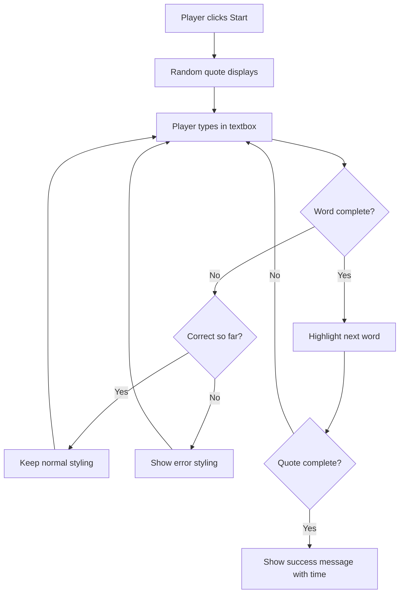
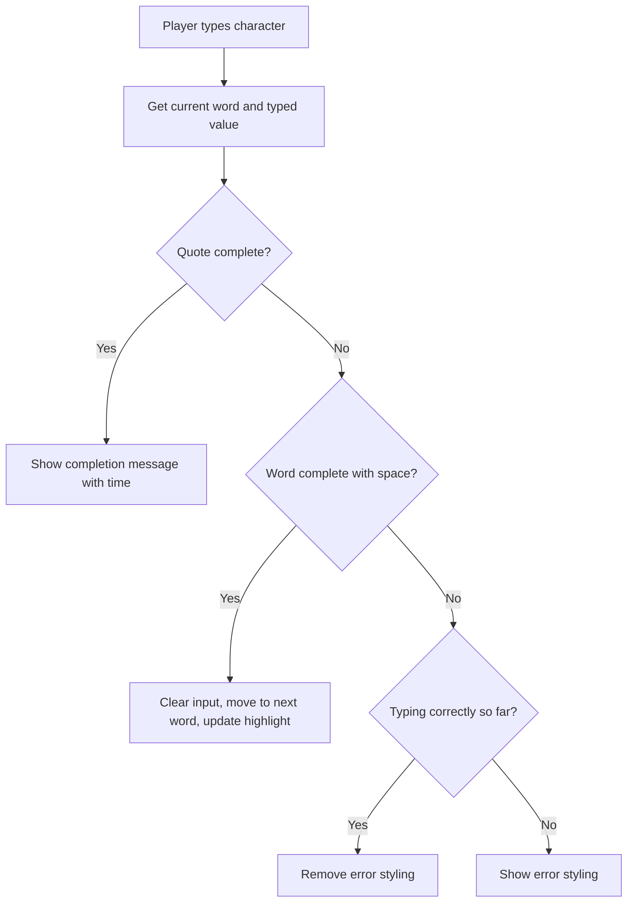

<!--
CO_OP_TRANSLATOR_METADATA:
{
  "original_hash": "e6b75e5b8caae906473a8a09d77b7121",
  "translation_date": "2025-10-24T15:53:37+00:00",
  "source_file": "4-typing-game/typing-game/README.md",
  "language_code": "uk"
}
-->
# Створення гри за допомогою подій

Чи замислювалися ви, як вебсайти знають, коли ви натискаєте кнопку або вводите текст у текстове поле? Це магія програмування, орієнтованого на події! Що може бути кращим способом освоїти цей важливий навик, ніж створення чогось корисного — гри на швидкість набору тексту, яка реагує на кожне натискання клавіші.

Ви побачите на власні очі, як веббраузери "спілкуються" з вашим кодом JavaScript. Кожного разу, коли ви натискаєте, вводите текст або рухаєте мишкою, браузер надсилає маленькі повідомлення (ми називаємо їх подіями) вашому коду, і ви вирішуєте, як на них реагувати!

До кінця цього уроку ви створите справжню гру на швидкість набору тексту, яка відстежує вашу швидкість і точність. Але найголовніше — ви зрозумієте основні концепції, які лежать в основі кожного інтерактивного вебсайту, яким ви коли-небудь користувалися. Почнемо!

## Тест перед лекцією

[Тест перед лекцією](https://ff-quizzes.netlify.app/web/quiz/21)

## Програмування, орієнтоване на події

Подумайте про ваш улюблений додаток або вебсайт — що робить його живим і чутливим? Все залежить від того, як він реагує на ваші дії! Кожен дотик, клік, свайп або натискання клавіші створює те, що ми називаємо "подією", і саме тут відбувається справжня магія веброзробки.

Ось що робить програмування для вебу таким цікавим: ми ніколи не знаємо, коли хтось натисне ту кнопку або почне вводити текст у текстове поле. Вони можуть натиснути одразу, зачекати п'ять хвилин або взагалі не натиснути! Ця непередбачуваність змушує нас думати інакше про те, як ми пишемо код.

Замість того, щоб писати код, який виконується зверху вниз, як рецепт, ми пишемо код, який терпляче чекає, поки щось станеться. Це схоже на те, як телеграфні оператори в 1800-х роках сиділи біля своїх машин, готові відповісти в момент, коли через дріт прийде повідомлення.

Отже, що саме є "подією"? Просто кажучи, це щось, що відбувається! Коли ви натискаєте кнопку — це подія. Коли ви вводите літеру — це подія. Коли ви рухаєте мишкою — це ще одна подія.

Програмування, орієнтоване на події, дозволяє нам налаштувати наш код на прослуховування і реагування. Ми створюємо спеціальні функції, які називаються **слухачами подій**, які терпляче чекають на певні події, а потім активуються, коли вони відбуваються.

Уявіть слухачів подій як дверний дзвінок для вашого коду. Ви налаштовуєте дверний дзвінок (`addEventListener()`), вказуєте, який звук слухати (наприклад, 'click' або 'keypress'), а потім визначаєте, що має статися, коли хтось дзвонить (ваша власна функція).

**Ось як працюють слухачі подій:**
- **Слухають** певні дії користувача, такі як кліки, натискання клавіш або рухи мишкою
- **Виконують** ваш власний код, коли відбувається зазначена подія
- **Реагують** миттєво на взаємодії користувача, створюючи безперервний досвід
- **Обробляють** кілька подій на одному елементі за допомогою різних слухачів

> **NOTE:** Варто зазначити, що існує багато способів створення слухачів подій. Ви можете використовувати анонімні функції або створювати іменовані. Можна використовувати різні скорочення, наприклад, встановлювати властивість `click` або використовувати `addEventListener()`. У нашій вправі ми зосередимося на `addEventListener()` і анонімних функціях, оскільки це, мабуть, найпоширеніша техніка, яку використовують веброзробники. Вона також є найгнучкішою, оскільки `addEventListener()` працює для всіх подій, а назву події можна передати як параметр.

### Поширені події

Хоча веббраузери пропонують десятки різних подій, які ви можете слухати, більшість інтерактивних додатків покладаються лише на кілька основних подій. Розуміння цих основних подій дасть вам основу для створення складних взаємодій з користувачем.

Існує [десятки подій](https://developer.mozilla.org/docs/Web/Events), які ви можете слухати при створенні додатка. Практично будь-яка дія користувача на сторінці викликає подію, що дає вам багато можливостей забезпечити бажаний досвід. На щастя, вам зазвичай потрібна лише невелика кількість подій. Ось кілька поширених (включаючи дві, які ми будемо використовувати при створенні нашої гри):

| Подія | Опис | Поширені випадки використання |
|-------|------|-------------------------------|
| `click` | Користувач натиснув на щось | Кнопки, посилання, інтерактивні елементи |
| `contextmenu` | Користувач натиснув праву кнопку миші | Кастомні контекстні меню |
| `select` | Користувач виділив текст | Редагування тексту, операції копіювання |
| `input` | Користувач ввів текст | Валідація форм, пошук у реальному часі |

**Розуміння цих типів подій:**
- **Активуються** при взаємодії користувачів з конкретними елементами на вашій сторінці
- **Надають** детальну інформацію про дії користувача через об'єкти подій
- **Дозволяють** створювати чутливі, інтерактивні вебдодатки
- **Працюють** стабільно на різних браузерах і пристроях

## Створення гри

Тепер, коли ви розумієте, як працюють події, давайте застосуємо ці знання на практиці, створивши щось корисне. Ми створимо гру на швидкість набору тексту, яка демонструє обробку подій і допомагає розвинути важливий навик розробника.

Ми створимо гру, щоб дослідити, як працюють події в JavaScript. Наша гра перевірить навички набору тексту гравця, що є одним із найбільш недооцінених навичок, які повинні мати всі розробники. Цікаво: розкладка клавіатури QWERTY, яку ми використовуємо сьогодні, була фактично розроблена в 1870-х роках для друкарських машинок — і хороші навички набору тексту досі так само цінні для програмістів! Загальний хід гри виглядатиме так:



**Ось як працюватиме наша гра:**
- **Починається**, коли гравець натискає кнопку старту і відображає випадкову цитату
- **Відстежує** прогрес набору тексту гравця слово за словом у реальному часі
- **Виділяє** поточне слово, щоб направити увагу гравця
- **Надає** миттєвий візуальний зворотний зв'язок для помилок набору
- **Розраховує** і відображає загальний час після завершення цитати

Давайте створимо нашу гру і навчимося працювати з подіями!

### Структура файлів

Перш ніж почати писати код, давайте організуємося! Чиста структура файлів з самого початку заощадить вам багато часу і зробить ваш проект більш професійним. 😊

Ми будемо тримати все просто, використовуючи лише три файли: `index.html` для структури сторінки, `script.js` для всієї логіки гри і `style.css`, щоб зробити все гарним. Це класичне тріо, яке живить більшість вебу!

**Створіть нову папку для вашої роботи, відкривши консоль або термінал і виконавши наступну команду:**

```bash
# Linux or macOS
mkdir typing-game && cd typing-game

# Windows
md typing-game && cd typing-game
```

**Ось що роблять ці команди:**
- **Створюють** нову директорію під назвою `typing-game` для файлів вашого проекту
- **Переходять** до новоствореної директорії автоматично
- **Налаштовують** чисте робоче місце для розробки вашої гри

**Відкрийте Visual Studio Code:**

```bash
code .
```

**Ця команда:**
- **Запускає** Visual Studio Code у поточній директорії
- **Відкриває** папку вашого проекту в редакторі
- **Надає** доступ до всіх інструментів розробки, які вам знадобляться

**Додайте три файли до папки у Visual Studio Code з наступними назвами:**
- `index.html` - Містить структуру і контент вашої гри
- `script.js` - Обробляє всю логіку гри і слухачі подій
- `style.css` - Визначає візуальний вигляд і стиль

## Створення інтерфейсу користувача

Тепер давайте створимо сцену, де відбуватиметься вся дія нашої гри! Уявіть це як проектування панелі управління для космічного корабля — ми повинні переконатися, що все, що потрібно нашим гравцям, знаходиться саме там, де вони очікують.

Давайте визначимо, що саме потрібно нашій грі. Якби ви грали в гру на швидкість набору тексту, що б ви хотіли бачити на екрані? Ось що нам знадобиться:

| Елемент інтерфейсу | Призначення | HTML Елемент |
|--------------------|-------------|--------------|
| Відображення цитати | Показує текст для набору | `<p>` з `id="quote"` |
| Область повідомлень | Відображає статус і повідомлення про успіх | `<p>` з `id="message"` |
| Текстове поле | Місце, де гравці вводять цитату | `<input>` з `id="typed-value"` |
| Кнопка старту | Починає гру | `<button>` з `id="start"` |

**Розуміння структури інтерфейсу:**
- **Організовує** контент логічно зверху вниз
- **Призначає** унікальні ID елементам для цілей JavaScript
- **Забезпечує** чітку візуальну ієрархію для кращого досвіду користувача
- **Включає** семантичні HTML елементи для доступності

Кожен з них потребуватиме ID, щоб ми могли працювати з ними у нашому JavaScript. Ми також додамо посилання на CSS і JavaScript файли, які ми створимо.

Створіть новий файл під назвою `index.html`. Додайте наступний HTML:

```html
<!-- inside index.html -->
<html>
<head>
  <title>Typing game</title>
  <link rel="stylesheet" href="style.css">
</head>
<body>
  <h1>Typing game!</h1>
  <p>Practice your typing skills with a quote from Sherlock Holmes. Click **start** to begin!</p>
  <p id="quote"></p> <!-- This will display our quote -->
  <p id="message"></p> <!-- This will display any status messages -->
  <div>
    <input type="text" aria-label="current word" id="typed-value" /> <!-- The textbox for typing -->
    <button type="button" id="start">Start</button> <!-- To start the game -->
  </div>
  <script src="script.js"></script>
</body>
</html>
```

**Розбір того, що досягає ця структура HTML:**
- **Підключає** CSS-стилі у `<head>` для оформлення
- **Створює** чіткий заголовок і інструкції для користувачів
- **Встановлює** заповнювачі для абзаців зі специфічними ID для динамічного контенту
- **Включає** текстове поле з атрибутами доступності
- **Надає** кнопку старту для запуску гри
- **Завантажує** JavaScript файл в кінці для оптимальної продуктивності

### Запуск додатка

Часте тестування вашого додатка під час розробки допомагає виявляти проблеми на ранніх етапах і бачити ваш прогрес у реальному часі. Live Server — це незамінний інструмент, який автоматично оновлює ваш браузер кожного разу, коли ви зберігаєте зміни, роблячи розробку набагато ефективнішою.

Завжди краще розробляти поступово, щоб бачити, як виглядають речі. Давайте запустимо наш додаток. У Visual Studio Code є чудове розширення під назвою [Live Server](https://marketplace.visualstudio.com/items?itemName=ritwickdey.LiveServer&WT.mc_id=academic-77807-sagibbon), яке буде як локально хостити ваш додаток, так і оновлювати браузер кожного разу, коли ви зберігаєте.

**Встановіть [Live Server](https://marketplace.visualstudio.com/items?itemName=ritwickdey.LiveServer&WT.mc_id=academic-77807-sagibbon), перейшовши за посиланням і натиснувши "Install":**

**Ось що відбувається під час встановлення:**
- **Запускає** ваш браузер для відкриття Visual Studio Code
- **Проводить** вас через процес встановлення розширення
- **Може вимагати** перезапуску Visual Studio Code для завершення налаштування

**Після встановлення у Visual Studio Code натисніть Ctrl-Shift-P (або Cmd-Shift-P), щоб відкрити командну панель:**

**Розуміння командної панелі:**
- **Надає** швидкий доступ до всіх команд VS Code
- **Шукає** команди під час введення
- **Пропонує** гарячі клавіші для швидшої розробки

**Введіть "Live Server: Open with Live Server":**

**Що робить Live Server:**
- **Запускає** локальний сервер розробки для вашого проекту
- **Автоматично** оновлює браузер при збереженні файлів
- **Сервісує** ваші файли з локального URL (зазвичай `localhost:5500`)

**Відкрийте браузер і перейдіть до `https://localhost:5500`:**

Тепер ви повинні побачити створену вами сторінку! Давайте додамо трохи функціональності.

## Додати CSS

Тепер зробимо все гарним! Візуальний зворотний зв'язок був важливим для інтерфейсів користувача з ранніх днів обчислювальної техніки. У 1980-х роках дослідники виявили, що миттєвий візуальний зворотний зв'язок значно покращує продуктивність користувачів і зменшує кількість помилок. Саме це ми і створимо.

Наша гра повинна чітко показувати, що відбувається. Гравці повинні одразу знати, яке слово вони повинні набрати, і якщо вони зроблять помилку, вони повинні побачити це негайно. Давайте створимо просте, але ефективне оформлення:

Створіть новий файл під назвою `style.css` і додайте наступний синтаксис.

```css
/* inside style.css */
.highlight {
  background-color: yellow;
}

.error {
  background-color: lightcoral;
  border: red;
}
```

**Розуміння цих CSS-класів:**
- **Виділяє** поточне слово жовтим фоном для чіткої візуальної підказки
- **Сигналізує** про помилки набору тексту світло-кораловим кольором фону
- **Надає** миттєвий зворотний зв'язок без переривання процесу набору тексту
- **Використовує** контрастні кольори для доступності і чіткої візуальної комунікації

✅ Що стосується CSS, ви можете оформити вашу сторінку так, як вам подобається. Приділіть трохи часу і зробіть сторінку більш привабливою:

- Виберіть інший шрифт
- Змініть кольори заголовків
- Змініть розміри елементів

## JavaScript

Ось де стає цікаво! 🎉 У нас є структура HTML і оформлення CSS, але зараз наша гра схожа на красиву машину без двигуна. JavaScript стане тим двигуном — саме він змусить все працювати і реагувати на дії гравців.

Тут ви побачите, як ваше творіння оживає. Ми будемо виконувати це крок за кроком, щоб нічого не здавалося надто складним:

| Крок | Призначення | Що ви навчитеся |
|------|-------------|-----------------|
| [Створення констант](../../../../4-typing-game/typing-game) | Налаштування цитат і пос
| Масив цитат | Зберігає всі можливі цитати для гри | `['Цитата 1', 'Цитата 2', ...]` |
| Масив слів | Розбиває поточну цитату на окремі слова | `['Коли', 'ти', 'маєш', ...]` |
| Індекс слова | Відстежує, яке слово гравець вводить | `0, 1, 2, 3...` |
| Час початку | Розраховує витрачений час для оцінки | `Date.now()` |

**Нам також потрібні посилання на елементи інтерфейсу:**
| Елемент | ID | Призначення |
|---------|----|-------------|
| Текстове поле | `typed-value` | Місце, де гравці вводять текст |
| Відображення цитати | `quote` | Показує цитату для введення |
| Область повідомлень | `message` | Відображає статус гри |

```javascript
// inside script.js
// all of our quotes
const quotes = [
    'When you have eliminated the impossible, whatever remains, however improbable, must be the truth.',
    'There is nothing more deceptive than an obvious fact.',
    'I ought to know by this time that when a fact appears to be opposed to a long train of deductions it invariably proves to be capable of bearing some other interpretation.',
    'I never make exceptions. An exception disproves the rule.',
    'What one man can invent another can discover.',
    'Nothing clears up a case so much as stating it to another person.',
    'Education never ends, Watson. It is a series of lessons, with the greatest for the last.',
];
// store the list of words and the index of the word the player is currently typing
let words = [];
let wordIndex = 0;
// the starting time
let startTime = Date.now();
// page elements
const quoteElement = document.getElementById('quote');
const messageElement = document.getElementById('message');
const typedValueElement = document.getElementById('typed-value');
```

**Розбираємо, що робить цей код налаштування:**
- **Зберігає** масив цитат Шерлока Холмса за допомогою `const`, оскільки цитати не змінюються
- **Ініціалізує** змінні відстеження за допомогою `let`, оскільки ці значення змінюються під час гри
- **Отримує** посилання на елементи DOM за допомогою `document.getElementById()` для ефективного доступу
- **Створює** основу для всієї функціональності гри з чіткими, описовими назвами змінних
- **Організовує** пов'язані дані та елементи логічно для легшого обслуговування коду

✅ Додайте більше цитат до вашої гри

> 💡 **Корисна порада**: Ми можемо отримувати елементи в будь-який момент у коді за допомогою `document.getElementById()`. Оскільки ми будемо часто звертатися до цих елементів, використання констант допоможе уникнути помилок у рядкових літералах. Фреймворки, такі як [Vue.js](https://vuejs.org/) або [React](https://reactjs.org/), можуть допомогти краще централізувати ваш код.
>
**Чому цей підхід працює так добре:**
- **Запобігає** помилкам у написанні при багаторазовому зверненні до елементів
- **Покращує** читабельність коду завдяки описовим назвам констант
- **Дозволяє** кращу підтримку IDE з автозаповненням і перевіркою помилок
- **Полегшує** рефакторинг, якщо ID елементів змінюються

Перегляньте відео про використання `const`, `let` і `var`

[](https://youtube.com/watch?v=JNIXfGiDWM8 "Типи змінних")

> 🎥 Натисніть на зображення вище, щоб переглянути відео про змінні.

### Додайте логіку старту

Ось де все починає працювати! 🚀 Ви збираєтеся написати свій перший справжній обробник подій, і є щось дуже задовільне в тому, щоб побачити, як ваш код реагує на натискання кнопки.

Подумайте про це: десь там гравець натисне кнопку "Старт", і ваш код має бути готовий до цього. Ми не знаємо, коли це станеться - можливо, одразу, можливо, після того, як він вип'є каву - але коли це станеться, ваша гра оживе.

Коли користувач натискає `start`, нам потрібно вибрати цитату, налаштувати інтерфейс користувача та налаштувати відстеження поточного слова і часу. Нижче наведено JavaScript, який вам потрібно додати; ми обговоримо його після блоку скрипта.

```javascript
// at the end of script.js
document.getElementById('start').addEventListener('click', () => {
  // get a quote
  const quoteIndex = Math.floor(Math.random() * quotes.length);
  const quote = quotes[quoteIndex];
  // Put the quote into an array of words
  words = quote.split(' ');
  // reset the word index for tracking
  wordIndex = 0;

  // UI updates
  // Create an array of span elements so we can set a class
  const spanWords = words.map(function(word) { return `<span>${word} </span>`});
  // Convert into string and set as innerHTML on quote display
  quoteElement.innerHTML = spanWords.join('');
  // Highlight the first word
  quoteElement.childNodes[0].className = 'highlight';
  // Clear any prior messages
  messageElement.innerText = '';

  // Setup the textbox
  // Clear the textbox
  typedValueElement.value = '';
  // set focus
  typedValueElement.focus();
  // set the event handler

  // Start the timer
  startTime = new Date().getTime();
});
```

**Розбираємо код на логічні секції:**

**📊 Налаштування відстеження слів:**
- **Вибирає** випадкову цитату за допомогою `Math.floor()` і `Math.random()` для різноманітності
- **Перетворює** цитату в масив окремих слів за допомогою `split(' ')`
- **Скидає** `wordIndex` на 0, оскільки гравці починають з першого слова
- **Готує** стан гри для нового раунду

**🎨 Налаштування інтерфейсу та відображення:**
- **Створює** масив елементів `<span>`, обгортаючи кожне слово для індивідуального стилювання
- **Об'єднує** елементи span в один рядок для ефективного оновлення DOM
- **Виділяє** перше слово, додаючи CSS клас `highlight`
- **Очищає** будь-які попередні повідомлення гри, щоб забезпечити чистий старт

**⌨️ Підготовка текстового поля:**
- **Очищає** будь-який існуючий текст у полі введення
- **Фокусується** на текстовому полі, щоб гравці могли одразу почати вводити текст
- **Готує** область введення для нової сесії гри

**⏱️ Ініціалізація таймера:**
- **Фіксує** поточний час за допомогою `new Date().getTime()`
- **Дозволяє** точний розрахунок швидкості набору тексту і часу завершення
- **Запускає** відстеження продуктивності для сесії гри

### Додайте логіку введення тексту

Ось де ми вирішуємо серце нашої гри! Не хвилюйтеся, якщо це здається складним на перший погляд - ми розберемо кожну частину, і в кінці ви побачите, наскільки це логічно.

Те, що ми тут створюємо, досить складне: кожного разу, коли хтось вводить літеру, наш код перевіряє, що він ввів, дає зворотний зв'язок і вирішує, що має статися далі. Це схоже на те, як ранні текстові редактори, такі як WordStar у 1970-х роках, надавали зворотний зв'язок у реальному часі для друкарів.

```javascript
// at the end of script.js
typedValueElement.addEventListener('input', () => {
  // Get the current word
  const currentWord = words[wordIndex];
  // get the current value
  const typedValue = typedValueElement.value;

  if (typedValue === currentWord && wordIndex === words.length - 1) {
    // end of sentence
    // Display success
    const elapsedTime = new Date().getTime() - startTime;
    const message = `CONGRATULATIONS! You finished in ${elapsedTime / 1000} seconds.`;
    messageElement.innerText = message;
  } else if (typedValue.endsWith(' ') && typedValue.trim() === currentWord) {
    // end of word
    // clear the typedValueElement for the new word
    typedValueElement.value = '';
    // move to the next word
    wordIndex++;
    // reset the class name for all elements in quote
    for (const wordElement of quoteElement.childNodes) {
      wordElement.className = '';
    }
    // highlight the new word
    quoteElement.childNodes[wordIndex].className = 'highlight';
  } else if (currentWord.startsWith(typedValue)) {
    // currently correct
    // highlight the next word
    typedValueElement.className = '';
  } else {
    // error state
    typedValueElement.className = 'error';
  }
});
```

**Розуміння потоку логіки введення тексту:**

Ця функція використовує підхід "водоспаду", перевіряючи умови від найбільш специфічних до найбільш загальних. Розглянемо кожен сценарій:



**🏁 Завершення цитати (Сценарій 1):**
- **Перевіряє**, чи введене значення відповідає поточному слову І ми на останньому слові
- **Розраховує** витрачений час, віднімаючи час початку від поточного часу
- **Перетворює** мілісекунди в секунди, ділячи на 1,000
- **Відображає** привітальне повідомлення з часом завершення

**✅ Завершення слова (Сценарій 2):**
- **Виявляє** завершення слова, коли введення закінчується пробілом
- **Перевіряє**, що обрізане введення точно відповідає поточному слову
- **Очищає** поле введення для наступного слова
- **Переходить** до наступного слова, збільшуючи `wordIndex`
- **Оновлює** візуальне виділення, видаляючи всі класи і виділяючи нове слово

**📝 Введення в процесі (Сценарій 3):**
- **Перевіряє**, чи поточне слово починається з того, що було введено
- **Видаляє** будь-яке стилювання помилок, щоб показати, що введення правильне
- **Дозволяє** продовжувати введення без переривань

**❌ Стан помилки (Сценарій 4):**
- **Спрацьовує**, коли введений текст не відповідає очікуваному початку слова
- **Застосовує** CSS клас помилки для негайного візуального зворотного зв'язку
- **Допомагає** гравцям швидко виявити і виправити помилки

## Тестуйте ваш додаток

Подивіться, чого ви досягли! 🎉 Ви щойно створили справжню, робочу гру для набору тексту з нуля, використовуючи програмування, засноване на подіях. Зробіть паузу, щоб оцінити це - це не маленьке досягнення!

Тепер настав час тестування! Чи буде все працювати так, як очікувалося? Чи щось ми пропустили? Ось у чому справа: якщо щось не працює ідеально з першого разу, це абсолютно нормально. Навіть досвідчені розробники регулярно знаходять помилки у своєму коді. Це все частина процесу розробки!

Натисніть на `start` і починайте вводити текст! Це має виглядати приблизно так, як на анімації, яку ми бачили раніше.


**Що перевірити у вашому додатку:**
- **Переконайтеся**, що натискання кнопки "Старт" відображає випадкову цитату
- **Перевірте**, що введення тексту правильно виділяє поточне слово
- **Переконайтеся**, що стилювання помилок з'являється при неправильному введенні
- **Перевірте**, що завершення слова правильно переміщує виділення
- **Переконайтеся**, що завершення цитати показує повідомлення про завершення з часом

**Поширені поради щодо налагодження:**
- **Перевірте** консоль браузера (F12) на наявність помилок JavaScript
- **Переконайтеся**, що всі назви файлів точно збігаються (чутливість до регістру)
- **Переконайтеся**, що Live Server працює і правильно оновлюється
- **Тестуйте** різні цитати, щоб перевірити, чи працює випадковий вибір

---

## Виклик агента GitHub Copilot 🎮

Використовуйте режим Agent, щоб виконати наступний виклик:

**Опис:** Розширте гру для набору тексту, реалізувавши систему складності, яка змінює гру залежно від продуктивності гравця. Цей виклик допоможе вам практикувати розширене оброблення подій, аналіз даних і динамічне оновлення інтерфейсу.

**Завдання:** Створіть систему регулювання складності для гри, яка:
1. Відстежує швидкість набору тексту гравця (кількість слів за хвилину) і відсоток точності
2. Автоматично регулює три рівні складності: Легкий (простий цитати), Середній (поточні цитати), Складний (складні цитати з пунктуацією)
3. Відображає поточний рівень складності і статистику гравця в інтерфейсі
4. Реалізує лічильник серій, який збільшує складність після 3 послідовних хороших результатів
5. Додає візуальний зворотний зв'язок (кольори, анімації), щоб вказати на зміну складності

Додайте необхідні HTML елементи, CSS стилі та функції JavaScript для реалізації цієї функції. Включіть належне оброблення помилок і переконайтеся, що гра залишається доступною з відповідними ARIA мітками.

Дізнайтеся більше про [режим агента](https://code.visualstudio.com/blogs/2025/02/24/introducing-copilot-agent-mode) тут.

## 🚀 Виклик

Готові підняти вашу гру для набору тексту на новий рівень? Спробуйте реалізувати ці розширені функції, щоб поглибити ваше розуміння оброблення подій і маніпуляції DOM:

**Додайте більше функціональності:**

| Функція | Опис | Навички, які ви практикуєте |
|---------|-------------|------------------------|
| **Контроль введення** | Вимкніть обробник подій `input` після завершення і знову увімкніть його при натисканні кнопки | Управління подіями і станом |
| **Управління станом інтерфейсу** | Вимкніть текстове поле, коли гравець завершує цитату | Маніпуляція властивостями DOM |
| **Модальне вікно** | Відобразіть модальне вікно з повідомленням про успіх | Розширені шаблони інтерфейсу і доступність |
| **Система високих балів** | Зберігайте високі бали за допомогою `localStorage` | API зберігання браузера і збереження даних |

**Поради щодо реалізації:**
- **Досліджуйте** `localStorage.setItem()` і `localStorage.getItem()` для постійного зберігання
- **Практикуйте** додавання і видалення обробників подій динамічно
- **Досліджуйте** HTML елементи діалогу або шаблони модальних вікон CSS
- **Враховуйте** доступність при вимкненні і увімкненні елементів форми

## Післялекційний тест

[Післялекційний тест](https://ff-quizzes.netlify.app/web/quiz/22)

## Огляд і самостійне навчання

Дізнайтеся більше про [всі доступні події](https://developer.mozilla.org/docs/Web/Events) для розробників через веб-браузер і розгляньте сценарії, в яких ви б використовували кожну з них.

## Завдання

[Створіть нову гру для клавіатури](assignment.md)

---

**Відмова від відповідальності**:  
Цей документ був перекладений за допомогою сервісу автоматичного перекладу [Co-op Translator](https://github.com/Azure/co-op-translator). Хоча ми прагнемо до точності, будь ласка, майте на увазі, що автоматичні переклади можуть містити помилки або неточності. Оригінальний документ на його рідній мові слід вважати авторитетним джерелом. Для критичної інформації рекомендується професійний людський переклад. Ми не несемо відповідальності за будь-які непорозуміння або неправильні тлумачення, що виникають внаслідок використання цього перекладу.