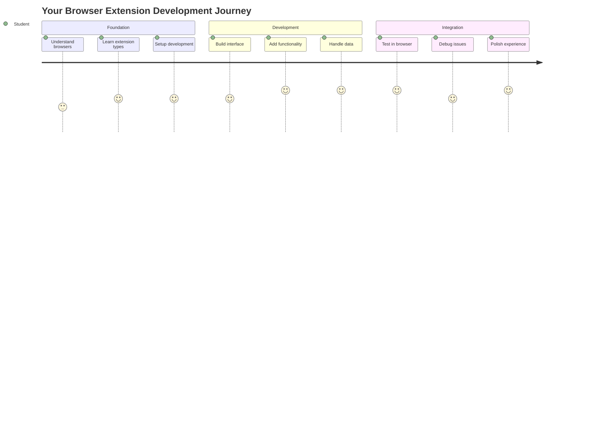
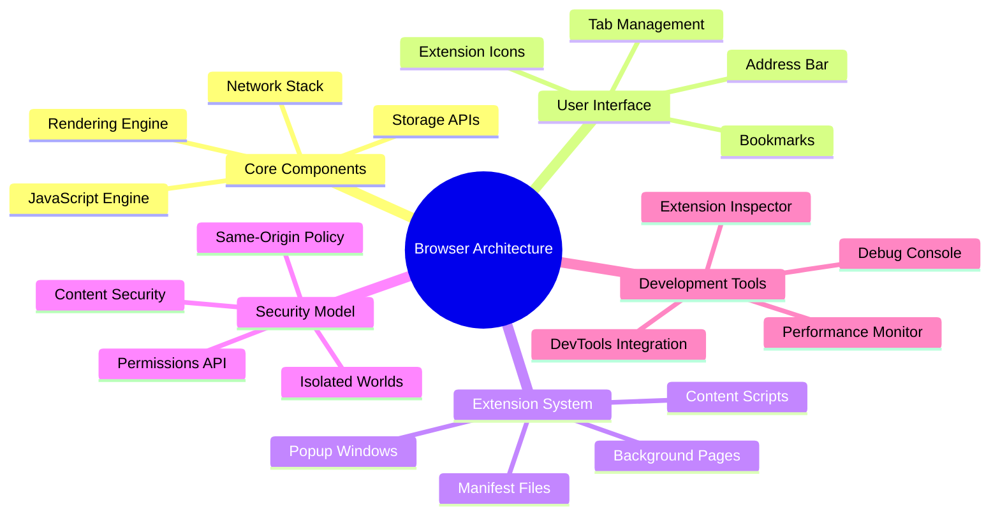
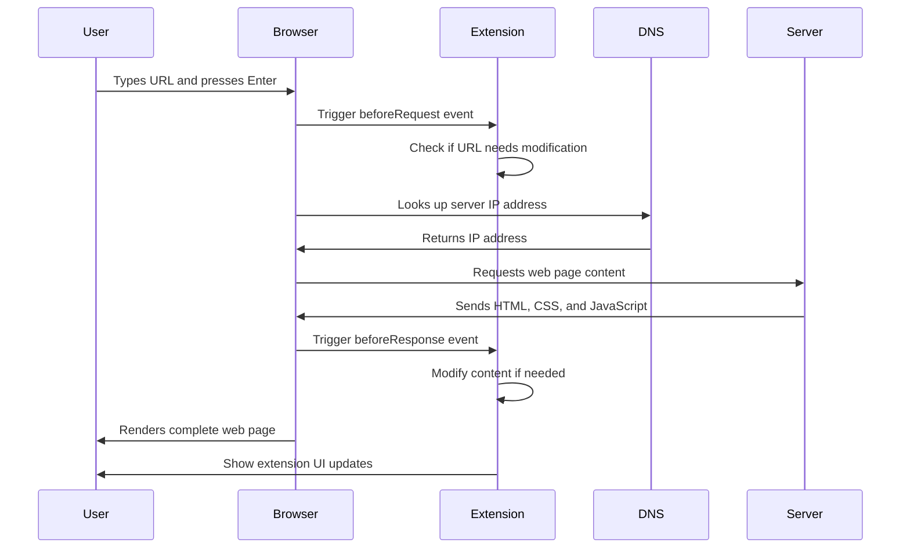
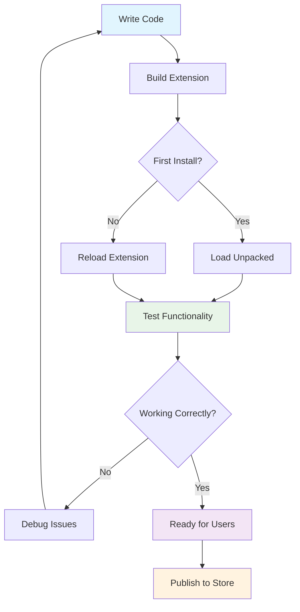
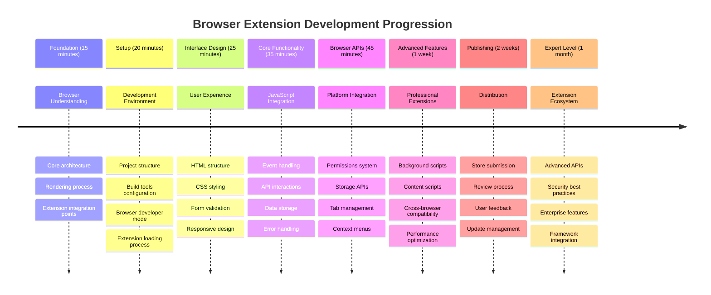

<!--
CO_OP_TRANSLATOR_METADATA:
{
  "original_hash": "00aa85715e1efd4930c17a23e3012e69",
  "translation_date": "2025-11-06T14:00:19+00:00",
  "source_file": "5-browser-extension/1-about-browsers/README.md",
  "language_code": "uk"
}
-->
# Проєкт розширення для браузера Частина 1: Все про браузери




> Скетчноут від [Wassim Chegham](https://dev.to/wassimchegham/ever-wondered-what-happens-when-you-type-in-a-url-in-an-address-bar-in-a-browser-3dob)

## Тест перед лекцією

[Тест перед лекцією](https://ff-quizzes.netlify.app/web/quiz/23)

### Вступ

Розширення для браузера — це міні-додатки, які покращують ваш досвід веб-перегляду. Як і первісне бачення Тіма Бернерса-Лі про інтерактивний веб, розширення розширюють можливості браузера за межі простого перегляду документів. Від менеджерів паролів, які забезпечують безпеку ваших акаунтів, до інструментів вибору кольорів, які допомагають дизайнерам знаходити ідеальні відтінки, розширення вирішують повсякденні проблеми веб-перегляду.

Перш ніж створити ваше перше розширення, давайте зрозуміємо, як працюють браузери. Як Олександр Грем Белл мав зрозуміти передачу звуку перед винаходом телефону, знання основ браузера допоможе вам створювати розширення, які бездоганно інтегруються з існуючими системами браузера.

До кінця цього уроку ви зрозумієте архітектуру браузера та почнете створювати своє перше розширення.



## Розуміння веб-браузерів

Веб-браузер — це, по суті, складний інтерпретатор документів. Коли ви вводите "google.com" у адресний рядок, браузер виконує складну серію операцій — запитує контент із серверів по всьому світу, а потім аналізує та відображає цей код у інтерактивні веб-сторінки, які ви бачите.

Цей процес нагадує, як перший веб-браузер WorldWideWeb був розроблений Тімом Бернерсом-Лі у 1990 році, щоб зробити гіперпосилання доступними для всіх.

✅ **Трохи історії**: Перший браузер називався 'WorldWideWeb' і був створений сером Тімоті Бернерсом-Лі у 1990 році.


> Деякі ранні браузери, через [Karen McGrane](https://www.slideshare.net/KMcGrane/week-4-ixd-history-personal-computing)

### Як браузери обробляють веб-контент

Процес між введенням URL і переглядом веб-сторінки включає кілька узгоджених кроків, які відбуваються за секунди:



**Ось що цей процес виконує:**
- **Перетворює** URL, зрозумілий людині, у IP-адресу сервера через DNS-запит
- **Встановлює** безпечне з'єднання з веб-сервером за допомогою протоколів HTTP або HTTPS
- **Запитує** конкретний контент веб-сторінки з сервера
- **Отримує** HTML-розмітку, CSS-стилі та JavaScript-код із сервера
- **Відображає** весь контент у інтерактивну веб-сторінку, яку ви бачите

### Основні функції браузера

Сучасні браузери пропонують численні функції, які розробники розширень можуть використовувати:

| Функція | Призначення | Можливості для розширень |
|---------|-------------|--------------------------|
| **Двигун рендерингу** | Відображає HTML, CSS і JavaScript | Модифікація контенту, впровадження стилів |
| **Двигун JavaScript** | Виконує JavaScript-код | Користувацькі скрипти, взаємодія з API |
| **Локальне сховище** | Зберігає дані локально | Налаштування користувача, кешовані дані |
| **Мережевий стек** | Обробляє веб-запити | Моніторинг запитів, аналіз даних |
| **Модель безпеки** | Захищає користувачів від шкідливого контенту | Фільтрація контенту, покращення безпеки |

**Розуміння цих функцій допомагає вам:**
- **Визначити**, де ваше розширення може додати найбільшу цінність
- **Вибрати** правильні API браузера для функціональності вашого розширення
- **Проєктувати** розширення, які ефективно працюють із системами браузера
- **Забезпечити**, що ваше розширення відповідає найкращим практикам безпеки браузера

### Розробка для різних браузерів

Різні браузери впроваджують стандарти з невеликими варіаціями, як різні мови програмування можуть по-різному обробляти один і той самий алгоритм. Chrome, Firefox і Safari мають унікальні характеристики, які розробники повинні враховувати під час розробки розширень.

> 💡 **Корисна порада**: Використовуйте [caniuse.com](https://www.caniuse.com), щоб перевірити, які веб-технології підтримуються в різних браузерах. Це дуже корисно при плануванні функцій вашого розширення!

**Основні аспекти для розробки розширень:**
- **Тестуйте** ваше розширення у браузерах Chrome, Firefox і Edge
- **Адаптуйтеся** до різних API розширень браузера та форматів маніфестів
- **Враховуйте** різні характеристики продуктивності та обмеження
- **Забезпечте** резервні варіанти для функцій, специфічних для браузера, які можуть бути недоступні

✅ **Аналітичний інсайт**: Ви можете визначити, які браузери віддають перевагу ваші користувачі, встановивши пакети аналітики у своїх веб-проєктах. Ці дані допоможуть вам визначити пріоритети підтримки браузерів.

## Розуміння розширень для браузера

Розширення для браузера вирішують загальні проблеми веб-перегляду, додаючи функціональність безпосередньо до інтерфейсу браузера. Замість того, щоб вимагати окремих додатків або складних робочих процесів, розширення забезпечують миттєвий доступ до інструментів і функцій.

Ця концепція нагадує, як ранні піонери комп'ютерів, такі як Дуглас Енгельбарт, уявляли собі розширення людських можливостей за допомогою технологій — розширення доповнюють базову функціональність вашого браузера.


**Популярні категорії розширень та їхні переваги:**
- **Інструменти продуктивності**: Менеджери завдань, додатки для нотаток і трекери часу, які допомагають залишатися організованими
- **Покращення безпеки**: Менеджери паролів, блокувальники реклами та інструменти конфіденційності, які захищають ваші дані
- **Інструменти для розробників**: Форматувальники коду, інструменти вибору кольорів і утиліти для налагодження, які спрощують розробку
- **Покращення контенту**: Режими читання, завантажувачі відео та інструменти для створення скріншотів, які покращують ваш веб-досвід

✅ **Питання для роздумів**: Які ваші улюблені розширення для браузера? Які конкретні завдання вони виконують і як вони покращують ваш досвід веб-перегляду?

### 🔄 **Педагогічна перевірка**
**Розуміння архітектури браузера**: Перед переходом до розробки розширень переконайтеся, що ви можете:
- ✅ Пояснити, як браузери обробляють веб-запити та відображають контент
- ✅ Визначити основні компоненти архітектури браузера
- ✅ Зрозуміти, як розширення інтегруються з функціональністю браузера
- ✅ Розпізнати модель безпеки, яка захищає користувачів

**Швидкий самотест**: Чи можете ви простежити шлях від введення URL до перегляду веб-сторінки?
1. **DNS-запит** перетворює URL у IP-адресу
2. **HTTP-запит** отримує контент із сервера
3. **Аналіз** обробляє HTML, CSS і JavaScript
4. **Відображення** показує фінальну веб-сторінку
5. **Розширення** можуть модифікувати контент на кількох етапах

## Встановлення та управління розширеннями

Розуміння процесу встановлення розширень допомагає передбачити досвід користувача під час встановлення вашого розширення. Процес встановлення стандартизований у сучасних браузерах, з невеликими варіаціями в дизайні інтерфейсу.


> **Важливо**: Переконайтеся, що ви увімкнули режим розробника та дозволили розширення з інших магазинів під час тестування власних розширень.

### Процес встановлення розширення для розробки

Коли ви розробляєте та тестуєте власні розширення, дотримуйтесь цього робочого процесу:



```bash
# Step 1: Build your extension
npm run build
```

**Що виконує ця команда:**
- **Компілірує** ваш вихідний код у файли, готові для браузера
- **Пакує** модулі JavaScript у оптимізовані пакети
- **Генерує** фінальні файли розширення у папці `/dist`
- **Готує** ваше розширення для встановлення та тестування

**Крок 2: Перейдіть до розширень браузера**
1. **Відкрийте** сторінку управління розширеннями вашого браузера
2. **Натисніть** кнопку "Налаштування та більше" (іконка `...`) у верхньому правому куті
3. **Виберіть** "Розширення" у випадаючому меню

**Крок 3: Завантажте ваше розширення**
- **Для нових установок**: Виберіть `load unpacked` і виберіть вашу папку `/dist`
- **Для оновлень**: Натисніть `reload` поруч із вашим уже встановленим розширенням
- **Для тестування**: Увімкніть "Режим розробника", щоб отримати доступ до додаткових функцій налагодження

### Встановлення розширення для продакшн

> ✅ **Примітка**: Ці інструкції для розробки призначені спеціально для розширень, які ви створюєте самостійно. Щоб встановити опубліковані розширення, відвідайте офіційні магазини розширень браузера, такі як [Microsoft Edge Add-ons store](https://microsoftedge.microsoft.com/addons/Microsoft-Edge-Extensions-Home).

**Розуміння різниці:**
- **Установки для розробки** дозволяють тестувати неопубліковані розширення під час розробки
- **Установки з магазину** забезпечують перевірені, опубліковані розширення з автоматичними оновленнями
- **Стороннє встановлення** дозволяє встановлювати розширення ззовні офіційних магазинів (вимагає режиму розробника)

## Створення розширення для відображення вуглецевого сліду

Ми створимо розширення для браузера, яке відображає вуглецевий слід використання енергії у вашому регіоні. Цей проєкт демонструє основні концепції розробки розширень, створюючи практичний інструмент для підвищення екологічної свідомості.

Цей підхід відповідає принципу "навчання через практику", який довів свою ефективність ще з часів освітніх теорій Джона Дьюї — поєднання технічних навичок із значущими реальними застосуваннями.

### Вимоги до проєкту

Перш ніж почати розробку, давайте зберемо необхідні ресурси та залежності:

**Необхідний доступ до API:**
- **[CO2 Signal API key](https://www.co2signal.com/)**: Введіть вашу електронну адресу, щоб отримати безкоштовний ключ API
- **[Код регіону](http://api.electricitymap.org/v3/zones)**: Знайдіть код вашого регіону за допомогою [Electricity Map](https://www.electricitymap.org/map) (наприклад, Бостон використовує 'US-NEISO')

**Інструменти для розробки:**
- **[Node.js і NPM](https://www.npmjs.com)**: Інструмент управління пакетами для встановлення залежностей проєкту
- **[Стартовий код](../../../../5-browser-extension/start)**: Завантажте папку `start`, щоб почати розробку

✅ **Дізнайтеся більше**: Покращте свої навички управління пакетами за допомогою цього [всебічного навчального модуля](https://docs.microsoft.com/learn/modules/create-nodejs-project-dependencies/?WT.mc_id=academic-77807-sagibbon)

### Розуміння структури проєкту

Розуміння структури проєкту допомагає ефективно організувати роботу над розробкою. Як бібліотека Александрії була організована для легкого доступу до знань, добре структурована кодова база робить розробку більш ефективною:

```
project-root/
├── dist/                    # Built extension files
│   ├── manifest.json        # Extension configuration
│   ├── index.html           # User interface markup
│   ├── background.js        # Background script functionality
│   └── main.js              # Compiled JavaScript bundle
├── src/                     # Source development files
│   └── index.js             # Your main JavaScript code
├── package.json             # Project dependencies and scripts
└── webpack.config.js        # Build configuration
```

**Розбір того, що виконує кожен файл:**
- **`manifest.json`**: **Визначає** метадані розширення, дозволи та точки входу
- **`index.html`**: **Створює** інтерфейс користувача, який з'являється при натисканні на ваше розширення
- **`background.js`**: **Обробляє** фонові завдання та слухачі подій браузера
- **`main.js`**: **Містить** фінальний зібраний JavaScript після процесу збірки
- **`src/index.js`**: **Містить** ваш основний код розробки, який компілюється у `main.js`

> 💡 **Порада щодо організації**: Зберігайте ваш ключ API та код регіону у безпечній нотатці для легкого доступу під час розробки. Вам знадобляться ці значення для тестування функціональності вашого розширення.

✅ **Примітка щодо безпеки**: Ніколи не додавайте ключі API або конфіденційні дані до вашого репозиторію коду. Ми покажемо вам, як безпечно обробляти ці дані у наступних кроках.

## Створення інтерфейсу розширення

Тепер ми створимо компоненти інтерфейсу користувача. Розширення використовує підхід із двома екранами: екран налаштувань для початкової конфігурації та екран результатів для відображення даних.

Це відповідає принципу поступового розкриття, який використовується в дизайні інтерфейсів з ранніх часів обчислювальної техніки — надання інформації та опцій у логічній послідовності, щоб уникнути перевантаження користувачів.

### Огляд вигляду розширення

**Екран налаштувань** - Конфігурація для першого використання:


**Екран результатів** - Відображення даних про вуглецевий слід:


### Створення форми конфігурації

Форма налаштувань збирає дані конфігурації користувача під час першого використання.
1. **Запустіть** команду збірки, щоб скомпілювати ваш код  
2. **Завантажте** розширення у ваш браузер, використовуючи режим розробника  
3. **Перевірте**, чи форма відображається правильно і виглядає професійно  
4. **Переконайтеся**, що всі елементи форми правильно вирівняні та функціонують  

**Що ви досягли:**  
- **Створили** базову HTML-структуру для вашого розширення  
- **Розробили** інтерфейси конфігурації та результатів із правильним семантичним розміткою  
- **Налаштували** сучасний робочий процес розробки, використовуючи інструменти стандарту галузі  
- **Підготували** основу для додавання інтерактивної функціональності JavaScript  

### 🔄 **Педагогічна перевірка**  
**Прогрес у розробці розширення**: Перевірте своє розуміння перед продовженням:  
- ✅ Чи можете ви пояснити призначення кожного файлу в структурі проекту?  
- ✅ Чи розумієте ви, як процес збірки трансформує ваш вихідний код?  
- ✅ Чому ми розділяємо конфігурацію та результати на різні секції інтерфейсу?  
- ✅ Як структура форми підтримує зручність використання та доступність?  

**Розуміння робочого процесу розробки**: Тепер ви повинні вміти:  
1. **Модифікувати** HTML і CSS для інтерфейсу вашого розширення  
2. **Запустити** команду збірки, щоб скомпілювати ваші зміни  
3. **Перезавантажити** розширення у браузері для тестування оновлень  
4. **Виправляти** помилки за допомогою інструментів розробника браузера  

Ви завершили перший етап розробки розширення для браузера. Як брати Райт спочатку повинні були зрозуміти аеродинаміку перед тим, як досягти польоту, так і розуміння цих базових концепцій готує вас до створення більш складних інтерактивних функцій у наступному уроці.  

## Виклик GitHub Copilot Agent 🚀  

Використовуйте режим Agent, щоб виконати наступний виклик:  

**Опис:** Покращіть розширення для браузера, додавши функції перевірки форми та зворотного зв’язку для покращення досвіду користувача при введенні ключів API та кодів регіонів.  

**Підказка:** Створіть функції перевірки JavaScript, які перевіряють, чи містить поле ключа API щонайменше 20 символів і чи відповідає код регіону правильному формату (наприклад, 'US-NEISO'). Додайте візуальний зворотний зв’язок, змінюючи кольори рамки введення на зелений для правильних даних і червоний для неправильних. Також додайте функцію перемикання для показу/приховування ключа API з метою безпеки.  

Дізнайтеся більше про [режим Agent](https://code.visualstudio.com/blogs/2025/02/24/introducing-copilot-agent-mode) тут.  

## 🚀 Виклик  

Перегляньте магазин розширень для браузера та встановіть одне у ваш браузер. Ви можете досліджувати його файли цікавими способами. Що ви відкрили?  

## Тест після лекції  

[Тест після лекції](https://ff-quizzes.netlify.app/web/quiz/24)  

## Огляд і самостійне навчання  

У цьому уроці ви дізналися трохи про історію веб-браузера; скористайтеся цією можливістю, щоб дізнатися, як винахідники Всесвітньої павутини уявляли її використання, прочитавши більше про її історію. Деякі корисні сайти включають:  

[Історія веб-браузерів](https://www.mozilla.org/firefox/browsers/browser-history/)  

[Історія вебу](https://webfoundation.org/about/vision/history-of-the-web/)  

[Інтерв’ю з Тімом Бернерсом-Лі](https://www.theguardian.com/technology/2019/mar/12/tim-berners-lee-on-30-years-of-the-web-if-we-dream-a-little-we-can-get-the-web-we-want)  

### ⚡ **Що ви можете зробити за наступні 5 хвилин**  
- [ ] Відкрийте сторінку розширень Chrome/Edge (chrome://extensions) і досліджуйте, що у вас встановлено  
- [ ] Перегляньте вкладку "Мережа" в інструментах розробника браузера під час завантаження веб-сторінки  
- [ ] Спробуйте переглянути джерело сторінки (Ctrl+U), щоб побачити структуру HTML  
- [ ] Перевірте будь-який елемент веб-сторінки та змініть його CSS в інструментах розробника  

### 🎯 **Що ви можете досягти за годину**  
- [ ] Завершіть тест після уроку та зрозумійте основи браузера  
- [ ] Створіть базовий файл manifest.json для розширення браузера  
- [ ] Розробіть просте розширення "Hello World", яке показує спливаюче вікно  
- [ ] Перевірте завантаження вашого розширення в режимі розробника  
- [ ] Досліджуйте документацію розширень браузера для вашого цільового браузера  

### 📅 **Ваш тижневий шлях до розробки розширення**  
- [ ] Завершіть функціональне розширення браузера з реальною корисністю  
- [ ] Дізнайтеся про скрипти контенту, фонові скрипти та взаємодію зі спливаючими вікнами  
- [ ] Освойте API браузера, такі як зберігання, вкладки та обмін повідомленнями  
- [ ] Розробіть зручні інтерфейси для вашого розширення  
- [ ] Перевірте ваше розширення на різних веб-сайтах і сценаріях  
- [ ] Опублікуйте ваше розширення в магазині розширень браузера  

### 🌟 **Ваш місячний шлях до розробки браузера**  
- [ ] Розробіть кілька розширень, які вирішують різні проблеми користувачів  
- [ ] Вивчіть розширені API браузера та найкращі практики безпеки  
- [ ] Внесіть вклад у проекти з відкритим кодом для розширень браузера  
- [ ] Освойте сумісність між браузерами та прогресивне вдосконалення  
- [ ] Створіть інструменти та шаблони для розробки розширень для інших  
- [ ] Станьте експертом з розширень браузера, який допомагає іншим розробникам  

## 🎯 Ваш графік освоєння розробки розширень для браузера  


  
### 🛠️ Підсумок вашого інструментарію для розробки розширень  

Після завершення цього уроку ви тепер маєте:  
- **Знання архітектури браузера**: Розуміння механізмів рендерингу, моделей безпеки та інтеграції розширень  
- **Середовище розробки**: Сучасний набір інструментів із Webpack, NPM та можливостями налагодження  
- **Основи UI/UX**: Семантична HTML-структура з прогресивними шаблонами розкриття  
- **Обізнаність про безпеку**: Розуміння дозволів браузера та безпечних практик розробки  
- **Концепції міжбраузерної сумісності**: Знання про тестування та підходи до сумісності  
- **Інтеграція API**: Основи роботи із зовнішніми джерелами даних  
- **Професійний робочий процес**: Процедури розробки та тестування за стандартами галузі  

**Застосування в реальному світі**: Ці навички безпосередньо застосовуються до:  
- **Веб-розробки**: Односторінкових додатків і прогресивних веб-додатків  
- **Десктопних додатків**: Electron і веб-орієнтованого десктопного програмного забезпечення  
- **Мобільної розробки**: Гібридних додатків і веб-орієнтованих мобільних рішень  
- **Інструментів для підприємств**: Внутрішніх додатків для продуктивності та автоматизації робочих процесів  
- **Відкритого коду**: Внесок у проекти розширень браузера та веб-стандарти  

**Наступний рівень**: Ви готові додати інтерактивну функціональність, працювати з API браузера та створювати розширення, які вирішують реальні проблеми користувачів!  

## Завдання  

[Змініть стиль вашого розширення](assignment.md)  

---

**Відмова від відповідальності**:  
Цей документ був перекладений за допомогою сервісу автоматичного перекладу [Co-op Translator](https://github.com/Azure/co-op-translator). Хоча ми прагнемо до точності, будь ласка, майте на увазі, що автоматичні переклади можуть містити помилки або неточності. Оригінальний документ на його рідній мові слід вважати авторитетним джерелом. Для критичної інформації рекомендується професійний людський переклад. Ми не несемо відповідальності за будь-які непорозуміння або неправильні тлумачення, що виникають внаслідок використання цього перекладу.