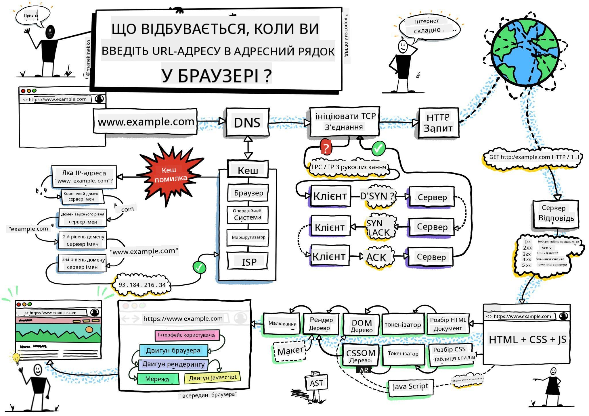
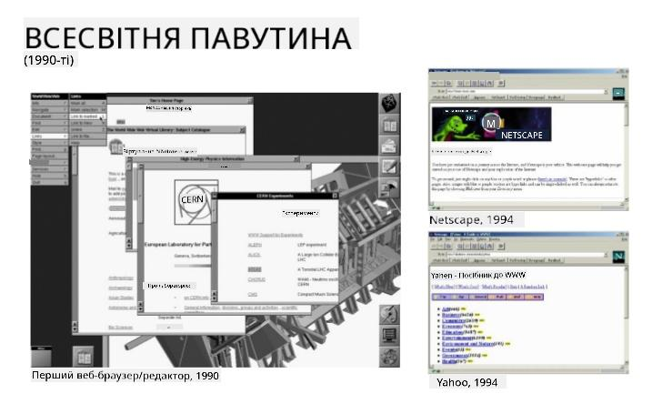
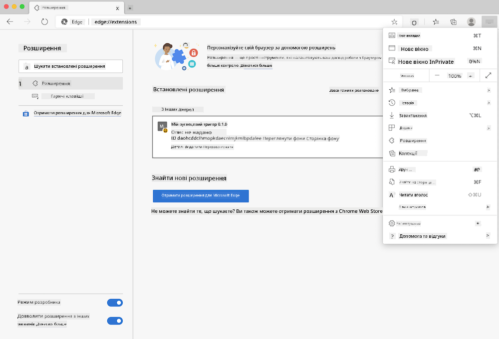
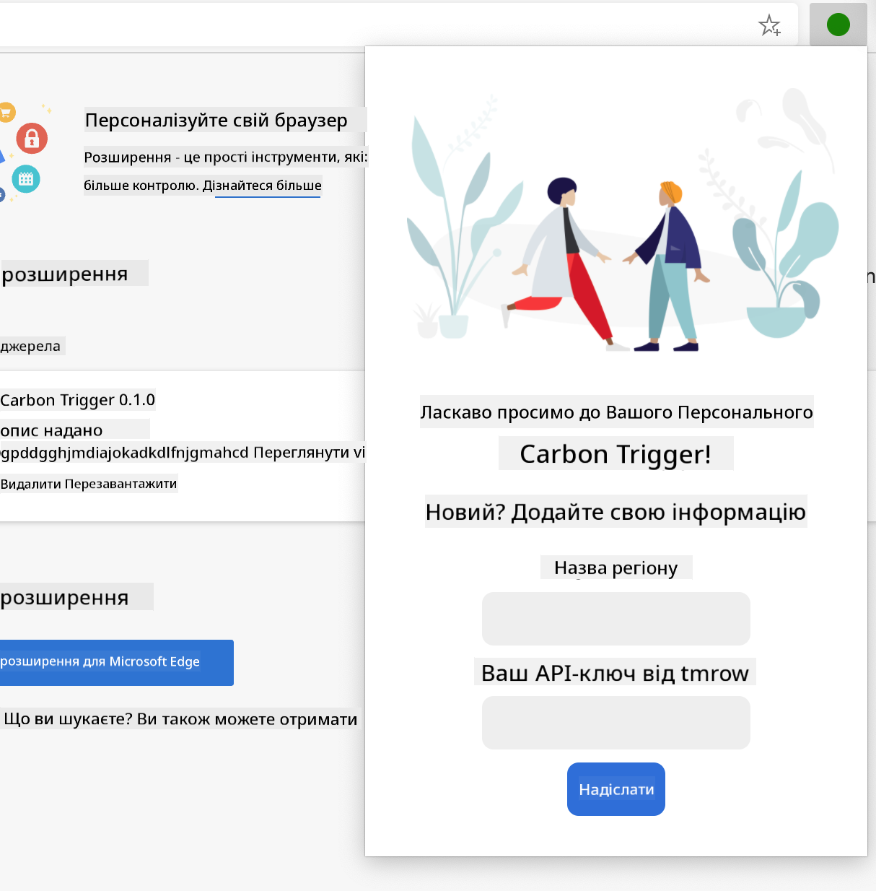
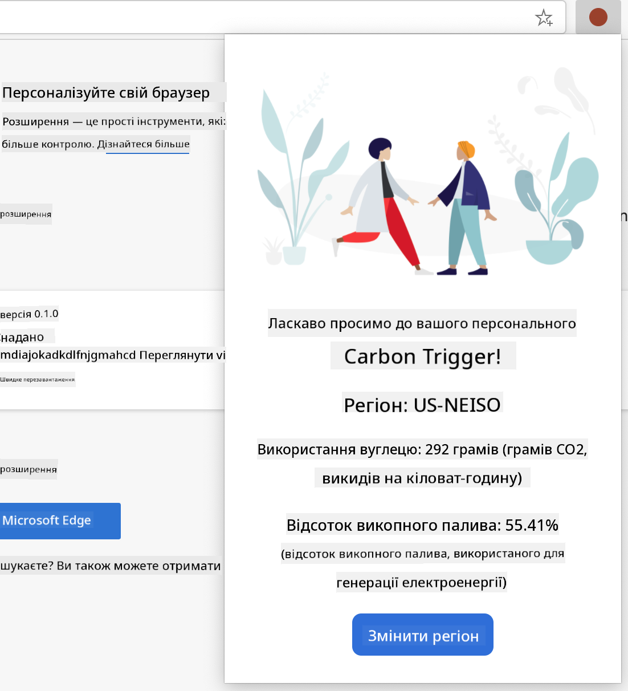

<!--
CO_OP_TRANSLATOR_METADATA:
{
  "original_hash": "0bb55e0b98600afab801eea115228873",
  "translation_date": "2025-08-27T22:09:38+00:00",
  "source_file": "5-browser-extension/1-about-browsers/README.md",
  "language_code": "uk"
}
-->
# Проєкт розширення для браузера Частина 1: Все про браузери


> Скетчноут від [Wassim Chegham](https://dev.to/wassimchegham/ever-wondered-what-happens-when-you-type-in-a-url-in-an-address-bar-in-a-browser-3dob)

## Тест перед лекцією

[Тест перед лекцією](https://ashy-river-0debb7803.1.azurestaticapps.net/quiz/23)

### Вступ

Розширення для браузера додають додаткову функціональність до браузера. Але перед тим, як створювати одне з них, варто трохи дізнатися про те, як браузери виконують свою роботу.

### Про браузер

У цьому циклі уроків ви навчитеся створювати розширення для браузера, яке працюватиме в Chrome, Firefox та Edge. У цій частині ви дізнаєтеся, як працюють браузери, і створите структуру елементів розширення для браузера.

Але що таке браузер? Це програмне забезпечення, яке дозволяє кінцевому користувачеві отримувати контент із сервера та відображати його на веб-сторінках.

✅ Трохи історії: перший браузер називався "WorldWideWeb" і був створений сером Тімоті Бернерсом-Лі у 1990 році.


> Деякі ранні браузери, через [Karen McGrane](https://www.slideshare.net/KMcGrane/week-4-ixd-history-personal-computing)

Коли користувач підключається до інтернету, використовуючи адресу URL (Uniform Resource Locator), зазвичай через протокол передачі гіпертексту `http` або `https`, браузер взаємодіє з веб-сервером і отримує веб-сторінку.

На цьому етапі механізм рендерингу браузера відображає її на пристрої користувача, який може бути мобільним телефоном, настільним комп'ютером або ноутбуком.

Браузери також мають можливість кешувати контент, щоб його не доводилося отримувати з сервера кожного разу. Вони можуть записувати історію активності користувача, зберігати "куки" — невеликі фрагменти даних, які містять інформацію про активність користувача, і багато іншого.

Важливо пам'ятати, що браузери не однакові! Кожен браузер має свої сильні та слабкі сторони, і професійний веб-розробник повинен розуміти, як зробити веб-сторінки ефективними для різних браузерів. Це включає роботу з маленькими екранами, такими як мобільні телефони, а також з користувачами, які перебувають офлайн.

Дуже корисний веб-сайт, який варто додати в закладки у вашому улюбленому браузері, — це [caniuse.com](https://www.caniuse.com). Коли ви створюєте веб-сторінки, дуже корисно використовувати списки підтримуваних технологій на цьому сайті, щоб найкраще підтримувати своїх користувачів.

✅ Як дізнатися, які браузери найпопулярніші серед користувачів вашого веб-сайту? Перевірте свою аналітику — ви можете встановити різні пакети аналітики як частину процесу веб-розробки, і вони покажуть вам, які браузери найчастіше використовуються.

## Розширення для браузера

Чому варто створювати розширення для браузера? Це зручний інструмент, який можна прикріпити до браузера для швидкого доступу до завдань, які ви часто повторюєте. Наприклад, якщо вам потрібно перевіряти кольори на різних веб-сторінках, які ви використовуєте, ви можете встановити розширення для вибору кольорів. Якщо вам важко запам'ятовувати паролі, ви можете використовувати розширення для управління паролями.

Розширення для браузера також цікаво розробляти. Вони зазвичай виконують обмежену кількість завдань, але роблять це дуже добре.

✅ Які ваші улюблені розширення для браузера? Які завдання вони виконують?

### Встановлення розширень

Перед тим, як почати створювати, ознайомтеся з процесом створення та розгортання розширення для браузера. Хоча кожен браузер трохи відрізняється у тому, як він управляє цим завданням, процес схожий у Chrome і Firefox на прикладі Edge:



> Примітка: Переконайтеся, що ви увімкнули режим розробника та дозволили встановлення розширень з інших магазинів.

Суть процесу:

- створіть своє розширення, використовуючи `npm run build` 
- перейдіть у браузері до панелі розширень, використовуючи кнопку "Налаштування та інше" (значок `...`) у верхньому правому куті
- якщо це нова установка, виберіть `load unpacked`, щоб завантажити нове розширення з його папки збірки (у нашому випадку це `/dist`) 
- або натисніть `reload`, якщо ви перезавантажуєте вже встановлене розширення

✅ Ці інструкції стосуються розширень, які ви створюєте самостійно; щоб встановити розширення, які вже випущені в магазин розширень браузера, перейдіть до відповідних [магазинів](https://microsoftedge.microsoft.com/addons/Microsoft-Edge-Extensions-Home) і встановіть потрібне розширення.

### Початок роботи

Ви створите розширення для браузера, яке відображатиме вуглецевий слід вашого регіону, показуючи енергоспоживання вашого регіону та джерело енергії. Розширення матиме форму для збору ключа API, щоб ви могли отримати доступ до API CO2 Signal.

**Вам потрібно:**

- [ключ API](https://www.co2signal.com/); введіть свою електронну адресу у поле на цій сторінці, і вам буде надіслано ключ
- [код вашого регіону](http://api.electricitymap.org/v3/zones), який відповідає [Electricity Map](https://www.electricitymap.org/map) (наприклад, у Бостоні я використовую 'US-NEISO').
- [початковий код](../../../../5-browser-extension/start). Завантажте папку `start`; ви будете доповнювати код у цій папці.
- [NPM](https://www.npmjs.com) - NPM — це інструмент управління пакетами; встановіть його локально, і пакети, зазначені у вашому файлі `package.json`, будуть встановлені для використання у вашому веб-активі

✅ Дізнайтеся більше про управління пакетами у цьому [чудовому модулі Learn](https://docs.microsoft.com/learn/modules/create-nodejs-project-dependencies/?WT.mc_id=academic-77807-sagibbon)

Приділіть хвилину, щоб переглянути кодову базу:

dist
    -|manifest.json (налаштування за замовчуванням тут)
    -|index.html (HTML-розмітка фронтенду тут)
    -|background.js (JS для фону тут)
    -|main.js (збірка JS)
src
    -|index.js (ваш JS-код тут)

✅ Як тільки у вас буде ключ API та код регіону, збережіть їх десь у нотатках для подальшого використання.

### Створення HTML для розширення

Це розширення має два вигляди. Один для збору ключа API та коду регіону:



І другий для відображення вуглецевого споживання регіону:



Почнемо зі створення HTML для форми та стилізації її за допомогою CSS.

У папці `/dist` ви створите форму та область результатів. У файлі `index.html` заповніть позначену область форми:

```HTML
<form class="form-data" autocomplete="on">
	<div>
		<h2>New? Add your Information</h2>
	</div>
	<div>
		<label for="region">Region Name</label>
		<input type="text" id="region" required class="region-name" />
	</div>
	<div>
		<label for="api">Your API Key from tmrow</label>
		<input type="text" id="api" required class="api-key" />
	</div>
	<button class="search-btn">Submit</button>
</form>	
```
Це форма, де збережена інформація буде введена та збережена у локальному сховищі.

Далі створіть область результатів; під фінальним тегом форми додайте кілька div:

```HTML
<div class="result">
	<div class="loading">loading...</div>
	<div class="errors"></div>
	<div class="data"></div>
	<div class="result-container">
		<p><strong>Region: </strong><span class="my-region"></span></p>
		<p><strong>Carbon Usage: </strong><span class="carbon-usage"></span></p>
		<p><strong>Fossil Fuel Percentage: </strong><span class="fossil-fuel"></span></p>
	</div>
	<button class="clear-btn">Change region</button>
</div>
```
На цьому етапі ви можете спробувати збірку. Переконайтеся, що встановили залежності пакета цього розширення:

```
npm install
```

Ця команда використовуватиме npm, менеджер пакетів Node, для встановлення webpack для процесу збірки вашого розширення. Ви можете побачити результат цього процесу, переглянувши `/dist/main.js` — ви побачите, що код був зібраний.

На даний момент розширення має зібратися, і якщо ви розгорнете його в Edge як розширення, ви побачите акуратно відображену форму.

Вітаємо, ви зробили перші кроки до створення розширення для браузера. У наступних уроках ви зробите його більш функціональним та корисним.

---

## 🚀 Виклик

Перегляньте магазин розширень для браузера та встановіть одне з них у свій браузер. Ви можете дослідити його файли цікавими способами. Що ви відкрили?

## Тест після лекції

[Тест після лекції](https://ashy-river-0debb7803.1.azurestaticapps.net/quiz/24)

## Огляд та самостійне навчання

На цьому уроці ви дізналися трохи про історію веб-браузера; скористайтеся цією можливістю, щоб дізнатися, як винахідники Всесвітньої павутини уявляли її використання, прочитавши більше про її історію. Деякі корисні сайти:

[Історія веб-браузерів](https://www.mozilla.org/firefox/browsers/browser-history/)

[Історія вебу](https://webfoundation.org/about/vision/history-of-the-web/)

[Інтерв'ю з Тімом Бернерсом-Лі](https://www.theguardian.com/technology/2019/mar/12/tim-berners-lee-on-30-years-of-the-web-if-we-dream-a-little-we-can-get-the-web-we-want)

## Завдання 

[Змініть стиль вашого розширення](assignment.md)

---

**Відмова від відповідальності**:  
Цей документ був перекладений за допомогою сервісу автоматичного перекладу [Co-op Translator](https://github.com/Azure/co-op-translator). Хоча ми прагнемо до точності, будь ласка, майте на увазі, що автоматичні переклади можуть містити помилки або неточності. Оригінальний документ на його рідній мові слід вважати авторитетним джерелом. Для критично важливої інформації рекомендується професійний людський переклад. Ми не несемо відповідальності за будь-які непорозуміння або неправильні тлумачення, що виникають внаслідок використання цього перекладу.