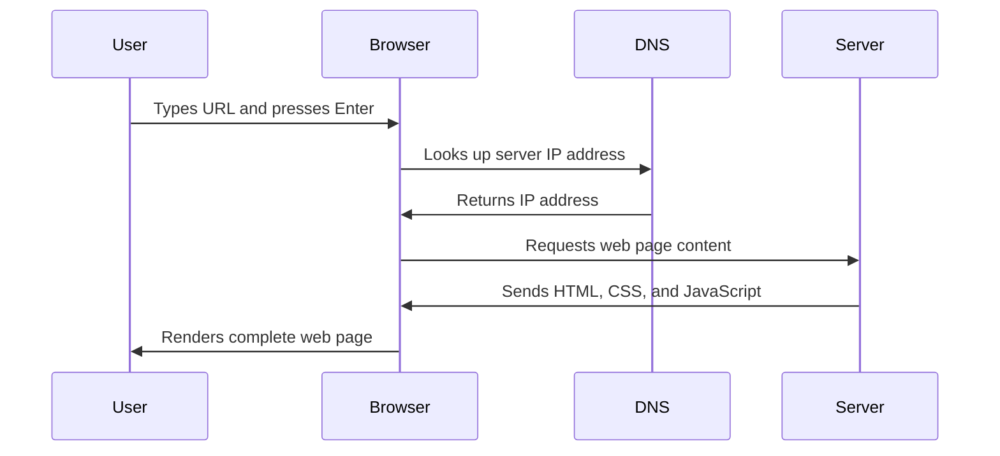

<!--
CO_OP_TRANSLATOR_METADATA:
{
  "original_hash": "33a875c522f237a2026e4653240dfc07",
  "translation_date": "2025-10-24T16:02:26+00:00",
  "source_file": "5-browser-extension/1-about-browsers/README.md",
  "language_code": "uk"
}
-->
# Проєкт розширення для браузера, частина 1: Все про браузери


> Скетчноут від [Wassim Chegham](https://dev.to/wassimchegham/ever-wondered-what-happens-when-you-type-in-a-url-in-an-address-bar-in-a-browser-3dob)

## Тест перед лекцією

[Тест перед лекцією](https://ff-quizzes.netlify.app/web/quiz/23)

### Вступ

Розширення для браузера — це міні-додатки, які покращують ваш досвід веб-перегляду. Як і в оригінальному баченні інтерактивного вебу Тіма Бернерса-Лі, розширення розширюють можливості браузера за межі простого перегляду документів. Від менеджерів паролів, які забезпечують безпеку ваших акаунтів, до інструментів вибору кольорів, які допомагають дизайнерам знаходити ідеальні відтінки, розширення вирішують повсякденні проблеми веб-перегляду.

Перед тим як створити ваше перше розширення, давайте зрозуміємо, як працюють браузери. Як Олександру Грему Беллу потрібно було зрозуміти передачу звуку перед винаходом телефону, знання основ браузера допоможе вам створювати розширення, які бездоганно інтегруються з існуючими системами браузера.

До кінця цього уроку ви зрозумієте архітектуру браузера та почнете створювати своє перше розширення.

## Розуміння веб-браузерів

Веб-браузер — це, по суті, складний інтерпретатор документів. Коли ви вводите "google.com" у адресний рядок, браузер виконує складну серію операцій — запитує контент із серверів по всьому світу, а потім аналізує та відображає цей код у вигляді інтерактивних веб-сторінок, які ви бачите.

Цей процес нагадує, як перший веб-браузер WorldWideWeb був розроблений Тімом Бернерсом-Лі у 1990 році, щоб зробити гіперпосилання доступними для всіх.

✅ **Трохи історії**: Перший браузер називався 'WorldWideWeb' і був створений сером Тімоті Бернерсом-Лі у 1990 році.


> Деякі ранні браузери, через [Karen McGrane](https://www.slideshare.net/KMcGrane/week-4-ixd-history-personal-computing)

### Як браузери обробляють веб-контент

Процес між введенням URL і переглядом веб-сторінки включає кілька скоординованих кроків, які відбуваються за секунди:



**Ось що виконує цей процес:**
- **Перетворює** URL, зрозумілий людині, у IP-адресу сервера через DNS-запит
- **Встановлює** безпечне з'єднання з веб-сервером за допомогою протоколів HTTP або HTTPS
- **Запитує** конкретний контент веб-сторінки з сервера
- **Отримує** HTML-розмітку, стилі CSS та код JavaScript із сервера
- **Відображає** весь контент у вигляді інтерактивної веб-сторінки, яку ви бачите

### Основні функції браузера

Сучасні браузери надають безліч функцій, які розробники розширень можуть використовувати:

| Функція | Призначення | Можливості для розширень |
|---------|-------------|--------------------------|
| **Двигун рендерингу** | Відображає HTML, CSS та JavaScript | Модифікація контенту, впровадження стилів |
| **Двигун JavaScript** | Виконує код JavaScript | Користувацькі скрипти, взаємодія з API |
| **Локальне сховище** | Зберігає дані локально | Налаштування користувача, кешовані дані |
| **Мережевий стек** | Обробляє веб-запити | Моніторинг запитів, аналіз даних |
| **Модель безпеки** | Захищає користувачів від шкідливого контенту | Фільтрація контенту, покращення безпеки |

**Розуміння цих функцій допомагає вам:**
- **Визначити**, де ваше розширення може принести найбільшу користь
- **Обрати** правильні API браузера для функціональності вашого розширення
- **Розробити** розширення, які ефективно працюють із системами браузера
- **Забезпечити**, що ваше розширення відповідає найкращим практикам безпеки браузера

### Розробка для різних браузерів

Різні браузери впроваджують стандарти з невеликими варіаціями, як різні мови програмування можуть по-різному обробляти один і той самий алгоритм. Chrome, Firefox і Safari мають унікальні характеристики, які розробники повинні враховувати під час розробки розширень.

> 💡 **Корисна порада**: Використовуйте [caniuse.com](https://www.caniuse.com), щоб перевірити, які веб-технології підтримуються в різних браузерах. Це незамінно при плануванні функцій вашого розширення!

**Основні аспекти для розробки розширень:**
- **Тестуйте** ваше розширення у браузерах Chrome, Firefox та Edge
- **Адаптуйтеся** до різних API розширень браузера та форматів маніфестів
- **Враховуйте** різні характеристики продуктивності та обмеження
- **Забезпечте** резервні варіанти для функцій, специфічних для браузера, які можуть бути недоступні

✅ **Аналітичний інсайт**: Ви можете визначити, які браузери віддають перевагу ваші користувачі, встановивши пакети аналітики у своїх веб-проєктах. Ці дані допоможуть вам визначити, які браузери підтримувати в першу чергу.

## Розуміння розширень для браузера

Розширення для браузера вирішують поширені проблеми веб-перегляду, додаючи функціональність безпосередньо до інтерфейсу браузера. Замість того, щоб вимагати окремих додатків або складних робочих процесів, розширення забезпечують миттєвий доступ до інструментів і функцій.

Ця концепція нагадує, як ранні піонери комп'ютерів, такі як Дуглас Енгельбарт, уявляли собі розширення людських можливостей за допомогою технологій — розширення доповнюють базову функціональність вашого браузера.

**Популярні категорії розширень та їхні переваги:**
- **Інструменти продуктивності**: Менеджери завдань, додатки для нотаток та трекери часу, які допомагають залишатися організованими
- **Покращення безпеки**: Менеджери паролів, блокувальники реклами та інструменти конфіденційності, які захищають ваші дані
- **Інструменти для розробників**: Форматувальники коду, інструменти вибору кольорів та утиліти для налагодження, які спрощують розробку
- **Покращення контенту**: Режими читання, завантажувачі відео та інструменти для створення скріншотів, які покращують ваш веб-досвід

✅ **Питання для роздумів**: Які ваші улюблені розширення для браузера? Які конкретні завдання вони виконують і як вони покращують ваш досвід веб-перегляду?

## Встановлення та управління розширеннями

Розуміння процесу встановлення розширень допомагає передбачити досвід користувача під час встановлення вашого розширення. Процес встановлення стандартизований у сучасних браузерах, з невеликими варіаціями в дизайні інтерфейсу.


> **Важливо**: Переконайтеся, що ви увімкнули режим розробника та дозволили розширення з інших магазинів під час тестування власних розширень.

### Процес встановлення розширення для розробки

Коли ви розробляєте та тестуєте власні розширення, дотримуйтесь цього робочого процесу:

```bash
# Step 1: Build your extension
npm run build
```

**Що виконує ця команда:**
- **Компілірує** ваш вихідний код у файли, готові для браузера
- **Пакує** модулі JavaScript у оптимізовані пакети
- **Генерує** фінальні файли розширення у папці `/dist`
- **Готує** ваше розширення до встановлення та тестування

**Крок 2: Перейдіть до розширень браузера**
1. **Відкрийте** сторінку управління розширеннями вашого браузера
2. **Натисніть** кнопку "Налаштування та інше" (іконка `...`) у верхньому правому куті
3. **Виберіть** "Розширення" у випадаючому меню

**Крок 3: Завантажте своє розширення**
- **Для нових встановлень**: Виберіть `load unpacked` і оберіть вашу папку `/dist`
- **Для оновлень**: Натисніть `reload` поруч із вашим уже встановленим розширенням
- **Для тестування**: Увімкніть "Режим розробника", щоб отримати доступ до додаткових функцій налагодження

### Встановлення розширення для використання

> ✅ **Примітка**: Ці інструкції для розробки призначені для розширень, які ви створюєте самостійно. Для встановлення опублікованих розширень відвідайте офіційні магазини розширень браузера, такі як [Microsoft Edge Add-ons store](https://microsoftedge.microsoft.com/addons/Microsoft-Edge-Extensions-Home).

**Розуміння різниці:**
- **Встановлення для розробки** дозволяє тестувати неопубліковані розширення під час розробки
- **Встановлення з магазину** забезпечує перевірені, опубліковані розширення з автоматичними оновленнями
- **Стороннє встановлення** дозволяє встановлювати розширення поза офіційними магазинами (вимагає режиму розробника)

## Створення розширення для відображення вуглецевого сліду

Ми створимо розширення для браузера, яке відображає вуглецевий слід використання енергії у вашому регіоні. Цей проєкт демонструє основні концепції розробки розширень, створюючи практичний інструмент для підвищення екологічної свідомості.

Цей підхід відповідає принципу "навчання через практику", який довів свою ефективність ще з часів освітніх теорій Джона Дьюї — поєднання технічних навичок із значущими реальними застосуваннями.

### Вимоги до проєкту

Перед початком розробки зберемо необхідні ресурси та залежності:

**Необхідний доступ до API:**
- **[CO2 Signal API key](https://www.co2signal.com/)**: Введіть свою електронну адресу, щоб отримати безкоштовний ключ API
- **[Код регіону](http://api.electricitymap.org/v3/zones)**: Знайдіть код вашого регіону за допомогою [Electricity Map](https://www.electricitymap.org/map) (наприклад, для Бостона використовується 'US-NEISO')

**Інструменти для розробки:**
- **[Node.js та NPM](https://www.npmjs.com)**: Інструмент управління пакетами для встановлення залежностей проєкту
- **[Стартовий код](../../../../5-browser-extension/start)**: Завантажте папку `start`, щоб розпочати розробку

✅ **Дізнайтеся більше**: Покращте свої навички управління пакетами за допомогою цього [всебічного навчального модуля](https://docs.microsoft.com/learn/modules/create-nodejs-project-dependencies/?WT.mc_id=academic-77807-sagibbon)

### Розуміння структури проєкту

Розуміння структури проєкту допомагає ефективно організувати роботу над розробкою. Як бібліотека Александрії була організована для легкого доступу до знань, добре структурована кодова база робить розробку більш ефективною:

```
project-root/
├── dist/                    # Built extension files
│   ├── manifest.json        # Extension configuration
│   ├── index.html           # User interface markup
│   ├── background.js        # Background script functionality
│   └── main.js              # Compiled JavaScript bundle
└── src/                     # Source development files
    └── index.js             # Your main JavaScript code
```

**Розбір того, що виконує кожен файл:**
- **`manifest.json`**: **Визначає** метадані розширення, дозволи та точки входу
- **`index.html`**: **Створює** інтерфейс користувача, який з'являється при натисканні на ваше розширення
- **`background.js`**: **Обробляє** фонові завдання та слухачі подій браузера
- **`main.js`**: **Містить** фінальний зібраний JavaScript після процесу збірки
- **`src/index.js`**: **Містить** ваш основний код розробки, який компілюється у `main.js`

> 💡 **Порада щодо організації**: Зберігайте ваш ключ API та код регіону у безпечному нотатнику для легкого доступу під час розробки. Вам знадобляться ці значення для тестування функціональності вашого розширення.

✅ **Примітка щодо безпеки**: Ніколи не додавайте ключі API або конфіденційні дані до вашого репозиторію коду. Ми покажемо вам, як безпечно обробляти ці дані у наступних кроках.

## Створення інтерфейсу розширення

Тепер ми створимо компоненти інтерфейсу користувача. Розширення використовує підхід із двома екранами: екран налаштувань для початкової конфігурації та екран результатів для відображення даних.

Це відповідає принципу поступового розкриття, який використовується в дизайні інтерфейсів з ранніх часів обчислювальної техніки — надання інформації та опцій у логічній послідовності, щоб уникнути перевантаження користувачів.

### Огляд вигляду розширення

**Екран налаштувань** - Конфігурація для нових користувачів:


**Екран результатів** - Відображення даних про вуглецевий слід:


### Створення форми конфігурації

Форма налаштувань збирає дані конфігурації користувача під час першого використання. Після налаштування ця інформація зберігається у сховищі браузера для майбутніх сеансів.

У файлі `/dist/index.html` додайте таку структуру форми:

```html
<form class="form-data" autocomplete="on">
    <div>
        <h2>New? Add your Information</h2>
    </div>
    <div>
        <label for="region">Region Name</label>
        <input type="text" id="region" required class="region-name" />
    </div>
    <div>
        <label for="api">Your API Key from tmrow</label>
        <input type="text" id="api" required class="api-key" />
    </div>
    <button class="search-btn">Submit</button>
</form>
```

**Ось що виконує ця форма:**
- **Створює** семантичну структуру форми з правильними асоціаціями міток та полів введення
- **Дозволяє** функціональність автозаповнення браузера для покращення досвіду користувача
- **Вимагає**, щоб обидва поля були заповнені перед відправкою, використовуючи атрибут `required`
- **Організовує** поля введення з описовими класами для легкого стилізування та цільового використання в JavaScript
- **Надає** чіткі інструкції для користувачів, які вперше налаштовують розширення

### Створення відображення результатів

Далі створіть область результатів, яка буде показувати дані про вуглецевий слід. Додайте цей HTML під формою:

```html
<div class="result">
    <div class="loading">loading...</div>
    <div class="errors"></div>
    <div class="data"></div>
    <div class="result-container">
        <p><strong>Region: </strong><span class="my-region"></span></p>
        <p><strong>Carbon Usage: </strong><span class="carbon-usage"></span></p>
        <p><strong>Fossil Fuel Percentage: </strong><span class="fossil-fuel"></span></p>
    </div>
    <button class="clear-btn">Change region</button>
</div>
```

**Розбір того, що забезпечує ця структура:**

**Опис:** Покращіть розширення для браузера, додавши функції перевірки форм і зворотного зв’язку для користувачів, щоб поліпшити досвід введення ключів API та кодів регіонів.

**Завдання:** Створіть функції перевірки на JavaScript, які перевіряють, чи містить поле ключа API щонайменше 20 символів, а код регіону відповідає правильному формату (наприклад, 'US-NEISO'). Додайте візуальний зворотний зв’язок, змінюючи кольори рамки введення на зелений для правильних даних і червоний для неправильних. Також додайте функцію перемикання для показу/приховування ключа API з метою безпеки.

Дізнайтеся більше про [режим агента](https://code.visualstudio.com/blogs/2025/02/24/introducing-copilot-agent-mode) тут.

## 🚀 Виклик

Ознайомтеся з магазином розширень для браузера та встановіть одне з них у свій браузер. Ви можете досліджувати його файли цікавими способами. Що ви відкриєте?

## Тест після лекції

[Тест після лекції](https://ff-quizzes.netlify.app/web/quiz/24)

## Огляд і самостійне навчання

У цьому уроці ви дізналися трохи про історію веб-браузера; скористайтеся цією можливістю, щоб дізнатися, як винахідники Всесвітньої павутини уявляли її використання, прочитавши більше про її історію. Деякі корисні сайти включають:

[Історія веб-браузерів](https://www.mozilla.org/firefox/browsers/browser-history/)

[Історія вебу](https://webfoundation.org/about/vision/history-of-the-web/)

[Інтерв’ю з Тімом Бернерсом-Лі](https://www.theguardian.com/technology/2019/mar/12/tim-berners-lee-on-30-years-of-the-web-if-we-dream-a-little-we-can-get-the-web-we-want)

## Завдання 

[Змініть стиль вашого розширення](assignment.md)

---

**Відмова від відповідальності**:  
Цей документ був перекладений за допомогою сервісу автоматичного перекладу [Co-op Translator](https://github.com/Azure/co-op-translator). Хоча ми прагнемо до точності, будь ласка, майте на увазі, що автоматичні переклади можуть містити помилки або неточності. Оригінальний документ на його рідній мові слід вважати авторитетним джерелом. Для критичної інформації рекомендується професійний людський переклад. Ми не несемо відповідальності за будь-які непорозуміння або неправильні тлумачення, що виникають внаслідок використання цього перекладу.