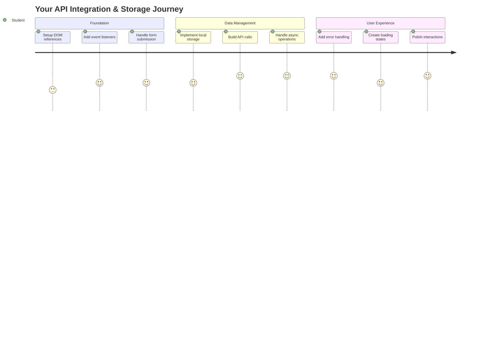
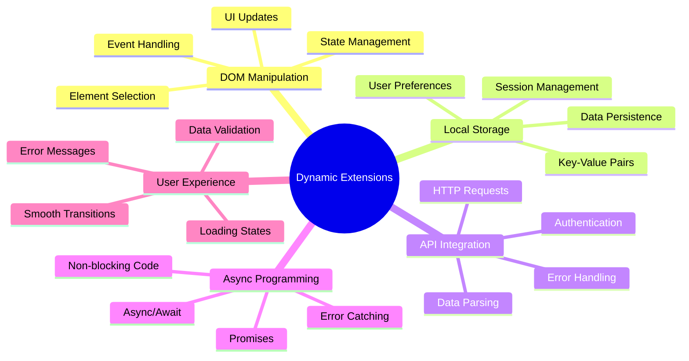
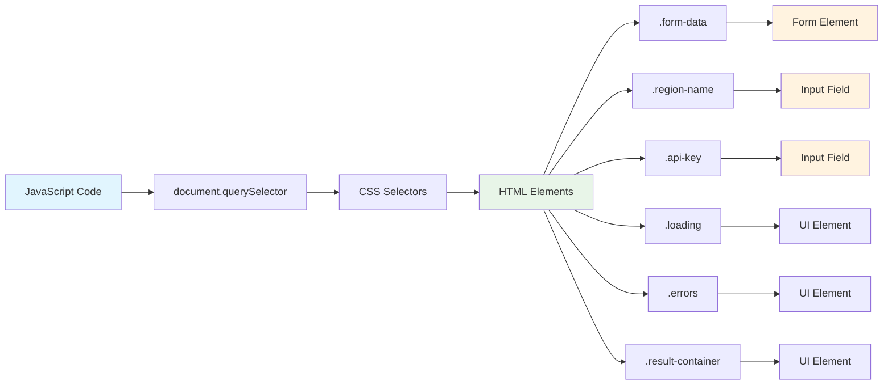
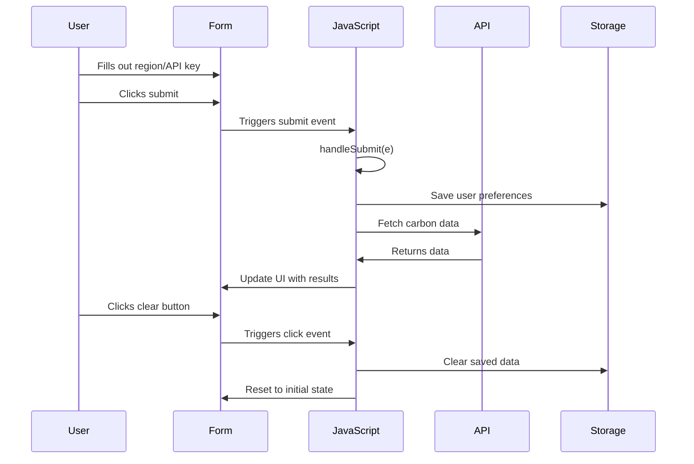
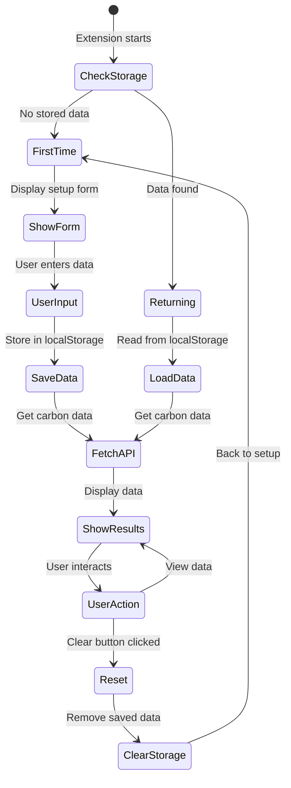
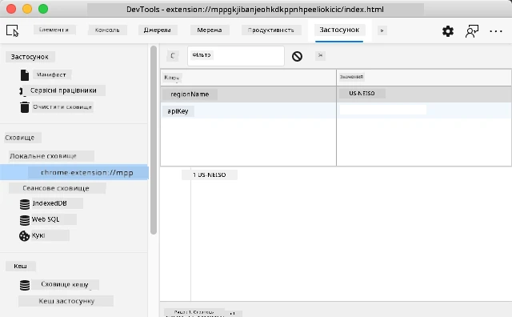
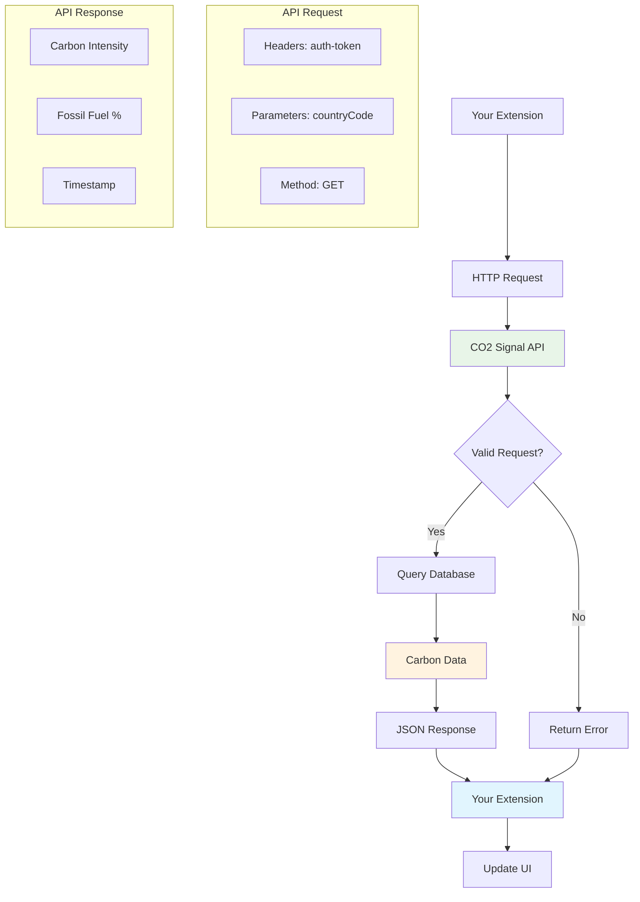
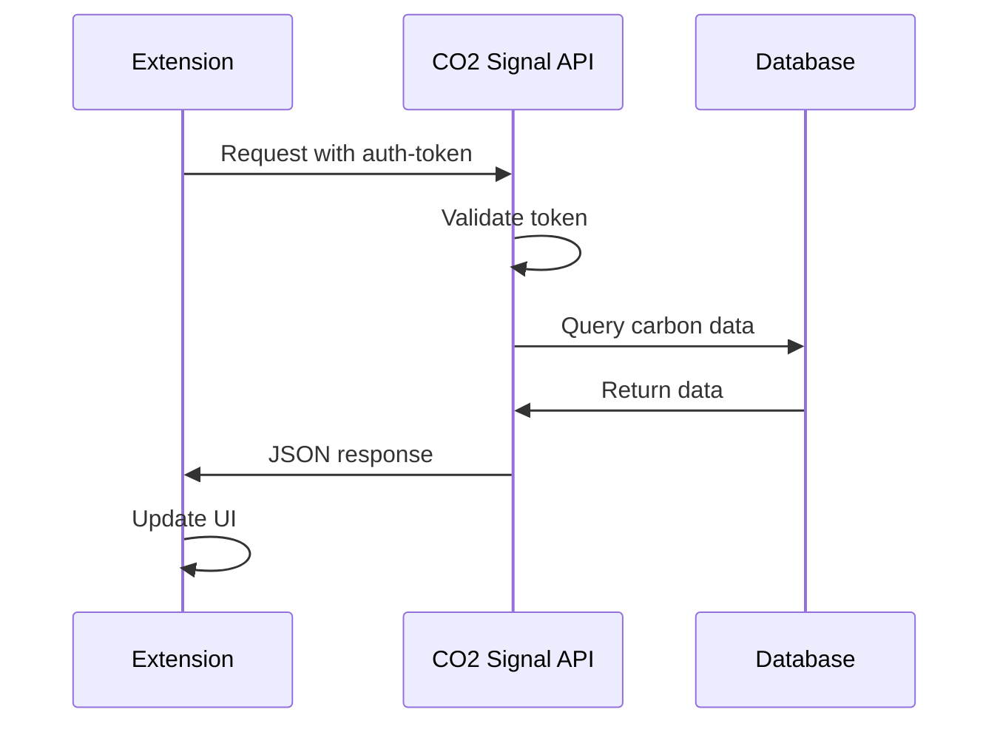
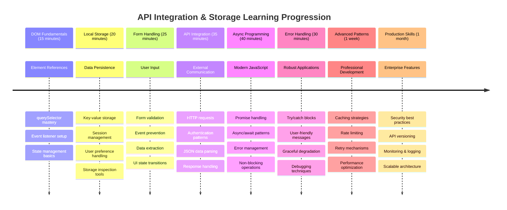

<!--
CO_OP_TRANSLATOR_METADATA:
{
  "original_hash": "2b6203a48c48d8234e0948353b47d84e",
  "translation_date": "2025-11-06T13:58:46+00:00",
  "source_file": "5-browser-extension/2-forms-browsers-local-storage/README.md",
  "language_code": "uk"
}
-->
# Проєкт розширення для браузера, частина 2: Виклик API, використання локального сховища



## Тест перед лекцією

[Тест перед лекцією](https://ff-quizzes.netlify.app/web/quiz/25)

## Вступ

Пам'ятаєте розширення для браузера, яке ви почали створювати? Зараз у вас є гарна форма, але вона фактично статична. Сьогодні ми оживимо її, підключивши до реальних даних і додавши пам'ять.

Згадайте комп'ютери управління місією Apollo - вони не просто показували фіксовану інформацію. Вони постійно спілкувалися з космічним кораблем, оновлювали дані телеметрії та запам'ятовували важливі параметри місії. Саме таку динамічну поведінку ми створюємо сьогодні. Ваше розширення буде звертатися до інтернету, отримувати реальні дані про навколишнє середовище і запам'ятовувати ваші налаштування для наступного разу.

Інтеграція API може здаватися складною, але це просто навчання вашого коду спілкуватися з іншими сервісами. Незалежно від того, чи отримуєте ви дані про погоду, стрічки соціальних мереж або інформацію про вуглецевий слід, як ми зробимо сьогодні, все це про встановлення цифрових зв'язків. Ми також дослідимо, як браузери можуть зберігати інформацію - подібно до того, як бібліотеки використовували карткові каталоги для запам'ятовування місцезнаходження книг.

До кінця цього уроку у вас буде розширення для браузера, яке отримує реальні дані, зберігає налаштування користувача і забезпечує плавний досвід. Почнемо!



✅ Дотримуйтесь пронумерованих сегментів у відповідних файлах, щоб знати, де розміщувати ваш код

## Налаштуйте елементи для маніпуляції в розширенні

Перед тим як ваш JavaScript зможе маніпулювати інтерфейсом, йому потрібні посилання на конкретні HTML-елементи. Подумайте про це як про телескоп, який потрібно направити на певні зірки - перед тим як Галілей міг вивчати супутники Юпітера, він мав знайти і сфокусуватися на самому Юпітері.

У вашому файлі `index.js` ми створимо змінні `const`, які захоплюють посилання на кожен важливий елемент форми. Це схоже на те, як вчені маркують своє обладнання - замість того, щоб кожного разу шукати по всій лабораторії, вони можуть безпосередньо отримати доступ до потрібного.



```javascript
// form fields
const form = document.querySelector('.form-data');
const region = document.querySelector('.region-name');
const apiKey = document.querySelector('.api-key');

// results
const errors = document.querySelector('.errors');
const loading = document.querySelector('.loading');
const results = document.querySelector('.result-container');
const usage = document.querySelector('.carbon-usage');
const fossilfuel = document.querySelector('.fossil-fuel');
const myregion = document.querySelector('.my-region');
const clearBtn = document.querySelector('.clear-btn');
```

**Що робить цей код:**
- **Захоплює** елементи форми за допомогою `document.querySelector()` з селекторами CSS класів
- **Створює** посилання на поля введення для назви регіону та ключа API
- **Встановлює** зв'язки з елементами відображення результатів для даних про використання вуглецю
- **Налаштовує** доступ до елементів інтерфейсу, таких як індикатори завантаження та повідомлення про помилки
- **Зберігає** кожне посилання на елемент у змінній `const` для легкого повторного використання в коді

## Додайте слухачі подій

Тепер ми зробимо ваше розширення реагуючим на дії користувача. Слухачі подій - це спосіб вашого коду стежити за взаємодіями користувача. Подумайте про них як про операторів у ранніх телефонних станціях - вони слухали вхідні дзвінки і з'єднували правильні лінії, коли хтось хотів зробити дзвінок.



```javascript
form.addEventListener('submit', (e) => handleSubmit(e));
clearBtn.addEventListener('click', (e) => reset(e));
init();
```

**Розуміння цих концепцій:**
- **Прикріплює** слухач подій до форми, який спрацьовує, коли користувачі натискають Enter або кнопку відправки
- **З'єднує** слухач кліків з кнопкою очищення для скидання форми
- **Передає** об'єкт події `(e)` до функцій-обробників для додаткового контролю
- **Викликає** функцію `init()` негайно для налаштування початкового стану вашого розширення

✅ Зверніть увагу на скорочений синтаксис стрілкових функцій, використаний тут. Цей сучасний підхід JavaScript є більш чистим, ніж традиційні вирази функцій, але обидва працюють однаково добре!

### 🔄 **Педагогічна перевірка**
**Розуміння обробки подій**: Перед переходом до ініціалізації переконайтеся, що ви можете:
- ✅ Пояснити, як `addEventListener` з'єднує дії користувача з функціями JavaScript
- ✅ Зрозуміти, чому ми передаємо об'єкт події `(e)` до функцій-обробників
- ✅ Розпізнати різницю між подіями `submit` і `click`
- ✅ Описати, коли функція `init()` запускається і чому

**Швидкий самотест**: Що станеться, якщо ви забудете `e.preventDefault()` у відправці форми?
*Відповідь: Сторінка перезавантажиться, втративши весь стан JavaScript і перервавши досвід користувача*

## Створіть функції ініціалізації та скидання

Давайте створимо логіку ініціалізації для вашого розширення. Функція `init()` схожа на навігаційну систему корабля, яка перевіряє свої інструменти - вона визначає поточний стан і відповідно налаштовує інтерфейс. Вона перевіряє, чи хтось вже використовував ваше розширення, і завантажує їхні попередні налаштування.

Функція `reset()` забезпечує користувачам новий старт - подібно до того, як вчені скидають свої інструменти між експериментами, щоб забезпечити чисті дані.

```javascript
function init() {
	// Check if user has previously saved API credentials
	const storedApiKey = localStorage.getItem('apiKey');
	const storedRegion = localStorage.getItem('regionName');

	// Set extension icon to generic green (placeholder for future lesson)
	// TODO: Implement icon update in next lesson

	if (storedApiKey === null || storedRegion === null) {
		// First-time user: show the setup form
		form.style.display = 'block';
		results.style.display = 'none';
		loading.style.display = 'none';
		clearBtn.style.display = 'none';
		errors.textContent = '';
	} else {
		// Returning user: load their saved data automatically
		displayCarbonUsage(storedApiKey, storedRegion);
		results.style.display = 'none';
		form.style.display = 'none';
		clearBtn.style.display = 'block';
	}
}

function reset(e) {
	e.preventDefault();
	// Clear stored region to allow user to choose a new location
	localStorage.removeItem('regionName');
	// Restart the initialization process
	init();
}
```

**Розбиваємо, що тут відбувається:**
- **Отримує** збережений ключ API та регіон з локального сховища браузера
- **Перевіряє**, чи це новий користувач (немає збережених даних) чи той, що повертається
- **Показує** форму налаштування для нових користувачів і приховує інші елементи інтерфейсу
- **Автоматично завантажує** збережені дані для користувачів, що повертаються, і показує опцію скидання
- **Керує** станом інтерфейсу користувача на основі доступних даних

**Основні концепції про локальне сховище:**
- **Зберігає** дані між сесіями браузера (на відміну від session storage)
- **Зберігає** дані у вигляді пар ключ-значення за допомогою `getItem()` і `setItem()`
- **Повертає** `null`, коли дані для заданого ключа не існують
- **Надає** простий спосіб запам'ятовувати налаштування і параметри користувача

> 💡 **Розуміння сховища браузера**: [LocalStorage](https://developer.mozilla.org/docs/Web/API/Window/localStorage) схоже на надання вашому розширенню постійної пам'яті. Подумайте, як стародавня бібліотека Александрії зберігала сувої - інформація залишалася доступною навіть коли вчені йшли і поверталися.
>
> **Основні характеристики:**
> - **Зберігає** дані навіть після закриття браузера
> - **Переживає** перезавантаження комп'ютера і збої браузера
> - **Надає** значний обсяг пам'яті для налаштувань користувача
> - **Пропонує** миттєвий доступ без затримок мережі

> **Важлива примітка**: Ваше розширення для браузера має власне ізольоване локальне сховище, яке відокремлене від звичайних веб-сторінок. Це забезпечує безпеку і запобігає конфліктам з іншими веб-сайтами.

Ви можете переглянути ваші збережені дані, відкривши інструменти розробника браузера (F12), перейшовши на вкладку **Application** і розгорнувши секцію **Local Storage**.





> ⚠️ **Міркування про безпеку**: У виробничих додатках зберігання ключів API у LocalStorage становить ризики безпеки, оскільки JavaScript може отримати доступ до цих даних. Для навчальних цілей цей підхід підходить, але реальні додатки повинні використовувати безпечне серверне сховище для конфіденційних даних.

## Обробка відправки форми

Тепер ми обробимо, що відбувається, коли хтось відправляє вашу форму. За замовчуванням браузери перезавантажують сторінку при відправці форм, але ми перехопимо цю поведінку, щоб створити більш плавний досвід.

Цей підхід нагадує, як центр управління місією обробляє комунікації з космічним кораблем - замість того, щоб перезавантажувати всю систему для кожної передачі, вони підтримують безперервну роботу, обробляючи нову інформацію.

Створіть функцію, яка захоплює подію відправки форми і витягує введені користувачем дані:

```javascript
function handleSubmit(e) {
	e.preventDefault();
	setUpUser(apiKey.value, region.value);
}
```

**У наведеному вище ми:**
- **Запобігаємо** стандартній поведінці відправки форми, яка б оновила сторінку
- **Витягуємо** значення введених користувачем даних з полів ключа API і регіону
- **Передаємо** дані форми до функції `setUpUser()` для обробки
- **Підтримуємо** поведінку односторінкового додатку, уникаючи перезавантаження сторінки

✅ Пам'ятайте, що ваші HTML-поля форми включають атрибут `required`, тому браузер автоматично перевіряє, що користувачі надають і ключ API, і регіон перед запуском цієї функції.

## Налаштування уподобань користувача

Функція `setUpUser` відповідає за збереження облікових даних користувача і ініціалізацію першого виклику API. Це створює плавний перехід від налаштування до відображення результатів.

```javascript
function setUpUser(apiKey, regionName) {
	// Save user credentials for future sessions
	localStorage.setItem('apiKey', apiKey);
	localStorage.setItem('regionName', regionName);
	
	// Update UI to show loading state
	loading.style.display = 'block';
	errors.textContent = '';
	clearBtn.style.display = 'block';
	
	// Fetch carbon usage data with user's credentials
	displayCarbonUsage(apiKey, regionName);
}
```

**Крок за кроком, ось що відбувається:**
- **Зберігає** ключ API і назву регіону в локальному сховищі для майбутнього використання
- **Показує** індикатор завантаження, щоб повідомити користувачів, що дані завантажуються
- **Очищає** будь-які попередні повідомлення про помилки з відображення
- **Розкриває** кнопку очищення для користувачів, щоб скинути свої налаштування пізніше
- **Ініціює** виклик API для отримання реальних даних про використання вуглецю

Ця функція створює безперервний досвід користувача, керуючи як збереженням даних, так і оновленням інтерфейсу користувача в одній координованій дії.

## Відображення даних про використання вуглецю

Тепер ми підключимо ваше розширення до зовнішніх джерел даних через API. Це перетворює ваше розширення з автономного інструменту на щось, що може отримувати інформацію в реальному часі з усього інтернету.

**Розуміння API**

[API](https://www.webopedia.com/TERM/A/API.html) - це спосіб, яким різні додатки спілкуються один з одним. Подумайте про них як про телеграфну систему, яка з'єднувала віддалені міста в 19 столітті - оператори надсилали запити до віддалених станцій і отримували відповіді з запитуваною інформацією. Кожного разу, коли ви перевіряєте соціальні мережі, задаєте питання голосовому помічнику або використовуєте додаток для доставки, API сприяють цим обмінам даними.



**Основні концепції про REST API:**
- **REST** означає "Representational State Transfer"
- **Використовує** стандартні HTTP-методи (GET, POST, PUT, DELETE) для взаємодії з даними
- **Повертає** дані у передбачуваних форматах, зазвичай JSON
- **Надає** послідовні URL-адреси для різних типів запитів

✅ [API CO2 Signal](https://www.co2signal.com/), яке ми будемо використовувати, надає дані про інтенсивність вуглецю в реальному часі з електричних мереж по всьому світу. Це допомагає користувачам зрозуміти вплив їхнього споживання електроенергії на навколишнє середовище!

> 💡 **Розуміння асинхронного JavaScript**: Ключове слово [`async`](https://developer.mozilla.org/docs/Web/JavaScript/Reference/Statements/async_function) дозволяє вашому коду обробляти кілька операцій одночасно. Коли ви запитуєте дані з сервера, ви не хочете, щоб ваше розширення повністю заморожувалося - це було б як зупинка всіх операцій управління повітряним рухом, поки чекають відповіді одного літака.
>
> **Основні переваги:**
> - **Підтримує** чутливість розширення під час завантаження даних
> - **Дозволяє** іншому коду продовжувати виконуватися під час мережевих запитів
> - **Покращує** читабельність коду порівняно з традиційними шаблонами зворотних викликів
> - **Забезпечує** елегантну обробку помилок для мережевих проблем

Ось коротке відео про `async`:

[](https://youtube.com/watch?v=YwmlRkrxvkk "Async і Await для управління обіцянками")

> 🎥 Натисніть на зображення вище, щоб переглянути відео про async/await.

### 🔄 **Педагогічна перевірка**
**Розуміння асинхронного програмування**: Перед тим як заглибитися у функцію API, переконайтеся, що ви розумієте:
- ✅ Чому ми використовуємо `async/await` замість блокування всього розширення
- ✅ Як блоки `try/catch` елегантно обробляють мережеві помилки
- ✅ Різницю між синхронними та асинхронними операціями
- ✅ Чому виклики API можуть зазнати невдачі і як обробляти ці невдачі

**Зв'язок з реальним світом**: Розгляньте ці повсякденні приклади асинхронності:
- **Замовлення їжі**: Ви не чекаєте біля кухні - ви отримуєте чек і продовжуєте інші справи
- **Надсилання електронних листів**: Ваш додаток для електронної пошти не заморожується під час надсилання - ви можете створювати більше листів
- **Завантаження веб-сторінок**: Зображення завантажуються поступово, поки ви вже можете читати текст

**Потік аутентифікації API**:


Створіть функцію для отримання і відображення даних про використання вуглецю:

```javascript
// Modern fetch API approach (no external dependencies needed)
async function displayCarbonUsage(apiKey, region) {
	try {
		// Fetch carbon intensity data from CO2 Signal API
		const response = await fetch('https://api.co2signal.com/v1/latest', {
			method: 'GET',
			headers: {
				'auth-token': apiKey,
				'Content-Type': 'application/json'
			},
			// Add query parameters for the specific region
			...new URLSearchParams({ countryCode: region }) && {
				url: `https://api.co2signal.com/v1/latest?countryCode=${region}`
			}
		});

		// Check if the API request was successful
		if (!response.ok) {
			throw new Error(`API request failed: ${response.status}`);
		}

		const data = await response.json();
		const carbonData = data.data;

		// Calculate rounded carbon intensity value
		const carbonIntensity = Math.round(carbonData.carbonIntensity);

		// Update the user interface with fetched data
		loading.style.display = 'none';
		form.style.display = 'none';
		myregion.textContent = region.toUpperCase();
		usage.textContent = `${carbonIntensity} grams (grams CO₂ emitted per kilowatt hour)`;
		fossilfuel.textContent = `${carbonData.fossilFuelPercentage.toFixed(2)}% (percentage of fossil fuels used to generate electricity)`;
		results.style.display = 'block';

		// TODO: calculateColor(carbonIntensity) - implement in next lesson

	} catch (error) {
		console.error('Error fetching carbon data:', error);
		
		// Show user-friendly error message
		loading.style.display = 'none';
		results.style.display = 'none';
		errors.textContent = 'Sorry, we couldn\'t fetch data for that region. Please check your API key and region code.';
	}
}
```

**Розбиваємо, що тут відбувається:**
- **Використовує** сучасний API `fetch()` замість зовнішніх бібліотек, таких як Axios, для чистого к
**Опис:** Покращіть розширення для браузера, додавши вдосконалення обробки помилок та функції для покращення користувацького досвіду. Цей виклик допоможе вам попрактикуватися у роботі з API, локальним сховищем та маніпуляцією DOM, використовуючи сучасні шаблони JavaScript.

**Завдання:** Створіть вдосконалену версію функції displayCarbonUsage, яка включає: 1) Механізм повторних спроб для невдалих викликів API з експоненціальним збільшенням часу очікування, 2) Валідацію введення коду регіону перед викликом API, 3) Анімацію завантаження з індикаторами прогресу, 4) Кешування відповідей API у localStorage з часовими мітками закінчення терміну дії (кешування на 30 хвилин), та 5) Функцію для відображення історичних даних з попередніх викликів API. Також додайте коментарі у стилі TypeScript JSDoc для документування всіх параметрів функції та типів повернення.

Дізнайтеся більше про [режим агента](https://code.visualstudio.com/blogs/2025/02/24/introducing-copilot-agent-mode) тут.

## 🚀 Виклик

Розширте своє розуміння API, досліджуючи багатство браузерних API, доступних для веб-розробки. Оберіть один із цих браузерних API та створіть невелику демонстрацію:

- [Geolocation API](https://developer.mozilla.org/docs/Web/API/Geolocation_API) - Отримання поточного місцезнаходження користувача
- [Notification API](https://developer.mozilla.org/docs/Web/API/Notifications_API) - Надсилання сповіщень на робочий стіл
- [HTML Drag and Drop API](https://developer.mozilla.org/docs/Web/API/HTML_Drag_and_Drop_API) - Створення інтерактивних інтерфейсів перетягування
- [Web Storage API](https://developer.mozilla.org/docs/Web/API/Web_Storage_API) - Розширені техніки локального зберігання
- [Fetch API](https://developer.mozilla.org/docs/Web/API/Fetch_API) - Сучасна альтернатива XMLHttpRequest

**Дослідницькі питання для розгляду:**
- Які реальні проблеми вирішує цей API?
- Як API обробляє помилки та крайові випадки?
- Які міркування щодо безпеки існують при використанні цього API?
- Наскільки широко підтримується цей API у різних браузерах?

Після вашого дослідження визначте, які характеристики роблять API зручним для розробників та надійним.

## Тест після лекції

[Тест після лекції](https://ff-quizzes.netlify.app/web/quiz/26)

## Огляд та самостійне навчання

Ви дізналися про LocalStorage та API на цьому уроці, обидва дуже корисні для професійного веб-розробника. Чи можете ви подумати, як ці дві речі працюють разом? Подумайте, як би ви спроектували веб-сайт, який зберігатиме елементи для використання API.

### ⚡ **Що ви можете зробити за наступні 5 хвилин**
- [ ] Відкрийте вкладку Application у DevTools та досліджуйте localStorage на будь-якому веб-сайті
- [ ] Створіть просту HTML-форму та протестуйте валідацію форми у браузері
- [ ] Спробуйте зберігати та отримувати дані за допомогою localStorage у консолі браузера
- [ ] Перевірте дані форми, що надсилаються, використовуючи вкладку Network

### 🎯 **Що ви можете досягти за цю годину**
- [ ] Завершіть тест після уроку та зрозумійте концепції обробки форм
- [ ] Створіть форму розширення для браузера, яка зберігає налаштування користувача
- [ ] Реалізуйте валідацію форми на стороні клієнта з корисними повідомленнями про помилки
- [ ] Попрактикуйте використання chrome.storage API для збереження даних розширення
- [ ] Створіть інтерфейс користувача, який реагує на збережені налаштування користувача

### 📅 **Ваш тижневий план створення розширення**
- [ ] Завершіть повнофункціональне розширення для браузера з функціональністю форм
- [ ] Освойте різні варіанти зберігання: локальне, синхронне та сеансове сховище
- [ ] Реалізуйте розширені функції форм, такі як автозаповнення та валідація
- [ ] Додайте функціональність імпорту/експорту даних користувача
- [ ] Ретельно протестуйте своє розширення у різних браузерах
- [ ] Вдоскональте користувацький досвід вашого розширення та обробку помилок

### 🌟 **Ваш місячний план освоєння Web API**
- [ ] Створіть складні додатки, використовуючи різні браузерні API для зберігання даних
- [ ] Вивчіть шаблони розробки з пріоритетом офлайн-режиму
- [ ] Внесіть вклад у проєкти з відкритим кодом, пов'язані зі збереженням даних
- [ ] Освойте розробку з акцентом на конфіденційність та відповідність GDPR
- [ ] Створіть бібліотеки для повторного використання для обробки форм та управління даними
- [ ] Поділіться знаннями про Web API та розробку розширень

## 🎯 Ваш таймлайн освоєння розробки розширень



### 🛠️ Резюме вашого інструментарію для Full-Stack розробки

Після завершення цього уроку ви маєте:
- **Майстерність DOM**: Точне визначення та маніпуляція елементами
- **Експертиза зберігання**: Управління даними з використанням localStorage
- **Інтеграція API**: Отримання даних у реальному часі та автентифікація
- **Асинхронне програмування**: Неблокуючі операції з сучасним JavaScript
- **Обробка помилок**: Надійні додатки, які плавно обробляють збої
- **Користувацький досвід**: Стан завантаження, валідація та плавні взаємодії
- **Сучасні шаблони**: Fetch API, async/await та функції ES6+

**Професійні навички, які ви здобули**: Ви реалізували шаблони, які використовуються у:
- **Веб-додатках**: Односторінкові додатки з зовнішніми джерелами даних
- **Мобільній розробці**: Додатки, керовані API, з можливостями офлайн-режиму
- **Програмному забезпеченні для настільних ПК**: Electron-додатки з постійним зберіганням
- **Корпоративних системах**: Автентифікація, кешування та обробка помилок
- **Сучасних фреймворках**: Шаблони управління даними у React/Vue/Angular

**Наступний рівень**: Ви готові досліджувати розширені теми, такі як стратегії кешування, з'єднання WebSocket у реальному часі або складне управління станом!

## Завдання

[Прийміть API](assignment.md)

---

**Відмова від відповідальності**:  
Цей документ був перекладений за допомогою сервісу автоматичного перекладу [Co-op Translator](https://github.com/Azure/co-op-translator). Хоча ми прагнемо до точності, будь ласка, майте на увазі, що автоматичні переклади можуть містити помилки або неточності. Оригінальний документ на його рідній мові слід вважати авторитетним джерелом. Для критичної інформації рекомендується професійний людський переклад. Ми не несемо відповідальності за будь-які непорозуміння або неправильні тлумачення, що виникають внаслідок використання цього перекладу.