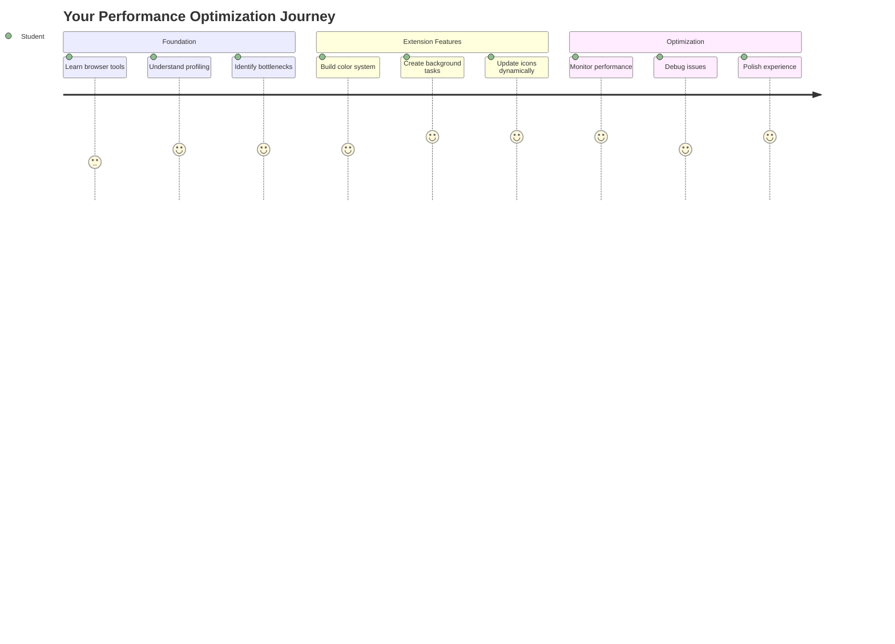
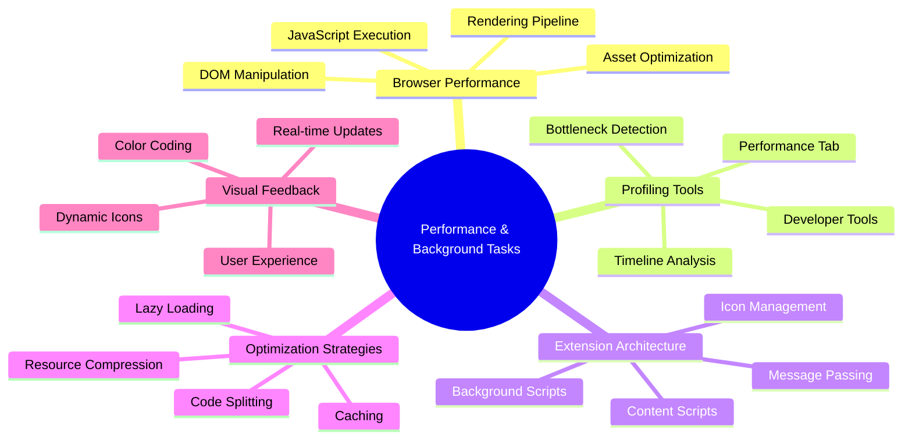
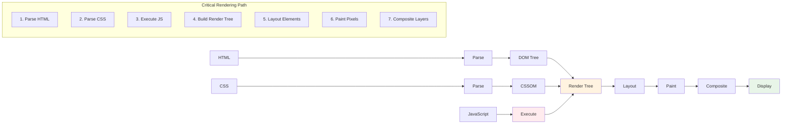
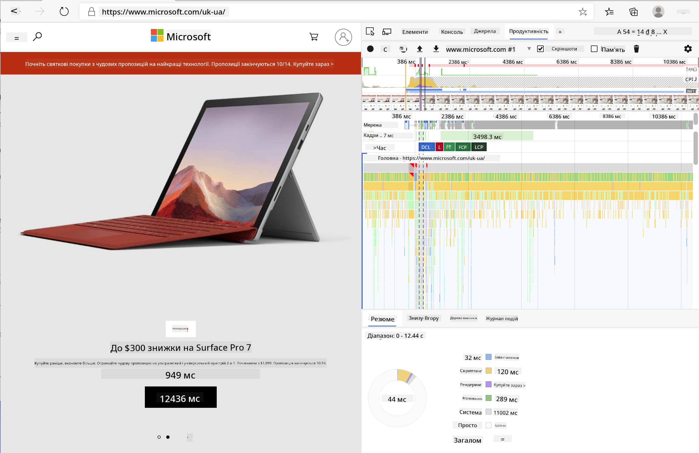
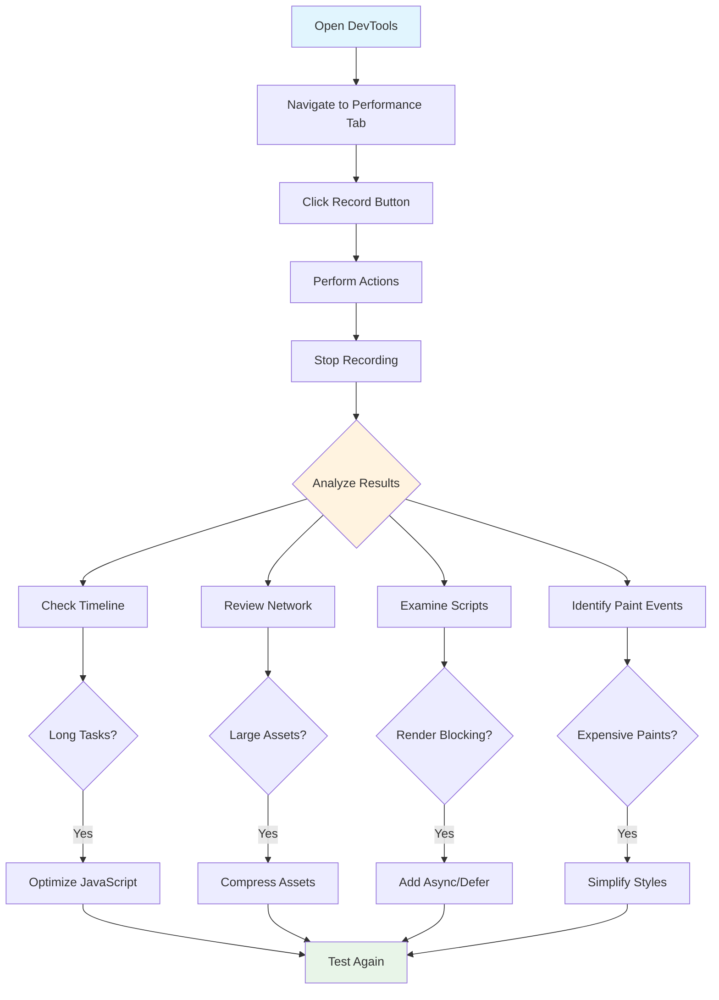
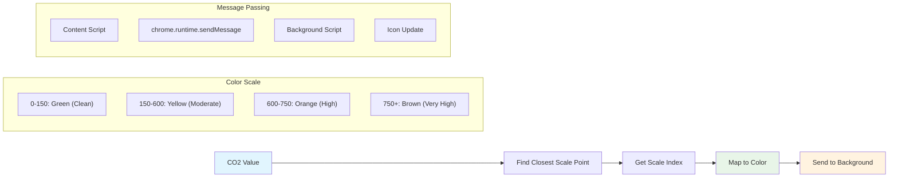
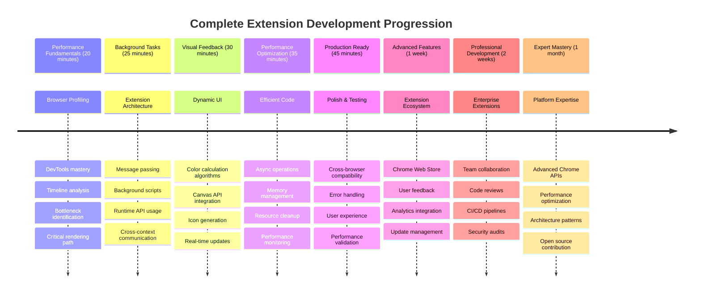

```mermaid
architecture-beta
    group browser(logos:chrome)[Browser]
    
    service popup(logos:html5)[Popup UI] in browser
    service content(logos:javascript)[Content Script] in browser
    service background(database)[Background Script] in browser
    service api(logos:api)[External API] in browser
    
    popup:R -- L:content
    content:R -- L:background
    background:T -- B:api
    content:T -- B:api
    
    junction junctionCenter in browser
    popup:R -- L:junctionCenter
    junctionCenter:R -- L:background
```

<!--
CO_OP_TRANSLATOR_METADATA:
{
  "original_hash": "b275fed2c6fc90d2b9b6661a3225faa2",
  "translation_date": "2025-11-06T13:57:10+00:00",
  "source_file": "5-browser-extension/3-background-tasks-and-performance/README.md",
  "language_code": "uk"
}
-->
# Проєкт розширення для браузера, частина 3: Дізнайтеся про фонові завдання та продуктивність



Цікаво, чому деякі розширення для браузера працюють швидко та чітко, а інші здаються повільними? Секрет у тому, що відбувається за лаштунками. Поки користувачі натискають на інтерфейс вашого розширення, у фоновому режимі відбувається багато процесів, які керують отриманням даних, оновленням іконок та системними ресурсами.

Це наш останній урок у серії про розширення для браузера, і ми зробимо ваш трекер вуглецевого сліду максимально плавним у роботі. Ви додасте динамічне оновлення іконок і навчитеся виявляти проблеми з продуктивністю до того, як вони стануть серйозними. Це як налаштування гоночного автомобіля - невеликі оптимізації можуть значно вплинути на роботу системи.

До кінця уроку у вас буде відшліфоване розширення, і ви зрозумієте принципи продуктивності, які відрізняють хороші веб-додатки від чудових. Давайте зануримося у світ оптимізації браузера.

## Тест перед лекцією

[Тест перед лекцією](https://ff-quizzes.netlify.app/web/quiz/27)

### Вступ

У попередніх уроках ви створили форму, підключили її до API та розібралися з асинхронним отриманням даних. Ваше розширення набуває гарного вигляду.

Тепер нам потрібно додати останні штрихи - наприклад, зробити так, щоб іконка розширення змінювала кольори залежно від даних про вуглецевий слід. Це нагадує, як NASA оптимізувала кожну систему на космічному кораблі Apollo. Вони не могли дозволити собі жодних зайвих циклів чи пам'яті, адже від продуктивності залежали життя. Хоча наше розширення для браузера не настільки критичне, ті ж принципи застосовуються - ефективний код створює кращий досвід для користувачів.



## Основи веб-продуктивності

Коли ваш код працює ефективно, люди можуть *відчути* різницю. Ви знаєте той момент, коли сторінка завантажується миттєво або анімація плавно рухається? Це і є результат хорошої продуктивності.

Продуктивність - це не лише про швидкість, а й про створення веб-досвіду, який здається природним, а не незграбним і розчаровуючим. У ранні дні обчислювальної техніки Грейс Хоппер тримала на своєму столі наносекунду (шматок дроту довжиною близько фута), щоб показати, як далеко світло проходить за одну мільярдну секунди. Це був її спосіб пояснити, чому кожна мікросекунда має значення в обчисленнях. Давайте дослідимо інструменти, які допоможуть вам зрозуміти, що уповільнює роботу.

> "Продуктивність веб-сайту стосується двох речей: як швидко завантажується сторінка і як швидко працює код на ній." -- [Зак Гроссбарт](https://www.smashingmagazine.com/2012/06/javascript-profiling-chrome-developer-tools/)

Тема про те, як зробити ваші веб-сайти надзвичайно швидкими на всіх типах пристроїв, для всіх типів користувачів і в усіх ситуаціях, є, як не дивно, дуже обширною. Ось кілька моментів, які слід враховувати, створюючи стандартний веб-проєкт або розширення для браузера.

Перший крок в оптимізації вашого сайту - це розуміння того, що насправді відбувається "під капотом". На щастя, ваш браузер має потужні інструменти для аналізу прямо вбудовані.



Щоб відкрити Developer Tools в Edge, натисніть три точки у верхньому правому куті, потім перейдіть до More Tools > Developer Tools. Або скористайтеся комбінацією клавіш: `Ctrl` + `Shift` + `I` на Windows або `Option` + `Command` + `I` на Mac. Після цього перейдіть на вкладку Performance - саме тут ви будете проводити своє дослідження.

**Ось ваш набір інструментів для аналізу продуктивності:**
- **Відкрийте** Developer Tools (ви будете використовувати їх постійно як розробник!)
- **Перейдіть** на вкладку Performance - подумайте про це як про фітнес-трекер вашого веб-додатка
- **Натисніть** кнопку Record і спостерігайте за діями вашої сторінки
- **Вивчіть** результати, щоб виявити, що уповільнює роботу

Спробуймо це. Відкрийте веб-сайт (Microsoft.com добре підходить для цього) і натисніть кнопку 'Record'. Тепер оновіть сторінку і спостерігайте, як профайлер фіксує все, що відбувається. Коли ви зупините запис, ви побачите детальний розподіл того, як браузер "скриптує", "рендерить" і "малює" сайт. Це нагадує, як центр управління польотами моніторить кожну систему під час запуску ракети - ви отримуєте дані в реальному часі про те, що саме відбувається і коли.



✅ [Документація Microsoft](https://docs.microsoft.com/microsoft-edge/devtools-guide/performance/?WT.mc_id=academic-77807-sagibbon) має багато додаткових деталей, якщо ви хочете заглибитися.

> Порада: Очистіть кеш браузера перед тестуванням, щоб побачити, як ваш сайт працює для нових відвідувачів - це зазвичай сильно відрізняється від повторних відвідувань!

Виберіть елементи на шкалі часу профілю, щоб збільшити події, які відбуваються під час завантаження сторінки.

Отримайте знімок продуктивності вашої сторінки, вибравши частину шкали часу профілю та переглянувши панель зведення:


Перевірте панель журналу подій, щоб побачити, чи будь-яка подія тривала більше 15 мс:


✅ Ознайомтеся з вашим профайлером! Відкрийте інструменти розробника на цьому сайті і перевірте, чи є якісь вузькі місця. Який ресурс завантажується найповільніше? Найшвидше?



## На що звертати увагу під час профілювання

Запуск профайлера - це лише початок, справжнє вміння полягає в тому, щоб розуміти, що насправді показують ці кольорові графіки. Не хвилюйтеся, ви швидко навчитеся їх читати. Досвідчені розробники навчилися помічати тривожні сигнали до того, як вони перетворяться на серйозні проблеми.

Давайте поговоримо про звичайних підозрюваних - проблеми з продуктивністю, які часто з'являються у веб-проєктах. Як Марія Кюрі ретельно контролювала рівень радіації у своїй лабораторії, ми повинні стежити за певними шаблонами, які вказують на можливі проблеми. Виявлення їх на ранніх етапах заощадить вам (і вашим користувачам) багато розчарувань.

**Розміри ресурсів**: Веб-сайти стають "важчими" з роками, і значна частина цієї додаткової ваги припадає на зображення. Це як ми пакуємо все більше і більше у наші цифрові валізи.

✅ Перевірте [Internet Archive](https://httparchive.org/reports/page-weight), щоб побачити, як розміри сторінок зростали з часом - це досить показово.

**Ось як зберегти ваші ресурси оптимізованими:**
- **Стискайте** зображення! Сучасні формати, такі як WebP, можуть значно зменшити розмір файлів
- **Використовуйте** правильний розмір зображення для кожного пристрою - немає потреби надсилати величезні зображення для настільних комп'ютерів на телефони
- **Мініфікуйте** ваш CSS та JavaScript - кожен байт має значення
- **Застосовуйте** ліниве завантаження, щоб зображення завантажувалися лише тоді, коли користувачі фактично прокручують до них

**Перегляд DOM**: Браузер повинен створити свою модель об'єктів документа на основі коду, який ви пишете, тому для хорошої продуктивності сторінки важливо зберігати теги мінімальними, використовуючи та стилізуючи лише те, що потрібно сторінці. Наприклад, надлишковий CSS, пов'язаний зі сторінкою, можна оптимізувати; стилі, які потрібно використовувати лише на одній сторінці, не потрібно включати до основного стилю.

**Основні стратегії оптимізації DOM:**
- **Мінімізуйте** кількість HTML-елементів та рівнів вкладеності
- **Видаляйте** невикористані правила CSS та ефективно об'єднуйте стилі
- **Організовуйте** CSS, щоб завантажувати лише те, що потрібно для кожної сторінки
- **Структуруйте** HTML семантично для кращого аналізу браузером

**JavaScript**: Кожен розробник JavaScript повинен стежити за скриптами, які блокують рендеринг, і які необхідно завантажити перед тим, як решта DOM може бути оброблена та відображена у браузері. Розгляньте можливість використання `defer` з вашими вбудованими скриптами (як це зроблено в модулі Terrarium).

**Сучасні техніки оптимізації JavaScript:**
- **Використовуйте** атрибут `defer` для завантаження скриптів після аналізу DOM
- **Застосовуйте** розділення коду для завантаження лише необхідного JavaScript
- **Впроваджуйте** ліниве завантаження для некритичної функціональності
- **Мінімізуйте** використання важких бібліотек та фреймворків, коли це можливо

✅ Спробуйте деякі сайти на [сайті тестування швидкості](https://www.webpagetest.org/), щоб дізнатися більше про загальні перевірки, які проводяться для визначення продуктивності сайту.

### 🔄 **Педагогічна перевірка**
**Розуміння продуктивності**: Перед створенням функцій розширення переконайтеся, що ви можете:
- ✅ Пояснити критичний шлях рендерингу від HTML до пікселів
- ✅ Виявити загальні вузькі місця продуктивності у веб-додатках
- ✅ Використовувати інструменти розробника браузера для профілювання продуктивності сторінки
- ✅ Зрозуміти, як розмір ресурсів та складність DOM впливають на швидкість

**Швидкий самотест**: Що відбувається, коли у вас є JavaScript, який блокує рендеринг?
*Відповідь: Браузер повинен завантажити та виконати скрипт, перш ніж він зможе продовжити аналіз HTML та рендеринг сторінки*

**Реальний вплив продуктивності**:
- **Затримка 100 мс**: Користувачі помічають уповільнення
- **Затримка 1 секунда**: Користувачі починають втрачати увагу
- **Затримка 3+ секунди**: 40% користувачів залишають сторінку
- **Мобільні мережі**: Продуктивність має ще більше значення

Тепер, коли ви маєте уявлення про те, як браузер рендерить ресурси, які ви йому надсилаєте, давайте розглянемо останні кілька речей, які вам потрібно зробити, щоб завершити ваше розширення:

### Створіть функцію для розрахунку кольору

Тепер ми створимо функцію, яка перетворює числові дані на значущі кольори. Подумайте про це як про систему світлофора - зелений для чистої енергії, червоний для високої інтенсивності вуглецю.

Ця функція візьме дані про CO2 з нашого API і визначить, який колір найкраще представляє вплив на довкілля. Це схоже на те, як вчені використовують кольорове кодування на теплових картах для візуалізації складних моделей даних - від температур океану до формування зірок. Додамо це до `/src/index.js`, одразу після тих змінних `const`, які ми налаштували раніше:



```javascript
function calculateColor(value) {
	// Define CO2 intensity scale (grams per kWh)
	const co2Scale = [0, 150, 600, 750, 800];
	// Corresponding colors from green (clean) to dark brown (high carbon)
	const colors = ['#2AA364', '#F5EB4D', '#9E4229', '#381D02', '#381D02'];

	// Find the closest scale value to our input
	const closestNum = co2Scale.sort((a, b) => {
		return Math.abs(a - value) - Math.abs(b - value);
	})[0];
	
	console.log(`${value} is closest to ${closestNum}`);
	
	// Find the index for color mapping
	const num = (element) => element > closestNum;
	const scaleIndex = co2Scale.findIndex(num);

	const closestColor = colors[scaleIndex];
	console.log(scaleIndex, closestColor);

	// Send color update message to background script
	chrome.runtime.sendMessage({ action: 'updateIcon', value: { color: closestColor } });
}
```

**Розберемо цю хитру маленьку функцію:**
- **Налаштовує** два масиви - один для рівнів CO2, інший для кольорів (зелений = чистий, коричневий = брудний!)
- **Знаходить** найближчий збіг до нашого фактичного значення CO2 за допомогою сортування масиву
- **Отримує** відповідний колір за допомогою методу findIndex()
- **Надсилає** повідомлення до фонової скрипту Chrome з обраним кольором
- **Використовує** шаблонні літерали (ті зворотні лапки) для більш чистого форматування рядків
- **Організовує** все за допомогою декларацій const

API `chrome.runtime` [API](https://developer.chrome.com/extensions/runtime) схожий на нервову систему вашого розширення - він обробляє всю комунікацію та завдання за лаштунками:

> "Використовуйте API chrome.runtime, щоб отримати фонову сторінку, повернути деталі про маніфест і слухати та реагувати на події в життєвому циклі додатка або розширення. Ви також можете використовувати цей API для перетворення відносного шляху URL на повністю кваліфіковані URL."

**Чому API Chrome Runtime такий зручний:**
- **Дозволяє** різним частинам вашого розширення спілкуватися між собою
- **Обробляє** фонову роботу без заморожування інтерфейсу користувача
- **Керує** подіями життєвого циклу вашого розширення
- **Полегшує** передачу повідомлень між скриптами

✅ Якщо ви розробляєте це розширення для Edge, вас може здивувати, що ви використовуєте API Chrome. Нові версії браузера Edge працюють на движку браузера Chromium, тому ви можете використовувати ці інструменти.



> **Порада**: Якщо ви хочете профілювати розширення для браузера, запустіть інструменти розробника з самого розширення, оскільки це окремий екземпляр браузера. Це дає вам доступ до специфічних для розширення метрик продуктивності.

### Встановіть колір іконки за замовчуванням

Перш ніж почати отримувати реальні дані, давайте надамо нашому розширенню початкову точку. Ніхто не любить дивитися на порожню або зламану іконку. Ми почнемо з зеленого кольору, щоб користувачі знали, що розширення працює з моменту його встановлення.

У вашій функції `init()` налаштуємо цей зелений колір за замовчуванням:

```javascript
chrome.runtime.sendMessage({
	action: 'updateIcon',
	value: {
		color: 'green',
	},
});
```

**Що забезпечує ця ініціалізація:**
- **Встановлює** нейтральний зелений колір як стан за замовчуванням
- **Забезпечує** миттєвий візуальний зворотний зв'язок під час завантаження розширення
- **Встановлює** шаблон комунікації з фоновим скриптом
- **Гарантує
- ✅ Яку роль відіграє Chrome Runtime API в архітектурі розширень?
- ✅ Як алгоритм розрахунку кольору відображає дані у візуальний зворотний зв'язок?

**Міркування щодо продуктивності**: Ваше розширення тепер демонструє:
- **Ефективне обмін повідомленнями**: Чітка комунікація між контекстами скриптів
- **Оптимізоване рендеринг**: OffscreenCanvas запобігає блокуванню інтерфейсу
- **Оновлення в реальному часі**: Динамічні зміни іконки на основі живих даних
- **Управління пам'яттю**: Правильне очищення та обробка ресурсів

**Час протестувати ваше розширення:**
- **Зберіть** все за допомогою `npm run build`
- **Перезавантажте** ваше розширення в браузері (не забудьте цей крок)
- **Відкрийте** ваше розширення і спостерігайте, як змінюється колір іконки
- **Перевірте**, як воно реагує на реальні дані про вуглецевий слід з усього світу

Тепер ви зможете миттєво визначити, чи варто запускати пральну машину, чи краще зачекати на чистішу енергію. Ви щойно створили щось дійсно корисне і дізналися багато про продуктивність браузера.

## Виклик GitHub Copilot Agent 🚀

Використовуйте режим Agent, щоб виконати наступний виклик:

**Опис:** Покращіть можливості моніторингу продуктивності розширення для браузера, додавши функцію, яка відстежує та відображає час завантаження різних компонентів розширення.

**Завдання:** Створіть систему моніторингу продуктивності для розширення браузера, яка вимірює та реєструє час, необхідний для отримання даних про CO2 з API, розрахунку кольорів та оновлення іконки. Додайте функцію `performanceTracker`, яка використовує Performance API для вимірювання цих операцій і відображає результати в консолі браузера з часовими мітками та метриками тривалості.

Дізнайтеся більше про [режим агентів](https://code.visualstudio.com/blogs/2025/02/24/introducing-copilot-agent-mode) тут.

## 🚀 Виклик

Ось цікава місія детектива: виберіть кілька вебсайтів з відкритим кодом, які існують вже багато років (наприклад, Wikipedia, GitHub або Stack Overflow), і дослідіть їх історію комітів. Чи можете ви знайти місця, де вони покращували продуктивність? Які проблеми повторювалися?

**Ваш підхід до розслідування:**
- **Шукайте** повідомлення про коміти зі словами, як-от "оптимізація", "продуктивність" або "швидше"
- **Досліджуйте** шаблони - чи постійно вони виправляють одні й ті ж типи проблем?
- **Визначте** загальні причини, які уповільнюють роботу вебсайтів
- **Поділіться** тим, що ви виявили - інші розробники можуть навчитися на реальних прикладах

## Післялекційний тест

[Післялекційний тест](https://ff-quizzes.netlify.app/web/quiz/28)

## Огляд і самостійне навчання

Розгляньте можливість підписатися на [розсилку про продуктивність](https://perf.email/)

Дослідіть деякі способи, якими браузери оцінюють продуктивність вебсайтів, переглянувши вкладки продуктивності в їхніх вебінструментах. Чи знаходите ви якісь суттєві відмінності?

### ⚡ **Що ви можете зробити за наступні 5 хвилин**
- [ ] Відкрийте Диспетчер завдань браузера (Shift+Esc у Chrome), щоб побачити використання ресурсів розширення
- [ ] Використовуйте вкладку Performance у DevTools для запису та аналізу продуктивності вебсторінки
- [ ] Перевірте сторінку розширень браузера, щоб побачити, які розширення впливають на час запуску
- [ ] Спробуйте тимчасово вимкнути розширення, щоб побачити різницю в продуктивності

### 🎯 **Що ви можете досягти за годину**
- [ ] Завершіть тест після уроку та зрозумійте концепції продуктивності
- [ ] Реалізуйте фоновий скрипт для вашого розширення браузера
- [ ] Навчіться використовувати browser.alarms для ефективних фонових завдань
- [ ] Практикуйте передачу повідомлень між контентними скриптами та фоновими скриптами
- [ ] Виміряйте та оптимізуйте використання ресурсів вашого розширення

### 📅 **Ваш тижневий шлях до продуктивності**
- [ ] Завершіть високопродуктивне розширення браузера з фоновою функціональністю
- [ ] Освойте Service Workers і сучасну архітектуру розширень
- [ ] Реалізуйте ефективні стратегії синхронізації даних і кешування
- [ ] Навчіться передовим методам налагодження продуктивності розширень
- [ ] Оптимізуйте ваше розширення як для функціональності, так і для ефективності використання ресурсів
- [ ] Створіть комплексні тести для сценаріїв продуктивності розширень

### 🌟 **Ваш місячний шлях до майстерності оптимізації**
- [ ] Створіть розширення браузера корпоративного рівня з оптимальною продуктивністю
- [ ] Дізнайтеся про Web Workers, Service Workers і сучасну вебпродуктивність
- [ ] Внесіть вклад у проекти з відкритим кодом, спрямовані на оптимізацію продуктивності
- [ ] Освойте внутрішню структуру браузерів і передові методи налагодження
- [ ] Створіть інструменти моніторингу продуктивності та посібники з найкращих практик
- [ ] Станьте експертом з продуктивності, який допомагає оптимізувати вебдодатки

## 🎯 Ваш графік освоєння розширень браузера



### 🛠️ Ваш повний набір інструментів для розробки розширень

Після завершення цієї трилогії ви освоїли:
- **Архітектура браузера**: Глибоке розуміння того, як розширення інтегруються з системами браузера
- **Профілювання продуктивності**: Здатність виявляти та виправляти вузькі місця за допомогою інструментів розробника
- **Асинхронне програмування**: Сучасні шаблони JavaScript для чуйних, неблокуючих операцій
- **Інтеграція API**: Отримання зовнішніх даних з аутентифікацією та обробкою помилок
- **Візуальний дизайн**: Динамічні оновлення інтерфейсу та графіка на основі Canvas
- **Передача повідомлень**: Міжскриптова комунікація в архітектурі розширень
- **Користувацький досвід**: Стан завантаження, обробка помилок та інтуїтивна взаємодія
- **Навички виробництва**: Тестування, налагодження та оптимізація для реального розгортання

**Застосування в реальному світі**: Ваші навички розробки розширень безпосередньо застосовуються до:
- **Прогресивних вебдодатків**: Схожа архітектура та шаблони продуктивності
- **Додатків Electron для настільних ПК**: Кросплатформні додатки з використанням вебтехнологій
- **Гібридних мобільних додатків**: Розробка Cordova/PhoneGap з використанням веб API
- **Корпоративних вебдодатків**: Складні панелі управління та інструменти продуктивності
- **Розширень Chrome DevTools**: Розширені інструменти розробника та налагодження
- **Інтеграції веб API**: Будь-який додаток, який взаємодіє із зовнішніми сервісами

**Професійний вплив**: Тепер ви можете:
- **Створювати** готові до виробництва розширення браузера від концепції до розгортання
- **Оптимізувати** продуктивність вебдодатків за допомогою інструментів профілювання, які відповідають галузевим стандартам
- **Проектувати** масштабовані системи з правильним розділенням обов'язків
- **Налагоджувати** складні асинхронні операції та міжконтекстну комунікацію
- **Вносити вклад** у проекти з відкритим кодом для розширень та стандарти браузера

**Можливості наступного рівня**:
- **Розробник Chrome Web Store**: Публікуйте розширення для мільйонів користувачів
- **Інженер вебпродуктивності**: Спеціалізуйтеся на оптимізації та користувацькому досвіді
- **Розробник платформи браузера**: Внесіть вклад у розробку браузерних двигунів
- **Творець фреймворків для розширень**: Створюйте інструменти, які допомагають іншим розробникам
- **Відносини з розробниками**: Діліться знаннями через навчання та створення контенту

🌟 **Досягнення розблоковано**: Ви створили повне, функціональне розширення браузера, яке демонструє професійні практики розробки та сучасні вебстандарти!

## Завдання

[Аналізуйте сайт на продуктивність](assignment.md)

---

**Відмова від відповідальності**:  
Цей документ був перекладений за допомогою сервісу автоматичного перекладу [Co-op Translator](https://github.com/Azure/co-op-translator). Хоча ми прагнемо до точності, будь ласка, майте на увазі, що автоматичні переклади можуть містити помилки або неточності. Оригінальний документ на його рідній мові слід вважати авторитетним джерелом. Для критичної інформації рекомендується професійний людський переклад. Ми не несемо відповідальності за будь-які непорозуміння або неправильні тлумачення, що виникають внаслідок використання цього перекладу.