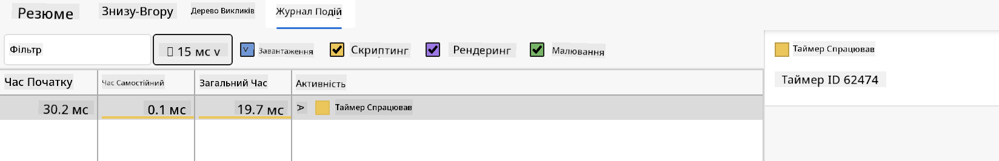

<!--
CO_OP_TRANSLATOR_METADATA:
{
  "original_hash": "eb358f3f4c2c082f9f3a4f98efa1d337",
  "translation_date": "2025-10-24T15:59:38+00:00",
  "source_file": "5-browser-extension/3-background-tasks-and-performance/README.md",
  "language_code": "uk"
}
-->
# Проєкт розширення для браузера, частина 3: Дізнайтеся про фонові завдання та продуктивність

Чому деякі розширення для браузера працюють швидко та чітко, а інші здаються повільними? Секрет у тому, що відбувається за лаштунками. Поки користувачі натискають на інтерфейс вашого розширення, у фоновому режимі відбувається цілий світ процесів, які тихо керують отриманням даних, оновленням іконок та системними ресурсами.

Це наш останній урок у серії про розширення для браузера, і ми зробимо ваш трекер вуглецевого сліду максимально ефективним. Ви додасте динамічне оновлення іконок і навчитеся виявляти проблеми з продуктивністю до того, як вони стануть серйозними. Це як налаштування гоночного автомобіля - невеликі оптимізації можуть суттєво вплинути на роботу системи.

До кінця уроку у вас буде відшліфоване розширення, і ви зрозумієте принципи продуктивності, які відрізняють хороші веб-додатки від чудових. Давайте зануримося у світ оптимізації браузера.

## Тест перед лекцією

[Тест перед лекцією](https://ff-quizzes.netlify.app/web/quiz/27)

### Вступ

У попередніх уроках ви створили форму, підключили її до API та розібралися з асинхронним отриманням даних. Ваше розширення набуває гарного вигляду.

Тепер нам потрібно додати останні штрихи - наприклад, зробити так, щоб іконка розширення змінювала кольори залежно від даних про вуглецевий слід. Це нагадує мені, як NASA оптимізувала кожну систему на космічному кораблі Apollo. Вони не могли дозволити собі жодних зайвих витрат ресурсів чи пам'яті, адже від продуктивності залежали життя. Хоча наше розширення для браузера не настільки критичне, ті ж принципи застосовуються - ефективний код створює кращий досвід для користувачів.

## Основи продуктивності веб-додатків

Коли ваш код працює ефективно, люди можуть *відчути* різницю. Ви знаєте той момент, коли сторінка завантажується миттєво або анімація плавно рухається? Це результат хорошої продуктивності.

Продуктивність - це не лише швидкість, але й створення веб-досвіду, який здається природним, а не незграбним і розчаровуючим. У ранні дні обчислювальної техніки Грейс Хоппер тримала на своєму столі наносекунду (шматок дроту довжиною близько фута), щоб показати, як далеко світло проходить за одну мільярдну секунди. Це був її спосіб пояснити, чому кожна мікросекунда має значення в обчисленнях. Давайте дослідимо інструменти, які допоможуть вам зрозуміти, що уповільнює роботу.

> "Продуктивність веб-сайту - це дві речі: як швидко завантажується сторінка і як швидко працює код на ній." -- [Зак Гроссбарт](https://www.smashingmagazine.com/2012/06/javascript-profiling-chrome-developer-tools/)

Тема того, як зробити ваші веб-сайти блискавично швидкими на всіх типах пристроїв, для всіх типів користувачів і в усіх ситуаціях, є, безумовно, обширною. Ось кілька моментів, які слід враховувати, створюючи стандартний веб-проєкт або розширення для браузера.

Перший крок в оптимізації вашого сайту - це розуміння того, що насправді відбувається "під капотом". На щастя, ваш браузер має потужні інструменти для аналізу продуктивності.

Щоб відкрити Інструменти розробника в Edge, натисніть три крапки у верхньому правому куті, потім перейдіть до Додаткові інструменти > Інструменти розробника. Або скористайтеся комбінацією клавіш: `Ctrl` + `Shift` + `I` на Windows або `Option` + `Command` + `I` на Mac. Після цього перейдіть на вкладку Продуктивність - тут ви будете проводити своє розслідування.

**Ось ваш набір інструментів для аналізу продуктивності:**
- **Відкрийте** Інструменти розробника (ви будете використовувати їх постійно як розробник!)
- **Перейдіть** на вкладку Продуктивність - подумайте про це як про фітнес-трекер вашого веб-додатка
- **Натисніть** кнопку Запис і спостерігайте за діями вашої сторінки
- **Вивчіть** результати, щоб знайти те, що уповільнює роботу

Спробуйте це. Відкрийте веб-сайт (Microsoft.com добре підходить для цього) і натисніть кнопку "Запис". Тепер оновіть сторінку і спостерігайте, як профайлер фіксує все, що відбувається. Коли ви зупините запис, ви побачите детальний розподіл того, як браузер "скриптує", "рендерить" і "малює" сайт. Це нагадує, як центр управління польотами моніторить кожну систему під час запуску ракети - ви отримуєте дані в реальному часі про те, що саме відбувається і коли.

✅ [Документація Microsoft](https://docs.microsoft.com/microsoft-edge/devtools-guide/performance/?WT.mc_id=academic-77807-sagibbon) має багато деталей, якщо ви хочете заглибитися.

> Порада: Очистіть кеш браузера перед тестуванням, щоб побачити, як ваш сайт працює для нових відвідувачів - це зазвичай дуже відрізняється від повторних відвідувань!

Виберіть елементи на шкалі часу профілю, щоб збільшити події, які відбуваються під час завантаження вашої сторінки.

Отримайте знімок продуктивності вашої сторінки, вибравши частину шкали часу профілю та переглянувши панель зведення:


Перевірте панель журналу подій, щоб побачити, чи якась подія тривала довше 15 мс:



✅ Ознайомтеся з вашим профайлером! Відкрийте інструменти розробника на цьому сайті і перевірте, чи є якісь вузькі місця. Який ресурс завантажується найповільніше? Найшвидше?

## На що звертати увагу під час профілювання

Запуск профайлера - це лише початок, справжнє вміння полягає в тому, щоб зрозуміти, що насправді показують ці кольорові графіки. Не хвилюйтеся, ви швидко навчитеся їх читати. Досвідчені розробники навчилися помічати попереджувальні знаки до того, як вони перетворяться на серйозні проблеми.

Давайте поговоримо про звичайних підозрюваних - проблеми з продуктивністю, які часто з'являються у веб-проєктах. Як Марія Кюрі ретельно контролювала рівні радіації у своїй лабораторії, ми повинні стежити за певними шаблонами, які вказують на можливі проблеми. Виявлення їх на ранньому етапі заощадить вам (і вашим користувачам) багато розчарувань.

**Розмір ресурсів**: Веб-сайти з роками стають "важчими", і значна частина цієї додаткової ваги припадає на зображення. Це як ми пакуємо все більше і більше у наші цифрові валізи.

✅ Перегляньте [Архів Інтернету](https://httparchive.org/reports/page-weight), щоб побачити, як розмір сторінок зростав з часом - це досить показово.

**Ось як зберігати ваші ресурси оптимізованими:**
- **Стисніть** ці зображення! Сучасні формати, такі як WebP, можуть значно зменшити розмір файлів
- **Надавайте** правильний розмір зображення для кожного пристрою - немає потреби надсилати величезні зображення для настільних комп'ютерів на телефони
- **Мініфікуйте** ваш CSS та JavaScript - кожен байт має значення
- **Використовуйте** ліниве завантаження, щоб зображення завантажувалися лише тоді, коли користувачі фактично прокручують до них

**Перегляд DOM**: Браузер повинен створити свою модель об'єкта документа (DOM) на основі коду, який ви пишете, тому для хорошої продуктивності сторінки важливо зберігати теги мінімальними, використовуючи та стилізуючи лише те, що потрібно сторінці. Наприклад, надлишковий CSS, пов'язаний зі сторінкою, може бути оптимізований; стилі, які потрібно використовувати лише на одній сторінці, не потрібно включати в основний стильовий файл.

**Ключові стратегії оптимізації DOM:**
- **Мінімізуйте** кількість HTML-елементів та рівнів вкладеності
- **Видаляйте** невикористані правила CSS та ефективно об'єднуйте стилі
- **Організуйте** CSS, щоб завантажувати лише те, що потрібно для кожної сторінки
- **Структуруйте** HTML семантично для кращого аналізу браузером

**JavaScript**: Кожен розробник JavaScript повинен стежити за скриптами, які блокують рендеринг, і які повинні бути завантажені перед тим, як решта DOM може бути оброблена та відображена у браузері. Розгляньте можливість використання `defer` з вашими вбудованими скриптами (як це зроблено в модулі Terrarium).

**Сучасні техніки оптимізації JavaScript:**
- **Використовуйте** атрибут `defer` для завантаження скриптів після аналізу DOM
- **Застосовуйте** розділення коду для завантаження лише необхідного JavaScript
- **Впроваджуйте** ліниве завантаження для некритичної функціональності
- **Мінімізуйте** використання важких бібліотек та фреймворків, якщо це можливо

✅ Спробуйте деякі сайти на [веб-сайті тестування швидкості](https://www.webpagetest.org/), щоб дізнатися більше про загальні перевірки, які проводяться для визначення продуктивності сайту.

Тепер, коли ви маєте уявлення про те, як браузер рендерить ресурси, які ви йому надсилаєте, давайте розглянемо останні кілька речей, які вам потрібно зробити, щоб завершити ваше розширення:

### Створіть функцію для розрахунку кольору

Тепер ми створимо функцію, яка перетворює числові дані на значущі кольори. Подумайте про це як про систему світлофора - зелений для чистої енергії, червоний для високої інтенсивності вуглецю.

Ця функція буде брати дані про CO2 з нашого API і визначати, який колір найкраще представляє вплив на навколишнє середовище. Це схоже на те, як вчені використовують кольорове кодування в теплових картах для візуалізації складних моделей даних - від температур океану до формування зірок. Додайте це до `/src/index.js`, одразу після тих змінних `const`, які ми налаштували раніше:

```javascript
function calculateColor(value) {
	// Define CO2 intensity scale (grams per kWh)
	const co2Scale = [0, 150, 600, 750, 800];
	// Corresponding colors from green (clean) to dark brown (high carbon)
	const colors = ['#2AA364', '#F5EB4D', '#9E4229', '#381D02', '#381D02'];

	// Find the closest scale value to our input
	const closestNum = co2Scale.sort((a, b) => {
		return Math.abs(a - value) - Math.abs(b - value);
	})[0];
	
	console.log(`${value} is closest to ${closestNum}`);
	
	// Find the index for color mapping
	const num = (element) => element > closestNum;
	const scaleIndex = co2Scale.findIndex(num);

	const closestColor = colors[scaleIndex];
	console.log(scaleIndex, closestColor);

	// Send color update message to background script
	chrome.runtime.sendMessage({ action: 'updateIcon', value: { color: closestColor } });
}
```

**Розберемо цю хитру маленьку функцію:**
- **Налаштовує** два масиви - один для рівнів CO2, інший для кольорів (зелений = чистий, коричневий = брудний!)
- **Знаходить** найближчий збіг до нашого фактичного значення CO2 за допомогою сортування масиву
- **Отримує** відповідний колір за допомогою методу findIndex()
- **Надсилає** повідомлення до фонової скрипту Chrome з нашим обраним кольором
- **Використовує** шаблонні літерали (ті зворотні лапки) для чистішого форматування рядків
- **Тримає** все організованим за допомогою декларацій const

API `chrome.runtime` [API](https://developer.chrome.com/extensions/runtime) схожий на нервову систему вашого розширення - він обробляє всю комунікацію та завдання за лаштунками:

> "Використовуйте API chrome.runtime, щоб отримати фонову сторінку, повернути деталі про маніфест і слухати та реагувати на події в життєвому циклі додатка або розширення. Ви також можете використовувати цей API для перетворення відносного шляху URL на повністю кваліфіковані URL."

**Чому API Chrome Runtime такий зручний:**
- **Дозволяє** різним частинам вашого розширення спілкуватися між собою
- **Обробляє** фонову роботу без заморожування інтерфейсу користувача
- **Керує** подіями життєвого циклу вашого розширення
- **Робить** передачу повідомлень між скриптами дуже простою

✅ Якщо ви розробляєте це розширення для Edge, вас може здивувати, що ви використовуєте API Chrome. Новіші версії браузера Edge працюють на движку браузера Chromium, тому ви можете використовувати ці інструменти.

> **Порада**: Якщо ви хочете профілювати розширення для браузера, відкрийте інструменти розробника всередині самого розширення, оскільки це окремий екземпляр браузера. Це дає вам доступ до специфічних для розширення метрик продуктивності.

### Встановіть колір іконки за замовчуванням

Перш ніж ми почнемо отримувати реальні дані, давайте дамо нашому розширенню стартову точку. Ніхто не любить дивитися на порожню або зламану іконку. Ми почнемо з зеленого кольору, щоб користувачі знали, що розширення працює з моменту його встановлення.

У вашій функції `init()` налаштуємо цю стандартну зелену іконку:

```javascript
chrome.runtime.sendMessage({
	action: 'updateIcon',
	value: {
		color: 'green',
	},
});
```

**Що досягає ця ініціалізація:**
- **Встановлює** нейтральний зелений колір як стан за замовчуванням
- **Забезпечує** миттєвий візуальний зворотний зв'язок під час завантаження розширення
- **Встановлює** шаблон комунікації з фоновим скриптом
- **Гарантує**, що користувачі бачать функціональне розширення до завантаження даних

### Викличте функцію, виконайте виклик

Тепер давайте з'єднаємо все разом, щоб коли надходять нові дані про CO2, ваша іконка автоматично оновлювалася відповідним кольором. Це як підключення останнього ланцюга в електронному пристрої - раптом всі окремі компоненти працюють як одна система.

Додайте цей рядок одразу після отримання даних про CO2 з API:

```javascript
// After retrieving CO2 data from the API
// let CO2 = data.data[0].intensity.actual;
calculateColor(CO2);
```

**Ця інтеграція досягає:**
- **З'єднує** потік даних API з системою візуальних індикаторів
- **Автоматично запускає** оновлення іконки, коли надходять нові дані
- **Забезпечує** візуальний зворотний зв'язок у реальному часі на основі поточної інтенсивності вуглецю
- **Підтримує** розділення обов'язків між отриманням даних та логікою відображення

І нарешті, у `/dist/background.js`, додайте слухач для цих викликів фонових дій:

```javascript
// Listen for messages from the content script
chrome.runtime.onMessage.addListener(function (msg, sender, sendResponse) {
	if (msg.action === 'updateIcon') {
		chrome.action.setIcon({ imageData: drawIcon(msg.value) });
	}
});

// Draw dynamic icon using Canvas API
// Borrowed from energy lollipop extension - nice feature!
function drawIcon(value) {
	// Create an offscreen canvas for better performance
	const canvas = new OffscreenCanvas(200, 200);
	const context = canvas.getContext('2d');

	// Draw a colored circle representing carbon intensity
	context.beginPath();
	context.fillStyle = value.color;
	context.arc(100, 100, 50, 0, 2 * Math.PI);
	context.fill();

	// Return the image data for the browser icon
	return context.getImageData(50, 50, 100, 100);
}
```

**Ось що робить цей фоновий скрипт:**
- **Слухає** повідом
Ось цікаве детективне завдання: оберіть кілька вебсайтів з відкритим кодом, які існують вже багато років (наприклад, Wikipedia, GitHub або Stack Overflow), і дослідіть їх історію комітів. Чи можете ви знайти моменти, коли вони покращували продуктивність? Які проблеми постійно виникали?

**Ваш підхід до розслідування:**
- **Шукайте** в повідомленнях комітів слова, як-от "оптимізація", "продуктивність" або "швидше"
- **Звертайте увагу** на закономірності – чи постійно вони виправляють одні й ті ж типи проблем?
- **Визначте** основні причини, які уповільнюють роботу вебсайтів
- **Поділіться** тим, що ви виявили – інші розробники можуть навчитися на реальних прикладах

## Тест після лекції

[Тест після лекції](https://ff-quizzes.netlify.app/web/quiz/28)

## Огляд і самостійне навчання

Розгляньте можливість підписатися на [розсилку про продуктивність](https://perf.email/)

Дослідіть деякі способи, якими браузери оцінюють продуктивність вебсайтів, переглянувши вкладки продуктивності в їхніх вебінструментах. Чи знаходите ви якісь суттєві відмінності?

## Завдання

[Проаналізуйте сайт на продуктивність](assignment.md)

---

**Відмова від відповідальності**:  
Цей документ був перекладений за допомогою сервісу автоматичного перекладу [Co-op Translator](https://github.com/Azure/co-op-translator). Хоча ми прагнемо до точності, будь ласка, майте на увазі, що автоматичні переклади можуть містити помилки або неточності. Оригінальний документ на його рідній мові слід вважати авторитетним джерелом. Для критичної інформації рекомендується професійний людський переклад. Ми не несемо відповідальності за будь-які непорозуміння або неправильні тлумачення, що виникають внаслідок використання цього перекладу.