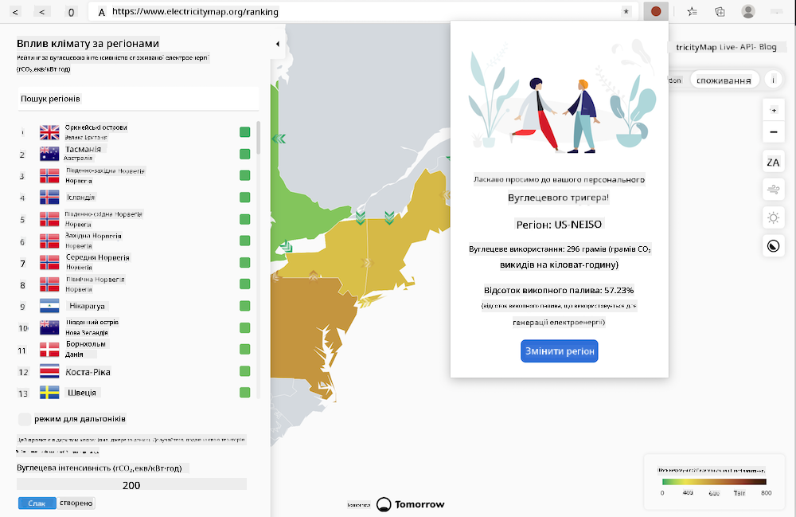

<!--
CO_OP_TRANSLATOR_METADATA:
{
  "original_hash": "fab4e6b4f0efcd587a9029d82991f597",
  "translation_date": "2025-08-27T22:13:39+00:00",
  "source_file": "5-browser-extension/solution/README.md",
  "language_code": "uk"
}
-->
# Розширення для браузера Carbon Trigger: Завершений код

Використовуючи API C02 Signal від tmrow для відстеження споживання електроенергії, створіть розширення для браузера, щоб мати нагадування прямо у вашому браузері про те, наскільки інтенсивним є споживання електроенергії у вашому регіоні. Використання цього розширення допоможе вам приймати обґрунтовані рішення щодо ваших дій на основі цієї інформації.



## Початок роботи

Вам потрібно буде встановити [npm](https://npmjs.com). Завантажте копію цього коду в папку на вашому комп'ютері.

Встановіть усі необхідні пакети:

```
npm install
```

Зберіть розширення за допомогою webpack:

```
npm run build
```

Щоб встановити розширення в Edge, скористайтеся меню з трьома крапками у верхньому правому куті браузера, щоб знайти панель розширень. Там виберіть "Завантажити розпаковане" для завантаження нового розширення. У вікні вибору відкрийте папку 'dist', і розширення буде завантажено. Для використання вам знадобиться API-ключ для API CO2 Signal ([отримайте його тут через електронну пошту](https://www.co2signal.com/) - введіть свою електронну адресу у відповідне поле на цій сторінці) і [код вашого регіону](http://api.electricitymap.org/v3/zones), який відповідає [Electricity Map](https://www.electricitymap.org/map) (наприклад, у Бостоні я використовую 'US-NEISO').


Після введення API-ключа та регіону в інтерфейс розширення, кольорова точка на панелі розширення браузера повинна змінитися, щоб відобразити споживання енергії у вашому регіоні, і надати вам підказку щодо того, які енергоємні дії будуть доречними. Концепція цієї системи "точок" була запозичена з [розширення Energy Lollipop](https://energylollipop.com/) для викидів у Каліфорнії.

---

**Відмова від відповідальності**:  
Цей документ було перекладено за допомогою сервісу автоматичного перекладу [Co-op Translator](https://github.com/Azure/co-op-translator). Хоча ми прагнемо до точності, зверніть увагу, що автоматичні переклади можуть містити помилки або неточності. Оригінальний документ мовою оригіналу слід вважати авторитетним джерелом. Для критично важливої інформації рекомендується професійний переклад людиною. Ми не несемо відповідальності за будь-які непорозуміння або неправильні тлумачення, що виникли внаслідок використання цього перекладу.