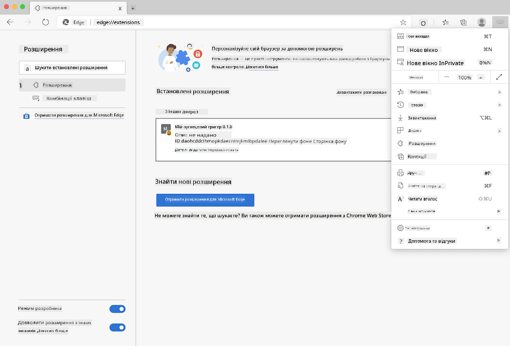

<!--
CO_OP_TRANSLATOR_METADATA:
{
  "original_hash": "9361268ca430b2579375009e1eceb5e5",
  "translation_date": "2025-08-27T22:15:57+00:00",
  "source_file": "5-browser-extension/solution/translation/README.fr.md",
  "language_code": "uk"
}
-->
# Розширення браузера Carbon Trigger: Завершений код

Використовуючи API C02 Signal від tmrow для відстеження споживання електроенергії, створіть розширення для браузера, щоб ви могли отримувати нагадування безпосередньо у своєму браузері про споживання електроенергії у вашому регіоні. Використання цього розширення допоможе вам приймати рішення щодо ваших дій на основі цієї інформації.


## Початок роботи

Вам потрібно буде встановити [npm](https://npmjs.com). Завантажте копію цього коду в папку на вашому комп'ютері.

Встановіть усі необхідні пакети:

```
npm install
```

Зберіть розширення за допомогою webpack:

```
npm run build
```

Щоб встановити на Edge, скористайтеся меню "три крапки" у верхньому правому куті браузера, щоб знайти панель Розширення. Звідти виберіть "Завантажити розпаковане розширення", щоб додати нове розширення. Укажіть папку 'dist' у запиті, і розширення буде завантажено. Для використання вам знадобиться API-ключ для API CO2 Signal ([отримайте його тут через електронну пошту](https://www.co2signal.com/) – введіть свою електронну адресу у відповідне поле на цій сторінці) і [код вашого регіону](http://api.electricitymap.org/v3/zones), який відповідає [Карті електроенергії](https://www.electricitymap.org/map) (наприклад, у Бостоні я використовую 'US-NEISO').



Після введення API-ключа та регіону в інтерфейсі розширення кольорова точка на панелі розширень браузера повинна змінюватися, відображаючи споживання енергії у вашому регіоні, і надавати вам індикатор щодо енергоємних дій, які вам варто виконувати. Концепція цієї системи "точок" була натхненна [розширенням Energy Lollipop](https://energylollipop.com/) для каліфорнійських викидів.

---

**Відмова від відповідальності**:  
Цей документ було перекладено за допомогою сервісу автоматичного перекладу [Co-op Translator](https://github.com/Azure/co-op-translator). Хоча ми прагнемо до точності, зверніть увагу, що автоматичні переклади можуть містити помилки або неточності. Оригінальний документ мовою оригіналу слід вважати авторитетним джерелом. Для критично важливої інформації рекомендується професійний людський переклад. Ми не несемо відповідальності за будь-які непорозуміння або неправильні тлумачення, що виникли внаслідок використання цього перекладу.