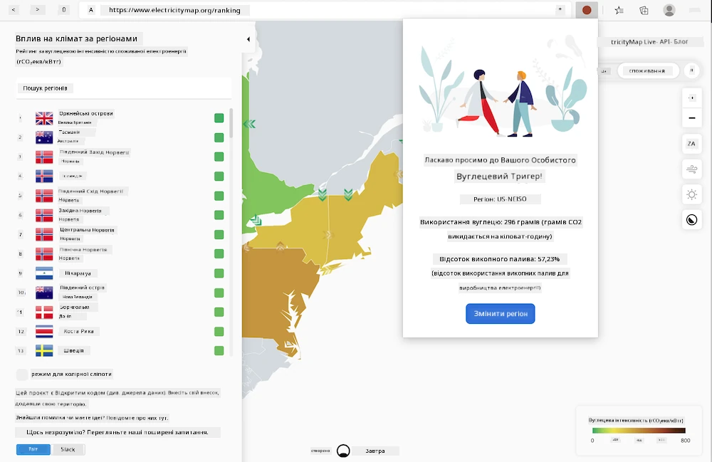
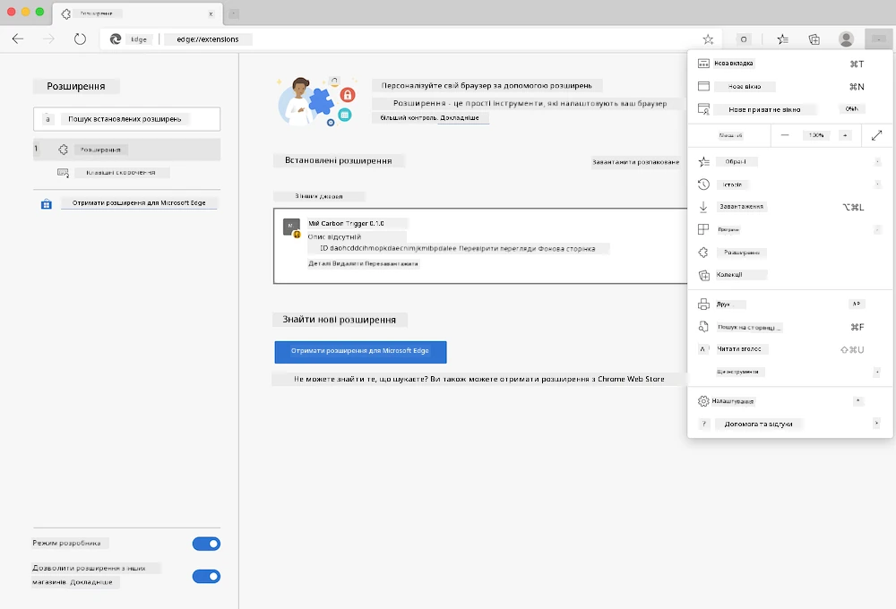

# Розширення браузера Carbon Trigger: код для початку

Ви будете використовувати API Signal CO2 від tmrow для моніторингу споживання електроенергії, щоб створити розширення для браузера, яке надаватиме нагадування безпосередньо у вашому браузері про те, наскільки інтенсивним є використання електроенергії у вашому регіоні. Використання цього спеціального розширення допоможе оцінити ваші дії на основі цієї інформації.



## Початок роботи

Необхідно, щоб [npm](https://npmjs.com) був встановлений. Завантажте копію цього коду в папку на вашому комп’ютері.

Встановіть усі необхідні пакети:

```
npm install
```

Створіть розширення за допомогою webpack:

```
npm run build
```

Для встановлення в Edge скористайтеся меню "три крапки" у верхньому правому куті браузера, щоб знайти панель Розширення. Якщо ще не активовано, увімкніть Режим розробника (внизу ліворуч). Виберіть "Завантажити розпаковане", щоб завантажити нове розширення. Укажіть папку "dist" у запиті, і розширення буде завантажено. Для використання вам знадобиться API-ключ для API CO2 Signal (його можна [отримати тут через електронну пошту](https://www.co2signal.com/) — введіть свою електронну адресу у відповідне поле на цій сторінці) і [код вашого регіону](http://api.electricitymap.org/v3/zones), який відповідає [електричній мапі](https://www.electricitymap.org/map) (наприклад, для Бостона це "US-NEISO").



Після введення API-ключа та регіону в інтерфейсі розширення кольорова точка на панелі розширення браузера має змінитися, щоб відображати споживання енергії у вашому регіоні, і надавати підказки щодо того, які енергоємні дії доцільно виконувати. Концепція цієї системи "точок" була запозичена з [розширення Energy Lollipop](https://energylollipop.com/) для викидів у Каліфорнії.

---

**Відмова від відповідальності**:  
Цей документ був перекладений за допомогою сервісу автоматичного перекладу [Co-op Translator](https://github.com/Azure/co-op-translator). Хоча ми прагнемо до точності, будь ласка, майте на увазі, що автоматичні переклади можуть містити помилки або неточності. Оригінальний документ на його рідній мові слід вважати авторитетним джерелом. Для критичної інформації рекомендується професійний людський переклад. Ми не несемо відповідальності за будь-які непорозуміння або неправильні тлумачення, що виникають внаслідок використання цього перекладу.