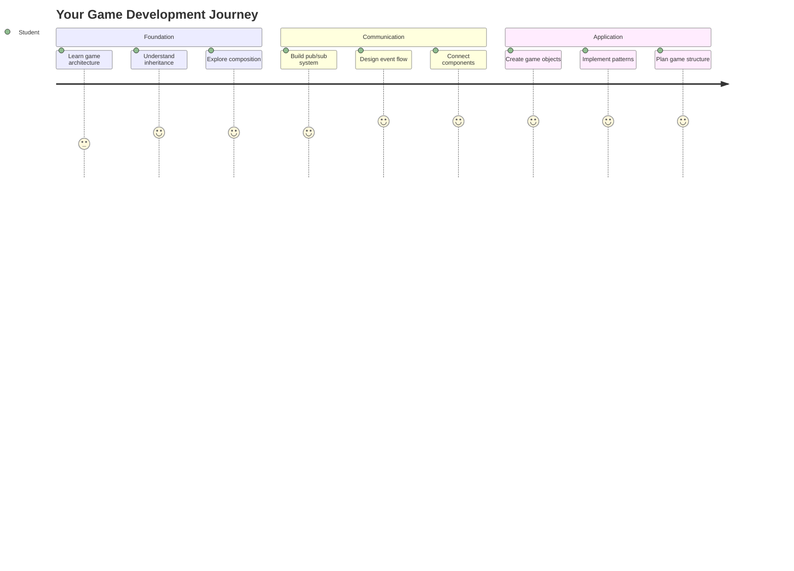
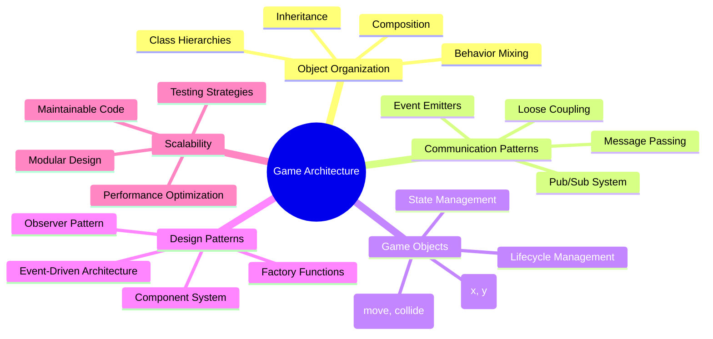
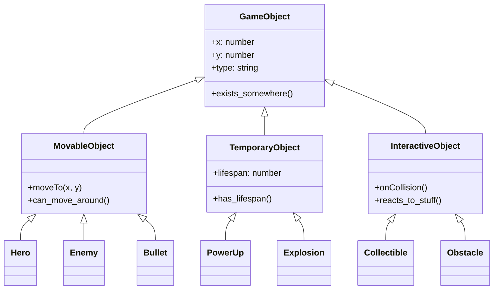
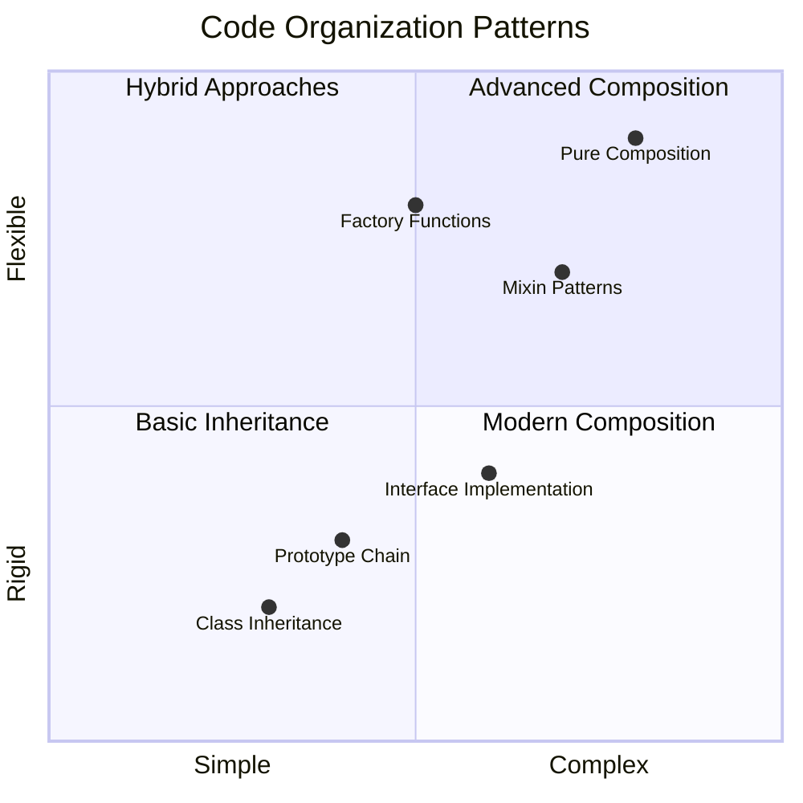
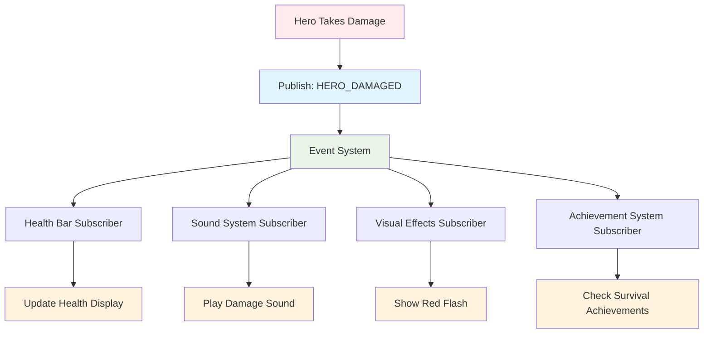
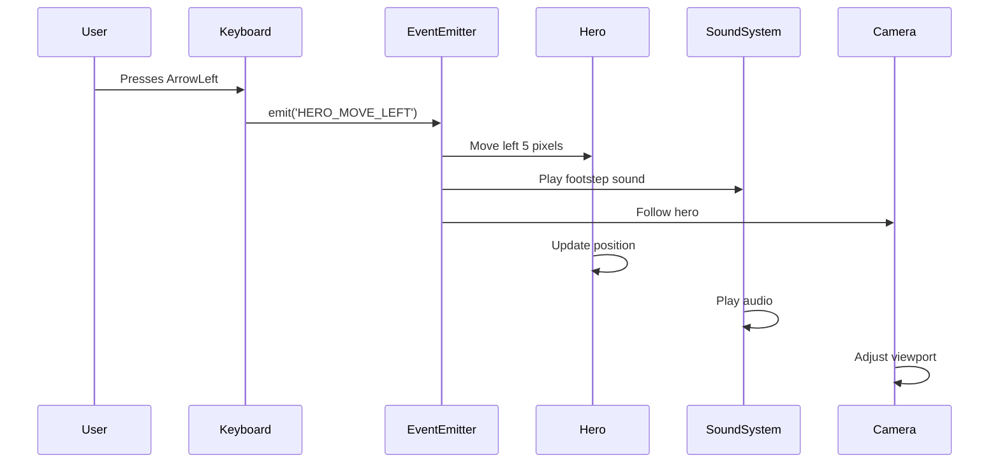
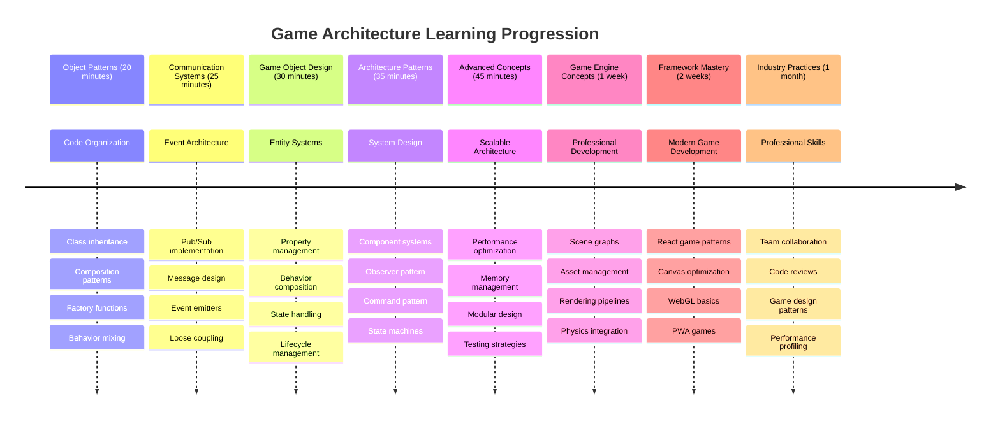

<!--
CO_OP_TRANSLATOR_METADATA:
{
  "original_hash": "a6332a7bb4d0be3bfd24199c83993777",
  "translation_date": "2025-11-06T13:54:56+00:00",
  "source_file": "6-space-game/1-introduction/README.md",
  "language_code": "uk"
}
-->
# Створення космічної гри Частина 1: Вступ




Як і центр управління NASA координує кілька систем під час запуску космічного корабля, ми створимо космічну гру, яка демонструє, як різні частини програми можуть працювати разом бездоганно. Під час створення чогось, у що ви зможете грати, ви навчитеся основним концепціям програмування, які застосовуються до будь-якого програмного проєкту.

Ми дослідимо два фундаментальні підходи до організації коду: наслідування та композицію. Це не просто академічні концепції – це ті самі шаблони, які використовуються у всьому, від відеоігор до банківських систем. Ми також реалізуємо систему комунікації, яка називається pub/sub, що працює як мережі зв'язку, які використовуються в космічних кораблях, дозволяючи різним компонентам обмінюватися інформацією без створення залежностей.

До кінця цієї серії ви зрозумієте, як створювати додатки, які можуть масштабуватися та розвиватися – незалежно від того, чи розробляєте ви ігри, веб-додатки чи будь-які інші програмні системи.



## Тест перед лекцією

[Тест перед лекцією](https://ff-quizzes.netlify.app/web/quiz/29)

## Наслідування та композиція в розробці ігор

Коли проєкти стають складнішими, організація коду стає критично важливою. Те, що починається як простий скрипт, може стати важким для підтримки без належної структури – так само, як місії Apollo вимагали ретельної координації між тисячами компонентів.

Ми дослідимо два фундаментальні підходи до організації коду: наслідування та композицію. Кожен має свої переваги, і розуміння обох допомагає вибрати правильний підхід для різних ситуацій. Ми продемонструємо ці концепції через нашу космічну гру, де герої, вороги, бонуси та інші об'єкти повинні ефективно взаємодіяти.

✅ Одна з найвідоміших книг про програмування стосується [шаблонів проєктування](https://en.wikipedia.org/wiki/Design_Patterns).

У будь-якій грі є `ігрові об'єкти` – інтерактивні елементи, які наповнюють ваш ігровий світ. Герої, вороги, бонуси та візуальні ефекти – це все ігрові об'єкти. Кожен існує в певних координатах екрану, використовуючи значення `x` та `y`, подібно до нанесення точок на координатну площину.

Незважаючи на їхні візуальні відмінності, ці об'єкти часто мають спільні фундаментальні поведінки:

- **Вони існують десь** – Кожен об'єкт має координати x та y, щоб гра знала, де його намалювати
- **Багато з них можуть рухатися** – Герої бігають, вороги переслідують, кулі летять через екран
- **Вони мають тривалість життя** – Деякі залишаються назавжди, інші (як вибухи) з'являються на короткий час і зникають
- **Вони реагують на події** – Коли щось стикається, бонуси збираються, шкала здоров'я оновлюється

✅ Подумайте про гру, як Pac-Man. Чи можете ви визначити чотири типи об'єктів, зазначених вище, у цій грі?



### Вираження поведінки через код

Тепер, коли ви розумієте спільні поведінки ігрових об'єктів, давайте дослідимо, як реалізувати ці поведінки в JavaScript. Ви можете виразити поведінку об'єктів через методи, прикріплені до класів або окремих об'єктів, і є кілька підходів на вибір.

**Підхід на основі класів**

Класи та наслідування забезпечують структурований підхід до організації ігрових об'єктів. Як таксономічна система класифікації, розроблена Карлом Ліннеєм, ви починаєте з базового класу, що містить загальні властивості, а потім створюєте спеціалізовані класи, які успадковують ці основи, додаючи конкретні можливості.

✅ Наслідування – це важлива концепція для розуміння. Дізнайтеся більше у [статті MDN про наслідування](https://developer.mozilla.org/docs/Web/JavaScript/Inheritance_and_the_prototype_chain).

Ось як ви можете реалізувати ігрові об'єкти, використовуючи класи та наслідування:

```javascript
// Step 1: Create the base GameObject class
class GameObject {
  constructor(x, y, type) {
    this.x = x;
    this.y = y;
    this.type = type;
  }
}
```

**Розберемо це крок за кроком:**
- Ми створюємо базовий шаблон, який може використовувати кожен ігровий об'єкт
- Конструктор зберігає, де знаходиться об'єкт (`x`, `y`) і який це тип
- Це стає основою, на якій будуть будуватися всі ваші ігрові об'єкти

```javascript
// Step 2: Add movement capability through inheritance
class Movable extends GameObject {
  constructor(x, y, type) {
    super(x, y, type); // Call parent constructor
  }

  // Add the ability to move to a new position
  moveTo(x, y) {
    this.x = x;
    this.y = y;
  }
}
```

**У наведеному вище ми:**
- **Розширили** клас GameObject, щоб додати функціональність руху
- **Викликали** конструктор батьківського класу за допомогою `super()`, щоб ініціалізувати успадковані властивості
- **Додали** метод `moveTo()`, який оновлює позицію об'єкта

```javascript
// Step 3: Create specific game object types
class Hero extends Movable {
  constructor(x, y) {
    super(x, y, 'Hero'); // Set type automatically
  }
}

class Tree extends GameObject {
  constructor(x, y) {
    super(x, y, 'Tree'); // Trees don't need movement
  }
}

// Step 4: Use your game objects
const hero = new Hero(0, 0);
hero.moveTo(5, 5); // Hero can move!

const tree = new Tree(10, 15);
// tree.moveTo() would cause an error - trees can't move
```

**Розуміння цих концепцій:**
- **Створює** спеціалізовані типи об'єктів, які успадковують відповідні поведінки
- **Демонструє**, як наслідування дозволяє вибіркове включення функцій
- **Показує**, що герої можуть рухатися, а дерева залишаються нерухомими
- **Ілюструє**, як ієрархія класів запобігає недоречним діям

✅ Приділіть кілька хвилин, щоб переосмислити героя Pac-Man (наприклад, Inky, Pinky або Blinky) і як його можна було б написати в JavaScript.

**Підхід композиції**

Композиція слідує модульній філософії дизайну, подібно до того, як інженери проектують космічні кораблі з взаємозамінними компонентами. Замість успадкування від батьківського класу, ви комбінуєте конкретні поведінки, щоб створити об'єкти з точною функціональністю, яка їм потрібна. Цей підхід пропонує гнучкість без жорстких ієрархічних обмежень.

```javascript
// Step 1: Create base behavior objects
const gameObject = {
  x: 0,
  y: 0,
  type: ''
};

const movable = {
  moveTo(x, y) {
    this.x = x;
    this.y = y;
  }
};
```

**Ось що робить цей код:**
- **Визначає** базовий `gameObject` з властивостями позиції та типу
- **Створює** окремий об'єкт поведінки `movable` з функціональністю руху
- **Розділяє** завдання, зберігаючи дані позиції та логіку руху незалежними

```javascript
// Step 2: Compose objects by combining behaviors
const movableObject = { ...gameObject, ...movable };

// Step 3: Create factory functions for different object types
function createHero(x, y) {
  return {
    ...movableObject,
    x,
    y,
    type: 'Hero'
  };
}

function createStatic(x, y, type) {
  return {
    ...gameObject,
    x,
    y,
    type
  };
}
```

**У наведеному вище ми:**
- **Об'єднали** властивості базового об'єкта з поведінкою руху, використовуючи синтаксис spread
- **Створили** фабричні функції, які повертають налаштовані об'єкти
- **Забезпечили** гнучке створення об'єктів без жорстких ієрархій класів
- **Дозволили** об'єктам мати саме ті поведінки, які їм потрібні

```javascript
// Step 4: Create and use your composed objects
const hero = createHero(10, 10);
hero.moveTo(5, 5); // Works perfectly!

const tree = createStatic(0, 0, 'Tree');
// tree.moveTo() is undefined - no movement behavior was composed
```

**Основні моменти для запам'ятовування:**
- **Комбінує** об'єкти, змішуючи поведінки, а не успадковуючи їх
- **Забезпечує** більше гнучкості, ніж жорсткі ієрархії наслідування
- **Дозволяє** об'єктам мати саме ті функції, які їм потрібні
- **Використовує** сучасний синтаксис spread у JavaScript для чистого об'єднання об'єктів
```

**Which Pattern Should You Choose?**

**Which Pattern Should You Choose?**



> 💡 **Порада**: Обидва шаблони мають своє місце в сучасній розробці JavaScript. Класи добре працюють для чітко визначених ієрархій, тоді як композиція блискуче підходить, коли потрібна максимальна гнучкість.
> 
**Ось коли використовувати кожен підхід:**
- **Вибирайте** наслідування, коли у вас є чіткі відносини "є" (Герой *є* рухомим об'єктом)
- **Вибирайте** композицію, коли вам потрібні відносини "має" (Герой *має* здібності до руху)
- **Розглядайте** уподобання вашої команди та вимоги проєкту
- **Пам'ятайте**, що ви можете змішувати обидва підходи в одному додатку

### 🔄 **Педагогічна перевірка**
**Розуміння організації об'єктів**: Перед переходом до шаблонів комунікації переконайтеся, що ви можете:
- ✅ Пояснити різницю між наслідуванням і композицією
- ✅ Визначити, коли використовувати класи проти фабричних функцій
- ✅ Зрозуміти, як працює ключове слово `super()` у наслідуванні
- ✅ Розпізнати переваги кожного підходу для розробки ігор

**Швидкий самоперевірка**: Як би ви створили Летючого Ворога, який може і рухатися, і літати?
- **Підхід наслідування**: `class FlyingEnemy extends Movable`
- **Підхід композиції**: `{ ...movable, ...flyable, ...gameObject }`

**Зв'язок з реальним світом**: Ці шаблони з'являються всюди:
- **React Компоненти**: Props (композиція) проти наслідування класів
- **Ігрові рушії**: Системи компонентів сутностей використовують композицію
- **Мобільні додатки**: UI-фреймворки часто використовують ієрархії наслідування

## Шаблони комунікації: Система Pub/Sub

Коли додатки стають складними, управління комунікацією між компонентами стає викликом. Шаблон publish-subscribe (pub/sub) вирішує цю проблему, використовуючи принципи, схожі на радіомовлення – один передавач може досягти кількох приймачів, не знаючи, хто слухає.

Подумайте, що відбувається, коли герой отримує пошкодження: шкала здоров'я оновлюється, звукові ефекти відтворюються, з'являється візуальний зворотний зв'язок. Замість того, щоб зв'язувати об'єкт героя безпосередньо з цими системами, pub/sub дозволяє герою транслювати повідомлення "отримано пошкодження". Будь-яка система, яка повинна реагувати, може підписатися на цей тип повідомлення і відповідно реагувати.

✅ **Pub/Sub** означає 'publish-subscribe'



### Розуміння архітектури Pub/Sub

Шаблон pub/sub зберігає різні частини вашого додатку слабо зв'язаними, тобто вони можуть працювати разом без прямої залежності один від одного. Це розділення робить ваш код більш підтримуваним, тестованим і гнучким до змін.

**Ключові учасники pub/sub:**
- **Повідомлення** – Простий текстовий ярлик, як `'PLAYER_SCORED'`, що описує, що сталося (плюс будь-яка додаткова інформація)
- **Видавці** – Об'єкти, які оголошують "Щось сталося!" всім, хто слухає
- **Підписники** – Об'єкти, які кажуть "Мені це цікаво" і реагують, коли це відбувається
- **Система подій** – Посередник, який забезпечує доставку повідомлень до потрібних слухачів

### Створення системи подій

Давайте створимо просту, але потужну систему подій, яка демонструє ці концепції:

```javascript
// Step 1: Create the EventEmitter class
class EventEmitter {
  constructor() {
    this.listeners = {}; // Store all event listeners
  }
  
  // Register a listener for a specific message type
  on(message, listener) {
    if (!this.listeners[message]) {
      this.listeners[message] = [];
    }
    this.listeners[message].push(listener);
  }
  
  // Send a message to all registered listeners
  emit(message, payload = null) {
    if (this.listeners[message]) {
      this.listeners[message].forEach(listener => {
        listener(message, payload);
      });
    }
  }
}
```

**Розбір того, що тут відбувається:**
- **Створює** центральну систему управління подіями, використовуючи простий клас
- **Зберігає** слухачів у об'єкті, організованому за типом повідомлення
- **Реєструє** нових слухачів за допомогою методу `on()`
- **Транслює** повідомлення всім зацікавленим слухачам за допомогою `emit()`
- **Підтримує** необов'язкові дані для передачі відповідної інформації

### Об'єднання всього: Практичний приклад

Добре, давайте побачимо це в дії! Ми створимо просту систему руху, яка показує, наскільки чистим і гнучким може бути pub/sub:

```javascript
// Step 1: Define your message types
const Messages = {
  HERO_MOVE_LEFT: 'HERO_MOVE_LEFT',
  HERO_MOVE_RIGHT: 'HERO_MOVE_RIGHT',
  ENEMY_SPOTTED: 'ENEMY_SPOTTED'
};

// Step 2: Create your event system and game objects
const eventEmitter = new EventEmitter();
const hero = createHero(0, 0);
```

**Ось що робить цей код:**
- **Визначає** об'єкт констант, щоб уникнути помилок у назвах повідомлень
- **Створює** екземпляр емітера подій для обробки всієї комунікації
- **Ініціалізує** об'єкт героя на стартовій позиції

```javascript
// Step 3: Set up event listeners (subscribers)
eventEmitter.on(Messages.HERO_MOVE_LEFT, () => {
  hero.moveTo(hero.x - 5, hero.y);
  console.log(`Hero moved to position: ${hero.x}, ${hero.y}`);
});

eventEmitter.on(Messages.HERO_MOVE_RIGHT, () => {
  hero.moveTo(hero.x + 5, hero.y);
  console.log(`Hero moved to position: ${hero.x}, ${hero.y}`);
});
```

**У наведеному вище ми:**
- **Зареєстрували** слухачів подій, які реагують на повідомлення про рух
- **Оновили** позицію героя на основі напрямку руху
- **Додали** логування в консоль для відстеження змін позиції героя
- **Розділили** логіку руху від обробки введення

```javascript
// Step 4: Connect keyboard input to events (publishers)
window.addEventListener('keydown', (event) => {
  switch(event.key) {
    case 'ArrowLeft':
      eventEmitter.emit(Messages.HERO_MOVE_LEFT);
      break;
    case 'ArrowRight':
      eventEmitter.emit(Messages.HERO_MOVE_RIGHT);
      break;
  }
});
```

**Розуміння цих концепцій:**
- **З'єднує** введення з клавіатури з ігровими подіями без жорсткого зв'язку
- **Дозволяє** системі введення спілкуватися з ігровими об'єктами опосередковано
- **Дозволяє** кільком системам реагувати на ті самі події введення з клавіатури
- **Робить** легко змінювати прив'язки клавіш або додавати нові методи введення



> 💡 **Порада**: Краса цього шаблону – це гнучкість! Ви можете легко додати звукові ефекти, тряску екрану або ефекти частинок, просто додавши більше слухачів подій – не потрібно змінювати існуючий код клавіатури або руху.
> 
**Ось чому вам сподобається цей підхід:**
- Додавати нові функції стає дуже легко – просто слухайте події, які вас цікавлять
- Кілька речей можуть реагувати на одну подію, не заважаючи один одному
- Тестування стає набагато простішим, оскільки кожна частина працює незалежно
- Коли щось ламається, ви точно знаєте, де шукати проблему

### Чому Pub/Sub ефективно масштабується

Шаблон pub/sub зберігає простоту, коли додатки стають складними. Незалежно від того, чи керуєте ви десятками ворогів, динамічними оновленнями UI або звуковими системами, шаблон справляється зі збільшенням масштабу без змін архітектури. Нові функції інтегруються в існуючу систему подій без впливу на встановлену функціональність.

> ⚠️ **Поширена помилка**: Не створюйте занадто багато специфічних типів повідомлень на ранніх етапах. Починайте з широких категорій і уточнюйте їх, коли потреби вашої гри стануть зрозумілішими.
> 
**Найкращі практики:**
- **Групуйте** пов'язані повідомлення в логічні категорії
- **Використовуйте** описові назви, які чітко вказують, що сталося
- **Тримайте** дані повідомлень простими та сфокусованими
- **Документуйте** ваші типи повідомлень для співпраці в команді

### 🔄 **П
Розгляньте, як патерн pub-sub може покращити архітектуру гри. Визначте, які компоненти повинні генерувати події, і як система повинна на них реагувати. Розробіть концепцію гри та сплануйте комунікаційні патерни між її компонентами.

## Тест після лекції

[Тест після лекції](https://ff-quizzes.netlify.app/web/quiz/30)

## Огляд і самостійне навчання

Дізнайтеся більше про Pub/Sub, [прочитавши про нього](https://docs.microsoft.com/azure/architecture/patterns/publisher-subscriber/?WT.mc_id=academic-77807-sagibbon).

### ⚡ **Що можна зробити за наступні 5 хвилин**
- [ ] Відкрити будь-яку HTML5 гру онлайн і переглянути її код за допомогою DevTools
- [ ] Створити простий елемент HTML5 Canvas і намалювати базову фігуру
- [ ] Спробувати використати `setInterval` для створення простого циклу анімації
- [ ] Ознайомитися з документацією Canvas API і спробувати метод малювання

### 🎯 **Що можна досягти за годину**
- [ ] Завершити тест після уроку та зрозуміти концепції розробки ігор
- [ ] Налаштувати структуру проекту гри з файлами HTML, CSS і JavaScript
- [ ] Створити базовий ігровий цикл, який постійно оновлюється і відображається
- [ ] Намалювати перші спрайти гри на Canvas
- [ ] Реалізувати базове завантаження ресурсів для зображень і звуків

### 📅 **Створення гри протягом тижня**
- [ ] Завершити повну космічну гру з усіма запланованими функціями
- [ ] Додати якісну графіку, звукові ефекти та плавні анімації
- [ ] Реалізувати стани гри (екран старту, ігровий процес, завершення гри)
- [ ] Створити систему підрахунку очок і відстеження прогресу гравця
- [ ] Зробити гру адаптивною та доступною на різних пристроях
- [ ] Поділитися грою онлайн і отримати відгуки від гравців

### 🌟 **Розробка гри протягом місяця**
- [ ] Створити кілька ігор, досліджуючи різні жанри та механіки
- [ ] Вивчити фреймворк для розробки ігор, наприклад Phaser або Three.js
- [ ] Внести вклад у проекти з відкритим кодом для розробки ігор
- [ ] Опанувати складні патерни програмування ігор та оптимізацію
- [ ] Створити портфоліо, яке демонструє ваші навички розробки ігор
- [ ] Наставляти інших, хто цікавиться розробкою ігор та інтерактивними медіа

## 🎯 Ваш таймлайн освоєння розробки ігор



### 🛠️ Резюме вашого інструментарію архітектури гри

Після завершення цього уроку ви отримали:
- **Майстерність патернів дизайну**: Розуміння компромісів між наслідуванням і композицією
- **Архітектура, орієнтована на події**: Реалізація pub/sub для масштабованої комунікації
- **Об'єктно-орієнтований дизайн**: Ієрархії класів і композиція поведінки
- **Сучасний JavaScript**: Фабричні функції, синтаксис spread і патерни ES6+
- **Масштабована архітектура**: Принципи слабкого зв'язку і модульного дизайну
- **Основи розробки ігор**: Системи сутностей і патерни компонентів
- **Професійні патерни**: Стандартні підходи до організації коду

**Застосування в реальному світі**: Ці патерни безпосередньо застосовуються до:
- **Фреймворків фронтенду**: Архітектура компонентів React/Vue і управління станом
- **Бекенд-сервісів**: Комунікація мікросервісів і системи, орієнтовані на події
- **Мобільної розробки**: Архітектура додатків для iOS/Android і системи сповіщень
- **Ігрових рушіїв**: Unity, Unreal і розробка веб-ігор
- **Корпоративного програмного забезпечення**: Проектування подій і розподілених систем
- **Дизайн API**: RESTful сервіси і комунікація в реальному часі

**Професійні навички, які ви отримали**: Тепер ви можете:
- **Проектувати** масштабовані архітектури програмного забезпечення, використовуючи перевірені патерни
- **Реалізовувати** системи, орієнтовані на події, які обробляють складні взаємодії
- **Обирати** відповідні стратегії організації коду для різних сценаріїв
- **Виправляти помилки** і ефективно підтримувати системи зі слабким зв'язком
- **Комунікувати** технічні рішення, використовуючи стандартну термінологію галузі

**Наступний рівень**: Ви готові реалізувати ці патерни в реальній грі, досліджувати складні теми розробки ігор або застосовувати ці архітектурні концепції до веб-додатків!

🌟 **Досягнення розблоковано**: Ви опанували фундаментальні патерни архітектури програмного забезпечення, які забезпечують роботу всього — від простих ігор до складних корпоративних систем!

## Завдання

[Створіть макет гри](assignment.md)

---

**Відмова від відповідальності**:  
Цей документ був перекладений за допомогою сервісу автоматичного перекладу [Co-op Translator](https://github.com/Azure/co-op-translator). Хоча ми прагнемо до точності, будь ласка, майте на увазі, що автоматичні переклади можуть містити помилки або неточності. Оригінальний документ на його рідній мові слід вважати авторитетним джерелом. Для критичної інформації рекомендується професійний людський переклад. Ми не несемо відповідальності за будь-які непорозуміння або неправильні тлумачення, що виникають внаслідок використання цього перекладу.