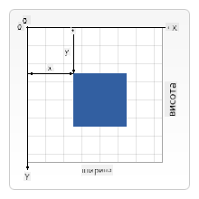

<!--
CO_OP_TRANSLATOR_METADATA:
{
  "original_hash": "056641280211e52fd0adb81b6058ec55",
  "translation_date": "2025-08-28T18:15:01+00:00",
  "source_file": "6-space-game/2-drawing-to-canvas/README.md",
  "language_code": "uk"
}
-->
# Створення космічної гри, частина 2: Малюємо героя та монстрів на Canvas

## Тест перед лекцією

[Тест перед лекцією](https://ff-quizzes.netlify.app/web/quiz/31)

## Canvas

Canvas — це HTML-елемент, який за замовчуванням не має вмісту; це чистий аркуш. Ви повинні додати до нього елементи, малюючи на ньому.

✅ Прочитайте [більше про Canvas API](https://developer.mozilla.org/docs/Web/API/Canvas_API) на MDN.

Ось як зазвичай оголошується Canvas як частина тіла сторінки:

```html
<canvas id="myCanvas" width="200" height="100"></canvas>
```

Вищезазначений код встановлює `id`, `width` і `height`.

- `id`: встановіть це, щоб отримати посилання, коли вам потрібно взаємодіяти з елементом.
- `width`: це ширина елемента.
- `height`: це висота елемента.

## Малювання простих геометричних фігур

Canvas використовує декартову систему координат для малювання. Таким чином, він використовує осі x і y для визначення місця розташування об'єкта. Точка `0,0` — це верхній лівий кут, а нижній правий кут відповідає значенням WIDTH і HEIGHT Canvas.


> Зображення з [MDN](https://developer.mozilla.org/docs/Web/API/Canvas_API/Tutorial/Drawing_shapes)

Щоб малювати на елементі Canvas, потрібно виконати наступні кроки:

1. **Отримати посилання** на елемент Canvas.
1. **Отримати посилання** на елемент Context, який знаходиться на Canvas.
1. **Виконати операцію малювання** за допомогою елемента Context.

Код для виконання цих кроків зазвичай виглядає так:

```javascript
// draws a red rectangle
//1. get the canvas reference
canvas = document.getElementById("myCanvas");

//2. set the context to 2D to draw basic shapes
ctx = canvas.getContext("2d");

//3. fill it with the color red
ctx.fillStyle = 'red';

//4. and draw a rectangle with these parameters, setting location and size
ctx.fillRect(0,0, 200, 200) // x,y,width, height
```

✅ Canvas API здебільшого зосереджений на 2D-фігурах, але ви також можете малювати 3D-елементи на веб-сторінці; для цього можна використовувати [WebGL API](https://developer.mozilla.org/docs/Web/API/WebGL_API).

За допомогою Canvas API можна малювати різні елементи, такі як:

- **Геометричні фігури**. Ми вже показали, як намалювати прямокутник, але є багато інших форм, які можна створити.
- **Текст**. Ви можете малювати текст із будь-яким шрифтом і кольором.
- **Зображення**. Ви можете малювати зображення на основі графічних файлів, таких як .jpg або .png.

✅ Спробуйте! Ви знаєте, як намалювати прямокутник, чи можете ви намалювати коло на сторінці? Подивіться на цікаві приклади малюнків Canvas на CodePen. Ось [особливо вражаючий приклад](https://codepen.io/dissimulate/pen/KrAwx).

## Завантаження та малювання графічного ресурсу

Щоб завантажити графічний ресурс, потрібно створити об'єкт `Image` і встановити його властивість `src`. Потім потрібно слухати подію `load`, щоб дізнатися, коли зображення готове до використання. Код виглядає так:

### Завантаження ресурсу

```javascript
const img = new Image();
img.src = 'path/to/my/image.png';
img.onload = () => {
  // image loaded and ready to be used
}
```

### Шаблон завантаження ресурсу

Рекомендується обгорнути вищезазначений код у конструкцію, як показано нижче, щоб було легше використовувати ресурс і маніпулювати ним лише тоді, коли він повністю завантажений:

```javascript
function loadAsset(path) {
  return new Promise((resolve) => {
    const img = new Image();
    img.src = path;
    img.onload = () => {
      // image loaded and ready to be used
      resolve(img);
    }
  })
}

// use like so

async function run() {
  const heroImg = await loadAsset('hero.png')
  const monsterImg = await loadAsset('monster.png')
}

```

Щоб намалювати ігрові ресурси на екрані, ваш код виглядатиме так:

```javascript
async function run() {
  const heroImg = await loadAsset('hero.png')
  const monsterImg = await loadAsset('monster.png')

  canvas = document.getElementById("myCanvas");
  ctx = canvas.getContext("2d");
  ctx.drawImage(heroImg, canvas.width/2,canvas.height/2);
  ctx.drawImage(monsterImg, 0,0);
}
```

## Тепер час почати створювати вашу гру

### Що створювати

Ви створите веб-сторінку з елементом Canvas. Вона повинна відображати чорний екран розміром `1024*768`. Ми надали вам два зображення:

- Корабель героя

   

- 5*5 монстрів

   

### Рекомендовані кроки для початку розробки

Знайдіть файли, які були створені для вас у підпапці `your-work`. Вона повинна містити наступне:

```bash
-| assets
  -| enemyShip.png
  -| player.png
-| index.html
-| app.js
-| package.json
```

Відкрийте копію цієї папки у Visual Studio Code. Вам потрібно налаштувати локальне середовище розробки, бажано з Visual Studio Code, NPM і Node. Якщо у вас не встановлено `npm`, [ось як це зробити](https://www.npmjs.com/get-npm).

Розпочніть ваш проєкт, перейшовши до папки `your_work`:

```bash
cd your-work
npm start
```

Вищезазначений код запустить HTTP-сервер за адресою `http://localhost:5000`. Відкрийте браузер і введіть цю адресу. Зараз це порожня сторінка, але це зміниться.

> Примітка: щоб побачити зміни на екрані, оновіть браузер.

### Додайте код

Додайте необхідний код до `your-work/app.js`, щоб виконати наступне:

1. **Намалюйте** Canvas із чорним фоном.
   > Порада: додайте два рядки під відповідним TODO у `/app.js`, встановивши елемент `ctx` чорним, а верхні/ліві координати — 0,0, а висоту та ширину — рівними розмірам Canvas.
2. **Завантажте** текстури.
   > Порада: додайте зображення гравця та ворога, використовуючи `await loadTexture` і передаючи шлях до зображення. Ви поки не побачите їх на екрані!
3. **Намалюйте** героя в центрі екрана в нижній половині.
   > Порада: використовуйте API `drawImage`, щоб намалювати heroImg на екрані, встановивши `canvas.width / 2 - 45` і `canvas.height - canvas.height / 4)`.
4. **Намалюйте** 5*5 монстрів.
   > Порада: тепер ви можете розкоментувати код для малювання ворогів на екрані. Далі перейдіть до функції `createEnemies` і розробіть її.

   Спочатку налаштуйте кілька констант:

    ```javascript
    const MONSTER_TOTAL = 5;
    const MONSTER_WIDTH = MONSTER_TOTAL * 98;
    const START_X = (canvas.width - MONSTER_WIDTH) / 2;
    const STOP_X = START_X + MONSTER_WIDTH;
    ```

    потім створіть цикл для малювання масиву монстрів на екрані:

    ```javascript
    for (let x = START_X; x < STOP_X; x += 98) {
        for (let y = 0; y < 50 * 5; y += 50) {
          ctx.drawImage(enemyImg, x, y);
        }
      }
    ```

## Результат

Готовий результат повинен виглядати так:


## Рішення

Спробуйте вирішити завдання самостійно, але якщо ви застрягли, перегляньте [рішення](../../../../6-space-game/2-drawing-to-canvas/solution/app.js).

---

## 🚀 Виклик

Ви дізналися про малювання за допомогою Canvas API, орієнтованого на 2D; ознайомтеся з [WebGL API](https://developer.mozilla.org/docs/Web/API/WebGL_API) і спробуйте намалювати 3D-об'єкт.

## Тест після лекції

[Тест після лекції](https://ff-quizzes.netlify.app/web/quiz/32)

## Огляд і самостійне навчання

Дізнайтеся більше про Canvas API, [прочитавши про нього](https://developer.mozilla.org/docs/Web/API/Canvas_API).

## Завдання

[Попрацюйте з Canvas API](assignment.md)

---

**Відмова від відповідальності**:  
Цей документ був перекладений за допомогою сервісу автоматичного перекладу [Co-op Translator](https://github.com/Azure/co-op-translator). Хоча ми прагнемо до точності, будь ласка, майте на увазі, що автоматичні переклади можуть містити помилки або неточності. Оригінальний документ на його рідній мові слід вважати авторитетним джерелом. Для критичної інформації рекомендується професійний людський переклад. Ми не несемо відповідальності за будь-які непорозуміння або неправильні тлумачення, що виникають внаслідок використання цього перекладу.