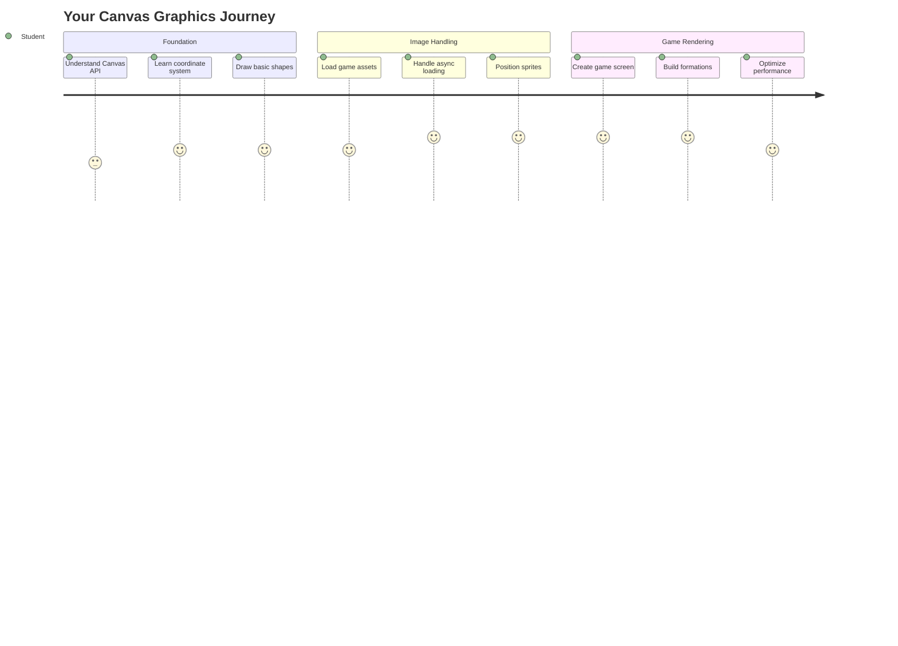
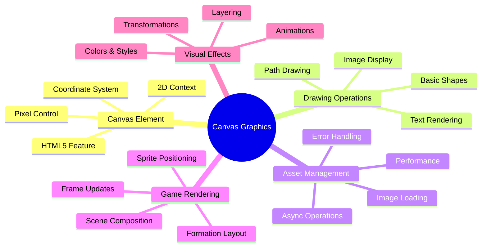
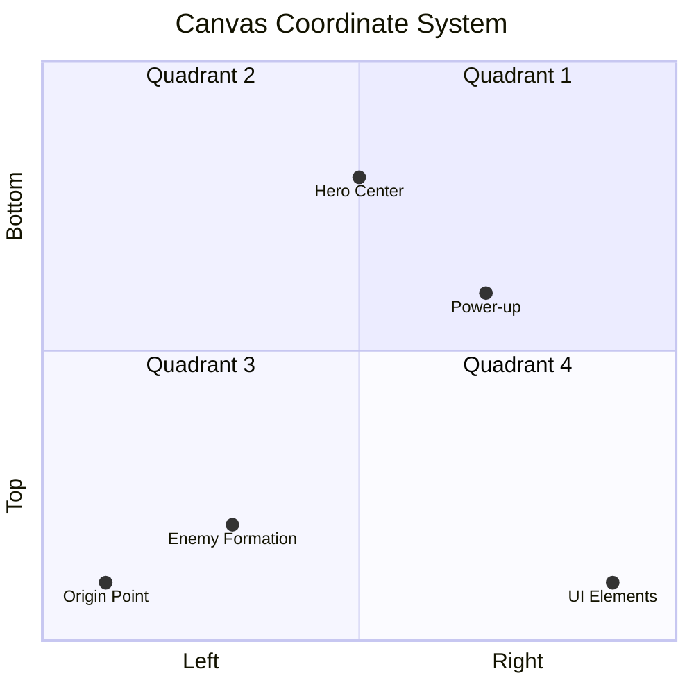
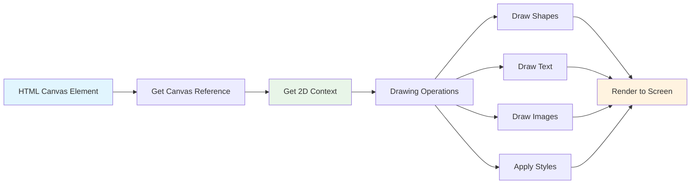
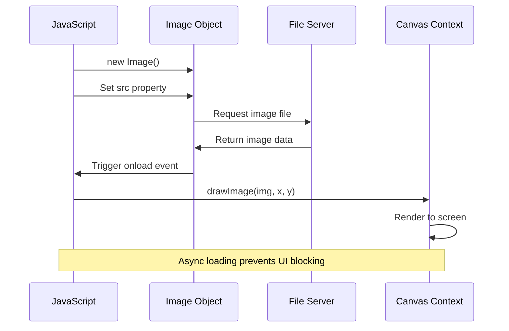
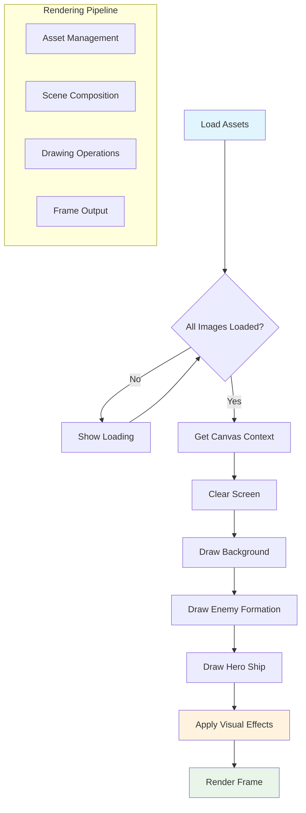
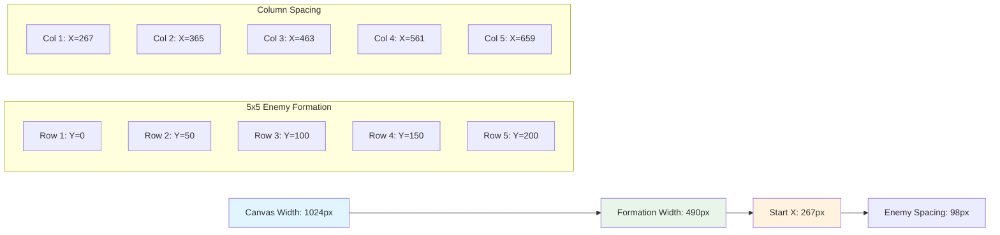
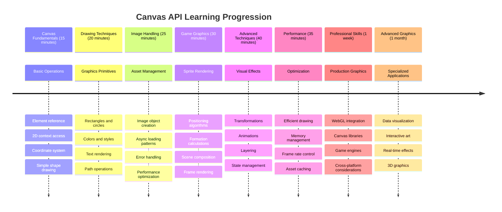

<!--
CO_OP_TRANSLATOR_METADATA:
{
  "original_hash": "7994743c5b21fdcceb36307916ef249a",
  "translation_date": "2025-11-06T13:50:59+00:00",
  "source_file": "6-space-game/2-drawing-to-canvas/README.md",
  "language_code": "uk"
}
-->
# Створення космічної гри, частина 2: Малюємо героя та монстрів на Canvas



Canvas API — одна з найпотужніших функцій веб-розробки для створення динамічної, інтерактивної графіки прямо у вашому браузері. У цьому уроці ми перетворимо порожній HTML-елемент `<canvas>` на ігровий світ, наповнений героями та монстрами. Уявіть canvas як вашу цифрову дошку для малювання, де код стає візуальним.

Ми продовжуємо те, що ви вивчили в попередньому уроці, і тепер заглибимося у візуальні аспекти. Ви навчитеся завантажувати та відображати ігрові спрайти, точно позиціонувати елементи та створювати візуальну основу для вашої космічної гри. Це допоможе перейти від статичних веб-сторінок до динамічних, інтерактивних вражень.

До кінця цього уроку у вас буде повна ігрова сцена з правильно розташованим кораблем героя та формаціями ворогів, готовими до бою. Ви зрозумієте, як сучасні ігри рендерять графіку в браузерах, і здобудете навички для створення власних інтерактивних візуальних проектів. Давайте дослідимо графіку Canvas і оживимо вашу космічну гру!



## Передлекційна вікторина

[Передлекційна вікторина](https://ff-quizzes.netlify.app/web/quiz/31)

## Canvas

Що ж таке цей елемент `<canvas>`? Це рішення HTML5 для створення динамічної графіки та анімації у веб-браузерах. На відміну від звичайних зображень чи відео, які є статичними, canvas дає вам контроль над кожним пікселем на екрані. Це робить його ідеальним для ігор, візуалізації даних та інтерактивного мистецтва. Уявіть його як програмовану поверхню для малювання, де JavaScript стає вашим пензлем.

За замовчуванням елемент canvas виглядає як порожній, прозорий прямокутник на вашій сторінці. Але саме тут прихована його потенціальна сила! Його справжня міць проявляється, коли ви використовуєте JavaScript для малювання форм, завантаження зображень, створення анімацій та забезпечення взаємодії з користувачем. Це схоже на те, як піонери комп'ютерної графіки в Bell Labs у 1960-х роках програмували кожен піксель для створення перших цифрових анімацій.

✅ Прочитайте [більше про Canvas API](https://developer.mozilla.org/docs/Web/API/Canvas_API) на MDN.

Ось як зазвичай оголошується canvas, як частина тіла сторінки:

```html
<canvas id="myCanvas" width="200" height="100"></canvas>
```

**Що робить цей код:**
- **Встановлює** атрибут `id`, щоб ви могли звертатися до цього конкретного елемента canvas у JavaScript
- **Визначає** ширину в пікселях для контролю горизонтального розміру canvas
- **Встановлює** висоту в пікселях для визначення вертикальних розмірів canvas

## Малювання простих геометричних форм

Тепер, коли ви знаєте, що таке елемент canvas, давайте дослідимо, як на ньому малювати! Canvas використовує систему координат, яка може здатися знайомою з уроків математики, але є одна важлива особливість, специфічна для комп'ютерної графіки.

Canvas використовує декартову систему координат з віссю x (горизонтальною) та віссю y (вертикальною) для позиціонування всього, що ви малюєте. Але ось ключова відмінність: на відміну від системи координат з уроків математики, точка початку `(0,0)` знаходиться у верхньому лівому куті, причому значення x збільшуються, коли ви рухаєтеся вправо, а значення y збільшуються, коли ви рухаєтеся вниз. Такий підхід бере свій початок з ранніх комп'ютерних дисплеїв, де електронні промені сканували зверху вниз, роблячи верхній лівий кут природною точкою початку.




> Зображення з [MDN](https://developer.mozilla.org/docs/Web/API/Canvas_API/Tutorial/Drawing_shapes)

Щоб малювати на елементі canvas, ви будете дотримуватися того самого триетапного процесу, який є основою всієї графіки canvas. Після кількох спроб це стане для вас природним:



1. **Отримайте посилання** на ваш елемент Canvas з DOM (так само, як і будь-який інший HTML-елемент)
2. **Отримайте контекст рендерингу 2D** – це забезпечує всі методи малювання
3. **Починайте малювати!** Використовуйте вбудовані методи контексту для створення вашої графіки

Ось як це виглядає в коді:

```javascript
// Step 1: Get the canvas element
const canvas = document.getElementById("myCanvas");

// Step 2: Get the 2D rendering context
const ctx = canvas.getContext("2d");

// Step 3: Set fill color and draw a rectangle
ctx.fillStyle = 'red';
ctx.fillRect(0, 0, 200, 200); // x, y, width, height
```

**Давайте розберемо це крок за кроком:**
- Ми **отримуємо** наш елемент canvas за його ID і зберігаємо його у змінній
- Ми **отримуємо** контекст рендерингу 2D – це наш набір інструментів для малювання
- Ми **вказуємо** canvas, що хочемо заповнити речі червоним кольором, використовуючи властивість `fillStyle`
- Ми **малюємо** прямокутник, починаючи з верхнього лівого кута (0,0), шириною та висотою 200 пікселів

✅ Canvas API здебільшого зосереджений на 2D формах, але ви також можете малювати 3D елементи на веб-сайті; для цього можна використовувати [WebGL API](https://developer.mozilla.org/docs/Web/API/WebGL_API).

Ви можете малювати всілякі речі за допомогою Canvas API, наприклад:

- **Геометричні форми**, ми вже показали, як малювати прямокутник, але є набагато більше, що можна намалювати.
- **Текст**, ви можете малювати текст будь-яким шрифтом і кольором, який вам подобається.
- **Зображення**, ви можете малювати зображення на основі графічного ресурсу, наприклад .jpg або .png.

✅ Спробуйте! Ви знаєте, як намалювати прямокутник, чи можете намалювати коло на сторінці? Подивіться на деякі цікаві малюнки Canvas на CodePen. Ось [особливо вражаючий приклад](https://codepen.io/dissimulate/pen/KrAwx).

### 🔄 **Педагогічна перевірка**
**Розуміння основ Canvas**: Перед переходом до завантаження зображень переконайтеся, що ви можете:
- ✅ Пояснити, чим система координат canvas відрізняється від математичної системи координат
- ✅ Зрозуміти триетапний процес операцій малювання на canvas
- ✅ Визначити, що забезпечує контекст рендерингу 2D
- ✅ Описати, як `fillStyle` і `fillRect` працюють разом

**Швидкий самотест**: Як би ви намалювали синє коло в позиції (100, 50) з радіусом 25?
```javascript
ctx.fillStyle = 'blue';
ctx.beginPath();
ctx.arc(100, 50, 25, 0, 2 * Math.PI);
ctx.fill();
```

**Методи малювання Canvas, які ви тепер знаєте**:
- **fillRect()**: Малює заповнені прямокутники
- **fillStyle**: Встановлює кольори та шаблони
- **beginPath()**: Починає нові шляхи малювання
- **arc()**: Створює кола та криві

## Завантаження та малювання графічного ресурсу

Малювання базових форм корисне для початку, але більшість ігор потребують реальних зображень! Спрайти, фони та текстури — це те, що надає іграм їхню візуальну привабливість. Завантаження та відображення зображень на canvas працює інакше, ніж малювання геометричних форм, але це досить просто, якщо зрозуміти процес.

Нам потрібно створити об'єкт `Image`, завантажити наш графічний файл (це відбувається асинхронно, тобто "у фоновому режимі"), а потім намалювати його на canvas, коли він буде готовий. Такий підхід гарантує, що ваші зображення відображаються правильно, не блокуючи вашу програму під час завантаження.



### Основи завантаження зображень

```javascript
const img = new Image();
img.src = 'path/to/my/image.png';
img.onload = () => {
  // Image loaded and ready to be used
  console.log('Image loaded successfully!');
};
```

**Що відбувається в цьому коді:**
- Ми **створюємо** абсолютно новий об'єкт Image для зберігання нашого спрайту або текстури
- Ми **вказуємо**, який графічний файл завантажити, встановлюючи шлях до джерела
- Ми **слухаємо** подію завантаження, щоб точно знати, коли зображення готове до використання

### Кращий спосіб завантаження зображень

Ось більш надійний спосіб обробки завантаження зображень, який часто використовують професійні розробники. Ми обгорнемо завантаження зображень у функцію на основі Promise – цей підхід, популяризований, коли JavaScript Promises стали стандартом у ES6, робить ваш код більш організованим і дозволяє ефективно обробляти помилки:

```javascript
function loadAsset(path) {
  return new Promise((resolve, reject) => {
    const img = new Image();
    img.src = path;
    img.onload = () => {
      resolve(img);
    };
    img.onerror = () => {
      reject(new Error(`Failed to load image: ${path}`));
    };
  });
}

// Modern usage with async/await
async function initializeGame() {
  try {
    const heroImg = await loadAsset('hero.png');
    const monsterImg = await loadAsset('monster.png');
    // Images are now ready to use
  } catch (error) {
    console.error('Failed to load game assets:', error);
  }
}
```

**Що ми зробили тут:**
- **Обгорнули** всю логіку завантаження зображень у Promise, щоб краще її обробляти
- **Додали** обробку помилок, яка фактично повідомляє нам, коли щось пішло не так
- **Використали** сучасний синтаксис async/await, тому що він набагато зрозуміліший
- **Включили** блоки try/catch для акуратного оброблення будь-яких проблем із завантаженням

Коли ваші зображення завантажені, їх малювання на canvas насправді досить просте:

```javascript
async function renderGameScreen() {
  try {
    // Load game assets
    const heroImg = await loadAsset('hero.png');
    const monsterImg = await loadAsset('monster.png');

    // Get canvas and context
    const canvas = document.getElementById("myCanvas");
    const ctx = canvas.getContext("2d");

    // Draw images to specific positions
    ctx.drawImage(heroImg, canvas.width / 2, canvas.height / 2);
    ctx.drawImage(monsterImg, 0, 0);
  } catch (error) {
    console.error('Failed to render game screen:', error);
  }
}
```

**Давайте розберемо це крок за кроком:**
- Ми **завантажуємо** як зображення героя, так і монстра у фоновому режимі, використовуючи await
- Ми **отримуємо** наш елемент canvas і отримуємо необхідний контекст рендерингу 2D
- Ми **позиціонуємо** зображення героя прямо в центрі, використовуючи швидкі обчислення координат
- Ми **розміщуємо** зображення монстра у верхньому лівому куті, щоб почати формування ворогів
- Ми **ловимо** будь-які помилки, які можуть виникнути під час завантаження або рендерингу



## Тепер час почати створювати вашу гру

Тепер ми об'єднаємо все, щоб створити візуальну основу вашої космічної гри. Ви маєте міцне розуміння основ Canvas і технік завантаження зображень, тому цей практичний розділ проведе вас через створення повного ігрового екрану з правильно розташованими спрайтами.

### Що створити

Ви створите веб-сторінку з елементом Canvas. Вона повинна відображати чорний екран `1024*768`. Ми надали вам два зображення:

- Корабель героя

   

- 5×5 монстрів

   

### Рекомендовані кроки для початку розробки

Знайдіть стартові файли, які були створені для вас у підпапці `your-work`. Структура вашого проекту повинна містити:

```bash
your-work/
├── assets/
│   ├── enemyShip.png
│   └── player.png
├── index.html
├── app.js
└── package.json
```

**Що у вас є:**
- **Ігрові спрайти** знаходяться в папці `assets/`, щоб усе залишалося організованим
- **Ваш основний HTML-файл** налаштовує елемент canvas і готує все до роботи
- **Файл JavaScript**, у якому ви напишете всю магію рендерингу гри
- **Файл package.json**, який налаштовує сервер розробки, щоб ви могли тестувати локально

Відкрийте цю папку у Visual Studio Code, щоб почати розробку. Вам знадобиться локальне середовище розробки з Visual Studio Code, NPM і Node.js. Якщо у вас не налаштований `npm` на комп'ютері, [ось як його встановити](https://www.npmjs.com/get-npm).

Запустіть сервер розробки, перейшовши до папки `your-work`:

```bash
cd your-work
npm start
```

**Ця команда робить кілька крутих речей:**
- **Запускає** локальний сервер за адресою `http://localhost:5000`, щоб ви могли тестувати свою гру
- **Обслуговує** всі ваші файли належним чином, щоб ваш браузер міг їх правильно завантажити
- **Слідкує** за вашими файлами на предмет змін, щоб ви могли розробляти без проблем
- **Надає вам** професійне середовище розробки для тестування всього

> 💡 **Примітка**: Ваш браузер спочатку покаже порожню сторінку – це очікувано! Додавайте код і оновлюйте браузер, щоб побачити зміни. Такий підхід до розробки схожий на те, як NASA створювала комп'ютер Apollo – тестуючи кожен компонент перед інтеграцією в більшу систему.

### Додайте код

Додайте необхідний код до `your-work/app.js`, щоб виконати наступні завдання:

1. **Намалюйте canvas з чорним фоном**
   > 💡 **Як це зробити**: Знайдіть TODO у `/app.js` і додайте лише два рядки. Встановіть `ctx.fillStyle` у чорний, потім використовуйте `ctx.fillRect()`, починаючи з (0,0) з розмірами вашого canvas. Легко!

2. **Завантажте текстури гри**
   > 💡 **Як це зробити**: Використовуйте `await loadAsset()`, щоб завантажити зображення гравця та ворога. Збережіть їх у змінних, щоб використовувати пізніше. Пам'ятайте – вони не з'являться, поки ви їх не намалюєте!

3. **Намалюйте корабель героя в центрі нижньої частини**
   > 💡 **Як це зробити**: Використовуйте `ctx.drawImage()`, щоб позиціонувати вашого героя. Для координати x спробуйте `canvas.width / 2 - 45`, щоб центрувати його, а для координати y використовуйте `canvas.height - canvas.height / 4`, щоб розмістити його в нижній частині.

4. **Намалюйте формацію ворогів 5×5**
   > 💡 **Як це зробити**: Знайдіть функцію `createEnemies` і налаштуйте вкладений цикл. Вам потрібно буде зробити деякі обчислення для розташування та позиціонування, але не хвилюйтеся – я покажу вам, як саме!

Спочатку встановіть константи для правильного макета формації ворогів:

```javascript
const ENEMY_TOTAL = 5;
const ENEMY_SPACING = 98;
const FORMATION_WIDTH = ENEMY_TOTAL * ENEMY_SPACING;
const START_X = (canvas.width - FORMATION_WIDTH) / 2;
const STOP_X = START_X + FORMATION_WIDTH;
```

**Давайте розберемо, що роблять ці константи:**
- Ми **встановлюємо** 5 ворогів на рядок і колонку (гарна сітка 5×5)
- Ми **визначаємо**, скільки місця залишити між ворогами, щоб вони не виглядали тісно
- Ми **обчислюємо**, наскільки широка буде вся формація
- Ми **знаходимо**, де почати і закінчити, щоб формація виглядала центрованою



Потім створіть вкладені цикли для малювання формації ворогів:

```javascript
for (let x = START_X; x < STOP_X; x += ENEMY_SPACING) {
  for (let y = 0; y < 50 * 5; y += 50) {
    ctx.drawImage(enemyImg, x, y);
  }
}
```

**Що робить цей вкладений цикл:**
- Зовнішній цикл **рухається** зліва направо через нашу формацію
- Внутрішній цикл **проходить** зверху вниз, створюючи акуратні рядки
- Ми **малюємо** кожен спрайт ворога на точних координатах x, y, які ми обчислили
- Все залишається **рівномірно розташованим**, щоб виглядало профес
- **Системи координат**: Перетворення математичних даних у позиції на екрані
- **Управління спрайтами**: Завантаження та відображення графіки гри
- **Алгоритми формування**: Математичні шаблони для організованих макетів
- **Асинхронні операції**: Сучасний JavaScript для плавного користувацького досвіду

## Результат

Готовий результат має виглядати так:


## Рішення

Спробуйте вирішити це самостійно, але якщо застрягнете, перегляньте [рішення](../../../../6-space-game/2-drawing-to-canvas/solution/app.js)

---

## Виклик GitHub Copilot Agent 🚀

Використовуйте режим Agent, щоб виконати наступний виклик:

**Опис:** Покращіть ваш космічний ігровий екран, додавши візуальні ефекти та інтерактивні елементи, використовуючи техніки Canvas API, які ви вивчили.

**Завдання:** Створіть новий файл під назвою `enhanced-canvas.html` з полотном, яке відображає анімовані зірки на фоні, пульсуючу шкалу здоров'я для корабля героя та ворожі кораблі, які повільно рухаються вниз. Додайте JavaScript-код, який малює мерехтливі зірки з випадковими позиціями та прозорістю, реалізує шкалу здоров'я, яка змінює колір залежно від рівня здоров'я (зелений > жовтий > червоний), і анімує ворожі кораблі, щоб вони рухалися вниз екраном з різною швидкістю.

Дізнайтеся більше про [режим Agent](https://code.visualstudio.com/blogs/2025/02/24/introducing-copilot-agent-mode) тут.

## 🚀 Виклик

Ви вивчили малювання за допомогою Canvas API, орієнтованого на 2D; ознайомтеся з [WebGL API](https://developer.mozilla.org/docs/Web/API/WebGL_API) і спробуйте намалювати 3D-об'єкт.

## Післялекційний тест

[Післялекційний тест](https://ff-quizzes.netlify.app/web/quiz/32)

## Огляд і самостійне навчання

Дізнайтеся більше про Canvas API, [прочитавши про нього](https://developer.mozilla.org/docs/Web/API/Canvas_API).

### ⚡ **Що ви можете зробити за наступні 5 хвилин**
- [ ] Відкрийте консоль браузера і створіть елемент canvas за допомогою `document.createElement('canvas')`
- [ ] Спробуйте намалювати прямокутник за допомогою методу `fillRect()` на контексті canvas
- [ ] Експериментуйте з різними кольорами, використовуючи властивість `fillStyle`
- [ ] Намалюйте просте коло за допомогою методу `arc()`

### 🎯 **Що ви можете досягти за годину**
- [ ] Пройдіть післялекційний тест і зрозумійте основи canvas
- [ ] Створіть додаток для малювання на canvas з різними формами та кольорами
- [ ] Реалізуйте завантаження зображень і рендеринг спрайтів для вашої гри
- [ ] Побудуйте просту анімацію, яка переміщує об'єкти по canvas
- [ ] Практикуйте трансформації canvas, такі як масштабування, обертання та переміщення

### 📅 **Ваш тижневий шлях освоєння Canvas**
- [ ] Завершіть космічну гру з відшліфованою графікою та анімацією спрайтів
- [ ] Освойте передові техніки canvas, такі як градієнти, шаблони та композитинг
- [ ] Створіть інтерактивні візуалізації за допомогою canvas для представлення даних
- [ ] Дізнайтеся про техніки оптимізації canvas для плавної роботи
- [ ] Побудуйте додаток для малювання або живопису з різними інструментами
- [ ] Досліджуйте творчі шаблони кодування та генеративне мистецтво за допомогою canvas

### 🌟 **Ваш місячний шлях до майстерності графіки**
- [ ] Створіть складні візуальні додатки, використовуючи Canvas 2D і WebGL
- [ ] Вивчіть концепції графічного програмування та основи шейдерів
- [ ] Внесіть вклад у відкриті графічні бібліотеки та інструменти візуалізації
- [ ] Освойте оптимізацію продуктивності для графічно інтенсивних додатків
- [ ] Створіть навчальний контент про програмування canvas і комп'ютерну графіку
- [ ] Станьте експертом у графічному програмуванні, який допомагає іншим створювати візуальні досвіди

## 🎯 Ваш графічний шлях до майстерності Canvas



### 🛠️ Підсумок вашого інструментарію Canvas Graphics

Після завершення цього уроку ви тепер маєте:
- **Майстерність Canvas API**: Повне розуміння програмування 2D-графіки
- **Математика координат**: Точне позиціонування та алгоритми макетів
- **Управління ресурсами**: Професійне завантаження зображень і обробка помилок
- **Рендерингова система**: Структурований підхід до композиції сцени
- **Графіка гри**: Позиціонування спрайтів і розрахунки формування
- **Асинхронне програмування**: Сучасні шаблони JavaScript для плавної роботи
- **Візуальне програмування**: Перетворення математичних концепцій у графіку на екрані

**Застосування в реальному світі**: Ваші навички Canvas безпосередньо застосовуються до:
- **Візуалізації даних**: Діаграми, графіки та інтерактивні панелі
- **Розробки ігор**: 2D-ігри, симуляції та інтерактивні досвіди
- **Цифрового мистецтва**: Творче кодування та проекти генеративного мистецтва
- **UI/UX дизайну**: Кастомна графіка та інтерактивні елементи
- **Освітнього програмного забезпечення**: Візуальні навчальні інструменти та симуляції
- **Веб-додатків**: Динамічна графіка та візуалізації в реальному часі

**Професійні навички, які ви здобули**: Тепер ви можете:
- **Створювати** кастомні графічні рішення без зовнішніх бібліотек
- **Оптимізувати** продуктивність рендерингу для плавного користувацького досвіду
- **Виправляти помилки** складних візуальних проблем за допомогою інструментів розробника браузера
- **Проектувати** масштабовані графічні системи, використовуючи математичні принципи
- **Інтегрувати** графіку Canvas з сучасними веб-фреймворками

**Методи Canvas API, які ви освоїли**:
- **Управління елементами**: getElementById, getContext
- **Операції малювання**: fillRect, drawImage, fillStyle
- **Завантаження ресурсів**: Об'єкти Image, шаблони Promise
- **Математичне позиціонування**: Розрахунки координат, алгоритми формування

**Наступний рівень**: Ви готові додати анімацію, взаємодію з користувачем, виявлення зіткнень або дослідити WebGL для 3D-графіки!

🌟 **Досягнення розблоковано**: Ви створили повну систему рендерингу гри, використовуючи основні техніки Canvas API!

## Завдання

[Попрацюйте з Canvas API](assignment.md)

---

**Відмова від відповідальності**:  
Цей документ був перекладений за допомогою сервісу автоматичного перекладу [Co-op Translator](https://github.com/Azure/co-op-translator). Хоча ми прагнемо до точності, будь ласка, майте на увазі, що автоматичні переклади можуть містити помилки або неточності. Оригінальний документ на його рідній мові слід вважати авторитетним джерелом. Для критичної інформації рекомендується професійний людський переклад. Ми не несемо відповідальності за будь-які непорозуміння або неправильні тлумачення, що виникають внаслідок використання цього перекладу.