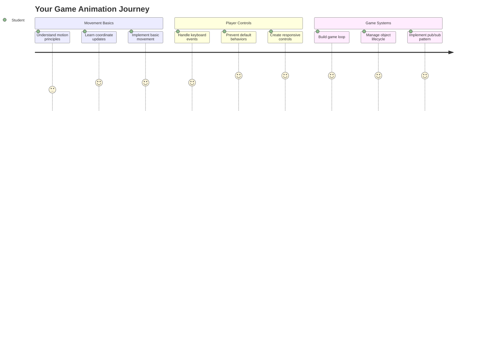
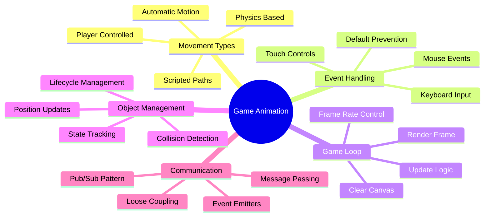
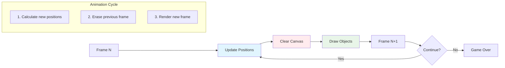
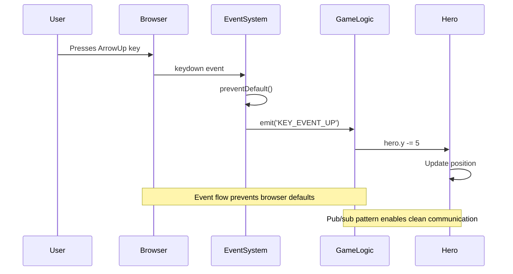
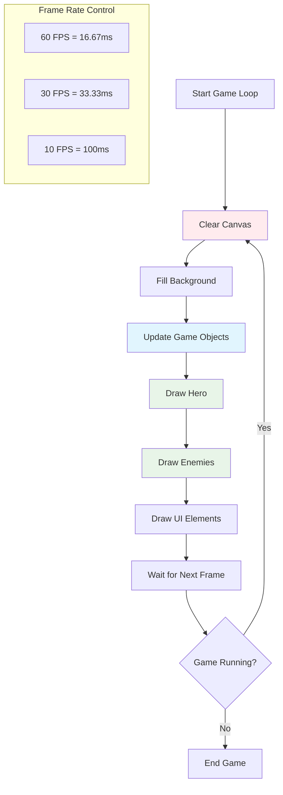
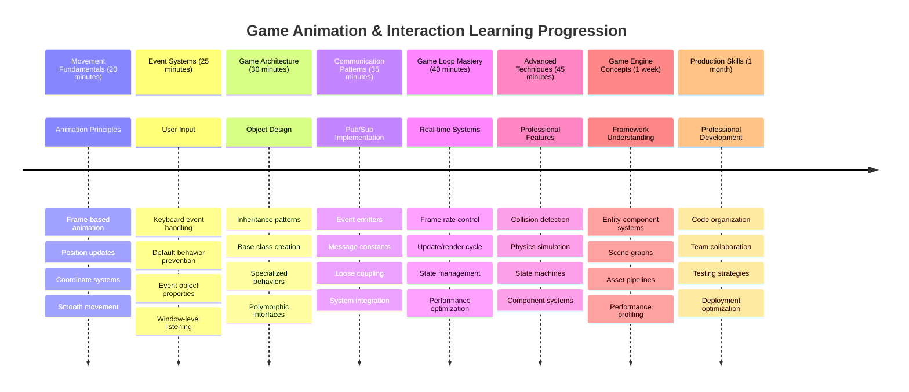

<!--
CO_OP_TRANSLATOR_METADATA:
{
  "original_hash": "8c55a2bd4bc0ebe4c88198fd563a9e09",
  "translation_date": "2025-11-06T13:50:05+00:00",
  "source_file": "6-space-game/3-moving-elements-around/README.md",
  "language_code": "uk"
}
-->
# Створення космічної гри, частина 3: Додавання руху



Згадайте свої улюблені ігри – те, що робить їх захоплюючими, це не лише гарна графіка, а й те, як усе рухається та реагує на ваші дії. Зараз ваша космічна гра схожа на красиву картину, але ми збираємося додати рух, який оживить її.

Коли інженери NASA програмували комп'ютер керування для місій «Аполлон», вони стикалися з подібним викликом: як зробити так, щоб космічний корабель реагував на команди пілота, одночасно автоматично коригуючи курс? Принципи, які ми сьогодні вивчимо, відображають ті самі концепції – управління рухом, контрольованим гравцем, поряд з автоматичними системними поведінками.

У цьому уроці ви навчитеся змушувати космічні кораблі ковзати по екрану, реагувати на команди гравця та створювати плавні шаблони руху. Ми розділимо все на зрозумілі концепції, які природно доповнюють одна одну.

До кінця уроку гравці зможуть керувати своїм героїчним кораблем на екрані, а ворожі судна патрулюватимуть над головою. Що важливіше, ви зрозумієте основні принципи, які лежать в основі систем руху в іграх.



## Тест перед лекцією

[Тест перед лекцією](https://ff-quizzes.netlify.app/web/quiz/33)

## Розуміння руху в іграх

Ігри оживають, коли об'єкти починають рухатися, і є два основні способи, як це відбувається:

- **Рух, контрольований гравцем**: Коли ви натискаєте клавішу або клацаєте мишкою, щось рухається. Це прямий зв'язок між вами та світом гри.
- **Автоматичний рух**: Коли сама гра вирішує рухати об'єкти – наприклад, ті ворожі кораблі, які повинні патрулювати екран незалежно від ваших дій.

Змусити об'єкти рухатися на екрані комп'ютера простіше, ніж ви думаєте. Пам'ятаєте ті координати x і y з уроків математики? Саме з ними ми працюємо тут. Коли Галілей спостерігав за місяцями Юпітера у 1610 році, він фактично робив те саме – відстежував позиції з часом, щоб зрозуміти шаблони руху.

Рухати об'єкти на екрані – це як створювати анімацію в блокноті – потрібно виконати три прості кроки:



1. **Оновити позицію** – Змінити місце розташування об'єкта (наприклад, перемістити його на 5 пікселів вправо)
2. **Стерти старий кадр** – Очистити екран, щоб не залишалися сліди
3. **Намалювати новий кадр** – Розмістити об'єкт у новій точці

Робіть це достатньо швидко, і вуаля! Ви отримуєте плавний рух, який здається природним для гравців.

Ось як це може виглядати в коді:

```javascript
// Set the hero's location
hero.x += 5;
// Clear the rectangle that hosts the hero
ctx.clearRect(0, 0, canvas.width, canvas.height);
// Redraw the game background and hero
ctx.fillRect(0, 0, canvas.width, canvas.height);
ctx.fillStyle = "black";
ctx.drawImage(heroImg, hero.x, hero.y);
```

**Що робить цей код:**
- **Оновлює** x-координату героя на 5 пікселів для горизонтального руху
- **Очищає** всю область полотна, щоб видалити попередній кадр
- **Заповнює** полотно чорним кольором фону
- **Перемальовує** зображення героя на новій позиції

✅ Чи можете ви придумати причину, чому багаторазове перемальовування героя за секунду може призвести до витрат продуктивності? Прочитайте про [альтернативи цьому шаблону](https://developer.mozilla.org/en-US/docs/Web/API/Canvas_API/Tutorial/Optimizing_canvas).

## Обробка подій клавіатури

Тут ми з'єднуємо введення гравця з діями гри. Коли хтось натискає пробіл, щоб випустити лазер, або натискає стрілку, щоб ухилитися від астероїда, ваша гра повинна виявити та відповісти на цей ввід.

Події клавіатури відбуваються на рівні вікна, тобто весь ваш браузер слухає ці натискання клавіш. Клацання мишкою, навпаки, можуть бути прив'язані до конкретних елементів (наприклад, клацання кнопки). Для нашої космічної гри ми зосередимося на управлінні клавіатурою, оскільки це дає гравцям класичне аркадне відчуття.

Це нагадує мені, як оператори телеграфу в 1800-х роках повинні були переводити введення азбуки Морзе в осмислені повідомлення – ми робимо щось подібне, переводячи натискання клавіш у команди гри.

Щоб обробити подію, потрібно використовувати метод `addEventListener()` вікна та надати йому два вхідні параметри. Перший параметр – це назва події, наприклад `keyup`. Другий параметр – це функція, яка повинна бути викликана в результаті події.

Ось приклад:

```javascript
window.addEventListener('keyup', (evt) => {
  // evt.key = string representation of the key
  if (evt.key === 'ArrowUp') {
    // do something
  }
});
```

**Розбір того, що тут відбувається:**
- **Слухає** події клавіатури на всьому вікні
- **Захоплює** об'єкт події, який містить інформацію про те, яка клавіша була натиснута
- **Перевіряє**, чи натиснута клавіша відповідає певній клавіші (у цьому випадку стрілці вгору)
- **Виконує** код, коли умова виконана

Для подій клавіш є дві властивості в об'єкті події, які можна використовувати, щоб побачити, яка клавіша була натиснута:

- `key` - це текстове представлення натиснутої клавіші, наприклад `'ArrowUp'`
- `keyCode` - це числове представлення, наприклад `37`, відповідає `ArrowLeft`

✅ Маніпуляція подіями клавіш корисна не лише для розробки ігор. Які ще застосування ви можете придумати для цієї техніки?



### Спеціальні клавіші: важливе зауваження!

Деякі клавіші мають вбудовану поведінку браузера, яка може заважати вашій грі. Стрілки прокручують сторінку, а пробіл переміщує вниз – поведінка, яку ви не хочете, коли хтось намагається керувати своїм космічним кораблем.

Ми можемо запобігти цим стандартним діям і дозволити нашій грі обробляти введення. Це схоже на те, як ранні програмісти комп'ютерів повинні були перевизначати системні переривання, щоб створювати власну поведінку – ми просто робимо це на рівні браузера. Ось як:

```javascript
const onKeyDown = function (e) {
  console.log(e.keyCode);
  switch (e.keyCode) {
    case 37:
    case 39:
    case 38:
    case 40: // Arrow keys
    case 32:
      e.preventDefault();
      break; // Space
    default:
      break; // do not block other keys
  }
};

window.addEventListener('keydown', onKeyDown);
```

**Розуміння цього коду запобігання:**
- **Перевіряє** певні коди клавіш, які можуть викликати небажану поведінку браузера
- **Запобігає** стандартній дії браузера для стрілок і пробілу
- **Дозволяє** іншим клавішам працювати нормально
- **Використовує** `e.preventDefault()`, щоб зупинити вбудовану поведінку браузера

### 🔄 **Педагогічна перевірка**
**Розуміння обробки подій**: Перед переходом до автоматичного руху переконайтеся, що ви можете:
- ✅ Пояснити різницю між подіями `keydown` і `keyup`
- ✅ Зрозуміти, чому ми запобігаємо стандартній поведінці браузера
- ✅ Описати, як слухачі подій з'єднують введення користувача з логікою гри
- ✅ Визначити, які клавіші можуть заважати управлінню грою

**Швидкий самотест**: Що станеться, якщо ви не запобігатимете стандартній поведінці для стрілок?
*Відповідь: Браузер прокручуватиме сторінку, заважаючи руху в грі*

**Архітектура системи подій**: Тепер ви розумієте:
- **Слухання на рівні вікна**: Захоплення подій на рівні браузера
- **Властивості об'єкта події**: Рядки `key` проти чисел `keyCode`
- **Запобігання стандартній поведінці**: Зупинка небажаних дій браузера
- **Умовна логіка**: Реакція на конкретні комбінації клавіш

## Рух, викликаний грою

Тепер поговоримо про об'єкти, які рухаються без введення гравця. Подумайте про ворожі кораблі, що рухаються по екрану, кулі, що летять прямими лініями, або хмари, що дрейфують на задньому плані. Цей автономний рух робить ваш ігровий світ живим, навіть коли ніхто не торкається управління.

Ми використовуємо вбудовані таймери JavaScript, щоб оновлювати позиції через регулярні інтервали. Ця концепція схожа на те, як працюють маятникові годинники – регулярний механізм, який запускає послідовні, синхронізовані дії. Ось як це може бути просто:

```javascript
const id = setInterval(() => {
  // Move the enemy on the y axis
  enemy.y += 10;
}, 100);
```

**Що робить цей код руху:**
- **Створює** таймер, який запускається кожні 100 мілісекунд
- **Оновлює** y-координату ворога на 10 пікселів кожного разу
- **Зберігає** ID інтервалу, щоб ми могли зупинити його пізніше, якщо потрібно
- **Рухає** ворога вниз по екрану автоматично

## Ігровий цикл

Ось концепція, яка об'єднує все – ігровий цикл. Якби ваша гра була фільмом, ігровий цикл був би кінопроектором, який показує кадр за кадром так швидко, що все здається плавним.

Кожна гра має один із таких циклів, що працює за лаштунками. Це функція, яка оновлює всі об'єкти гри, перемальовує екран і повторює цей процес безперервно. Це дозволяє відстежувати вашого героя, всіх ворогів, будь-які лазери, що летять – весь стан гри.

Ця концепція нагадує мені, як ранні аніматори, такі як Волт Дісней, повинні були перемальовувати персонажів кадр за кадром, щоб створити ілюзію руху. Ми робимо те саме, тільки за допомогою коду, а не олівців.

Ось як типовий ігровий цикл може виглядати в коді:



```javascript
const gameLoopId = setInterval(() => {
  function gameLoop() {
    ctx.clearRect(0, 0, canvas.width, canvas.height);
    ctx.fillStyle = "black";
    ctx.fillRect(0, 0, canvas.width, canvas.height);
    drawHero();
    drawEnemies();
    drawStaticObjects();
  }
  gameLoop();
}, 200);
```

**Розуміння структури ігрового циклу:**
- **Очищає** все полотно, щоб видалити попередній кадр
- **Заповнює** фон суцільним кольором
- **Малює** всі об'єкти гри на їхніх поточних позиціях
- **Повторює** цей процес кожні 200 мілісекунд, щоб створити плавну анімацію
- **Керує** частотою кадрів, контролюючи час інтервалу

## Продовження космічної гри

Тепер ми додамо рух до статичної сцени, яку ви створили раніше. Ми перетворимо її зі скріншота в інтерактивний досвід. Ми будемо працювати над цим крок за кроком, щоб кожна частина доповнювала попередню.

Візьміть код, з якого ми зупинилися в попередньому уроці (або почніть з коду в папці [Part II- starter](../../../../6-space-game/3-moving-elements-around/your-work), якщо вам потрібен новий старт).

**Ось що ми створюємо сьогодні:**
- **Управління героєм**: Стрілки будуть керувати вашим космічним кораблем на екрані
- **Рух ворогів**: Ті інопланетні кораблі почнуть свій наступ

Давайте почнемо реалізовувати ці функції.

## Рекомендовані кроки

Знайдіть файли, які були створені для вас у підпапці `your-work`. Вона повинна містити наступне:

```bash
-| assets
  -| enemyShip.png
  -| player.png
-| index.html
-| app.js
-| package.json
```

Ви починаєте свій проект у папці `your-work`, ввівши:

```bash
cd your-work
npm start
```

**Що робить ця команда:**
- **Переходить** до вашої директорії проекту
- **Запускає** HTTP-сервер за адресою `http://localhost:5000`
- **Слугує** вашими файлами гри, щоб ви могли протестувати їх у браузері

Вищезазначене запустить HTTP-сервер за адресою `http://localhost:5000`. Відкрийте браузер і введіть цю адресу, зараз він повинен відобразити героя та всіх ворогів; нічого не рухається - поки що!

### Додайте код

1. **Додайте спеціальні об'єкти** для `hero`, `enemy` та `game object`, вони повинні мати властивості `x` та `y`. (Пам'ятайте розділ про [Спадкування або композицію](../README.md)).

   *ПІДКАЗКА* `game object` має бути тим, що має `x` та `y` і здатність малювати себе на полотні.

   > **Порада**: Почніть з додавання нового класу `GameObject` з його конструктором, як показано нижче, а потім намалюйте його на полотні:

    ```javascript
    class GameObject {
      constructor(x, y) {
        this.x = x;
        this.y = y;
        this.dead = false;
        this.type = "";
        this.width = 0;
        this.height = 0;
        this.img = undefined;
      }
    
      draw(ctx) {
        ctx.drawImage(this.img, this.x, this.y, this.width, this.height);
      }
    }
    ```

    **Розуміння цього базового класу:**
    - **Визначає** загальні властивості, які мають усі об'єкти гри (позиція, розмір, зображення)
    - **Включає** прапорець `dead`, щоб відстежувати, чи об'єкт має бути видалений
    - **Надає** метод `draw()`, який відображає об'єкт на полотні
    - **Встановлює** значення за замовчуванням для всіх властивостей, які дочірні класи можуть перевизначити

    ```mermaid
    classDiagram
        class GameObject {
            +x: number
            +y: number
            +dead: boolean
            +type: string
            +width: number
            +height: number
            +img: Image
            +draw(ctx)
        }
        
        class Hero {
            +speed: number
            +type: "Hero"
            +width: 98
            +height: 75
        }
        
        class Enemy {
            +type: "Enemy"
            +width: 98
            +height: 50
            +setInterval()
        }
        
        GameObject <|-- Hero
        GameObject <|-- Enemy
        
        class EventEmitter {
            +listeners: object
            +on(message, listener)
            +emit(message, payload)
        }
    ```

    Тепер розширте цей `GameObject`, щоб створити `Hero` та `Enemy`:
    
    ```javascript
    class Hero extends GameObject {
      constructor(x, y) {
        super(x, y);
        this.width = 98;
        this.height = 75;
        this.type = "Hero";
        this.speed = 5;
      }
    }
    ```

    ```javascript
    class Enemy extends GameObject {
      constructor(x, y) {
        super(x, y);
        this.width = 98;
        this.height = 50;
        this.type = "Enemy";
        const id = setInterval(() => {
          if (this.y < canvas.height - this.height) {
            this.y += 5;
          } else {
            console.log('Stopped at', this.y);
            clearInterval(id);
          }
        }, 300);
      }
    }
    ```

    **Основні концепції в цих класах:**
    - **Спадкує** від `GameObject` за допомогою ключового слова `extends`
    - **Викликає** конструктор батька за допомогою `super(x, y)`
    - **Встановлює** конкретні розміри та властивості для кожного типу об'єкта
    - **Реалізує** автоматичний рух для ворогів за допомогою `setInterval()`

2. **Додайте обробники подій клавіш**, щоб обробляти навігацію клавішами (рух героя вгору/вниз, вліво/вправо)

   *ПАМ'ЯТАЙТЕ*, це декартова система, верхній лівий кут – `0,0`. Також пам'ятайте додати код для зупинки *стандартної поведінки*

   > **Порада**: Створіть функцію `onKeyDown` і прикріпіть її до вікна:

   ```javascript
   const onKeyDown = function (e) {
     console.log(e.keyCode);
     // Add the code from the lesson above to stop default behavior
     switch (e.keyCode) {
       case 37:
       case 39:
       case 38:
       case 40: // Arrow keys
       case 32:
         e.preventDefault();
         break; // Space
       default:
         break; // do not block other keys
     }
   };

   window.addEventListener("keydown", onKeyDown);
   ```
    
   **Що робить цей обробник подій:**
   - **Слухає** події натискання клавіш на всьому вікні
   - **Логує** код клавіші, щоб допомогти вам відстежити, які клавіші натискаються
   - **Запобігає** стандартній поведінці браузера для стрілок і пробілу
   - **Дозволяє** іншим клавішам працювати нормально
   
   Перевірте консоль вашого браузера на цьому етапі та спостерігайте за натисканнями клавіш, які логуються.

3. **Реалізуйте** [Шаблон Pub-Sub](../README.md), це допоможе зберегти ваш код чистим, коли ви будете слідувати наступним частинам.

   Шаблон Publish-
   - **Ініціалізує** масив для зберігання всіх ігрових об'єктів

   4. **Ініціалізуйте гру**

       ```javascript
       function initGame() {
         gameObjects = [];
         createEnemies();
         createHero();
       
         eventEmitter.on(Messages.KEY_EVENT_UP, () => {
           hero.y -= 5;
         });
       
         eventEmitter.on(Messages.KEY_EVENT_DOWN, () => {
           hero.y += 5;
         });
       
         eventEmitter.on(Messages.KEY_EVENT_LEFT, () => {
           hero.x -= 5;
         });
       
4. **Налаштуйте ігровий цикл**

   Переробіть функцію `window.onload`, щоб ініціалізувати гру та налаштувати ігровий цикл з хорошим інтервалом. Ви також додасте лазерний промінь:

    ```javascript
    window.onload = async () => {
      canvas = document.getElementById("canvas");
      ctx = canvas.getContext("2d");
      heroImg = await loadTexture("assets/player.png");
      enemyImg = await loadTexture("assets/enemyShip.png");
      laserImg = await loadTexture("assets/laserRed.png");
    
      initGame();
      const gameLoopId = setInterval(() => {
        ctx.clearRect(0, 0, canvas.width, canvas.height);
        ctx.fillStyle = "black";
        ctx.fillRect(0, 0, canvas.width, canvas.height);
        drawGameObjects(ctx);
      }, 100);
    };
    ```

   **Розуміння налаштування гри:**
   - **Очікує**, поки сторінка повністю завантажиться перед початком
   - **Отримує** елемент canvas і його 2D-контекст рендерингу
   - **Завантажує** всі графічні ресурси асинхронно за допомогою `await`
   - **Запускає** ігровий цикл з інтервалом 100 мс (10 FPS)
   - **Очищає** та перемальовує весь екран кожного кадру

5. **Додайте код** для переміщення ворогів через певний інтервал

    Переробіть функцію `createEnemies()`, щоб створити ворогів і додати їх до нового класу gameObjects:

    ```javascript
    function createEnemies() {
      const MONSTER_TOTAL = 5;
      const MONSTER_WIDTH = MONSTER_TOTAL * 98;
      const START_X = (canvas.width - MONSTER_WIDTH) / 2;
      const STOP_X = START_X + MONSTER_WIDTH;
    
      for (let x = START_X; x < STOP_X; x += 98) {
        for (let y = 0; y < 50 * 5; y += 50) {
          const enemy = new Enemy(x, y);
          enemy.img = enemyImg;
          gameObjects.push(enemy);
        }
      }
    }
    ```

    **Що робить створення ворогів:**
    - **Розраховує** позиції для центрування ворогів на екрані
    - **Створює** сітку ворогів за допомогою вкладених циклів
    - **Призначає** зображення ворога кожному об'єкту ворога
    - **Додає** кожного ворога до глобального масиву ігрових об'єктів
    
    і додайте функцію `createHero()`, щоб виконати подібний процес для героя.
    
    ```javascript
    function createHero() {
      hero = new Hero(
        canvas.width / 2 - 45,
        canvas.height - canvas.height / 4
      );
      hero.img = heroImg;
      gameObjects.push(hero);
    }
    ```

    **Що робить створення героя:**
    - **Розміщує** героя внизу по центру екрана
    - **Призначає** зображення героя об'єкту героя
    - **Додає** героя до масиву ігрових об'єктів для рендерингу

    і нарешті, додайте функцію `drawGameObjects()`, щоб почати малювання:

    ```javascript
    function drawGameObjects(ctx) {
      gameObjects.forEach(go => go.draw(ctx));
    }
    ```

    **Розуміння функції малювання:**
    - **Ітерує** через всі ігрові об'єкти в масиві
    - **Викликає** метод `draw()` для кожного об'єкта
    - **Передає** контекст canvas, щоб об'єкти могли самостійно рендеритися

    ### 🔄 **Педагогічна перевірка**
    **Повне розуміння системи гри**: Перевірте своє володіння всією архітектурою:
    - ✅ Як спадкування дозволяє Герою та Ворогам ділити спільні властивості GameObject?
    - ✅ Чому патерн pub/sub робить ваш код більш підтримуваним?
    - ✅ Яку роль відіграє ігровий цикл у створенні плавної анімації?
    - ✅ Як слухачі подій пов'язують введення користувача з поведінкою ігрових об'єктів?

    **Інтеграція системи**: Ваша гра тепер демонструє:
    - **Об'єктно-орієнтований дизайн**: Базові класи зі спеціалізованим спадкуванням
    - **Архітектура, керована подіями**: Патерн pub/sub для слабкого зв'язку
    - **Анімаційна структура**: Ігровий цикл з постійними оновленнями кадрів
    - **Обробка введення**: Події клавіатури з запобіганням стандартної поведінки
    - **Управління ресурсами**: Завантаження зображень і рендеринг спрайтів

    **Професійні патерни**: Ви реалізували:
    - **Розділення обов'язків**: Введення, логіка та рендеринг розділені
    - **Поліморфізм**: Усі ігрові об'єкти мають спільний інтерфейс малювання
    - **Передача повідомлень**: Чисте спілкування між компонентами
    - **Управління ресурсами**: Ефективне використання спрайтів та анімації

    Ваші вороги повинні почати наступати на ваш космічний корабель героя!
      }
    }
    ```
    
    and add a `createHero()` function to do a similar process for the hero.
    
    ```javascript
    function createHero() {
      hero = new Hero(
        canvas.width / 2 - 45,
        canvas.height - canvas.height / 4
      );
      hero.img = heroImg;
      gameObjects.push(hero);
    }
    ```

    і нарешті, додайте функцію `drawGameObjects()`, щоб почати малювання:

    ```javascript
    function drawGameObjects(ctx) {
      gameObjects.forEach(go => go.draw(ctx));
    }
    ```

    Ваші вороги повинні почати наступати на ваш космічний корабель героя!

---

## Виклик GitHub Copilot Agent 🚀

Ось виклик, який покращить вашу гру: додавання меж екрану та плавного управління. Зараз ваш герой може вилетіти за межі екрану, а рух може здаватися ривковим.

**Ваше завдання:** Зробіть ваш космічний корабель більш реалістичним, реалізувавши межі екрану та плавне управління. Це схоже на те, як системи управління польотами NASA запобігають перевищенню безпечних параметрів роботи космічного корабля.

**Що потрібно зробити:** Створіть систему, яка утримує ваш космічний корабель героя на екрані, і зробіть управління плавним. Коли гравці утримують клавішу зі стрілкою, корабель повинен плавно ковзати, а не рухатися дискретними кроками. Розгляньте можливість додавання візуального зворотного зв'язку, коли корабель досягає меж екрану – можливо, легкий ефект, що вказує на край ігрової зони.

Дізнайтеся більше про [режим агента](https://code.visualstudio.com/blogs/2025/02/24/introducing-copilot-agent-mode) тут.

## 🚀 Виклик

Організація коду стає все важливішою, коли проєкти зростають. Ви могли помітити, що ваш файл переповнений функціями, змінними та класами, змішаними разом. Це нагадує, як інженери, які організовували код місії Apollo, повинні були створювати чіткі, підтримувані системи, над якими могли працювати кілька команд одночасно.

**Ваше завдання:**
Думайте як архітектор програмного забезпечення. Як би ви організували свій код, щоб через шість місяців ви (або ваш колега) могли зрозуміти, що відбувається? Навіть якщо все залишається в одному файлі зараз, ви можете створити кращу організацію:

- **Групування пов'язаних функцій** разом із чіткими заголовками коментарів
- **Розділення обов'язків** – тримайте логіку гри окремо від рендерингу
- **Використання послідовних імен** для змінних і функцій
- **Створення модулів** або просторів імен для організації різних аспектів вашої гри
- **Додавання документації**, яка пояснює призначення кожного основного розділу

**Питання для роздумів:**
- Які частини вашого коду найважче зрозуміти, коли ви повертаєтеся до них?
- Як ви могли б організувати свій код, щоб його було легше зрозуміти іншій людині?
- Що станеться, якщо ви захочете додати нові функції, такі як бонуси або різні типи ворогів?

## Післялекційний тест

[Післялекційний тест](https://ff-quizzes.netlify.app/web/quiz/34)

## Огляд і самостійне навчання

Ми створювали все з нуля, що чудово для навчання, але ось маленький секрет – існують дивовижні JavaScript-фреймворки, які можуть виконати багато важкої роботи за вас. Як тільки ви відчуєте себе комфортно з основами, які ми розглянули, варто [дослідити, що доступно](https://github.com/collections/javascript-game-engines).

Думайте про фреймворки як про добре укомплектований набір інструментів, замість того, щоб створювати кожен інструмент вручну. Вони можуть вирішити багато проблем з організацією коду, про які ми говорили, а також запропонувати функції, які зайняли б тижні для створення самостійно.

**Речі, які варто дослідити:**
- Як ігрові рушії організовують код – ви будете здивовані їхніми розумними патернами
- Трюки для продуктивності, щоб зробити ігри на canvas максимально плавними  
- Сучасні функції JavaScript, які можуть зробити ваш код чистішим і більш підтримуваним
- Різні підходи до управління ігровими об'єктами та їх взаємозв'язками

## 🎯 Хронологія вашого освоєння анімації гри



### 🛠️ Резюме вашого набору інструментів для розробки ігор

Після завершення цього уроку ви освоїли:
- **Принципи анімації**: Рух на основі кадрів і плавні переходи
- **Програмування, кероване подіями**: Обробка введення з клавіатури з правильним управлінням подіями
- **Об'єктно-орієнтований дизайн**: Ієрархії спадкування та поліморфні інтерфейси
- **Патерни комунікації**: Архітектура pub/sub для підтримуваного коду
- **Архітектура ігрового циклу**: Цикли оновлення та рендерингу в реальному часі
- **Системи введення**: Відображення управління користувача з запобіганням стандартної поведінки
- **Управління ресурсами**: Завантаження спрайтів і ефективні техніки рендерингу

### ⚡ **Що ви можете зробити за наступні 5 хвилин**
- [ ] Відкрийте консоль браузера і спробуйте `addEventListener('keydown', console.log)`, щоб побачити події клавіатури
- [ ] Створіть простий елемент div і переміщуйте його за допомогою стрілок
- [ ] Експериментуйте з `setInterval`, щоб створити безперервний рух
- [ ] Спробуйте запобігти стандартній поведінці за допомогою `event.preventDefault()`

### 🎯 **Що ви можете досягти за цю годину**
- [ ] Пройдіть післялекційний тест і зрозумійте програмування, кероване подіями
- [ ] Створіть рухомий космічний корабель героя з повним управлінням з клавіатури
- [ ] Реалізуйте плавні шаблони руху ворогів
- [ ] Додайте межі, щоб запобігти виходу ігрових об'єктів за межі екрану
- [ ] Створіть базове виявлення зіткнень між ігровими об'єктами

### 📅 **Ваш тижневий шлях до освоєння анімації**
- [ ] Завершіть повну космічну гру з відшліфованим рухом і взаємодіями
- [ ] Додайте розширені шаблони руху, такі як криві, прискорення та фізика
- [ ] Реалізуйте плавні переходи та функції згладжування
- [ ] Створіть ефекти частинок та системи візуального зворотного зв'язку
- [ ] Оптимізуйте продуктивність гри для плавного геймплею на 60fps
- [ ] Додайте мобільне сенсорне управління та адаптивний дизайн

### 🌟 **Ваш місячний шлях інтерактивної розробки**
- [ ] Створіть складні інтерактивні додатки з розширеними системами анімації
- [ ] Вивчіть бібліотеки анімації, такі як GSAP, або створіть власний рушій анімації
- [ ] Внесіть вклад в open source проєкти з розробки ігор та анімації
- [ ] Освойте оптимізацію продуктивності для графічно інтенсивних додатків
- [ ] Створіть навчальний контент про розробку ігор та анімацію
- [ ] Складіть портфоліо, яке демонструє розширені навички інтерактивного програмування

**Реальні застосування**: Ваші навички анімації ігор безпосередньо застосовуються до:
- **Інтерактивних веб-додатків**: Динамічні панелі управління та інтерфейси в реальному часі
- **Візуалізації даних**: Анімовані графіки та інтерактивна графіка
- **Освітнього програмного забезпечення**: Інтерактивні симуляції та навчальні інструменти
- **Мобільної розробки**: Ігри з сенсорним управлінням та обробкою жестів
- **Десктопних додатків**: Electron-додатки з плавними анімаціями
- **Веб-анімацій**: Бібліотеки анімації CSS та JavaScript

**Професійні навички, які ви здобули**: Тепер ви можете:
- **Архітектурувати** системи, керовані подіями, які масштабуються з ростом складності
- **Реалізовувати** плавні анімації, використовуючи математичні принципи
- **Відлагоджувати** складні системи взаємодії за допомогою інструментів розробника браузера
- **Оптимізувати** продуктивність гри для різних пристроїв і браузерів
- **Проєктувати** підтримувані структури коду, використовуючи перевірені патерни

**Освоєні концепції розробки ігор**:
- **Управління частотою кадрів**: Розуміння FPS та контролю часу
- **Обробка введення**: Кросплатформені системи клавіатури та подій
- **Життєвий цикл об'єктів**: Шаблони створення, оновлення та знищення
- **Синхронізація стану**: Підтримка узгодженості стану гри між кадрами
- **Архітектура подій**: Роз'єднане спілкування між системами гри

**Наступний рівень**: Ви готові додати виявлення зіткнень, системи підрахунку очок, звукові ефекти або дослідити сучасні ігрові фреймворки, такі як Phaser або Three.js!

🌟 **Досягнення розблоковано**: Ви створили повну інтерактивну систему гри з професійними архітектурними патернами!

## Завдання

[Коментуйте ваш код](assignment.md)

---

**Відмова від відповідальності**:  
Цей документ був перекладений за допомогою сервісу автоматичного перекладу [Co-op Translator](https://github.com/Azure/co-op-translator). Хоча ми прагнемо до точності, будь ласка, майте на увазі, що автоматичні переклади можуть містити помилки або неточності. Оригінальний документ на його рідній мові слід вважати авторитетним джерелом. Для критичної інформації рекомендується професійний людський переклад. Ми не несемо відповідальності за будь-які непорозуміння або неправильні тлумачення, що виникають внаслідок використання цього перекладу.