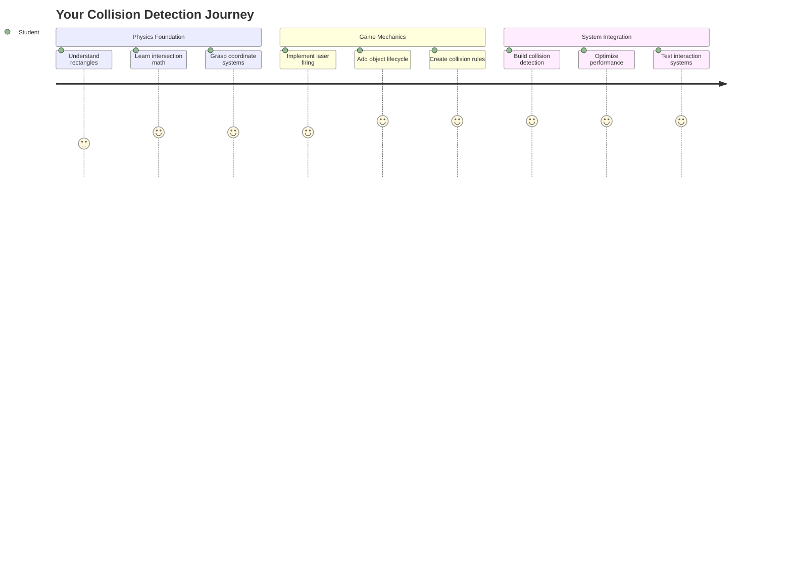
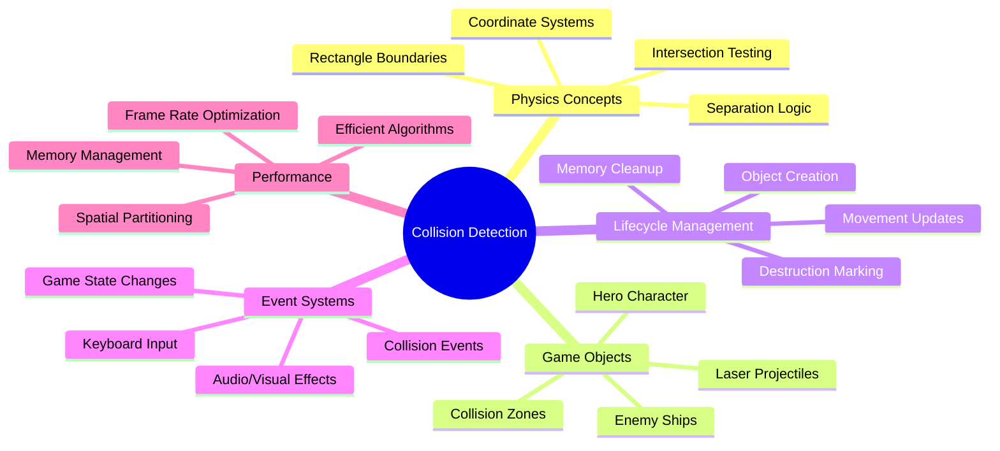
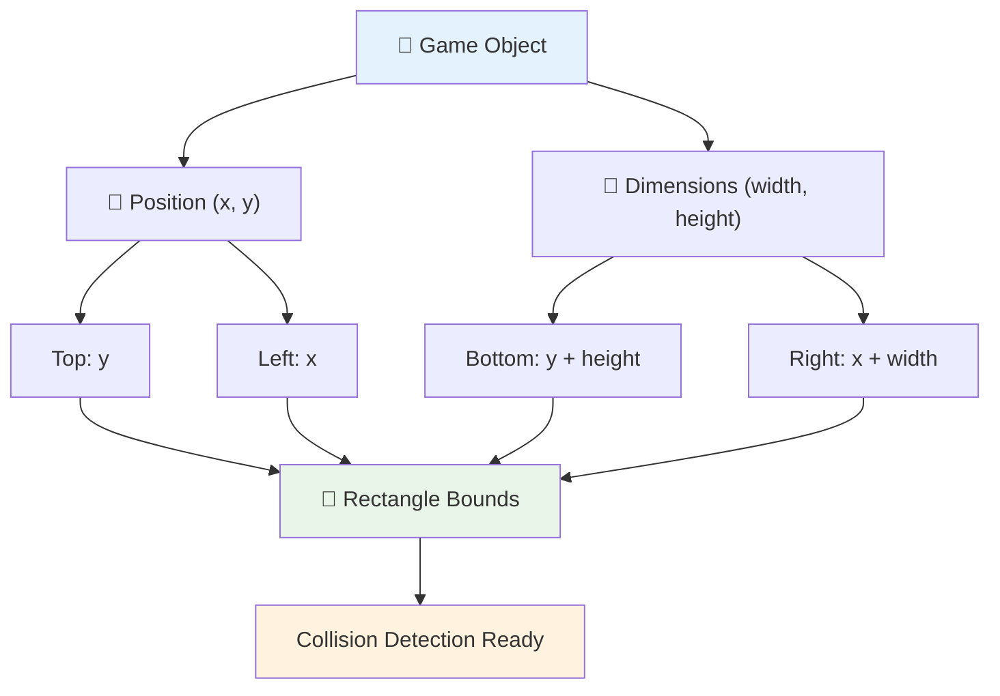
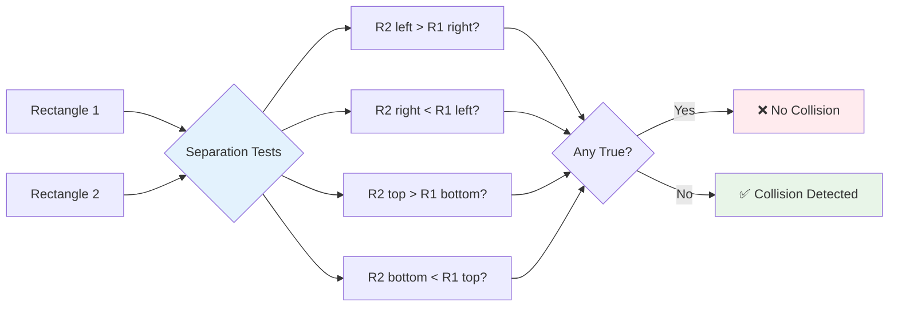
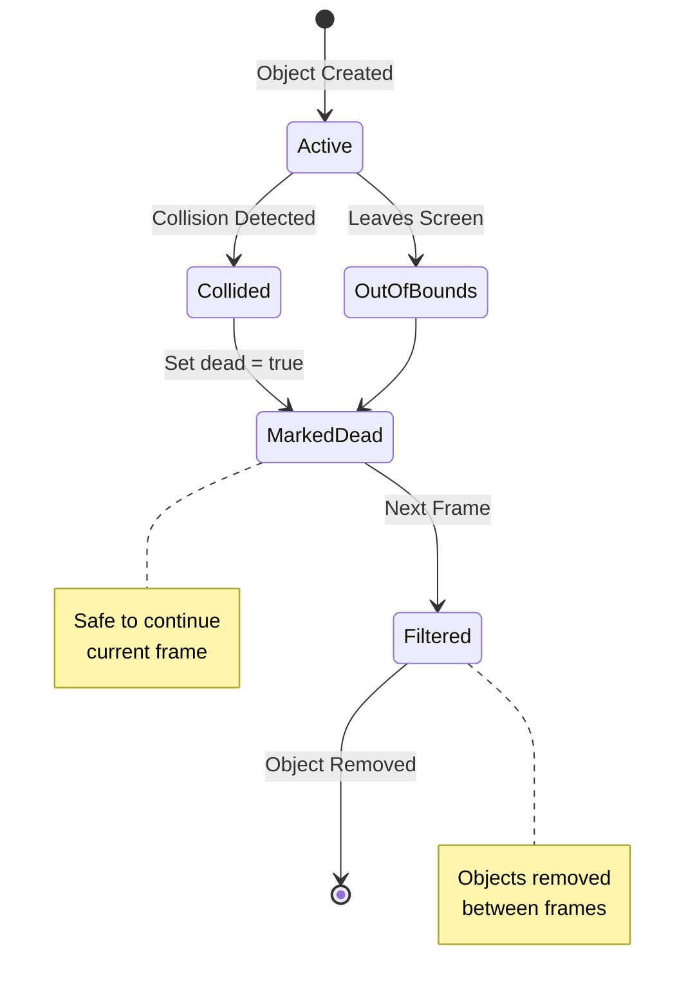
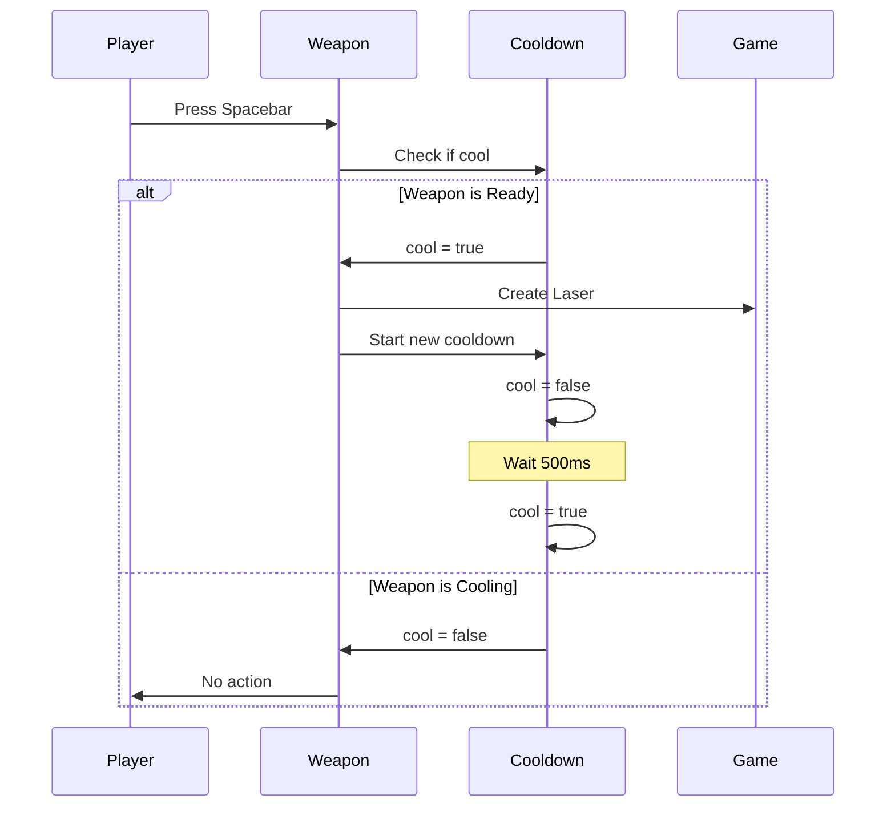
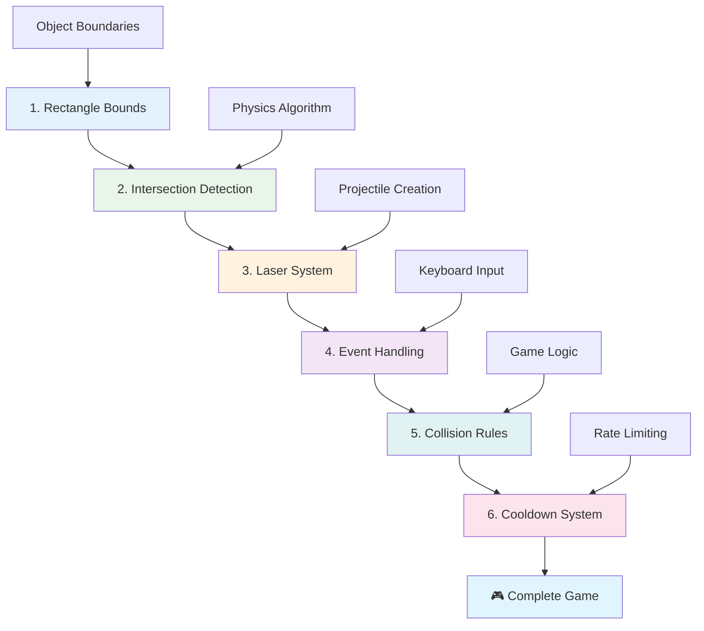
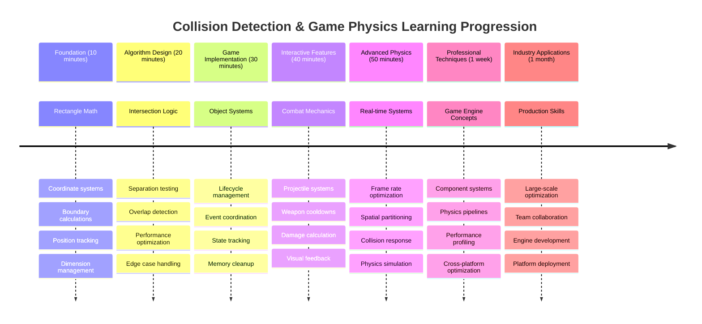

<!--
CO_OP_TRANSLATOR_METADATA:
{
  "original_hash": "039b4d8ce65f5edd82cf48d9c3e6728c",
  "translation_date": "2025-11-06T13:53:26+00:00",
  "source_file": "6-space-game/4-collision-detection/README.md",
  "language_code": "uk"
}
-->
# Створення космічної гри, частина 4: Додавання лазера та виявлення зіткнень



## Тест перед лекцією

[Тест перед лекцією](https://ff-quizzes.netlify.app/web/quiz/35)

Згадайте момент у "Зоряних війнах", коли протонні торпеди Люка влучили в вихлопний порт Зірки Смерті. Це точне виявлення зіткнення змінило долю галактики! У іграх виявлення зіткнень працює так само — воно визначає, коли об'єкти взаємодіють і що відбувається далі.

У цьому уроці ви додасте лазерну зброю до своєї космічної гри та реалізуєте систему виявлення зіткнень. Як і планувальники місій NASA, які розраховують траєкторії космічних апаратів, щоб уникнути уламків, ви навчитеся визначати, коли ігрові об'єкти перетинаються. Ми розділимо це на керовані кроки, які будуть будуватися один на одному.

Наприкінці у вас буде функціонуюча бойова система, де лазери знищують ворогів, а зіткнення запускають ігрові події. Ці ж принципи виявлення зіткнень використовуються у всьому — від фізичних симуляцій до інтерактивних веб-інтерфейсів.



✅ Проведіть невелике дослідження про першу комп'ютерну гру, яка була написана. Яка була її функціональність?

## Виявлення зіткнень

Виявлення зіткнень працює як датчики близькості на місячному модулі "Аполлон" — постійно перевіряє відстані та запускає попередження, коли об'єкти наближаються занадто близько. У іграх ця система визначає, коли об'єкти взаємодіють і що має відбутися далі.

Підхід, який ми будемо використовувати, розглядає кожен ігровий об'єкт як прямокутник, подібно до того, як системи управління повітряним рухом використовують спрощені геометричні форми для відстеження літаків. Цей метод прямокутників може здатися простим, але він обчислювально ефективний і добре працює для більшості ігрових сценаріїв.

### Представлення прямокутників

Кожен ігровий об'єкт потребує координатних меж, подібно до того, як марсохід Pathfinder визначав своє місцезнаходження на поверхні Марса. Ось як ми визначаємо ці координати меж:



```javascript
rectFromGameObject() {
  return {
    top: this.y,
    left: this.x,
    bottom: this.y + this.height,
    right: this.x + this.width
  }
}
```

**Розберемо це:**
- **Верхня межа**: Це просто місце, де ваш об'єкт починається вертикально (його позиція y)
- **Ліва межа**: Де він починається горизонтально (його позиція x)
- **Нижня межа**: Додайте висоту до позиції y — тепер ви знаєте, де він закінчується!
- **Права межа**: Додайте ширину до позиції x — і у вас є повна межа

### Алгоритм перетину

Виявлення перетину прямокутників використовує логіку, схожу на те, як космічний телескоп Хаббл визначає, чи перекриваються небесні об'єкти в його полі зору. Алгоритм перевіряє розділення:



```javascript
function intersectRect(r1, r2) {
  return !(r2.left > r1.right ||
    r2.right < r1.left ||
    r2.top > r1.bottom ||
    r2.bottom < r1.top);
}
```

**Тест розділення працює як радарні системи:**
- Чи знаходиться прямокутник 2 повністю праворуч від прямокутника 1?
- Чи знаходиться прямокутник 2 повністю ліворуч від прямокутника 1?
- Чи знаходиться прямокутник 2 повністю нижче прямокутника 1?
- Чи знаходиться прямокутник 2 повністю вище прямокутника 1?

Якщо жодна з цих умов не є істинною, прямокутники повинні перекриватися. Цей підхід нагадує, як оператори радарів визначають, чи знаходяться два літаки на безпечній відстані.

## Управління життєвим циклом об'єктів

Коли лазер влучає у ворога, обидва об'єкти потрібно видалити з гри. Однак видалення об'єктів під час циклу може спричинити аварії — урок, засвоєний на гіркому досвіді в ранніх комп'ютерних системах, таких як комп'ютер керування "Аполлон". Замість цього ми використовуємо підхід "позначити для видалення", який безпечно видаляє об'єкти між кадрами.



Ось як ми позначаємо щось для видалення:

```javascript
// Mark object for removal
enemy.dead = true;
```

**Чому цей підхід працює:**
- Ми позначаємо об'єкт як "мертвий", але не видаляємо його одразу
- Це дозволяє поточному кадру гри завершитися без проблем
- Немає аварій через спробу використати щось, що вже видалено!

Потім фільтруємо позначені об'єкти перед наступним циклом рендерингу:

```javascript
gameObjects = gameObjects.filter(go => !go.dead);
```

**Що робить це фільтрування:**
- Створює новий список лише з "живими" об'єктами
- Викидає все, що позначено як мертве
- Зберігає вашу гру стабільною
- Запобігає накопиченню знищених об'єктів у пам'яті

## Реалізація механіки лазера

Лазерні снаряди в іграх працюють за тим же принципом, що і фотонні торпеди у "Зоряному шляху" — це окремі об'єкти, які рухаються прямими лініями, поки не влучать у щось. Кожне натискання пробілу створює новий лазерний об'єкт, який рухається по екрану.

Щоб це працювало, нам потрібно координувати кілька різних частин:

**Основні компоненти для реалізації:**
- **Створення** лазерних об'єктів, які з'являються з позиції героя
- **Обробка** введення з клавіатури для запуску створення лазера
- **Управління** рухом і життєвим циклом лазера
- **Реалізація** візуального представлення лазерних снарядів

## Реалізація контролю швидкості стрільби

Необмежена швидкість стрільби перевантажила б ігровий двигун і зробила б гру занадто легкою. Реальні системи зброї стикаються з подібними обмеженнями — навіть фазери USS Enterprise потребували часу для перезарядки між пострілами.

Ми реалізуємо систему охолодження, яка запобігає швидкому спаму стрільби, зберігаючи при цьому чутливе управління:



```javascript
class Cooldown {
  constructor(time) {
    this.cool = false;
    setTimeout(() => {
      this.cool = true;
    }, time);
  }
}

class Weapon {
  constructor() {
    this.cooldown = null;
  }
  
  fire() {
    if (!this.cooldown || this.cooldown.cool) {
      // Create laser projectile
      this.cooldown = new Cooldown(500);
    } else {
      // Weapon is still cooling down
    }
  }
}
```

**Як працює охолодження:**
- При створенні зброя стає "гарячою" (поки не може стріляти)
- Після періоду очікування вона стає "холодною" (готовою до стрільби)
- Перед стрільбою ми перевіряємо: "Чи зброя холодна?"
- Це запобігає спаму кліків, зберігаючи чутливе управління

✅ Зверніться до уроку 1 у серії космічних ігор, щоб нагадати собі про систему охолодження.

## Створення системи виявлення зіткнень

Ви розширите свій існуючий код космічної гри, щоб створити систему виявлення зіткнень. Як автоматизована система уникнення зіткнень Міжнародної космічної станції, ваша гра буде постійно моніторити позиції об'єктів і реагувати на перетини.

Починаючи з коду попереднього уроку, ви додасте виявлення зіткнень із конкретними правилами, які регулюють взаємодію об'єктів.

> 💡 **Корисна порада**: Спрайт лазера вже включений у вашу папку з ресурсами та згадується у вашому коді, готовий до реалізації.

### Правила зіткнень для реалізації

**Ігрова механіка для додавання:**
1. **Лазер влучає у ворога**: Об'єкт ворога знищується, коли його вражає лазерний снаряд
2. **Лазер досягає межі екрану**: Лазер видаляється, коли досягає верхньої межі екрану
3. **Зіткнення ворога і героя**: Обидва об'єкти знищуються при перетині
4. **Ворог досягає низу**: Умова завершення гри, коли вороги досягають нижньої межі екрану

### 🔄 **Педагогічна перевірка**
**Основи виявлення зіткнень**: Перед реалізацією переконайтеся, що ви розумієте:
- ✅ Як межі прямокутників визначають зони зіткнень
- ✅ Чому тестування розділення є більш ефективним, ніж розрахунок перетину
- ✅ Важливість управління життєвим циклом об'єктів у ігрових циклах
- ✅ Як подієві системи координують реакції на зіткнення

**Швидкий самотест**: Що станеться, якщо ви видалите об'єкти одразу, а не позначите їх?
*Відповідь: Видалення під час циклу може спричинити аварії або пропустити об'єкти під час ітерації*

**Розуміння фізики**: Тепер ви розумієте:
- **Координатні системи**: Як позиція та розміри створюють межі
- **Логіка перетину**: Математичні принципи виявлення зіткнень
- **Оптимізація продуктивності**: Чому ефективні алгоритми важливі для систем реального часу
- **Управління пам'яттю**: Безпечні шаблони життєвого циклу об'єктів для стабільності

## Налаштування середовища розробки

Гарна новина — ми вже підготували більшу частину основ для вас! Усі ваші ігрові ресурси та базова структура чекають у підпапці `your-work`, готові для додавання крутих функцій зіткнень.

### Структура проекту

```bash
-| assets
  -| enemyShip.png
  -| player.png
  -| laserRed.png
-| index.html
-| app.js
-| package.json
```

**Розуміння структури файлів:**
- **Містить** усі зображення спрайтів, необхідні для ігрових об'єктів
- **Включає** основний HTML-документ і файл JavaScript додатка
- **Надає** конфігурацію пакета для локального сервера розробки

### Запуск сервера розробки

Перейдіть до папки вашого проекту та запустіть локальний сервер:

```bash
cd your-work
npm start
```

**Ця послідовність команд:**
- **Змінює** каталог на вашу робочу папку проекту
- **Запускає** локальний HTTP-сервер на `http://localhost:5000`
- **Обслуговує** ваші ігрові файли для тестування та розробки
- **Дозволяє** живу розробку з автоматичним перезавантаженням

Відкрийте браузер і перейдіть на `http://localhost:5000`, щоб побачити поточний стан вашої гри з відображенням героя та ворогів на екрані.

### Покрокова реалізація

Як систематичний підхід NASA до програмування космічного апарату Voyager, ми будемо реалізовувати виявлення зіткнень методично, створюючи кожен компонент крок за кроком.



#### 1. Додайте межі прямокутників для зіткнень

Спочатку навчимо наші ігрові об'єкти описувати свої межі. Додайте цей метод до класу `GameObject`:

```javascript
rectFromGameObject() {
    return {
      top: this.y,
      left: this.x,
      bottom: this.y + this.height,
      right: this.x + this.width,
    };
  }
```

**Цей метод виконує:**
- **Створює** об'єкт прямокутника з точними координатами меж
- **Розраховує** нижню та праву межі, використовуючи позицію плюс розміри
- **Повертає** об'єкт, готовий для алгоритмів виявлення зіткнень
- **Забезпечує** стандартизований інтерфейс для всіх ігрових об'єктів

#### 2. Реалізуйте виявлення перетину

Тепер створимо нашого детектива зіткнень — функцію, яка може визначити, коли два прямокутники перекриваються:

```javascript
function intersectRect(r1, r2) {
  return !(
    r2.left > r1.right ||
    r2.right < r1.left ||
    r2.top > r1.bottom ||
    r2.bottom < r1.top
  );
}
```

**Цей алгоритм працює, перевіряючи:**
- **Тестує** чотири умови розділення між прямокутниками
- **Повертає** `false`, якщо будь-яка умова розділення є істинною
- **Вказує** на зіткнення, коли розділення не існує
- **Використовує** логіку заперечення для ефективного тестування перетину

#### 3. Реалізуйте систему стрільби лазером

Ось де стає цікаво! Налаштуємо систему стрільби лазером.

##### Константи повідомлень

Спочатку визначимо типи повідомлень, щоб різні частини нашої гри могли спілкуватися одна з одною:

```javascript
KEY_EVENT_SPACE: "KEY_EVENT_SPACE",
COLLISION_ENEMY_LASER: "COLLISION_ENEMY_LASER",
COLLISION_ENEMY_HERO: "COLLISION_ENEMY_HERO",
```

**Ці константи забезпечують:**
- **Стандартизацію** назв подій у всьому додатку
- **Дозволяють** узгоджене спілкування між системами гри
- **Запобігають** помилкам у реєстрації обробників подій

##### Обробка введення з клавіатури

Додайте виявлення натискання клавіші пробілу до вашого слухача подій клавіатури:

```javascript
} else if(evt.keyCode === 32) {
  eventEmitter.emit(Messages.KEY_EVENT_SPACE);
}
```

**Цей обробник введення:**
- **Виявляє** натискання клавіші пробілу за допомогою keyCode 32
- **Відправляє** стандартизоване повідомлення про подію
- **Дозволяє** розділену логіку стрільби

##### Налаштування слухача подій

Зареєструйте поведінку стрільби у функції `initGame()`:

```javascript
eventEmitter.on(Messages.KEY_EVENT_SPACE, () => {
 if (hero.canFire()) {
   hero.fire();
 }
});
```

**Цей слухач подій:**
- **Реагує** на події натискання клавіші пробілу
- **Перевіряє** статус охолодження стрільби
- **Запускає** створення лазера, коли це дозволено

Додайте обробку зіткнень для взаємодії лазера з ворогами:

```javascript
eventEmitter.on(Messages.COLLISION_ENEMY_LASER, (_, { first, second }) => {
  first.dead = true;
  second.dead = true;
});
```

**Цей обробник зіткнень:**
- **Отримує** дані про події зіткнення з обома об'єктами
- **Позначає** обидва об'єкти для видалення
- **Забезпечує** належне очищення після зіткнення

#### 4. Створіть клас Laser

Реалізуйте лазерний снаряд, який рухається вгору і управляє своїм життєвим циклом:

```javascript
class Laser extends GameObject {
  constructor(x, y) {
    super(x, y);
    this.width = 9;
    this.height = 33;
    this.type = 'Laser';
    this.img = laserImg;
    
    let id = setInterval(() => {
      if (this.y > 0) {
        this.y -= 15;
      } else {
        this.dead = true;
        clearInterval(id);
      }
    }, 100);
  }
}
```

**Ця реалізація класу:**
- **Розширює** GameObject, щоб успадкувати базову функціональність
- **Встановлює** відповідні розміри для спрайту лазера
- **Створює** автоматичний рух вгору за допомогою `setInterval()`
- **Обробляє** самознищення при досягненні верхньої межі екрану
- **Управляє** власним часом анімації та очищенням

#### 5. Реалізуйте систему виявлення зіткнень

Створіть комплексну функцію виявлення зіткнень:

```javascript
function updateGameObjects() {
  const enemies = gameObjects.filter(go => go.type === 'Enemy');
  const lasers = gameObjects.filter(go => go.type === "Laser");
  
  // Test laser-enemy collisions
  lasers.forEach((laser) => {
    enemies.forEach((enemy) => {
      if (intersectRect(laser.rectFromGameObject(), enemy.rectFromGameObject())) {
        eventEmitter.emit(Messages.COLLISION_ENEMY_LASER, {
          first: laser,
          second: enemy,
        });
      }
    });
  });

  // Remove destroyed objects
  gameObjects = gameObjects.filter(go => !go.dead);
}
```

**Ця система зіткнень:**
- **Фільтрує** ігрові об'єкти за типом для ефективного тестування
- **Тестує** кожен лазер проти кожного ворога на перетини
- **Відправляє** події зіткнення, коли перетини виявлені
- **Очищає** знищені об'єкти після обробки зіткнень

> ⚠️ **Важливо**: Додайте `updateGameObjects()` до основного циклу гри у `window.onload`, щоб увімкнути виявлення зіткнень
- [ ] Додайте `console.log` для відстеження подій зіткнення в реальному часі

### 🎯 **Що Ви Можете Зробити За Цю Годину**
- [ ] Завершити тест після уроку та зрозуміти алгоритми виявлення зіткнень
- [ ] Додати візуальні ефекти, такі як вибухи, коли відбуваються зіткнення
- [ ] Реалізувати різні типи снарядів із різними властивостями
- [ ] Створити бонуси, які тимчасово покращують здібності гравця
- [ ] Додати звукові ефекти, щоб зробити зіткнення більш захоплюючими

### 📅 **Ваш Тижневий План Програмування Фізики**
- [ ] Завершити повну космічну гру з вдосконаленою системою зіткнень
- [ ] Реалізувати складні форми зіткнень, окрім прямокутників (кола, багатокутники)
- [ ] Додати системи частинок для реалістичних ефектів вибухів
- [ ] Створити складну поведінку ворогів із уникненням зіткнень
- [ ] Оптимізувати виявлення зіткнень для кращої продуктивності з великою кількістю об'єктів
- [ ] Додати симуляцію фізики, як-от імпульс і реалістичний рух

### 🌟 **Ваш Місячний План Майстерності Фізики Ігор**
- [ ] Створювати ігри з використанням передових фізичних рушіїв і реалістичних симуляцій
- [ ] Вивчити 3D-виявлення зіткнень і алгоритми просторового розподілу
- [ ] Внести вклад у відкриті бібліотеки фізики та ігрові рушії
- [ ] Оптимізувати продуктивність для графічно інтенсивних додатків
- [ ] Створити навчальний контент про фізику ігор і виявлення зіткнень
- [ ] Побудувати портфоліо, що демонструє навички програмування фізики на високому рівні

## 🎯 Ваш Таймлайн Майстерності Виявлення Зіткнень



### 🛠️ Підсумок Вашого Інструментарію Фізики Ігор

Після завершення цього уроку ви опанували:
- **Математика Зіткнень**: Алгоритми перетину прямокутників і системи координат
- **Оптимізація Продуктивності**: Ефективне виявлення зіткнень для реальних додатків
- **Управління Життєвим Циклом Об'єктів**: Безпечні шаблони створення, оновлення та знищення
- **Архітектура, Заснована на Подіях**: Розділені системи для реакції на зіткнення
- **Інтеграція в Ігровий Цикл**: Оновлення фізики на основі кадрів і координація рендерингу
- **Системи Вводу**: Чутливе управління з обмеженням швидкості та зворотним зв'язком
- **Управління Пам'яттю**: Ефективне використання пулів об'єктів і стратегії очищення

**Застосування в Реальному Житті**: Ваші навички виявлення зіткнень безпосередньо застосовуються до:
- **Інтерактивних Симуляцій**: Наукове моделювання та навчальні інструменти
- **Дизайн Інтерфейсу Користувача**: Перетягування елементів і виявлення дотиків
- **Візуалізація Даних**: Інтерактивні графіки та клікабельні елементи
- **Розробка Мобільних Додатків**: Розпізнавання жестів і обробка зіткнень
- **Програмування Роботів**: Планування маршруту та уникнення перешкод
- **Комп'ютерна Графіка**: Трасування променів і просторові алгоритми

**Професійні Навички, Які Ви Отримали**: Тепер ви можете:
- **Проектувати** ефективні алгоритми для виявлення зіткнень у реальному часі
- **Реалізовувати** фізичні системи, які масштабуються зі складністю об'єктів
- **Відлагоджувати** складні системи взаємодії, використовуючи математичні принципи
- **Оптимізувати** продуктивність для різного обладнання та можливостей браузера
- **Архітектурувати** підтримувані ігрові системи, використовуючи перевірені шаблони проектування

**Концепції Розробки Ігор, Які Ви Опанували**:
- **Симуляція Фізики**: Виявлення зіткнень у реальному часі та реакція на них
- **Інженерія Продуктивності**: Оптимізовані алгоритми для інтерактивних додатків
- **Системи Подій**: Розділена комунікація між компонентами гри
- **Управління Об'єктами**: Ефективні шаблони життєвого циклу для динамічного контенту
- **Обробка Вводу**: Чутливе управління з відповідним зворотним зв'язком

**Наступний Рівень**: Ви готові досліджувати передові фізичні рушії, такі як Matter.js, реалізовувати 3D-виявлення зіткнень або створювати складні системи частинок!

🌟 **Досягнення Розблоковано**: Ви створили повну систему взаємодії на основі фізики з професійним рівнем виявлення зіткнень!

## Виклик GitHub Copilot Agent 🚀

Використовуйте режим Agent, щоб виконати наступний виклик:

**Опис:** Покращіть систему виявлення зіткнень, реалізувавши бонуси, які з'являються випадково та надають тимчасові здібності при зборі героєм.

**Підказка:** Створіть клас PowerUp, який розширює GameObject, і реалізуйте виявлення зіткнень між героєм і бонусами. Додайте щонайменше два типи бонусів: один збільшує швидкість стрільби (зменшує час очікування), а інший створює тимчасовий щит. Включіть логіку появи, яка створює бонуси з випадковими інтервалами та позиціями.

---

## 🚀 Виклик

Додайте вибух! Перегляньте ігрові ресурси в [репозиторії Space Art](../../../../6-space-game/solution/spaceArt/readme.txt) і спробуйте додати вибух, коли лазер влучає в прибульця.

## Тест Після Лекції

[Тест після лекції](https://ff-quizzes.netlify.app/web/quiz/36)

## Огляд і Самостійне Вивчення

Експериментуйте з інтервалами у вашій грі на даний момент. Що відбувається, коли ви їх змінюєте? Читайте більше про [події таймінгу в JavaScript](https://www.freecodecamp.org/news/javascript-timing-events-settimeout-and-setinterval/).

## Завдання

[Досліджуйте зіткнення](assignment.md)

---

**Відмова від відповідальності**:  
Цей документ був перекладений за допомогою сервісу автоматичного перекладу [Co-op Translator](https://github.com/Azure/co-op-translator). Хоча ми прагнемо до точності, будь ласка, майте на увазі, що автоматичні переклади можуть містити помилки або неточності. Оригінальний документ на його рідній мові слід вважати авторитетним джерелом. Для критичної інформації рекомендується професійний людський переклад. Ми не несемо відповідальності за будь-які непорозуміння або неправильні тлумачення, що виникають внаслідок використання цього перекладу.