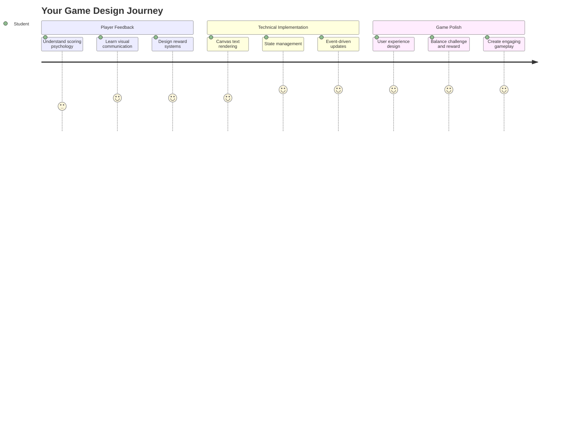
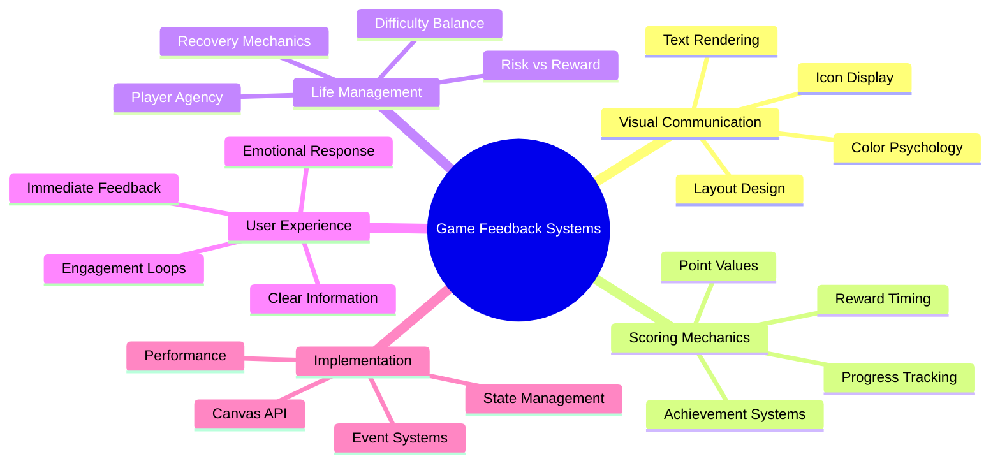
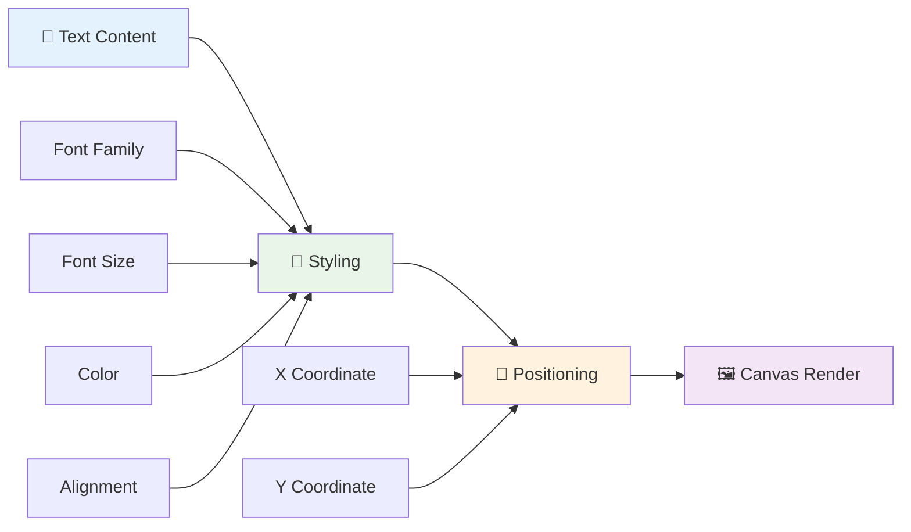
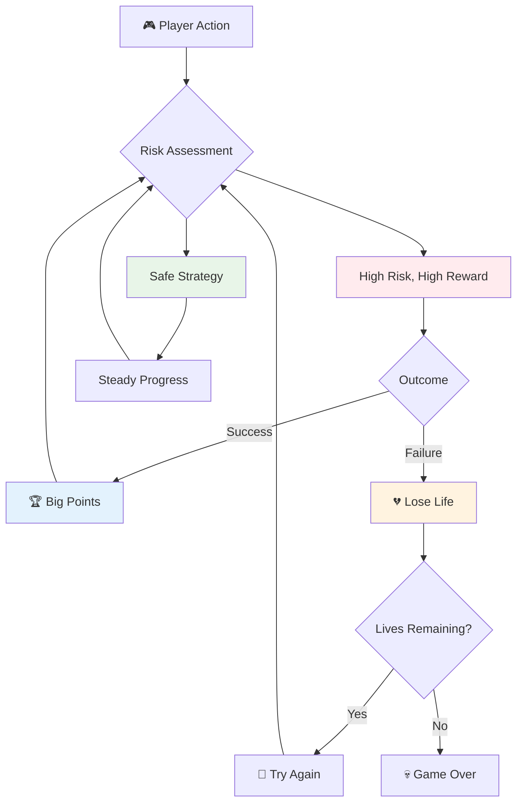
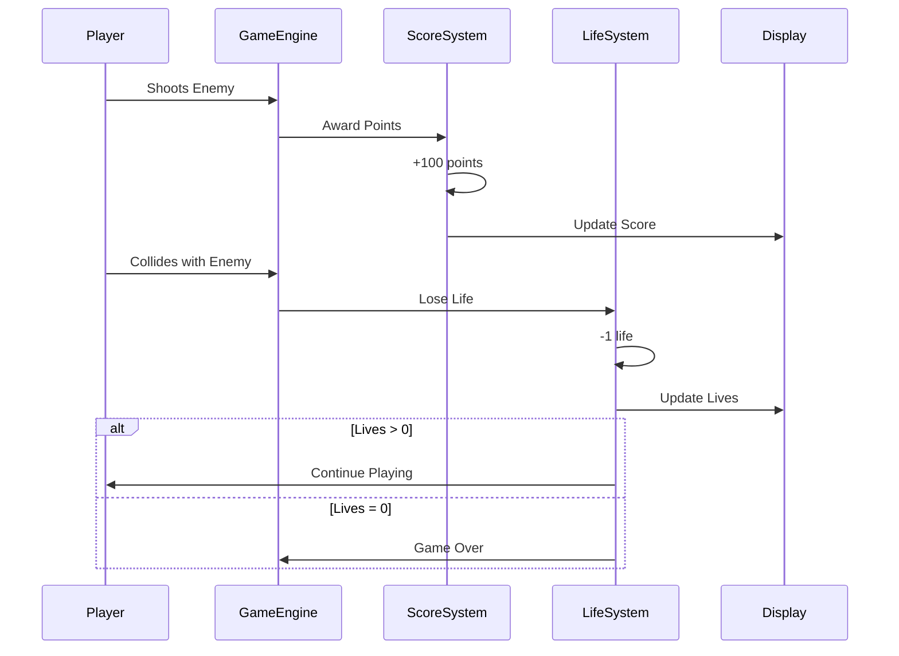
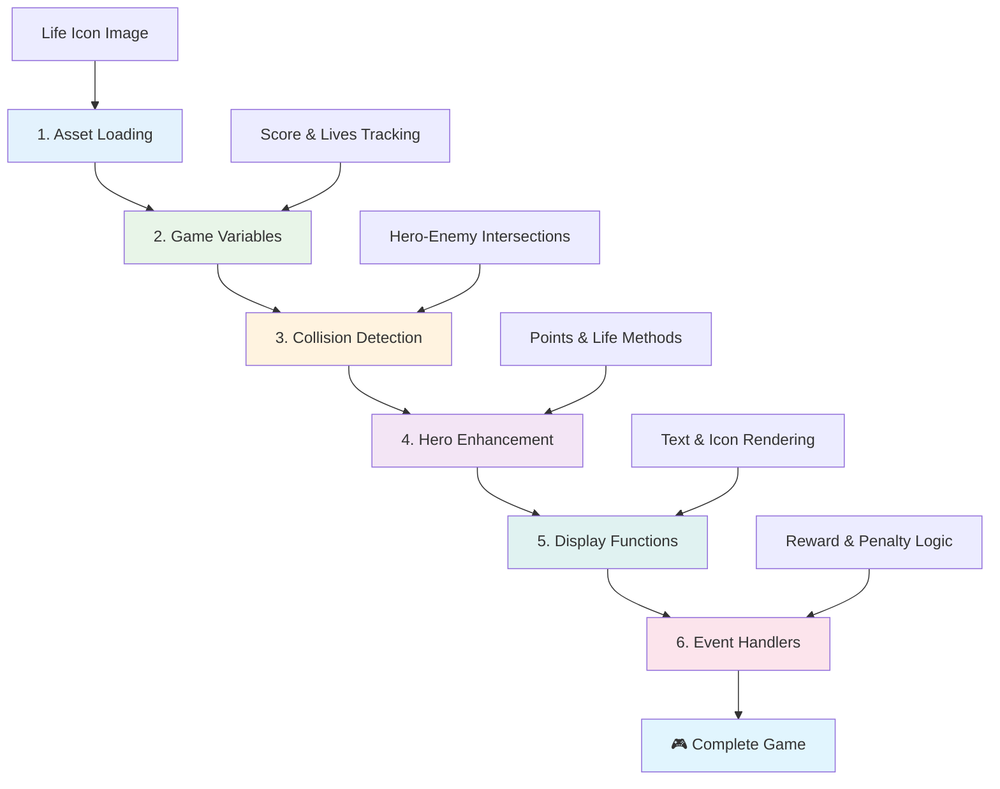
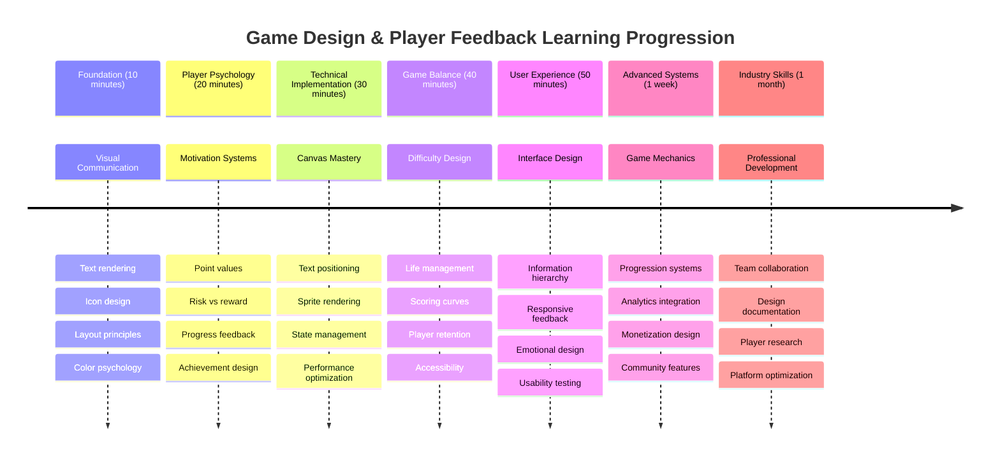

<!--
CO_OP_TRANSLATOR_METADATA:
{
  "original_hash": "2ed9145a16cf576faa2a973dff84d099",
  "translation_date": "2025-11-06T13:55:46+00:00",
  "source_file": "6-space-game/5-keeping-score/README.md",
  "language_code": "uk"
}
-->
# Створення космічної гри, частина 5: Очки та життя



## Тест перед лекцією

[Тест перед лекцією](https://ff-quizzes.netlify.app/web/quiz/37)

Готові зробити вашу космічну гру справжньою грою? Давайте додамо систему очок і управління життями — основні механіки, які перетворили ранні аркадні ігри, такі як Space Invaders, із простих демонстрацій у захоплююче розваги. Саме тут ваша гра стає дійсно цікавою.



## Відображення тексту на екрані — голос вашої гри

Щоб показати ваші очки, нам потрібно навчитися відображати текст на полотні. Метод `fillText()` — ваш основний інструмент для цього. Це той самий метод, який використовували в класичних аркадних іграх для показу очок і статусу.



Ви маєте повний контроль над виглядом тексту:

```javascript
ctx.font = "30px Arial";
ctx.fillStyle = "red";
ctx.textAlign = "right";
ctx.fillText("show this on the screen", 0, 0);
```

✅ Дізнайтеся більше про [додавання тексту на полотно](https://developer.mozilla.org/docs/Web/API/Canvas_API/Tutorial/Drawing_text) — можливо, ви здивуєтеся, наскільки творчо можна підійти до шрифтів і стилів!

## Життя — більше, ніж просто число

У дизайні ігор "життя" представляє запас помилок гравця. Ця концепція бере початок із пінболу, де ви отримували кілька куль для гри. У ранніх відеоіграх, таких як Asteroids, життя давали гравцям можливість ризикувати і вчитися на помилках.



Візуальне представлення має велике значення — показ кораблів замість просто "Життя: 3" створює миттєве візуальне сприйняття, подібно до того, як ранні аркадні автомати використовували іконографію для спілкування поза мовними бар'єрами.

## Створення системи винагород вашої гри

Тепер ми реалізуємо основні системи зворотного зв’язку, які утримують гравців:



- **Система очок**: Кожен знищений ворожий корабель приносить 100 очок (круглі числа легше підраховувати подумки). Очки відображаються в нижньому лівому куті.
- **Лічильник життя**: Ваш герой починає з трьох життів — стандарт, встановлений ранніми аркадними іграми для балансу між викликом і зручністю гри. Кожне зіткнення з ворогом коштує одного життя. Ми відобразимо залишок життів у нижньому правому куті за допомогою ікон кораблів .

## Починаємо будувати!

Спочатку налаштуйте робоче середовище. Перейдіть до файлів у папці `your-work`. Ви повинні побачити ці файли:

```bash
-| assets
  -| enemyShip.png
  -| player.png
  -| laserRed.png
-| index.html
-| app.js
-| package.json
```

Щоб протестувати вашу гру, запустіть сервер розробки з папки `your_work`:

```bash
cd your-work
npm start
```

Це запустить локальний сервер за адресою `http://localhost:5000`. Відкрийте цю адресу у вашому браузері, щоб побачити вашу гру. Перевірте управління за допомогою стрілок і спробуйте стріляти у ворогів, щоб переконатися, що все працює.



### Час кодувати!

1. **Отримайте необхідні візуальні ресурси**. Скопіюйте ресурс `life.png` із папки `solution/assets/` у вашу папку `your-work`. Потім додайте lifeImg до функції window.onload:

    ```javascript
    lifeImg = await loadTexture("assets/life.png");
    ```

1. Не забудьте додати `lifeImg` до списку ваших ресурсів:

    ```javascript
    let heroImg,
    ...
    lifeImg,
    ...
    eventEmitter = new EventEmitter();
    ```
  
2. **Налаштуйте змінні гри**. Додайте код для відстеження загальної кількості очок (починаючи з 0) і залишку життів (починаючи з 3). Ми відобразимо ці дані на екрані, щоб гравці завжди знали, де вони знаходяться.

3. **Реалізуйте виявлення зіткнень**. Розширте функцію `updateGameObjects()`, щоб виявляти, коли вороги стикаються з вашим героєм:

    ```javascript
    enemies.forEach(enemy => {
        const heroRect = hero.rectFromGameObject();
        if (intersectRect(heroRect, enemy.rectFromGameObject())) {
          eventEmitter.emit(Messages.COLLISION_ENEMY_HERO, { enemy });
        }
      })
    ```

4. **Додайте відстеження життів і очок до вашого героя**. 
   1. **Ініціалізуйте лічильники**. Під `this.cooldown = 0` у класі `Hero` налаштуйте життя та очки:

        ```javascript
        this.life = 3;
        this.points = 0;
        ```

   1. **Покажіть ці значення гравцю**. Створіть функції для відображення цих значень на екрані:

        ```javascript
        function drawLife() {
          // TODO, 35, 27
          const START_POS = canvas.width - 180;
          for(let i=0; i < hero.life; i++ ) {
            ctx.drawImage(
              lifeImg, 
              START_POS + (45 * (i+1) ), 
              canvas.height - 37);
          }
        }
        
        function drawPoints() {
          ctx.font = "30px Arial";
          ctx.fillStyle = "red";
          ctx.textAlign = "left";
          drawText("Points: " + hero.points, 10, canvas.height-20);
        }
        
        function drawText(message, x, y) {
          ctx.fillText(message, x, y);
        }

        ```

   1. **Підключіть усе до циклу гри**. Додайте ці функції до вашої функції window.onload одразу після `updateGameObjects()`:

        ```javascript
        drawPoints();
        drawLife();
        ```

### 🔄 **Педагогічна перевірка**
**Розуміння дизайну гри**: Перед реалізацією наслідків переконайтеся, що ви розумієте:
- ✅ Як візуальний зворотний зв’язок передає стан гри гравцям
- ✅ Чому послідовне розташування елементів інтерфейсу покращує зручність використання
- ✅ Психологію значень очок і управління життями
- ✅ Як рендеринг тексту на полотні відрізняється від HTML-тексту

**Швидкий самотест**: Чому аркадні ігри зазвичай використовують круглі числа для значень очок?
*Відповідь: Круглі числа легше підраховувати подумки і створюють задовільні психологічні винагороди*

**Принципи користувацького досвіду**: Ви зараз застосовуєте:
- **Візуальна ієрархія**: Важлива інформація розташована помітно
- **Миттєвий зворотний зв’язок**: Оновлення в реальному часі відповідно до дій гравця
- **Когнітивне навантаження**: Просте і чітке представлення інформації
- **Емоційний дизайн**: Іконки та кольори, які створюють зв’язок із гравцем

1. **Реалізуйте наслідки та винагороди гри**. Тепер ми додамо системи зворотного зв’язку, які роблять дії гравця значущими:

   1. **Зіткнення коштують життя**. Кожного разу, коли ваш герой стикається з ворогом, ви повинні втратити життя.
   
      Додайте цей метод до класу `Hero`:

        ```javascript
        decrementLife() {
          this.life--;
          if (this.life === 0) {
            this.dead = true;
          }
        }
        ```

   2. **Стрілянина у ворогів приносить очки**. Кожне успішне попадання приносить 100 очок, забезпечуючи миттєвий позитивний зворотний зв’язок за точну стрільбу.

      Розширте клас Hero цим методом збільшення:

        ```javascript
          incrementPoints() {
            this.points += 100;
          }
        ```

        Тепер підключіть ці функції до подій зіткнення:

        ```javascript
        eventEmitter.on(Messages.COLLISION_ENEMY_LASER, (_, { first, second }) => {
           first.dead = true;
           second.dead = true;
           hero.incrementPoints();
        })

        eventEmitter.on(Messages.COLLISION_ENEMY_HERO, (_, { enemy }) => {
           enemy.dead = true;
           hero.decrementLife();
        });
        ```

✅ Цікаво, які ще ігри створені за допомогою JavaScript і Canvas? Досліджуйте — ви можете здивуватися, що можливо!

Після реалізації цих функцій протестуйте вашу гру, щоб побачити повну систему зворотного зв’язку в дії. Ви повинні побачити іконки життя в нижньому правому куті, ваші очки в нижньому лівому куті, і спостерігати, як зіткнення зменшують кількість життів, а успішні постріли збільшують ваші очки.

Тепер ваша гра має основні механіки, які зробили ранні аркадні ігри такими захоплюючими — чіткі цілі, миттєвий зворотний зв’язок і значущі наслідки для дій гравця.

### 🔄 **Педагогічна перевірка**
**Повна система дизайну гри**: Переконайтеся, що ви освоїли системи зворотного зв’язку для гравців:
- ✅ Як механіка очок створює мотивацію та залучення гравців?
- ✅ Чому візуальна послідовність важлива для дизайну інтерфейсу користувача?
- ✅ Як система життів балансує виклик із утриманням гравця?
- ✅ Яку роль відіграє миттєвий зворотний зв’язок у створенні задовільного ігрового процесу?

**Інтеграція системи**: Ваша система зворотного зв’язку демонструє:
- **Дизайн користувацького досвіду**: Чітке візуальне спілкування та ієрархія інформації
- **Архітектура, орієнтована на події**: Оновлення у відповідь на дії гравця
- **Управління станом**: Ефективне відстеження та відображення динамічних даних гри
- **Майстерність роботи з полотном**: Рендеринг тексту та позиціонування спрайтів
- **Психологія гри**: Розуміння мотивації та залучення гравців

**Професійні шаблони**: Ви реалізували:
- **Архітектура MVC**: Розділення логіки гри, даних і представлення
- **Шаблон спостерігача**: Оновлення стану гри, орієнтоване на події
- **Дизайн компонентів**: Повторно використовувані функції для рендерингу та логіки
- **Оптимізація продуктивності**: Ефективний рендеринг у циклах гри

### ⚡ **Що ви можете зробити за наступні 5 хвилин**
- [ ] Експериментуйте з різними розмірами шрифтів і кольорами для відображення очок
- [ ] Спробуйте змінити значення очок і подивіться, як це впливає на відчуття гри
- [ ] Додайте console.log для відстеження змін очок і життів
- [ ] Перевірте крайні випадки, такі як закінчення життів або досягнення високих очок

### 🎯 **Що ви можете досягти за цю годину**
- [ ] Завершіть тест після уроку та зрозумійте психологію дизайну гри
- [ ] Додайте звукові ефекти для отримання очок і втрати життів
- [ ] Реалізуйте систему високих очок за допомогою localStorage
- [ ] Створіть різні значення очок для різних типів ворогів
- [ ] Додайте візуальні ефекти, такі як тряска екрану при втраті життя

### 📅 **Ваш тижневий шлях до дизайну гри**
- [ ] Завершіть повну космічну гру з відшліфованими системами зворотного зв’язку
- [ ] Реалізуйте розширену механіку очок, як множники комбо
- [ ] Додайте досягнення та контент, що розблоковується
- [ ] Створіть системи прогресії складності та балансування
- [ ] Розробіть інтерфейси користувача для меню та екранів завершення гри
- [ ] Вивчайте інші ігри, щоб зрозуміти механізми залучення

### 🌟 **Ваш місячний шлях до майстерності розробки ігор**
- [ ] Створюйте повні ігри зі складними системами прогресії
- [ ] Вивчайте аналітику ігор та вимірювання поведінки гравців
- [ ] Вносьте вклад у проекти з відкритим кодом у розробці ігор
- [ ] Освойте розширені шаблони дизайну ігор та монетизацію
- [ ] Створюйте освітній контент про дизайн ігор та користувацький досвід
- [ ] Створіть портфоліо, що демонструє навички дизайну та розробки ігор

## 🎯 Ваш графік майстерності дизайну гри



### 🛠️ Резюме вашого інструментарію дизайну гри

Після завершення цього уроку ви освоїли:
- **Психологія гравця**: Розуміння мотивації, ризику/винагороди та циклів залучення
- **Візуальне спілкування**: Ефективний дизайн інтерфейсу користувача за допомогою тексту, іконок та макету
- **Системи зворотного зв’язку**: Реакція в реальному часі на дії гравця та події гри
- **Управління станом**: Ефективне відстеження та відображення динамічних даних гри
- **Рендеринг тексту на полотні**: Професійне відображення тексту зі стилізацією та позиціонуванням
- **Інтеграція подій**: Зв’язок дій користувача зі значущими наслідками гри
- **Баланс гри**: Дизайн кривих складності та систем прогресії гравця

**Застосування в реальному світі**: Ваші навички дизайну гри безпосередньо застосовуються до:
- **Дизайн інтерфейсу користувача**: Створення захоплюючих та інтуїтивних інтерфейсів
- **Розробка продуктів**: Розуміння мотивації користувачів та циклів зворотного зв’язку
- **Освітні технології**: Гейміфікація та системи залучення до навчання
- **Візуалізація даних**: Зроблення складної інформації доступною та захоплюючою
- **Розробка мобільних додатків**: Механізми утримання та дизайн користувацького досвіду
- **Маркетингові технології**: Розуміння поведінки користувачів та оптимізація конверсії

**Отримані професійні навички**: Тепер ви можете:
- **Проектувати** користувацький досвід, що мотивує та залучає користувачів
- **Реалізовувати** системи зворотного зв’язку, що ефективно спрямовують поведінку користувачів
- **Балансувати** виклик та доступність в інтерактивних системах
- **Створювати** візуальне спілкування, що працює для різних груп користувачів
- **Аналізувати** поведінку користувачів та вдосконалювати дизайн

**Освоєні концепції розробки ігор**:
- **Мотивація гравця**: Розуміння того, що стимулює залучення та утримання
- **Візуальний дизайн**: Створення чітких, привабливих та функціональних інтерфейсів
- **Інтеграція систем**: Зв’язок кількох систем гри для цілісного досвіду
- **Оптимізація продуктивності**: Ефективний рендеринг та управління станом
- **Доступність**: Дизайн для різних рівнів навичок та потреб гравців

**Наступний рівень**: Ви готові досліджувати розширені шаблони дизайну ігор, реалізовувати аналітичні системи або вивчати монетизацію і утримання гравців!

🌟 **Досягнення розблоковано**: Ви створили повну систему зворотного зв’язку для гравців із професійними принципами дизайну гри!

---

## Виклик GitHub Copilot Agent 🚀

Використовуйте режим Agent, щоб виконати наступний виклик:

**Опис:** Покращіть систему очок космічної гри, реалізувавши функцію високих очок із постійним збереженням та механікою бонусних очок.

**Запит:** Створіть систему високих очок, яка зберігає найкращий результат гравця у localStorage. Додайте бонусні очки за послідовні знищення ворогів (система комбо) та реалізуйте різні значення очок для різних типів ворогів. Додайте візуальний індикатор, коли гравець досягає нового високого результату, і відображайте поточний високий результат на екрані гри.


## 🚀 Виклик

Тепер у вас є функціональна гра з оч

---

**Відмова від відповідальності**:  
Цей документ був перекладений за допомогою сервісу автоматичного перекладу [Co-op Translator](https://github.com/Azure/co-op-translator). Хоча ми прагнемо до точності, будь ласка, майте на увазі, що автоматичні переклади можуть містити помилки або неточності. Оригінальний документ на його рідній мові слід вважати авторитетним джерелом. Для критичної інформації рекомендується професійний людський переклад. Ми не несемо відповідальності за будь-які непорозуміння або неправильні тлумачення, що виникають внаслідок використання цього перекладу.