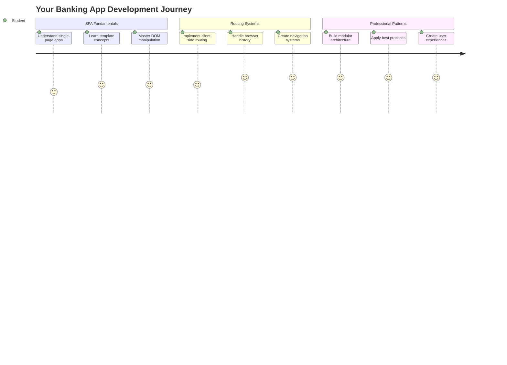
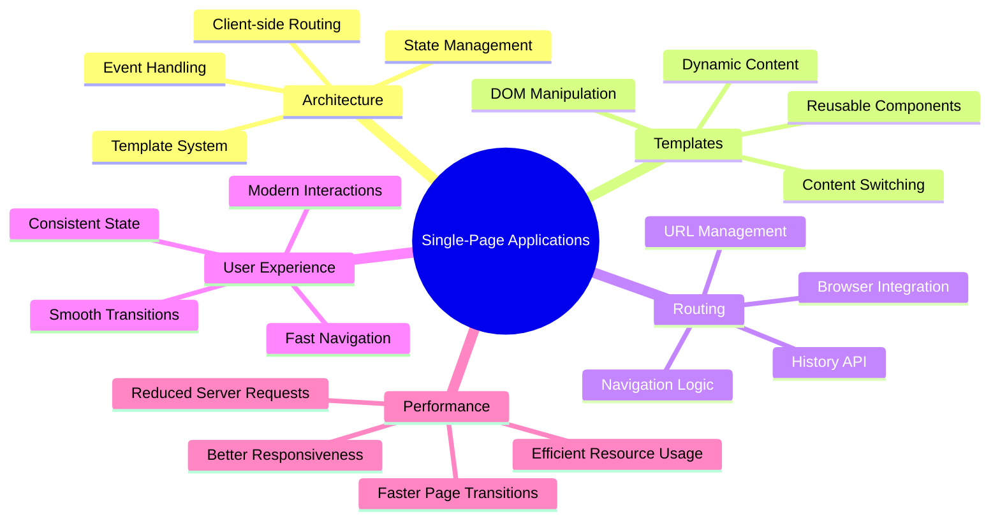
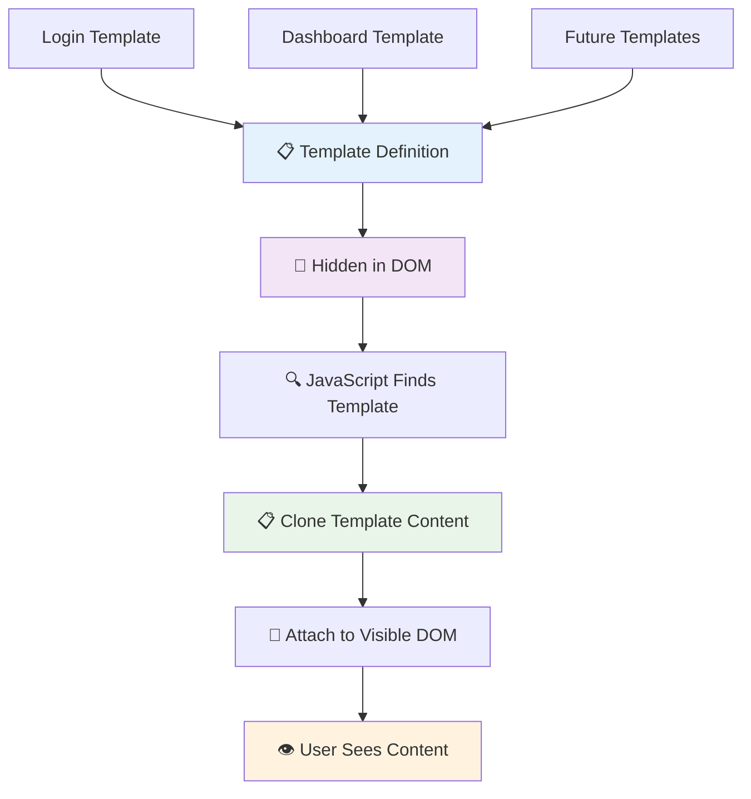
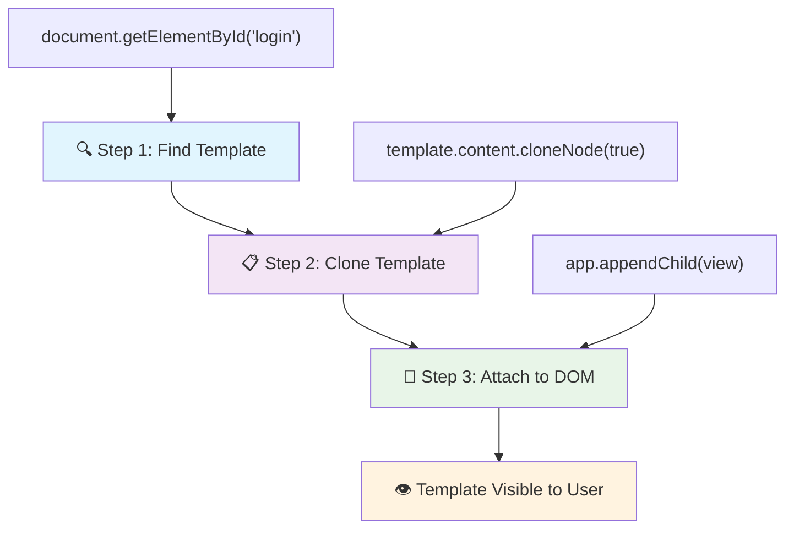
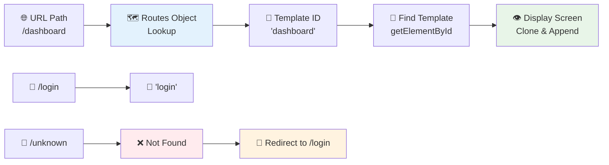
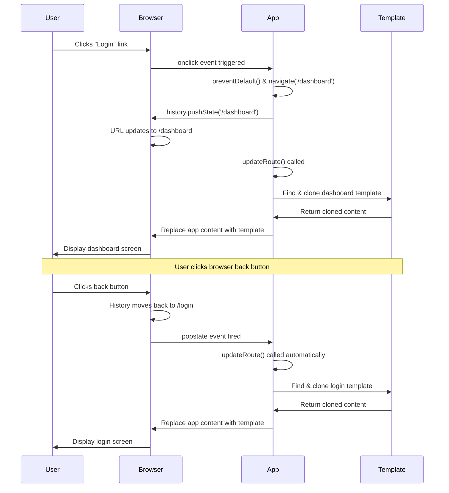
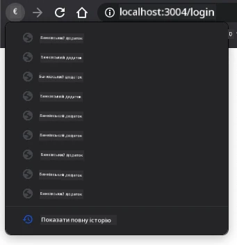

<!--
CO_OP_TRANSLATOR_METADATA:
{
  "original_hash": "351678bece18f07d9daa987a881fb062",
  "translation_date": "2025-11-06T13:44:23+00:00",
  "source_file": "7-bank-project/1-template-route/README.md",
  "language_code": "uk"
}
-->
# Створення банківського додатку, частина 1: HTML-шаблони та маршрути у веб-додатку



Коли комп'ютер Apollo 11 у 1969 році керував польотом на Місяць, він мав перемикатися між різними програмами без перезапуску всієї системи. Сучасні веб-додатки працюють схожим чином – вони змінюють те, що ви бачите, без перезавантаження всього з нуля. Це створює плавний, чутливий досвід, якого очікують користувачі сьогодні.

На відміну від традиційних веб-сайтів, які перезавантажують цілі сторінки для кожної взаємодії, сучасні веб-додатки оновлюють лише ті частини, які потребують змін. Цей підхід, як і перемикання дисплеїв у центрі управління польотами, забезпечує той плавний досвід, до якого ми звикли.

Ось що робить різницю такою значною:

| Традиційні багатосторінкові додатки | Сучасні односторінкові додатки |
|------------------------------------|-------------------------------|
| **Навігація** | Повне перезавантаження сторінки для кожного екрану | Миттєве перемикання контенту |
| **Продуктивність** | Повільніше через завантаження всього HTML | Швидше завдяки частковим оновленням |
| **Досвід користувача** | Різкі спалахи сторінок | Плавні, схожі на додатки переходи |
| **Обмін даними** | Складно між сторінками | Легке управління станом |
| **Розробка** | Підтримка кількох HTML-файлів | Один HTML із динамічними шаблонами |

**Розуміння еволюції:**
- **Традиційні додатки** потребують серверних запитів для кожної навігаційної дії
- **Сучасні SPA** завантажуються один раз і динамічно оновлюють контент за допомогою JavaScript
- **Очікування користувачів** тепер спрямовані на миттєві, безперервні взаємодії
- **Переваги продуктивності** включають зменшення використання пропускної здатності та швидші відповіді

У цьому уроці ми створимо банківський додаток із кількома екранами, які плавно переходять один в одного. Як і вчені використовують модульні інструменти, які можна налаштувати для різних експериментів, ми будемо використовувати HTML-шаблони як багаторазові компоненти, які можна відображати за потреби.

Ви будете працювати з HTML-шаблонами (багаторазовими кресленнями для різних екранів), маршрутизацією JavaScript (системою, яка перемикає екрани) та API історії браузера (який забезпечує роботу кнопки "Назад" як очікується). Це ті самі фундаментальні техніки, які використовуються у фреймворках, таких як React, Vue та Angular.

Наприкінці ви матимете робочий банківський додаток, який демонструє професійні принципи односторінкових додатків.



## Попереднє опитування

[Попереднє опитування](https://ff-quizzes.netlify.app/web/quiz/41)

### Що вам знадобиться

Нам потрібен локальний веб-сервер для тестування нашого банківського додатку – не хвилюйтеся, це простіше, ніж здається! Якщо у вас його ще немає, просто встановіть [Node.js](https://nodejs.org) і запустіть `npx lite-server` з вашої папки проекту. Ця зручна команда запускає локальний сервер і автоматично відкриває ваш додаток у браузері.

### Підготовка

На вашому комп'ютері створіть папку з назвою `bank` і файл `index.html` всередині неї. Ми почнемо з цього HTML [шаблону](https://en.wikipedia.org/wiki/Boilerplate_code):

```html
<!DOCTYPE html>
<html lang="en">
  <head>
    <meta charset="UTF-8">
    <meta name="viewport" content="width=device-width, initial-scale=1.0">
    <title>Bank App</title>
  </head>
  <body>
    <!-- This is where you'll work -->
  </body>
</html>
```

**Ось що забезпечує цей шаблон:**
- **Встановлює** структуру документа HTML5 з правильним оголошенням DOCTYPE
- **Налаштовує** кодування символів як UTF-8 для підтримки міжнародного тексту
- **Дозволяє** адаптивний дизайн за допомогою мета-тега viewport для сумісності з мобільними пристроями
- **Встановлює** описовий заголовок, який з'являється на вкладці браузера
- **Створює** чистий розділ body, де ми будемо будувати наш додаток

> 📁 **Попередній перегляд структури проекту**
> 
> **Наприкінці цього уроку ваш проект буде містити:**
> ```
> bank/
> ├── index.html      <!-- Main HTML with templates -->
> ├── app.js          <!-- Routing and navigation logic -->
> └── style.css       <!-- (Optional for future lessons) -->
> ```
> 
> **Призначення файлів:**
> - **index.html**: Містить усі шаблони та забезпечує структуру додатку
> - **app.js**: Обробляє маршрутизацію, навігацію та управління шаблонами
> - **Шаблони**: Визначають інтерфейс для входу, панелі управління та інших екранів

---

## HTML-шаблони

Шаблони вирішують фундаментальну проблему у веб-розробці. Коли Гутенберг винайшов друкарський верстат у 1440-х роках, він зрозумів, що замість того, щоб вирізати цілі сторінки, він може створити багаторазові блоки літер і розташовувати їх за потреби. HTML-шаблони працюють за тим самим принципом – замість створення окремих HTML-файлів для кожного екрану, ви визначаєте багаторазові структури, які можна відображати за потреби.



Уявіть шаблони як креслення для різних частин вашого додатку. Як архітектор створює одне креслення і використовує його кілька разів, а не перемальовує однакові кімнати, ми створюємо шаблони один раз і використовуємо їх за потреби. Браузер тримає ці шаблони прихованими, поки JavaScript не активує їх.

Якщо ви хочете створити кілька екранів для веб-сторінки, одним із рішень буде створення одного HTML-файлу для кожного екрану, який ви хочете відобразити. Однак це рішення має певні незручності:

- Ви повинні перезавантажувати весь HTML при перемиканні екрану, що може бути повільним.
- Складно ділитися даними між різними екранами.

Інший підхід – мати лише один HTML-файл і визначити кілька [HTML-шаблонів](https://developer.mozilla.org/docs/Web/HTML/Element/template) за допомогою елемента `<template>`. Шаблон – це багаторазовий HTML-блок, який не відображається браузером і має бути створений під час виконання за допомогою JavaScript.

### Давайте створимо це

Ми збираємося створити банківський додаток із двома основними екранами: сторінкою входу та панеллю управління. Спочатку додамо елемент-заповнювач до нашого HTML body – тут будуть з'являтися всі наші різні екрани:

```html
<div id="app">Loading...</div>
```

**Розуміння цього заповнювача:**
- **Створює** контейнер з ID "app", де будуть відображатися всі екрани
- **Показує** повідомлення про завантаження, поки JavaScript ініціалізує перший екран
- **Забезпечує** єдину точку монтажу для нашого динамічного контенту
- **Дозволяє** легке націлювання з JavaScript за допомогою `document.getElementById()`

> 💡 **Корисна порада**: Оскільки вміст цього елемента буде замінено, ми можемо вставити повідомлення про завантаження або індикатор, який буде показаний під час завантаження додатку.

Далі додамо HTML-шаблон для сторінки входу. Поки що ми лише вставимо заголовок і секцію з посиланням, яке ми будемо використовувати для навігації.

```html
<template id="login">
  <h1>Bank App</h1>
  <section>
    <a href="/dashboard">Login</a>
  </section>
</template>
```

**Розбір цього шаблону входу:**
- **Визначає** шаблон з унікальним ідентифікатором "login" для націлювання JavaScript
- **Включає** основний заголовок, який встановлює брендинг додатку
- **Містить** семантичний елемент `<section>` для групування пов'язаного контенту
- **Забезпечує** навігаційне посилання, яке перенаправляє користувачів на панель управління

Потім додамо ще один HTML-шаблон для сторінки панелі управління. Ця сторінка міститиме різні секції:

- Заголовок із назвою та посиланням на вихід
- Поточний баланс банківського рахунку
- Список транзакцій, відображений у таблиці

```html
<template id="dashboard">
  <header>
    <h1>Bank App</h1>
    <a href="/login">Logout</a>
  </header>
  <section>
    Balance: 100$
  </section>
  <section>
    <h2>Transactions</h2>
    <table>
      <thead>
        <tr>
          <th>Date</th>
          <th>Object</th>
          <th>Amount</th>
        </tr>
      </thead>
      <tbody></tbody>
    </table>
  </section>
</template>
```

**Розуміння кожної частини цієї панелі управління:**
- **Структурує** сторінку за допомогою семантичного елемента `<header>` з навігацією
- **Відображає** назву додатку послідовно на всіх екранах для брендингу
- **Забезпечує** посилання на вихід, яке перенаправляє назад на екран входу
- **Показує** поточний баланс рахунку в окремій секції
- **Організовує** дані транзакцій за допомогою правильно структурованої HTML-таблиці
- **Визначає** заголовки таблиці для колонок Дата, Об'єкт і Сума
- **Залишає** тіло таблиці порожнім для динамічного заповнення контентом пізніше

> 💡 **Корисна порада**: Коли створюєте HTML-шаблони, якщо хочете побачити, як вони виглядатимуть, ви можете закоментувати рядки `<template>` і `</template>`, обгорнувши їх у `<!-- -->`.

### 🔄 **Педагогічна перевірка**
**Розуміння системи шаблонів**: Перед реалізацією JavaScript переконайтеся, що ви розумієте:
- ✅ Як шаблони відрізняються від звичайних HTML-елементів
- ✅ Чому шаблони залишаються прихованими, поки їх не активує JavaScript
- ✅ Важливість семантичної HTML-структури в шаблонах
- ✅ Як шаблони дозволяють створювати багаторазові UI-компоненти

**Швидкий самотест**: Що станеться, якщо ви видалите теги `<template>` навколо вашого HTML?
*Відповідь: Контент стане видимим негайно і втратить функціональність шаблону*

**Переваги архітектури**: Шаблони забезпечують:
- **Багаторазовість**: Одне визначення, кілька екземплярів
- **Продуктивність**: Немає зайвого парсингу HTML
- **Зручність підтримки**: Централізована структура UI
- **Гнучкість**: Динамічне перемикання контенту

✅ Чому, на вашу думку, ми використовуємо атрибути `id` для шаблонів? Чи могли б ми використовувати щось інше, наприклад класи?

## Оживлення шаблонів за допомогою JavaScript

Тепер нам потрібно зробити наші шаблони функціональними. Як 3D-принтер бере цифрове креслення і створює фізичний об'єкт, JavaScript бере наші приховані шаблони і створює видимі, інтерактивні елементи, які користувачі можуть бачити і використовувати.

Процес слідує трьом послідовним крокам, які формують основу сучасної веб-розробки. Як тільки ви зрозумієте цей шаблон, ви впізнаєте його у багатьох фреймворках і бібліотеках.

Якщо ви спробуєте ваш поточний HTML-файл у браузері, ви побачите, що він застряє на `Loading...`. Це тому, що нам потрібно додати трохи JavaScript-коду, щоб створити і відобразити HTML-шаблони.

Створення шаблону зазвичай виконується у 3 кроки:

1. Отримати елемент шаблону в DOM, наприклад, за допомогою [`document.getElementById`](https://developer.mozilla.org/docs/Web/API/Document/getElementById).
2. Клонувати елемент шаблону за допомогою [`cloneNode`](https://developer.mozilla.org/docs/Web/API/Node/cloneNode).
3. Прикріпити його до DOM під видимим елементом, наприклад, за допомогою [`appendChild`](https://developer.mozilla.org/docs/Web/API/Node/appendChild).



**Візуальний розбір процесу:**
- **Крок 1** знаходить прихований шаблон у структурі DOM
- **Крок 2** створює робочу копію, яку можна безпечно змінювати
- **Крок 3** вставляє копію у видиму область сторінки
- **Результат** – функціональний екран, з яким користувачі можуть взаємодіяти

✅ Чому нам потрібно клонувати шаблон перед тим, як прикріпити його до DOM? Що, на вашу думку, станеться, якщо ми пропустимо цей крок?

### Завдання

Створіть новий файл з назвою `app.js` у вашій папці проекту і імпортуйте цей файл у секцію `<head>` вашого HTML:

```html
<script src="app.js" defer></script>
```

**Розуміння цього імпорту скрипта:**
- **Зв'язує** файл JavaScript з нашим HTML-документом
- **Використовує** атрибут `defer`, щоб забезпечити виконання скрипта після завершення парсингу HTML
- **Дозволяє** доступ до всіх елементів DOM, оскільки вони повністю завантажені перед виконанням скрипта
- **Слідує** сучасним найкращим практикам завантаження скриптів і продуктивності

Тепер у `app.js` ми створимо нову функцію `updateRoute`:

```js
function updateRoute(templateId) {
  const template = document.getElementById(templateId);
  const view = template.content.cloneNode(true);
  const app = document.getElementById('app');
  app.innerHTML = '';
  app.appendChild(view);
}
```

**Крок за кроком, ось що відбувається:**
- **Знаходить** елемент шаблону за його унікальним ID
- **Створює** глибоку копію вмісту шаблону за допомогою `cloneNode(true)`
- **Знаходить** контейнер додатку, де буде відображатися контент
- **Очищає** будь-який існуючий контент з контейнера додатку
- **Вставляє** скопійований контент шаблону у видимий DOM

Тепер викличте цю функцію з одним із шаблонів і подивіться на результат.

```js
updateRoute('login');
```

**Що досягає цей виклик функції:**
- **Активує** шаблон входу, передаючи його ID як параметр
- **Демонструє**, як програмно перемикатися між різними екранами додатку
- **Показує** екран входу замість повідомлення "Loading..."

✅ Яка мета цього коду `app.innerHTML = '';`? Що станеться без нього?

## Створення маршрутів

Маршрутизація – це, по суті, процес з'єднання URL-адрес із відповідним контентом. Уявіть, як ранні телефонні оператори використовували комутаційні панелі для з'єднання дзвінків – вони брали вхідний запит і направляли його до правильного місця призначення. Веб-маршрутизація працює схожим чином, приймаючи запит URL і визначаючи, який контент відобразити.



Традиційно веб-сервери обробляли це, подаючи різні HTML-файли для різних URL-адрес. Оскільки ми створюємо односторінковий додаток, нам потрібно обробляти цю маршрутизацію самостійно за допомогою JavaScript. Цей підхід дає нам більше контролю над досвідом користувача та продуктивністю.


**Розуміння потоку маршрутизації:**
- **Зміни URL** викликають пошук у конфігурації маршрутів
- **Дійсні маршрути** відображаються на конкретні ID шаблонів для р
Тепер давайте трохи змінимо функцію `updateRoute`. Замість того, щоб передавати `templateId` безпосередньо як аргумент, ми хочемо отримати його, спочатку переглянувши поточний URL, а потім використати нашу карту для отримання відповідного значення `templateId`. Ми можемо використати [`window.location.pathname`](https://developer.mozilla.org/docs/Web/API/Location/pathname), щоб отримати лише частину шляху з URL.

```js
function updateRoute() {
  const path = window.location.pathname;
  const route = routes[path];

  const template = document.getElementById(route.templateId);
  const view = template.content.cloneNode(true);
  const app = document.getElementById('app');
  app.innerHTML = '';
  app.appendChild(view);
}
```

**Розбираємо, що тут відбувається:**
- **Витягує** поточний шлях з URL браузера за допомогою `window.location.pathname`
- **Шукає** відповідну конфігурацію маршруту в нашому об'єкті маршрутів
- **Отримує** `templateId` з конфігурації маршруту
- **Слідує** тому ж процесу рендерингу шаблону, що й раніше
- **Створює** динамічну систему, яка реагує на зміни URL

Тут ми зіставили маршрути, які оголосили, з відповідними шаблонами. Ви можете перевірити, що це працює правильно, змінивши URL вручну у вашому браузері.

✅ Що станеться, якщо ви введете невідомий шлях у URL? Як ми могли б це вирішити?

## Додавання навігації

З маршрутизацією, що вже встановлена, користувачам потрібен спосіб навігації через додаток. Традиційні вебсайти перезавантажують цілі сторінки при натисканні на посилання, але ми хочемо оновлювати як URL, так і контент без перезавантаження сторінки. Це створює більш плавний досвід, схожий на те, як настільні додатки перемикаються між різними видами.

Нам потрібно координувати дві речі: оновлення URL браузера, щоб користувачі могли закладати сторінки та ділитися посиланнями, і відображення відповідного контенту. При правильній реалізації це створює безперервну навігацію, яку очікують користувачі сучасних додатків.



### 🔄 **Педагогічна перевірка**
**Архітектура односторінкового додатка**: Перевірте своє розуміння всієї системи:
- ✅ Чим клієнтська маршрутизація відрізняється від традиційної серверної маршрутизації?
- ✅ Чому API історії є важливим для правильної навігації SPA?
- ✅ Як шаблони дозволяють динамічний контент без перезавантаження сторінок?
- ✅ Яку роль відіграє обробка подій у перехопленні навігації?

**Інтеграція системи**: Ваш SPA демонструє:
- **Управління шаблонами**: Повторно використовувані UI-компоненти з динамічним контентом
- **Клієнтська маршрутизація**: Управління URL без запитів до сервера
- **Архітектура, що реагує на події**: Навігація та взаємодія з користувачем
- **Інтеграція з браузером**: Підтримка кнопок "Назад" і "Вперед"
- **Оптимізація продуктивності**: Швидкі переходи та зменшене навантаження на сервер

**Професійні шаблони**: Ви реалізували:
- **Розділення моделі та представлення**: Шаблони відокремлені від логіки додатка
- **Управління станом**: Стан URL синхронізований з відображеним контентом
- **Прогресивне покращення**: JavaScript покращує базову функціональність HTML
- **Досвід користувача**: Плавна навігація, схожа на додаток, без перезавантаження сторінок

> � **Інсайт архітектури**: Компоненти системи навігації
>
> **Що ви створюєте:**
> - **🔄 Управління URL**: Оновлює адресний рядок браузера без перезавантаження сторінок
> - **📋 Система шаблонів**: Динамічно змінює контент залежно від поточного маршруту  
> - **📚 Інтеграція історії**: Підтримує функціональність кнопок "Назад" і "Вперед"
> - **🛡️ Обробка помилок**: Акуратні резервні варіанти для недійсних або відсутніх маршрутів
>
> **Як компоненти працюють разом:**
> - **Слухає** події навігації (кліки, зміни історії)
> - **Оновлює** URL за допомогою API історії
> - **Рендерить** відповідний шаблон для нового маршруту
> - **Підтримує** безперервний досвід користувача

Наступний крок для нашого додатка — додати можливість навігації між сторінками без необхідності змінювати URL вручну. Це передбачає дві речі:

  1. Оновлення поточного URL
  2. Оновлення відображеного шаблону на основі нового URL

Ми вже подбали про другу частину за допомогою функції `updateRoute`, тому нам потрібно зрозуміти, як оновити поточний URL.

Нам доведеться використовувати JavaScript, а точніше [`history.pushState`](https://developer.mozilla.org/docs/Web/API/History/pushState), який дозволяє оновлювати URL і створювати новий запис в історії перегляду без перезавантаження HTML.

> ⚠️ **Важлива примітка**: Хоча HTML-елемент якоря [`<a href>`](https://developer.mozilla.org/docs/Web/HTML/Element/a) можна використовувати самостійно для створення гіперпосилань на різні URL, він за замовчуванням змусить браузер перезавантажити HTML. Необхідно запобігти цій поведінці при обробці маршрутизації за допомогою власного JavaScript, використовуючи функцію preventDefault() для події кліку.

### Завдання

Давайте створимо нову функцію, яку ми можемо використовувати для навігації в нашому додатку:

```js
function navigate(path) {
  window.history.pushState({}, path, path);
  updateRoute();
}
```

**Розуміння цієї функції навігації:**
- **Оновлює** URL браузера до нового шляху за допомогою `history.pushState`
- **Додає** новий запис до стеку історії браузера для правильної підтримки кнопок "Назад"/"Вперед"
- **Запускає** функцію `updateRoute()` для відображення відповідного шаблону
- **Підтримує** досвід односторінкового додатка без перезавантаження сторінок

Цей метод спочатку оновлює поточний URL на основі заданого шляху, а потім оновлює шаблон. Властивість `window.location.origin` повертає корінь URL, дозволяючи нам реконструювати повний URL з заданого шляху.

Тепер, коли у нас є ця функція, ми можемо вирішити проблему, яка виникає, якщо шлях не відповідає жодному визначеному маршруту. Ми модифікуємо функцію `updateRoute`, додавши резервний варіант до одного з існуючих маршрутів, якщо ми не можемо знайти відповідність.

```js
function updateRoute() {
  const path = window.location.pathname;
  const route = routes[path];

  if (!route) {
    return navigate('/login');
  }

  const template = document.getElementById(route.templateId);
  const view = template.content.cloneNode(true);
  const app = document.getElementById('app');
  app.innerHTML = '';
  app.appendChild(view);
}
```

**Основні моменти, які слід пам'ятати:**
- **Перевіряє**, чи існує маршрут для поточного шляху
- **Перенаправляє** на сторінку входу при доступі до недійсного маршруту
- **Забезпечує** резервний механізм, який запобігає зламаній навігації
- **Гарантує**, що користувачі завжди бачать дійсний екран, навіть з неправильними URL

Якщо маршрут не може бути знайдений, ми тепер перенаправляємо на сторінку `login`.

Тепер давайте створимо функцію для отримання URL при кліку на посилання та запобігання стандартній поведінці браузера для посилань:

```js
function onLinkClick(event) {
  event.preventDefault();
  navigate(event.target.href);
}
```

**Розбираємо цей обробник кліків:**
- **Запобігає** стандартній поведінці браузера для посилань за допомогою `preventDefault()`
- **Витягує** URL призначення з елемента посилання, на який було натиснуто
- **Викликає** нашу власну функцію navigate замість перезавантаження сторінки
- **Підтримує** плавний досвід односторінкового додатка

```html
<a href="/dashboard" onclick="onLinkClick(event)">Login</a>
...
<a href="/login" onclick="onLinkClick(event)">Logout</a>
```

**Що досягає це прив'язування onclick:**
- **З'єднує** кожне посилання з нашою власною системою навігації
- **Передає** подію кліку до нашої функції `onLinkClick` для обробки
- **Дозволяє** плавну навігацію без перезавантаження сторінок
- **Підтримує** правильну структуру URL, яку користувачі можуть закладати або ділитися

Атрибут [`onclick`](https://developer.mozilla.org/docs/Web/API/GlobalEventHandlers/onclick) прив'язує подію кліку до JavaScript-коду, тут виклику функції `navigate()`.

Спробуйте натиснути на ці посилання, тепер ви повинні мати можливість переміщатися між різними екранами вашого додатка.

✅ Метод `history.pushState` є частиною стандарту HTML5 і реалізований у [всіх сучасних браузерах](https://caniuse.com/?search=pushState). Якщо ви створюєте вебдодаток для старих браузерів, є трюк, який можна використовувати замість цього API: використання [хешу (`#`)](https://en.wikipedia.org/wiki/URI_fragment) перед шляхом дозволяє реалізувати маршрутизацію, яка працює з регулярною навігацією за допомогою якорів і не перезавантажує сторінку, оскільки її метою було створення внутрішніх посилань на сторінці.

## Робимо кнопки "Назад" і "Вперед" функціональними

Кнопки "Назад" і "Вперед" є фундаментальними для вебперегляду, так само як і можливість перегляду попередніх станів системи для контролерів місій NASA під час космічних місій. Користувачі очікують, що ці кнопки працюватимуть, і коли вони не працюють, це порушує очікуваний досвід перегляду.

Наш односторінковий додаток потребує додаткової конфігурації для підтримки цього. Браузер підтримує стек історії (який ми додаємо за допомогою `history.pushState`), але коли користувачі переміщуються через цю історію, наш додаток повинен реагувати, оновлюючи відображений контент відповідно.


**Основні точки взаємодії:**
- **Дії користувача** запускають навігацію через кліки або кнопки браузера
- **Додаток перехоплює** кліки на посилання, щоб запобігти перезавантаженню сторінок
- **API історії** управляє змінами URL і стеком історії браузера
- **Шаблони** забезпечують структуру контенту для кожного екрану
- **Слухачі подій** гарантують, що додаток реагує на всі типи навігації

Використання `history.pushState` створює нові записи в історії навігації браузера. Ви можете перевірити це, утримуючи *кнопку назад* вашого браузера, вона повинна показувати щось на кшталт цього:



Якщо ви спробуєте кілька разів натиснути кнопку назад, ви побачите, що поточний URL змінюється, а історія оновлюється, але той самий шаблон продовжує відображатися.

Це тому, що додаток не знає, що нам потрібно викликати `updateRoute()` кожного разу, коли історія змінюється. Якщо ви подивитеся на [документацію `history.pushState`](https://developer.mozilla.org/docs/Web/API/History/pushState), ви побачите, що якщо стан змінюється - тобто ми перейшли до іншого URL - подія [`popstate`](https://developer.mozilla.org/docs/Web/API/Window/popstate_event) запускається. Ми використаємо це, щоб виправити цю проблему.

### Завдання

Щоб переконатися, що відображений шаблон оновлюється, коли історія браузера змінюється, ми прив'яжемо нову функцію, яка викликає `updateRoute()`. Ми зробимо це в кінці нашого файлу `app.js`:

```js
window.onpopstate = () => updateRoute();
updateRoute();
```

**Розуміння цієї інтеграції історії:**
- **Слухає** події `popstate`, які виникають, коли користувачі переміщуються за допомогою кнопок браузера
- **Використовує** стрілкову функцію для лаконічного синтаксису обробника подій
- **Автоматично викликає** `updateRoute()` кожного разу, коли стан історії змінюється
- **Ініціалізує** додаток, викликаючи `updateRoute()` при першому завантаженні сторінки
- **Гарантує**, що правильний шаблон відображається незалежно від того, як користувачі переміщуються

> 💡 **Порада професіонала**: Ми використали [стрілкову функцію](https://developer.mozilla.org/docs/Web/JavaScript/Reference/Functions/Arrow_functions) тут для оголошення нашого обробника подій `popstate` для лаконічності, але звичайна функція працювала б так само.

Ось відео для оновлення знань про стрілкові функції:

[](https://youtube.com/watch?v=OP6eEbOj2sc "Стрілкові функції")

> 🎥 Натисніть на зображення вище, щоб переглянути відео про стрілкові функції.

Тепер спробуйте використовувати кнопки "Назад" і "Вперед" вашого браузера та перевірте, що відображений маршрут тепер правильно оновлюється.

### ⚡ **Що ви можете зробити за наступні 5 хвилин**
- [ ] Перевірте навігацію вашого банківського додатка за допомогою кнопок "Назад"/"Вперед" браузера
- [ ] Спробуйте вручну вводити різні URL в адресному рядку, щоб перевірити маршрутизацію
- [ ] Відкрийте DevTools браузера та перевірте, як шаблони копіюються в DOM
- [ ] Експериментуйте з додаванням console.log для відстеження потоку маршрутизації

### 🎯 **Що ви можете досягти за цю годину**
- [ ] Завершіть тест після уроку та зрозумійте концепції архітектури SPA
- [ ] Додайте стилізацію CSS, щоб зробити шаблони вашого банківського додатка професійними
- [ ] Реалізуйте виклик сторінки помилки 404 з правильною обробкою помилок
- [ ] Створіть виклик сторінки кредитів з додатковою функціональністю маршрутизації
- [ ] Додайте стани завантаження та переходи між змінами шаблонів

### 📅 **Ваш тижневий шлях розробки SPA**
- [ ] Завершіть повний банківський додаток з формами, управлінням даними та збереженням
- [ ] Додайте розширені функції маршрутизації, такі як параметри маршруту та вкладені маршрути
- [ ] Реалізуйте захист маршрутизації та маршрутизацію на основі автентифікації
- [ ] Створіть повторно використовувані компоненти шаблонів та бібліотеку компонентів
- [ ] Додайте анімації та переходи для більш плавного досвіду користувача
- [ ] Розгорніть ваш SPA на платформі хостингу та налаштуйте маршрутизацію належним чином

### 🌟 **Ваш місячний шлях до майстерності фронтенд-архітектури**
- [ ] Створіть складні SPA, використовуючи сучасні фреймворки, такі як React, Vue або Angular
- [ ] Вивчіть розширені шаблони управління станом та бібліотеки
- [ ] Опануйте ін
- **Архітектуруйте** односторінкові додатки з правильним розділенням обов'язків
- **Реалізуйте** системи маршрутизації на стороні клієнта, які масштабуються відповідно до складності додатка
- **Виправляйте помилки** у складних навігаційних потоках за допомогою інструментів розробника браузера
- **Оптимізуйте** продуктивність додатка через ефективне управління шаблонами
- **Проектуйте** користувацький досвід, який виглядає природно та чутливо

**Засвоєні концепції фронтенд-розробки**:
- **Архітектура компонентів**: Повторно використовувані шаблони UI та системи шаблонів
- **Синхронізація стану**: Управління станом URL та історією браузера
- **Програмування, орієнтоване на події**: Обробка взаємодії користувача та навігації
- **Оптимізація продуктивності**: Ефективна маніпуляція DOM та завантаження контенту
- **Проектування користувацького досвіду**: Плавні переходи та інтуїтивна навігація

**Наступний рівень**: Ви готові досліджувати сучасні фронтенд-фреймворки, вдосконалене управління станом або створювати складні корпоративні додатки!

🌟 **Досягнення розблоковано**: Ви створили професійну основу для односторінкових додатків із сучасними веб-архітектурними паттернами!

---

## Виклик GitHub Copilot Agent 🚀

Використовуйте режим Agent, щоб виконати наступний виклик:

**Опис:** Покращіть банківський додаток, реалізувавши обробку помилок та шаблон сторінки 404 для недійсних маршрутів, покращуючи користувацький досвід при навігації до неіснуючих сторінок.

**Завдання:** Створіть новий HTML-шаблон з id "not-found", який відображає зручну сторінку помилки 404 зі стилізацією. Потім змініть логіку маршрутизації JavaScript, щоб показувати цей шаблон, коли користувачі переходять на недійсні URL, і додайте кнопку "Перейти на головну", яка повертає на сторінку входу.

Дізнайтеся більше про [режим Agent](https://code.visualstudio.com/blogs/2025/02/24/introducing-copilot-agent-mode) тут.

## 🚀 Виклик

Додайте новий шаблон і маршрут для третьої сторінки, яка показує кредити цього додатка.

**Цілі виклику:**
- **Створіть** новий HTML-шаблон з відповідною структурою контенту
- **Додайте** новий маршрут до вашого об'єкта конфігурації маршрутів
- **Включіть** навігаційні посилання до та з сторінки кредитів
- **Перевірте**, що вся навігація працює правильно з історією браузера

## Післялекційний тест

[Післялекційний тест](https://ff-quizzes.netlify.app/web/quiz/42)

## Огляд та самостійне навчання

Маршрутизація є однією з несподівано складних частин веб-розробки, особливо коли веб переходить від поведінки оновлення сторінок до оновлень сторінок в односторінкових додатках. Прочитайте трохи про [як служба Azure Static Web App](https://docs.microsoft.com/azure/static-web-apps/routes/?WT.mc_id=academic-77807-sagibbon) обробляє маршрутизацію. Чи можете ви пояснити, чому деякі рішення, описані в цьому документі, є необхідними?

**Додаткові ресурси для навчання:**
- **Досліджуйте**, як популярні фреймворки, такі як React Router і Vue Router, реалізують маршрутизацію на стороні клієнта
- **Досліджуйте** різницю між маршрутизацією на основі хешу та маршрутизацією через API історії
- **Дізнайтеся** про серверний рендеринг (SSR) і як він впливає на стратегії маршрутизації
- **Досліджуйте**, як прогресивні веб-додатки (PWA) обробляють маршрутизацію та навігацію

## Завдання

[Покращіть маршрутизацію](assignment.md)

---

**Відмова від відповідальності**:  
Цей документ був перекладений за допомогою сервісу автоматичного перекладу [Co-op Translator](https://github.com/Azure/co-op-translator). Хоча ми прагнемо до точності, будь ласка, майте на увазі, що автоматичні переклади можуть містити помилки або неточності. Оригінальний документ на його рідній мові слід вважати авторитетним джерелом. Для критичної інформації рекомендується професійний людський переклад. Ми не несемо відповідальності за будь-які непорозуміння або неправильні тлумачення, що виникають внаслідок використання цього перекладу.