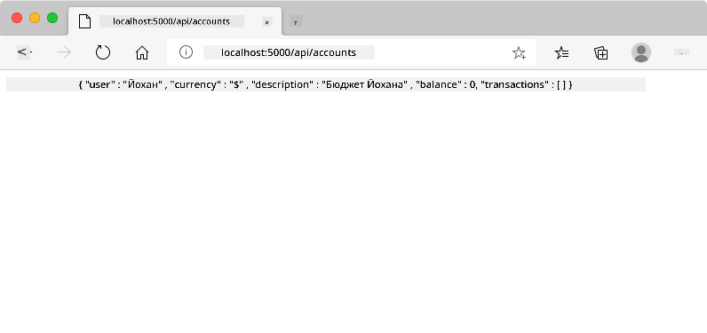
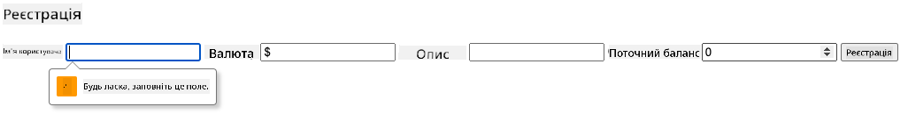
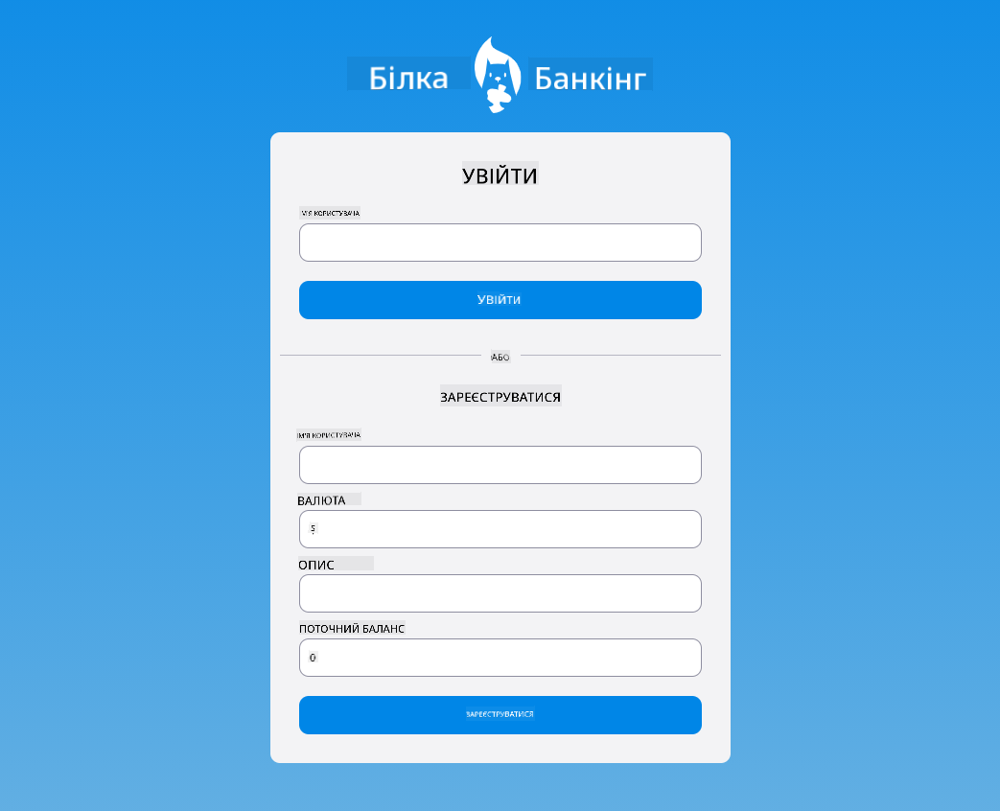

<!--
CO_OP_TRANSLATOR_METADATA:
{
  "original_hash": "8baca047d77a5f43fa4099c0578afa42",
  "translation_date": "2025-08-28T18:07:19+00:00",
  "source_file": "7-bank-project/2-forms/README.md",
  "language_code": "uk"
}
-->
# Створення банківського додатку, частина 2: Створення форми входу та реєстрації

## Попереднє опитування

[Попереднє опитування](https://ff-quizzes.netlify.app/web/quiz/43)

### Вступ

У майже всіх сучасних веб-додатках ви можете створити обліковий запис, щоб мати власний приватний простір. Оскільки кілька користувачів можуть одночасно отримувати доступ до веб-додатку, потрібен механізм для зберігання персональних даних кожного користувача окремо та вибору, яку інформацію відображати. Ми не будемо розглядати, як [безпечно керувати ідентифікацією користувачів](https://en.wikipedia.org/wiki/Authentication), оскільки це велика тема сама по собі, але ми забезпечимо можливість кожному користувачеві створити один (або кілька) банківських рахунків у нашому додатку.

У цій частині ми використаємо HTML-форми для додавання входу та реєстрації до нашого веб-додатку. Ми побачимо, як програмно надсилати дані на серверний API, і, зрештою, як визначати базові правила перевірки введених даних користувачем.

### Передумови

Вам потрібно завершити [HTML-шаблони та маршрутизацію](../1-template-route/README.md) веб-додатку для цього уроку. Також необхідно встановити [Node.js](https://nodejs.org) і [запустити серверний API](../api/README.md) локально, щоб мати можливість надсилати дані для створення рахунків.

**Зверніть увагу**
Ви будете використовувати два термінали одночасно, як зазначено нижче:
1. Для основного банківського додатку, який ми створили в уроці [HTML-шаблони та маршрутизація](../1-template-route/README.md).
2. Для [серверного API банківського додатку](../api/README.md), який ми щойно налаштували.

Вам потрібно, щоб обидва сервери працювали, щоб продовжити урок. Вони слухають на різних портах (порт `3000` і порт `5000`), тому все має працювати без проблем.

Ви можете перевірити, чи сервер працює належним чином, виконавши цю команду в терміналі:

```sh
curl http://localhost:5000/api
# -> should return "Bank API v1.0.0" as a result
```

---

## Форма та елементи управління

Елемент `<form>` охоплює розділ HTML-документа, де користувач може вводити та надсилати дані за допомогою інтерактивних елементів управління. Існує багато різних елементів інтерфейсу користувача (UI), які можна використовувати у формі, найпоширенішими з яких є елементи `<input>` і `<button>`.

Існує багато різних [типів](https://developer.mozilla.org/docs/Web/HTML/Element/input) `<input>`. Наприклад, щоб створити поле, де користувач може ввести своє ім'я користувача, можна використати:

```html
<input id="username" name="username" type="text">
```

Атрибут `name` буде використовуватися як назва властивості, коли дані форми будуть надіслані. Атрибут `id` використовується для асоціації `<label>` з елементом управління формою.

> Ознайомтеся з повним списком [типів `<input>`](https://developer.mozilla.org/docs/Web/HTML/Element/input) і [інших елементів управління формами](https://developer.mozilla.org/docs/Learn/Forms/Other_form_controls), щоб отримати уявлення про всі вбудовані елементи інтерфейсу користувача, які можна використовувати під час створення вашого інтерфейсу.

✅ Зверніть увагу, що `<input>` є [порожнім елементом](https://developer.mozilla.org/docs/Glossary/Empty_element), для якого не потрібно додавати відповідний закриваючий тег. Ви можете використовувати самозакриваючу нотацію `<input/>`, але це не обов’язково.

Елемент `<button>` у формі має особливу поведінку. Якщо ви не вкажете його атрибут `type`, він автоматично надішле дані форми на сервер після натискання. Ось можливі значення атрибута `type`:

- `submit`: За замовчуванням у `<form>`, кнопка запускає дію надсилання форми.
- `reset`: Кнопка скидає всі елементи управління форми до їх початкових значень.
- `button`: Не призначає жодної поведінки за замовчуванням при натисканні кнопки. Ви можете призначити їй власні дії за допомогою JavaScript.

### Завдання

Давайте почнемо з додавання форми до шаблону `login`. Нам знадобиться поле для *імені користувача* та кнопка *Login*.

```html
<template id="login">
  <h1>Bank App</h1>
  <section>
    <h2>Login</h2>
    <form id="loginForm">
      <label for="username">Username</label>
      <input id="username" name="user" type="text">
      <button>Login</button>
    </form>
  </section>
</template>
```

Якщо придивитися уважніше, можна помітити, що ми також додали елемент `<label>`. Елементи `<label>` використовуються для додавання назви до елементів управління інтерфейсу користувача, таких як наше поле для імені користувача. Мітки важливі для читабельності ваших форм, але також мають додаткові переваги:

- Асоціюючи мітку з елементом управління формою, це допомагає користувачам, які використовують допоміжні технології (наприклад, екранний диктор), зрозуміти, які дані від них очікуються.
- Ви можете натиснути на мітку, щоб безпосередньо сфокусуватися на пов’язаному введенні, що полегшує доступ на пристроях із сенсорним екраном.

> [Доступність](https://developer.mozilla.org/docs/Learn/Accessibility/What_is_accessibility) у вебі — це дуже важлива тема, яку часто ігнорують. Завдяки [семантичним HTML-елементам](https://developer.mozilla.org/docs/Learn/Accessibility/HTML) створювати доступний контент не складно, якщо використовувати їх належним чином. Ви можете [прочитати більше про доступність](https://developer.mozilla.org/docs/Web/Accessibility), щоб уникнути поширених помилок і стати відповідальним розробником.

Тепер ми додамо другу форму для реєстрації, прямо під попередньою:

```html
<hr/>
<h2>Register</h2>
<form id="registerForm">
  <label for="user">Username</label>
  <input id="user" name="user" type="text">
  <label for="currency">Currency</label>
  <input id="currency" name="currency" type="text" value="$">
  <label for="description">Description</label>
  <input id="description" name="description" type="text">
  <label for="balance">Current balance</label>
  <input id="balance" name="balance" type="number" value="0">
  <button>Register</button>
</form>
```

Використовуючи атрибут `value`, ми можемо визначити значення за замовчуванням для певного введення.
Зверніть увагу, що введення для `balance` має тип `number`. Чи виглядає воно інакше, ніж інші введення? Спробуйте взаємодіяти з ним.

✅ Чи можете ви навігувати та взаємодіяти з формами, використовуючи лише клавіатуру? Як би ви це зробили?

## Надсилання даних на сервер

Тепер, коли у нас є функціональний інтерфейс, наступним кроком буде надсилання даних на наш сервер. Давайте зробимо швидкий тест, використовуючи наш поточний код: що станеться, якщо ви натиснете кнопку *Login* або *Register*?

Чи помітили ви зміну в розділі URL вашого браузера?


Дія за замовчуванням для `<form>` — це надсилання форми на поточний URL сервера за допомогою [методу GET](https://www.w3.org/Protocols/rfc2616/rfc2616-sec9.html#sec9.3), додаючи дані форми безпосередньо до URL. Однак цей метод має деякі недоліки:

- Дані, що надсилаються, мають обмежений розмір (близько 2000 символів).
- Дані безпосередньо видно в URL (не дуже добре для паролів).
- Він не працює з завантаженням файлів.

Ось чому ви можете змінити його, щоб використовувати [метод POST](https://www.w3.org/Protocols/rfc2616/rfc2616-sec9.html#sec9.5), який надсилає дані форми на сервер у тілі HTTP-запиту, без жодних попередніх обмежень.

> Хоча POST є найпоширенішим методом для надсилання даних, [у деяких конкретних сценаріях](https://www.w3.org/2001/tag/doc/whenToUseGet.html) краще використовувати метод GET, наприклад, під час реалізації поля пошуку.

### Завдання

Додайте властивості `action` і `method` до форми реєстрації:

```html
<form id="registerForm" action="//localhost:5000/api/accounts" method="POST">
```

Тепер спробуйте зареєструвати новий обліковий запис зі своїм ім’ям. Після натискання кнопки *Register* ви повинні побачити щось подібне:



Якщо все пройде добре, сервер відповість на ваш запит [JSON](https://www.json.org/json-en.html)-відповіддю, що містить дані створеного рахунку.

✅ Спробуйте зареєструватися знову з тим самим ім’ям. Що станеться?

## Надсилання даних без перезавантаження сторінки

Як ви, мабуть, помітили, є невелика проблема з підходом, який ми щойно використали: під час надсилання форми ми виходимо з нашого додатку, і браузер перенаправляє на URL сервера. Ми намагаємося уникнути всіх перезавантажень сторінок у нашому веб-додатку, оскільки створюємо [односторінковий додаток (SPA)](https://en.wikipedia.org/wiki/Single-page_application).

Щоб надіслати дані форми на сервер без примусового перезавантаження сторінки, нам потрібно використовувати код JavaScript. Замість того, щоб вказувати URL у властивості `action` елемента `<form>`, ви можете використовувати будь-який код JavaScript, додавши перед ним рядок `javascript:`, щоб виконати власну дію. Використовуючи це, вам також доведеться реалізувати деякі завдання, які раніше виконувалися автоматично браузером:

- Отримати дані форми.
- Перетворити та закодувати дані форми у відповідний формат.
- Створити HTTP-запит і надіслати його на сервер.

### Завдання

Замініть `action` форми реєстрації на:

```html
<form id="registerForm" action="javascript:register()">
```

Відкрийте `app.js` і додайте нову функцію з назвою `register`:

```js
function register() {
  const registerForm = document.getElementById('registerForm');
  const formData = new FormData(registerForm);
  const data = Object.fromEntries(formData);
  const jsonData = JSON.stringify(data);
}
```

Тут ми отримуємо елемент форми за допомогою `getElementById()` і використовуємо помічник [`FormData`](https://developer.mozilla.org/docs/Web/API/FormData), щоб витягти значення з елементів управління форми як набір пар ключ/значення. Потім ми перетворюємо дані на звичайний об’єкт за допомогою [`Object.fromEntries()`](https://developer.mozilla.org/docs/Web/JavaScript/Reference/Global_Objects/Object/fromEntries) і, нарешті, серіалізуємо дані у формат [JSON](https://www.json.org/json-en.html), який часто використовується для обміну даними в вебі.

Дані тепер готові до надсилання на сервер. Створіть нову функцію з назвою `createAccount`:

```js
async function createAccount(account) {
  try {
    const response = await fetch('//localhost:5000/api/accounts', {
      method: 'POST',
      headers: { 'Content-Type': 'application/json' },
      body: account
    });
    return await response.json();
  } catch (error) {
    return { error: error.message || 'Unknown error' };
  }
}
```

Що робить ця функція? Спочатку зверніть увагу на ключове слово `async`. Це означає, що функція містить код, який буде виконуватися [**асинхронно**](https://developer.mozilla.org/docs/Web/JavaScript/Reference/Statements/async_function). Використовуючи ключове слово `await`, ми можемо чекати виконання асинхронного коду — наприклад, очікувати відповіді сервера — перед тим, як продовжити.

Ось коротке відео про використання `async/await`:

[](https://youtube.com/watch?v=YwmlRkrxvkk "Async і Await для управління обіцянками")

> 🎥 Натисніть на зображення вище, щоб переглянути відео про async/await.

Ми використовуємо API `fetch()` для надсилання JSON-даних на сервер. Цей метод приймає 2 параметри:

- URL сервера, тому ми повертаємо `//localhost:5000/api/accounts`.
- Налаштування запиту. Тут ми встановлюємо метод `POST` і надаємо `body` для запиту. Оскільки ми надсилаємо JSON-дані на сервер, нам також потрібно встановити заголовок `Content-Type` як `application/json`, щоб сервер знав, як інтерпретувати вміст.

Оскільки сервер відповість на запит JSON-даними, ми можемо використовувати `await response.json()`, щоб розібрати JSON-вміст і повернути отриманий об’єкт. Зверніть увагу, що цей метод асинхронний, тому ми використовуємо ключове слово `await`, щоб переконатися, що будь-які помилки під час розбору також будуть враховані.

Тепер додайте трохи коду до функції `register`, щоб викликати `createAccount()`:

```js
const result = await createAccount(jsonData);
```

Оскільки ми використовуємо ключове слово `await`, нам потрібно додати ключове слово `async` перед функцією register:

```js
async function register() {
```

Нарешті, додамо кілька логів, щоб перевірити результат. Остаточна функція має виглядати так:

```js
async function register() {
  const registerForm = document.getElementById('registerForm');
  const formData = new FormData(registerForm);
  const jsonData = JSON.stringify(Object.fromEntries(formData));
  const result = await createAccount(jsonData);

  if (result.error) {
    return console.log('An error occurred:', result.error);
  }

  console.log('Account created!', result);
}
```

Це було трохи довго, але ми дійшли до кінця! Якщо ви відкриєте [інструменти розробника браузера](https://developer.mozilla.org/docs/Learn/Common_questions/What_are_browser_developer_tools) і спробуєте зареєструвати новий обліковий запис, ви не побачите жодних змін на веб-сторінці, але в консолі з’явиться повідомлення, яке підтверджує, що все працює.


✅ Як ви думаєте, чи дані надсилаються на сервер безпечно? Що, якщо хтось зможе перехопити запит? Ви можете прочитати про [HTTPS](https://en.wikipedia.org/wiki/HTTPS), щоб дізнатися більше про безпечну передачу даних.

## Перевірка даних

Якщо ви спробуєте зареєструвати новий обліковий запис, не вказавши спочатку ім’я користувача, ви побачите, що сервер повертає помилку зі статусом [400 (Bad Request)](https://developer.mozilla.org/docs/Web/HTTP/Status/400#:~:text=The%20HyperText%20Transfer%20Protocol%20(HTTP,%2C%20or%20deceptive%20request%20routing).).

Перед надсиланням даних на сервер гарною практикою є [перевірка даних форми](https://developer.mozilla.org/docs/Learn/Forms/Form_validation) заздалегідь, коли це можливо, щоб переконатися, що ви надсилаєте дійсний запит. Елементи управління формами HTML5 забезпечують вбудовану перевірку за допомогою різних атрибутів:

- `required`: поле має бути заповнене, інакше форму не можна надіслати.
- `minlength` і `maxlength`: визначають мінімальну та максимальну кількість символів у текстових полях.
- `min` і `max`: визначають мінімальне та максимальне значення числового поля.
- `type`: визначає тип очікуваних даних, наприклад, `number`, `email`, `file` або [інші вбудовані типи](https://developer.mozilla.org/docs/Web/HTML/Element/input). Цей атрибут також може змінити візуальне відображення елемента управління формою.
- `pattern`: дозволяє визначити [регулярний вираз](https://developer.mozilla.org/docs/Web/JavaScript/Guide/Regular_Expressions), щоб перевірити, чи введені дані є дійсними.
> Порада: ви можете налаштувати вигляд елементів керування формою залежно від того, чи вони є валідними, чи ні, використовуючи псевдокласи CSS `:valid` та `:invalid`.
### Завдання

Для створення нового облікового запису необхідно заповнити два обов’язкові поля: ім’я користувача та валюту. Інші поля є необов’язковими. Оновіть HTML форми, використовуючи як атрибут `required`, так і текст у мітці поля, щоб:

```html
<label for="user">Username (required)</label>
<input id="user" name="user" type="text" required>
...
<label for="currency">Currency (required)</label>
<input id="currency" name="currency" type="text" value="$" required>
```

Хоча ця конкретна серверна реалізація не накладає обмежень на максимальну довжину полів, завжди є гарною практикою визначати розумні межі для будь-якого текстового вводу користувача.

Додайте атрибут `maxlength` до текстових полів:

```html
<input id="user" name="user" type="text" maxlength="20" required>
...
<input id="currency" name="currency" type="text" value="$" maxlength="5" required>
...
<input id="description" name="description" type="text" maxlength="100">
```

Тепер, якщо ви натиснете кнопку *Зареєструватися*, і якесь поле не відповідатиме визначеним правилам валідації, ви побачите щось подібне:



Валідація, яка виконується *до* відправки будь-яких даних на сервер, називається **клієнтською валідацією**. Але варто зазначити, що не завжди можливо виконати всі перевірки без відправки даних. Наприклад, ми не можемо перевірити тут, чи існує вже обліковий запис із таким самим ім’ям користувача, без запиту до сервера. Додаткова валідація, яка виконується на сервері, називається **серверною валідацією**.

Зазвичай необхідно реалізувати обидва типи валідації. Клієнтська валідація покращує взаємодію з користувачем, надаючи миттєвий зворотний зв’язок, але серверна валідація є критично важливою для забезпечення того, щоб дані користувача, які ви обробляєте, були коректними та безпечними.

---

## 🚀 Виклик

Показати повідомлення про помилку в HTML, якщо користувач уже існує.

Ось приклад того, як може виглядати фінальна сторінка входу після невеликого стилізування:



## Післялекційний тест

[Післялекційний тест](https://ff-quizzes.netlify.app/web/quiz/44)

## Огляд і самостійне навчання

Розробники проявляють неабияку креативність у створенні форм, особливо у стратегіях валідації. Дізнайтеся про різні підходи до створення форм, переглядаючи [CodePen](https://codepen.com); чи зможете ви знайти цікаві та надихаючі приклади форм?

## Завдання

[Стилізуйте свій банківський додаток](assignment.md)

---

**Відмова від відповідальності**:  
Цей документ було перекладено за допомогою сервісу автоматичного перекладу [Co-op Translator](https://github.com/Azure/co-op-translator). Хоча ми прагнемо до точності, звертаємо вашу увагу, що автоматичні переклади можуть містити помилки або неточності. Оригінальний документ на його рідній мові слід вважати авторитетним джерелом. Для критично важливої інформації рекомендується професійний людський переклад. Ми не несемо відповідальності за будь-які непорозуміння або неправильні тлумачення, що виникли внаслідок використання цього перекладу.