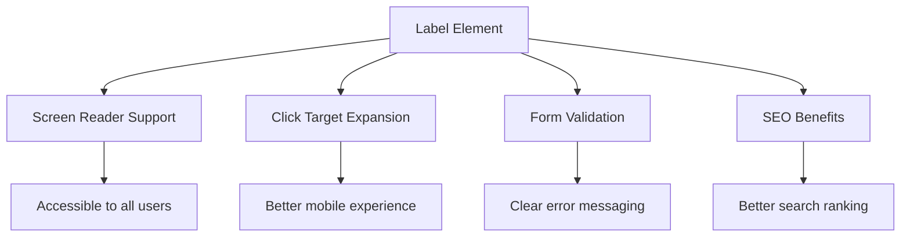
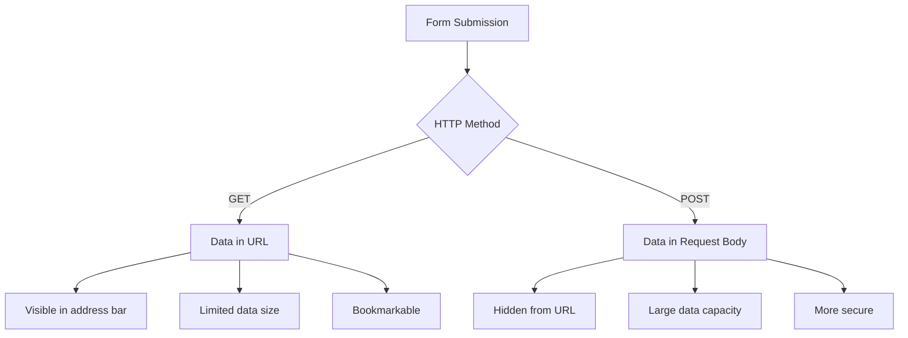
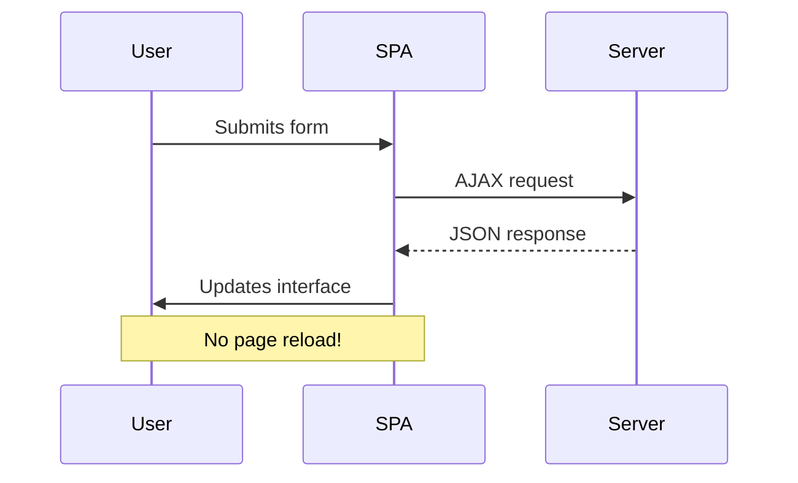
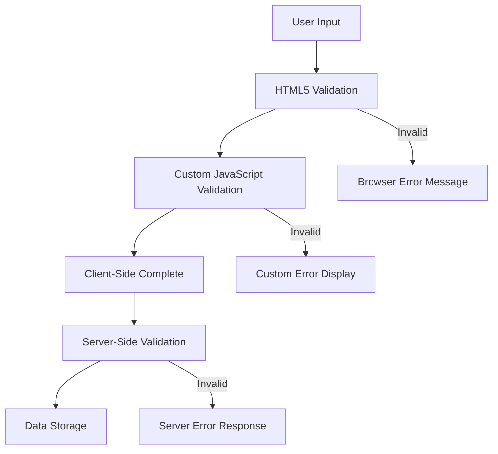
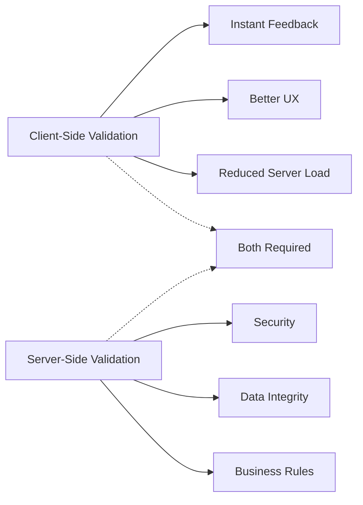

<!--
CO_OP_TRANSLATOR_METADATA:
{
  "original_hash": "b24f28fc46dd473aa9080f174182adde",
  "translation_date": "2025-10-24T15:51:58+00:00",
  "source_file": "7-bank-project/2-forms/README.md",
  "language_code": "uk"
}
-->
# Створення банківського додатку Частина 2: Створення форми входу та реєстрації

## Тест перед лекцією

[Тест перед лекцією](https://ff-quizzes.netlify.app/web/quiz/43)

Чи заповнювали ви коли-небудь форму онлайн, яка відхиляла формат вашої електронної пошти? Або втрачали всю інформацію після натискання кнопки "Надіслати"? Ми всі стикалися з такими неприємними ситуаціями.

Форми є мостом між вашими користувачами та функціональністю вашого додатку. Як і ретельні протоколи, які використовують диспетчери повітряного руху для безпечного керування літаками, добре спроєктовані форми забезпечують чіткий зворотний зв'язок і запобігають дорогим помилкам. Погано спроєктовані форми, навпаки, можуть відлякати користувачів швидше, ніж непорозуміння в переповненому аеропорту.

У цьому уроці ми перетворимо ваш статичний банківський додаток на інтерактивний. Ви навчитеся створювати форми, які перевіряють введені дані, взаємодіють із серверами та надають корисний зворотний зв'язок. Уявіть, що це як створення інтерфейсу управління, який дозволяє користувачам орієнтуватися у функціях вашого додатку.

Наприкінці уроку у вас буде повна система входу та реєстрації з перевіркою, яка допомагає користувачам досягти успіху, а не розчарування.

## Передумови

Перш ніж ми почнемо створювати форми, переконайтеся, що у вас все налаштовано правильно. Цей урок продовжує попередній, тому якщо ви пропустили його, можливо, вам варто повернутися і спочатку налаштувати основи.

### Необхідна підготовка

| Компонент | Статус | Опис |
|-----------|--------|-------------|
| [HTML Шаблони](../1-template-route/README.md) | ✅ Обов'язково | Основна структура вашого банківського додатку |
| [Node.js](https://nodejs.org) | ✅ Обов'язково | JavaScript середовище виконання для сервера |
| [Сервер Bank API](../api/README.md) | ✅ Обов'язково | Сервіс бекенду для зберігання даних |

> 💡 **Порада для розробників**: Ви будете запускати два окремі сервери одночасно – один для вашого фронтенд банківського додатку, а інший для бекенду API. Така конфігурація відображає реальну розробку, де фронтенд і бекенд працюють незалежно.

### Конфігурація серверів

**Ваше середовище розробки включатиме:**
- **Сервер фронтенду**: Обслуговує ваш банківський додаток (зазвичай порт `3000`)
- **Сервер бекенду API**: Обробляє зберігання та отримання даних (порт `5000`)
- **Обидва сервери** можуть працювати одночасно без конфліктів

**Перевірка з'єднання з API:**
```bash
curl http://localhost:5000/api
# Expected response: "Bank API v1.0.0"
```

**Якщо ви бачите відповідь версії API, ви готові продовжувати!**

---

## Розуміння HTML форм та елементів управління

HTML форми – це спосіб, яким користувачі взаємодіють із вашим веб-додатком. Уявіть їх як телеграфну систему, яка з'єднувала віддалені місця у 19 столітті – це протокол зв'язку між намірами користувача та відповіддю додатку. Коли вони спроєктовані з розумом, вони виявляють помилки, направляють форматування введення та надають корисні підказки.

Сучасні форми значно складніші за базові текстові поля. HTML5 представив спеціалізовані типи введення, які автоматично обробляють перевірку електронної пошти, форматування чисел та вибір дат. Ці покращення сприяють як доступності, так і зручності використання на мобільних пристроях.

### Основні елементи форми

**Будівельні блоки, які потрібні кожній формі:**

```html
<!-- Basic form structure -->
<form id="userForm" method="POST">
  <label for="username">Username</label>
  <input id="username" name="username" type="text" required>
  
  <button type="submit">Submit</button>
</form>
```

**Що робить цей код:**
- **Створює** контейнер форми з унікальним ідентифікатором
- **Визначає** HTTP метод для надсилання даних
- **Зв'язує** мітки з полями введення для доступності
- **Визначає** кнопку "Надіслати" для обробки форми

### Сучасні типи введення та атрибути

| Тип введення | Призначення | Приклад використання |
|--------------|-------------|-----------------------|
| `text` | Загальне текстове поле | `<input type="text" name="username">` |
| `email` | Перевірка електронної пошти | `<input type="email" name="email">` |
| `password` | Приховане введення тексту | `<input type="password" name="password">` |
| `number` | Введення чисел | `<input type="number" name="balance" min="0">` |
| `tel` | Номери телефонів | `<input type="tel" name="phone">` |

> 💡 **Перевага HTML5**: Використання специфічних типів введення забезпечує автоматичну перевірку, відповідні клавіатури для мобільних пристроїв та кращу підтримку доступності без додаткового JavaScript!

### Типи кнопок та їх поведінка

```html
<!-- Different button behaviors -->
<button type="submit">Save Data</button>     <!-- Submits the form -->
<button type="reset">Clear Form</button>    <!-- Resets all fields -->
<button type="button">Custom Action</button> <!-- No default behavior -->
```

**Що робить кожен тип кнопки:**
- **Кнопки "Надіслати"**: Запускають надсилання форми та передають дані на вказаний кінцевий пункт
- **Кнопки "Скинути"**: Відновлюють всі поля форми до початкового стану
- **Звичайні кнопки**: Не мають стандартної поведінки, вимагають власного JavaScript для функціональності

> ⚠️ **Важлива примітка**: Елемент `<input>` є самозакриваючим і не потребує закриваючого тегу. Сучасна найкраща практика – писати `<input>` без слешу.

### Створення форми входу

Тепер давайте створимо практичну форму входу, яка демонструє сучасні практики HTML форм. Ми почнемо з базової структури і поступово покращимо її, додаючи функції доступності та перевірки.

```html
<template id="login">
  <h1>Bank App</h1>
  <section>
    <h2>Login</h2>
    <form id="loginForm" novalidate>
      <div class="form-group">
        <label for="username">Username</label>
        <input id="username" name="user" type="text" required 
               autocomplete="username" placeholder="Enter your username">
      </div>
      <button type="submit">Login</button>
    </form>
  </section>
</template>
```

**Розбір того, що тут відбувається:**
- **Структурує** форму за допомогою семантичних елементів HTML5
- **Групує** пов'язані елементи у контейнерах `div` з осмисленими класами
- **Зв'язує** мітки з полями введення за допомогою атрибутів `for` та `id`
- **Включає** сучасні атрибути, такі як `autocomplete` та `placeholder` для покращення UX
- **Додає** `novalidate`, щоб обробляти перевірку за допомогою JavaScript замість стандартів браузера

### Сила правильних міток

**Чому мітки важливі для сучасної веб-розробки:**



**Що забезпечують правильні мітки:**
- **Дозволяють** екранним читачам чітко оголошувати поля форми
- **Розширюють** область кліку (натискання на мітку фокусується на введенні)
- **Покращують** мобільну зручність завдяки більшим зонам дотику
- **Підтримують** перевірку форми з осмисленими повідомленнями про помилки
- **Покращують** SEO, надаючи семантичне значення елементам форми

> 🎯 **Ціль доступності**: Кожне поле введення форми повинно мати пов'язану мітку. Ця проста практика робить ваші форми доступними для всіх, включаючи людей з обмеженими можливостями, і покращує досвід для всіх користувачів.

### Створення форми реєстрації

Форма реєстрації вимагає більш детальної інформації для створення повного облікового запису користувача. Давайте створимо її з використанням сучасних функцій HTML5 та покращеної доступності.

```html
<hr/>
<h2>Register</h2>
<form id="registerForm" novalidate>
  <div class="form-group">
    <label for="user">Username</label>
    <input id="user" name="user" type="text" required 
           autocomplete="username" placeholder="Choose a username">
  </div>
  
  <div class="form-group">
    <label for="currency">Currency</label>
    <input id="currency" name="currency" type="text" value="$" 
           required maxlength="3" placeholder="USD, EUR, etc.">
  </div>
  
  <div class="form-group">
    <label for="description">Account Description</label>
    <input id="description" name="description" type="text" 
           maxlength="100" placeholder="Personal savings, checking, etc.">
  </div>
  
  <div class="form-group">
    <label for="balance">Starting Balance</label>
    <input id="balance" name="balance" type="number" value="0" 
           min="0" step="0.01" placeholder="0.00">
  </div>
  
  <button type="submit">Create Account</button>
</form>
```

**У наведеному вище коді ми:**
- **Організували** кожне поле у контейнерах `div` для кращого стилювання та макету
- **Додали** відповідні атрибути `autocomplete` для підтримки автозаповнення браузером
- **Включили** корисний текст-підказку для направлення введення користувача
- **Встановили** розумні значення за замовчуванням за допомогою атрибуту `value`
- **Застосували** атрибути перевірки, такі як `required`, `maxlength` та `min`
- **Використали** `type="number"` для поля балансу з підтримкою десяткових чисел

### Дослідження типів введення та їх поведінки

**Сучасні типи введення забезпечують розширену функціональність:**

| Функція | Перевага | Приклад |
|---------|----------|---------|
| `type="number"` | Числова клавіатура на мобільних пристроях | Зручніше введення балансу |
| `step="0.01"` | Контроль десяткової точності | Дозволяє копійки у валюті |
| `autocomplete` | Автозаповнення браузером | Швидше заповнення форми |
| `placeholder` | Контекстні підказки | Направляє очікування користувача |

> 🎯 **Виклик доступності**: Спробуйте навігацію формами, використовуючи лише клавіатуру! Використовуйте `Tab` для переміщення між полями, `Space` для вибору чекбоксів та `Enter` для надсилання. Цей досвід допоможе вам зрозуміти, як користувачі екранних читачів взаємодіють із вашими формами.

## Розуміння методів надсилання форм

Коли хтось заповнює вашу форму і натискає "Надіслати", ці дані повинні кудись потрапити – зазвичай на сервер, який може їх зберегти. Є кілька способів, як це може відбуватися, і знання, який з них використовувати, може врятувати вас від головного болю в майбутньому.

Давайте розглянемо, що насправді відбувається, коли хтось натискає кнопку "Надіслати".

### Поведінка форми за замовчуванням

Спочатку давайте спостерігати, що відбувається при базовому надсиланні форми:

**Перевірте ваші поточні форми:**
1. Натисніть кнопку *Реєстрація* у вашій формі
2. Спостерігайте зміни в адресному рядку вашого браузера
3. Зверніть увагу, як сторінка перезавантажується і дані з'являються в URL


### Порівняння HTTP методів



**Розуміння відмінностей:**

| Метод | Сценарій використання | Розташування даних | Рівень безпеки | Обмеження розміру |
|-------|------------------------|--------------------|----------------|-------------------|
| `GET` | Пошукові запити, фільтри | Параметри URL | Низький (видимий) | ~2000 символів |
| `POST` | Облікові записи користувачів, конфіденційні дані | Тіло запиту | Вищий (прихований) | Практично без обмежень |

**Розуміння основних відмінностей:**
- **GET**: Додає дані форми до URL як параметри запиту (підходить для пошукових операцій)
- **POST**: Включає дані в тіло запиту (необхідно для конфіденційної інформації)
- **Обмеження GET**: Обмеження розміру, видимі дані, постійна історія браузера
- **Переваги POST**: Велика ємність даних, захист конфіденційності, підтримка завантаження файлів

> 💡 **Найкраща практика**: Використовуйте `GET` для пошукових форм і фільтрів (отримання даних), використовуйте `POST` для реєстрації користувачів, входу та створення даних.

### Конфігурація надсилання форми

Давайте налаштуємо вашу форму реєстрації для правильного спілкування з бекенд API за допомогою методу POST:

```html
<form id="registerForm" action="//localhost:5000/api/accounts" 
      method="POST" novalidate>
```

**Що робить ця конфігурація:**
- **Спрямовує** надсилання форми на кінцевий пункт API
- **Використовує** метод POST для безпечної передачі даних
- **Включає** `novalidate`, щоб обробляти перевірку за допомогою JavaScript

### Тестування надсилання форми

**Виконайте ці кроки для тестування вашої форми:**
1. **Заповніть** форму реєстрації вашою інформацією
2. **Натисніть** кнопку "Створити обліковий запис"
3. **Спостерігайте** відповідь сервера у вашому браузері


**Що ви повинні побачити:**
- **Браузер перенаправляє** на URL кінцевого пункту API
- **JSON-відповідь**, що містить дані вашого нового облікового запису
- **Підтвердження сервера**, що обліковий запис успішно створено

> 🧪 **Час експерименту**: Спробуйте зареєструватися з тим самим ім'ям користувача. Яку відповідь ви отримуєте? Це допоможе вам зрозуміти, як сервер обробляє дублікати даних та умови помилок.

### Розуміння JSON-відповідей

**Коли сервер успішно обробляє вашу форму:**
```json
{
  "user": "john_doe",
  "currency": "$",
  "description": "Personal savings",
  "balance": 100,
  "id": "unique_account_id"
}
```

**Ця відповідь підтверджує:**
- **Створення** нового облікового запису з вашими вказаними даними
- **Призначення** унікального ідентифікатора для майбутнього використання
- **Повернення** всієї інформації облікового запису для перевірки
- **Вказівку** на успішне збереження в базі даних

## Сучасна обробка форм за допомогою JavaScript

Традиційне надсилання форм викликає повне перезавантаження сторінки, подібно до того, як ранні космічні місії вимагали повного перезапуску систем для корекції курсу. Такий підхід порушує користувацький досвід і втрачає стан додатку.

Обробка форм за допомогою JavaScript працює як сучасні системи навігації космічних кораблів – здійснюючи коригування в реальному часі без втрати контексту навігації. Ми можемо перехоплювати надсилання форм, надавати миттєвий зворотний зв'язок, обробляти помилки та оновлювати інтерфейс на основі відповідей сервера, зберігаючи позицію користувача в додатку.

### Чому варто уникати перезавантаження сторінки?



**Переваги обробки форм за допомогою JavaScript:**
- **Зберігає** стан додатку та контекст користувача
- **Надає** миттєвий зворотний зв'язок та індикатори завантаження
- **Дозволяє** динамічну обробку помилок та перевірку
- **Створює** плавний, схожий на додаток користувацький досвід
- **Дозволяє** умовну логіку на основі відповідей сервера

### Перехід від традиційних до сучасних форм

**Виклики традиційного підход
- **Надає** детальні повідомлення про помилки для налагодження
- **Повертає** узгоджену структуру даних для успішних і помилкових випадків

### Потужність сучасного Fetch API

**Переваги Fetch API над старими методами:**

| Функція | Перевага | Реалізація |
|---------|----------|------------|
| На основі Promise | Чистий асинхронний код | `await fetch()` |
| Налаштування запитів | Повний контроль HTTP | Заголовки, методи, тіло |
| Обробка відповідей | Гнучкий аналіз даних | `.json()`, `.text()`, `.blob()` |
| Обробка помилок | Комплексне виявлення помилок | Блоки try/catch |

> 🎥 **Дізнайтеся більше**: [Відеоурок про Async/Await](https://youtube.com/watch?v=YwmlRkrxvkk) - Розуміння асинхронних шаблонів JavaScript для сучасної веб-розробки.

**Основні концепції для спілкування з сервером:**
- **Асинхронні функції** дозволяють призупинити виконання для очікування відповіді сервера
- **Ключове слово await** робить асинхронний код схожим на синхронний
- **Fetch API** забезпечує сучасні HTTP-запити на основі Promise
- **Обробка помилок** гарантує, що ваш додаток реагує на мережеві проблеми належним чином

### Завершення функції реєстрації

Об'єднаємо все разом у повноцінну, готову до використання функцію реєстрації:

```javascript
async function register() {
  const registerForm = document.getElementById('registerForm');
  const submitButton = registerForm.querySelector('button[type="submit"]');
  
  try {
    // Show loading state
    submitButton.disabled = true;
    submitButton.textContent = 'Creating Account...';
    
    // Process form data
    const formData = new FormData(registerForm);
    const jsonData = JSON.stringify(Object.fromEntries(formData));
    
    // Send to server
    const result = await createAccount(jsonData);
    
    if (result.error) {
      console.error('Registration failed:', result.error);
      alert(`Registration failed: ${result.error}`);
      return;
    }
    
    console.log('Account created successfully!', result);
    alert(`Welcome, ${result.user}! Your account has been created.`);
    
    // Reset form after successful registration
    registerForm.reset();
    
  } catch (error) {
    console.error('Unexpected error:', error);
    alert('An unexpected error occurred. Please try again.');
  } finally {
    // Restore button state
    submitButton.disabled = false;
    submitButton.textContent = 'Create Account';
  }
}
```

**Ця вдосконалена реалізація включає:**
- **Надає** візуальний зворотний зв'язок під час надсилання форми
- **Вимикає** кнопку надсилання, щоб уникнути дублювання запитів
- **Обробляє** як очікувані, так і несподівані помилки
- **Показує** зручні для користувача повідомлення про успіх і помилки
- **Скидає** форму після успішної реєстрації
- **Відновлює** стан інтерфейсу незалежно від результату

### Тестування вашої реалізації

**Відкрийте інструменти розробника браузера та протестуйте реєстрацію:**

1. **Відкрийте** консоль браузера (F12 → вкладка Console)
2. **Заповніть** форму реєстрації
3. **Натисніть** "Створити акаунт"
4. **Спостерігайте** повідомлення в консолі та зворотний зв'язок для користувача


**Що ви повинні побачити:**
- **Стан завантаження** з'являється на кнопці надсилання
- **Логи консолі** показують детальну інформацію про процес
- **Повідомлення про успіх** з'являється після успішного створення акаунта
- **Форма автоматично скидається** після успішного надсилання

> 🔒 **Міркування щодо безпеки**: Наразі дані передаються через HTTP, що не є безпечним для використання в продакшені. У реальних додатках завжди використовуйте HTTPS для шифрування передачі даних. Дізнайтеся більше про [безпеку HTTPS](https://en.wikipedia.org/wiki/HTTPS) і чому це важливо для захисту даних користувачів.

## Комплексна перевірка форми

Перевірка форми запобігає розчаруванню через виявлення помилок лише після надсилання. Як і численні резервні системи на Міжнародній космічній станції, ефективна перевірка використовує кілька рівнів захисту.

Оптимальний підхід поєднує перевірку на рівні браузера для миттєвого зворотного зв'язку, перевірку за допомогою JavaScript для покращення користувацького досвіду та перевірку на сервері для забезпечення безпеки та цілісності даних. Ця надмірність гарантує як задоволення користувачів, так і захист системи.

### Розуміння рівнів перевірки



**Стратегія багаторівневої перевірки:**
- **Перевірка HTML5**: Миттєві перевірки на рівні браузера
- **Перевірка JavaScript**: Користувацька логіка та покращений досвід
- **Перевірка на сервері**: Остаточна безпека та перевірка цілісності даних
- **Прогресивне покращення**: Працює навіть якщо JavaScript вимкнено

### Атрибути перевірки HTML5

**Сучасні інструменти перевірки, які доступні:**

| Атрибут | Призначення | Приклад використання | Поведінка браузера |
|---------|-------------|----------------------|--------------------|
| `required` | Обов'язкові поля | `<input required>` | Запобігає надсиланню порожніх полів |
| `minlength`/`maxlength` | Обмеження довжини тексту | `<input maxlength="20">` | Забезпечує обмеження символів |
| `min`/`max` | Числові діапазони | `<input min="0" max="1000">` | Перевіряє межі чисел |
| `pattern` | Користувацькі правила регулярних виразів | `<input pattern="[A-Za-z]+">` | Відповідає певним форматам |
| `type` | Перевірка типу даних | `<input type="email">` | Перевірка специфічних форматів |

### Стилізація перевірки за допомогою CSS

**Створіть візуальний зворотний зв'язок для станів перевірки:**

```css
/* Valid input styling */
input:valid {
  border-color: #28a745;
  background-color: #f8fff9;
}

/* Invalid input styling */
input:invalid {
  border-color: #dc3545;
  background-color: #fff5f5;
}

/* Focus states for better accessibility */
input:focus:valid {
  box-shadow: 0 0 0 0.2rem rgba(40, 167, 69, 0.25);
}

input:focus:invalid {
  box-shadow: 0 0 0 0.2rem rgba(220, 53, 69, 0.25);
}
```

**Що досягають ці візуальні підказки:**
- **Зелені рамки**: Вказують на успішну перевірку, як зелене світло на командному пункті
- **Червоні рамки**: Сигналізують про помилки перевірки, які потребують уваги
- **Підсвічування фокусу**: Забезпечує чіткий візуальний контекст для поточного місця введення
- **Послідовна стилізація**: Встановлює передбачувані шаблони інтерфейсу, які користувачі можуть запам'ятати

> 💡 **Корисна порада**: Використовуйте псевдокласи CSS `:valid` і `:invalid`, щоб забезпечити миттєвий візуальний зворотний зв'язок під час введення, створюючи чуйний і корисний інтерфейс.

### Реалізація комплексної перевірки

Давайте вдосконалимо вашу форму реєстрації, додавши надійну перевірку, яка забезпечує чудовий користувацький досвід і якість даних:

```html
<form id="registerForm" method="POST" novalidate>
  <div class="form-group">
    <label for="user">Username <span class="required">*</span></label>
    <input id="user" name="user" type="text" required 
           minlength="3" maxlength="20" 
           pattern="[a-zA-Z0-9_]+" 
           autocomplete="username"
           title="Username must be 3-20 characters, letters, numbers, and underscores only">
    <small class="form-text">Choose a unique username (3-20 characters)</small>
  </div>
  
  <div class="form-group">
    <label for="currency">Currency <span class="required">*</span></label>
    <input id="currency" name="currency" type="text" required 
           value="$" maxlength="3" 
           pattern="[A-Z$€£¥₹]+" 
           title="Enter a valid currency symbol or code">
    <small class="form-text">Currency symbol (e.g., $, €, £)</small>
  </div>
  
  <div class="form-group">
    <label for="description">Account Description</label>
    <input id="description" name="description" type="text" 
           maxlength="100" 
           placeholder="Personal savings, checking, etc.">
    <small class="form-text">Optional description (up to 100 characters)</small>
  </div>
  
  <div class="form-group">
    <label for="balance">Starting Balance</label>
    <input id="balance" name="balance" type="number" 
           value="0" min="0" step="0.01" 
           title="Enter a positive number for your starting balance">
    <small class="form-text">Initial account balance (minimum $0.00)</small>
  </div>
  
  <button type="submit">Create Account</button>
</form>
```

**Розуміння вдосконаленої перевірки:**
- **Поєднує** індикатори обов'язкових полів із корисними описами
- **Включає** атрибути `pattern` для перевірки формату
- **Надає** атрибути `title` для доступності та підказок
- **Додає** допоміжний текст для керування введенням користувача
- **Використовує** семантичну структуру HTML для кращої доступності

### Розширені правила перевірки

**Що досягає кожне правило перевірки:**

| Поле | Правила перевірки | Користувацька перевага |
|------|-------------------|------------------------|
| Ім'я користувача | `required`, `minlength="3"`, `maxlength="20"`, `pattern="[a-zA-Z0-9_]+"` | Забезпечує дійсні, унікальні ідентифікатори |
| Валюта | `required`, `maxlength="3"`, `pattern="[A-Z$€£¥₹]+"` | Приймає загальні символи валют |
| Баланс | `min="0"`, `step="0.01"`, `type="number"` | Запобігає негативним балансам |
| Опис | `maxlength="100"` | Розумні обмеження довжини |

### Тестування поведінки перевірки

**Спробуйте ці сценарії перевірки:**
1. **Надішліть** форму з порожніми обов'язковими полями
2. **Введіть** ім'я користувача коротше 3 символів
3. **Спробуйте** спеціальні символи в полі імені користувача
4. **Введіть** негативну суму балансу


**Що ви спостерігатимете:**
- **Браузер показує** нативні повідомлення про перевірку
- **Зміни стилізації** на основі станів `:valid` і `:invalid`
- **Надсилання форми** блокується, поки всі перевірки не пройдуть
- **Фокус автоматично** переміщується на перше поле з помилкою

### Перевірка на клієнті vs сервері



**Чому потрібні обидва рівні:**
- **Перевірка на клієнті**: Забезпечує миттєвий зворотний зв'язок і покращує користувацький досвід
- **Перевірка на сервері**: Гарантує безпеку та обробляє складні бізнес-правила
- **Комбінований підхід**: Створює надійні, зручні та безпечні додатки
- **Прогресивне покращення**: Працює навіть якщо JavaScript вимкнено

> 🛡️ **Нагадування про безпеку**: Ніколи не покладайтеся лише на перевірку на клієнті! Зловмисники можуть обійти перевірки на клієнті, тому перевірка на сервері є важливою для безпеки та цілісності даних.

---

---

## Виклик GitHub Copilot Agent 🚀

Використовуйте режим Agent, щоб виконати наступний виклик:

**Опис:** Покращіть форму реєстрації, додавши комплексну перевірку на клієнті та зворотний зв'язок для користувача. Цей виклик допоможе вам практикувати перевірку форм, обробку помилок і покращення користувацького досвіду за допомогою інтерактивного зворотного зв'язку.

**Завдання:** Створіть повну систему перевірки форми реєстрації, яка включає: 1) Миттєвий зворотний зв'язок для кожного поля під час введення, 2) Користувацькі повідомлення про перевірку, які з'являються під кожним полем введення, 3) Поле підтвердження пароля з перевіркою відповідності, 4) Візуальні індикатори (наприклад, зелені галочки для дійсних полів і червоні попередження для недійсних), 5) Кнопка надсилання, яка стає активною лише тоді, коли всі перевірки пройдені. Використовуйте атрибути перевірки HTML5, CSS для стилізації станів перевірки та JavaScript для інтерактивної поведінки.

Дізнайтеся більше про [режим Agent](https://code.visualstudio.com/blogs/2025/02/24/introducing-copilot-agent-mode) тут.

## 🚀 Виклик

Показати повідомлення про помилку в HTML, якщо користувач вже існує.

Ось приклад того, як може виглядати фінальна сторінка входу після невеликого стилізування:


## Післялекційний тест

[Післялекційний тест](https://ff-quizzes.netlify.app/web/quiz/44)

## Огляд і самостійне навчання

Розробники стали дуже креативними у своїх зусиллях щодо створення форм, особливо щодо стратегій перевірки. Дізнайтеся про різні потоки форм, переглядаючи [CodePen](https://codepen.com); чи можете ви знайти цікаві та надихаючі форми?

## Завдання

[Стилізуйте ваш банківський додаток](assignment.md)

---

**Відмова від відповідальності**:  
Цей документ був перекладений за допомогою сервісу автоматичного перекладу [Co-op Translator](https://github.com/Azure/co-op-translator). Хоча ми прагнемо до точності, будь ласка, майте на увазі, що автоматичні переклади можуть містити помилки або неточності. Оригінальний документ на його рідній мові слід вважати авторитетним джерелом. Для критичної інформації рекомендується професійний людський переклад. Ми не несемо відповідальності за будь-які непорозуміння або неправильні тлумачення, що виникають внаслідок використання цього перекладу.