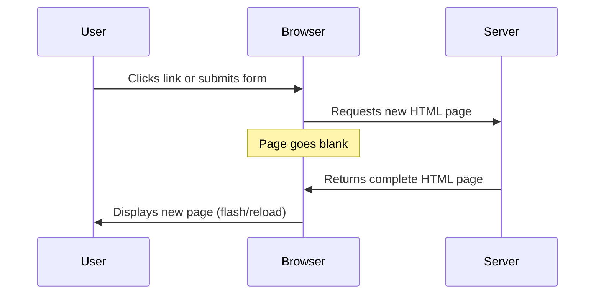
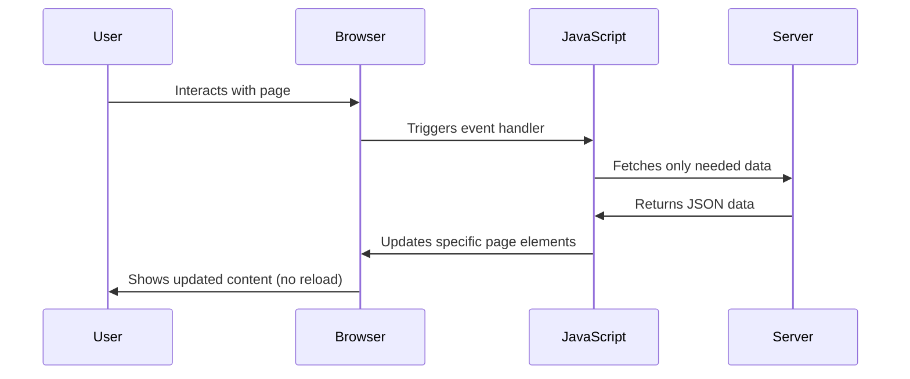
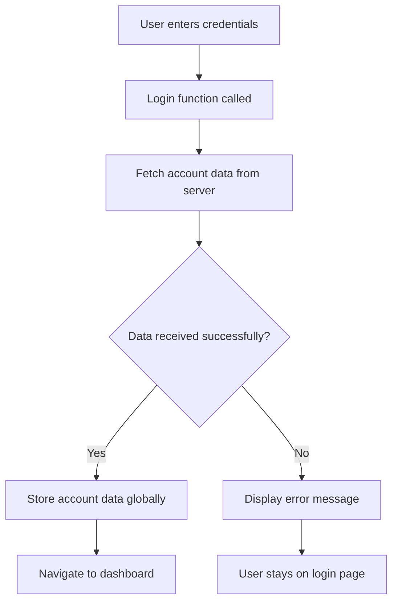
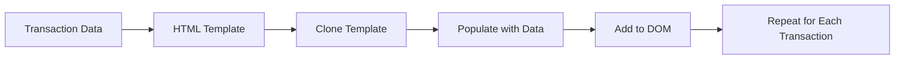

<!--
CO_OP_TRANSLATOR_METADATA:
{
  "original_hash": "2c1164912414820c8efd699b43f64954",
  "translation_date": "2025-10-24T15:47:34+00:00",
  "source_file": "7-bank-project/3-data/README.md",
  "language_code": "uk"
}
-->
# Створення банківського додатку, частина 3: Методи отримання та використання даних

Згадайте комп'ютер Enterprise зі Star Trek - коли капітан Пікард запитує статус корабля, інформація з'являється миттєво, без перезавантаження інтерфейсу. Саме такий плавний потік інформації ми створюємо тут за допомогою динамічного отримання даних.

Зараз ваш банківський додаток схожий на друковану газету - інформативний, але статичний. Ми перетворимо його на щось схоже на центр управління місіями NASA, де дані постійно оновлюються в реальному часі, не перериваючи робочий процес користувача.

Ви навчитеся асинхронно взаємодіяти з серверами, обробляти дані, які надходять у різний час, і перетворювати необроблену інформацію на щось корисне для ваших користувачів. Це різниця між демонстраційним і готовим до використання програмним забезпеченням.

## Тест перед лекцією

[Тест перед лекцією](https://ff-quizzes.netlify.app/web/quiz/45)

### Передумови

Перед тим як зануритися в отримання даних, переконайтеся, що у вас готові наступні компоненти:

- **Попередній урок**: Завершіть [Форму входу та реєстрації](../2-forms/README.md) - ми будемо будувати на цій основі
- **Локальний сервер**: Встановіть [Node.js](https://nodejs.org) і [запустіть сервер API](../api/README.md), щоб забезпечити дані облікового запису
- **З'єднання з API**: Перевірте з'єднання з сервером за допомогою цієї команди:

```bash
curl http://localhost:5000/api
# Expected response: "Bank API v1.0.0"
```

Цей швидкий тест забезпечує правильну взаємодію всіх компонентів:
- Перевіряє, чи Node.js працює правильно на вашій системі
- Підтверджує, що ваш сервер API активний і відповідає
- Переконується, що ваш додаток може досягти сервера (як перевірка радіозв'язку перед місією)

---

## Розуміння отримання даних у сучасних веб-додатках

Спосіб обробки даних веб-додатками значно еволюціонував за останні два десятиліття. Розуміння цієї еволюції допоможе вам оцінити, чому сучасні техніки, такі як AJAX і Fetch API, є настільки потужними і чому вони стали необхідними інструментами для веб-розробників.

Давайте розглянемо, як працювали традиційні веб-сайти у порівнянні з динамічними, чутливими додатками, які ми створюємо сьогодні.

### Традиційні багатосторінкові додатки (MPA)

У ранні дні вебу кожен клік був схожий на зміну каналів на старому телевізорі - екран ставав порожнім, а потім повільно налаштовувався на новий контент. Це була реальність ранніх веб-додатків, де кожна взаємодія означала повне перезавантаження сторінки.




**Чому цей підхід здавався незручним:**
- Кожен клік означав повне перезавантаження сторінки
- Користувачів переривали ці дратівливі спалахи сторінок
- Ваше інтернет-з'єднання працювало понаднормово, завантажуючи той самий заголовок і підвал знову і знову
- Додатки більше нагадували перегляд картотеки, ніж використання програмного забезпечення

### Сучасні односторінкові додатки (SPA)

AJAX (асинхронний JavaScript і XML) повністю змінив цей підхід. Як модульний дизайн Міжнародної космічної станції, де астронавти можуть замінити окремі компоненти без перебудови всієї структури, AJAX дозволяє нам оновлювати конкретні частини веб-сторінки без перезавантаження всього. Незважаючи на те, що в назві згадується XML, сьогодні ми здебільшого використовуємо JSON, але основний принцип залишається: оновлювати лише те, що потрібно змінити.




**Чому SPA здаються набагато кращими:**
- Оновлюються лише ті частини, які дійсно змінилися (розумно, правда?)
- Більше ніяких різких переривань - ваші користувачі залишаються у своєму потоці
- Менше даних передається через мережу, що означає швидше завантаження
- Все здається швидким і чутливим, як додатки на вашому телефоні

### Еволюція до сучасного Fetch API

Сучасні браузери надають [`Fetch` API](https://developer.mozilla.org/docs/Web/API/Fetch_API), який замінює старий [`XMLHttpRequest`](https://developer.mozilla.org/docs/Web/API/XMLHttpRequest/Using_XMLHttpRequest). Як різниця між використанням телеграфу і електронної пошти, Fetch API використовує обіцянки для чистішого асинхронного коду і природно обробляє JSON.

| Функція | XMLHttpRequest | Fetch API |
|---------|----------------|----------|
| **Синтаксис** | Складний, заснований на зворотних викликах | Чистий, заснований на обіцянках |
| **Обробка JSON** | Потрібен ручний аналіз | Вбудований метод `.json()` |
| **Обробка помилок** | Обмежена інформація про помилки | Детальна інформація про помилки |
| **Сучасна підтримка** | Сумісність зі спадщиною | Обіцянки ES6+ і async/await |

> 💡 **Сумісність з браузерами**: Хороші новини - Fetch API працює у всіх сучасних браузерах! Якщо вам цікаві конкретні версії, [caniuse.com](https://caniuse.com/fetch) має повну історію сумісності.
> 
**Основний висновок:**
- Чудово працює у Chrome, Firefox, Safari та Edge (загалом скрізь, де є ваші користувачі)
- Лише Internet Explorer потребує додаткової допомоги (і чесно кажучи, час відпустити IE)
- Ідеально підходить для елегантних async/await патернів, які ми будемо використовувати пізніше

### Реалізація системи входу та отримання даних

Тепер давайте реалізуємо систему входу, яка перетворить ваш банківський додаток зі статичного дисплея на функціональний додаток. Як протоколи автентифікації, що використовуються у захищених військових об'єктах, ми перевіримо облікові дані користувача, а потім надамо доступ до його конкретних даних.

Ми будемо будувати це поступово, починаючи з базової автентифікації, а потім додаючи можливості отримання даних.

#### Крок 1: Створення основи функції входу

Відкрийте ваш файл `app.js` і додайте нову функцію `login`. Вона буде обробляти процес автентифікації користувача:

```javascript
async function login() {
  const loginForm = document.getElementById('loginForm');
  const user = loginForm.user.value;
}
```

**Розберемо це:**
- Ключове слово `async`? Воно говорить JavaScript: "ей, ця функція може потребувати очікування"
- Ми знаходимо нашу форму на сторінці (нічого складного, просто знаходимо її за ID)
- Потім витягуємо те, що користувач ввів як своє ім'я користувача
- Ось цікавий трюк: ви можете отримати доступ до будь-якого вводу форми за його атрибутом `name` - не потрібно додаткових викликів getElementById!

> 💡 **Шаблон доступу до форми**: Кожен елемент управління формою може бути доступний за його ім'ям (встановленим у HTML за допомогою атрибуту `name`) як властивість елемента форми. Це забезпечує чистий, читабельний спосіб отримання даних форми.

#### Крок 2: Створення функції отримання даних облікового запису

Далі ми створимо спеціальну функцію для отримання даних облікового запису з сервера. Це слідує тому ж шаблону, що і ваша функція реєстрації, але зосереджено на отриманні даних:

```javascript
async function getAccount(user) {
  try {
    const response = await fetch('//localhost:5000/api/accounts/' + encodeURIComponent(user));
    return await response.json();
  } catch (error) {
    return { error: error.message || 'Unknown error' };
  }
}
```

**Що виконує цей код:**
- **Використовує** сучасний `fetch` API для асинхронного запиту даних
- **Конструює** URL запиту GET з параметром імені користувача
- **Застосовує** `encodeURIComponent()` для безпечної обробки спеціальних символів у URL
- **Перетворює** відповідь у формат JSON для легкого маніпулювання даними
- **Обробляє** помилки акуратно, повертаючи об'єкт помилки замість аварійного завершення

> ⚠️ **Примітка щодо безпеки**: Функція `encodeURIComponent()` обробляє спеціальні символи у URL. Як системи кодування, що використовуються у військових комунікаціях, вона забезпечує, що ваше повідомлення прибуде точно так, як задумано, запобігаючи неправильному тлумаченню символів, таких як "#" або "&".
> 
**Чому це важливо:**
- Запобігає тому, щоб спеціальні символи ламали URL
- Захищає від атак маніпуляції URL
- Забезпечує, що ваш сервер отримує задуманий набір даних
- Слідує практикам безпечного кодування

#### Розуміння HTTP GET запитів

Ось що може вас здивувати: коли ви використовуєте `fetch` без додаткових опцій, він автоматично створює [`GET`](https://developer.mozilla.org/docs/Web/HTTP/Methods/GET) запит. Це ідеально для того, що ми робимо - запитуємо сервер: "ей, чи можу я побачити дані цього користувача?"

Думайте про GET запити як про ввічливе прохання позичити книгу з бібліотеки - ви запитуєте, щоб побачити щось, що вже існує. POST запити (які ми використовували для реєстрації) більше схожі на подання нової книги для додавання до колекції.

| GET запит | POST запит |
|-----------|-----------|
| **Призначення** | Отримання існуючих даних | Надсилання нових даних на сервер |
| **Параметри** | У шляху URL/рядку запиту | У тілі запиту |
| **Кешування** | Може кешуватися браузерами | Зазвичай не кешується |
| **Безпека** | Видимий у URL/журналах | Прихований у тілі запиту |

#### Крок 3: Об'єднання всього разом

Тепер найзадовільніша частина - давайте підключимо вашу функцію отримання даних облікового запису до процесу входу. Тут все стає на свої місця:

```javascript
async function login() {
  const loginForm = document.getElementById('loginForm');
  const user = loginForm.user.value;
  const data = await getAccount(user);

  if (data.error) {
    return console.log('loginError', data.error);
  }

  account = data;
  navigate('/dashboard');
}
```

Ця функція слідує чіткій послідовності:
- Витягує ім'я користувача з вводу форми
- Запитує дані облікового запису користувача з сервера
- Обробляє будь-які помилки, які виникають під час процесу
- Зберігає дані облікового запису та переходить на панель управління у разі успіху

> 🎯 **Патерн Async/Await**: Оскільки `getAccount` є асинхронною функцією, ми використовуємо ключове слово `await`, щоб призупинити виконання до отримання відповіді від сервера. Це запобігає продовженню коду з невизначеними даними.

#### Крок 4: Створення місця для ваших даних

Вашому додатку потрібне місце, де він буде зберігати інформацію про обліковий запис після її завантаження. Думайте про це як про короткострокову пам'ять вашого додатку - місце, де зберігаються дані поточного користувача. Додайте цей рядок на початку вашого файлу `app.js`:

```javascript
// This holds the current user's account data
let account = null;
```

**Чому це необхідно:**
- Зберігає дані облікового запису доступними з будь-якого місця у вашому додатку
- Початок з `null` означає "поки що ніхто не увійшов"
- Оновлюється, коли хтось успішно входить або реєструється
- Діє як єдине джерело правди - ніякої плутанини щодо того, хто увійшов

#### Крок 5: Підключення вашої форми

Тепер давайте підключимо вашу нову функцію входу до HTML форми. Оновіть тег форми ось так:

```html
<form id="loginForm" action="javascript:login()">
  <!-- Your existing form inputs -->
</form>
```

**Що робить ця маленька зміна:**
- Зупиняє форму від її стандартної поведінки "перезавантажити всю сторінку"
- Викликає вашу власну функцію JavaScript замість цього
- Зберігає все плавним і схожим на односторінковий додаток
- Дає вам повний контроль над тим, що відбувається, коли користувачі натискають "Вхід"

#### Крок 6: Покращення функції реєстрації

Для узгодженості оновіть вашу функцію `register`, щоб також зберігати дані облікового запису та переходити на панель управління:

```javascript
// Add these lines at the end of your register function
account = result;
navigate('/dashboard');
```

**Це покращення забезпечує:**
- **Плавний** перехід від реєстрації до панелі управління
- **Послідовний** користувацький досвід між процесами входу та реєстрації
- **Миттєвий** доступ до даних облікового запису після успішної реєстрації

#### Тестування вашої реалізації



**Час випробувати це:**
1. Створіть новий обліковий запис, щоб переконатися, що все працює
2. Спробуйте увійти з тими ж обліковими даними
3. Загляньте в консоль вашого браузера (F12), якщо щось здається неправильним
4. Переконайтеся, що ви потрапляєте на панель управління після успішного входу

Якщо щось не працює, не панікуйте! Більшість проблем - це прості виправлення, такі як друкарські помилки або забуття запустити сервер API.

#### Коротке слово про магію між різними джерелами

Ви можете запитати: "Як мій веб-додаток спілкується з цим сервером API, якщо вони працюють на різних портах?" Чудове запитання! Це стосується того, з чим кожен веб-розробник стикається рано чи пізно.

> 🔒 **Безпека між джерелами**: Браузери застосовують "політику одного джерела", щоб запобігти несанкціонованій комунікації між різними доменами. Як система перевірки на вході до Пентагону, вони перевіряють, чи дозволена комунікація, перш ніж дозволити передачу даних.
> 
**У нашій конфігурації:**
- Ваш веб-додаток працює на `localhost:3000` (сервер розробки)
- Ваш сервер API працює на `localhost:5000` (сервер бекенду)
- Сервер API включає [заголовки CORS](https://developer.mozilla.org/docs/Web/HTTP/CORS), які явно дозволяють комунікацію з вашим веб-додатком

Ця конфігурація відображає реальну розробку, де фронтенд і бекенд додатки зазвичай працюють на окремих серверах.

> 📚 **Дізнайтеся більше**: Глибше зануртеся в API та отримання даних за допомогою цього детального [модуля Microsoft Learn про API](https://docs.microsoft.com/learn/modules/use-apis-discover-museum-art/?WT.mc_id=academic-77807-sagibbon).

## Перетворення ваших даних у HTML

Тепер ми зробимо отримані дані видимими для користувачів через маніпуляцію DOM. Як процес розробки фотографій у тем
Для більш складного контенту, комбінуйте [`document.createElement()`](https://developer.mozilla.org/docs/Web/API/Document/createElement) з методом [`append()`](https://developer.mozilla.org/docs/Web/API/ParentNode/append):

```javascript
// Safe way to create new elements
const transactionItem = document.createElement('div');
transactionItem.className = 'transaction-item';
transactionItem.textContent = `${transaction.date}: ${transaction.description}`;
container.append(transactionItem);
```

**Розуміння цього підходу:**
- **Створює** нові елементи DOM програмно
- **Забезпечує** повний контроль над атрибутами та вмістом елементів
- **Дозволяє** створювати складні, вкладені структури елементів
- **Зберігає** безпеку, розділяючи структуру від контенту

> ⚠️ **Міркування щодо безпеки**: Хоча [`innerHTML`](https://developer.mozilla.org/docs/Web/API/Element/innerHTML) часто зустрічається в багатьох навчальних матеріалах, він може виконувати вбудовані скрипти. Як і протоколи безпеки в CERN, які запобігають виконанню несанкціонованого коду, використання `textContent` та `createElement` є більш безпечними альтернативами.
> 
**Ризики використання innerHTML:**
- Виконує будь-які теги `<script>` у даних користувача
- Вразливий до атак із впровадженням коду
- Створює потенційні проблеми з безпекою
- Безпечні альтернативи, які ми використовуємо, забезпечують еквівалентну функціональність

### Робимо помилки зрозумілими для користувачів

На даний момент помилки входу відображаються лише в консолі браузера, що є невидимим для користувачів. Як різниця між внутрішньою діагностикою пілота та інформаційною системою для пасажирів, ми повинні передавати важливу інформацію через відповідний канал.

Реалізація видимих повідомлень про помилки надає користувачам миттєвий зворотний зв'язок про те, що пішло не так і як діяти далі.

#### Крок 1: Додайте місце для повідомлень про помилки

Спочатку створимо місце для повідомлень про помилки у вашому HTML. Додайте це прямо перед кнопкою входу, щоб користувачі бачили це природно:

```html
<!-- This is where error messages will appear -->
<div id="loginError" role="alert"></div>
<button>Login</button>
```

**Що тут відбувається:**
- Ми створюємо порожній контейнер, який залишається невидимим, поки не знадобиться
- Він розташований там, де користувачі природно дивляться після натискання "Увійти"
- Атрибут `role="alert"` - це гарний штрих для екранних читачів - він повідомляє допоміжним технологіям "ей, це важливо!"
- Унікальний `id` дає нашому JavaScript легку ціль

#### Крок 2: Створіть зручну допоміжну функцію

Давайте створимо невелику утиліту, яка може оновлювати текст будь-якого елемента. Це одна з тих функцій "напиши один раз, використовуй скрізь", яка заощадить вам час:

```javascript
function updateElement(id, text) {
  const element = document.getElementById(id);
  element.textContent = text;
}
```

**Переваги функції:**
- Простий інтерфейс, який вимагає лише ID елемента та текстового вмісту
- Безпечно знаходить і оновлює елементи DOM
- Повторюваний шаблон, який зменшує дублювання коду
- Забезпечує узгоджену поведінку оновлення в додатку

#### Крок 3: Показуйте помилки там, де їх можуть побачити користувачі

Тепер замінимо приховане повідомлення консолі на те, що користувачі дійсно можуть побачити. Оновіть вашу функцію входу:

```javascript
// Instead of just logging to console, show the user what's wrong
if (data.error) {
  return updateElement('loginError', data.error);
}
```

**Ця невелика зміна має великий вплив:**
- Повідомлення про помилки з'являються саме там, де користувачі дивляться
- Більше ніяких загадкових тихих збоїв
- Користувачі отримують миттєвий, зрозумілий зворотний зв'язок
- Ваш додаток починає виглядати професійно та продумано

Тепер, коли ви тестуєте з недійсним обліковим записом, ви побачите корисне повідомлення про помилку прямо на сторінці!


#### Крок 4: Бути інклюзивним з доступністю

Ось що круто в тому `role="alert"`, який ми додали раніше - це не просто декорація! Цей маленький атрибут створює так званий [Live Region](https://developer.mozilla.org/docs/Web/Accessibility/ARIA/ARIA_Live_Regions), який негайно оголошує зміни екранним читачам:

```html
<div id="loginError" role="alert"></div>
```

**Чому це важливо:**
- Користувачі екранних читачів чують повідомлення про помилку, як тільки воно з'являється
- Усі отримують однакову важливу інформацію, незалежно від того, як вони навігають
- Це простий спосіб зробити ваш додаток доступним для більшої кількості людей
- Показує, що вам важливо створювати інклюзивний досвід

Маленькі штрихи, як цей, відрізняють хороших розробників від чудових!

#### Крок 5: Застосуйте той самий шаблон до реєстрації

Для узгодженості реалізуйте однакову обробку помилок у вашій формі реєстрації:

1. **Додайте** елемент для відображення помилок у вашому HTML реєстрації:
```html
<div id="registerError" role="alert"></div>
```

2. **Оновіть** вашу функцію реєстрації, щоб використовувати той самий шаблон відображення помилок:
```javascript
if (data.error) {
  return updateElement('registerError', data.error);
}
```

**Переваги узгодженої обробки помилок:**
- **Забезпечує** однаковий досвід користувача у всіх формах
- **Зменшує** когнітивне навантаження, використовуючи знайомі шаблони
- **Спрощує** обслуговування за допомогою повторюваного коду
- **Гарантує**, що стандарти доступності дотримуються у всьому додатку

## Створення вашої динамічної панелі управління

Тепер ми перетворимо вашу статичну панель управління на динамічний інтерфейс, який відображає реальні дані облікового запису. Як різниця між роздрукованим розкладом рейсів і живими табло відправлення в аеропортах, ми переходимо від статичної інформації до реального часу, чутливих до змін дисплеїв.

Використовуючи техніки маніпуляції DOM, які ви вивчили, ми створимо панель управління, яка автоматично оновлюється з поточною інформацією облікового запису.

### Знайомство з вашими даними

Перш ніж почати будувати, давайте поглянемо, які дані ваш сервер надсилає назад. Коли хтось успішно входить, ось скарбниця інформації, з якою ви можете працювати:

```json
{
  "user": "test",
  "currency": "$",
  "description": "Test account",
  "balance": 75,
  "transactions": [
    { "id": "1", "date": "2020-10-01", "object": "Pocket money", "amount": 50 },
    { "id": "2", "date": "2020-10-03", "object": "Book", "amount": -10 },
    { "id": "3", "date": "2020-10-04", "object": "Sandwich", "amount": -5 }
  ]
}
```

**Ця структура даних забезпечує:**
- **`user`**: Ідеально для персоналізації досвіду ("Ласкаво просимо назад, Сара!")
- **`currency`**: Забезпечує правильне відображення грошових сум
- **`description`**: Дружнє ім'я для облікового запису
- **`balance`**: Найважливіший поточний баланс
- **`transactions`**: Повна історія транзакцій з усіма деталями

Все, що вам потрібно для створення професійної панелі управління банківським рахунком!

> 💡 **Корисна порада**: Хочете побачити вашу панель управління в дії прямо зараз? Використовуйте ім'я користувача `test`, коли входите - воно вже завантажене з прикладом даних, щоб ви могли побачити, як все працює, не створюючи транзакції спочатку.
> 
**Чому тестовий обліковий запис зручний:**
- Вже містить реалістичні приклади даних
- Ідеально для перегляду, як відображаються транзакції
- Чудово підходить для тестування функцій вашої панелі управління
- Зберігає вас від необхідності створювати тестові дані вручну

### Створення елементів відображення панелі управління

Давайте побудуємо ваш інтерфейс панелі управління крок за кроком, починаючи з інформації про обліковий запис, а потім переходячи до більш складних функцій, таких як списки транзакцій.

#### Крок 1: Оновіть структуру вашого HTML

Спочатку замініть статичний розділ "Баланс" на динамічні елементи-заповнювачі, які ваш JavaScript може заповнити:

```html
<section>
  Balance: <span id="balance"></span><span id="currency"></span>
</section>
```

Далі додайте розділ для опису облікового запису. Оскільки це діє як заголовок для контенту панелі управління, використовуйте семантичний HTML:

```html
<h2 id="description"></h2>
```

**Розуміння структури HTML:**
- **Використовує** окремі елементи `<span>` для балансу та валюти для індивідуального контролю
- **Застосовує** унікальні ID до кожного елемента для цілей JavaScript
- **Слідує** семантичному HTML, використовуючи `<h2>` для опису облікового запису
- **Створює** логічну ієрархію для екранних читачів та SEO

> ✅ **Інсайт доступності**: Опис облікового запису функціонує як заголовок для контенту панелі управління, тому він позначений семантично як заголовок. Дізнайтеся більше про те, як [структура заголовків](https://www.nomensa.com/blog/2017/how-structure-headings-web-accessibility) впливає на доступність. Чи можете ви визначити інші елементи на вашій сторінці, які можуть отримати користь від тегів заголовків?

#### Крок 2: Створіть функцію оновлення панелі управління

Тепер створіть функцію, яка заповнює вашу панель управління реальними даними облікового запису:

```javascript
function updateDashboard() {
  if (!account) {
    return navigate('/login');
  }

  updateElement('description', account.description);
  updateElement('balance', account.balance.toFixed(2));
  updateElement('currency', account.currency);
}
```

**Крок за кроком, ось що робить ця функція:**
- **Перевіряє**, чи існують дані облікового запису перед продовженням
- **Перенаправляє** неавторизованих користувачів назад на сторінку входу
- **Оновлює** опис облікового запису, використовуючи повторювану функцію `updateElement`
- **Форматує** баланс, щоб завжди показувати два десяткових знаки
- **Відображає** відповідний символ валюти

> 💰 **Форматування грошей**: Метод [`toFixed(2)`](https://developer.mozilla.org/docs/Web/JavaScript/Reference/Global_Objects/Number/toFixed) - це рятівник! Він гарантує, що ваш баланс завжди виглядає як реальні гроші - "75.00" замість просто "75". Ваші користувачі оцінять знайоме форматування валюти.

#### Крок 3: Переконайтеся, що ваша панель управління оновлюється

Щоб ваша панель управління оновлювалася з актуальними даними кожного разу, коли хтось її відвідує, нам потрібно підключитися до вашої системи навігації. Якщо ви завершили [завдання уроку 1](../1-template-route/assignment.md), це має бути знайомим. Якщо ні, не хвилюйтеся - ось що вам потрібно:

Додайте це в кінці вашої функції `updateRoute()`:

```javascript
if (typeof route.init === 'function') {
  route.init();
}
```

Потім оновіть ваші маршрути, щоб включити ініціалізацію панелі управління:

```javascript
const routes = {
  '/login': { templateId: 'login' },
  '/dashboard': { templateId: 'dashboard', init: updateDashboard }
};
```

**Що робить цей розумний налаштування:**
- Перевіряє, чи має маршрут спеціальний код ініціалізації
- Автоматично запускає цей код, коли маршрут завантажується
- Гарантує, що ваша панель управління завжди показує свіжі, актуальні дані
- Зберігає вашу логіку маршрутизації чистою та організованою

#### Тестування вашої панелі управління

Після впровадження цих змін протестуйте вашу панель управління:

1. **Увійдіть** за допомогою тестового облікового запису
2. **Переконайтеся**, що вас перенаправляють на панель управління
3. **Перевірте**, що опис облікового запису, баланс та валюта відображаються правильно
4. **Спробуйте вийти та увійти знову**, щоб переконатися, що дані оновлюються належним чином

Ваша панель управління тепер повинна відображати динамічну інформацію облікового запису, яка оновлюється на основі даних користувача, що увійшов!

## Створення розумних списків транзакцій за допомогою шаблонів

Замість ручного створення HTML для кожної транзакції ми будемо використовувати шаблони для автоматичного створення узгодженого форматування. Як стандартизовані компоненти, що використовуються у виробництві космічних апаратів, шаблони забезпечують, що кожен рядок транзакції слідує однаковій структурі та вигляду.

Ця техніка ефективно масштабується від кількох транзакцій до тисяч, зберігаючи узгодженість продуктивності та презентації.



### Крок 1: Створіть шаблон транзакції

Спочатку додайте повторюваний шаблон для рядків транзакцій у ваш HTML `<body>`:

```html
<template id="transaction">
  <tr>
    <td></td>
    <td></td>
    <td></td>
  </tr>
</template>
```

**Розуміння HTML шаблонів:**
- **Визначає** структуру для одного рядка таблиці
- **Залишається** невидимим, поки не буде клонований та заповнений за допомогою JavaScript
- **Включає** три комірки для дати, опису та суми
- **Забезпечує** повторюваний шаблон для узгодженого форматування

### Крок 2: Підготуйте вашу таблицю для динамічного контенту

Далі додайте `id` до вашого тіла таблиці, щоб JavaScript міг легко його знайти:

```html
<tbody id="transactions"></tbody>
```

**Що це досягає:**
- **Створює** чітку ціль для вставки рядків транзакцій
- **Розділяє** структуру таблиці від динамічного контенту
- **Дозволяє** легко очищати та заповнювати дані транзакцій

### Крок 3: Створіть фабричну функцію рядків транзакцій

Тепер створіть функцію, яка перетворює дані транзакцій на HTML елементи:

```javascript
function createTransactionRow(transaction) {
  const template = document.getElementById('transaction');
  const transactionRow = template.content.cloneNode(true);
  const tr = transactionRow.querySelector('tr');
  tr.children[0].textContent = transaction.date;
  tr.children[1].textContent = transaction.object;
  tr.children[2].textContent = transaction.amount.toFixed(2);
  return transactionRow;
}
```

**Розбір цієї фабричної функції:**
- **Отримує** елемент шаблону за його ID
- **Клонує** вміст шаблону для безпечної маніпуляції
- **Вибирає** рядок таблиці в клонованому вмісті
- **Заповнює** кожну комірку даними транзакції
- **Форматує** суму для правильного відображення десяткових знаків
- **Повертає** завершений рядок, готовий до вставки

### Крок 4: Ефективно генеруйте кілька рядків транзакцій

Додайте цей код до вашої функції `updateDashboard()`, щоб відобразити всі транзакції:

```javascript
const transactionsRows = document.createDocumentFragment();
for (const transaction of account.transactions) {
  const transactionRow = createTransactionRow(transaction);
  transactionsRows.appendChild(transactionRow);
}
updateElement('transactions', transactionsRows);
```

**Розуміння цього ефективного підходу:**
- **Створює** фрагмент документа для пакетних операцій DOM
- **Ітерує** через всі транзакції в даних облікового запису
- **Генерує** рядок для кожної транзакції за допомогою фабричної функції
- **Збирає** всі рядки у фрагмент перед додаванням до DOM
- **Виконує** одне оновлення DOM замість кількох окремих вставок

> ⚡ **Оптимізація продуктивності**: [`document.createDocumentFragment()`](https://developer.mozilla.org/docs/Web/API/Document/createDocumentFragment) працює як процес складання в Boeing - компоненти готуються поза основною ліні
**Запит:** Створіть функціонал пошуку для банківського додатку, який включає: 1) Форма пошуку з полями введення для діапазону дат (від/до), мінімальної/максимальної суми та ключових слів опису транзакції, 2) Функція `filterTransactions()`, яка фільтрує масив account.transactions на основі критеріїв пошуку, 3) Оновіть функцію `updateDashboard()` для відображення відфільтрованих результатів, і 4) Додайте кнопку "Очистити фільтри" для скидання перегляду. Використовуйте сучасні методи масивів JavaScript, такі як `filter()`, і обробляйте крайні випадки для порожніх критеріїв пошуку.

Дізнайтеся більше про [режим агента](https://code.visualstudio.com/blogs/2025/02/24/introducing-copilot-agent-mode) тут.

## 🚀 Виклик

Готові вивести ваш банківський додаток на новий рівень? Давайте зробимо його таким, щоб ним дійсно хотілося користуватися. Ось кілька ідей для натхнення:

**Зробіть його красивим**: Додайте CSS-стилі, щоб перетворити вашу функціональну панель управління на щось візуально привабливе. Подумайте про чисті лінії, гарні відступи і, можливо, навіть про легкі анімації.

**Зробіть його адаптивним**: Спробуйте використати [медіа-запити](https://developer.mozilla.org/docs/Web/CSS/Media_Queries), щоб створити [адаптивний дизайн](https://developer.mozilla.org/docs/Web/Progressive_web_apps/Responsive/responsive_design_building_blocks), який чудово працюватиме на телефонах, планшетах і комп'ютерах. Ваші користувачі будуть вдячні!

**Додайте трохи стилю**: Розгляньте можливість кольорового кодування транзакцій (зелений для доходів, червоний для витрат), додавання іконок або створення ефектів наведення, які зроблять інтерфейс інтерактивним.

Ось як може виглядати вдосконалена панель управління:


Не обов'язково точно повторювати цей дизайн - використовуйте його як натхнення і створіть щось своє!

## Тест після лекції

[Тест після лекції](https://ff-quizzes.netlify.app/web/quiz/46)

## Завдання

[Рефакторизуйте та прокоментуйте ваш код](assignment.md)

---

**Відмова від відповідальності**:  
Цей документ був перекладений за допомогою сервісу автоматичного перекладу [Co-op Translator](https://github.com/Azure/co-op-translator). Хоча ми прагнемо до точності, будь ласка, майте на увазі, що автоматичні переклади можуть містити помилки або неточності. Оригінальний документ на його рідній мові слід вважати авторитетним джерелом. Для критичної інформації рекомендується професійний людський переклад. Ми не несемо відповідальності за будь-які непорозуміння або неправильні тлумачення, що виникають внаслідок використання цього перекладу.