# Створення банківського додатку, частина 3: Методи отримання та використання даних

Уявіть комп'ютер на борту Enterprise у Star Trek — коли капітан Пікард запитує статус корабля, інформація з'являється миттєво, без перезавантаження інтерфейсу. Саме такий плавний потік інформації ми створюємо тут за допомогою динамічного отримання даних.

Зараз ваш банківський додаток схожий на друковану газету — інформативний, але статичний. Ми перетворимо його на щось схоже на центр управління NASA, де дані постійно оновлюються в реальному часі, не перериваючи робочий процес користувача.

Ви навчитеся асинхронно взаємодіяти з серверами, обробляти дані, які надходять у різний час, і перетворювати необроблену інформацію на щось корисне для ваших користувачів. Це різниця між демонстраційним додатком і програмним забезпеченням, готовим до використання.

## ⚡ Що можна зробити за наступні 5 хвилин

**Швидкий старт для зайнятих розробників**

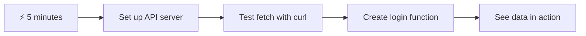

- **Хвилина 1-2**: Запустіть сервер API (`cd api && npm start`) і протестуйте з'єднання
- **Хвилина 3**: Створіть базову функцію `getAccount()` за допомогою fetch
- **Хвилина 4**: Підключіть форму входу за допомогою `action="javascript:login()"`
- **Хвилина 5**: Протестуйте вхід і спостерігайте, як дані облікового запису з'являються в консолі

**Швидкі команди для тестування**:
```bash
# Verify API is running
curl http://localhost:5000/api

# Test account data fetch
curl http://localhost:5000/api/accounts/test
```

**Чому це важливо**: За 5 хвилин ви побачите магію асинхронного отримання даних, яка є основою кожного сучасного веб-додатку. Це фундамент, який робить додатки чуйними та живими.

## 🗺️ Ваш навчальний шлях через веб-додатки, керовані даними

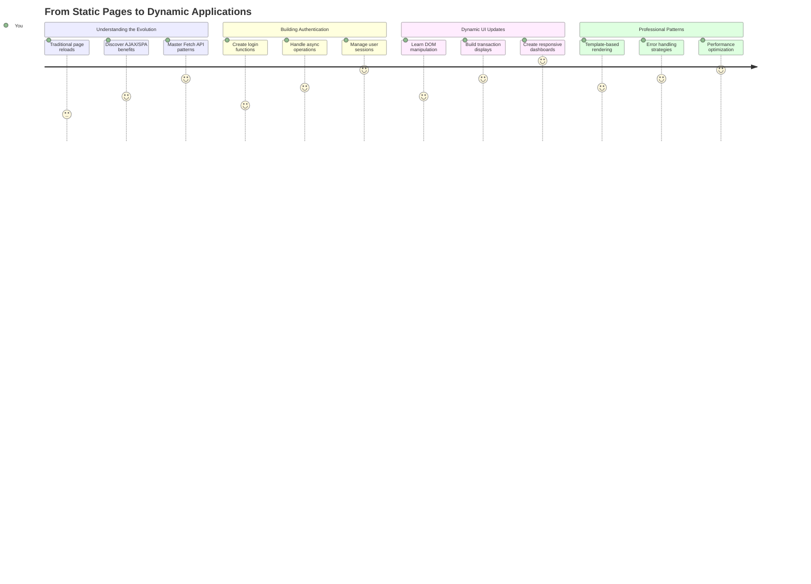

**Мета вашого навчання**: До кінця цього уроку ви зрозумієте, як сучасні веб-додатки отримують, обробляють і динамічно відображають дані, створюючи плавний користувацький досвід, якого ми очікуємо від професійних додатків.

## Попереднє опитування

[Попереднє опитування](https://ff-quizzes.netlify.app/web/quiz/45)

### Передумови

Перед тим як зануритися в отримання даних, переконайтеся, що у вас готові наступні компоненти:

- **Попередній урок**: Завершіть [Форму входу та реєстрації](../2-forms/README.md) — ми будемо будувати на цій основі
- **Локальний сервер**: Встановіть [Node.js](https://nodejs.org) і [запустіть сервер API](../api/README.md), щоб надати дані облікового запису
- **З'єднання API**: Перевірте з'єднання вашого сервера за допомогою цієї команди:

```bash
curl http://localhost:5000/api
# Expected response: "Bank API v1.0.0"
```

Цей швидкий тест гарантує правильну комунікацію всіх компонентів:
- Перевіряє, чи Node.js працює правильно на вашій системі
- Підтверджує, що сервер API активний і відповідає
- Переконується, що ваш додаток може досягти сервера (як перевірка радіозв'язку перед місією)

## 🧠 Огляд екосистеми управління даними

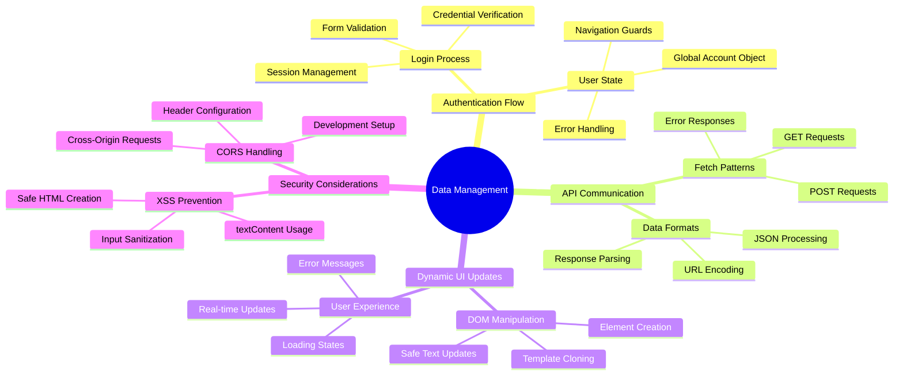

**Основний принцип**: Сучасні веб-додатки — це системи оркестрації даних, які координують взаємодію між користувацькими інтерфейсами, серверними API та моделями безпеки браузера, створюючи плавний і чуйний досвід.

---

## Розуміння отримання даних у сучасних веб-додатках

Спосіб, яким веб-додатки обробляють дані, значно еволюціонував за останні два десятиліття. Розуміння цієї еволюції допоможе вам оцінити, чому сучасні техніки, такі як AJAX і Fetch API, є настільки потужними і чому вони стали необхідними інструментами для веб-розробників.

Давайте дослідимо, як працювали традиційні веб-сайти порівняно з динамічними, чуйними додатками, які ми створюємо сьогодні.

### Традиційні багатосторінкові додатки (MPA)

На початку розвитку вебу кожен клік був схожий на зміну каналів на старому телевізорі — екран ставав порожнім, а потім повільно налаштовувався на новий контент. Це була реальність ранніх веб-додатків, де кожна взаємодія означала повне перезавантаження сторінки.

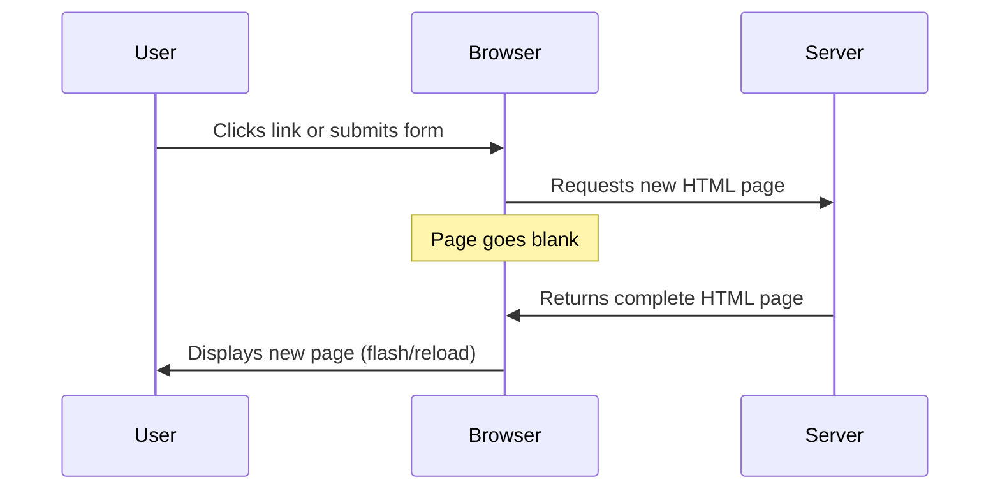

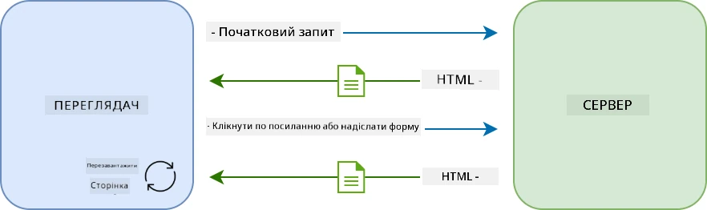

**Чому цей підхід здавався незручним:**
- Кожен клік означав повне перезавантаження сторінки
- Користувачів переривали ці дратівливі спалахи сторінки
- Ваше інтернет-з'єднання працювало понаднормово, завантажуючи той самий заголовок і підвал знову і знову
- Додатки більше нагадували перегляд картотеки, ніж використання програмного забезпечення

### Сучасні односторінкові додатки (SPA)

AJAX (асинхронний JavaScript і XML) повністю змінив цей підхід. Як модульний дизайн Міжнародної космічної станції, де астронавти можуть замінювати окремі компоненти без перебудови всієї структури, AJAX дозволяє нам оновлювати конкретні частини веб-сторінки без перезавантаження всього. Незважаючи на те, що в назві згадується XML, сьогодні ми здебільшого використовуємо JSON, але основний принцип залишається: оновлювати лише те, що потрібно змінити.

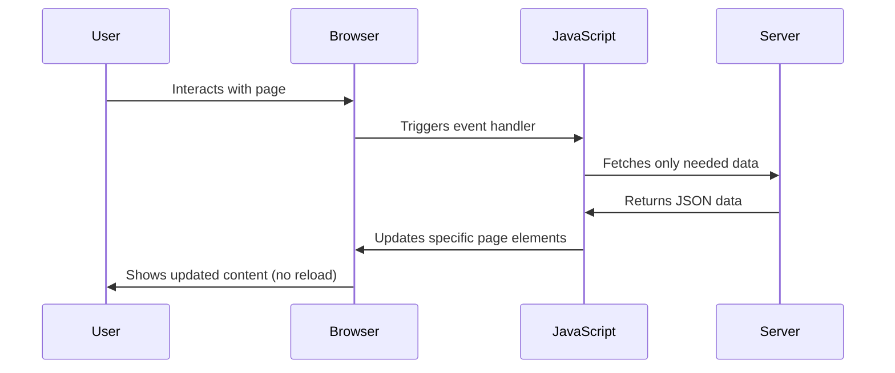

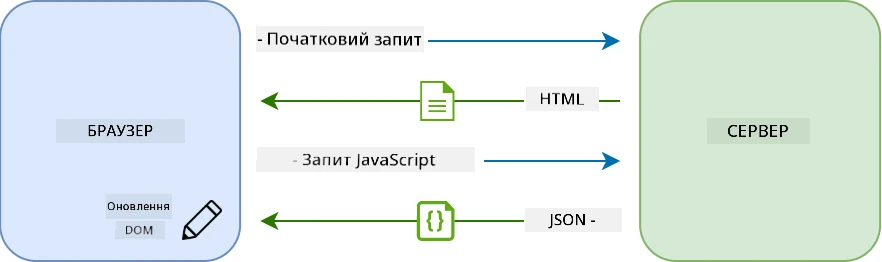

**Чому SPA здаються набагато кращими:**
- Оновлюються лише ті частини, які дійсно змінилися (розумно, правда?)
- Більше ніяких різких переривань — ваші користувачі залишаються в потоці
- Менше даних передається через мережу, що означає швидше завантаження
- Все здається швидким і чуйним, як додатки на вашому телефоні

### Еволюція до сучасного Fetch API

Сучасні браузери надають [`Fetch` API](https://developer.mozilla.org/docs/Web/API/Fetch_API), який замінює старий [`XMLHttpRequest`](https://developer.mozilla.org/docs/Web/API/XMLHttpRequest/Using_XMLHttpRequest). Як різниця між використанням телеграфу і електронної пошти, Fetch API використовує promises для чистішого асинхронного коду і природно обробляє JSON.

| Функція | XMLHttpRequest | Fetch API |
|---------|----------------|----------|
| **Синтаксис** | Складний, на основі callback | Чистий, на основі promise |
| **Обробка JSON** | Потрібне ручне парсування | Вбудований метод `.json()` |
| **Обробка помилок** | Обмежена інформація про помилки | Детальна інформація про помилки |
| **Сучасна підтримка** | Сумісність зі старими версіями | Підтримка ES6+ promises і async/await |

> 💡 **Сумісність з браузерами**: Хороші новини — Fetch API працює у всіх сучасних браузерах! Якщо вам цікаві конкретні версії, [caniuse.com](https://caniuse.com/fetch) має повну історію сумісності.
> 
**Основний висновок:**
- Чудово працює в Chrome, Firefox, Safari та Edge (загалом скрізь, де є ваші користувачі)
- Лише Internet Explorer потребує додаткової допомоги (і чесно кажучи, час відпустити IE)
- Ідеально підходить для елегантних async/await паттернів, які ми будемо використовувати пізніше

### Реалізація входу користувача та отримання даних

Тепер давайте реалізуємо систему входу, яка перетворює ваш банківський додаток зі статичного дисплея на функціональний додаток. Як протоколи автентифікації, що використовуються в захищених військових об'єктах, ми перевіримо облікові дані користувача, а потім надамо доступ до його конкретних даних.

Ми будемо будувати це поступово, починаючи з базової автентифікації, а потім додаючи можливості отримання даних.

#### Крок 1: Створення основи функції входу

Відкрийте ваш файл `app.js` і додайте нову функцію `login`. Вона буде обробляти процес автентифікації користувача:

```javascript
async function login() {
  const loginForm = document.getElementById('loginForm');
  const user = loginForm.user.value;
}
```

**Розберемо це:**
- Ключове слово `async`? Воно говорить JavaScript: "гей, ця функція може потребувати очікування"
- Ми отримуємо нашу форму зі сторінки (нічого складного, просто знаходимо її за ID)
- Потім витягуємо те, що користувач ввів як своє ім'я користувача
- Ось цікавий трюк: ви можете отримати доступ до будь-якого елемента форми за його атрибутом `name` — не потрібно додаткових викликів getElementById!

> 💡 **Шаблон доступу до форми**: До кожного елемента форми можна отримати доступ за його ім'ям (встановленим у HTML за допомогою атрибута `name`) як до властивості елемента форми. Це забезпечує чистий і читабельний спосіб отримання даних форми.

#### Крок 2: Створення функції отримання даних облікового запису

Далі ми створимо спеціальну функцію для отримання даних облікового запису з сервера. Це слідує тому ж шаблону, що й ваша функція реєстрації, але зосереджено на отриманні даних:

```javascript
async function getAccount(user) {
  try {
    const response = await fetch('//localhost:5000/api/accounts/' + encodeURIComponent(user));
    return await response.json();
  } catch (error) {
    return { error: error.message || 'Unknown error' };
  }
}
```

**Що робить цей код:**
- **Використовує** сучасний `fetch` API для асинхронного запиту даних
- **Формує** URL запиту GET з параметром імені користувача
- **Застосовує** `encodeURIComponent()` для безпечної обробки спеціальних символів у URL
- **Перетворює** відповідь у формат JSON для зручної маніпуляції даними
- **Обробляє** помилки акуратно, повертаючи об'єкт помилки замість аварійного завершення

> ⚠️ **Примітка щодо безпеки**: Функція `encodeURIComponent()` обробляє спеціальні символи в URL. Як системи кодування, що використовуються в морських комунікаціях, вона гарантує, що ваше повідомлення прибуде саме так, як задумано, запобігаючи неправильному тлумаченню символів, таких як "#" або "&".
> 
**Чому це важливо:**
- Запобігає порушенню URL через спеціальні символи
- Захищає від атак маніпуляції URL
- Гарантує, що сервер отримує потрібні дані
- Дотримується практик безпечного кодування

#### Розуміння HTTP GET-запитів

Ось що може вас здивувати: коли ви використовуєте `fetch` без додаткових опцій, він автоматично створює [`GET`](https://developer.mozilla.org/docs/Web/HTTP/Methods/GET) запит. Це ідеально підходить для того, що ми робимо — запитуємо сервер: "гей, чи можу я побачити дані цього користувача?"

Думайте про GET-запити як про ввічливе прохання позичити книгу в бібліотеці — ви запитуєте, щоб побачити щось, що вже існує. POST-запити (які ми використовували для реєстрації) більше схожі на подання нової книги для додавання до колекції.

| GET-запит | POST-запит |
|-----------|------------|
| **Призначення** | Отримання існуючих даних | Надсилання нових даних на сервер |
| **Параметри** | У шляху URL/рядку запиту | У тілі запиту |
| **Кешування** | Може кешуватися браузерами | Зазвичай не кешується |
| **Безпека** | Видно в URL/журналах | Приховано в тілі запиту |

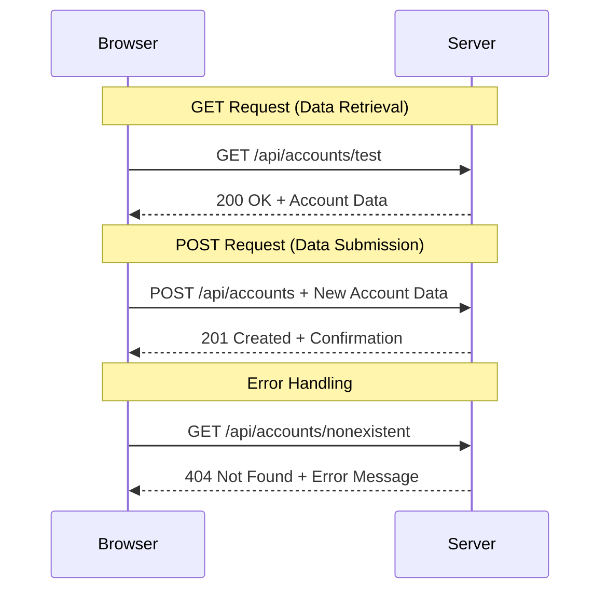

#### Крок 3: Об'єднання всього разом

Тепер найзадовільніша частина — давайте підключимо вашу функцію отримання даних облікового запису до процесу входу. Тут все стає на свої місця:

```javascript
async function login() {
  const loginForm = document.getElementById('loginForm');
  const user = loginForm.user.value;
  const data = await getAccount(user);

  if (data.error) {
    return console.log('loginError', data.error);
  }

  account = data;
  navigate('/dashboard');
}
```

Ця функція слідує чіткому порядку:
- Витягує ім'я користувача з введення форми
- Запитує дані облікового запису користувача з сервера
- Обробляє будь-які помилки, що виникають під час процесу
- Зберігає дані облікового запису та переходить на панель управління після успішного входу

> 🎯 **Паттерн Async/Await**: Оскільки `getAccount` є асинхронною функцією, ми використовуємо ключове слово `await`, щоб призупинити виконання до отримання відповіді від сервера. Це запобігає продовженню коду з невизначеними даними.

#### Крок 4: Створення місця для ваших даних

Вашому додатку потрібне місце, щоб зберігати інформацію про обліковий запис після її завантаження. Думайте про це як про короткострокову пам'ять вашого додатку — місце, де зберігаються дані поточного користувача. Додайте цей рядок на початку вашого файлу `app.js`:

```javascript
// This holds the current user's account data
let account = null;
```

**Чому це потрібно:**
- Зберігає дані облікового запису доступними з будь-якого місця вашого додатку
- Початок з `null` означає "поки що ніхто не увійшов"
- Оновлюється, коли хтось успішно входить або реєструється
- Діє як єдине джерело правди — ніякої плутанини щодо того, хто увійшов

#### Крок 5: Підключення вашої форми

Тепер давайте підключимо вашу нову функцію входу до HTML-форми. Оновіть тег форми таким чином:

```html
<form id="loginForm" action="javascript:login()">
  <!-- Your existing form inputs -->
</form>
```

**Що робить ця невелика зміна:**
- Зупиняє форму від виконання її стандартної поведінки "перезавантажити всю сторінку"
- Викликає вашу власну функцію JavaScript
- Зберігає все плавним і схожим на односторінковий додаток
- Дає вам повний контроль над тим, що відбувається, коли користувачі натискають "Вхід"

#### Крок 6: Покращення функції реєстрації

Для узгодженості оновіть вашу функцію `register`, щоб також зберігати дані облікового запису та переходити на панель управління:

```javascript
// Add these lines at the end of your register function
account = result;
navigate('/dashboard');
```

**Це покращення забезпечує:**
- **Плавний** перехід від реєстрації до панелі управління
- **Послідовний** користувацький досвід між процесами входу та реєстрації
- **Миттєвий** доступ до даних облікового запису після успішної реєстрації

#### Тестування вашої реалізації

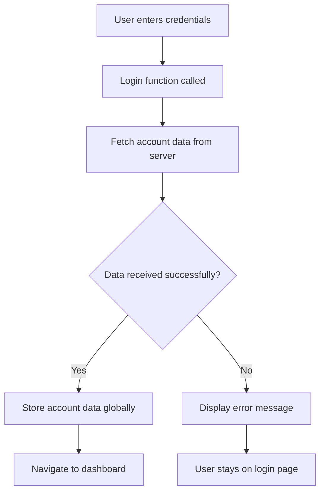

**Час протестувати:**
1. Створіть новий обліковий запис, щоб переконатися, що все працює
2. Спробуйте увійти з тими ж обліковими даними
3. Загляньте в консоль вашого браузера (F12), якщо щось здається неправильним
4. Переконайтеся, що ви потрапляєте на панель управління після успішного входу

Якщо щось не працює, не панікуйте! Більшість проблем — це прості виправлення, як-от
Маніпуляція DOM — це техніка, яка перетворює статичні веб-сторінки на динамічні додатки, що оновлюють свій контент залежно від взаємодії користувача та відповідей сервера.

### Вибір правильного інструменту для роботи

Коли справа доходить до оновлення HTML за допомогою JavaScript, у вас є кілька варіантів. Уявіть їх як різні інструменти в ящику для інструментів — кожен ідеально підходить для певних завдань:

| Метод | Для чого підходить | Коли використовувати | Рівень безпеки |
|-------|--------------------|----------------------|----------------|
| `textContent` | Безпечне відображення даних користувача | Завжди, коли потрібно показати текст | ✅ Надійно |
| `createElement()` + `append()` | Створення складних макетів | Створення нових секцій/списків | ✅ Безпечно |
| `innerHTML` | Встановлення HTML-контенту | ⚠️ Намагайтеся уникати цього | ❌ Ризиковано |

#### Безпечний спосіб показу тексту: textContent

Властивість [`textContent`](https://developer.mozilla.org/docs/Web/API/Node/textContent) — ваш найкращий друг для відображення даних користувача. Це як охоронець для вашої веб-сторінки — нічого шкідливого не пройде:

```javascript
// The safe, reliable way to update text
const balanceElement = document.getElementById('balance');
balanceElement.textContent = account.balance;
```

**Переваги textContent:**
- Сприймає все як звичайний текст (запобігає виконанню скриптів)
- Автоматично очищає існуючий контент
- Ефективний для простих текстових оновлень
- Забезпечує вбудовану безпеку від шкідливого контенту

#### Створення динамічних HTML-елементів

Для більш складного контенту комбінуйте [`document.createElement()`](https://developer.mozilla.org/docs/Web/API/Document/createElement) з методом [`append()`](https://developer.mozilla.org/docs/Web/API/ParentNode/append):

```javascript
// Safe way to create new elements
const transactionItem = document.createElement('div');
transactionItem.className = 'transaction-item';
transactionItem.textContent = `${transaction.date}: ${transaction.description}`;
container.append(transactionItem);
```

**Розуміння цього підходу:**
- **Створює** нові елементи DOM програмно
- **Забезпечує** повний контроль над атрибутами та контентом елементів
- **Дозволяє** створювати складні, вкладені структури елементів
- **Зберігає** безпеку, розділяючи структуру та контент

> ⚠️ **Міркування щодо безпеки**: Хоча [`innerHTML`](https://developer.mozilla.org/docs/Web/API/Element/innerHTML) часто зустрічається в навчальних матеріалах, він може виконувати вбудовані скрипти. Як протоколи безпеки в CERN, що запобігають несанкціонованому виконанню коду, використання `textContent` і `createElement` забезпечує більш безпечні альтернативи.
> 
**Ризики innerHTML:**
- Виконує будь-які `<script>` теги в даних користувача
- Вразливий до атак із впровадженням коду
- Створює потенційні проблеми безпеки
- Безпечні альтернативи, які ми використовуємо, забезпечують еквівалентну функціональність

### Робимо помилки зрозумілими для користувачів

Зараз помилки входу відображаються лише в консолі браузера, що є невидимим для користувачів. Як різниця між внутрішньою діагностикою пілота та інформаційною системою для пасажирів, ми повинні передавати важливу інформацію через відповідний канал.

Реалізація видимих повідомлень про помилки надає користувачам миттєвий зворотний зв'язок про те, що пішло не так і як діяти далі.

#### Крок 1: Додайте місце для повідомлень про помилки

Спочатку створимо місце для повідомлень про помилки у вашому HTML. Додайте це прямо перед кнопкою входу, щоб користувачі бачили його природно:

```html
<!-- This is where error messages will appear -->
<div id="loginError" role="alert"></div>
<button>Login</button>
```

**Що тут відбувається:**
- Ми створюємо порожній контейнер, який залишається невидимим, поки не знадобиться
- Він розташований там, де користувачі природно дивляться після натискання "Увійти"
- Атрибут `role="alert"` — це гарний штрих для екранних читачів — він повідомляє допоміжним технологіям "ей, це важливо!"
- Унікальний `id` дає нашому JavaScript легку ціль

#### Крок 2: Створіть зручну допоміжну функцію

Давайте створимо невелику утиліту, яка може оновлювати текст будь-якого елемента. Це одна з тих функцій "написати один раз, використовувати всюди", яка заощадить вам час:

```javascript
function updateElement(id, text) {
  const element = document.getElementById(id);
  element.textContent = text;
}
```

**Переваги функції:**
- Простий інтерфейс, що вимагає лише ID елемента та текстового контенту
- Безпечно знаходить і оновлює елементи DOM
- Повторюваний шаблон, який зменшує дублювання коду
- Забезпечує узгоджену поведінку оновлення в додатку

#### Крок 3: Показуйте помилки там, де їх можуть побачити користувачі

Тепер замінимо приховане повідомлення консолі на те, що користувачі можуть побачити. Оновіть вашу функцію входу:

```javascript
// Instead of just logging to console, show the user what's wrong
if (data.error) {
  return updateElement('loginError', data.error);
}
```

**Ця невелика зміна має великий вплив:**
- Повідомлення про помилки з'являються там, де користувачі дивляться
- Більше ніяких загадкових тихих збоїв
- Користувачі отримують миттєвий, зрозумілий зворотний зв'язок
- Ваш додаток починає виглядати професійно та продумано

Тепер, коли ви тестуєте з недійсним обліковим записом, ви побачите корисне повідомлення про помилку прямо на сторінці!


#### Крок 4: Бути інклюзивним з доступністю

Ось щось круте про той `role="alert"`, який ми додали раніше — це не просто декорація! Цей невеликий атрибут створює те, що називається [Live Region](https://developer.mozilla.org/docs/Web/Accessibility/ARIA/ARIA_Live_Regions), який негайно оголошує зміни екранним читачам:

```html
<div id="loginError" role="alert"></div>
```

**Чому це важливо:**
- Користувачі екранних читачів чують повідомлення про помилку, як тільки воно з'являється
- Усі отримують однакову важливу інформацію, незалежно від того, як вони навігають
- Це простий спосіб зробити ваш додаток доступним для більшої кількості людей
- Показує, що вам важливо створювати інклюзивні досвіди

Такі невеликі штрихи відрізняють хороших розробників від чудових!

### 🎯 Педагогічна перевірка: шаблони автентифікації

**Зупиніться і подумайте**: Ви щойно реалізували повний потік автентифікації. Це основний шаблон у веб-розробці.

**Швидка самооцінка**:
- Чи можете ви пояснити, чому ми використовуємо async/await для викликів API?
- Що станеться, якщо ми забудемо функцію `encodeURIComponent()`?
- Як наше оброблення помилок покращує досвід користувача?

**Зв'язок із реальним світом**: Шаблони, які ви тут вивчили (асинхронне отримання даних, оброблення помилок, зворотний зв'язок користувача), використовуються в кожному великому веб-додатку — від платформ соціальних мереж до сайтів електронної комерції. Ви набуваєте навичок рівня виробництва!

**Питання для виклику**: Як ви могли б модифікувати цю систему автентифікації для оброблення кількох ролей користувачів (клієнт, адміністратор, касир)? Подумайте про структуру даних і зміни в інтерфейсі.

#### Крок 5: Застосуйте той самий шаблон до реєстрації

Для узгодженості реалізуйте однакове оброблення помилок у вашій формі реєстрації:

1. **Додайте** елемент для відображення помилок у вашому HTML реєстрації:
```html
<div id="registerError" role="alert"></div>
```

2. **Оновіть** вашу функцію реєстрації, щоб використовувати той самий шаблон відображення помилок:
```javascript
if (data.error) {
  return updateElement('registerError', data.error);
}
```

**Переваги узгодженого оброблення помилок:**
- **Забезпечує** однаковий досвід користувача на всіх формах
- **Зменшує** когнітивне навантаження, використовуючи знайомі шаблони
- **Спрощує** обслуговування за допомогою повторюваного коду
- **Гарантує**, що стандарти доступності дотримуються у всьому додатку

## Створення вашої динамічної панелі управління

Тепер ми перетворимо вашу статичну панель управління на динамічний інтерфейс, який відображає реальні дані облікового запису. Як різниця між розкладом рейсів на папері та живими табло відправлень в аеропортах, ми переходимо від статичної інформації до реального часу, чутливих до змін дисплеїв.

Використовуючи техніки маніпуляції DOM, які ви вивчили, ми створимо панель управління, яка автоматично оновлюється з поточною інформацією облікового запису.

### Знайомство з вашими даними

Перш ніж почати будувати, давайте поглянемо, які дані ваш сервер надсилає назад. Коли хтось успішно входить, ось скарбниця інформації, яку ви отримуєте:

```json
{
  "user": "test",
  "currency": "$",
  "description": "Test account",
  "balance": 75,
  "transactions": [
    { "id": "1", "date": "2020-10-01", "object": "Pocket money", "amount": 50 },
    { "id": "2", "date": "2020-10-03", "object": "Book", "amount": -10 },
    { "id": "3", "date": "2020-10-04", "object": "Sandwich", "amount": -5 }
  ]
}
```

**Ця структура даних надає:**
- **`user`**: Ідеально для персоналізації досвіду ("Ласкаво просимо назад, Сара!")
- **`currency`**: Забезпечує правильне відображення грошових сум
- **`description`**: Дружнє ім'я для облікового запису
- **`balance`**: Найважливіший поточний баланс
- **`transactions`**: Повна історія транзакцій з усіма деталями

Все, що потрібно для створення професійної панелі управління банківським рахунком!

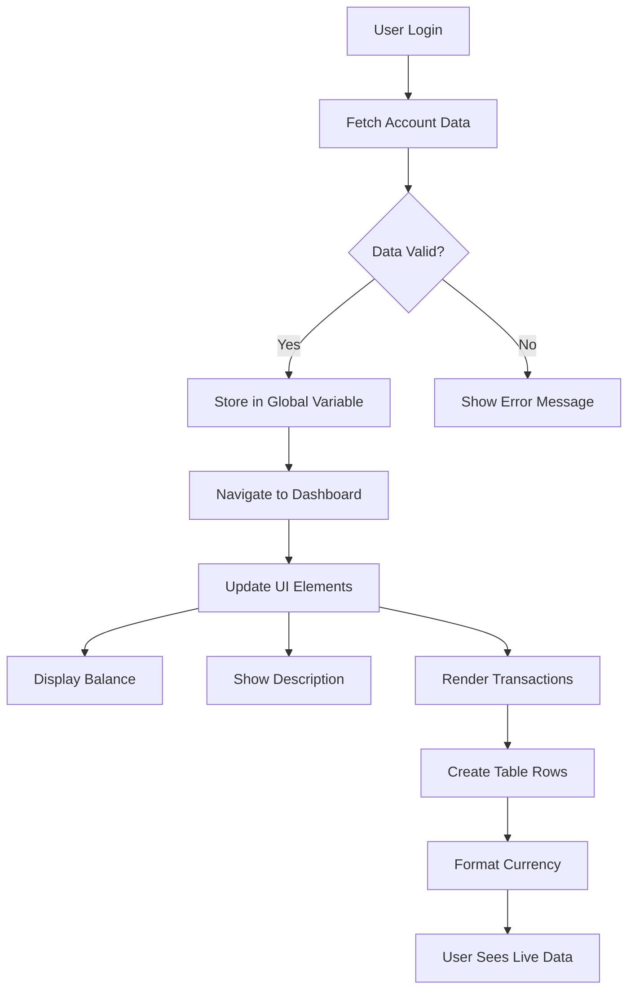

> 💡 **Корисна порада**: Хочете побачити вашу панель управління в дії прямо зараз? Використовуйте ім'я користувача `test`, коли входите — воно вже завантажене з прикладними даними, щоб ви могли побачити, як все працює, не створюючи транзакції спочатку.
> 
**Чому тестовий обліковий запис корисний:**
- Вже містить реалістичні прикладні дані
- Ідеально підходить для перегляду відображення транзакцій
- Чудово підходить для тестування функцій вашої панелі управління
- Зберігає вас від необхідності створювати тестові дані вручну

### Створення елементів відображення панелі управління

Давайте побудуємо ваш інтерфейс панелі управління крок за кроком, починаючи з інформації про обліковий запис, а потім переходячи до більш складних функцій, таких як списки транзакцій.

#### Крок 1: Оновіть структуру HTML

Спочатку замініть статичний розділ "Баланс" на динамічні елементи-заповнювачі, які ваш JavaScript зможе заповнити:

```html
<section>
  Balance: <span id="balance"></span><span id="currency"></span>
</section>
```

Далі додайте розділ для опису облікового запису. Оскільки це діє як заголовок для контенту панелі управління, використовуйте семантичний HTML:

```html
<h2 id="description"></h2>
```

**Розуміння структури HTML:**
- **Використовує** окремі елементи `<span>` для балансу та валюти для індивідуального контролю
- **Застосовує** унікальні ID до кожного елемента для цільового використання JavaScript
- **Дотримується** семантичного HTML, використовуючи `<h2>` для опису облікового запису
- **Створює** логічну ієрархію для екранних читачів та SEO

> ✅ **Інсайт доступності**: Опис облікового запису функціонує як заголовок для контенту панелі управління, тому він позначений семантично як заголовок. Дізнайтеся більше про те, як [структура заголовків](https://www.nomensa.com/blog/2017/how-structure-headings-web-accessibility) впливає на доступність. Чи можете ви визначити інші елементи на вашій сторінці, які могли б скористатися тегами заголовків?

#### Крок 2: Створіть функцію оновлення панелі управління

Тепер створіть функцію, яка заповнює вашу панель управління реальними даними облікового запису:

```javascript
function updateDashboard() {
  if (!account) {
    return navigate('/login');
  }

  updateElement('description', account.description);
  updateElement('balance', account.balance.toFixed(2));
  updateElement('currency', account.currency);
}
```

**Крок за кроком, ось що робить ця функція:**
- **Перевіряє**, чи існують дані облікового запису перед продовженням
- **Перенаправляє** неавторизованих користувачів назад на сторінку входу
- **Оновлює** опис облікового запису, використовуючи повторювану функцію `updateElement`
- **Форматує** баланс, щоб завжди показувати два десяткових знаки
- **Відображає** відповідний символ валюти

> 💰 **Форматування грошей**: Метод [`toFixed(2)`](https://developer.mozilla.org/docs/Web/JavaScript/Reference/Global_Objects/Number/toFixed) — це рятівник! Він гарантує, що ваш баланс завжди виглядає як реальні гроші — "75.00" замість просто "75". Ваші користувачі оцінять знайоме форматування валюти.

#### Крок 3: Переконайтеся, що ваша панель управління оновлюється

Щоб ваша панель управління оновлювалася з поточними даними кожного разу, коли хтось її відвідує, нам потрібно підключитися до вашої системи навігації. Якщо ви завершили [завдання уроку 1](../1-template-route/assignment.md), це має бути знайомим. Якщо ні, не хвилюйтеся — ось що вам потрібно:

Додайте це в кінці вашої функції `updateRoute()`:

```javascript
if (typeof route.init === 'function') {
  route.init();
}
```

Потім оновіть ваші маршрути, щоб включити ініціалізацію панелі управління:

```javascript
const routes = {
  '/login': { templateId: 'login' },
  '/dashboard': { templateId: 'dashboard', init: updateDashboard }
};
```

**Що робить цей розумний налаштування:**
- Перевіряє, чи має маршрут спеціальний код ініціалізації
- Автоматично запускає цей код, коли маршрут завантажується
- Гарантує, що ваша панель управління завжди показує свіжі, поточні дані
- Зберігає вашу логіку маршрутизації чистою та організованою

#### Тестування вашої панелі управління

Після реалізації цих змін протестуйте вашу панель управління:

1. **Увійдіть** за допомогою тестового облікового запису
2. **Перевірте**, чи вас перенаправляють на панель управління
3. **Переконайтеся**, що опис облікового запису, баланс і валюта відображаються правильно
4. **Спробуйте вийти та увійти знову**, щоб переконатися, що дані оновлюються належним чином

Ваша панель управління тепер повинна відображати динамічну інформацію облікового запису, яка оновлюється на основі даних авторизованого користувача!

## Створення розумних списків транзакцій за допомогою шаблонів

Замість ручного створення HTML для кожної транзакції ми будемо використовувати шаблони для автоматичного створення узгодженого форматування. Як стандартизовані компоненти, що використовуються у виробництві космічних кораблів, шаблони гарантують, що кожен рядок транзакції відповідає
> ⚡ **Оптимізація продуктивності**: [`document.createDocumentFragment()`](https://developer.mozilla.org/docs/Web/API/Document/createDocumentFragment) працює як процес складання на заводі Boeing - компоненти готуються окремо від основної лінії, а потім встановлюються як єдиний блок. Такий підхід до групування мінімізує переробки DOM, виконуючи одне вставлення замість кількох окремих операцій.

### Крок 5: Покращення функції оновлення для змішаного контенту

Ваша функція `updateElement()` наразі обробляє лише текстовий контент. Оновіть її, щоб вона працювала як з текстом, так і з DOM-вузлами:

```javascript
function updateElement(id, textOrNode) {
  const element = document.getElementById(id);
  element.textContent = ''; // Removes all children
  element.append(textOrNode);
}
```

**Основні покращення в цьому оновленні:**
- **Очищує** існуючий контент перед додаванням нового
- **Приймає** як текстові рядки, так і DOM-вузли як параметри
- **Використовує** метод [`append()`](https://developer.mozilla.org/docs/Web/API/ParentNode/append) для гнучкості
- **Зберігає** зворотну сумісність з існуючим текстовим використанням

### Тестування вашої панелі управління

Час перевірити результат! Давайте подивимося, як працює ваша динамічна панель управління:

1. Увійдіть за допомогою облікового запису `test` (він має готові зразки даних)
2. Перейдіть до вашої панелі управління
3. Переконайтеся, що рядки транзакцій з'являються з правильним форматуванням
4. Перевірте, чи дати, описи та суми виглядають коректно

Якщо все працює, ви повинні побачити повністю функціональний список транзакцій на вашій панелі управління! 🎉

**Що ви досягли:**
- Створили панель управління, яка масштабується з будь-якою кількістю даних
- Розробили багаторазові шаблони для послідовного форматування
- Реалізували ефективні техніки маніпуляції DOM
- Розробили функціонал, порівняний з банківськими додатками у виробництві

Ви успішно перетворили статичну веб-сторінку на динамічний веб-додаток.

### 🎯 Педагогічна перевірка: Генерація динамічного контенту

**Розуміння архітектури**: Ви реалізували складний процес передачі даних до інтерфейсу користувача, який відображає шаблони, що використовуються у фреймворках, таких як React, Vue та Angular.

**Основні концепції, які ви освоїли**:
- **Шаблонне рендеринг**: Створення багаторазових компонентів інтерфейсу
- **Фрагменти документів**: Оптимізація продуктивності DOM
- **Безпечна маніпуляція DOM**: Запобігання вразливостям безпеки
- **Трансформація даних**: Перетворення даних сервера в інтерфейси користувача

**Зв'язок з індустрією**: Ці техніки є основою сучасних фронтенд-фреймворків. Віртуальний DOM у React, система шаблонів у Vue та архітектура компонентів у Angular базуються на цих основних концепціях.

**Питання для роздумів**: Як би ви розширили цю систему для обробки оновлень у реальному часі (наприклад, автоматичне з'явлення нових транзакцій)? Розгляньте використання WebSockets або Server-Sent Events.

---

## 📈 Хронологія вашого освоєння управління даними

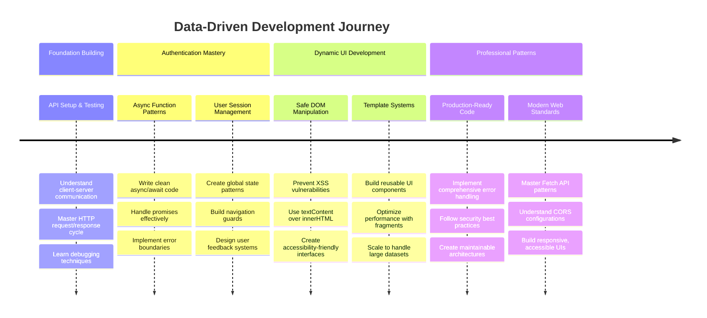

**🎓 Етап випуску**: Ви успішно створили повний веб-додаток, керований даними, використовуючи сучасні шаблони JavaScript. Ці навички безпосередньо перекладаються на роботу з фреймворками, такими як React, Vue або Angular.

**🔄 Наступний рівень можливостей**:
- Готовність досліджувати фронтенд-фреймворки, які базуються на цих концепціях
- Підготовленість до реалізації функцій у реальному часі за допомогою WebSockets
- Оснащеність для створення прогресивних веб-додатків з офлайн-можливостями
- Закладено основу для вивчення складних шаблонів управління станом

## Виклик GitHub Copilot Agent 🚀

Використовуйте режим Agent, щоб виконати наступний виклик:

**Опис:** Покращіть банківський додаток, реалізувавши функцію пошуку та фільтрації транзакцій, яка дозволяє користувачам знаходити конкретні транзакції за діапазоном дат, сумою або ключовими словами опису.

**Завдання:** Створіть функціонал пошуку для банківського додатка, який включає: 1) Форма пошуку з полями введення для діапазону дат (від/до), мінімальної/максимальної суми та ключових слів опису транзакції, 2) Функцію `filterTransactions()`, яка фільтрує масив account.transactions на основі критеріїв пошуку, 3) Оновіть функцію `updateDashboard()`, щоб показувати відфільтровані результати, і 4) Додайте кнопку "Очистити фільтри" для скидання перегляду. Використовуйте сучасні методи масивів JavaScript, такі як `filter()`, і обробляйте крайні випадки для порожніх критеріїв пошуку.

Дізнайтеся більше про [режим агентів](https://code.visualstudio.com/blogs/2025/02/24/introducing-copilot-agent-mode) тут.

## 🚀 Виклик

Готові підняти ваш банківський додаток на новий рівень? Давайте зробимо його таким, щоб ним дійсно хотілося користуватися. Ось кілька ідей для натхнення:

**Зробіть його красивим**: Додайте CSS-стилі, щоб перетворити вашу функціональну панель управління на щось візуально привабливе. Подумайте про чисті лінії, гарний відступ і, можливо, навіть легкі анімації.

**Зробіть його адаптивним**: Спробуйте використати [медіа-запити](https://developer.mozilla.org/docs/Web/CSS/Media_Queries), щоб створити [адаптивний дизайн](https://developer.mozilla.org/docs/Web/Progressive_web_apps/Responsive/responsive_design_building_blocks), який чудово працює на телефонах, планшетах і настільних комп'ютерах. Ваші користувачі будуть вдячні!

**Додайте трохи стилю**: Розгляньте кольорове кодування транзакцій (зелений для доходів, червоний для витрат), додавання іконок або створення ефектів наведення, які роблять інтерфейс інтерактивним.

Ось як може виглядати відполірована панель управління:


Не обов'язково точно повторювати це - використовуйте як натхнення і створіть щось своє!

## Післялекційний тест

[Післялекційний тест](https://ff-quizzes.netlify.app/web/quiz/46)

## Завдання

[Рефакторизуйте та прокоментуйте ваш код](assignment.md)

---

**Відмова від відповідальності**:  
Цей документ був перекладений за допомогою сервісу автоматичного перекладу [Co-op Translator](https://github.com/Azure/co-op-translator). Хоча ми прагнемо до точності, будь ласка, майте на увазі, що автоматичні переклади можуть містити помилки або неточності. Оригінальний документ на його рідній мові слід вважати авторитетним джерелом. Для критичної інформації рекомендується професійний людський переклад. Ми не несемо відповідальності за будь-які непорозуміння або неправильні тлумачення, що виникають внаслідок використання цього перекладу.