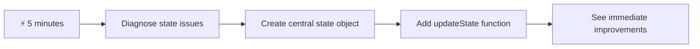
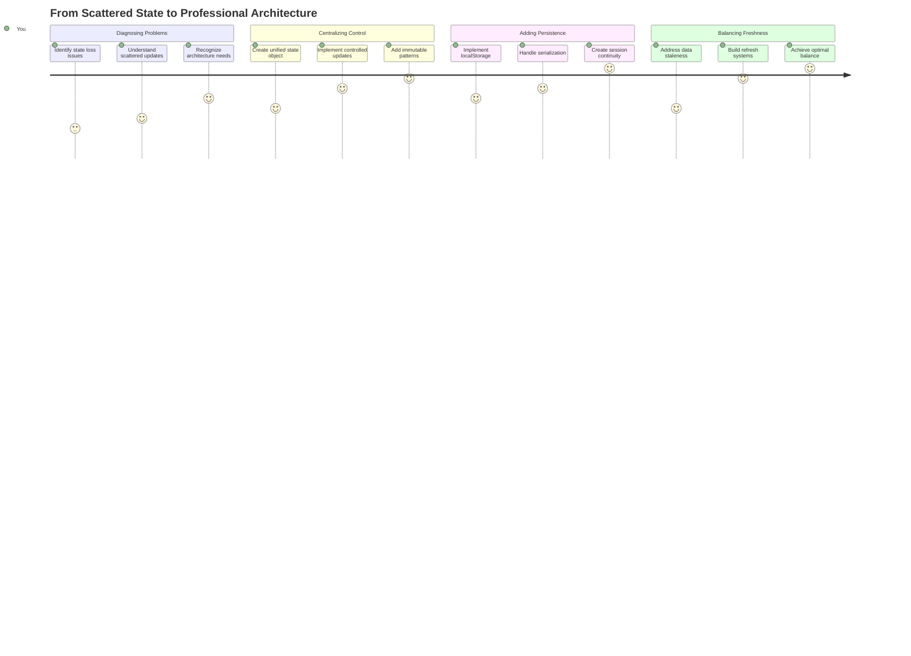
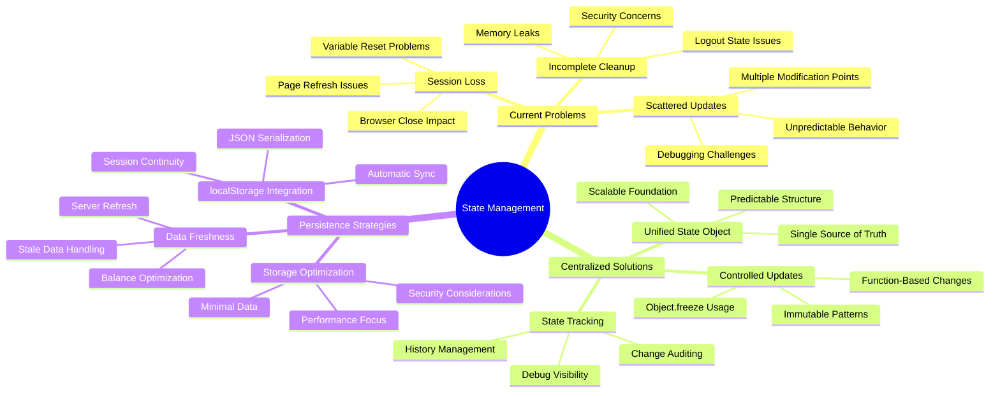
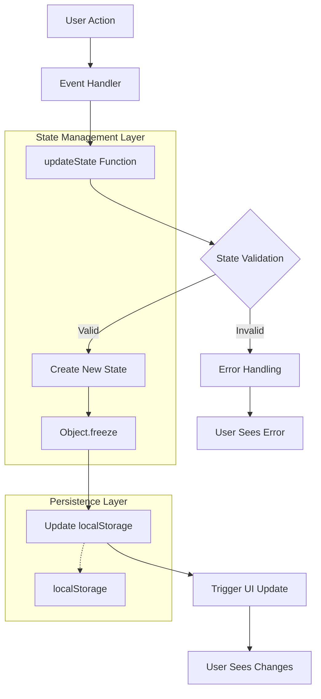
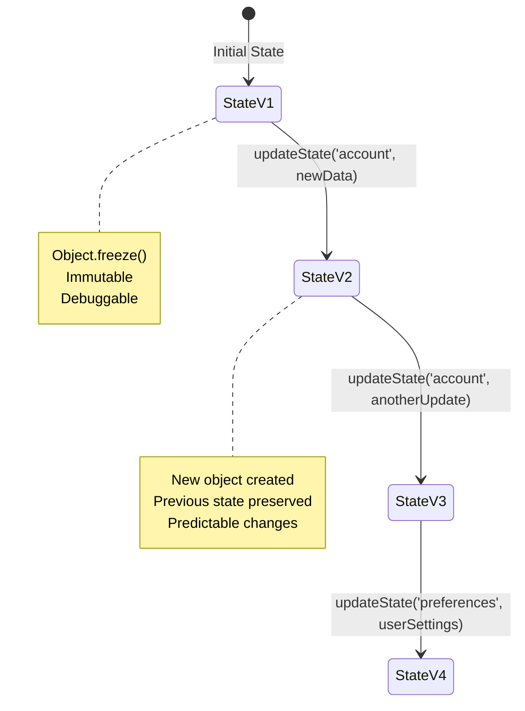
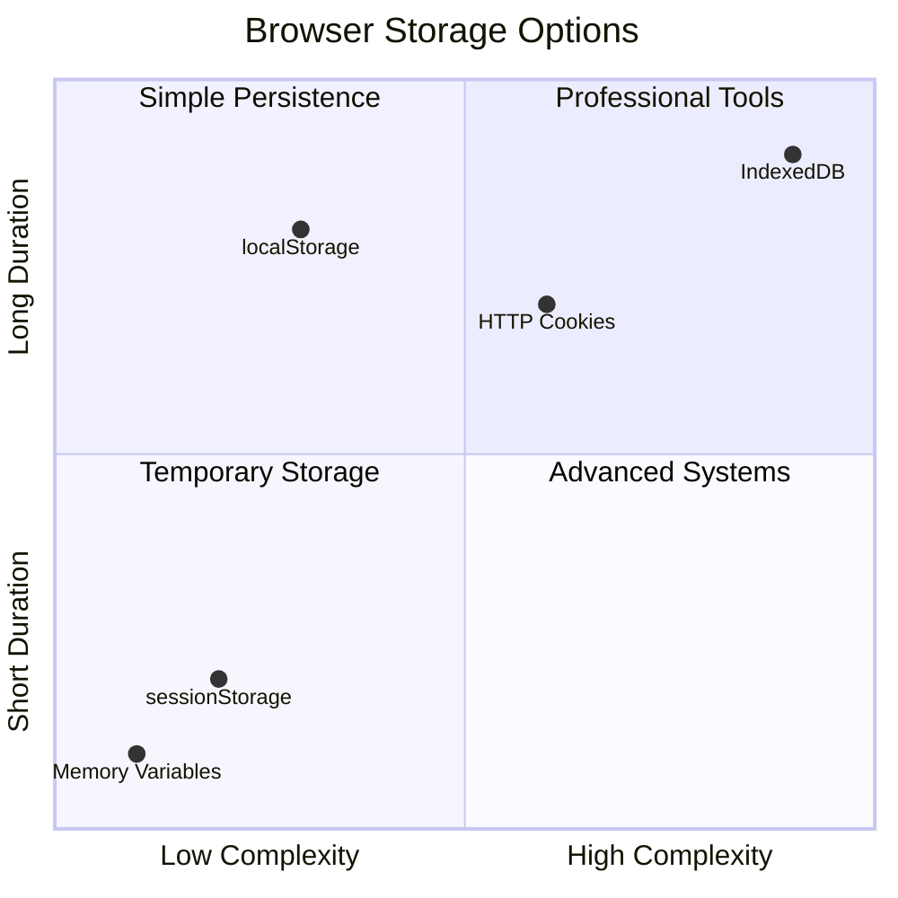
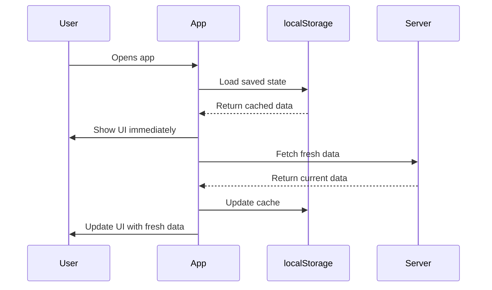
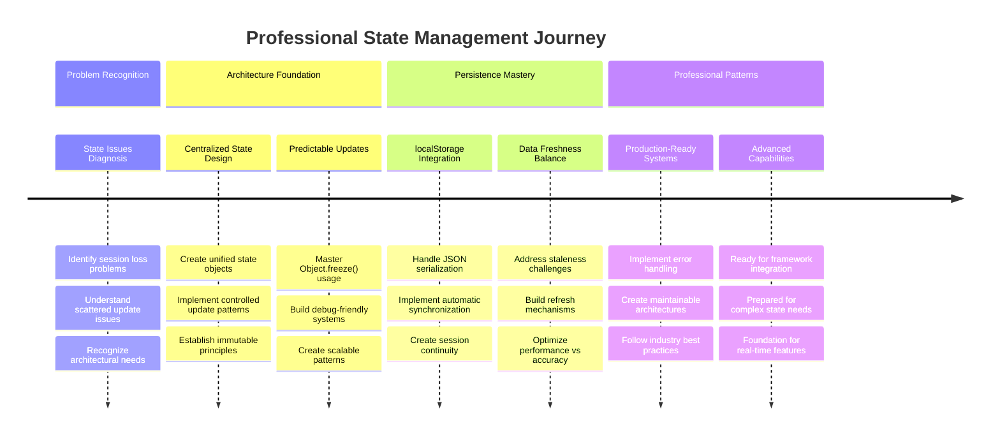

<!--
CO_OP_TRANSLATOR_METADATA:
{
  "original_hash": "b807b09df716dc48a2b750835bf8e933",
  "translation_date": "2025-11-06T13:39:44+00:00",
  "source_file": "7-bank-project/4-state-management/README.md",
  "language_code": "uk"
}
-->
# Створення банківського додатку, частина 4: Концепції управління станом

## ⚡ Що можна зробити за наступні 5 хвилин

**Швидкий старт для зайнятих розробників**



- **Хвилина 1**: Перевірте проблему поточного стану - увійдіть у систему, оновіть сторінку, спостерігайте вихід із системи
- **Хвилина 2**: Замініть `let account = null` на `let state = { account: null }`
- **Хвилина 3**: Створіть просту функцію `updateState()` для контрольованих оновлень
- **Хвилина 4**: Оновіть одну функцію, щоб використовувати новий шаблон
- **Хвилина 5**: Перевірте покращену передбачуваність і можливість налагодження

**Швидкий діагностичний тест**:
```javascript
// Before: Scattered state
let account = null; // Lost on refresh!

// After: Centralized state
let state = Object.freeze({ account: null }); // Controlled and trackable!
```

**Чому це важливо**: За 5 хвилин ви відчуєте перехід від хаотичного управління станом до передбачуваних, зручних для налагодження шаблонів. Це основа, яка робить складні додатки підтримуваними.

## 🗺️ Ваш навчальний шлях до майстерності управління станом



**Мета вашого навчання**: До кінця цього уроку ви створите професійну систему управління станом, яка забезпечує збереження даних, їх актуальність і передбачувані оновлення - ті ж самі шаблони, які використовуються у виробничих додатках.

## Тест перед лекцією

[Тест перед лекцією](https://ff-quizzes.netlify.app/web/quiz/47)

## Вступ

Управління станом схоже на навігаційну систему космічного апарату Voyager – коли все працює гладко, ви майже не помічаєте її існування. Але коли щось йде не так, це стає різницею між досягненням міжзоряного простору і дрейфом у космічній порожнечі. У веб-розробці стан представляє все, що ваш додаток повинен запам'ятати: статус входу користувача, дані форми, історію навігації та тимчасові стани інтерфейсу.

Коли ваш банківський додаток еволюціонував від простого форми входу до більш складного додатку, ви, ймовірно, зіткнулися з деякими поширеними проблемами. Оновіть сторінку, і користувачі несподівано виходять із системи. Закрийте браузер, і весь прогрес зникає. Налагоджуйте проблему, і ви шукаєте в багатьох функціях, які всі змінюють одні й ті ж дані різними способами.

Це не ознаки поганого кодування – це природні труднощі, які виникають, коли додатки досягають певного порогу складності. Кожен розробник стикається з цими викликами, коли їх додатки переходять від "доказу концепції" до "готовності до виробництва".

У цьому уроці ми реалізуємо централізовану систему управління станом, яка перетворить ваш банківський додаток на надійний, професійний додаток. Ви навчитеся керувати потоками даних передбачувано, зберігати сеанси користувачів належним чином і створювати плавний користувацький досвід, який вимагають сучасні веб-додатки.

## Передумови

Перед тим як зануритися в концепції управління станом, вам потрібно належним чином налаштувати середовище розробки та створити основу вашого банківського додатку. Цей урок безпосередньо базується на концепціях і коді з попередніх частин цієї серії.

Переконайтеся, що у вас є наступні компоненти перед початком:

**Необхідне налаштування:**
- Завершіть [урок про отримання даних](../3-data/README.md) - ваш додаток повинен успішно завантажувати і відображати дані облікового запису
- Встановіть [Node.js](https://nodejs.org) на вашу систему для запуску бекенд API
- Запустіть [сервер API](../api/README.md) локально для обробки операцій з даними облікового запису

**Перевірка вашого середовища:**

Переконайтеся, що ваш сервер API працює правильно, виконавши цю команду в терміналі:

```sh
curl http://localhost:5000/api
# -> should return "Bank API v1.0.0" as a result
```

**Що робить ця команда:**
- **Надсилає** GET-запит до вашого локального сервера API
- **Перевіряє** з'єднання і підтверджує, що сервер відповідає
- **Повертає** інформацію про версію API, якщо все працює правильно

## 🧠 Огляд архітектури управління станом



**Основний принцип**: Професійне управління станом балансує передбачуваність, збереження і продуктивність, створюючи надійний користувацький досвід, який масштабується від простих взаємодій до складних робочих процесів додатків.

---

## Діагностика поточних проблем стану

Як Шерлок Холмс, який досліджує місце злочину, нам потрібно зрозуміти, що саме відбувається в нашій поточній реалізації, перш ніж ми зможемо вирішити загадку зникнення сеансів користувачів.

Проведемо простий експеримент, який розкриє основні проблеми управління станом:

**🧪 Спробуйте цей діагностичний тест:**
1. Увійдіть у ваш банківський додаток і перейдіть на панель управління
2. Оновіть сторінку браузера
3. Спостерігайте, що відбувається з вашим статусом входу

Якщо вас перенаправляють назад на екран входу, ви виявили класичну проблему збереження стану. Ця поведінка виникає через те, що наша поточна реалізація зберігає дані користувача у змінних JavaScript, які скидаються при кожному завантаженні сторінки.

**Проблеми поточної реалізації:**

Проста змінна `account` з нашого [попереднього уроку](../3-data/README.md) створює три значні проблеми, які впливають як на користувацький досвід, так і на підтримуваність коду:

| Проблема | Технічна причина | Вплив на користувача |
|---------|--------|----------------|
| **Втрачений сеанс** | Оновлення сторінки очищає змінні JavaScript | Користувачі повинні часто повторно аутентифікуватися |
| **Розкидані оновлення** | Багато функцій змінюють стан безпосередньо | Налагодження стає дедалі складнішим |
| **Неповне очищення** | Вихід із системи не очищає всі посилання на стан | Потенційні проблеми безпеки та конфіденційності |

**Архітектурний виклик:**

Як і дизайн Титаніка з розділеними відсіками, який здавався надійним, поки кілька відсіків не затопило одночасно, вирішення цих проблем окремо не вирішить основну архітектурну проблему. Нам потрібне комплексне рішення для управління станом.

> 💡 **Що ми насправді намагаємося досягти тут?**

[Управління станом](https://en.wikipedia.org/wiki/State_management) насправді полягає у вирішенні двох фундаментальних завдань:

1. **Де мої дані?**: Відстеження того, яку інформацію ми маємо і звідки вона надходить
2. **Чи всі на одній хвилі?**: Переконання, що те, що бачать користувачі, відповідає тому, що насправді відбувається

**Наш план дій:**

Замість того, щоб бігати по колу, ми створимо **централізовану систему управління станом**. Уявіть це як одну дуже організовану людину, яка відповідає за всі важливі речі:




**Розуміння цього потоку даних:**
- **Централізує** весь стан додатку в одному місці
- **Спрямовує** всі зміни стану через контрольовані функції
- **Гарантує**, що UI залишається синхронізованим з поточним станом
- **Забезпечує** чіткий, передбачуваний шаблон для управління даними

> 💡 **Професійний погляд**: Цей урок зосереджений на фундаментальних концепціях. Для складних додатків бібліотеки, такі як [Redux](https://redux.js.org), надають більш розширені функції управління станом. Розуміння цих основних принципів допоможе вам освоїти будь-яку бібліотеку управління станом.

> ⚠️ **Розширена тема**: Ми не будемо охоплювати автоматичні оновлення UI, викликані змінами стану, оскільки це включає концепції [реактивного програмування](https://en.wikipedia.org/wiki/Reactive_programming). Розгляньте це як чудовий наступний крок для вашого навчального шляху!

### Завдання: Централізація структури стану

Давайте почнемо перетворювати наше розкидане управління станом у централізовану систему. Цей перший крок встановлює основу для всіх наступних покращень.

**Крок 1: Створіть центральний об'єкт стану**

Замініть просту декларацію `account`:

```js
let account = null;
```

На структурований об'єкт стану:

```js
let state = {
  account: null
};
```

**Чому ця зміна важлива:**
- **Централізує** всі дані додатку в одному місці
- **Готує** структуру для додавання більше властивостей стану пізніше
- **Створює** чітку межу між станом і іншими змінними
- **Встановлює** шаблон, який масштабується разом із зростанням вашого додатку

**Крок 2: Оновіть шаблони доступу до стану**

Оновіть ваші функції, щоб використовувати нову структуру стану:

**У функціях `register()` і `login()`**, замініть:
```js
account = ...
```

На:
```js
state.account = ...
```

**У функції `updateDashboard()`**, додайте цей рядок на початку:
```js
const account = state.account;
```

**Що ці оновлення досягають:**
- **Зберігають** існуючу функціональність, покращуючи структуру
- **Готують** ваш код для більш складного управління станом
- **Створюють** послідовні шаблони для доступу до даних стану
- **Встановлюють** основу для централізованих оновлень стану

> 💡 **Примітка**: Ця рефакторизація не вирішує наші проблеми негайно, але вона створює необхідну основу для потужних покращень, які будуть далі!

### 🎯 Педагогічна перевірка: Принципи централізації

**Зупиніться і подумайте**: Ви щойно реалізували основу централізованого управління станом. Це важливе архітектурне рішення.

**Швидка самооцінка**:
- Чи можете ви пояснити, чому централізація стану в одному об'єкті краще, ніж розкидані змінні?
- Що станеться, якщо ви забудете оновити функцію для використання `state.account`?
- Як цей шаблон готує ваш код для більш розширених функцій?

**Зв'язок із реальним світом**: Шаблон централізації, який ви вивчили, є основою сучасних фреймворків, таких як Redux, Vuex і React Context. Ви створюєте той самий архітектурний підхід, який використовується в основних додатках.

**Питання для виклику**: Якщо вам потрібно додати налаштування користувача (тема, мова) до вашого додатку, де б ви їх додали в структуру стану? Як це масштабується?

## Реалізація контрольованих оновлень стану

З централізованим станом наступним кроком є встановлення контрольованих механізмів для модифікації даних. Цей підхід забезпечує передбачувані зміни стану і полегшує налагодження.

Основний принцип схожий на управління повітряним рухом: замість того, щоб дозволяти багатьом функціям змінювати стан незалежно, ми направимо всі зміни через одну контрольовану функцію. Цей шаблон забезпечує чіткий контроль над тим, коли і як відбуваються зміни даних.

**Незмінне управління станом:**

Ми будемо розглядати наш об'єкт `state` як [*незмінний*](https://en.wikipedia.org/wiki/Immutable_object), тобто ми ніколи не будемо змінювати його безпосередньо. Натомість кожна зміна створює новий об'єкт стану з оновленими даними.

Хоча цей підхід може спочатку здатися неефективним порівняно з прямими модифікаціями, він забезпечує значні переваги для налагодження, тестування і підтримки передбачуваності додатку.

**Переваги незмінного управління станом:**

| Перевага | Опис | Вплив |
|---------|-------------|--------|
| **Передбачуваність** | Зміни відбуваються лише через контрольовані функції | Легше налагоджувати і тестувати |
| **Відстеження історії** | Кожна зміна стану створює новий об'єкт | Дозволяє функціональність скасування/повторення |
| **Запобігання побічним ефектам** | Немає випадкових модифікацій | Запобігає загадковим помилкам |
| **Оптимізація продуктивності** | Легко визначити, коли стан дійсно змінився | Дозволяє ефективні оновлення UI |

**Незмінність JavaScript за допомогою `Object.freeze()`:**

JavaScript надає [`Object.freeze()`](https://developer.mozilla.org/docs/Web/JavaScript/Reference/Global_Objects/Object/freeze) для запобігання модифікації об'єктів:

```js
const immutableState = Object.freeze({ account: userData });
// Any attempt to modify immutableState will throw an error
```

**Розбір того, що тут відбувається:**
- **Запобігає** прямим присвоєнням або видаленню властивостей
- **Викидає** винятки, якщо спроби модифікації здійснюються
- **Гарантує**, що зміни стану повинні проходити через контрольовані функції
- **Створює** чіткий контракт для того, як стан може бути оновлений

> 💡 **Глибоке занурення**: Дізнайтеся про різницю між *поверхневими* і *глибокими* незмінними об'єктами в [документації MDN](https://developer.mozilla.org/docs/Web/JavaScript/Reference/Global_Objects/Object/freeze#What_is_shallow_freeze). Розуміння цієї різниці є важливим для складних структур стану.



### Завдання

Давайте створимо нову функцію `updateState()`:

```js
function updateState(property, newData) {
  state = Object.freeze({
    ...state,
    [property]: newData
  });
}
```

У цій функції ми створюємо новий об'єкт стану і копіюємо дані з попереднього стану за допомогою [*оператора розгортання (`...`)*](https://developer.mozilla.org/docs/Web/JavaScript/Reference/Operators/Spread_syntax#Spread_in_object_literals). Потім ми перевизначаємо певну властивість об'єкта стану новими даними за допомогою [нотації в квадратних дужках](https://developer.mozilla.org/docs/Web/JavaScript/Guide/Working_with_Objects#Objects_and_properties) `[property]` для присвоєння. Нарешті, ми блокуємо об'єкт, щоб запобігти модифікаціям за допомогою `Object.freeze()`. Зараз у стані зберігається лише властивість `account`, але з цим підходом ви можете додати стільки властивостей, скі
| **Як довго це має зберігатися?** | Стан входу в систему vs. тимчасові налаштування інтерфейсу | Виберіть відповідну тривалість зберігання |
| **Чи потрібне це серверу?** | Токени автентифікації vs. налаштування інтерфейсу | Визначте вимоги до спільного використання |

**Опції зберігання в браузері:**

Сучасні браузери пропонують кілька механізмів зберігання, кожен з яких призначений для різних випадків використання:

**Основні API зберігання:**

1. **[`localStorage`](https://developer.mozilla.org/docs/Web/API/Window/localStorage)**: Постійне [Key/Value зберігання](https://en.wikipedia.org/wiki/Key%E2%80%93value_database)
   - **Зберігає** дані між сесіями браузера безстроково  
   - **Переживає** перезапуск браузера та комп’ютера
   - **Прив’язаний** до конкретного домену вебсайту
   - **Ідеально підходить** для налаштувань користувача та стану входу

2. **[`sessionStorage`](https://developer.mozilla.org/docs/Web/API/Window/sessionStorage)**: Тимчасове зберігання сесії
   - **Працює** так само, як localStorage під час активних сесій
   - **Очищається** автоматично при закритті вкладки браузера
   - **Ідеально підходить** для тимчасових даних, які не повинні зберігатися

3. **[HTTP Cookies](https://developer.mozilla.org/docs/Web/HTTP/Cookies)**: Зберігання, яке ділиться з сервером
   - **Автоматично** надсилається з кожним запитом до сервера
   - **Ідеально підходить** для [токенів автентифікації](https://en.wikipedia.org/wiki/Authentication)
   - **Обмежений** за розміром і може впливати на продуктивність

**Вимога до серіалізації даних:**

І `localStorage`, і `sessionStorage` зберігають лише [рядки](https://developer.mozilla.org/docs/Web/JavaScript/Reference/Global_Objects/String):

```js
// Convert objects to JSON strings for storage
const accountData = { user: 'john', balance: 150 };
localStorage.setItem('account', JSON.stringify(accountData));

// Parse JSON strings back to objects when retrieving
const savedAccount = JSON.parse(localStorage.getItem('account'));
```

**Розуміння серіалізації:**
- **Перетворює** об’єкти JavaScript у JSON-рядки за допомогою [`JSON.stringify()`](https://developer.mozilla.org/docs/Web/JavaScript/Reference/Global_Objects/JSON/stringify)
- **Відновлює** об’єкти з JSON за допомогою [`JSON.parse()`](https://developer.mozilla.org/docs/Web/JavaScript/Reference/Global_Objects/JSON/parse)
- **Автоматично обробляє** складні вкладені об’єкти та масиви
- **Не працює** з функціями, значеннями undefined і циклічними посиланнями

> 💡 **Розширена опція**: Для складних офлайн-додатків із великими наборами даних розгляньте використання [`IndexedDB` API](https://developer.mozilla.org/docs/Web/API/IndexedDB_API). Це забезпечує повноцінну базу даних на стороні клієнта, але вимагає складнішої реалізації.



### Завдання: Реалізувати збереження в localStorage

Давайте реалізуємо постійне зберігання, щоб користувачі залишалися в системі, поки вони явно не вийдуть. Ми використаємо `localStorage` для зберігання даних облікового запису між сесіями браузера.

**Крок 1: Визначте конфігурацію зберігання**

```js
const storageKey = 'savedAccount';
```

**Що забезпечує ця константа:**
- **Створює** послідовний ідентифікатор для наших збережених даних
- **Запобігає** помилкам у посиланнях на ключі зберігання
- **Полегшує** зміну ключа зберігання за потреби
- **Дотримується** найкращих практик для підтримуваного коду

**Крок 2: Додайте автоматичне збереження**

Додайте цей рядок в кінці функції `updateState()`:

```js
localStorage.setItem(storageKey, JSON.stringify(state.account));
```

**Розбір того, що тут відбувається:**
- **Перетворює** об’єкт облікового запису в JSON-рядок для зберігання
- **Зберігає** дані за допомогою нашого послідовного ключа зберігання
- **Виконується** автоматично щоразу, коли відбуваються зміни стану
- **Гарантує**, що збережені дані завжди синхронізовані з поточним станом

> 💡 **Перевага архітектури**: Оскільки ми централізували всі оновлення стану через `updateState()`, додавання збереження потребувало лише одного рядка коду. Це демонструє силу хороших архітектурних рішень!

**Крок 3: Відновлення стану при завантаженні додатка**

Створіть функцію ініціалізації для відновлення збережених даних:

```js
function init() {
  const savedAccount = localStorage.getItem(storageKey);
  if (savedAccount) {
    updateState('account', JSON.parse(savedAccount));
  }

  // Our previous initialization code
  window.onpopstate = () => updateRoute();
  updateRoute();
}

init();
```

**Розуміння процесу ініціалізації:**
- **Отримує** будь-які раніше збережені дані облікового запису з localStorage
- **Парсить** JSON-рядок назад у об’єкт JavaScript
- **Оновлює** стан за допомогою нашої контрольованої функції оновлення
- **Відновлює** сесію користувача автоматично при завантаженні сторінки
- **Виконується** перед оновленням маршруту, щоб гарантувати доступність стану

**Крок 4: Оптимізуйте маршрут за замовчуванням**

Оновіть маршрут за замовчуванням, щоб скористатися перевагами збереження:

У `updateRoute()` замініть:
```js
// Replace: return navigate('/login');
return navigate('/dashboard');
```

**Чому цей крок має сенс:**
- **Ефективно використовує** нашу нову систему збереження
- **Дозволяє** панелі керування виконувати перевірки автентифікації
- **Автоматично перенаправляє** на вхід, якщо немає збереженої сесії
- **Створює** більш плавний досвід користувача

**Тестування вашої реалізації:**

1. Увійдіть у ваш банківський додаток
2. Оновіть сторінку браузера
3. Переконайтеся, що ви залишаєтеся в системі та на панелі керування
4. Закрийте та знову відкрийте браузер
5. Перейдіть назад до вашого додатка та підтвердьте, що ви все ще в системі

🎉 **Досягнення розблоковано**: Ви успішно реалізували управління постійним станом! Ваш додаток тепер працює як професійний веб-додаток.

### 🎯 Педагогічна перевірка: Архітектура збереження

**Розуміння архітектури**: Ви реалізували складний шар збереження, який балансує між досвідом користувача та складністю управління даними.

**Основні концепції, які ви освоїли**:
- **Серіалізація JSON**: Перетворення складних об’єктів у рядки для зберігання
- **Автоматична синхронізація**: Зміни стану викликають збереження
- **Відновлення сесії**: Додатки можуть відновлювати контекст користувача після переривань
- **Централізоване збереження**: Одна функція оновлення обробляє все збереження

**Зв’язок з індустрією**: Цей шаблон збереження є фундаментальним для прогресивних веб-додатків (PWA), додатків з офлайн-доступом та сучасних мобільних веб-додатків. Ви створюєте можливості рівня виробництва.

**Питання для роздумів**: Як би ви модифікували цю систему для обробки кількох облікових записів користувачів на одному пристрої? Розгляньте питання конфіденційності та безпеки.

## Балансування збереження з актуальністю даних

Наша система збереження успішно підтримує сесії користувачів, але вводить нову проблему: застарілість даних. Коли кілька користувачів або додатків змінюють ті самі дані на сервері, локальна кешована інформація стає застарілою.

Ця ситуація нагадує навігаторів-вікінгів, які покладалися як на збережені зоряні карти, так і на актуальні спостереження за небесними тілами. Карти забезпечували стабільність, але навігатори потребували свіжих спостережень для врахування змінних умов. Аналогічно, наш додаток потребує як постійного стану користувача, так і актуальних даних сервера.

**🧪 Виявлення проблеми застарілості даних:**

1. Увійдіть у панель керування, використовуючи обліковий запис `test`
2. Виконайте цю команду в терміналі, щоб змоделювати транзакцію з іншого джерела:

```sh
curl --request POST \
     --header "Content-Type: application/json" \
     --data "{ \"date\": \"2020-07-24\", \"object\": \"Bought book\", \"amount\": -20 }" \
     http://localhost:5000/api/accounts/test/transactions
```

3. Оновіть сторінку панелі керування у браузері
4. Перевірте, чи бачите ви нову транзакцію

**Що демонструє цей тест:**
- **Показує**, як локальне збереження може стати "застарілим" (неактуальним)
- **Моделює** реальні сценарії, де зміни даних відбуваються поза вашим додатком
- **Виявляє** напруженість між збереженням і актуальністю даних

**Проблема застарілості даних:**

| Проблема | Причина | Вплив на користувача |
|----------|---------|----------------------|
| **Застарілі дані** | localStorage ніколи не закінчується автоматично | Користувачі бачать неактуальну інформацію |
| **Зміни на сервері** | Інші додатки/користувачі змінюють ті самі дані | Непослідовні перегляди між платформами |
| **Кеш vs. Реальність** | Локальний кеш не відповідає стану сервера | Поганий досвід користувача та плутанина |

**Стратегія вирішення:**

Ми реалізуємо шаблон "оновлення при завантаженні", який балансує переваги збереження з необхідністю актуальних даних. Цей підхід підтримує плавний досвід користувача, забезпечуючи точність даних.



### Завдання: Реалізувати систему оновлення даних

Ми створимо систему, яка автоматично отримує актуальні дані з сервера, зберігаючи переваги нашого управління постійним станом.

**Крок 1: Створіть оновлювач даних облікового запису**

```js
async function updateAccountData() {
  const account = state.account;
  if (!account) {
    return logout();
  }

  const data = await getAccount(account.user);
  if (data.error) {
    return logout();
  }

  updateState('account', data);
}
```

**Розуміння логіки цієї функції:**
- **Перевіряє**, чи користувач наразі увійшов у систему (існує state.account)
- **Перенаправляє** на вихід, якщо немає дійсної сесії
- **Отримує** актуальні дані облікового запису з сервера за допомогою існуючої функції `getAccount()`
- **Обробляє** помилки сервера, коректно виходячи з недійсних сесій
- **Оновлює** стан актуальними даними за допомогою нашої контрольованої системи оновлення
- **Автоматично запускає** збереження в localStorage через функцію `updateState()`

**Крок 2: Створіть обробник оновлення панелі керування**

```js
async function refresh() {
  await updateAccountData();
  updateDashboard();
}
```

**Що виконує ця функція оновлення:**
- **Координує** процес оновлення даних та оновлення інтерфейсу
- **Очікує**, поки актуальні дані будуть завантажені, перед оновленням відображення
- **Гарантує**, що панель керування показує найактуальнішу інформацію
- **Підтримує** чітке розділення між управлінням даними та оновленням інтерфейсу

**Крок 3: Інтегруйте з системою маршрутів**

Оновіть конфігурацію маршруту, щоб автоматично запускати оновлення:

```js
const routes = {
  '/login': { templateId: 'login' },
  '/dashboard': { templateId: 'dashboard', init: refresh }
};
```

**Як працює ця інтеграція:**
- **Виконує** функцію оновлення щоразу, коли завантажується маршрут панелі керування
- **Гарантує**, що актуальні дані завжди відображаються, коли користувачі переходять до панелі керування
- **Підтримує** існуючу структуру маршруту, додаючи актуальність даних
- **Забезпечує** послідовний шаблон для ініціалізації, специфічної для маршруту

**Тестування вашої системи оновлення даних:**

1. Увійдіть у ваш банківський додаток
2. Виконайте команду curl, яку ви використовували раніше, щоб створити нову транзакцію
3. Оновіть сторінку панелі керування або перейдіть на інший маршрут і назад
4. Переконайтеся, що нова транзакція з’являється негайно

🎉 **Ідеальний баланс досягнуто**: Ваш додаток тепер поєднує плавний досвід постійного стану з точністю актуальних даних сервера!

## 📈 Хронологія вашого освоєння управління станом



**🎓 Етап випуску**: Ви успішно побудували повну систему управління станом, використовуючи ті ж принципи, які лежать в основі Redux, Vuex та інших професійних бібліотек стану. Ці шаблони масштабуються від простих додатків до корпоративних додатків.

**🔄 Наступний рівень можливостей**:
- Готовність освоїти фреймворки управління станом (Redux, Zustand, Pinia)
- Підготовка до реалізації функцій у реальному часі за допомогою WebSockets
- Оснащеність для створення прогресивних веб-додатків з офлайн-доступом
- Закладено основу для розширених шаблонів, таких як машини станів та спостерігачі

## Виклик GitHub Copilot Agent 🚀

Використовуйте режим Agent, щоб виконати наступний виклик:

**Опис:** Реалізуйте комплексну систему управління станом із функціональністю скасування/повторення для банківського додатка. Цей виклик допоможе вам практикувати розширені концепції управління станом, включаючи відстеження історії стану, незмінні оновлення та синхронізацію інтерфейсу користувача.

**Підказка:** Створіть розширену систему управління станом, яка включає: 1) Масив історії стану, який відстежує всі попередні стани, 2) Функції скасування та повторення, які можуть повернутися до попередніх станів, 3) Кнопки інтерфейсу користувача для операцій скасування/повторення на панелі керування, 4) Максимальний ліміт історії у 10 станів, щоб запобігти проблемам із пам’яттю, та 5) Коректне очищення історії при виході користувача. Переконайтеся, що функціональність скасування/повторення працює зі змінами балансу облікового запису та зберігається між оновленнями браузера.

Дізнайтеся більше про [режим Agent](https://code.visualstudio.com/blogs/2025/02/24/introducing-copilot-agent-mode) тут.

## 🚀 Виклик: Оптимізація зберігання

Ваша реалізація тепер ефективно обробляє сесії користувачів, оновлення даних та управління станом. Однак подумайте, чи наш поточний підхід оптимально балансує ефективність зберігання з функціональністю.

Як майстри шахів, які розрізняють між важливими фігурами та витратними пішаками, ефективне управління станом вимагає визначення, які дані повинні зберігатися, а які завжди повинні бути свіжими з сервера.

**Аналіз оптимізації:**

Оцініть вашу поточну реалізацію localStorage та розгляньте ці стратегічні питання:
- Яка мін

---

**Відмова від відповідальності**:  
Цей документ був перекладений за допомогою сервісу автоматичного перекладу [Co-op Translator](https://github.com/Azure/co-op-translator). Хоча ми прагнемо до точності, будь ласка, зверніть увагу, що автоматичні переклади можуть містити помилки або неточності. Оригінальний документ на його рідній мові слід вважати авторитетним джерелом. Для критичної інформації рекомендується професійний людський переклад. Ми не несемо відповідальності за будь-які непорозуміння або неправильні тлумачення, що виникають внаслідок використання цього перекладу.