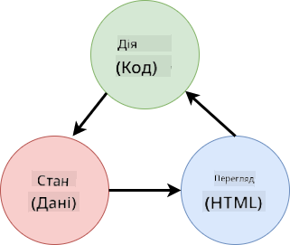
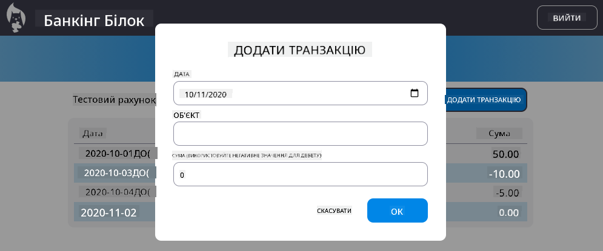

<!--
CO_OP_TRANSLATOR_METADATA:
{
  "original_hash": "5d2efabbc8f94d89f4317ee8646c3ce9",
  "translation_date": "2025-08-28T18:08:21+00:00",
  "source_file": "7-bank-project/4-state-management/README.md",
  "language_code": "uk"
}
-->
# Створення банківського додатку, частина 4: Концепції управління станом

## Попереднє опитування

[Попереднє опитування](https://ff-quizzes.netlify.app/web/quiz/47)

### Вступ

Зі зростанням веб-додатку стає складно відстежувати всі потоки даних. Який код отримує дані, яка сторінка їх використовує, де і коли їх потрібно оновлювати... Легко опинитися з заплутаним кодом, який важко підтримувати. Це особливо актуально, коли потрібно ділитися даними між різними сторінками додатку, наприклад, даними користувача. Концепція *управління станом* завжди існувала у всіх типах програм, але з ростом складності веб-додатків це стало ключовим моментом, який варто враховувати під час розробки.

У цій фінальній частині ми переглянемо додаток, який ми створили, щоб переосмислити, як управляється стан, забезпечуючи підтримку оновлення браузера в будь-який момент і збереження даних між сеансами користувача.

### Передумови

Вам потрібно завершити [отримання даних](../3-data/README.md) у веб-додатку для цього уроку. Також необхідно встановити [Node.js](https://nodejs.org) і [запустити сервер API](../api/README.md) локально, щоб ви могли управляти даними облікового запису.

Ви можете перевірити, чи сервер працює належним чином, виконавши цю команду в терміналі:

```sh
curl http://localhost:5000/api
# -> should return "Bank API v1.0.0" as a result
```

---

## Переосмислення управління станом

У [попередньому уроці](../3-data/README.md) ми ввели базову концепцію стану в нашому додатку за допомогою глобальної змінної `account`, яка містить банківські дані для поточного користувача, що увійшов у систему. Однак наша поточна реалізація має деякі недоліки. Спробуйте оновити сторінку, коли ви перебуваєте на інформаційній панелі. Що відбувається?

Є три проблеми з поточним кодом:

- Стан не зберігається, оскільки оновлення браузера повертає вас на сторінку входу.
- Є кілька функцій, які змінюють стан. Зі зростанням додатку це може ускладнити відстеження змін, і легко забути оновити одну з них.
- Стан не очищається, тому коли ви натискаєте *Вийти*, дані облікового запису все ще залишаються, навіть якщо ви перебуваєте на сторінці входу.

Ми могли б оновити наш код, щоб вирішити ці проблеми по одному, але це створило б більше дублювання коду і зробило додаток більш складним і важким для підтримки. Або ми могли б зупинитися на кілька хвилин і переосмислити нашу стратегію.

> Які проблеми ми насправді намагаємося вирішити?

[Управління станом](https://en.wikipedia.org/wiki/State_management) полягає у знаходженні хорошого підходу для вирішення цих двох конкретних проблем:

- Як зробити потоки даних у додатку зрозумілими?
- Як забезпечити синхронізацію даних стану з інтерфейсом користувача (і навпаки)?

Як тільки ви вирішите ці проблеми, будь-які інші проблеми, які можуть виникнути, або вже будуть вирішені, або стануть легшими для вирішення. Існує багато можливих підходів для вирішення цих проблем, але ми оберемо загальне рішення, яке полягає у **централізації даних і способів їх зміни**. Потоки даних виглядатимуть так:



> Тут ми не будемо розглядати частину, де дані автоматично викликають оновлення представлення, оскільки це пов'язано з більш складними концепціями [Реактивного програмування](https://en.wikipedia.org/wiki/Reactive_programming). Це хороший предмет для подальшого вивчення, якщо ви готові до глибокого занурення.

✅ Існує багато бібліотек з різними підходами до управління станом, [Redux](https://redux.js.org) є популярним варіантом. Ознайомтеся з концепціями і шаблонами, які використовуються, оскільки це часто хороший спосіб дізнатися, з якими потенційними проблемами ви можете зіткнутися у великих веб-додатках і як їх можна вирішити.

### Завдання

Почнемо з невеликого рефакторингу. Замініть оголошення `account`:

```js
let account = null;
```

На:

```js
let state = {
  account: null
};
```

Ідея полягає у *централізації* всіх даних нашого додатку в одному об'єкті стану. Зараз у стані є лише `account`, тому це не сильно змінює ситуацію, але створює основу для подальших змін.

Також потрібно оновити функції, які його використовують. У функціях `register()` і `login()` замініть `account = ...` на `state.account = ...`;

На початку функції `updateDashboard()` додайте цей рядок:

```js
const account = state.account;
```

Цей рефакторинг сам по собі не приніс значних покращень, але ідея полягала у створенні основи для наступних змін.

## Відстеження змін даних

Тепер, коли ми створили об'єкт `state` для зберігання наших даних, наступним кроком є централізація оновлень. Мета полягає у тому, щоб зробити легшим відстеження будь-яких змін і моментів, коли вони відбуваються.

Щоб уникнути змін у об'єкті `state`, також хорошою практикою є вважати його [*незмінним*](https://en.wikipedia.org/wiki/Immutable_object), тобто таким, який взагалі не можна змінювати. Це також означає, що вам потрібно створити новий об'єкт стану, якщо ви хочете щось у ньому змінити. Роблячи це, ви створюєте захист від потенційно небажаних [побічних ефектів](https://en.wikipedia.org/wiki/Side_effect_(computer_science)), і відкриваєте можливості для нових функцій у вашому додатку, таких як реалізація undo/redo, а також спрощуєте налагодження. Наприклад, ви могли б реєструвати кожну зміну стану і зберігати історію змін, щоб зрозуміти джерело помилки.

У JavaScript ви можете використовувати [`Object.freeze()`](https://developer.mozilla.org/docs/Web/JavaScript/Reference/Global_Objects/Object/freeze) для створення незмінної версії об'єкта. Якщо ви спробуєте внести зміни до незмінного об'єкта, буде викликано виняток.

✅ Чи знаєте ви різницю між *поверхневим* і *глибоким* незмінним об'єктом? Ви можете прочитати про це [тут](https://developer.mozilla.org/docs/Web/JavaScript/Reference/Global_Objects/Object/freeze#What_is_shallow_freeze).

### Завдання

Давайте створимо нову функцію `updateState()`:

```js
function updateState(property, newData) {
  state = Object.freeze({
    ...state,
    [property]: newData
  });
}
```

У цій функції ми створюємо новий об'єкт стану і копіюємо дані з попереднього стану за допомогою [*оператора розгортання (`...`)*](https://developer.mozilla.org/docs/Web/JavaScript/Reference/Operators/Spread_syntax#Spread_in_object_literals). Потім ми перевизначаємо конкретну властивість об'єкта стану новими даними, використовуючи [нотацію квадратних дужок](https://developer.mozilla.org/docs/Web/JavaScript/Guide/Working_with_Objects#Objects_and_properties) `[property]` для присвоєння. Нарешті, ми блокуємо об'єкт, щоб запобігти модифікаціям, використовуючи `Object.freeze()`. Зараз у стані зберігається лише властивість `account`, але з таким підходом ви можете додати стільки властивостей, скільки вам потрібно.

Також оновимо ініціалізацію `state`, щоб переконатися, що початковий стан також заморожений:

```js
let state = Object.freeze({
  account: null
});
```

Після цього оновіть функцію `register`, замінивши присвоєння `state.account = result;` на:

```js
updateState('account', result);
```

Зробіть те ж саме з функцією `login`, замінивши `state.account = data;` на:

```js
updateState('account', data);
```

Тепер скористаємося можливістю вирішити проблему з даними облікового запису, які не очищаються, коли користувач натискає *Вийти*.

Створіть нову функцію `logout()`:

```js
function logout() {
  updateState('account', null);
  navigate('/login');
}
```

У `updateDashboard()` замініть перенаправлення `return navigate('/login');` на `return logout();`

Спробуйте зареєструвати новий обліковий запис, вийти і знову увійти, щоб перевірити, чи все працює правильно.

> Порада: ви можете переглянути всі зміни стану, додавши `console.log(state)` в кінці `updateState()` і відкривши консоль у засобах розробки вашого браузера.

## Збереження стану

Більшість веб-додатків потребують збереження даних для коректної роботи. Усі критичні дані зазвичай зберігаються в базі даних і доступні через серверний API, як у нашому випадку з даними облікового запису користувача. Але іноді також цікаво зберігати деякі дані в клієнтському додатку, який працює у вашому браузері, для покращення досвіду користувача або підвищення продуктивності завантаження.

Коли ви хочете зберігати дані у вашому браузері, є кілька важливих питань, які варто задати собі:

- *Чи є дані конфіденційними?* Ви повинні уникати зберігання будь-яких конфіденційних даних на клієнті, таких як паролі користувачів.
- *Як довго вам потрібно зберігати ці дані?* Ви плануєте отримувати доступ до цих даних лише протягом поточного сеансу чи хочете, щоб вони зберігалися назавжди?

Існує кілька способів зберігання інформації всередині веб-додатку, залежно від того, що ви хочете досягти. Наприклад, ви можете використовувати URL-адреси для зберігання пошукового запиту і зробити його доступним для спільного використання між користувачами. Ви також можете використовувати [HTTP cookies](https://developer.mozilla.org/docs/Web/HTTP/Cookies), якщо дані потрібно передавати на сервер, наприклад, інформацію для [автентифікації](https://en.wikipedia.org/wiki/Authentication).

Ще один варіант — використовувати один із багатьох API браузера для зберігання даних. Два з них особливо цікаві:

- [`localStorage`](https://developer.mozilla.org/docs/Web/API/Window/localStorage): [Сховище ключ/значення](https://en.wikipedia.org/wiki/Key%E2%80%93value_database), яке дозволяє зберігати дані, специфічні для поточного веб-сайту, між різними сеансами. Дані, збережені в ньому, ніколи не закінчуються.
- [`sessionStorage`](https://developer.mozilla.org/docs/Web/API/Window/sessionStorage): працює так само, як `localStorage`, за винятком того, що дані, збережені в ньому, очищуються після завершення сеансу (коли браузер закривається).

Зверніть увагу, що обидва ці API дозволяють зберігати лише [рядки](https://developer.mozilla.org/docs/Web/JavaScript/Reference/Global_Objects/String). Якщо ви хочете зберігати складні об'єкти, вам потрібно буде серіалізувати їх у формат [JSON](https://developer.mozilla.org/docs/Web/JavaScript/Reference/Global_Objects/JSON) за допомогою [`JSON.stringify()`](https://developer.mozilla.org/docs/Web/JavaScript/Reference/Global_Objects/JSON/stringify).

✅ Якщо ви хочете створити веб-додаток, який не працює з сервером, також можливо створити базу даних на клієнті, використовуючи API [`IndexedDB`](https://developer.mozilla.org/docs/Web/API/IndexedDB_API). Цей варіант зарезервований для складних випадків використання або якщо вам потрібно зберігати значну кількість даних, оскільки він складніший у використанні.

### Завдання

Ми хочемо, щоб наші користувачі залишалися в системі, поки вони явно не натиснуть кнопку *Вийти*, тому ми будемо використовувати `localStorage` для зберігання даних облікового запису. Спочатку визначимо ключ, який будемо використовувати для зберігання наших даних.

```js
const storageKey = 'savedAccount';
```

Потім додайте цей рядок у кінці функції `updateState()`:

```js
localStorage.setItem(storageKey, JSON.stringify(state.account));
```

Завдяки цьому дані облікового запису користувача будуть збережені і завжди актуальні, оскільки ми централізували всі оновлення стану раніше. Тут ми починаємо отримувати вигоду від усіх наших попередніх рефакторингів 🙂.

Оскільки дані зберігаються, ми також повинні подбати про їх відновлення, коли додаток завантажується. Оскільки ми почнемо мати більше коду для ініціалізації, можливо, буде хорошою ідеєю створити нову функцію `init`, яка також включає наш попередній код у кінці `app.js`:

```js
function init() {
  const savedAccount = localStorage.getItem(storageKey);
  if (savedAccount) {
    updateState('account', JSON.parse(savedAccount));
  }

  // Our previous initialization code
  window.onpopstate = () => updateRoute();
  updateRoute();
}

init();
```

Тут ми отримуємо збережені дані, і якщо вони є, ми оновлюємо стан відповідно. Важливо зробити це *перед* оновленням маршруту, оскільки може бути код, який залежить від стану під час оновлення сторінки.

Ми також можемо зробити сторінку *Dashboard* сторінкою за замовчуванням нашого додатку, оскільки тепер ми зберігаємо дані облікового запису. Якщо дані не знайдені, інформаційна панель все одно перенаправляє на сторінку *Login*. У `updateRoute()` замініть резервний варіант `return navigate('/login');` на `return navigate('/dashboard');`.

Тепер увійдіть у додаток і спробуйте оновити сторінку. Ви повинні залишитися на інформаційній панелі. Завдяки цьому оновленню ми вирішили всі наші початкові проблеми...

## Оновлення даних

...Але ми також могли створити нову проблему. Ой!

Перейдіть на інформаційну панель, використовуючи обліковий запис `test`, а потім виконайте цю команду в терміналі, щоб створити нову транзакцію:

```sh
curl --request POST \
     --header "Content-Type: application/json" \
     --data "{ \"date\": \"2020-07-24\", \"object\": \"Bought book\", \"amount\": -20 }" \
     http://localhost:5000/api/accounts/test/transactions
```

Тепер спробуйте оновити сторінку інформаційної панелі у браузері. Що відбувається? Ви бачите нову транзакцію?

Стан зберігається безстроково завдяки `localStorage`, але це також означає, що він ніколи не оновлюється, поки ви не вийдете з додатку і знову не увійдете!

Одна з можливих стратегій вирішення цієї проблеми — перезавантажувати дані облікового запису кожного разу, коли завантажується інформаційна панель, щоб уникнути застарілих даних.

### Завдання

Створіть нову функцію `updateAccountData`:

```js
async function updateAccountData() {
  const account = state.account;
  if (!account) {
    return logout();
  }

  const data = await getAccount(account.user);
  if (data.error) {
    return logout();
  }

  updateState('account', data);
}
```

Цей метод перевіряє, чи ви зараз увійшли в систему, а потім перезавантажує дані облікового запису з сервера.

Створіть ще одну функцію під назвою `refresh`:

```js
async function refresh() {
  await updateAccountData();
  updateDashboard();
}
```

Ця функція оновлює дані облікового запису, а потім займається оновленням HTML сторінки інформаційної панелі. Це те, що нам потрібно викликати, коли завантажується маршрут інформаційної панелі. Оновіть визначення маршруту:

```js
const routes = {
  '/login': { templateId: 'login' },
  '/dashboard': { templateId: 'dashboard', init: refresh }
};
```

Тепер спробуйте оновити інформаційну панель, вона повинна відображати оновлені дані облікового запису.

---

## 🚀 Виклик

Тепер, коли ми перезавантажуємо дані облікового запису кожного разу, коли завантажується інформаційна панель, як ви думаєте, чи потрібно нам все ще зберігати *всі дані облікового запису*?

Спробуйте разом зм
[Реалізуйте діалогове вікно "Додати транзакцію"](assignment.md)

Ось приклад результату після виконання завдання:



---

**Відмова від відповідальності**:  
Цей документ було перекладено за допомогою сервісу автоматичного перекладу [Co-op Translator](https://github.com/Azure/co-op-translator). Хоча ми прагнемо до точності, зверніть увагу, що автоматичні переклади можуть містити помилки або неточності. Оригінальний документ мовою оригіналу слід вважати авторитетним джерелом. Для критично важливої інформації рекомендується професійний переклад людиною. Ми не несемо відповідальності за будь-які непорозуміння або неправильні тлумачення, що виникли внаслідок використання цього перекладу.