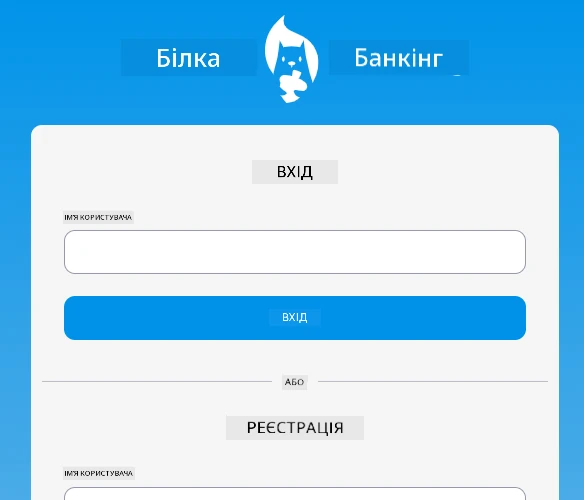
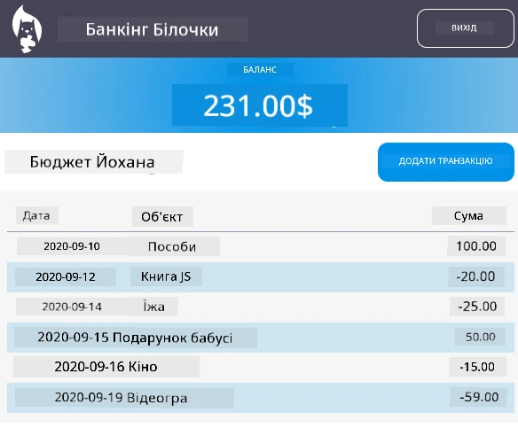

<!--
CO_OP_TRANSLATOR_METADATA:
{
  "original_hash": "830359535306594b448db6575ce5cdee",
  "translation_date": "2025-08-27T21:58:29+00:00",
  "source_file": "7-bank-project/README.md",
  "language_code": "uk"
}
-->
# :dollar: Створення Банку

У цьому проєкті ви навчитеся створювати вигаданий банк. Ці уроки включають інструкції щодо створення макету веб-додатку, налаштування маршрутів, створення форм, управління станом і отримання даних з API, з якого можна отримати дані банку.

|  |  |
|--------------------------------|--------------------------------|

## Уроки

1. [HTML-шаблони та маршрути у веб-додатку](1-template-route/README.md)
2. [Створення форми для входу та реєстрації](2-forms/README.md)
3. [Методи отримання та використання даних](3-data/README.md)
4. [Концепції управління станом](4-state-management/README.md)

### Авторство

Ці уроки були написані з :hearts: [Йоханом Ласорсою](https://twitter.com/sinedied).

Якщо вам цікаво дізнатися, як створити [серверний API](/7-bank-project/api/README.md), який використовується в цих уроках, ви можете переглянути [цю серію відео](https://aka.ms/NodeBeginner) (особливо відео з 17 по 21).

Також ви можете ознайомитися з [інтерактивним навчальним посібником](https://aka.ms/learn/express-api).

---

**Відмова від відповідальності**:  
Цей документ був перекладений за допомогою сервісу автоматичного перекладу [Co-op Translator](https://github.com/Azure/co-op-translator). Хоча ми прагнемо до точності, будь ласка, майте на увазі, що автоматичні переклади можуть містити помилки або неточності. Оригінальний документ на його рідній мові слід вважати авторитетним джерелом. Для критичної інформації рекомендується професійний людський переклад. Ми не несемо відповідальності за будь-які непорозуміння або неправильні тлумачення, що виникають внаслідок використання цього перекладу.