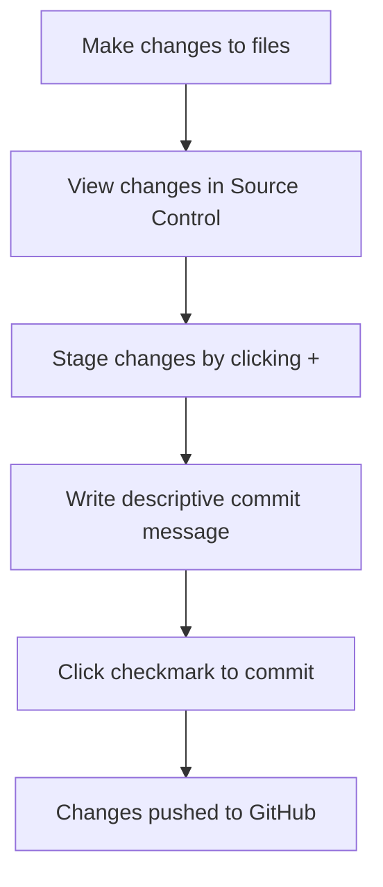

<!--
CO_OP_TRANSLATOR_METADATA:
{
  "original_hash": "cfd4a15974168ca426d50c67682ab9d4",
  "translation_date": "2025-10-24T15:24:51+00:00",
  "source_file": "8-code-editor/1-using-a-code-editor/README.md",
  "language_code": "uk"
}
-->
# Використання редактора коду: освоєння VSCode.dev

Пам'ятаєте, як у *Матриці* Нео підключався до величезного комп'ютерного терміналу, щоб отримати доступ до цифрового світу? Сучасні інструменти веб-розробки – це зовсім інша історія: надзвичайно потужні можливості, доступні з будь-якого місця. VSCode.dev – це редактор коду, який працює у браузері та надає професійні інструменти розробки на будь-якому пристрої з доступом до інтернету.

Як друкарський верстат зробив книги доступними для всіх, а не лише для переписувачів у монастирях, так і VSCode.dev демократизує програмування. Ви можете працювати над проектами з комп'ютера в бібліотеці, шкільного класу або будь-якого іншого місця, де є доступ до браузера. Без встановлення, без обмежень "мені потрібна моя специфічна конфігурація".

До кінця цього уроку ви навчитеся орієнтуватися у VSCode.dev, відкривати репозиторії GitHub прямо у браузері та використовувати Git для контролю версій – навички, на які професійні розробники покладаються щодня.

## Що ви навчитеся

Після проходження цього уроку ви зможете:

- Орієнтуватися у VSCode.dev, як у своєму другому домі – знаходити все необхідне без плутанини
- Відкривати будь-який репозиторій GitHub у браузері та починати редагування негайно (це справді магія!)
- Використовувати Git для відстеження змін і збереження прогресу, як професіонал
- Покращувати редактор за допомогою розширень, які роблять програмування швидшим і цікавішим
- Створювати та організовувати файли проекту з упевненістю

## Що вам знадобиться

Вимоги прості:

- Безкоштовний [обліковий запис GitHub](https://github.com) (ми допоможемо вам створити його, якщо потрібно)
- Базове знайомство з веб-браузерами
- Урок "Основи GitHub" надає корисну інформацію, хоча він не є обов'язковим

> 💡 **Новачок у GitHub?** Створення облікового запису безкоштовне і займає кілька хвилин. Як бібліотечна картка відкриває доступ до книг у всьому світі, так і обліковий запис GitHub відкриває двері до репозиторіїв коду в інтернеті.

## Чому важливі редактори коду на основі вебу

До появи інтернету вчені з різних університетів не могли легко ділитися дослідженнями. Потім у 1960-х роках з'явився ARPANET, який з'єднав комп'ютери на відстані. Редактори коду на основі вебу дотримуються того ж принципу – роблять потужні інструменти доступними незалежно від вашого фізичного місцезнаходження чи пристрою.

Редактор коду – це ваш робочий простір для розробки, де ви пишете, редагуєте та організовуєте файли коду. На відміну від простих текстових редакторів, професійні редактори коду забезпечують підсвічування синтаксису, виявлення помилок і функції управління проектами.

VSCode.dev переносить ці можливості у ваш браузер:

**Переваги редагування на основі вебу:**

| Функція | Опис | Практична користь |
|---------|-------------|----------|
| **Незалежність від платформи** | Працює на будь-якому пристрої з браузером | Робота з різних комп'ютерів без проблем |
| **Без необхідності встановлення** | Доступ через веб-URL | Обхід обмежень на встановлення програмного забезпечення |
| **Автоматичні оновлення** | Завжди працює з останньою версією | Доступ до нових функцій без ручних оновлень |
| **Інтеграція з репозиторіями** | Пряме підключення до GitHub | Редагування коду без управління локальними файлами |

**Практичні наслідки:**
- Безперервність роботи в різних середовищах
- Стабільний інтерфейс незалежно від операційної системи
- Миттєві можливості співпраці
- Зменшення вимог до локального зберігання

## Дослідження VSCode.dev

Як лабораторія Марії Кюрі містила складне обладнання в досить простому просторі, так і VSCode.dev об'єднує професійні інструменти розробки в інтерфейсі браузера. Ця веб-програма забезпечує ті ж основні функції, що й редактори коду для настільних комп'ютерів.

Почніть з переходу на [vscode.dev](https://vscode.dev) у вашому браузері. Інтерфейс завантажується без завантажень чи встановлень системи – пряме застосування принципів хмарних обчислень.

### Підключення вашого облікового запису GitHub

Як телефон Александра Грема Белла з'єднував віддалені місця, так і підключення вашого облікового запису GitHub об'єднує VSCode.dev з вашими репозиторіями коду. Коли вам запропонують увійти через GitHub, рекомендується прийняти це підключення.

**Інтеграція з GitHub забезпечує:**
- Прямий доступ до ваших репозиторіїв у редакторі
- Синхронізовані налаштування та розширення на різних пристроях
- Спрощений процес збереження в GitHub
- Персоналізоване середовище розробки

### Знайомство з новим робочим простором

Коли все завантажиться, ви побачите красиво оформлений робочий простір, створений для того, щоб ви зосередилися на найважливішому – вашому коді!

**Ось ваш тур по "району":**
- **Панель активності** (та смужка зліва): Ваш основний навігатор з Explorer 📁, Search 🔍, Source Control 🌿, Extensions 🧩 та Settings ⚙️
- **Бічна панель** (панель поруч): Змінюється, щоб показати вам відповідну інформацію залежно від того, що ви вибрали
- **Область редактора** (великий простір посередині): Тут відбувається магія – ваш основний простір для кодування

**Зробіть паузу, щоб дослідити:**
- Клацніть на іконки панелі активності та подивіться, що кожна з них робить
- Зверніть увагу, як бічна панель оновлюється, щоб показати різну інформацію – досить круто, правда?
- Перегляд Explorer (📁) – це, мабуть, місце, де ви будете проводити більшу частину часу, тому ознайомтеся з ним

## Відкриття репозиторіїв GitHub

До появи інтернету дослідникам доводилося фізично подорожувати до бібліотек, щоб отримати доступ до документів. Репозиторії GitHub працюють аналогічно – це колекції коду, збережені віддалено. VSCode.dev усуває традиційний крок завантаження репозиторіїв на ваш локальний комп'ютер перед редагуванням.

Ця функція дозволяє миттєво отримати доступ до будь-якого публічного репозиторію для перегляду, редагування або внесення змін. Ось два методи відкриття репозиторіїв:

### Метод 1: Спосіб "вказати і клацнути"

Цей метод ідеально підходить, коли ви починаєте з нуля у VSCode.dev і хочете відкрити конкретний репозиторій. Він простий і зручний для початківців:

**Як це зробити:**

1. Перейдіть на [vscode.dev](https://vscode.dev), якщо ви ще не там
2. Знайдіть кнопку "Open Remote Repository" на екрані привітання та натисніть її

   

3. Вставте будь-який URL репозиторію GitHub (спробуйте цей: `https://github.com/microsoft/Web-Dev-For-Beginners`)
4. Натисніть Enter і спостерігайте за магією!

**Порада для професіоналів – ярлик Command Palette:**

Хочете відчути себе чарівником програмування? Спробуйте цей ярлик клавіатури: Ctrl+Shift+P (або Cmd+Shift+P на Mac), щоб відкрити Command Palette:

**Command Palette – це як пошукова система для всього, що ви можете зробити:**
- Введіть "open remote", і вона знайде для вас відкривач репозиторіїв
- Вона запам'ятовує репозиторії, які ви відкривали нещодавно (дуже зручно!)
- Коли ви звикнете до неї, ви будете кодувати зі швидкістю блискавки
- Це, по суті, версія VSCode.dev "Привіт, Siri, але для програмування"

### Метод 2: Техніка модифікації URL

Як HTTP і HTTPS використовують різні протоколи, зберігаючи ту ж структуру домену, так і VSCode.dev використовує шаблон URL, який відображає систему адресації GitHub. Будь-який URL репозиторію GitHub можна змінити, щоб відкрити його безпосередньо у VSCode.dev.

**Шаблон трансформації URL:**

| Тип репозиторію | URL GitHub | URL VSCode.dev |
|----------------|---------------------|----------------|
| **Публічний репозиторій** | `github.com/microsoft/Web-Dev-For-Beginners` | `vscode.dev/github/microsoft/Web-Dev-For-Beginners` |
| **Особистий проект** | `github.com/your-username/my-project` | `vscode.dev/github/your-username/my-project` |
| **Будь-який доступний репозиторій** | `github.com/their-username/awesome-repo` | `vscode.dev/github/their-username/awesome-repo` |

**Реалізація:**
- Замініть `github.com` на `vscode.dev/github`
- Збережіть всі інші компоненти URL без змін
- Працює з будь-яким публічно доступним репозиторієм
- Забезпечує миттєвий доступ до редагування

> 💡 **Порада, яка змінює життя**: Додайте в закладки версії VSCode.dev ваших улюблених репозиторіїв. У мене є закладки, як "Редагувати моє портфоліо" та "Виправити документацію", які одразу переводять мене в режим редагування!

**Який метод вам слід використовувати?**
- **Інтерфейсний спосіб**: Чудово підходить, коли ви досліджуєте або не пам'ятаєте точні назви репозиторіїв
- **Трюк з URL**: Ідеально для блискавичного доступу, коли ви точно знаєте, куди йдете

## Робота з файлами та проектами

Тепер, коли ви відкрили репозиторій, давайте почнемо створювати! VSCode.dev надає вам все необхідне для створення, редагування та організації файлів коду. Думайте про це як про вашу цифрову майстерню – кожен інструмент знаходиться саме там, де вам потрібно.

Давайте зануримося в повсякденні завдання, які складатимуть більшу частину вашого робочого процесу програмування.

### Створення нових файлів

Як організація креслень в офісі архітектора, створення файлів у VSCode.dev слідує структурованому підходу. Система підтримує всі стандартні типи файлів веб-розробки.

**Процес створення файлів:**

1. Перейдіть до цільової папки в бічній панелі Explorer
2. Наведіть курсор на назву папки, щоб побачити іконку "New File" (📄+)
3. Введіть назву файлу, включаючи відповідне розширення (`style.css`, `script.js`, `index.html`)
4. Натисніть Enter, щоб створити файл

**Правила іменування:**
- Використовуйте описові назви, які вказують на призначення файлу
- Включайте розширення файлу для правильного підсвічування синтаксису
- Дотримуйтеся послідовних шаблонів іменування у проектах
- Використовуйте малі літери та дефіси замість пробілів

### Редагування та збереження файлів

Ось де починається справжнє задоволення! Редактор VSCode.dev наповнений корисними функціями, які роблять програмування плавним і інтуїтивним. Це як мати дуже розумного помічника для написання, але для коду.

**Ваш робочий процес редагування:**

1. Клацніть на будь-який файл в Explorer, щоб відкрити його в основній області
2. Почніть вводити текст і спостерігайте, як VSCode.dev допомагає вам з кольорами, підказками та виявленням помилок
3. Збережіть свою роботу за допомогою Ctrl+S (Windows/Linux) або Cmd+S (Mac) – хоча вона також автоматично зберігається!

**Круті речі, які відбуваються під час кодування:**
- Ваш код красиво підсвічується, щоб його було легко читати
- VSCode.dev пропонує завершення під час введення (як автокорекція, але набагато розумніша)
- Він виявляє помилки та помилки до того, як ви навіть збережете
- Ви можете мати кілька файлів відкритими у вкладках, як у браузері
- Все автоматично зберігається у фоновому режимі

> ⚠️ **Швидка порада**: Хоча автоматичне збереження вас підтримує, натискання Ctrl+S або Cmd+S все ще є хорошою звичкою. Це негайно зберігає все і запускає деякі додаткові корисні функції, як перевірка помилок.

### Контроль версій за допомогою Git

Як археологи створюють детальні записи шарів розкопок, так і Git відстежує зміни у вашому коді з часом. Ця система зберігає історію проекту та дозволяє повернутися до попередніх версій, коли це необхідно. VSCode.dev включає інтегровану функціональність Git.

**Інтерфейс Source Control:**

1. Доступ до панелі Source Control через іконку 🌿 у панелі активності
2. Змінені файли з'являються в розділі "Changes"
3. Колірне кодування вказує на типи змін: зелений для додавань, червоний для видалень

**Збереження вашої роботи (процес commit):**

**Ось ваш покроковий процес:**
- Натисніть іконку "+" поруч із файлами, які ви хочете зберегти (це "стадіює" їх)
- Переконайтеся, що ви задоволені всіма вашими стадійованими змінами
- Напишіть коротку примітку, пояснюючи, що ви зробили (це ваше "commit message")
- Натисніть кнопку галочки, щоб зберегти все в GitHub
- Якщо ви передумали щодо чогось, іконка скасування дозволяє відкинути зміни

**Написання хороших commit-повідомлень (це легше, ніж ви думаєте!):**
- Просто опишіть, що ви зробили, наприклад, "Додати контактну форму" або "Виправити зламану навігацію"
- Зберігайте короткість і чіткість – думайте про довжину твіту, а не есе
- Починайте з дієслів, як "Додати", "Виправити", "Оновити" або "Видалити"
- **Хороші приклади**: "
- Кожне розширення показує рейтинги, кількість завантажень і реальні відгуки користувачів
- Ви отримуєте скріншоти та чіткі описи того, що кожне з них робить
- Усе чітко позначено інформацією про сумісність
- Пропонуються схожі розширення, щоб ви могли порівняти варіанти

### Встановлення розширень (Це дуже просто!)

Додавати нові функції до вашого редактора так само просто, як натиснути кнопку. Розширення встановлюються за секунди і починають працювати одразу – без перезавантажень, без очікування.

**Ось що потрібно зробити:**

1. Знайдіть те, що вам потрібно (спробуйте пошукати "live server" або "prettier")
2. Натисніть на те, що виглядає добре, щоб побачити більше деталей
3. Ознайомтеся з описом і перевірте рейтинги
4. Натисніть синю кнопку "Install", і готово!

**Що відбувається за лаштунками:**
- Розширення завантажується і налаштовується автоматично
- Нові функції з'являються у вашому інтерфейсі одразу
- Усе починає працювати миттєво (серйозно, це так швидко!)
- Якщо ви увійшли в систему, розширення синхронізується на всіх ваших пристроях

**Деякі розширення, які я рекомендую почати використовувати:**
- **Live Server**: Дивіться, як ваш сайт оновлюється в реальному часі під час написання коду (це просто магія!)
- **Prettier**: Автоматично робить ваш код чистим і професійним
- **Auto Rename Tag**: Змінює один HTML-тег, і його парний тег також оновлюється
- **Bracket Pair Colorizer**: Розфарбовує дужки, щоб ви не заплуталися
- **GitLens**: Покращує функції Git з великою кількістю корисної інформації

### Налаштування ваших розширень

Більшість розширень мають налаштування, які ви можете змінити, щоб вони працювали саме так, як вам потрібно. Це як налаштування сидіння і дзеркал в автомобілі – у кожного свої вподобання!

**Налаштування параметрів розширень:**

1. Знайдіть встановлене розширення в панелі Extensions
2. Знайдіть маленьку іконку шестерні (⚙️) поруч із його назвою і натисніть її
3. Виберіть "Extension Settings" у випадаючому меню
4. Налаштуйте параметри так, щоб вони відповідали вашому робочому процесу

**Загальні параметри, які ви можете змінити:**
- Як форматуватиметься ваш код (табуляція чи пробіли, довжина рядків тощо)
- Які комбінації клавіш запускають різні дії
- З якими типами файлів має працювати розширення
- Увімкнення або вимкнення певних функцій для збереження чистоти інтерфейсу

### Організація ваших розширень

Коли ви відкриєте для себе більше цікавих розширень, вам захочеться тримати свою колекцію в порядку і забезпечити її безперебійну роботу. VSCode.dev робить це дуже просто.

**Ваші варіанти управління розширеннями:**

| Що можна зробити | Коли це корисно | Порада |
|--------|---------|----------|
| **Вимкнути** | Перевірка, чи розширення викликає проблеми | Краще, ніж видаляти, якщо ви можете захотіти повернути його |
| **Видалити** | Повністю видалити розширення, які вам не потрібні | Зберігає ваше середовище чистим і швидким |
| **Оновити** | Отримання останніх функцій і виправлень помилок | Зазвичай відбувається автоматично, але варто перевіряти |

**Як я люблю управляти розширеннями:**
- Кожні кілька місяців я переглядаю встановлені розширення і видаляю ті, які не використовую
- Я оновлюю розширення, щоб отримувати останні покращення та виправлення безпеки
- Якщо щось працює повільно, я тимчасово вимикаю розширення, щоб перевірити, чи є воно причиною
- Я читаю примітки до оновлень, коли розширення отримують значні зміни – іноді там є круті нові функції!

> ⚠️ **Порада щодо продуктивності**: Розширення – це чудово, але їх надмірна кількість може уповільнити роботу. Зосередьтеся на тих, які дійсно полегшують ваше життя, і не бійтеся видаляти ті, які ви не використовуєте.

## Виклик агента GitHub Copilot 🚀

Як структурований підхід NASA до космічних місій, цей виклик передбачає систематичне застосування навичок VSCode.dev у повному робочому процесі.

**Мета:** Продемонструвати володіння VSCode.dev, створивши комплексний робочий процес веб-розробки.

**Вимоги до проекту:** Використовуючи режим Agent, виконайте ці завдання:
1. Форкніть існуючий репозиторій або створіть новий
2. Створіть функціональну структуру проекту з файлами HTML, CSS і JavaScript
3. Встановіть і налаштуйте три розширення для покращення розробки
4. Практикуйте контроль версій із описовими повідомленнями комітів
5. Експериментуйте зі створенням і модифікацією гілок функцій
6. Задокументуйте процес і отримані знання у файлі README.md

Ця вправа об'єднує всі концепції VSCode.dev у практичний робочий процес, який можна застосувати до майбутніх проектів розробки.

Дізнайтеся більше про [режим агента](https://code.visualstudio.com/blogs/2025/02/24/introducing-copilot-agent-mode) тут.

## Завдання

Час перевірити ці навички на практиці! У мене є практичний проект, який дозволить вам попрактикувати все, що ми розглянули: [Створіть сайт-резюме за допомогою VSCode.dev](./assignment.md)

Це завдання проведе вас через створення професійного сайту-резюме повністю у вашому браузері. Ви використаєте всі функції VSCode.dev, які ми дослідили, і в результаті отримаєте як гарний сайт, так і впевненість у новому робочому процесі.

## Продовжуйте досліджувати і розвивати свої навички

У вас вже є міцна основа, але є ще багато цікавого, що можна відкрити! Ось кілька ресурсів і ідей для вдосконалення ваших навичок роботи з VSCode.dev:

**Офіційна документація, яку варто зберегти:**
- [Документація VSCode Web](https://code.visualstudio.com/docs/editor/vscode-web?WT.mc_id=academic-0000-alfredodeza) – Повний посібник з редагування в браузері
- [GitHub Codespaces](https://docs.github.com/en/codespaces) – Для тих, хто хоче ще більше потужності в хмарі

**Круті функції, які варто спробувати:**
- **Гарячі клавіші**: Вивчіть комбінації клавіш, які зроблять вас майстром кодування
- **Налаштування робочого простору**: Налаштуйте різні середовища для різних типів проектів
- **Мульти-кореневі робочі простори**: Працюйте з кількома репозиторіями одночасно (дуже зручно!)
- **Інтеграція терміналу**: Доступ до інструментів командного рядка прямо у вашому браузері

**Ідеї для практики:**
- Займіться деякими проектами з відкритим кодом і внесіть свій вклад за допомогою VSCode.dev – це чудовий спосіб допомогти спільноті!
- Спробуйте різні розширення, щоб знайти ідеальну конфігурацію
- Створіть шаблони проектів для типів сайтів, які ви створюєте найчастіше
- Практикуйте робочі процеси Git, такі як створення гілок і злиття – ці навички дуже цінні в командних проектах

---

**Ви освоїли розробку в браузері!** 🎉 Як винахід портативних інструментів дозволив ученим проводити дослідження у віддалених місцях, VSCode.dev дозволяє професійно кодувати з будь-якого пристрою, підключеного до інтернету.

Ці навички відображають сучасні галузеві практики – багато професійних розробників використовують хмарні середовища розробки через їх гнучкість і доступність. Ви освоїли робочий процес, який масштабується від індивідуальних проектів до великих командних співпраць.

Застосуйте ці техніки у вашому наступному проекті розробки! 🚀

---

**Відмова від відповідальності**:  
Цей документ був перекладений за допомогою сервісу автоматичного перекладу [Co-op Translator](https://github.com/Azure/co-op-translator). Хоча ми прагнемо до точності, будь ласка, майте на увазі, що автоматичні переклади можуть містити помилки або неточності. Оригінальний документ на його рідній мові слід вважати авторитетним джерелом. Для критичної інформації рекомендується професійний людський переклад. Ми не несемо відповідальності за будь-які непорозуміння або неправильні тлумачення, що виникають внаслідок використання цього перекладу.