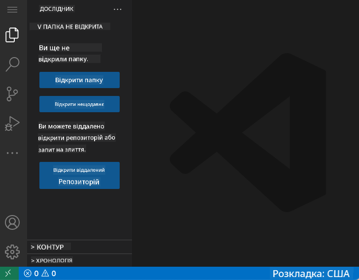
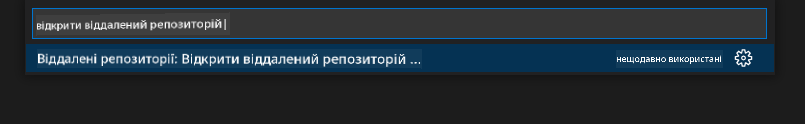
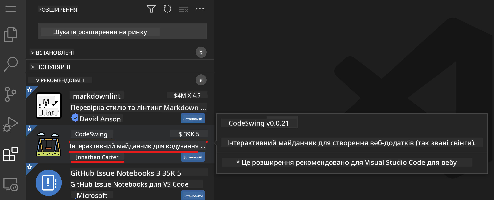
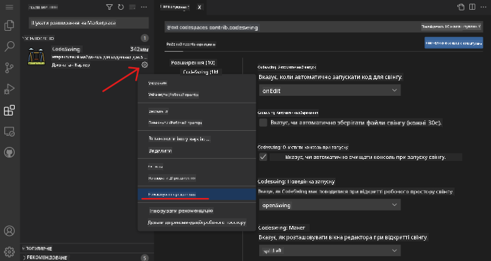

<!--
CO_OP_TRANSLATOR_METADATA:
{
  "original_hash": "1ba61d96a11309a2a6ea507496dcf7e5",
  "translation_date": "2025-08-28T18:19:57+00:00",
  "source_file": "8-code-editor/1-using-a-code-editor/README.md",
  "language_code": "uk"
}
-->
# Використання редактора коду

Цей урок охоплює основи використання [VSCode.dev](https://vscode.dev), веб-редактора коду, щоб ви могли вносити зміни до свого коду та брати участь у проєкті без необхідності встановлювати щось на свій комп'ютер.

## Цілі навчання

У цьому уроці ви навчитеся:

- Використовувати редактор коду в проєкті
- Відстежувати зміни за допомогою системи контролю версій
- Налаштовувати редактор для розробки

### Попередні вимоги

Перед початком вам потрібно створити обліковий запис на [GitHub](https://github.com). Перейдіть на [GitHub](https://github.com/) і створіть обліковий запис, якщо у вас його ще немає.

### Вступ

Редактор коду — це важливий інструмент для написання програм і співпраці над існуючими проєктами. Як тільки ви зрозумієте основи редактора та навчитеся використовувати його функції, ви зможете застосовувати ці знання під час написання коду.

## Початок роботи з VSCode.dev

[VSCode.dev](https://vscode.dev) — це редактор коду у веб-браузері. Вам не потрібно нічого встановлювати, щоб ним користуватися, так само як відкривати будь-який інший вебсайт. Щоб почати роботу з редактором, відкрийте наступне посилання: [https://vscode.dev](https://vscode.dev). Якщо ви не ввійшли до [GitHub](https://github.com/), дотримуйтесь інструкцій для входу або створення нового облікового запису, а потім увійдіть.

Після завантаження редактор має виглядати приблизно так:



Є три основні секції, починаючи з крайньої лівої сторони і рухаючись вправо:

1. _Панель активності_, яка містить кілька іконок, таких як лупа 🔎, шестерня ⚙️ та інші.
2. Розширена панель активності, яка за замовчуванням відкриває _Провідник_, називається _бічною панеллю_.
3. І, нарешті, область коду праворуч.

Натисніть на кожну з іконок, щоб відобразити різні меню. Після цього натисніть на _Провідник_, щоб повернутися до початкового вигляду.

Коли ви почнете створювати код або змінювати існуючий, це буде відбуватися у найбільшій області праворуч. Ви також будете використовувати цю область для перегляду існуючого коду, що зробите далі.

## Відкриття репозиторію GitHub

Перше, що вам потрібно зробити, — це відкрити репозиторій GitHub. Існує кілька способів відкриття репозиторію. У цьому розділі ви побачите два різні способи, як можна відкрити репозиторій, щоб почати працювати над змінами.

### 1. За допомогою редактора

Використовуйте сам редактор, щоб відкрити віддалений репозиторій. Якщо ви перейдете на [VSCode.dev](https://vscode.dev), ви побачите кнопку _"Open Remote Repository"_:


Ви також можете скористатися командною палітрою. Командна палітра — це поле введення, де ви можете ввести будь-яке слово, яке є частиною команди або дії, щоб знайти потрібну команду для виконання. Використовуйте меню у верхньому лівому куті, потім виберіть _View_, а потім _Command Palette_, або скористайтеся наступним комбінацією клавіш: Ctrl-Shift-P (на MacOS — Command-Shift-P).



Після відкриття меню введіть _open remote repository_, а потім виберіть перший варіант. З'являться кілька репозиторіїв, до яких ви належите або які ви відкривали раніше. Ви також можете використати повну URL-адресу GitHub, щоб вибрати один із них. Використайте наступну URL-адресу та вставте її у поле:

```
https://github.com/microsoft/Web-Dev-For-Beginners
```

✅ Якщо все пройшло успішно, ви побачите всі файли цього репозиторію, завантажені у текстовий редактор.

### 2. Використання URL-адреси

Ви також можете використовувати URL-адресу безпосередньо для завантаження репозиторію. Наприклад, повна URL-адреса поточного репозиторію — [https://github.com/microsoft/Web-Dev-For-Beginners](https://github.com/microsoft/Web-Dev-For-Beginners), але ви можете замінити домен GitHub на `VSCode.dev/github` і завантажити репозиторій безпосередньо. Отримана URL-адреса буде [https://vscode.dev/github/microsoft/Web-Dev-For-Beginners](https://vscode.dev/github/microsoft/Web-Dev-For-Beginners).

## Редагування файлів

Після того, як ви відкрили репозиторій у браузері/vscode.dev, наступним кроком буде внесення оновлень або змін до проєкту.

### 1. Створення нового файлу

Ви можете створити файл всередині існуючої папки або в кореневій директорії/папці. Щоб створити новий файл, відкрийте місце/директорію, куди ви хочете зберегти файл, і виберіть іконку _'New file ...'_ на панелі активності _(ліворуч)_, дайте йому назву і натисніть Enter.


### 2. Редагування та збереження файлу в репозиторії

Використання vscode.dev корисне, коли вам потрібно швидко оновити свій проєкт без завантаження будь-якого програмного забезпечення локально.  
Щоб оновити код, натисніть іконку 'Explorer', також розташовану на панелі активності, щоб переглянути файли та папки в репозиторії.  
Виберіть файл, щоб відкрити його в області коду, внесіть зміни та збережіть.


Після завершення оновлення проєкту виберіть іконку _`source control`_, яка містить усі нові зміни, які ви внесли до репозиторію.

Щоб переглянути зміни, які ви внесли до проєкту, виберіть файл(и) у папці `Changes` на розширеній панелі активності. Це відкриє 'Робоче дерево', де ви зможете візуально побачити зміни, внесені до файлу. Червоний колір показує видалення з проєкту, а зелений — додавання.


Якщо ви задоволені внесеними змінами, наведіть курсор на папку `Changes` і натисніть кнопку `+`, щоб підготувати зміни до коміту. Підготовка означає підготовку ваших змін для їхнього коміту до GitHub.

Якщо ж ви не задоволені деякими змінами і хочете їх скасувати, наведіть курсор на папку `Changes` і виберіть іконку `undo`.

Потім введіть `commit message` _(Опис змін, які ви внесли до проєкту)_, натисніть іконку `check`, щоб закомітити та відправити зміни.

Після завершення роботи над проєктом виберіть іконку `hamburger menu` у верхньому лівому куті, щоб повернутися до репозиторію на github.com.


## Використання розширень

Встановлення розширень у VSCode дозволяє додавати нові функції та налаштовувати середовище розробки у вашому редакторі для покращення робочого процесу. Ці розширення також допомагають додати підтримку для кількох мов програмування і часто є або загальними розширеннями, або мовно-орієнтованими.

Щоб переглянути список усіх доступних розширень, натисніть іконку _`Extensions`_ на панелі активності та почніть вводити назву розширення у текстовому полі з написом _'Search Extensions in Marketplace'_.  
Ви побачите список розширень, кожне з яких містить **назву розширення, ім'я видавця, короткий опис, кількість завантажень** та **рейтинг у вигляді зірок**.



Ви також можете переглянути всі раніше встановлені розширення, розширення, популярні серед більшості розробників, у папці _`Popular`_, а також рекомендовані розширення для вас — або від користувачів у тому ж робочому просторі, або на основі ваших нещодавно відкритих файлів — у папці _`Recommended`_.


### 1. Встановлення розширень

Щоб встановити розширення, введіть його назву у поле пошуку та натисніть на нього, щоб переглянути додаткову інформацію про розширення в області коду, як тільки воно з'явиться на розширеній панелі активності.

Ви можете натиснути _синю кнопку встановлення_ на розширеній панелі активності, щоб встановити розширення, або скористатися кнопкою встановлення, яка з'являється в області коду після вибору розширення для завантаження додаткової інформації.


### 2. Налаштування розширень

Після встановлення розширення вам може знадобитися змінити його поведінку та налаштувати його відповідно до ваших уподобань. Для цього виберіть іконку Extensions, і цього разу ваше розширення з'явиться у папці _Installed_, натисніть на _**Gear icon**_ і перейдіть до _Extensions Setting_.



### 3. Управління розширеннями

Після встановлення та використання розширення vscode.dev пропонує варіанти управління розширенням залежно від різних потреб. Наприклад, ви можете:

- **Вимкнути:** _(Ви тимчасово вимикаєте розширення, коли більше не потребуєте його, але не хочете повністю видаляти)_

    Виберіть встановлене розширення на розширеній панелі активності > натисніть Gear icon > виберіть 'Disable' або 'Disable (Workspace)' **АБО** відкрийте розширення в області коду та натисніть синю кнопку Disable.

- **Видалити:** Виберіть встановлене розширення на розширеній панелі активності > натисніть Gear icon > виберіть 'Uninstall' **АБО** відкрийте розширення в області коду та натисніть синю кнопку Uninstall.

---

## Завдання

[Створіть вебсайт-резюме за допомогою vscode.dev](https://github.com/microsoft/Web-Dev-For-Beginners/blob/main/8-code-editor/1-using-a-code-editor/assignment.md)

## Огляд та самостійне навчання

Дізнайтеся більше про [VSCode.dev](https://code.visualstudio.com/docs/editor/vscode-web?WT.mc_id=academic-0000-alfredodeza) та його інші функції.

---

**Відмова від відповідальності**:  
Цей документ був перекладений за допомогою сервісу автоматичного перекладу [Co-op Translator](https://github.com/Azure/co-op-translator). Хоча ми прагнемо до точності, будь ласка, майте на увазі, що автоматичні переклади можуть містити помилки або неточності. Оригінальний документ на його рідній мові слід вважати авторитетним джерелом. Для критично важливої інформації рекомендується професійний людський переклад. Ми не несемо відповідальності за будь-які непорозуміння або неправильні тлумачення, що виникають внаслідок використання цього перекладу.