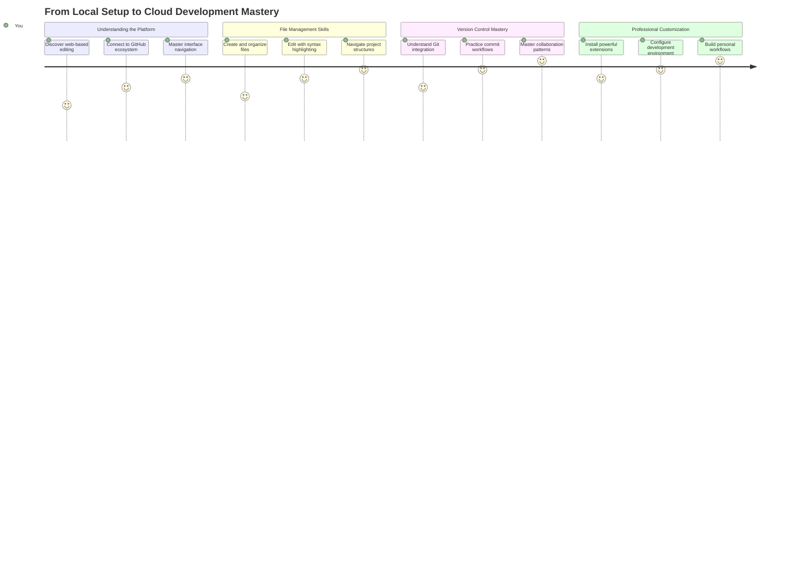
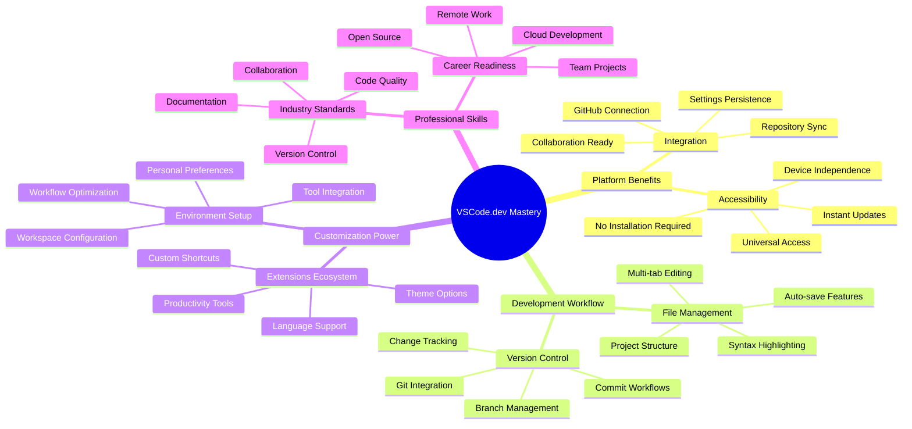
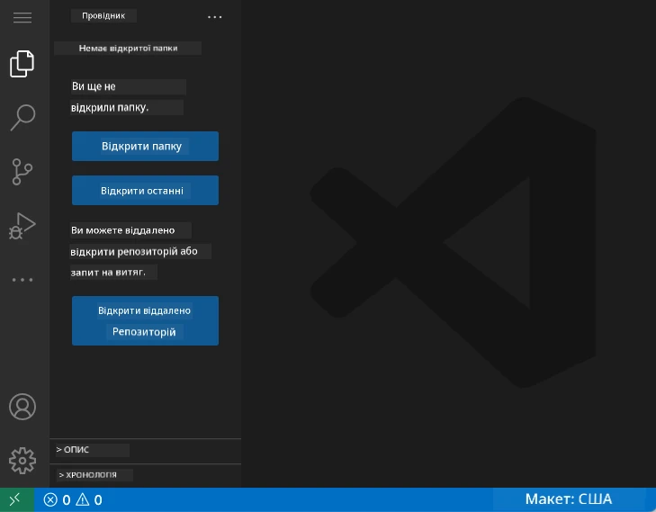
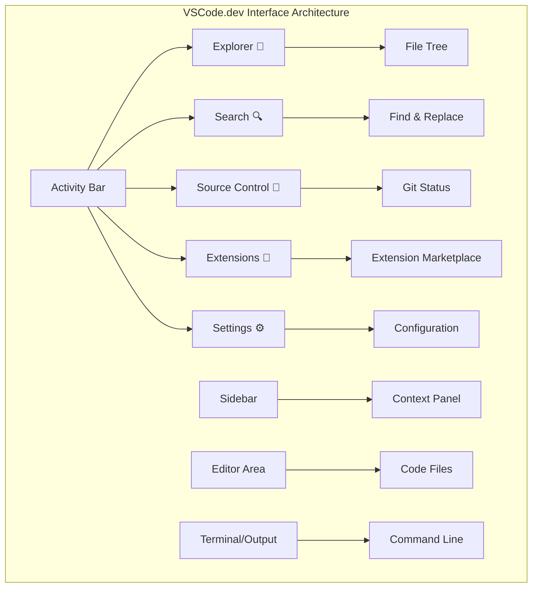
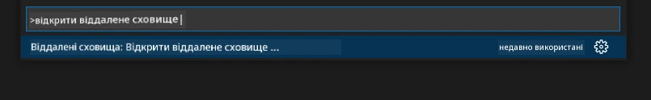
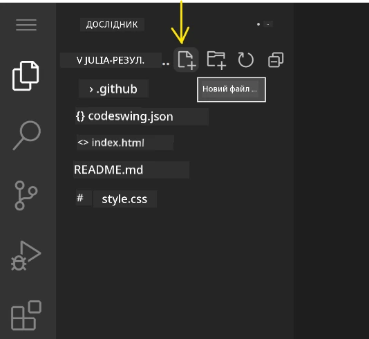
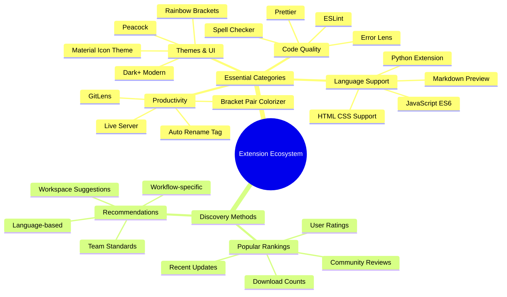
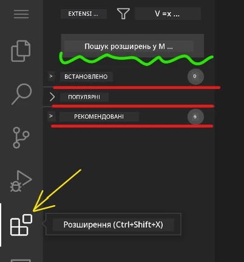
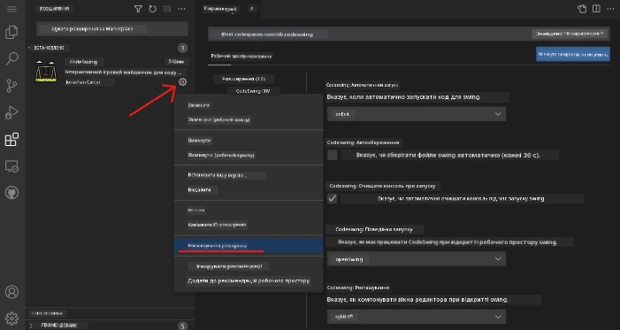
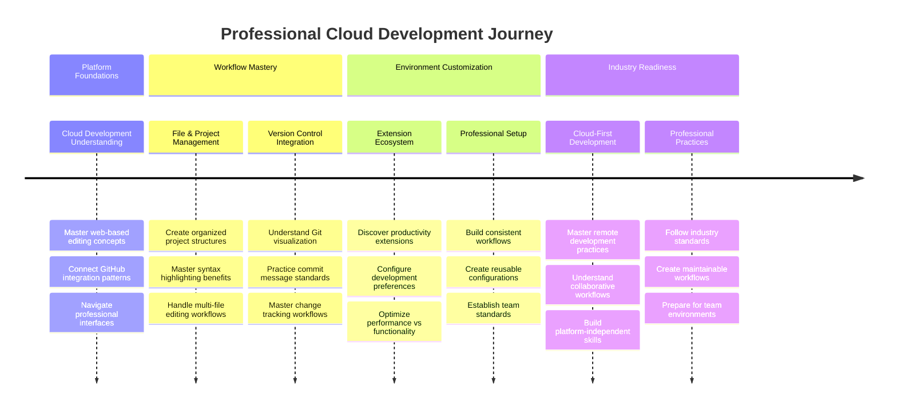

<!--
CO_OP_TRANSLATOR_METADATA:
{
  "original_hash": "a9a3bcc037a447e2d8994d99e871cd9f",
  "translation_date": "2025-11-06T13:16:55+00:00",
  "source_file": "8-code-editor/1-using-a-code-editor/README.md",
  "language_code": "uk"
}
-->
# Використання редактора коду: освоєння VSCode.dev

Пам'ятаєте, як у *Матриці* Нео підключався до величезного комп'ютерного терміналу, щоб отримати доступ до цифрового світу? Сучасні інструменти веб-розробки — це зовсім інша історія: надзвичайно потужні можливості, доступні з будь-якого місця. VSCode.dev — це редактор коду, який працює у браузері та надає професійні інструменти розробки на будь-якому пристрої з доступом до інтернету.

Як друкарський верстат зробив книги доступними для всіх, а не лише для переписувачів у монастирях, так і VSCode.dev демократизує програмування. Ви можете працювати над проектами з комп'ютера в бібліотеці, шкільного класу або будь-якого місця, де є доступ до браузера. Без встановлення, без обмежень "мені потрібна моя специфічна конфігурація".

До кінця цього уроку ви навчитеся орієнтуватися у VSCode.dev, відкривати репозиторії GitHub прямо у браузері та використовувати Git для контролю версій — навички, на які професійні розробники покладаються щодня.

## ⚡ Що можна зробити за наступні 5 хвилин

**Швидкий старт для зайнятих розробників**


- **Хвилина 1**: Перейдіть на [vscode.dev](https://vscode.dev) — встановлення не потрібне
- **Хвилина 2**: Увійдіть через GitHub, щоб підключити свої репозиторії
- **Хвилина 3**: Спробуйте трюк з URL: змініть `github.com` на `vscode.dev/github` у будь-якому URL репозиторію
- **Хвилина 4**: Створіть новий файл і побачте, як автоматично працює підсвічування синтаксису
- **Хвилина 5**: Зробіть зміни та зафіксуйте їх через панель Source Control

**Швидкий тестовий URL**:
```
# Transform this:
github.com/microsoft/Web-Dev-For-Beginners

# Into this:
vscode.dev/github/microsoft/Web-Dev-For-Beginners
```

**Чому це важливо**: За 5 хвилин ви відчуєте свободу програмування будь-де з професійними інструментами. Це майбутнє розробки — доступне, потужне та миттєве.

## 🗺️ Ваш навчальний шлях через хмарну розробку



**Мета вашого навчання**: До кінця цього уроку ви освоїте професійне середовище хмарної розробки, яке працює на будь-якому пристрої, дозволяючи вам програмувати з тими ж інструментами, які використовують розробники у великих технологічних компаніях.

## Що ви навчитеся

Після проходження цього уроку ви зможете:

- Орієнтуватися у VSCode.dev, як у своєму другому домі — знаходити все необхідне без плутанини
- Відкривати будь-який репозиторій GitHub у браузері та починати редагування негайно (це дійсно магія!)
- Використовувати Git для відстеження змін і збереження прогресу, як професіонал
- Покращувати редактор за допомогою розширень, які роблять програмування швидшим і цікавішим
- Створювати та організовувати файли проекту з упевненістю

## Що вам знадобиться

Вимоги прості:

- Безкоштовний [обліковий запис GitHub](https://github.com) (ми допоможемо вам створити його, якщо потрібно)
- Базове знайомство з веб-браузерами
- Урок "Основи GitHub" надає корисну інформацію, хоча це не обов'язково

> 💡 **Новачок у GitHub?** Створення облікового запису безкоштовне і займає кілька хвилин. Як бібліотечна картка дає доступ до книг у всьому світі, так і обліковий запис GitHub відкриває двері до репозиторіїв коду в інтернеті.

## 🧠 Огляд екосистеми хмарної розробки



**Основний принцип**: Середовища хмарної розробки представляють майбутнє програмування — забезпечуючи професійні інструменти, які доступні, колаборативні та незалежні від платформи.

## Чому важливі редактори коду на основі вебу

До появи інтернету вчені з різних університетів не могли легко ділитися дослідженнями. Потім з'явився ARPANET у 1960-х роках, який з'єднав комп'ютери на відстані. Редактори коду на основі вебу слідують цьому ж принципу — роблячи потужні інструменти доступними незалежно від вашого фізичного місцезнаходження чи пристрою.

Редактор коду служить вашим робочим простором для розробки, де ви пишете, редагуєте та організовуєте файли коду. На відміну від простих текстових редакторів, професійні редактори коду забезпечують підсвічування синтаксису, виявлення помилок і функції управління проектами.

VSCode.dev приносить ці можливості у ваш браузер:

**Переваги веб-редагування:**

| Функція | Опис | Практична користь |
|---------|-------------|----------|
| **Незалежність від платформи** | Працює на будь-якому пристрої з браузером | Робота з різних комп'ютерів без проблем |
| **Без необхідності встановлення** | Доступ через веб-URL | Обхід обмежень на встановлення програмного забезпечення |
| **Автоматичні оновлення** | Завжди працює з останньою версією | Доступ до нових функцій без ручних оновлень |
| **Інтеграція з репозиторіями** | Пряме підключення до GitHub | Редагування коду без управління локальними файлами |

**Практичні наслідки:**
- Безперервність роботи в різних середовищах
- Стабільний інтерфейс незалежно від операційної системи
- Миттєві можливості для співпраці
- Зменшення вимог до локального зберігання

## Дослідження VSCode.dev

Як лабораторія Марії Кюрі містила складне обладнання в досить простому просторі, так і VSCode.dev об'єднує професійні інструменти розробки в інтерфейсі браузера. Ця веб-програма забезпечує ті ж основні функції, що й редактори коду для настільних комп'ютерів.

Почніть, перейшовши на [vscode.dev](https://vscode.dev) у вашому браузері. Інтерфейс завантажується без завантажень чи встановлень — пряме застосування принципів хмарних обчислень.

### Підключення вашого облікового запису GitHub

Як телефон Александра Грема Белла з'єднував віддалені місця, так і підключення вашого облікового запису GitHub об'єднує VSCode.dev з вашими репозиторіями коду. Коли вам запропонують увійти через GitHub, рекомендується прийняти це підключення.

**Інтеграція з GitHub забезпечує:**
- Прямий доступ до ваших репозиторіїв у редакторі
- Синхронізацію налаштувань і розширень на різних пристроях
- Спрощений процес збереження в GitHub
- Персоналізоване середовище розробки

### Знайомство з вашим новим робочим простором

Коли все завантажиться, ви побачите красиво оформлений робочий простір, створений для того, щоб ви могли зосередитися на найважливішому — вашому коді!



**Ось ваш тур по околицях:**
- **Панель активності** (та смужка зліва): Ваш основний навігатор з Explorer 📁, Search 🔍, Source Control 🌿, Extensions 🧩 та Settings ⚙️
- **Бічна панель** (панель поруч): Змінюється, щоб показати вам відповідну інформацію залежно від того, що ви вибрали
- **Область редактора** (великий простір посередині): Тут відбувається магія — ваша основна зона для програмування

**Зробіть паузу, щоб дослідити:**
- Клацніть на іконки панелі активності та подивіться, що кожна з них робить
- Зверніть увагу, як бічна панель оновлюється, щоб показати різну інформацію — досить круто, правда?
- Перегляд Explorer (📁) — це, мабуть, місце, де ви проведете більшу частину часу, тому ознайомтеся з ним



## Відкриття репозиторіїв GitHub

До появи інтернету дослідникам доводилося фізично подорожувати до бібліотек, щоб отримати доступ до документів. Репозиторії GitHub працюють аналогічно — це колекції коду, збережені віддалено. VSCode.dev усуває традиційний крок завантаження репозиторіїв на ваш локальний комп'ютер перед редагуванням.

Ця функція дозволяє миттєво отримати доступ до будь-якого публічного репозиторію для перегляду, редагування або внесення змін. Ось два способи відкриття репозиторіїв:

### Метод 1: Спосіб "вказати і клацнути"

Це ідеально, коли ви починаєте з нуля у VSCode.dev і хочете відкрити конкретний репозиторій. Це просто і зручно для початківців:

**Як це зробити:**

1. Перейдіть на [vscode.dev](https://vscode.dev), якщо ви ще не там
2. Знайдіть кнопку "Open Remote Repository" на екрані привітання та натисніть її

   

3. Вставте будь-який URL репозиторію GitHub (спробуйте цей: `https://github.com/microsoft/Web-Dev-For-Beginners`)
4. Натисніть Enter і спостерігайте за магією!

**Порада професіонала — ярлик Command Palette:**

Хочете відчути себе чарівником програмування? Спробуйте цей ярлик клавіатури: Ctrl+Shift+P (або Cmd+Shift+P на Mac), щоб відкрити Command Palette:



**Command Palette — це як пошукова система для всього, що ви можете зробити:**
- Введіть "open remote", і вона знайде відкривач репозиторіїв для вас
- Вона запам'ятовує репозиторії, які ви відкривали нещодавно (дуже зручно!)
- Як тільки ви звикнете до неї, ви будете програмувати зі швидкістю блискавки
- Це, по суті, версія VSCode.dev "Привіт, Siri, але для програмування"

### Метод 2: Техніка модифікації URL

Як HTTP і HTTPS використовують різні протоколи, зберігаючи ту ж структуру домену, так і VSCode.dev використовує шаблон URL, який відображає систему адресації GitHub. Будь-який URL репозиторію GitHub можна змінити, щоб відкрити його безпосередньо у VSCode.dev.

**Шаблон трансформації URL:**

| Тип репозиторію | URL GitHub | URL VSCode.dev |
|----------------|---------------------|----------------|
| **Публічний репозиторій** | `github.com/microsoft/Web-Dev-For-Beginners` | `vscode.dev/github/microsoft/Web-Dev-For-Beginners` |
| **Особистий проект** | `github.com/your-username/my-project` | `vscode.dev/github/your-username/my-project` |
| **Будь-який доступний репозиторій** | `github.com/their-username/awesome-repo` | `vscode.dev/github/their-username/awesome-repo` |

**Реалізація:**
- Замініть `github.com` на `vscode.dev/github`
- Збережіть всі інші компоненти URL без змін
- Працює з будь-яким публічно доступним репозиторієм
- Забезпечує миттєвий доступ до редагування

> 💡 **Порада, що змінює життя**: Додайте в закладки версії VSCode.dev ваших улюблених репозиторіїв. У мене є закладки, як "Редагувати моє портфоліо" і "Виправити документацію", які одразу переводять мене в режим редагування!

**Який метод вам слід використовувати?**
- **Інтерфейсний спосіб**: Чудово, коли ви досліджуєте або не можете згадати точні назви репозиторіїв
- **Трюк з URL**: Ідеально для блискавичного доступу, коли ви точно знаєте, куди йдете

### 🎯 Педагогічна перевірка: доступ до хмарної розробки

**Зупиніться і подумайте**: Ви щойно дізналися два методи доступу до репозиторіїв коду через веб-браузер. Це представляє фундаментальну зміну в тому, як працює розробка.

**Швидка самооцінка**:
- Чи можете ви пояснити, чому веб-редагування усуває традиційну "налаштування середовища розробки"?
- Які переваги надає техніка модифікації URL у порівнянні з локальним клонуванням через git?
- Як цей підхід змінює спосіб вашого внеску в проекти з відкритим кодом?

**Зв'язок з реальним світом**: Великі компанії, такі як GitHub, GitLab і Replit, побудували свої платформи розробки навколо цих принципів хмарного підходу. Ви вивчаєте ті ж робочі процеси, які використовують професійні команди розробників у всьому світі.

**Питання для виклику**: Як хмарна розробка може змінити спосіб викладання програмування в школах? Розгляньте вимоги до пристроїв, управління програмним забезпеченням і можливості співпраці.

## Робота з файлами та проектами

Тепер, коли ви відкрили репозиторій, давайте почнемо створювати! VSCode.dev надає вам все необхідне для створення, редагування та організації ваших файлів коду. Уявіть це як вашу цифрову майстерню — кожен інструмент знаходиться саме там, де вам потрібно.

Давайте зануримося в повсякденні завдання, які складатимуть більшу частину вашого робочого процесу програмування.

### Створення нових файлів

Як організація креслень в офісі архітектора, створення файлів у VSCode.dev слідує структурованому підходу. Система підтримує всі стандартні типи файлів веб-розробки.

**Процес створення файлів:**

1. Перейдіть до цільової папки в бічній панелі Explorer
2. Наведіть курсор на назву папки, щоб побачити іконку "New File" (📄+)
3. Введіть назву файлу, включаючи відповідне розширення (`style.css`, `script.js`, `index.html`)
4. Натисніть Enter, щоб створити файл



**Правила іменування:**
- Використовуйте описові назви, які вказують на призначення файлу
- Включайте розширення файлів для правильного підсвічування синтаксису
- Дотримуйтесь послідовних шаблонів іменування у проектах
- Використовуйте малі літери та дефіси замість пробілів

### Редагування та збереження файлів

Ось де починається справжнє задоволення! Редактор VSCode.dev наповнений корисними функціями, які роблять програмування плавним і інтуїтивним. Це як мати дуже розумного помічника для написання, але для коду.

**Ваш робочий процес редагування:**

1. Клацніть на будь-який файл в Explorer, щоб відкрити його в основній області
2. Почніть вводити текст і спостерігайте, як VSCode.dev
- Перевірте, чи задоволені ви всіма змінами, які ви підготували
- Напишіть коротку примітку, пояснюючи, що ви зробили (це ваше "повідомлення про коміт")
- Натисніть кнопку з галочкою, щоб зберегти все на GitHub
- Якщо ви передумали щодо чогось, значок "скасувати" дозволяє відхилити зміни

**Як писати хороші повідомлення про коміт (це простіше, ніж здається!):**
- Просто опишіть, що ви зробили, наприклад, "Додати контактну форму" або "Виправити зламану навігацію"
- Зробіть це коротко і лаконічно – думайте про довжину твіту, а не есе
- Починайте з дієслів, таких як "Додати", "Виправити", "Оновити" або "Видалити"
- **Хороші приклади**: "Додати адаптивне меню навігації", "Виправити проблеми з мобільним макетом", "Оновити кольори для кращої доступності"

> 💡 **Швидка навігація**: Використовуйте меню-гамбургер (☰) у верхньому лівому куті, щоб повернутися до вашого репозиторію GitHub і переглянути ваші збережені зміни онлайн. Це як портал між вашим середовищем редагування та домашньою сторінкою вашого проєкту на GitHub!

## Покращення функціональності за допомогою розширень

Як у майстерні майстра є спеціалізовані інструменти для різних завдань, VSCode.dev можна налаштувати за допомогою розширень, які додають певні можливості. Ці плагіни, створені спільнотою, вирішують загальні потреби розробників, такі як форматування коду, живий перегляд і покращена інтеграція з Git.

Маркетплейс розширень містить тисячі безкоштовних інструментів, створених розробниками з усього світу. Кожне розширення вирішує конкретні проблеми робочого процесу, дозволяючи створити персоналізоване середовище розробки, яке відповідає вашим потребам і вподобанням.



### Пошук ідеальних розширень

Маркетплейс розширень дуже добре організований, тому ви не загубитеся, шукаючи те, що вам потрібно. Він створений, щоб допомогти вам знайти як конкретні інструменти, так і цікаві речі, про які ви навіть не знали!

**Як потрапити до маркетплейсу:**

1. Натисніть на значок розширень (🧩) у панелі активності
2. Переглядайте або шукайте щось конкретне
3. Натисніть на те, що здається цікавим, щоб дізнатися більше



**Що ви побачите там:**

| Розділ | Що всередині | Чому це корисно |
|----------|---------|----------|
| **Встановлені** | Розширення, які ви вже додали | Ваш персональний набір інструментів для кодування |
| **Популярні** | Улюблені серед розробників | Те, що більшість розробників рекомендують |
| **Рекомендовані** | Розумні пропозиції для вашого проєкту | Корисні рекомендації від VSCode.dev |

**Що робить перегляд зручним:**
- Кожне розширення показує рейтинги, кількість завантажень і реальні відгуки користувачів
- Ви отримуєте скріншоти та чіткі описи того, що кожне розширення робить
- Все чітко позначено інформацією про сумісність
- Пропонуються схожі розширення, щоб ви могли порівняти варіанти

### Встановлення розширень (це дуже просто!)

Додавання нових функцій до вашого редактора так само просто, як натискання кнопки. Розширення встановлюються за секунди і починають працювати негайно – без перезавантажень, без очікування.

**Ось що потрібно зробити:**

1. Знайдіть те, що вам потрібно (спробуйте пошукати "live server" або "prettier")
2. Натисніть на те, що здається цікавим, щоб дізнатися більше
3. Прочитайте, що воно робить, і перевірте рейтинги
4. Натисніть синю кнопку "Install", і все готово!


**Що відбувається за лаштунками:**
- Розширення завантажується і налаштовується автоматично
- Нові функції з'являються у вашому інтерфейсі одразу
- Все починає працювати негайно (серйозно, це так швидко!)
- Якщо ви увійшли в систему, розширення синхронізується на всіх ваших пристроях

**Деякі розширення, які я рекомендую почати використовувати:**
- **Live Server**: Дивіться, як ваш вебсайт оновлюється в реальному часі під час написання коду (це просто магія!)
- **Prettier**: Автоматично робить ваш код чистим і професійним
- **Auto Rename Tag**: Змінює один HTML-тег, і його парний тег також оновлюється
- **Bracket Pair Colorizer**: Розфарбовує ваші дужки, щоб ви не заплуталися
- **GitLens**: Покращує функції Git з великою кількістю корисної інформації

### Налаштування ваших розширень

Більшість розширень мають налаштування, які ви можете змінити, щоб вони працювали саме так, як вам подобається. Це як налаштування сидіння і дзеркал в автомобілі – у кожного свої вподобання!

**Налаштування розширень:**

1. Знайдіть встановлене розширення в панелі розширень
2. Шукайте маленький значок шестерні (⚙️) поруч із його назвою і натисніть на нього
3. Виберіть "Extension Settings" у випадаючому меню
4. Налаштуйте все так, щоб це відповідало вашому робочому процесу



**Загальні речі, які ви можете налаштувати:**
- Як форматувати ваш код (табуляція проти пробілів, довжина рядка тощо)
- Які комбінації клавіш запускають різні дії
- З якими типами файлів має працювати розширення
- Увімкнення або вимкнення певних функцій для збереження чистоти

### Організація ваших розширень

Коли ви відкриєте для себе більше цікавих розширень, вам захочеться тримати свою колекцію в порядку і забезпечити її безперебійну роботу. VSCode.dev робить це дуже легко.

**Ваші варіанти управління розширеннями:**

| Що можна зробити | Коли це корисно | Порада |
|--------|---------|----------|
| **Вимкнути** | Перевірка, чи розширення викликає проблеми | Краще, ніж видаляти, якщо ви можете захотіти повернути його |
| **Видалити** | Повністю видалити розширення, які вам не потрібні | Зберігає ваше середовище чистим і швидким |
| **Оновити** | Отримання останніх функцій і виправлень помилок | Зазвичай відбувається автоматично, але варто перевіряти |

**Як я люблю управляти розширеннями:**
- Кожні кілька місяців я переглядаю, що встановлено, і видаляю те, чим не користуюся
- Я тримаю розширення оновленими, щоб отримувати останні покращення і виправлення безпеки
- Якщо щось здається повільним, я тимчасово вимикаю розширення, щоб перевірити, чи одне з них є причиною
- Я читаю примітки до оновлень, коли розширення отримують великі оновлення – іноді там є цікаві нові функції!

> ⚠️ **Порада щодо продуктивності**: Розширення – це чудово, але їх надто багато може уповільнити роботу. Зосередьтеся на тих, які дійсно полегшують ваше життя, і не бійтеся видаляти ті, якими ви ніколи не користуєтеся.

### 🎯 Педагогічна перевірка: Налаштування середовища розробки

**Розуміння архітектури**: Ви навчилися налаштовувати професійне середовище розробки за допомогою розширень, створених спільнотою. Це відображає те, як команди розробників у великих компаніях створюють стандартизовані інструментарії.

**Основні концепції, які ви освоїли**:
- **Пошук розширень**: Знаходження інструментів, які вирішують конкретні проблеми розробки
- **Конфігурація середовища**: Налаштування інструментів відповідно до особистих або командних вподобань
- **Оптимізація продуктивності**: Балансування функціональності з продуктивністю системи
- **Співпраця спільноти**: Використання інструментів, створених глобальною спільнотою розробників

**Зв'язок з індустрією**: Екосистеми розширень підтримують основні платформи розробки, такі як VS Code, Chrome DevTools і сучасні IDE. Розуміння того, як оцінювати, встановлювати і налаштовувати розширення, є важливим для професійних робочих процесів розробки.

**Питання для роздумів**: Як би ви підійшли до налаштування стандартизованого середовища розробки для команди з 10 розробників? Врахуйте консистентність, продуктивність і особисті вподобання.

## 📈 Ваш графік освоєння хмарної розробки



**🎓 Етап випуску**: Ви успішно освоїли хмарну розробку, використовуючи ті ж інструменти і робочі процеси, які використовують професійні розробники у великих технологічних компаніях. Ці навички представляють майбутнє розробки програмного забезпечення.

**🔄 Наступний рівень можливостей**:
- Готовність до вивчення розширених платформ хмарної розробки (Codespaces, GitPod)
- Підготовленість до роботи в розподілених командах розробників
- Оснащеність для внеску в глобальні проєкти з відкритим кодом
- Закладена основа для сучасних практик DevOps і безперервної інтеграції

## Виклик агента GitHub Copilot 🚀

Як структурований підхід NASA до космічних місій, цей виклик передбачає систематичне застосування навичок VSCode.dev у повному робочому процесі.

**Мета:** Продемонструвати володіння VSCode.dev, створивши комплексний робочий процес веброзробки.

**Вимоги до проєкту:** Використовуючи режим агента, виконайте ці завдання:
1. Форкніть існуючий репозиторій або створіть новий
2. Створіть функціональну структуру проєкту з файлами HTML, CSS і JavaScript
3. Встановіть і налаштуйте три розширення, які покращують розробку
4. Практикуйте контроль версій із описовими повідомленнями про коміт
5. Експериментуйте зі створенням і модифікацією гілок функцій
6. Задокументуйте процес і висновки у файлі README.md

Ця вправа об'єднує всі концепції VSCode.dev у практичний робочий процес, який можна застосувати до майбутніх проєктів розробки.

Дізнайтеся більше про [режим агента](https://code.visualstudio.com/blogs/2025/02/24/introducing-copilot-agent-mode) тут.

## Завдання

Час випробувати ці навички на практиці! У мене є практичний проєкт, який дозволить вам попрактикувати все, що ми розглянули: [Створіть вебсайт-резюме за допомогою VSCode.dev](./assignment.md)

Це завдання проведе вас через створення професійного вебсайту-резюме повністю у вашому браузері. Ви використаєте всі функції VSCode.dev, які ми дослідили, і в кінці у вас буде як гарний вебсайт, так і впевненість у новому робочому процесі.

## Продовжуйте досліджувати і розвивати свої навички

У вас вже є міцна основа, але є ще багато цікавого, що можна відкрити! Ось кілька ресурсів і ідей для підвищення ваших навичок роботи з VSCode.dev:

**Офіційна документація, яку варто зберегти:**
- [Документація VSCode Web](https://code.visualstudio.com/docs/editor/vscode-web?WT.mc_id=academic-0000-alfredodeza) – Повний посібник з редагування в браузері
- [GitHub Codespaces](https://docs.github.com/en/codespaces) – Для тих, хто хоче ще більше потужності в хмарі

**Цікаві функції для експериментів:**
- **Комбінації клавіш**: Вивчіть комбінації клавіш, які зроблять вас майстром кодування
- **Налаштування робочого простору**: Налаштуйте різні середовища для різних типів проєктів
- **Багатокореневі робочі простори**: Працюйте з кількома репозиторіями одночасно (дуже зручно!)
- **Інтеграція терміналу**: Доступ до інструментів командного рядка прямо у вашому браузері

**Ідеї для практики:**
- Приєднуйтесь до проєктів з відкритим кодом і робіть внесок за допомогою VSCode.dev – це чудовий спосіб віддячити!
- Спробуйте різні розширення, щоб знайти ідеальну конфігурацію
- Створіть шаблони проєктів для типів сайтів, які ви створюєте найчастіше
- Практикуйте робочі процеси Git, такі як створення гілок і злиття – ці навички дуже цінні в командних проєктах

---

**Ви освоїли розробку в браузері!** 🎉 Як винахід портативних інструментів дозволив ученим проводити дослідження в віддалених місцях, VSCode.dev дозволяє професійно кодувати з будь-якого пристрою, підключеного до інтернету.

Ці навички відображають сучасні практики індустрії – багато професійних розробників використовують хмарні середовища розробки за їх гнучкість і доступність. Ви освоїли робочий процес, який масштабується від індивідуальних проєктів до великих командних співпраць.

Застосуйте ці техніки до вашого наступного проєкту розробки! 🚀

---

**Відмова від відповідальності**:  
Цей документ був перекладений за допомогою сервісу автоматичного перекладу [Co-op Translator](https://github.com/Azure/co-op-translator). Хоча ми прагнемо до точності, будь ласка, майте на увазі, що автоматичні переклади можуть містити помилки або неточності. Оригінальний документ на його рідній мові слід вважати авторитетним джерелом. Для критичної інформації рекомендується професійний людський переклад. Ми не несемо відповідальності за будь-які непорозуміння або неправильні тлумачення, що виникають внаслідок використання цього перекладу.