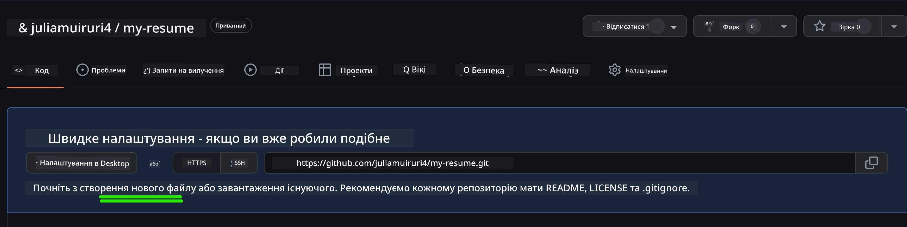
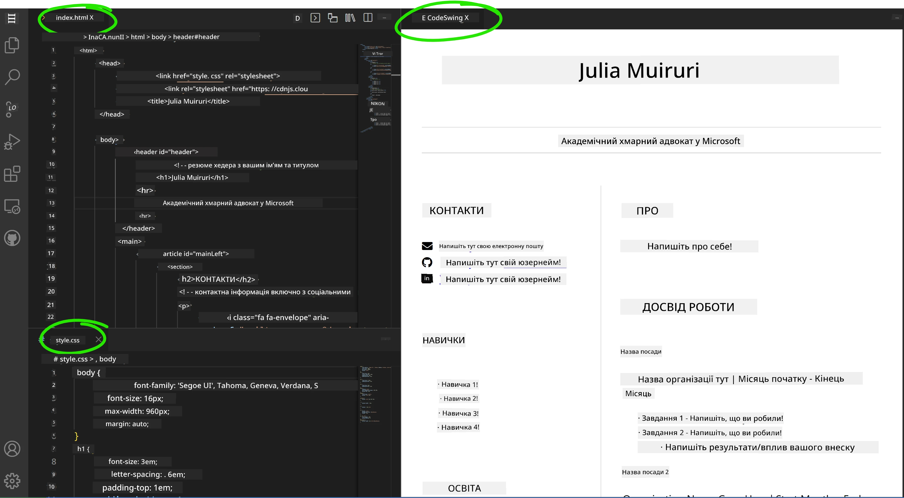

<!--
CO_OP_TRANSLATOR_METADATA:
{
  "original_hash": "effe56ba51c38d7bdfad1ea38288666b",
  "translation_date": "2025-10-24T15:26:06+00:00",
  "source_file": "8-code-editor/1-using-a-code-editor/assignment.md",
  "language_code": "uk"
}
-->
# Створення вебсайту-резюме за допомогою VSCode.dev

Покращіть свої кар'єрні перспективи, створивши професійний вебсайт-резюме, який демонструє ваші навички та досвід у інтерактивному, сучасному форматі. Замість того, щоб надсилати традиційні PDF-файли, уявіть, що ви надаєте рекрутерам стильний, адаптивний вебсайт, який показує як ваші кваліфікації, так і ваші здібності у веброзробці.

Це практичне завдання дозволить вам застосувати всі навички роботи з VSCode.dev, створюючи щось дійсно корисне для вашої кар'єри. Ви пройдете повний цикл веброзробки – від створення репозиторію до розгортання – все у вашому браузері.

Завершивши цей проєкт, ви матимете професійний онлайн-профіль, який легко ділитися з потенційними роботодавцями, оновлювати відповідно до зростання ваших навичок і налаштовувати відповідно до вашого особистого бренду. Це саме той практичний проєкт, який демонструє реальні навички веброзробки.

## Цілі навчання

Після завершення цього завдання ви зможете:

- **Створювати** та керувати повним проєктом веброзробки за допомогою VSCode.dev
- **Структурувати** професійний вебсайт за допомогою семантичних елементів HTML
- **Стилізувати** адаптивні макети за допомогою сучасних технік CSS
- **Реалізовувати** інтерактивні функції за допомогою базових вебтехнологій
- **Розгортати** живий вебсайт, доступний через URL, яким можна ділитися
- **Демонструвати** найкращі практики контролю версій протягом усього процесу розробки

## Передумови

Перед початком цього завдання переконайтеся, що у вас є:

- Обліковий запис GitHub (створіть його на [github.com](https://github.com/), якщо потрібно)
- Завершений урок VSCode.dev, що охоплює навігацію інтерфейсом і базові операції
- Базове розуміння структури HTML і концепцій стилізації CSS

## Налаштування проєкту та створення репозиторію

Почнемо з налаштування основи вашого проєкту. Цей процес відображає реальні робочі процеси розробки, де проєкти починаються з належної ініціалізації репозиторію та планування структури.

### Крок 1: Створіть репозиторій на GitHub

Налаштування окремого репозиторію забезпечує правильну організацію вашого проєкту та контроль версій з самого початку.

1. **Перейдіть** на [GitHub.com](https://github.com) і увійдіть до свого облікового запису
2. **Натисніть** зелену кнопку "New" або значок "+" у верхньому правому куті
3. **Назвіть** ваш репозиторій `my-resume` (або виберіть персоналізовану назву, наприклад, `john-smith-resume`)
4. **Додайте** короткий опис: "Професійний вебсайт-резюме, створений за допомогою HTML та CSS"
5. **Виберіть** "Public", щоб зробити ваше резюме доступним для потенційних роботодавців
6. **Позначте** "Add a README file", щоб створити початковий опис проєкту
7. **Натисніть** "Create repository", щоб завершити налаштування

> 💡 **Порада щодо назви репозиторію**: Використовуйте описові, професійні назви, які чітко вказують на мету проєкту. Це допоможе при спілкуванні з роботодавцями або під час перегляду портфоліо.

### Крок 2: Ініціалізація структури проєкту

Оскільки VSCode.dev вимагає наявності хоча б одного файлу для відкриття репозиторію, ми створимо наш основний HTML-файл безпосередньо на GitHub перед переходом до вебредактора.

1. **Натисніть** посилання "creating a new file" у вашому новому репозиторії
2. **Введіть** `index.html` як ім'я файлу
3. **Додайте** цю початкову структуру HTML:

```html
<!DOCTYPE html>
<html lang="en">
<head>
    <meta charset="UTF-8">
    <meta name="viewport" content="width=device-width, initial-scale=1.0">
    <title>Your Name - Professional Resume</title>
</head>
<body>
    <h1>Your Name</h1>
    <p>Professional Resume Website</p>
</body>
</html>
```

4. **Напишіть** повідомлення про коміт: "Додано початкову структуру HTML"
5. **Натисніть** "Commit new file", щоб зберегти зміни



**Що забезпечує це початкове налаштування:**
- **Встановлює** правильну структуру документа HTML5 із семантичними елементами
- **Включає** метатег viewport для сумісності з адаптивним дизайном
- **Встановлює** описову назву сторінки, яка відображається на вкладках браузера
- **Створює** основу для професійної організації контенту

## Робота у VSCode.dev

Тепер, коли основа вашого репозиторію створена, перейдемо до VSCode.dev для основної роботи над розробкою. Цей вебредактор надає всі необхідні інструменти для професійної веброзробки.

### Крок 3: Відкрийте ваш проєкт у VSCode.dev

1. **Перейдіть** на [vscode.dev](https://vscode.dev) у новій вкладці браузера
2. **Натисніть** "Open Remote Repository" на вітальному екрані
3. **Скопіюйте** URL вашого репозиторію з GitHub і вставте його у відповідне поле

   Формат: `https://github.com/your-username/my-resume`
   
   *Замініть `your-username` на ваш фактичний GitHub-логін*

4. **Натисніть** Enter, щоб завантажити ваш проєкт

✅ **Індикатор успіху**: Ви повинні побачити файли вашого проєкту у боковій панелі Explorer, а `index.html` буде доступний для редагування у головній області редактора.


**Що ви побачите в інтерфейсі:**
- **Бокова панель Explorer**: **Відображає** файли вашого репозиторію та структуру папок
- **Область редактора**: **Показує** вміст вибраних файлів для редагування
- **Панель активності**: **Надає** доступ до функцій, таких як Source Control та Extensions
- **Рядок стану**: **Вказує** статус з'єднання та інформацію про поточну гілку

### Крок 4: Створення контенту резюме

Замініть текст-заглушку в `index.html` на повну структуру резюме. Цей HTML забезпечує основу для професійного представлення ваших кваліфікацій.

<details>
<summary><b>Повна структура HTML для резюме</b></summary>

```html
<!DOCTYPE html>
<html lang="en">
<head>
    <meta charset="UTF-8">
    <meta name="viewport" content="width=device-width, initial-scale=1.0">
    <link href="style.css" rel="stylesheet">
    <link rel="stylesheet" href="https://cdnjs.cloudflare.com/ajax/libs/font-awesome/5.15.4/css/all.min.css">
    <title>Your Name - Professional Resume</title>
</head>
<body>
    <header id="header">
        <h1>Your Full Name</h1>
        <hr>
        <p class="role">Your Professional Title</p>
        <hr>
    </header>
    
    <main>
        <article id="mainLeft">
            <section>
                <h2>CONTACT</h2>
                <p>
                    <i class="fa fa-envelope" aria-hidden="true"></i>
                    <a href="mailto:your.email@domain.com">your.email@domain.com</a>
                </p>
                <p>
                    <i class="fab fa-github" aria-hidden="true"></i>
                    <a href="https://github.com/your-username">github.com/your-username</a>
                </p>
                <p>
                    <i class="fab fa-linkedin" aria-hidden="true"></i>
                    <a href="https://linkedin.com/in/your-profile">linkedin.com/in/your-profile</a>
                </p>
            </section>
            
            <section>
                <h2>SKILLS</h2>
                <ul>
                    <li>HTML5 & CSS3</li>
                    <li>JavaScript (ES6+)</li>
                    <li>Responsive Web Design</li>
                    <li>Version Control (Git)</li>
                    <li>Problem Solving</li>
                </ul>
            </section>
            
            <section>
                <h2>EDUCATION</h2>
                <h3>Your Degree or Certification</h3>
                <p>Institution Name</p>
                <p>Start Date - End Date</p>
            </section>
        </article>
        
        <article id="mainRight">
            <section>
                <h2>ABOUT</h2>
                <p>Write a compelling summary that highlights your passion for web development, key achievements, and career goals. This section should give employers insight into your personality and professional approach.</p>
            </section>
            
            <section>
                <h2>WORK EXPERIENCE</h2>
                <div class="job">
                    <h3>Job Title</h3>
                    <p class="company">Company Name | Start Date – End Date</p>
                    <ul>
                        <li>Describe a key accomplishment or responsibility</li>
                        <li>Highlight specific skills or technologies used</li>
                        <li>Quantify impact where possible (e.g., "Improved efficiency by 25%")</li>
                    </ul>
                </div>
                
                <div class="job">
                    <h3>Previous Job Title</h3>
                    <p class="company">Previous Company | Start Date – End Date</p>
                    <ul>
                        <li>Focus on transferable skills and achievements</li>
                        <li>Demonstrate growth and learning progression</li>
                        <li>Include any leadership or collaboration experiences</li>
                    </ul>
                </div>
            </section>
            
            <section>
                <h2>PROJECTS</h2>
                <div class="project">
                    <h3>Project Name</h3>
                    <p>Brief description of what the project accomplishes and technologies used.</p>
                    <a href="#" target="_blank">View Project</a>
                </div>
            </section>
        </article>
    </main>
</body>
</html>
```
</details>

**Рекомендації щодо налаштування:**
- **Замініть** весь текст-заглушку на вашу реальну інформацію
- **Налаштуйте** розділи відповідно до вашого рівня досвіду та кар'єрного фокусу
- **Додайте** або видаліть розділи за потреби (наприклад, Сертифікати, Волонтерська робота, Мови)
- **Включіть** посилання на ваші реальні профілі та проєкти

### Крок 5: Створення допоміжних файлів

Професійні вебсайти потребують організованої структури файлів. Створіть CSS-стилі та конфігураційні файли, необхідні для повного проєкту.

1. **Наведіть курсор** на назву папки вашого проєкту у боковій панелі Explorer
2. **Натисніть** на значок "New File" (📄+), який з'явиться
3. **Створіть** ці файли по черзі:
   - `style.css` (для стилізації та макету)
   - `codeswing.json` (для конфігурації розширення попереднього перегляду)

**Створення CSS-файлу (`style.css`):**

<details>
<summary><b>Професійна стилізація CSS</b></summary>

```css
/* Modern Resume Styling */
body {
    font-family: 'Segoe UI', Tahoma, Geneva, Verdana, sans-serif;
    font-size: 16px;
    line-height: 1.6;
    max-width: 960px;
    margin: 0 auto;
    padding: 20px;
    color: #333;
    background-color: #f9f9f9;
}

/* Header Styling */
header {
    text-align: center;
    margin-bottom: 3em;
    padding: 2em;
    background: linear-gradient(135deg, #667eea 0%, #764ba2 100%);
    color: white;
    border-radius: 10px;
    box-shadow: 0 4px 6px rgba(0, 0, 0, 0.1);
}

h1 {
    font-size: 3em;
    letter-spacing: 0.1em;
    margin-bottom: 0.2em;
    font-weight: 300;
}

.role {
    font-size: 1.3em;
    font-weight: 300;
    margin: 1em 0;
}

/* Main Content Layout */
main {
    display: grid;
    grid-template-columns: 35% 65%;
    gap: 3em;
    margin-top: 3em;
    background: white;
    padding: 2em;
    border-radius: 10px;
    box-shadow: 0 2px 10px rgba(0, 0, 0, 0.1);
}

/* Typography */
h2 {
    font-size: 1.4em;
    font-weight: 600;
    margin-bottom: 1em;
    color: #667eea;
    border-bottom: 2px solid #667eea;
    padding-bottom: 0.3em;
}

h3 {
    font-size: 1.1em;
    font-weight: 600;
    margin-bottom: 0.5em;
    color: #444;
}

/* Section Styling */
section {
    margin-bottom: 2.5em;
}

#mainLeft {
    border-right: 1px solid #e0e0e0;
    padding-right: 2em;
}

/* Contact Links */
section a {
    color: #667eea;
    text-decoration: none;
    transition: color 0.3s ease;
}

section a:hover {
    color: #764ba2;
    text-decoration: underline;
}

/* Icons */
i {
    margin-right: 0.8em;
    width: 20px;
    text-align: center;
    color: #667eea;
}

/* Lists */
ul {
    list-style: none;
    padding-left: 0;
}

li {
    margin: 0.5em 0;
    padding: 0.3em 0;
    position: relative;
}

li:before {
    content: "▸";
    color: #667eea;
    margin-right: 0.5em;
}

/* Work Experience */
.job, .project {
    margin-bottom: 2em;
    padding-bottom: 1.5em;
    border-bottom: 1px solid #f0f0f0;
}

.company {
    font-style: italic;
    color: #666;
    margin-bottom: 0.5em;
}

/* Responsive Design */
@media (max-width: 768px) {
    main {
        grid-template-columns: 1fr;
        gap: 2em;
    }
    
    #mainLeft {
        border-right: none;
        border-bottom: 1px solid #e0e0e0;
        padding-right: 0;
        padding-bottom: 2em;
    }
    
    h1 {
        font-size: 2.2em;
    }
    
    body {
        padding: 10px;
    }
}

/* Print Styles */
@media print {
    body {
        background: white;
        color: black;
        font-size: 12pt;
    }
    
    header {
        background: none;
        color: black;
        box-shadow: none;
    }
    
    main {
        box-shadow: none;
    }
}
```
</details>

**Створення конфігураційного файлу (`codeswing.json`):**

```json
{
    "scripts": [],
    "styles": []
}
```

**Розуміння функцій CSS:**
- **Використовує** CSS Grid для адаптивної, професійної структури макету
- **Реалізує** сучасні кольорові схеми з градієнтними заголовками
- **Включає** ефекти наведення та плавні переходи для інтерактивності
- **Забезпечує** адаптивний дизайн, який працює на всіх розмірах пристроїв
- **Додає** стилі, зручні для друку, для створення PDF

### Крок 6: Встановлення та налаштування розширень

Розширення покращують ваш досвід розробки, забезпечуючи можливості живого попереднього перегляду та вдосконалені інструменти робочого процесу. Розширення CodeSwing особливо корисне для проєктів веброзробки.

**Встановлення розширення CodeSwing:**

1. **Натисніть** на значок Extensions (🧩) у панелі активності
2. **Знайдіть** "CodeSwing" у полі пошуку маркетплейсу
3. **Виберіть** розширення CodeSwing із результатів пошуку
4. **Натисніть** синю кнопку "Install"


**Що забезпечує CodeSwing:**
- **Дозволяє** живий попередній перегляд вашого вебсайту під час редагування
- **Відображає** зміни в реальному часі без ручного оновлення
- **Підтримує** кілька типів файлів, включаючи HTML, CSS та JavaScript
- **Забезпечує** інтегроване середовище розробки

**Результати після встановлення:**
Після встановлення CodeSwing ви побачите живий попередній перегляд вашого вебсайту-резюме в редакторі. Це дозволяє вам бачити, як виглядає ваш сайт, у міру внесення змін.



**Розуміння покращеного інтерфейсу:**
- **Розділений вигляд**: **Показує** ваш код з одного боку та живий попередній перегляд з іншого
- **Оновлення в реальному часі**: **Відображає** зміни негайно під час введення
- **Інтерактивний попередній перегляд**: **Дозволяє** тестувати посилання та взаємодії
- **Симуляція мобільного вигляду**: **Забезпечує** тестування адаптивного дизайну

### Крок 7: Контроль версій та публікація

Тепер, коли ваш вебсайт-резюме завершено, використовуйте Git, щоб зберегти вашу роботу та зробити її доступною онлайн.

**Фіксація ваших змін:**

1. **Натисніть** на значок Source Control (🌿) у панелі активності
2. **Перегляньте** всі файли, які ви створили та змінили, у розділі "Changes"
3. **Додайте** ваші зміни, натиснувши на значок "+"
4. **Напишіть** описове повідомлення про коміт, наприклад:
   - "Додано повний вебсайт-резюме з адаптивним дизайном"
   - "Реалізовано професійну стилізацію та структуру контенту"
5. **Натисніть** галочку (✓), щоб зафіксувати та відправити ваші зміни

**Приклади ефективних повідомлень про коміт:**
- "Додано професійний контент резюме та стилізацію"
- "Реалізовано адаптивний дизайн для сумісності з мобільними пристроями"
- "Оновлено контактну інформацію та посилання на проєкти"

> 💡 **Професійна порада**: Хороші повідомлення про коміт допомагають відстежувати еволюцію вашого проєкту та демонструють увагу до деталей – якості, які цінують роботодавці.

**Доступ до вашого опублікованого сайту:**
Після фіксації змін ви можете повернутися до вашого репозиторію на GitHub, використовуючи меню гамбургер (☰) у верхньому лівому куті. Ваш вебсайт-резюме тепер контролюється версіями та готовий до розгортання або поширення.

## Результати та наступні кроки

**Вітаємо! 🎉** Ви успішно створили професійний вебсайт-резюме за допомогою VSCode.dev. Ваш проєкт демонструє:
**Технічні навички, які ви продемонстрували:**
- **Управління репозиторієм**: Створення та організація повної структури проєкту
- **Веброзробка**: Створення адаптивного вебсайту за допомогою сучасного HTML5 та CSS3
- **Контроль версій**: Реалізація належного робочого процесу Git із змістовними комітами
- **Професіоналізм у використанні інструментів**: Ефективне використання інтерфейсу VSCode.dev та системи розширень

**Досягнуті професійні результати:**
- **Онлайн-присутність**: URL, яким можна ділитися, що демонструє ваші кваліфікації
- **Сучасний формат**: Інтерактивна альтернатива традиційним PDF-резюме
- **Демонстрація навичок**: Конкретні докази ваших здібностей у веброзробці
- **Легке оновлення**: Основа, яку можна постійно вдосконалювати та налаштовувати

### Варіанти розгортання

Щоб зробити ваше резюме доступним для роботодавців, розгляньте ці варіанти хостингу:

**GitHub Pages (Рекомендовано):**
1. Перейдіть до налаштувань вашого репозиторію на GitHub
2. Прокрутіть до розділу "Pages"
3. Виберіть "Deploy from a branch" та оберіть "main"
4. Ваш сайт буде доступний за адресою `https://your-username.github.io/my-resume`

**Альтернативні платформи:**
- **Netlify**: Автоматичне розгортання з власними доменами
- **Vercel**: Швидке розгортання з сучасними функціями хостингу
- **GitHub Codespaces**: Середовище розробки з вбудованим попереднім переглядом

### Пропозиції щодо вдосконалення

Продовжуйте розвивати свої навички, додаючи ці функції:

**Технічні покращення:**
- **Інтерактивність JavaScript**: Додайте плавне прокручування або інтерактивні елементи
- **Перемикач тем**: Реалізуйте зміну теми для зручності користувачів
- **Форма зворотного зв'язку**: Дозвольте пряме спілкування з потенційними роботодавцями
- **Оптимізація SEO**: Додайте метатеги та структуровані дані для кращої видимості в пошуку

**Покращення контенту:**
- **Портфоліо проєктів**: Додайте посилання на репозиторії GitHub та живі демонстрації
- **Візуалізація навичок**: Створіть шкали прогресу або системи оцінки навичок
- **Розділ рекомендацій**: Включіть відгуки від колег або викладачів
- **Інтеграція блогу**: Додайте розділ блогу, щоб показати ваш шлях навчання

## Виклик GitHub Copilot Agent 🚀

Використовуйте режим Agent, щоб виконати наступний виклик:

**Опис:** Покращіть ваш вебсайт-резюме, додавши
- **Доступність**: Вивчайте рекомендації WCAG для інклюзивного веб-дизайну  
- **Продуктивність**: Досліджуйте інструменти, такі як Lighthouse, для оптимізації  
- **SEO**: Зрозумійте основи пошукової оптимізації  

**Професійний розвиток:**  
- **Створення портфоліо**: Розробляйте додаткові проєкти, щоб продемонструвати різноманітні навички  
- **Відкритий код**: Долучайтеся до існуючих проєктів, щоб отримати досвід співпраці  
- **Нетворкінг**: Діліться своїм сайтом-резюме в спільнотах розробників для отримання відгуків  
- **Безперервне навчання**: Слідкуйте за трендами та технологіями веб-розробки  

---

**Ваші наступні кроки:** Поділіться своїм сайтом-резюме з друзями, родиною або наставниками для отримання відгуків. Використовуйте їхні пропозиції, щоб вдосконалити дизайн. Пам’ятайте, цей проєкт – не просто резюме, а демонстрація вашого розвитку як веб-розробника!

---

**Відмова від відповідальності**:  
Цей документ був перекладений за допомогою сервісу автоматичного перекладу [Co-op Translator](https://github.com/Azure/co-op-translator). Хоча ми прагнемо до точності, будь ласка, майте на увазі, що автоматичні переклади можуть містити помилки або неточності. Оригінальний документ на його рідній мові слід вважати авторитетним джерелом. Для критичної інформації рекомендується професійний людський переклад. Ми не несемо відповідальності за будь-які непорозуміння або неправильні тлумачення, що виникають внаслідок використання цього перекладу.