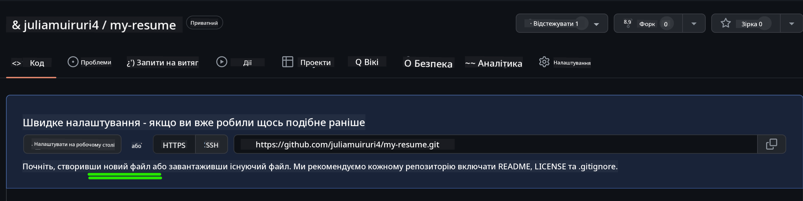

<!--
CO_OP_TRANSLATOR_METADATA:
{
  "original_hash": "bd3aa6d2b879c30ea496c43aec1c49ed",
  "translation_date": "2025-08-28T18:20:39+00:00",
  "source_file": "8-code-editor/1-using-a-code-editor/assignment.md",
  "language_code": "uk"
}
-->
# Створення резюме-сайту за допомогою vscode.dev

_Як круто було б, якби рекрутер попросив ваше резюме, а ви просто надіслали йому посилання?_ 😎

<!----
TODO: додати необов'язкове зображення

> Скечнот від [Ім'я автора](https://example.com)
---->

<!---
## Передлекційна вікторина
[Передлекційна вікторина](https://ff-quizzes.netlify.app/web/quiz/3)
---->

## Цілі

Після цього завдання ви навчитеся:

- Створювати вебсайт для демонстрації вашого резюме

### Попередні вимоги

1. Обліковий запис на GitHub. Перейдіть на [GitHub](https://github.com/) і створіть обліковий запис, якщо у вас його ще немає.

## Кроки

**Крок 1:** Створіть новий репозиторій на GitHub і дайте йому назву `my-resume`

**Крок 2:** Створіть файл `index.html` у вашому репозиторії. Ми додамо хоча б один файл безпосередньо на github.com, оскільки ви не можете відкрити порожній репозиторій у vscode.dev.

Натисніть посилання `creating a new file`, введіть назву `index.html` і виберіть кнопку `Commit new file`.



**Крок 3:** Відкрийте [VSCode.dev](https://vscode.dev) і виберіть кнопку `Open Remote Repository`.

Скопіюйте URL-адресу репозиторію, який ви щойно створили для вашого сайту-резюме, і вставте її у вхідне поле:

_Замініть `your-username` на ваше ім'я користувача GitHub._

```
https://github.com/your-username/my-resume
```

✅ Якщо все вдалося, ви побачите ваш проєкт і файл index.html, відкритий у текстовому редакторі у браузері.


**Крок 4:** Відкрийте файл `index.html`, вставте код нижче у ваш кодовий простір і збережіть.

<details>
    <summary><b>HTML-код, відповідальний за вміст вашого сайту-резюме.</b></summary>
    
        <html>

            <head>
                <link href="style.css" rel="stylesheet">
                <link rel="stylesheet" href="https://cdnjs.cloudflare.com/ajax/libs/font-awesome/5.15.4/css/all.min.css">
                <title>Ваше ім'я тут!</title>
            </head>
            <body>
                <header id="header">
                    <!-- заголовок резюме з вашим ім'ям і посадою -->
                    <h1>Ваше ім'я тут!</h1>
                    <hr>
                    Ваша посада!
                    <hr>
                </header>
                <main>
                    <article id="mainLeft">
                        <section>
                            <h2>КОНТАКТИ</h2>
                            <!-- контактна інформація, включаючи соцмережі -->
                            <p>
                                <i class="fa fa-envelope" aria-hidden="true"></i>
                                <a href="mailto:username@domain.top-level domain">Вкажіть ваш email тут</a>
                            </p>
                            <p>
                                <i class="fab fa-github" aria-hidden="true"></i>
                                <a href="github.com/yourGitHubUsername">Вкажіть ваше ім'я користувача тут!</a>
                            </p>
                            <p>
                                <i class="fab fa-linkedin" aria-hidden="true"></i>
                                <a href="linkedin.com/yourLinkedInUsername">Вкажіть ваше ім'я користувача тут!</a>
                            </p>
                        </section>
                        <section>
                            <h2>НАВИЧКИ</h2>
                            <!-- ваші навички -->
                            <ul>
                                <li>Навичка 1!</li>
                                <li>Навичка 2!</li>
                                <li>Навичка 3!</li>
                                <li>Навичка 4!</li>
                            </ul>
                        </section>
                        <section>
                            <h2>ОСВІТА</h2>
                            <!-- ваша освіта -->
                            <h3>Вкажіть ваш курс тут!</h3>
                            <p>
                                Вкажіть ваш навчальний заклад тут!
                            </p>
                            <p>
                                Початок - Кінець
                            </p>
                        </section>            
                    </article>
                    <article id="mainRight">
                        <section>
                            <h2>ПРО МЕНЕ</h2>
                            <!-- інформація про вас -->
                            <p>Напишіть кілька слів про себе!</p>
                        </section>
                        <section>
                            <h2>ДОСВІД РОБОТИ</h2>
                            <!-- ваш досвід роботи -->
                            <h3>Посада</h3>
                            <p>
                                Назва організації тут | Місяць початку – Місяць закінчення
                            </p>
                            <ul>
                                    <li>Завдання 1 - Опишіть, що ви робили!</li>
                                    <li>Завдання 2 - Опишіть, що ви робили!</li>
                                    <li>Опишіть результати/вплив вашого внеску</li>
                                    
                            </ul>
                            <h3>Посада 2</h3>
                            <p>
                                Назва організації тут | Місяць початку – Місяць закінчення
                            </p>
                            <ul>
                                    <li>Завдання 1 - Опишіть, що ви робили!</li>
                                    <li>Завдання 2 - Опишіть, що ви робили!</li>
                                    <li>Опишіть результати/вплив вашого внеску</li>
                                    
                            </ul>
                        </section>
                    </article>
                </main>
            </body>
        </html>
</details>

Додайте деталі вашого резюме, замінивши _текст-заповнювач_ у HTML-коді.

**Крок 5:** Наведіть курсор на папку My-Resume, натисніть іконку `New File ...` і створіть 2 нові файли у вашому проєкті: `style.css` і `codeswing.json`.

**Крок 6:** Відкрийте файл `style.css`, вставте код нижче і збережіть.

<details>
        <summary><b>CSS-код для форматування макета сайту.</b></summary>
            
            body {
                font-family: 'Segoe UI', Tahoma, Geneva, Verdana, sans-serif;
                font-size: 16px;
                max-width: 960px;
                margin: auto;
            }
            h1 {
                font-size: 3em;
                letter-spacing: .6em;
                padding-top: 1em;
                padding-bottom: 1em;
            }

            h2 {
                font-size: 1.5em;
                padding-bottom: 1em;
            }

            h3 {
                font-size: 1em;
                padding-bottom: 1ем;
            }
            main { 
                display: grid;
                grid-template-columns: 40% 60%;
                margin-top: 3em;
            }
            header {
                text-align: center;
                margin: auto 2em;
            }

            section {
                margin: auto 1em 4em 2em;
            }

            i {
                margin-right: .5em;
            }

            p {
                margin: .2em auto
            }

            hr {
                border: none;
                background-color: lightgray;
                height: 1px;
            }

            h1, h2, h3 {
                font-weight: 100;
                margin-bottom: 0;
            }
            #mainLeft {
                border-right: 1px solid lightgray;
            }
            
</details>

**Крок 6:** Відкрийте файл `codeswing.json`, вставте код нижче і збережіть.

    {
    "scripts": [],
    "styles": []
    }

**Крок 7:** Встановіть розширення `Codeswing`, щоб візуалізувати сайт-резюме у кодовому просторі.

Натисніть іконку _`Extensions`_ на панелі активності та введіть Codeswing. Натисніть _синю кнопку встановлення_ на розширеній панелі активності або використайте кнопку встановлення, яка з'явиться у кодовому просторі після вибору розширення. Після встановлення розширення спостерігайте за змінами у вашому проєкті 😃.


Ось що ви побачите на екрані після встановлення розширення.


Якщо ви задоволені внесеними змінами, наведіть курсор на папку `Changes` і натисніть кнопку `+`, щоб додати зміни.

Введіть повідомлення коміту _(Опис змін, які ви внесли до проєкту)_ і зафіксуйте зміни, натиснувши `check`. Після завершення роботи над проєктом виберіть іконку меню-гамбургер у верхньому лівому куті, щоб повернутися до репозиторію на GitHub.

Вітаємо 🎉 Ви щойно створили свій сайт-резюме за допомогою vscode.dev у кілька кроків.

## 🚀 Виклик

Відкрийте віддалений репозиторій, до якого у вас є права на внесення змін, і оновіть деякі файли. Далі спробуйте створити нову гілку зі своїми змінами та зробити Pull Request.

<!----
## Післялекційна вікторина
[Післялекційна вікторина](https://ff-quizzes.netlify.app/web/quiz/4)
---->

## Огляд і самостійне навчання

Дізнайтеся більше про [VSCode.dev](https://code.visualstudio.com/docs/editor/vscode-web?WT.mc_id=academic-0000-alfredodeza) та інші його функції.

---

**Відмова від відповідальності**:  
Цей документ був перекладений за допомогою сервісу автоматичного перекладу [Co-op Translator](https://github.com/Azure/co-op-translator). Хоча ми прагнемо до точності, будь ласка, майте на увазі, що автоматичні переклади можуть містити помилки або неточності. Оригінальний документ на його рідній мові слід вважати авторитетним джерелом. Для критично важливої інформації рекомендується професійний людський переклад. Ми не несемо відповідальності за будь-які непорозуміння або неправильні тлумачення, що виникають внаслідок використання цього перекладу.